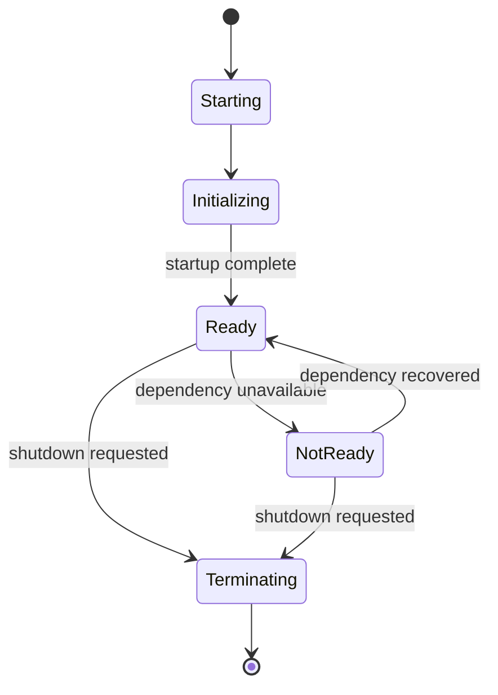

# 30- Health Checks

## Overview

Health checks are application endpoints or mechanisms that report whether a service is able to perform its intended role.

They are primarily used by:

- load balancers;
- Kubernetes;
- container orchestrators;
- service discovery;
- deployment systems;
- monitoring platforms;
- operators.

A health check should answer a narrowly defined operational question.

The most important distinction is between:

```text
Liveness
→ Is the process fundamentally alive?

Readiness
→ Should this instance receive traffic?

Startup
→ Has initialization completed?
```

These checks have different failure semantics.

A production Python service should not use one generic `/health` endpoint for every operational purpose.

---

## Why Health Checks Matter

Without health checks, infrastructure may continue routing traffic to an instance that cannot serve requests:

```text
Load Balancer
      ↓
Unhealthy application
      ↓
Requests fail
```

With appropriate readiness checks:

```text
Load Balancer
      ↓
Readiness check
      ↓
Healthy instances only
```

Health checks therefore support:

- traffic routing;
- automatic recovery;
- rolling deployments;
- autoscaling;
- graceful degradation;
- operational diagnosis.

However, poorly designed health checks can make outages worse.

---

## Health Check Types

| Check | Primary question | Typical consumer | Failure action |
|---|---|---|---|
| Startup | Has initialization completed? | Kubernetes | Wait before liveness/readiness |
| Liveness | Is the process stuck or fundamentally broken? | Kubernetes | Restart instance |
| Readiness | Can this instance receive traffic? | Load balancer/Kubernetes | Remove from traffic |
| Dependency health | Is a dependency reachable? | Monitoring/operators | Diagnose/alert |
| Deep health | Can a complete workflow execute? | Synthetic monitoring | Alert/investigate |

The exact mechanisms vary by platform, but the semantic distinction is important.

---

## Liveness

A liveness check determines whether the application process is fundamentally functioning.

Example:

```http
GET /health/live
```

Response:

```json
{
  "status": "ok"
}
```

A liveness check should generally be:

- cheap;
- local;
- deterministic;
- independent of external dependencies.

For example:

```python
from fastapi import FastAPI

app = FastAPI()


@app.get("/health/live")
async def liveness() -> dict[str, str]:
    return {"status": "ok"}
```

If the Python process can execute the endpoint, the process is alive enough to answer.

---

## Why Liveness Should Be Simple

Consider:

```text
GET /health/live
      ↓
PostgreSQL
      ↓
Redis
      ↓
Kafka
      ↓
External API
```

If PostgreSQL fails:

```text
PostgreSQL failure
      ↓
liveness failure
      ↓
Kubernetes restarts pod
      ↓
new pod checks PostgreSQL
      ↓
fails
      ↓
restarts again
```

This can turn a dependency outage into a restart storm.

Liveness should generally identify process-level failure, not ordinary dependency failure.

---

## Readiness

Readiness determines whether an instance should receive traffic.

Example:

```http
GET /health/ready
```

A readiness check may consider required dependencies:

```text
Application initialized
        +
Database available
        +
Required configuration loaded
        ↓
Ready
```

If a required dependency becomes unavailable:

```text
Readiness fails
      ↓
Pod removed from service endpoints
      ↓
Existing process remains alive
```

This is often safer than restarting the application.

---

## Startup Checks

Startup checks are useful for applications with slow initialization.

Examples include:

- loading large configuration;
- initializing connection pools;
- warming caches;
- loading machine-learning models;
- performing controlled startup migrations;
- initializing expensive clients.

Conceptually:

```text
Container starts
      ↓
Startup check
      ↓
Initialization completes
      ↓
Readiness enabled
      ↓
Liveness enforced
```

Kubernetes `startupProbe` is particularly useful when normal liveness checks would incorrectly restart a slowly starting application.

---

## Health Check Lifecycle



Health status should reflect the application's actual lifecycle rather than simply returning HTTP 200 forever.

---

## Health Check HTTP Semantics

For HTTP-based checks:

```text
2xx
→ healthy / ready

non-2xx
→ unhealthy / not ready
```

The exact status code should match the infrastructure's expectations.

For readiness failures, `503 Service Unavailable` is commonly appropriate:

```python
from fastapi import HTTPException


raise HTTPException(
    status_code=503,
    detail="Database unavailable",
)
```

Do not expose unnecessary dependency details to external clients.

---

## Internal vs Public Health Endpoints

Health endpoints are usually operational interfaces, not public business APIs.

Prefer exposing them only where necessary:

```text
Internet
   ↓
Nginx / Load Balancer
   ↓
Public API

Kubernetes
   ↓
Internal health endpoint
```

Avoid exposing detailed diagnostics publicly.

A public endpoint returning:

```json
{
  "postgresql": "failed",
  "redis": "healthy",
  "kafka": "healthy",
  "internal_host": "db-prod-17.internal"
}
```

can disclose infrastructure information.

---

## Minimal Liveness Endpoint

A minimal implementation:

```python
@app.get("/health/live", include_in_schema=False)
async def liveness() -> dict[str, str]:
    return {"status": "ok"}
```

`include_in_schema=False` can keep operational endpoints out of public OpenAPI documentation when appropriate.

---

## Readiness Implementation

A readiness check may inspect application state:

```python
from fastapi import HTTPException


@app.get("/health/ready", include_in_schema=False)
async def readiness() -> dict[str, str]:
    if not app_state.is_ready:
        raise HTTPException(
            status_code=503,
            detail="Service not ready",
        )

    return {"status": "ok"}
```

The actual dependency checks should usually be managed by application lifecycle state rather than performing expensive network calls on every probe.

---

## Readiness State

A service can maintain explicit lifecycle state:

```text
STARTING
   ↓
READY
   ↓
DRAINING
   ↓
STOPPED
```

Readiness can be false during:

- startup;
- graceful shutdown;
- dependency initialization;
- controlled maintenance;
- overload protection.

This gives the infrastructure an explicit signal that the instance should not receive new work.

---

## Graceful Shutdown

During shutdown:

```text
SIGTERM
  ↓
mark not ready
  ↓
stop accepting new traffic
  ↓
drain active requests
  ↓
finish/cancel background work
  ↓
close resources
  ↓
exit
```

Readiness should become false **before** the process terminates.

This reduces requests being routed to an instance that is already shutting down.

---

## Kubernetes Probes

A Kubernetes deployment may use:

```yaml
livenessProbe:
  httpGet:
    path: /health/live
    port: 8000
  periodSeconds: 10
  timeoutSeconds: 2
  failureThreshold: 3

readinessProbe:
  httpGet:
    path: /health/ready
    port: 8000
  periodSeconds: 5
  timeoutSeconds: 2
  failureThreshold: 2

startupProbe:
  httpGet:
    path: /health/startup
    port: 8000
  periodSeconds: 5
  failureThreshold: 30
```

These values are examples, not universal defaults.

Tune probe timing according to:

- application startup time;
- request latency;
- dependency recovery time;
- deployment strategy;
- failure characteristics.

---

## Kubernetes Probe Semantics

Kubernetes uses probe results to make different decisions.

```text
Startup probe fails
→ container is still starting

Liveness probe fails
→ container may be restarted

Readiness probe fails
→ pod is removed from ready endpoints
```

The distinction is critical.

A readiness failure is often a traffic-routing decision.

A liveness failure is a process-recovery decision.

---

## Probe Configuration

Important parameters include:

| Parameter | Meaning |
|---|---|
| `initialDelaySeconds` | Delay before probing |
| `periodSeconds` | Probe interval |
| `timeoutSeconds` | Maximum probe duration |
| `failureThreshold` | Failures before unhealthy |
| `successThreshold` | Successes required for recovery |
| `terminationGracePeriodSeconds` | Shutdown grace period |

The effective detection time depends on the combination of these settings.

Avoid extremely aggressive probes that react faster than the application can recover.

---

## Probe Timeouts

Health checks should have short, explicit timeouts.

Bad:

```text
probe timeout = 30 seconds
```

when the service normally responds in milliseconds.

A slow health endpoint can consume resources while the system is already under stress.

However, the timeout must be long enough to tolerate normal scheduling and runtime variability.

---

## Probe Traffic

Health checks generate real traffic.

If:

```text
100 pods
×
3 probes
×
every 5 seconds
```

the system receives a substantial number of probe requests.

Avoid expensive work in every probe.

Especially avoid:

```text
probe
 ↓
large SQL query
 ↓
full cache scan
 ↓
external API
```

unless the operational requirement genuinely justifies it.

---

## Dependency Checks

Dependency checks can be categorized.

### Critical Dependencies

Without them, the service cannot perform its primary function.

Example:

```text
Order Service
→ PostgreSQL
```

Database availability may therefore affect readiness.

### Optional Dependencies

The service can still operate in degraded mode.

Example:

```text
Order Service
→ Recommendation API
```

Recommendation failure may not justify failing readiness.

This distinction is essential for resilient architectures.

---

## Dependency Matrix

A useful design artifact is:

| Dependency | Required for readiness? | Failure behavior |
|---|---:|---|
| PostgreSQL | Usually yes | Not ready |
| Redis cache | Depends | Degraded or not ready |
| Kafka producer | Depends | Degraded/not ready |
| Metrics backend | Usually no | Continue |
| Logging collector | Usually no | Continue |
| Recommendation API | Usually no | Degraded |
| Authentication provider | Depends | Depends on service role |

There is no universal dependency policy.

Define readiness based on whether the service can safely perform its advertised function.

---

## Shallow vs Deep Health Checks

### Shallow Check

```text
Process alive
```

Fast and reliable.

### Deep Check

```text
Process
 ↓
database
 ↓
cache
 ↓
external API
 ↓
business operation
```

More comprehensive but more expensive and failure-prone.

Use shallow checks for infrastructure probes and deep checks for diagnostics or synthetic monitoring where appropriate.

---

## Database Health Checks

A simple database readiness check might execute:

```sql
SELECT 1;
```

This confirms basic connectivity.

However, even this should not necessarily execute on every probe.

A better design can maintain connection state through the application's database lifecycle.

For example:

```text
Database connection pool
        ↓
connection failures detected
        ↓
application readiness state
        ↓
readiness endpoint
```

---

## PostgreSQL Health

Database health may involve:

```text
connection acquisition
query execution
transaction behavior
replication status
lock pressure
connection pool capacity
```

A successful `SELECT 1` does not prove that every production query will succeed.

Therefore:

```text
SELECT 1
→ connectivity check

EXPLAIN / application query
→ performance/query behavior

transaction test
→ transactional correctness
```

These are different concerns.

---

## Connection Pool Health

A database can be reachable while the application is unable to acquire a connection.

For example:

```text
PostgreSQL healthy
        ↓
Application pool exhausted
        ↓
Requests waiting
```

Readiness logic may need to consider connection pool saturation in systems where accepting more traffic would be unsafe.

However, automatically failing readiness at the first sign of temporary pool pressure can create oscillation.

Use carefully chosen thresholds.

---

## Redis Health

A Redis dependency check might verify connectivity:

```text
Application
   ↓
Redis connection
   ↓
PING
```

But if Redis is only a cache, a Redis outage may not require the service to become unready.

Instead:

```text
Redis unavailable
 ↓
cache bypass
 ↓
PostgreSQL
```

may be a more resilient architecture.

---

## Kafka Health

Kafka can be more complicated than a simple connectivity check.

A producer being able to connect does not necessarily mean:

```text
messages can be durably published
```

A readiness check should reflect the service's actual requirement.

If Kafka is optional:

```text
Kafka unavailable
→ continue with degraded functionality
```

If Kafka publication is mandatory for every operation:

```text
Kafka unavailable
→ service may need to reject relevant traffic
```

---

## External API Health

Avoid making readiness depend on arbitrary external APIs.

For example:

```text
GET /health/ready
 ↓
Payment provider
 ↓
Google API
 ↓
Analytics API
```

A third-party outage could remove all application instances from service even when the core system is healthy.

Prefer dependency isolation and degraded behavior where possible.

---

## Health Checks and Circuit Breakers

Circuit breakers can help prevent unhealthy dependencies from consuming application capacity.

For example:

```text
External API fails
 ↓
circuit opens
 ↓
requests fail fast / degrade
 ↓
application remains operational
```

The health model can then remain:

```text
service ready
dependency degraded
```

rather than:

```text
service dead
```

This is especially useful for optional dependencies.

---

## Health Checks and Graceful Degradation

A mature service distinguishes:

```text
Cannot serve core operation
```

from:

```text
Cannot serve optional feature
```

Example:

```text
Checkout Service
 ├── PostgreSQL      → required
 ├── Payment API     → required for payment
 ├── Recommendation  → optional
 └── Analytics       → optional
```

The service can remain available when analytics is unavailable.

This prevents cascading outages.

---

## Readiness and Load Balancing

A load balancer may route traffic only to ready instances:

```text
             Load Balancer
             /     |     \
            ↓      ↓      ↓
         Pod A   Pod B   Pod C
         Ready   Ready   NotReady
           ✓       ✓       ✗
```

This is one of the primary operational purposes of readiness.

---

## Health Checks During Rolling Deployment

Suppose a deployment changes:

```text
v1 → v2
```

The deployment controller can:

```text
Start v2
 ↓
Startup probe passes
 ↓
Readiness passes
 ↓
Add v2 to traffic
 ↓
Drain v1
 ↓
Terminate v1
```

This prevents traffic from being sent to a partially initialized instance.

---

## Health Checks and Autoscaling

Health checks are not the same as autoscaling signals.

Use:

```text
readiness
→ traffic eligibility

CPU / memory / queue depth / request rate
→ scaling signals
```

Do not use a simple health endpoint as an autoscaling metric.

---

## Health Checks and Overload

A service can be alive but overloaded:

```text
CPU = 95%
queue depth ↑
latency ↑
health endpoint = 200
```

The liveness check can still pass.

Operational metrics should detect saturation.

Readiness can be used for deliberate overload protection in some architectures, but this should be designed carefully to avoid removing too many instances and worsening the situation.

---

## Health Checks and Backpressure

When downstream capacity is exhausted:

```text
PostgreSQL saturated
 ↓
request latency ↑
 ↓
connection pool wait ↑
 ↓
application backlog ↑
```

A health check that only executes `SELECT 1` may still report healthy.

Health checks are therefore not substitutes for:

- latency metrics;
- connection pool metrics;
- queue metrics;
- saturation monitoring.

---

## Health Checks and Observability

Health endpoints should complement observability.

Useful metrics include:

```text
health_check_requests_total
readiness_failures_total
startup_duration_seconds
dependency_health_failures_total
```

Do not rely on health endpoints as your primary monitoring system.

A readiness endpoint tells infrastructure:

```text
Should traffic be sent here?
```

Metrics tell operators:

```text
Why is the service behaving this way?
```

---

## Health Endpoint Logging

Avoid logging every successful probe at `INFO`.

If Kubernetes probes every few seconds across many pods:

```text
INFO logs
→ huge volume
→ increased cost
→ noisy dashboards
```

Possible approaches:

- suppress successful probe logs;
- use debug-level logging;
- aggregate probe metrics;
- log failures selectively.

---

## Health Endpoint Security

Health endpoints should expose minimal information.

Good:

```json
{
  "status": "ok"
}
```

Potentially sensitive:

```json
{
  "database_host": "...",
  "redis_host": "...",
  "aws_account": "...",
  "internal_version": "...",
  "secret_manager_status": "..."
}
```

Detailed diagnostics should be protected separately.

---

## Detailed Diagnostic Endpoint

An internal diagnostic endpoint can provide more information:

```json
{
  "status": "degraded",
  "dependencies": {
    "postgresql": "healthy",
    "redis": "unhealthy"
  }
}
```

If implemented, protect it with:

- internal networking;
- authentication;
- authorization;
- strict access controls.

Do not expose internal infrastructure information unnecessarily.

---

## Version Information

Version information can be useful operationally:

```json
{
  "status": "ok",
  "version": "1.8.3"
}
```

But exposing exact versions publicly can increase information disclosure.

Prefer making version metadata available through internal observability systems when possible.

---

## Health Checks and Nginx

Nginx or another reverse proxy may terminate TLS and route traffic:

```text
Client
 ↓ HTTPS
Nginx / Load Balancer
 ↓
FastAPI
```

Health checks should target the appropriate layer.

For example:

```text
Load balancer
→ application readiness endpoint
```

while infrastructure monitoring separately verifies:

```text
Nginx
TLS
upstream connectivity
```

A healthy Nginx process does not imply a healthy Python application.

---

## Health Checks and gRPC

gRPC has a standardized health checking protocol.

A service can expose health status such as:

```text
SERVING
NOT_SERVING
UNKNOWN
```

This is preferable to inventing arbitrary HTTP-like semantics for gRPC-native infrastructure.

The same principles apply:

```text
liveness
readiness
dependency health
```

must remain conceptually distinct.

---

## FastAPI Health Checks

A practical FastAPI application might expose:

```python
from fastapi import FastAPI, HTTPException

app = FastAPI()


@app.get("/health/live", include_in_schema=False)
async def live() -> dict[str, str]:
    return {"status": "ok"}


@app.get("/health/ready", include_in_schema=False)
async def ready() -> dict[str, str]:
    if not app.state.ready:
        raise HTTPException(
            status_code=503,
            detail="Service not ready",
        )

    return {"status": "ok"}
```

Application startup can establish readiness:

```python
from contextlib import asynccontextmanager


@asynccontextmanager
async def lifespan(app: FastAPI):
    await initialize_resources()
    app.state.ready = True

    try:
        yield
    finally:
        app.state.ready = False
        await shutdown_resources()


app = FastAPI(lifespan=lifespan)
```

The important behavior is:

```text
startup
→ not ready

initialization complete
→ ready

shutdown begins
→ not ready
```

---

## Django Health Checks

Django can expose lightweight operational endpoints through a dedicated view.

For example:

```python
from django.http import JsonResponse


def liveness(request):
    return JsonResponse({"status": "ok"})
```

Keep health views independent of expensive application logic.

Django applications should also integrate health semantics with:

- Gunicorn;
- Nginx;
- Kubernetes;
- load balancers;
- database connection handling.

---

## Health Checks and Application State

The application should distinguish:

```text
process started
```

from:

```text
application initialized
```

and:

```text
application ready
```

This is especially important when initialization involves:

- asynchronous tasks;
- connection pools;
- cache initialization;
- secret retrieval;
- configuration validation.

---

## Secrets and Health Checks

Never expose secrets through health endpoints.

Bad:

```json
{
  "database_password": "..."
}
```

Even status information about secret-manager access should be carefully considered.

Prefer:

```json
{
  "status": "ok"
}
```

and record detailed operational state in protected telemetry.

---

## Health Checks and Configuration

If required configuration is missing:

```text
DATABASE_URL missing
 ↓
application cannot operate
 ↓
startup/readiness failure
```

Fail fast rather than allowing a partially configured application to receive traffic.

However, optional configuration should not unnecessarily make readiness fail.

---

## Health Checks and Database Migrations

Do not automatically run expensive database migrations inside every health probe.

A safer deployment pattern is:

```text
Migration job
 ↓
migration succeeds
 ↓
application deployment
 ↓
startup
 ↓
readiness
```

For zero-downtime deployments, schema changes should remain compatible with old and new application versions during rollout.

---

## Health Checks and Background Workers

Workers need health semantics too.

A Celery worker might need to expose:

```text
process alive
worker accepting work
broker connectivity
```

A worker can be alive but unable to process jobs because:

```text
Redis/RabbitMQ unavailable
database unavailable
worker pool exhausted
```

Do not reduce all worker states to a single "healthy" boolean.

---

## Kafka Consumer Health

A Kafka consumer can be:

```text
process alive
broker connected
partitions assigned
consumer lag acceptable
processing successfully
```

These are different conditions.

A consumer with:

```text
lag = 2 hours
```

may technically be alive while operationally unhealthy.

Use consumer lag and message age metrics rather than relying solely on a process health endpoint.

---

## Health Checks for Scheduled Jobs

A scheduled job may not need a conventional HTTP readiness endpoint.

Instead monitor:

```text
last successful execution
job duration
failure count
next expected execution
```

For example:

```text
last_success = 09:00
expected_interval = 15 min
current_time = 10:00
```

This indicates an operational failure even if the worker process is alive.

---

## Health Checks and Serverless

In serverless systems such as AWS Lambda, traditional long-running process probes are less relevant.

Instead monitor:

- invocation errors;
- duration;
- throttling;
- concurrency;
- dependency failures;
- cold starts.

Health semantics should match the runtime model.

---

## Health Checks and Service Discovery

Service discovery systems may use health state to determine available instances:

```text
Service Registry
      ↓
Healthy instances
      ↓
Client-side load balancing
```

A false-positive health check can route traffic to broken instances.

A false-negative health check can remove healthy capacity.

Both have operational costs.

---

## False Positives and False Negatives

| Result | Meaning | Risk |
|---|---|---|
| Healthy when broken | False positive | Traffic sent to unhealthy instance |
| Unhealthy when healthy | False negative | Healthy capacity removed |
| Flapping | Unstable result | Routing/restart oscillation |

Health checks should be stable enough to avoid flapping.

---

## Health Check Flapping

Suppose readiness alternates:

```text
healthy
unhealthy
healthy
unhealthy
```

This can cause:

- traffic oscillation;
- connection churn;
- deployment instability;
- noisy alerts.

Use:

- appropriate failure thresholds;
- recovery thresholds;
- hysteresis where applicable;
- stable state tracking.

Do not make readiness depend on extremely noisy signals without smoothing.

---

## Health Check Dependencies and Cascading Failure

Consider:

```text
100 pods
 ↓
each readiness probe
 ↓
external dependency
 ↓
dependency overloaded
```

The health checks themselves can amplify the incident.

This is why dependency probes should be:

- lightweight;
- bounded;
- infrequent enough;
- cached or state-based where appropriate.

---

## Health Check Caching

A dependency health state can sometimes be cached briefly:

```text
Dependency check
 ↓
health state
 ↓
readiness endpoint
```

instead of:

```text
every probe
 ↓
network request
```

This reduces dependency load.

The trade-off is stale health information.

Use caching only when the resulting detection delay is acceptable.

---

## Health Checks and Timeouts

Every dependency health operation should have an explicit timeout.

For example:

```text
Database check
→ 500 ms timeout

External dependency
→ 1 s timeout
```

Never allow a probe to wait indefinitely.

An infrastructure health check should not consume an application worker indefinitely while trying to determine whether another service is healthy.

---

## Health Checks and Asyncio

In an asyncio application, health endpoints should remain non-blocking.

Avoid:

```python
@app.get("/health/ready")
async def ready():
    time.sleep(5)
    return {"status": "ok"}
```

The blocking call can stall the event loop.

Use async-compatible operations or maintain readiness state outside the hot request path.

---

## Health Checks and CPU Starvation

A process can be alive but unable to respond promptly because the event loop or worker is starved.

For example:

```text
CPU-heavy task
 ↓
event loop blocked
 ↓
health endpoint delayed
```

A liveness timeout may eventually fail.

This can be useful if the process is genuinely unable to serve requests, but it should be diagnosed with CPU/event-loop telemetry rather than blindly restarting everything.

---

## Health Checks and Memory Pressure

Memory exhaustion can manifest as:

```text
RSS ↑
 ↓
GC pressure
 ↓
latency ↑
 ↓
OOM kill
```

Health checks alone will not diagnose this.

Monitor:

- RSS;
- container memory;
- OOM kills;
- allocation behavior;
- worker restarts.

---

## Health Checks and High Availability

For highly available services:

```text
Load Balancer
 ├── Region A
 │    ├── Pod 1
 │    └── Pod 2
 │
 └── Region B
      ├── Pod 3
      └── Pod 4
```

Health checks should allow traffic to move away from unhealthy instances without causing healthy instances to fail unnecessarily.

Regional and dependency health should be considered separately.

---

## Health Checks and Disaster Recovery

During disaster recovery, health checks should support controlled recovery:

```text
DR environment starts
 ↓
startup succeeds
 ↓
readiness validates required dependencies
 ↓
traffic gradually enabled
```

Do not declare a recovered service healthy merely because its process started.

Verify the dependencies required for the service's actual role.

---

## Deep Health and Synthetic Monitoring

A deep end-to-end check can validate:

```text
Client
 ↓
Load balancer
 ↓
API
 ↓
Authentication
 ↓
Database
 ↓
External dependency
```

This is better suited to synthetic monitoring than frequent Kubernetes liveness probes.

A synthetic test can periodically perform a safe business workflow using controlled test data.

---

## Health Checks and Testing

Test each health state explicitly.

Examples:

```text
startup not complete
→ startup fails

startup complete
→ startup succeeds

required dependency unavailable
→ readiness fails

optional dependency unavailable
→ readiness remains healthy/degraded

shutdown begins
→ readiness fails

process itself remains responsive
→ liveness succeeds
```

These tests should be part of integration or application lifecycle testing.

---

## Failure Injection

Production systems benefit from controlled failure testing.

Examples:

```text
PostgreSQL unavailable
Redis unavailable
Kafka unavailable
secret manager unavailable
high database latency
network timeout
```

Verify that:

```text
readiness behavior
liveness behavior
retry behavior
graceful degradation
```

match the intended architecture.

---

## CI/CD Validation

Deployment pipelines should validate health behavior.

A rollout can wait for:

```text
startup success
+
readiness success
+
error rate acceptable
```

Then gradually increase traffic.

Health checks should be complemented by application-level smoke tests when necessary.

---

## Common Mistakes

### One `/health` Endpoint for Everything

A single endpoint cannot express:

```text
alive
ready
starting
degraded
```

clearly enough for all consumers.

Use distinct semantics.

### Checking Every Dependency for Liveness

A database outage should not necessarily restart every application process.

Keep liveness local.

### Expensive Health Checks

Running complex SQL or external API calls on every probe can create load during an outage.

Keep probes lightweight.

### No Readiness During Shutdown

If readiness remains true while a pod is terminating, traffic can be routed to a draining process.

Mark it unready early.

### No Timeouts

A stuck health check can consume workers indefinitely.

Use explicit, short timeouts.

### Exposing Dependency Details

Detailed health output can leak internal topology and operational information.

Keep public responses minimal.

### Treating Health as Monitoring

A `200 OK` health endpoint does not tell you whether:

```text
p99 latency = 5 seconds
```

or:

```text
database CPU = 99%
```

Health checks and observability solve different problems.

### Using Health Checks for Autoscaling

Health status is not a useful replacement for:

- CPU;
- memory;
- queue depth;
- request rate;
- custom workload metrics.

### Failing Readiness for Optional Dependencies

An analytics outage should not necessarily remove the checkout service from traffic.

Distinguish core from optional dependencies.

---

## Production Pitfalls

### Readiness Depends on an External Third Party

A third-party outage can make every application instance unready.

Prefer local/core dependency checks and graceful degradation.

### Probe Storm

Large Kubernetes clusters can generate substantial probe traffic.

Keep checks cheap and tune intervals appropriately.

### Restart Storm

Overly strict liveness probes can restart all instances during a temporary dependency failure.

Review liveness semantics carefully.

### Readiness Flapping

Noisy dependencies can repeatedly add/remove instances from traffic.

Use thresholds and stable application state.

### Health Endpoint Uses the Same Broken Resource

If the service's worker pool is exhausted, the health endpoint may also be unable to execute.

Consider dedicated lightweight handling where required by the architecture.

### Health Check Has Hidden Side Effects

Health checks should generally be read-only.

Never let:

```text
GET /health
```

create orders, publish business events, mutate data, or trigger expensive workflows.

### Health Check Queries Huge Tables

A query such as:

```sql
SELECT COUNT(*)
FROM orders;
```

is not a health check.

It can become an expensive database workload.

### Health Check Depends on the Observability System

A service should not become unready because its metrics backend is unavailable unless observability is genuinely part of the service's required function.

---

## Best Practices

- Separate startup, liveness, and readiness semantics.
- Keep liveness checks local and cheap.
- Use readiness to determine traffic eligibility.
- Mark instances unready before graceful shutdown.
- Fail startup when required configuration or initialization cannot complete.
- Keep probe timeouts explicit and short.
- Avoid expensive database queries in frequent probes.
- Avoid depending on third-party services for basic readiness unless absolutely required.
- Distinguish required dependencies from optional dependencies.
- Use graceful degradation for non-critical dependencies.
- Return minimal information from externally accessible health endpoints.
- Protect detailed diagnostics behind appropriate access controls.
- Do not expose secrets, credentials, internal topology, or sensitive metadata.
- Monitor health behavior with metrics rather than relying exclusively on endpoint status.
- Tune Kubernetes `startupProbe`, `readinessProbe`, and `livenessProbe` independently.
- Avoid overly aggressive probe intervals and failure thresholds.
- Test startup, readiness, liveness, and shutdown transitions explicitly.
- Test dependency failures and recovery behavior.
- Use synthetic monitoring for deeper end-to-end validation.
- Keep health endpoints free of side effects.
- Do not use health endpoints as autoscaling metrics.
- Correlate health failures with logs, traces, latency, resource saturation, and dependency metrics.
- Include health behavior in deployment and disaster-recovery procedures.
- Design health checks to fail safely without amplifying dependency outages.

## Operational Checklist

### Application

- [ ] Liveness endpoint exists.
- [ ] Readiness endpoint exists.
- [ ] Startup behavior is defined.
- [ ] Shutdown marks the application unready.
- [ ] Health endpoints are non-blocking.
- [ ] Health checks have no side effects.

### Dependencies

- [ ] Required dependencies are identified.
- [ ] Optional dependencies are identified.
- [ ] Dependency checks have explicit timeouts.
- [ ] Dependency failures do not unnecessarily trigger restarts.
- [ ] Health checks cannot create dependency load spikes.

### Kubernetes

- [ ] `startupProbe` is configured where needed.
- [ ] `readinessProbe` is configured.
- [ ] `livenessProbe` is configured.
- [ ] Probe thresholds match application behavior.
- [ ] Graceful termination is configured.
- [ ] Readiness transitions are tested during rolling deployments.

### Security

- [ ] Public health responses reveal minimal information.
- [ ] Detailed diagnostics are protected.
- [ ] No secrets are exposed.
- [ ] Internal infrastructure details are not unnecessarily exposed.

### Observability

- [ ] Readiness failures are measurable.
- [ ] Startup duration is measured.
- [ ] Dependency failures are observable.
- [ ] Health failures can be correlated with traces and logs.
- [ ] Alerts distinguish service failure from dependency degradation.

### Reliability

- [ ] Health checks have been tested under dependency failure.
- [ ] Probe behavior during overload is understood.
- [ ] Restart storms are prevented.
- [ ] Readiness flapping is controlled.
- [ ] Disaster-recovery health behavior is documented.

## Key Takeaways

- **Liveness, readiness, and startup checks have different purposes:** liveness supports process recovery, readiness controls traffic eligibility, and startup protects slow initialization.
- **Keep health checks cheap and failure-safe:** expensive dependency checks can amplify outages, while overly strict liveness checks can create restart storms.
- **Readiness should reflect the service's actual ability to perform its core role:** optional dependency failures should usually produce graceful degradation rather than remove every instance from traffic.
- **Health checks complement observability rather than replacing it:** metrics, logs, traces, and saturation signals explain why a service is unhealthy.
- **Health behavior must be tested operationally:** validate startup, shutdown, dependency failures, recovery, rolling deployments, overload, and Kubernetes probe behavior before relying on automatic recovery.