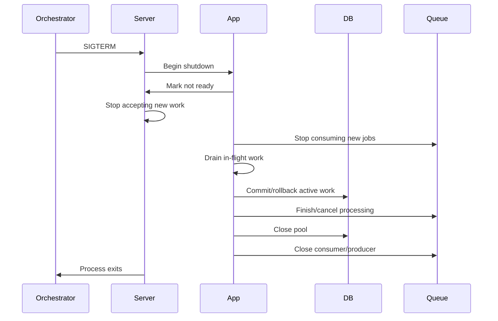

# 31- Graceful Shutdown

## Overview

Graceful shutdown is the controlled termination of a backend process while giving it an opportunity to stop accepting new work, complete safe in-flight work, release resources, and exit cleanly.

A production Python service should treat shutdown as part of its normal lifecycle rather than as an exceptional event.

A typical lifecycle is:

```text
Start
  ↓
Initialize
  ↓
Ready
  ↓
Serve traffic
  ↓
Shutdown requested
  ↓
Stop accepting new work
  ↓
Drain in-flight work
  ↓
Cancel or finalize background work
  ↓
Close resources
  ↓
Exit
```

Graceful shutdown matters because backend processes are routinely terminated during:

- Kubernetes rolling deployments;
- autoscaling;
- node maintenance;
- Docker container replacement;
- CI/CD deployments;
- application restarts;
- instance termination;
- configuration changes;
- planned maintenance.

Without graceful shutdown, termination can cause:

- dropped HTTP requests;
- partially processed jobs;
- lost messages;
- abandoned database transactions;
- incomplete file uploads;
- duplicate work after retries;
- corrupted temporary state;
- unnecessary connection errors.

The goal is not to guarantee that every operation finishes. The goal is to define what happens when work cannot finish and make that behavior safe, bounded, observable, and recoverable.

---

## Why Graceful Shutdown Matters

Consider an application receiving a request:

```text
Client
  ↓
Load Balancer
  ↓
Python application
  ↓
PostgreSQL
```

If the process is terminated while the request is executing:

```text
SIGTERM
  ↓
process exits immediately
  ↓
request interrupted
  ↓
client retries
  ↓
operation may execute again
```

This can create correctness problems.

For example:

```text
POST /payments
```

might charge a customer and then terminate before returning the response.

The client may retry the request.

Therefore, graceful shutdown is related not only to process management but also to:

- idempotency;
- transactions;
- retries;
- message acknowledgment;
- consistency;
- resource ownership.

---

## Graceful vs Abrupt Shutdown

| Shutdown type | Behavior | Typical result |
|---|---|---|
| Graceful | Stop new work and drain existing work | Controlled termination |
| Immediate | Terminate process immediately | In-flight work may be lost |
| Forced | Process cannot perform cleanup | Resources/work may be interrupted |
| Graceful with deadline | Drain for bounded time, then force termination | Predictable shutdown |

Production systems should normally use graceful shutdown with a finite deadline.

---

## Process Signals

Unix-like systems commonly use signals to control processes.

Important signals include:

| Signal | Typical meaning |
|---|---|
| `SIGTERM` | Request termination |
| `SIGINT` | Interrupt, commonly Ctrl+C |
| `SIGQUIT` | Quit, traditionally with diagnostic/core-dump semantics depending on environment |
| `SIGKILL` | Immediate termination; cannot be handled |
| `SIGHUP` | Historically terminal hangup; often application-specific |

`SIGTERM` is the important signal for containerized graceful shutdown.

`SIGKILL` cannot be intercepted.

Therefore:

```text
SIGTERM
→ graceful shutdown opportunity

SIGKILL
→ no cleanup opportunity
```

An application must never depend on cleanup code running in every termination scenario.

---

## Python Signal Handling

Python applications can register signal handlers.

```python
import signal


def handle_sigterm(signum: int, frame: object) -> None:
    print("Shutdown requested")


signal.signal(signal.SIGTERM, handle_sigterm)
```

For production applications, framework and server lifecycle mechanisms are usually preferable to implementing process lifecycle management manually.

Manual signal handlers become complicated when the application uses:

- asyncio;
- multiple worker processes;
- Gunicorn;
- Uvicorn;
- Celery;
- Kubernetes.

---

## Asyncio Shutdown

An asynchronous Python service should coordinate shutdown through an event or cancellation mechanism.

Example:

```python
import asyncio


shutdown_event = asyncio.Event()


async def shutdown_listener() -> None:
    await shutdown_event.wait()


async def application() -> None:
    await initialize()

    try:
        await serve()
    finally:
        await shutdown()
```

In production, the ASGI server generally owns the process signal handling and invokes the application's lifecycle hooks.

The application should focus on:

```text
initialize resources
        ↓
serve
        ↓
stop accepting work
        ↓
cleanup resources
```

---

## FastAPI Lifespan

FastAPI supports application lifespan management.

```python
from contextlib import asynccontextmanager

from fastapi import FastAPI


@asynccontextmanager
async def lifespan(app: FastAPI):
    app.state.db = await create_database_pool()
    app.state.redis = await create_redis_client()

    try:
        yield
    finally:
        await app.state.redis.aclose()
        await app.state.db.close()


app = FastAPI(lifespan=lifespan)
```

The lifecycle is:

```text
Server starts
    ↓
lifespan startup
    ↓
application serves requests
    ↓
shutdown requested
    ↓
lifespan shutdown
    ↓
resources closed
```

This provides a clear ownership boundary for process-scoped resources.

---

## Resource Ownership

A useful rule is:

> The component that creates a resource should normally own its lifecycle.

For example:

```text
Application
 ├── DB connection pool
 ├── Redis client
 ├── HTTP client
 ├── Kafka producer
 └── background task manager
```

The application lifecycle should initialize and close these resources.

Avoid creating long-lived resources inside individual request handlers.

Bad:

```python
@app.get("/orders")
async def orders():
    client = create_http_client()
    ...
```

This can create excessive connections and makes cleanup difficult.

Prefer process-scoped clients and pools when appropriate.

---

## Shutdown Lifecycle

A robust service can follow this sequence:



The exact implementation depends on the runtime, but the ordering is important.

---

## Stop Accepting New Work

The first major shutdown step is to stop admitting new work.

For HTTP services:

```text
readiness = false
        ↓
load balancer stops routing new requests
```

For consumers:

```text
stop fetching new messages
```

For background workers:

```text
stop accepting new jobs
```

Existing work can then be drained independently.

---

## Readiness During Shutdown

A service should generally become unready before termination.

```text
SIGTERM
  ↓
readiness = false
  ↓
traffic drains
  ↓
in-flight requests finish
  ↓
resources close
  ↓
process exits
```

This connects graceful shutdown directly to health-check design.

If readiness remains true until the process exits, the load balancer may continue routing traffic to a terminating instance.

---

## Connection Draining

Connection draining gives clients and load balancers time to stop sending work.

For HTTP:

```text
new requests
→ rejected/not routed

existing requests
→ allowed to complete
```

For HTTP/2 or HTTP/3, connection and stream semantics are more complex, but the same principle applies: stop admitting new application work while allowing safe in-flight operations to finish.

---

## Shutdown Deadlines

Graceful shutdown must be bounded.

Bad:

```text
wait forever for every request
```

A stuck request can prevent process termination indefinitely.

Use:

```text
shutdown deadline
        ↓
attempt graceful drain
        ↓
deadline reached
        ↓
force remaining work to terminate
```

The deadline should be long enough for normal operations but short enough for deployments and recovery to remain predictable.

---

## Kubernetes Termination Lifecycle

A simplified Kubernetes termination sequence is:

```text
Pod termination requested
        ↓
Pod begins termination
        ↓
application receives termination signal
        ↓
readiness/traffic draining occurs
        ↓
application performs graceful shutdown
        ↓
termination grace period expires
        ↓
remaining process may be forcefully terminated
```

The exact interaction with endpoint removal and load-balancer propagation depends on the Kubernetes networking and service implementation.

The important engineering requirement is to leave sufficient time for traffic draining and application cleanup.

---

## Kubernetes `terminationGracePeriodSeconds`

Example:

```yaml
spec:
  terminationGracePeriodSeconds: 30
```

This is the maximum termination window Kubernetes provides before forceful termination.

Choose the value based on actual workloads.

If normal requests can take 60 seconds, a 10-second grace period is insufficient.

If requests normally complete within 500 ms, an excessively long grace period may unnecessarily delay deployments.

---

## Deployment Timing

Consider:

```text
request p99 = 2 seconds
```

A shutdown grace period of:

```text
30 seconds
```

may be sufficient for normal draining.

But this depends on:

- long-running requests;
- streaming responses;
- database operations;
- background tasks;
- external API calls.

Measure real workloads rather than choosing arbitrary values.

---

## Shutdown Deadline Budget

The total shutdown budget should account for multiple stages:

```text
termination grace period
        │
        ├── traffic drain
        ├── request completion
        ├── background work
        ├── resource cleanup
        └── final process exit
```

Do not allocate the entire deadline to one subsystem.

For example:

```text
30 seconds total

5s   → traffic drain
20s  → in-flight work
3s   → resource cleanup
2s   → safety margin
```

The exact values depend on the application.

---

## Long-Running Requests

Long-running operations require explicit design.

Examples:

- file uploads;
- exports;
- streaming responses;
- report generation;
- large database queries;
- server-sent events;
- WebSocket connections.

Do not assume they can always finish during a normal shutdown window.

For long-running work, consider:

```text
request
 ↓
create durable job
 ↓
return job ID
 ↓
background worker processes job
```

This separates user-facing request lifetime from processing lifetime.

---

## Streaming Responses

Streaming complicates shutdown.

For example:

```text
GET /export
      ↓
large streaming response
      ↓
SIGTERM
```

The process may not be able to complete the stream before the shutdown deadline.

Possible strategies include:

- allow a bounded drain period;
- terminate the stream cleanly;
- make the operation resumable;
- move long-running work to background processing.

---

## WebSockets

WebSocket connections can remain open for long periods.

During shutdown:

```text
stop accepting new connections
        ↓
notify existing clients
        ↓
close connections
        ↓
release resources
```

Clients should be designed to reconnect when appropriate.

Do not rely on a long shutdown timeout to preserve indefinite WebSocket sessions.

---

## Server-Sent Events

SSE connections can also be long-lived.

A graceful shutdown should:

```text
stop accepting new streams
        ↓
close active streams
        ↓
allow clients to reconnect
```

Application protocols should tolerate reconnection.

---

## Database Transactions

Transactions must be handled carefully during shutdown.

Consider:

```text
request
 ↓
BEGIN
 ↓
UPDATE
 ↓
SIGTERM
 ↓
process exits
```

An uncommitted transaction should not be treated as successfully completed.

Database connection cleanup should cause the transaction to roll back if it has not committed.

The key rule is:

> Commit durable state before acknowledging successful completion.

---

## Short Transactions

Long transactions make graceful shutdown harder.

Avoid:

```text
BEGIN
 ↓
external API call
 ↓
sleep
 ↓
large computation
 ↓
COMMIT
```

This can hold:

- database connections;
- locks;
- snapshots;
- transaction state.

Keep transactions short and perform unrelated work outside the transaction where possible.

---

## Database Connection Pool Shutdown

During shutdown:

```text
stop new requests
        ↓
wait for in-flight database operations
        ↓
close database pool
```

Do not close the pool while active request handlers still depend on it.

This is one reason shutdown ordering matters.

---

## Redis Clients

Redis connections should also be closed after active work using them has drained.

For example:

```python
await redis.aclose()
```

The exact API depends on the Redis client version.

The general ownership model is:

```text
create process-scoped client
        ↓
reuse during process lifetime
        ↓
close during shutdown
```

---

## HTTP Clients

Process-scoped HTTP clients such as `httpx.AsyncClient` maintain connection pools.

```python
import httpx


client = httpx.AsyncClient(timeout=5.0)

try:
    response = await client.get("https://example.internal")
finally:
    await client.aclose()
```

In a long-running application, create and close the client at application lifecycle boundaries rather than for every request.

During shutdown, wait for active operations before closing shared clients.

---

## Kafka Producers

A Kafka producer may have buffered or in-flight messages.

Shutdown must account for:

```text
application
 ↓
producer buffer
 ↓
broker
```

If the producer is closed too early, buffered messages may not be published.

Use the client's documented flush/close semantics and define what happens when the shutdown deadline is exceeded.

For critical messages, durability should also be designed around:

- producer acknowledgments;
- retries;
- idempotency;
- transactional/outbox patterns where appropriate.

---

## Kafka Consumers

A consumer should stop accepting new work before shutdown.

Conceptually:

```text
SIGTERM
 ↓
stop polling/consuming
 ↓
finish current message
 ↓
commit offset
 ↓
leave consumer group
 ↓
close consumer
```

The ordering matters.

Do not commit an offset before the corresponding work is durably complete.

---

## Celery Workers

A Celery worker also needs graceful shutdown semantics.

A useful sequence is:

```text
shutdown requested
 ↓
stop accepting new tasks
 ↓
finish currently executing tasks
 ↓
acknowledge completed work
 ↓
close broker connections
 ↓
exit
```

The exact behavior depends on worker configuration and execution model.

Critical tasks should still be designed for retries and idempotency because graceful shutdown cannot guarantee completion.

---

## Message Acknowledgment

For at-least-once processing:

```text
receive message
 ↓
process
 ↓
durably complete work
 ↓
ACK
```

During shutdown:

```text
message currently processing
 ↓
finish if possible
 ↓
ACK
```

If the process terminates before completion:

```text
no ACK
 ↓
message becomes available again
 ↓
another worker retries
```

This is why idempotent consumers remain necessary even with graceful shutdown.

---

## Background Tasks

Python applications may create background tasks:

```python
task = asyncio.create_task(process_events())
```

These tasks must have explicit ownership.

Track them:

```python
tasks: set[asyncio.Task[None]] = set()

task = asyncio.create_task(process_events())
tasks.add(task)
task.add_done_callback(tasks.discard)
```

During shutdown:

```text
stop producing new work
 ↓
wait for owned tasks
 ↓
cancel tasks that exceed deadline
```

Never create untracked long-lived tasks and assume the runtime will manage them correctly.

---

## Cancelling Asyncio Tasks

Cancellation is cooperative.

```python
task.cancel()
```

requests cancellation by injecting `CancelledError` at an appropriate suspension point.

Code should allow cancellation to propagate.

Bad:

```python
try:
    await operation()
except asyncio.CancelledError:
    pass
```

This silently suppresses cancellation and can prevent timely shutdown.

If cleanup is required:

```python
try:
    await operation()
finally:
    await cleanup()
```

Allow `CancelledError` to propagate unless there is a deliberate reason to transform it.

---

## Cancellation Safety

Cancellation can occur at arbitrary `await` boundaries.

Therefore, operations should be designed so cancellation does not leave inconsistent state.

For critical state changes:

```text
transaction
 ↓
atomic operation
 ↓
commit
```

is safer than:

```text
update A
await
update B
await
```

without a consistency boundary.

---

## `asyncio.TaskGroup`

Modern Python provides `asyncio.TaskGroup` for structured concurrency.

```python
import asyncio


async def run_workers() -> None:
    async with asyncio.TaskGroup() as group:
        group.create_task(worker_one())
        group.create_task(worker_two())
        group.create_task(worker_three())
```

When the task group exits, its child tasks have completed or the group's failure semantics trigger coordinated cancellation.

Structured concurrency makes task ownership and shutdown easier to reason about.

---

## Resource Cleanup with `finally`

Use `finally` for cleanup that should happen when an operation exits.

```python
resource = await acquire_resource()

try:
    await use_resource(resource)
finally:
    await resource.close()
```

For process-scoped resources, prefer application lifecycle management.

For request-scoped resources, prefer context managers or dependency lifecycle mechanisms.

---

## Context Managers

Context managers make ownership explicit:

```python
from contextlib import asynccontextmanager


@asynccontextmanager
async def resource():
    connection = await connect()

    try:
        yield connection
    finally:
        await connection.close()
```

This prevents cleanup logic from being duplicated across success and failure paths.

---

## Shutdown Ordering

A typical shutdown ordering is:

```text
1. Mark application not ready
2. Stop accepting new requests
3. Stop accepting new jobs/messages
4. Drain in-flight requests
5. Finish or cancel background work
6. Commit/rollback active operations
7. Close external clients and connection pools
8. Flush required telemetry
9. Exit
```

The exact ordering can differ by system.

The critical principle is:

> Never close a dependency before the work that depends on it has stopped.

---

## Telemetry During Shutdown

Shutdown itself should be observable.

Useful events include:

```text
shutdown_requested
shutdown_started
traffic_draining
background_tasks_draining
resources_closing
shutdown_timeout
shutdown_complete
```

Do not depend on remote telemetry being available during the final milliseconds of process lifetime.

Critical shutdown information should be emitted early enough to be captured.

---

## Logging During Shutdown

Example:

```python
logger.info(
    "Application shutdown requested",
    extra={"event": "shutdown_requested"},
)
```

At completion:

```python
logger.info(
    "Application shutdown complete",
    extra={"event": "shutdown_complete"},
)
```

If the deadline expires:

```python
logger.warning(
    "Shutdown deadline exceeded",
    extra={
        "event": "shutdown_timeout",
        "remaining_tasks": remaining_tasks,
    },
)
```

Avoid logging sensitive resource details.

---

## Metrics

Useful shutdown metrics include:

```text
shutdown_total
shutdown_duration_seconds
shutdown_timeout_total
in_flight_requests
background_tasks_at_shutdown
```

These help answer:

```text
Are deployments consistently draining?
Are shutdowns exceeding their budget?
Which workload prevents fast termination?
```

---

## Shutdown Timeout Monitoring

If graceful shutdown regularly reaches its deadline:

```text
shutdown duration ↑
      ↓
deadline exceeded
      ↓
forced termination
```

this is an operational problem.

Investigate:

- long-running requests;
- stuck database operations;
- external API timeouts;
- background tasks;
- message processing;
- connection cleanup.

Do not simply increase the shutdown timeout indefinitely.

---

## Graceful Shutdown and Retries

Shutdown can cause retries.

Example:

```text
POST /orders
 ↓
server processing
 ↓
SIGTERM
 ↓
connection lost
 ↓
client retries
```

If the operation is not idempotent, duplicate state may be created.

Use:

- idempotency keys;
- unique database constraints;
- transactional operations;
- durable job state.

Graceful shutdown reduces unnecessary failures but cannot eliminate network ambiguity.

---

## Graceful Shutdown and Idempotency

A robust backend assumes:

```text
work may execute more than once
```

For example:

```python
INSERT INTO payments (
    idempotency_key,
    amount
)
VALUES (
    :key,
    :amount
)
ON CONFLICT (idempotency_key) DO NOTHING;
```

The database provides a durable uniqueness boundary.

This protects against both:

- shutdown;
- retries;
- duplicate messages;
- client retransmission.

---

## Shutdown and HTTP Status Codes

If shutdown has started but a request has not begun processing, the server should normally stop accepting it through traffic draining.

For requests that are already executing, behavior depends on the server and operation.

Clients should treat connection failures and retryable statuses according to their idempotency policy.

Do not rely on returning a custom status from every request during shutdown.

---

## Shutdown and Load Balancers

A load balancer may take time to stop routing traffic after an instance becomes unavailable.

Therefore:

```text
readiness false
        ↓
endpoint propagation
        ↓
traffic decreases
        ↓
application drains
```

The shutdown budget must account for propagation delays.

This is one reason readiness should change as early as possible.

---

## Shutdown and Nginx

With Nginx in front of Python:

```text
Client
 ↓
Nginx
 ↓
Uvicorn/Gunicorn
 ↓
FastAPI/Django
```

Nginx and the application server have their own connection and shutdown behavior.

A production shutdown plan should consider:

- proxy connection draining;
- keep-alive connections;
- upstream connection handling;
- application worker termination.

Do not assume stopping the Python process alone creates perfect request draining.

---

## Gunicorn and Uvicorn

For FastAPI deployments, a common stack is:

```text
Nginx / Load Balancer
        ↓
Gunicorn
        ↓
Uvicorn workers
        ↓
FastAPI
```

Process managers and application servers already implement substantial signal and worker lifecycle behavior.

Prefer configuring their supported graceful-shutdown mechanisms instead of replacing them with custom signal logic.

---

## Multiple Worker Processes

A single container may run multiple Python worker processes:

```text
Container
├── Worker 1
├── Worker 2
├── Worker 3
└── Worker 4
```

Each process has its own:

- event loop;
- memory;
- database pool;
- HTTP clients;
- Redis clients.

Shutdown must therefore be coordinated across workers.

Do not assume one worker's cleanup automatically cleans resources owned by another process.

---

## Forking and Resource Ownership

Resources created before process forking can have unsafe ownership semantics.

For example:

```text
parent
 ↓
creates DB connection
 ↓
fork
 ├── child A
 └── child B
```

Database connections generally should not be shared across forked workers.

Initialize process-local resources after worker creation where the server architecture requires it.

This applies to:

- database pools;
- sockets;
- event loops;
- network clients.

---

## Shutdown and Threads

Threads also require lifecycle management.

A process should know which threads it owns and whether they:

- can terminate;
- need cancellation;
- must finish current work.

Non-daemon threads can prevent process termination.

Daemon threads should not be used as a substitute for reliable cleanup because they can be terminated abruptly with the process.

---

## Shutdown and Multiprocessing

For multiprocessing:

```text
Parent
 ├── child process A
 ├── child process B
 └── child process C
```

the parent must coordinate process termination.

Use:

```text
stop accepting work
 ↓
signal workers
 ↓
drain where practical
 ↓
join
 ↓
terminate remaining workers if deadline exceeded
```

Avoid indefinite joins.

---

## Shutdown and Queues

For producer-consumer systems:

```text
Producer
 ↓
Queue
 ↓
Workers
```

shutdown should generally:

```text
stop producers
 ↓
stop accepting new messages
 ↓
drain queue according to policy
 ↓
finish workers
 ↓
close queue connections
```

Whether the queue itself should be drained completely depends on the workload and shutdown deadline.

For durable queues, leaving unprocessed messages is often preferable to waiting indefinitely.

---

## Shutdown and Backpressure

Graceful shutdown should not continue accepting unlimited work while draining.

Otherwise:

```text
shutdown begins
 ↓
new work continues arriving
 ↓
drain never completes
```

Admission control must stop new work.

This is particularly important for:

- job workers;
- streaming systems;
- message consumers;
- long-running HTTP services.

---

## Shutdown and Kafka Consumer Groups

Stopping a Kafka consumer cleanly helps the group rebalance.

Conceptually:

```text
consumer stops polling
 ↓
finish current records
 ↓
commit processed offsets
 ↓
close consumer
 ↓
group rebalances
```

Long processing times may require careful consumer configuration so the broker does not consider the consumer dead while it is legitimately processing records.

---

## Shutdown and Celery

Celery workloads should remain recoverable.

For important tasks:

```text
task starts
 ↓
work executes
 ↓
durable state updated
 ↓
task acknowledged
```

If shutdown interrupts processing:

```text
task not safely completed
 ↓
retry / redelivery
```

Design the task for idempotency rather than relying on shutdown to finish every job.

---

## Shutdown and File Processing

Large file processing should use checkpoints where possible.

Instead of:

```text
10 GB file
 ↓
one giant operation
```

prefer:

```text
file
 ↓
chunks
 ↓
checkpoint progress
 ↓
durable state
```

Then shutdown can safely stop processing and resume later.

This is particularly important for Celery and batch-processing workloads.

---

## Shutdown and External APIs

Avoid holding critical database transactions while waiting for external APIs.

Bad:

```text
BEGIN
 ↓
call payment provider
 ↓
wait
 ↓
SIGTERM
 ↓
transaction remains open
```

Prefer short transaction boundaries and explicit workflow state.

For distributed workflows, use patterns such as:

- outbox;
- idempotency;
- compensation;
- saga-style orchestration.

---

## Shutdown and Distributed Systems

Graceful shutdown is local.

It cannot atomically coordinate:

```text
Service A
Service B
PostgreSQL
Kafka
External API
```

There is no general:

```text
shutdown all systems atomically
```

mechanism.

Therefore distributed operations need durable state and recovery semantics.

---

## Shutdown and the Transactional Outbox

Consider:

```text
HTTP request
 ↓
PostgreSQL transaction
 ├── update order
 └── insert outbox event
 ↓
commit
 ↓
outbox publisher
 ↓
Kafka
```

If shutdown occurs after the database commit but before Kafka publication:

```text
outbox row remains
 ↓
publisher resumes later
 ↓
event published
```

This is much safer than trying to synchronously coordinate a database transaction and message publication during process shutdown.

---

## Shutdown and Caching

Caches usually do not require complex shutdown semantics.

For Redis:

```text
stop new requests
 ↓
finish cache operations
 ↓
close client
```

Do not spend a large shutdown budget flushing ephemeral cache state unless the application explicitly depends on it.

---

## Shutdown and Temporary State

Temporary files and local buffers may need cleanup.

However, cleanup should be bounded.

Do not let:

```text
delete huge temporary directory
```

prevent process termination indefinitely.

Durable data should not depend on process-local temporary state surviving shutdown.

---

## Shutdown and Security

Graceful shutdown should not leak sensitive data.

Avoid logging:

```text
database credentials
access tokens
request bodies containing secrets
private keys
```

during cleanup or diagnostic reporting.

Also ensure shutdown cannot be triggered by unauthorized external requests unless explicitly designed that way.

Process termination should generally be controlled by the operating environment.

---

## Shutdown and Secret Rotation

Secret rotation can require restarting or reloading application resources.

A safe pattern is:

```text
new secret/configuration
 ↓
initialize new client
 ↓
validate
 ↓
switch traffic/resource usage
 ↓
close old resource
```

This is safer than terminating the application first and hoping startup succeeds.

---

## Shutdown and High Availability

High availability requires overlapping capacity during deployment:

```text
Old instances
████████
      ↓
New instances
    ████████
```

A graceful shutdown allows old instances to drain while new instances become ready.

The objective is:

```text
available capacity remains sufficient
```

throughout the rollout.

---

## Shutdown and Autoscaling

Autoscaling frequently terminates instances.

Therefore graceful shutdown must work for routine scale-in events.

A service that only shuts down correctly during manual maintenance is not production-ready.

---

## Shutdown and Disaster Recovery

During disaster recovery, processes may be terminated more abruptly than during planned deployments.

Therefore graceful shutdown is useful but not sufficient.

Critical state must be recoverable from durable systems:

```text
PostgreSQL
Kafka
Object Storage
Durable job state
```

Never rely solely on process memory for important work.

---

## Testing Graceful Shutdown

Test shutdown as a first-class behavior.

Important scenarios include:

```text
shutdown while idle
shutdown during HTTP request
shutdown during database transaction
shutdown during external API call
shutdown during Kafka processing
shutdown during Celery task
shutdown with active WebSocket
shutdown with active background task
shutdown at deadline
```

The test should verify both:

```text
cleanup
```

and:

```text
correctness
```

---

## Integration Testing

An integration test can start the real application and trigger termination.

Verify:

- readiness changes;
- new traffic stops;
- existing requests drain;
- resources close;
- process exits within deadline;
- incomplete work remains recoverable.

For message consumers, verify that unacknowledged work can be redelivered safely.

---

## Failure Injection

Controlled failure testing should include:

```text
database becomes slow
Redis unavailable
Kafka unavailable
external API hangs
worker task hangs
network connection drops
shutdown deadline expires
```

The goal is to verify that shutdown does not depend on every external dependency behaving correctly.

---

## Common Mistakes

### Relying on `atexit`

`atexit` is not a reliable guarantee for every process termination scenario.

It does not protect against:

```text
SIGKILL
process crash
host failure
OOM kill
```

Use lifecycle management for normal shutdown, but design critical state to survive abrupt termination.

### Waiting Forever

A shutdown that never completes is not graceful.

Always use a bounded deadline.

### Closing Resources Too Early

This can interrupt active requests:

```text
shutdown
 ↓
close DB
 ↓
request still executing
 ↓
database error
```

Drain dependent work before closing its resources.

### Swallowing `CancelledError`

Suppressing cancellation can prevent async tasks from shutting down.

Allow cancellation to propagate unless intentionally handled.

### Continuing to Accept Work

If shutdown starts but workers continue consuming messages, draining may never finish.

Stop admission first.

### Treating Shutdown as a Rare Event

Deployments and autoscaling make shutdown routine.

Test it continuously.

### Assuming Cleanup Always Runs

OOM kills and node failures can bypass application cleanup.

Critical state must be durable before acknowledgment.

### Increasing the Shutdown Timeout Indefinitely

A large timeout can hide stuck operations.

Investigate why shutdown takes too long.

---

## Production Pitfalls

### Database Connection Pool Closed Before Requests Drain

This causes failures in otherwise healthy in-flight requests.

### External API Call Blocks Shutdown

Unbounded downstream timeouts can consume the entire shutdown window.

Every outbound operation should have an explicit timeout.

### Background Task Is Untracked

The application cannot wait for or cancel a task it does not own.

Track long-lived tasks explicitly.

### Kafka Offset Committed Too Early

If the offset is committed before processing completes, shutdown can cause permanent message loss from the consumer's perspective.

### Celery Task Assumed to Finish Exactly Once

Shutdown can interrupt a task.

Design for retries and idempotency.

### Readiness Changes Too Late

If readiness remains true during most of shutdown, the load balancer can continue sending traffic to the terminating instance.

### Grace Period Is Shorter Than Real Work

The application may be forcefully terminated before normal requests finish.

Measure request and job duration distributions.

### Telemetry Flush Blocks Shutdown

A remote observability backend can be unavailable.

Telemetry flushing must be bounded and should not prevent safe process termination indefinitely.

---

## Production Architecture

A typical Kubernetes deployment can use:

```text
                    Load Balancer
                         │
                         ▼
                  Kubernetes Service
                         │
              ┌──────────┼──────────┐
              ▼          ▼          ▼
            Pod A      Pod B      Pod C
             │          │          │
          Ready       Ready      Draining
             │          │          │
             ▼          ▼
         FastAPI     FastAPI
             │          │
       ┌─────┼─────┐    │
       ▼     ▼     ▼    ▼
      DB   Redis  Kafka DB
```

During deployment:

```text
New pod
  ↓
startup
  ↓
ready
  ↓
receives traffic

Old pod
  ↓
SIGTERM
  ↓
not ready
  ↓
drain
  ↓
close resources
  ↓
exit
```

This pattern supports rolling deployments without unnecessarily dropping in-flight traffic.

---

## Recommended Shutdown Design

A mature Python backend should establish explicit ownership for:

```text
HTTP server
database pools
Redis clients
HTTP clients
Kafka consumers/producers
Celery workers
background asyncio tasks
thread pools
process pools
temporary resources
telemetry exporters
```

For each resource define:

| Resource | Start | Stop | Shutdown rule |
|---|---|---|---|
| DB pool | Application startup | Application shutdown | Drain DB users first |
| Redis client | Application startup | Application shutdown | Close after active operations |
| HTTP client | Application startup | Application shutdown | Wait for requests |
| Kafka consumer | Worker startup | Worker shutdown | Finish/commit processed work |
| Kafka producer | Worker startup | Worker shutdown | Flush/close within deadline |
| Background task | Application startup | Shutdown | Cancel/drain explicitly |
| Thread pool | Startup | Shutdown | Stop submission and join boundedly |
| Process pool | Startup | Shutdown | Stop submission and join boundedly |
| Telemetry | Startup | Shutdown | Flush only within bounded budget |

---

## Shutdown Decision Framework

When designing shutdown behavior, ask:

```text
What work can arrive?
        ↓
How do we stop new work?
        ↓
What work is currently running?
        ↓
Can it finish within the deadline?
        ↓
If not, can it safely retry?
        ↓
What state must be durable?
        ↓
What resources depend on that work?
        ↓
In what order should resources close?
```

This is more reliable than implementing cleanup based only on the Python process itself.

---

## Operational Checklist

### Lifecycle

- [ ] Startup behavior is explicit.
- [ ] Readiness becomes false during shutdown.
- [ ] New work stops before resource cleanup.
- [ ] Shutdown has a bounded deadline.
- [ ] Shutdown completion is observable.

### HTTP

- [ ] In-flight requests can drain.
- [ ] Long-running requests have explicit behavior.
- [ ] Streaming connections are handled deliberately.
- [ ] Load-balancer draining is understood.
- [ ] Grace periods match real request durations.

### Database

- [ ] Active transactions are allowed to complete or roll back.
- [ ] Connection pools close after dependent work drains.
- [ ] Queries have explicit timeouts.
- [ ] Long transactions are avoided.
- [ ] Critical state is durable before acknowledgment.

### Async Work

- [ ] Long-lived tasks are tracked.
- [ ] Cancellation is supported.
- [ ] `CancelledError` is not accidentally swallowed.
- [ ] Background work has explicit ownership.
- [ ] Task shutdown is bounded.

### Messaging

- [ ] Consumers stop accepting new messages.
- [ ] Messages are acknowledged only after durable processing.
- [ ] Producers flush/close within a bounded deadline.
- [ ] Duplicate processing is safe.
- [ ] Unfinished work can be retried or replayed.

### Infrastructure

- [ ] Kubernetes termination grace period is configured.
- [ ] Startup, readiness, and liveness semantics are distinct.
- [ ] Rolling deployment behavior is tested.
- [ ] Autoscaling termination is tested.
- [ ] Multiple worker processes are handled correctly.

### Reliability

- [ ] Shutdown during in-flight work is tested.
- [ ] Shutdown during dependency failure is tested.
- [ ] Forced termination is considered.
- [ ] Critical state survives abrupt process termination.
- [ ] Retry and idempotency behavior is defined.

### Security

- [ ] Shutdown logs contain no secrets.
- [ ] Diagnostic cleanup does not expose sensitive data.
- [ ] Shutdown controls are not externally exposed without authorization.
- [ ] Temporary credentials/resources are cleaned up where practical.

## Key Takeaways

- **Graceful shutdown is a bounded lifecycle operation:** stop admitting new work, drain safe in-flight work, close dependent resources, and terminate before the deadline.
- **Readiness must change before termination:** this allows load balancers and Kubernetes to stop routing new traffic while existing work drains.
- **Graceful shutdown does not eliminate data-loss or duplication risks:** transactions, durable state, idempotency, message acknowledgment, and retry semantics remain essential.
- **Resource ownership and shutdown ordering matter:** do not close databases, clients, consumers, or task infrastructure while work still depends on them.
- **Design for abrupt termination as well:** `SIGKILL`, crashes, OOM kills, and node failures can bypass cleanup, so critical state must be recoverable from durable systems.