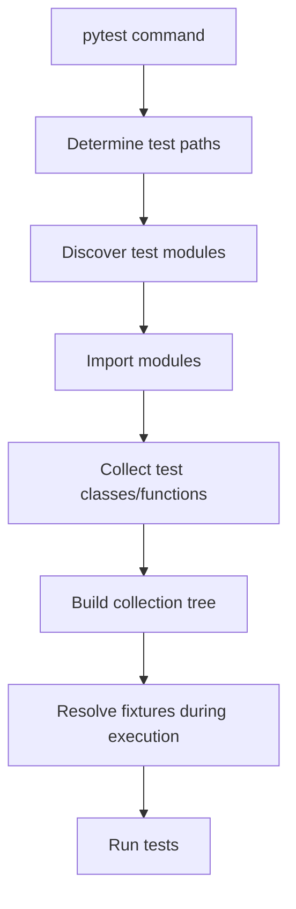

# 04- Test Discovery

## Overview

Test discovery is the mechanism by which a test framework identifies which tests to collect and execute.

In a Python backend project, discovery determines whether the intended tests actually run:

```text
Test Repository
      ↓
Discovery Configuration
      ↓
File / Directory Matching
      ↓
Test Module Collection
      ↓
Test Function / Class Collection
      ↓
Fixture Resolution
      ↓
Test Execution
```

With `pytest`, discovery is convention-driven by default. It searches configured locations, identifies test modules, collects test functions and classes, and builds an internal collection tree before execution.

Understanding discovery matters because a test suite can appear healthy while silently excluding tests due to:

- incorrect filenames;
- incorrect function names;
- unexpected directories;
- import failures;
- configuration mistakes;
- ignored paths;
- custom collection rules;
- CI running a different command from local development.

A green test run only provides confidence if the intended tests were actually collected.

---

## Why Test Discovery Matters

Consider a repository containing:

```text
tests/
├── test_orders.py
├── test_users.py
└── orders_test.py
```

All three files may be valid pytest test modules under default discovery conventions.

But this file:

```text
tests/
└── orders_tests.py
```

does not match the standard `test_*.py` or `*_test.py` patterns.

If the test is never collected, pytest will not report a failure. It simply will not execute it.

This makes discovery a correctness concern, not merely a convenience feature.

---

## pytest Discovery Model

pytest generally performs two important phases:

```text
Collection
    ↓
Execution
```

Collection identifies tests.

Execution runs the collected tests.

Conceptually:



Collection must succeed before pytest can execute the corresponding tests.

---

## Default Test File Patterns

pytest conventionally recognizes Python test modules matching:

```text
test_*.py
*_test.py
```

Examples:

```text
test_orders.py
test_users.py
orders_test.py
users_test.py
```

Files such as:

```text
orders.py
tests.py
order_tests.py
```

are not necessarily discovered by default.

The important distinction is that discovery is based on configured patterns, not on whether a file "looks like a test" to a developer.

---

## Test Function Discovery

Within a collected module, pytest normally discovers functions whose names begin with:

```text
test_
```

Example:

```python
def test_create_order() -> None:
    ...


def test_cancel_order() -> None:
    ...
```

This function is not discovered:

```python
def create_order_test() -> None:
    ...
```

unless the project's configuration or collection rules explicitly support that naming convention.

---

## Test Class Discovery

pytest can collect tests from classes whose names match its class naming conventions.

Example:

```python
class TestOrderService:
    def test_create_order(self) -> None:
        ...

    def test_cancel_order(self) -> None:
        ...
```

The methods must follow test naming conventions.

A common mistake is assuming any class containing methods beginning with `test_` will automatically be collected.

Prefer the conventional `Test...` class naming when using class-based pytest tests.

---

## `unittest.TestCase` Discovery

pytest can also collect and execute `unittest.TestCase` classes.

For example:

```python
import unittest


class TestOrderService(unittest.TestCase):
    def test_create_order(self) -> None:
        ...
```

This is useful when migrating an existing codebase.

The test is still governed partly by `unittest` discovery semantics because it is a `TestCase`.

This distinction matters when debugging mixed pytest/unittest repositories.

---

## Discovery Paths

When running:

```bash
pytest
```

pytest determines where to search based on command-line arguments and project configuration.

Examples:

```bash
pytest
```

```bash
pytest tests/
```

```bash
pytest tests/unit/
```

```bash
pytest tests/unit/test_orders.py
```

```bash
pytest tests/unit/test_orders.py::TestOrderService::test_create_order
```

The more specific the target, the less discovery work pytest performs.

---

## Root Directory

pytest determines a project root directory to establish configuration and relative paths.

A typical repository might be:

```text
backend/
├── pyproject.toml
├── src/
└── tests/
```

Running:

```bash
pytest
```

from the repository root normally causes pytest to discover tests beneath the configured test paths.

Root-directory detection becomes important in monorepos and repositories containing multiple Python projects.

---

## `testpaths`

Configure explicit test locations in `pyproject.toml`:

```toml
[tool.pytest.ini_options]
testpaths = ["tests"]
```

This makes the intended test root explicit.

For a larger repository:

```toml
[tool.pytest.ini_options]
testpaths = [
    "tests/unit",
    "tests/integration",
    "tests/api",
]
```

Explicit test paths reduce accidental collection from unrelated directories.

---

## Custom Test Patterns

pytest's filename patterns can be configured.

For example:

```toml
[tool.pytest.ini_options]
python_files = [
    "test_*.py",
    "*_test.py",
    "*_spec.py",
]
```

This permits:

```text
order_spec.py
```

to participate in discovery.

Do not customize naming conventions without a clear reason.

Python projects benefit significantly from predictable conventions.

---

## Function and Class Patterns

pytest also supports configuration of function and class naming patterns.

Example:

```toml
[tool.pytest.ini_options]
python_functions = [
    "test_*",
]

python_classes = [
    "Test*",
]
```

A project can therefore make discovery rules explicit instead of relying entirely on defaults.

Avoid creating patterns so broad that ordinary application functions become tests accidentally.

---

## Discovery Configuration Reference

| Configuration | Purpose |
|---|---|
| `testpaths` | Defines default directories to search |
| `python_files` | Defines test module filename patterns |
| `python_functions` | Defines test function naming patterns |
| `python_classes` | Defines test class naming patterns |
| `norecursedirs` | Prevents recursive discovery in selected directories |
| `addopts` | Adds default command-line options |

Example:

```toml
[tool.pytest.ini_options]
testpaths = ["tests"]
python_files = ["test_*.py", "*_test.py"]
python_functions = ["test_*"]
python_classes = ["Test*"]
```

---

## Collection Tree

pytest internally represents collected tests as a hierarchy.

Conceptually:

```text
Session
└── tests/
    ├── unit/
    │   ├── test_orders.py
    │   │   ├── test_create_order
    │   │   └── test_cancel_order
    │   └── test_users.py
    │       └── test_create_user
    └── integration/
        └── test_repository.py
            └── test_save_order
```

This hierarchy is important because pytest can target nodes at different levels.

For example:

```bash
pytest tests/unit/test_orders.py
```

targets a module.

```bash
pytest tests/unit/test_orders.py::test_create_order
```

targets a function.

```bash
pytest tests/unit/test_orders.py::TestOrderService
```

targets a class.

---

## Inspecting Collection

Use:

```bash
pytest --collect-only
```

For more detail:

```bash
pytest --collect-only -q
```

This is one of the most important debugging commands when tests appear to be missing.

Example:

```text
$ pytest --collect-only -q

tests/unit/test_orders.py::test_create_order
tests/unit/test_orders.py::test_cancel_order
tests/unit/test_users.py::test_create_user

3 tests collected
```

Collection output should be treated as a sanity check for large or recently modified suites.

---

## Why `--collect-only` Matters

Suppose CI reports:

```text
20 passed
```

but the team expected 27 tests.

The first question should not be:

> Why did the missing tests pass?

The correct question is:

> Were the missing tests collected?

Run:

```bash
pytest --collect-only -q
```

Then inspect:

- expected files;
- expected classes;
- expected test functions;
- ignored paths;
- collection errors.

---

## Collection Errors

A module can match the test filename pattern but still fail during collection.

Example:

```python
from app.orders import OrderService
from app.missing import MissingDependency


def test_create_order() -> None:
    ...
```

pytest may discover the file but fail to import it.

The test therefore does not execute.

Typical causes include:

- invalid imports;
- missing dependencies;
- syntax errors;
- import-time configuration;
- circular imports;
- incompatible Python versions.

Collection failures are fundamentally different from test assertion failures.

---

## Collection vs Test Failure

| State | Meaning |
|---|---|
| Passed | Test was collected and executed successfully |
| Failed | Test was collected and assertion/execution failed |
| Skipped | Test was collected but intentionally not executed |
| XFailed | Test was collected and expected to fail |
| Collection error | pytest could not successfully collect the test |
| Not collected | pytest never identified the test |

This distinction is critical in CI diagnosis.

---

## Import-Time Failures

Tests should avoid unnecessary work at module import time.

Poor:

```python
client = create_expensive_client()
database = connect_to_production_database()
```

Importing the module can now cause external side effects.

Prefer fixtures:

```python
import pytest


@pytest.fixture
def client() -> ApiClient:
    return create_test_client()
```

This moves resource creation into controlled test execution.

---

## Import Mode

pytest supports different import modes that affect how test modules are imported.

The default behavior in modern pytest installations is generally sufficient for conventional packaged projects.

The important engineering concern is avoiding accidental imports caused by:

- duplicate module names;
- implicit `sys.path` assumptions;
- test directories behaving unexpectedly as packages;
- application code that only works from a particular working directory.

If import behavior is unusual, inspect the project's packaging and pytest configuration rather than adding arbitrary path hacks.

---

## `__init__.py` and Test Packages

Tests do not always need `__init__.py`.

For modern Python projects, namespace-package and standard package layouts can both be valid.

Do not add `__init__.py` solely because pytest "requires it" unless the project's package/import structure actually benefits from it.

The important requirement is that test modules can be imported consistently in the project's environment.

---

## Duplicate Test Module Names

This structure can cause confusion:

```text
tests/
├── unit/
│   └── test_orders.py
└── integration/
    └── test_orders.py
```

The names are locally meaningful but can interact poorly with import mechanics or tooling depending on project layout and configuration.

Prefer distinct names when practical:

```text
test_order_service.py
test_order_repository.py
```

This makes failures and CI artifacts easier to interpret.

---

## Recursive Discovery

pytest normally searches recursively beneath its target directories.

For example:

```text
tests/
├── unit/
├── integration/
└── api/
```

Running:

```bash
pytest tests/
```

can collect tests from all of these directories if they match the configured rules.

This is convenient, but it also means accidental test-like files can be collected.

Keep the test directory organized.

---

## Excluding Directories

pytest supports configuration for directories that should not be recursively searched.

Example:

```toml
[tool.pytest.ini_options]
norecursedirs = [
    ".git",
    ".venv",
    "build",
    "dist",
]
```

Use exclusions carefully.

A better solution is often to define explicit `testpaths` rather than maintaining a large blacklist.

---

## `__pycache__` and Generated Files

Python-generated directories such as:

```text
__pycache__/
```

should not normally become a problem with standard pytest configuration.

Build artifacts and generated directories should nevertheless be excluded from test search where appropriate.

A clean repository layout reduces discovery ambiguity.

---

## Monorepos

In a monorepo:

```text
repository/
├── services/
│   ├── orders/
│   │   ├── pyproject.toml
│   │   └── tests/
│   └── users/
│       ├── pyproject.toml
│       └── tests/
└── shared/
```

Avoid assuming one root pytest configuration should govern every service.

A service-specific CI command may be more reliable:

```bash
cd services/orders
pytest
```

or:

```bash
pytest services/orders/tests
```

The repository should make ownership and test boundaries explicit.

---

## CI Discovery

Local and CI commands should agree.

A dangerous situation is:

```text
Local:
pytest

CI:
pytest services/backend/tests/unit
```

A developer may believe the complete suite is passing while CI executes only a subset.

Document the canonical commands and keep CI configuration visible.

---

## Test Discovery in Docker

A Docker image may contain:

```text
/app/
├── src/
└── tests/
```

If the Docker build excludes tests:

```dockerfile
COPY src/ /app/src/
```

then:

```bash
pytest
```

inside the image may collect zero tests.

For test images, explicitly include the test suite:

```dockerfile
COPY src/ /app/src/
COPY tests/ /app/tests/
```

Production images generally should not contain the test suite unless there is a specific operational reason.

---

## Test Discovery and Kubernetes

Kubernetes is generally not where ordinary pytest discovery should occur.

Instead:

```text
CI runner
   ↓
Test container
   ↓
pytest discovery
   ↓
Integration dependencies
```

Kubernetes may provide the infrastructure used by integration tests, but test collection should remain deterministic within the test execution environment.

---

## Test Discovery and FastAPI

A typical FastAPI project may contain:

```text
tests/
├── unit/
│   ├── test_services.py
│   └── test_validation.py
├── integration/
│   └── test_database.py
└── api/
    └── test_orders.py
```

Use explicit test paths or markers to control which layer executes.

For example:

```bash
pytest tests/api
```

or:

```bash
pytest -m "not integration"
```

Discovery should support the test architecture rather than obscure it.

---

## Test Discovery and Django

Django projects often have application-specific test modules.

For example:

```text
apps/
└── orders/
    └── tests/
        ├── test_models.py
        ├── test_services.py
        └── test_api.py
```

If pytest is used as the project runner, ensure the pytest configuration explicitly identifies the relevant locations and Django initialization occurs before database-dependent tests execute.

Avoid relying on developer-specific `PYTHONPATH` settings.

---

## Selecting Tests by Node ID

pytest assigns node IDs to collected tests.

A typical node ID looks like:

```text
tests/unit/test_orders.py::TestOrderService::test_create_order
```

You can execute it directly:

```bash
pytest "tests/unit/test_orders.py::TestOrderService::test_create_order"
```

Node IDs are useful for:

- reproducing CI failures;
- debugging individual tests;
- IDE integration;
- targeted local execution.

---

## Selecting Tests with `-k`

Use:

```bash
pytest -k "order"
```

This selects tests based on matching names and related collection identifiers.

More specific expressions:

```bash
pytest -k "order and not integration"
```

```bash
pytest -k "create and user"
```

`-k` is convenient for interactive development but should not usually replace explicit CI test boundaries.

---

## Selecting Tests with Markers

Markers are better when test classification is intentional.

```python
@pytest.mark.integration
def test_order_repository() -> None:
    ...
```

Then:

```bash
pytest -m integration
```

Markers represent semantic categories; `-k` is primarily a name-based selection mechanism.

---

## Ignoring Tests

pytest supports command-line and configuration mechanisms for excluding selected paths.

For example, a CI command can target only:

```bash
pytest tests/unit
```

rather than collecting the entire repository.

Avoid permanently excluding important tests merely to make CI faster.

If a test is expensive, classify it appropriately and execute it in a suitable pipeline stage.

---

## Skipping vs Excluding

These concepts are different.

### Excluded from discovery

The test is not collected.

```text
pytest
  ↓
test not found
```

### Skipped

The test is collected but deliberately not executed.

```python
@pytest.mark.skip(reason="requires optional dependency")
def test_optional_provider() -> None:
    ...
```

```text
pytest
  ↓
test collected
  ↓
test skipped
```

For test-suite observability, intentional skips are usually preferable to silently excluding important tests.

---

## Conditional Skips

Use conditional skipping when an environment requirement is genuinely optional.

```python
import os

import pytest


@pytest.mark.skipif(
    os.getenv("RUN_EXTERNAL_TESTS") != "1",
    reason="external integration tests are disabled",
)
def test_external_provider() -> None:
    ...
```

Use this carefully.

A critical production verification test should not be silently disabled because an environment variable was omitted.

---

## Discovery and Plugins

pytest's plugin architecture can extend collection behavior.

Plugins can provide:

- custom markers;
- fixtures;
- async support;
- Django integration;
- parallel execution;
- coverage integration;
- custom collectors.

Examples include tools commonly used with pytest such as:

```text
pytest-asyncio
pytest-django
pytest-cov
pytest-xdist
pytest-mock
```

Every plugin adds behavior to the test environment.

Pin and review important test dependencies so local and CI environments remain reproducible.

---

## Custom Collection

pytest supports custom collection mechanisms for specialized file types or domain-specific tests.

This is an advanced capability.

Use custom collectors only when conventional Python test modules cannot reasonably represent the testing problem.

For most backend applications:

```text
standard Python files
+
fixtures
+
markers
+
parametrization
```

are preferable to custom discovery infrastructure.

Custom collection logic increases maintenance and debugging complexity.

---

## Discovery Performance

Collection itself consumes time.

Large repositories may have expensive collection because of:

- thousands of test modules;
- import-time computation;
- plugin initialization;
- expensive module-level objects;
- dynamic test generation;
- filesystem traversal.

Measure collection separately when diagnosing slow test startup.

Useful command:

```bash
pytest --collect-only
```

If collection is slow, inspect import-time behavior before optimizing individual tests.

---

## Avoid Import-Time Side Effects

One of the strongest discovery best practices is:

> Keep test module imports cheap and deterministic.

Avoid:

```python
database = initialize_database()
client = connect_to_external_service()
load_large_dataset()
```

at module scope.

Prefer:

```python
@pytest.fixture
def database():
    return initialize_test_database()
```

This gives pytest explicit lifecycle control.

---

## Dynamic Test Generation

pytest supports advanced mechanisms for dynamically generating tests.

However, static test definitions are usually easier to:

- discover;
- review;
- debug;
- select;
- report;
- maintain.

Use dynamic generation only when the test space genuinely requires it.

For ordinary input variations, parametrization is generally clearer.

---

## Discovery Failures in CI

A robust CI pipeline should make collection failures highly visible.

Example:

```text
pytest
  ↓
collection error
  ↓
non-zero exit code
  ↓
CI job fails
```

Never configure CI to ignore pytest collection errors while reporting the job as successful.

A collection failure means the test suite's intended verification did not complete.

---

## Empty Test Suites

A particularly dangerous failure mode is accidentally executing no tests.

For example:

```bash
pytest tests/nonexistent/
```

or an incorrectly configured test path may result in no meaningful tests being executed.

CI should protect against accidental empty suites.

One useful practice is to require a minimum expected test count for critical repositories or pipeline stages.

Do not blindly hard-code a count that becomes brittle as the suite evolves; use it as a sanity check where appropriate.

---

## Discovery Diagnostics

When tests appear to be missing, check in this order:

1. Confirm the command being executed.
2. Run `pytest --collect-only -q`.
3. Verify `testpaths`.
4. Verify `python_files`.
5. Verify `python_functions`.
6. Verify `python_classes`.
7. Check collection errors.
8. Check ignored/excluded paths.
9. Check plugin and environment differences.
10. Compare local and CI configuration.

This sequence usually finds discovery problems faster than inspecting test assertions.

---

## Production-Grade Test Layout

A scalable backend repository might use:

```text
tests/
├── conftest.py
├── unit/
│   ├── test_order_service.py
│   ├── test_user_service.py
│   └── test_validation.py
├── integration/
│   ├── test_order_repository.py
│   └── test_cache.py
├── api/
│   ├── test_orders.py
│   └── test_users.py
├── contract/
│   └── test_payment_provider.py
└── e2e/
    └── test_checkout_flow.py
```

Then use markers:

```text
unit
integration
api
contract
e2e
```

and explicit test paths where useful.

This makes both discovery and execution strategy visible.

---

## Recommended Configuration

A practical baseline:

```toml
[tool.pytest.ini_options]
testpaths = ["tests"]

python_files = [
    "test_*.py",
    "*_test.py",
]

python_functions = [
    "test_*",
]

python_classes = [
    "Test*",
]

addopts = "-ra"

markers = [
    "unit: fast isolated tests",
    "integration: tests requiring real infrastructure",
    "api: HTTP API tests",
    "contract: service contract tests",
    "e2e: end-to-end tests",
]
```

Keep configuration minimal.

Only add settings when they solve a real project requirement.

---

## Common Mistakes

### Incorrect Test Filename

```text
tests/order_service.py
```

instead of:

```text
tests/test_order_service.py
```

The file may never be discovered.

### Incorrect Test Function Name

```python
def should_create_order() -> None:
    ...
```

instead of:

```python
def test_create_order() -> None:
    ...
```

The function may not be collected under the default configuration.

### Running the Wrong Directory

```bash
pytest tests/unit
```

does not execute:

```text
tests/integration/
```

This is intentional, but developers sometimes mistake a partial run for a full suite.

### Ignoring Collection Errors

A collection error means the suite did not successfully discover all intended tests.

Treat it as a CI failure.

### Heavy Module-Level Setup

Expensive imports make collection slow and can create unpredictable failures.

Move resource creation into fixtures.

---

## Interview Traps

### What Is the Difference Between Collection and Execution?

Collection identifies tests and constructs pytest's test tree. Execution runs the collected tests.

### What Happens If a Test File Does Not Match `python_files`?

pytest does not collect it under that configuration.

### How Do You Debug Missing Tests?

Start with:

```bash
pytest --collect-only -q
```

Then inspect discovery configuration and collection errors.

### Why Is Import-Time Side Effect Dangerous?

pytest imports test modules during collection. Any expensive, stateful, or external operation at module scope can therefore affect collection before tests execute.

### What Is a Node ID?

A node ID uniquely identifies a collected pytest item within the test hierarchy, allowing targeted execution.

Example:

```text
tests/test_orders.py::TestOrderService::test_create_order
```

### Is `testpaths` the Same as `python_files`?

No.

`testpaths` controls **where pytest searches** by default.

`python_files` controls **which Python filenames are considered test modules**.

### Is a Skipped Test the Same as an Undiscovered Test?

No.

A skipped test was collected but intentionally not executed. An undiscovered test never entered the pytest collection tree.

## Key Takeaways

- **Discovery determines what pytest actually verifies:** a green run is meaningful only when the intended tests were successfully collected and executed.
- **Conventions matter:** use predictable `test_*.py`/`*_test.py` filenames, `test_*` functions, and `Test*` classes unless there is a strong reason to customize discovery.
- **`pytest --collect-only` is the primary discovery diagnostic:** use it when tests appear missing, CI counts look suspicious, or collection behavior changes.
- **Keep collection deterministic:** avoid expensive or external side effects during test-module import; initialize resources through fixtures instead.
- **Treat discovery as part of CI correctness:** collection errors, accidental empty suites, inconsistent test paths, and local/CI configuration differences can create false confidence in test coverage.