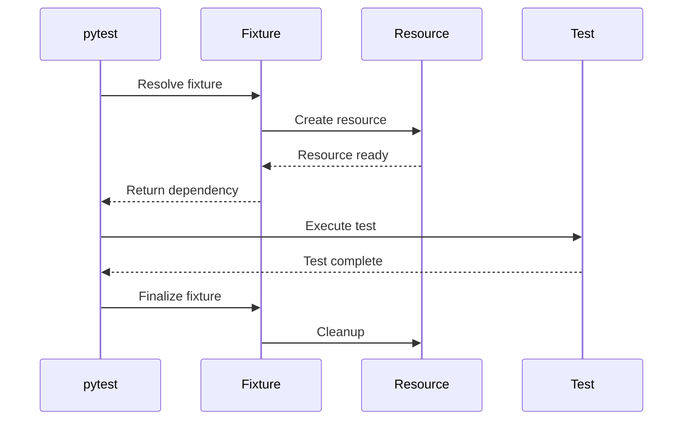

# 06- Fixtures

## Overview

Fixtures are reusable test dependencies that prepare state, provide resources, and manage cleanup around tests.

In pytest, fixtures are a dependency-injection mechanism for tests:

```text
Test
 │
 ├── repository fixture
 │       └── database fixture
 │
 ├── client fixture
 │       └── application fixture
 │
 └── test data fixture
```

Instead of embedding setup and teardown into every test, a fixture defines how a dependency is created and, when necessary, how it is destroyed.

A well-designed fixture system makes tests:

- isolated;
- deterministic;
- readable;
- reusable;
- easier to maintain;
- easier to scale across unit and integration test suites.

Poor fixture design has the opposite effect. Excessive fixture nesting, hidden global state, broad fixture scopes, and automatic setup can make a test suite difficult to understand and slow to execute.

---

## Why Fixtures Matter

Without fixtures, tests often repeat setup:

```python
def test_create_order() -> None:
    repository = InMemoryOrderRepository()
    service = OrderService(repository)

    ...


def test_cancel_order() -> None:
    repository = InMemoryOrderRepository()
    service = OrderService(repository)

    ...
```

Fixtures centralize reusable setup:

```python
import pytest


@pytest.fixture
def repository() -> InMemoryOrderRepository:
    return InMemoryOrderRepository()


@pytest.fixture
def service(
    repository: InMemoryOrderRepository,
) -> OrderService:
    return OrderService(repository)
```

Tests then declare what they need:

```python
def test_create_order(service: OrderService) -> None:
    order = service.create_order(
        customer_id="customer-1",
        amount=2500,
    )

    assert order.status == OrderStatus.CREATED
```

The test communicates its dependencies directly.

---

## Fixture Dependency Injection

A fixture is requested by declaring its name as a test or fixture parameter.

```python
@pytest.fixture
def repository() -> OrderRepository:
    return InMemoryOrderRepository()


def test_get_order(
    repository: OrderRepository,
) -> None:
    ...
```

pytest resolves the dependency before executing the test.

Fixtures can also depend on other fixtures:

```python
@pytest.fixture
def repository() -> OrderRepository:
    return InMemoryOrderRepository()


@pytest.fixture
def service(
    repository: OrderRepository,
) -> OrderService:
    return OrderService(repository)
```

The dependency graph is:

```text
repository
    ↓
service
    ↓
test
```

This is effectively dependency injection for the test environment.

---

## How pytest Resolves Fixtures

Conceptually, pytest performs:

```text
Collect test
    ↓
Inspect test parameters
    ↓
Find matching fixtures
    ↓
Resolve fixture dependencies
    ↓
Create fixture instances
    ↓
Execute test
    ↓
Run fixture finalization
```

pytest manages fixture lifetimes according to their configured scope.

The fixture name becomes the dependency key.

---

## Basic Fixture

A simple fixture can return a value:

```python
import pytest


@pytest.fixture
def order() -> Order:
    return Order(
        id="order-1",
        customer_id="customer-1",
        amount=2500,
        status=OrderStatus.PENDING,
    )
```

Test:

```python
def test_order_is_pending(order: Order) -> None:
    assert order.status == OrderStatus.PENDING
```

Fixtures do not have to manage external resources. They can simply provide reusable test data or objects.

---

## Fixtures vs Local Variables

Not every value should become a fixture.

Prefer local setup when the value is specific to one test:

```python
def test_large_order() -> None:
    order = Order(
        id="order-1",
        amount=100_000,
    )

    assert order.amount > 50_000
```

Use a fixture when:

- multiple tests need the same dependency;
- setup is expensive;
- resource lifecycle requires cleanup;
- setup has meaningful shared semantics;
- the dependency composes naturally with other fixtures.

Avoid creating fixtures solely to eliminate a few lines of local setup.

---

## Fixture Scope

pytest supports several fixture scopes.

| Scope | Lifetime | Typical use |
|---|---|---|
| `function` | One test | Default test data and isolated resources |
| `class` | One test class | Shared class-level resource |
| `module` | One test module | Expensive module-level resource |
| `package` | One package | Package-level infrastructure |
| `session` | Entire pytest run | Very expensive shared resources |

Example:

```python
@pytest.fixture(scope="function")
def order() -> Order:
    return create_test_order()
```

`function` is the default.

---

## Function Scope

Function-scoped fixtures are recreated for each test.

```python
@pytest.fixture
def repository() -> InMemoryOrderRepository:
    return InMemoryOrderRepository()
```

For:

```python
def test_create_order(repository) -> None:
    ...


def test_cancel_order(repository) -> None:
    ...
```

pytest creates separate repository instances for the two tests.

This is usually the safest default because it minimizes state leakage.

---

## Class Scope

A class-scoped fixture is shared by tests in the same test class.

```python
@pytest.fixture(scope="class")
def configuration() -> Configuration:
    return load_test_configuration()
```

Use class scope only when sharing the resource is safe and useful.

Mutable state should generally not be shared across tests merely to improve performance.

---

## Module Scope

A module-scoped fixture is created once for the test module.

```python
@pytest.fixture(scope="module")
def api_client() -> ApiClient:
    return create_api_client()
```

This can reduce expensive setup.

Potential downside:

```text
Test A
  ↓
mutates client state
  ↓
Test B sees changed state
```

Module-scoped fixtures therefore require stronger state-discipline than function-scoped fixtures.

---

## Session Scope

A session-scoped fixture exists for the entire pytest invocation.

```python
@pytest.fixture(scope="session")
def test_database() -> Database:
    return create_test_database()
```

This is appropriate for expensive infrastructure such as:

- a disposable PostgreSQL server;
- a test application;
- an expensive schema initialization;
- a shared read-only configuration.

It is dangerous for mutable test state.

A session fixture should usually represent infrastructure, not scenario-specific data.

---

## Scope Selection

A useful rule is:

```text
Can safely share?
        │
        ├── No → function scope
        │
        └── Yes
             ↓
       Is setup expensive?
             │
             ├── No → function scope
             │
             └── Yes → consider broader scope
```

Start with function scope.

Broaden scope only when performance measurements justify it and isolation remains correct.

---

## Yield Fixtures

Fixtures can use `yield` to define setup and cleanup.

```python
@pytest.fixture
def database() -> Iterator[Database]:
    db = create_test_database()

    yield db

    db.close()
```

Execution is:

```text
create resource
      ↓
yield
      ↓
test executes
      ↓
cleanup
```

This is the preferred pattern for many resource-lifecycle fixtures.

---

## Fixture Cleanup Guarantees

A fixture's teardown code after `yield` runs during fixture finalization.

Example:

```python
@pytest.fixture
def temporary_client() -> Iterator[ApiClient]:
    client = ApiClient()

    yield client

    client.close()
```

The cleanup happens after tests using that fixture finish.

For more complex resource management, `request.addfinalizer()` is also available, but `yield` is usually clearer.

---

## `addfinalizer`

pytest exposes the `request` fixture for advanced lifecycle control.

```python
@pytest.fixture
def resource(request):
    resource = create_resource()

    request.addfinalizer(resource.close)

    return resource
```

Finalizers are useful when cleanup must be registered conditionally.

For ordinary setup/cleanup, prefer:

```python
yield resource
```

because it makes lifecycle structure easier to read.

---

## Cleanup Ordering

When fixtures depend on other fixtures, pytest manages teardown according to fixture dependencies and scope.

Conceptually:

```text
database
   ↓
repository
   ↓
service
   ↓
test

teardown:

service
   ↓
repository
   ↓
database
```

Design fixtures so that a dependent resource is not destroyed before the resources it needs for cleanup.

---

## Fixture Factories

A fixture can return a factory function.

```python
from collections.abc import Callable


@pytest.fixture
def order_factory() -> Callable[..., Order]:
    def create(
        *,
        order_id: str = "order-1",
        amount: int = 2500,
        status: OrderStatus = OrderStatus.PENDING,
    ) -> Order:
        return Order(
            id=order_id,
            customer_id="customer-1",
            amount=amount,
            status=status,
        )

    return create
```

Test:

```python
def test_paid_order(
    order_factory: Callable[..., Order],
) -> None:
    order = order_factory(
        status=OrderStatus.PAID,
    )

    assert order.status == OrderStatus.PAID
```

Factories are useful when tests need many variations of the same domain object.

---

## Factory Fixtures vs Parametrization

Use a fixture factory when each test needs to construct different objects dynamically.

Use parametrization when the test behavior is the same across predefined cases.

Factory:

```python
order = order_factory(amount=5000)
```

Parametrization:

```python
@pytest.mark.parametrize(
    "amount",
    [100, 1000, 10_000],
)
def test_amount(amount: int) -> None:
    ...
```

They solve related but different problems.

---

## Data Fixtures

Fixtures can provide realistic test data.

```python
@pytest.fixture
def customer() -> Customer:
    return Customer(
        id="customer-1",
        email="customer@example.test",
        active=True,
    )
```

Use synthetic data.

Do not place production customer information in fixtures.

---

## Fixture Composition

Fixtures become powerful when composed.

```python
@pytest.fixture
def customer() -> Customer:
    return create_customer()


@pytest.fixture
def order(customer: Customer) -> Order:
    return create_order(customer_id=customer.id)


@pytest.fixture
def service(
    repository: OrderRepository,
) -> OrderService:
    return OrderService(repository)
```

A test can then request only what it needs:

```python
def test_create_order(
    service: OrderService,
    customer: Customer,
) -> None:
    ...
```

Composition reduces duplication without forcing every test to understand the entire dependency graph.

---

## Avoid Over-Composition

A fixture graph can become too deep:

```text
test
 ↓
service
 ↓
repository
 ↓
database
 ↓
transaction
 ↓
connection
 ↓
container
 ↓
network
```

If a unit test requires this entire chain, it may no longer be a unit test.

Keep the fixture graph aligned with the intended test boundary.

---

## `conftest.py`

Shared fixtures are commonly placed in `conftest.py`.

Example:

```text
tests/
├── conftest.py
├── unit/
│   └── test_orders.py
└── integration/
    ├── conftest.py
    └── test_repository.py
```

A fixture in:

```text
tests/conftest.py
```

is available to tests beneath that directory.

A fixture in:

```text
tests/integration/conftest.py
```

is available within the integration test subtree.

---

## Fixture Visibility

Fixture visibility follows the test directory hierarchy.

Conceptually:

```text
tests/conftest.py
        ↓
    ┌───┴────────┐
    ↓            ↓
 unit/       integration/
    ↓            ↓
tests         tests
```

A lower-level `conftest.py` can provide fixtures specifically for that subtree.

This allows infrastructure to remain close to its consumers.

---

## `conftest.py` Best Practices

Keep `conftest.py` focused.

Good candidates:

- common application fixtures;
- database fixtures;
- authenticated clients;
- reusable factories;
- test configuration.

Avoid:

- unrelated utility functions;
- hundreds of globally visible fixtures;
- hidden mutation;
- production application logic.

A large `conftest.py` is often a sign that fixture boundaries need restructuring.

---

## Autouse Fixtures

An autouse fixture executes automatically for tests within its scope.

```python
@pytest.fixture(autouse=True)
def reset_environment() -> Iterator[None]:
    reset_test_state()

    yield

    restore_test_state()
```

Tests do not need to declare the fixture:

```python
def test_order() -> None:
    ...
```

This can be useful for universal environment cleanup.

---

## Problems with Autouse Fixtures

Autouse fixtures hide dependencies.

Compare:

```python
def test_order(database) -> None:
    ...
```

with:

```python
def test_order() -> None:
    ...
```

where the second test silently depends on an autouse database fixture.

Explicit dependencies generally improve readability and debugging.

Use autouse only when the behavior is truly universal and unsurprising.

---

## Temporary Files with Fixtures

pytest provides `tmp_path`.

```python
def test_export(tmp_path) -> None:
    output = tmp_path / "orders.json"

    export_orders(output)

    assert output.exists()
```

Each test receives an isolated temporary directory.

This is preferable to manually constructing fixed filesystem paths.

---

## Temporary Paths and Cleanup

`tmp_path` automatically manages temporary test directories.

Avoid:

```python
Path("/tmp/orders.json")
```

because concurrent tests can interfere with one another.

Prefer:

```python
output = tmp_path / "orders.json"
```

This improves isolation and parallel-test safety.

---

## Environment Fixtures

pytest's `monkeypatch` fixture can temporarily modify environment state.

```python
def test_environment(monkeypatch) -> None:
    monkeypatch.setenv(
        "APP_ENV",
        "test",
    )

    assert load_environment() == "test"
```

The changes are reverted after the test.

This is safer than manually modifying `os.environ` and attempting cleanup yourself.

---

## Database Fixtures

A basic database fixture might provide a test session:

```python
@pytest.fixture
def db_session() -> Iterator[Session]:
    session = create_test_session()

    try:
        yield session
    finally:
        session.rollback()
        session.close()
```

For production-oriented systems, the exact isolation mechanism should match the ORM and database semantics.

PostgreSQL behavior should be tested against PostgreSQL when transaction semantics matter.

---

## Transaction Fixture Strategy

A common approach is:

```text
Test
 ↓
Transaction
 ↓
Database
```

The test performs writes inside a transaction.

After the test:

```text
rollback
   ↓
state restored
```

This can be fast and isolated, but the exact implementation depends on the database framework.

Be careful with nested transactions, background workers, separate connections, and code that commits independently.

A rollback strategy is not automatically valid for every integration architecture.

---

## PostgreSQL Integration Fixtures

For database integration tests, a fixture may provide infrastructure:

```python
@pytest.fixture(scope="session")
def postgres() -> Iterator[PostgresInstance]:
    database = start_test_postgres()

    yield database

    database.stop()
```

A narrower fixture can then provide a connection/session:

```python
@pytest.fixture
def db_session(postgres) -> Iterator[Session]:
    session = connect(postgres)

    try:
        yield session
    finally:
        session.rollback()
        session.close()
```

This separates infrastructure lifetime from test transaction lifetime.

---

## Redis Fixtures

A Redis fixture should manage the lifecycle and isolation of test state.

```python
@pytest.fixture
def redis_client() -> Iterator[Redis]:
    client = create_test_redis()

    yield client

    client.flushdb()
    client.close()
```

In parallel environments, avoid relying on a shared Redis database number as the only isolation mechanism.

Unique key prefixes or isolated Redis instances may be safer.

---

## Kafka Fixtures

Kafka fixtures may manage a test producer/consumer environment.

```python
@pytest.fixture
def producer() -> Iterator[KafkaProducer]:
    producer = create_test_producer()

    yield producer

    producer.flush()
    producer.close()
```

Integration tests should also clean up topics or use unique topic names where parallel execution is possible.

Kafka lifecycle management can be significantly more expensive than ordinary unit fixtures, so use appropriate scopes.

---

## HTTP Client Fixtures

A reusable API client fixture can centralize authentication and application setup:

```python
@pytest.fixture
def client() -> TestClient:
    return TestClient(app)
```

For authenticated APIs:

```python
@pytest.fixture
def authenticated_client(
    client: TestClient,
) -> TestClient:
    client.headers.update(
        {"Authorization": "Bearer test-token"}
    )

    return client
```

Be careful when mutating shared client state. Function scope is usually safer.

---

## Authentication Fixtures

Reusable identity fixtures can simplify authorization tests:

```python
@pytest.fixture
def admin_user() -> User:
    return User(
        id="admin-1",
        role="admin",
    )


@pytest.fixture
def regular_user() -> User:
    return User(
        id="user-1",
        role="user",
    )
```

Tests can then express security scenarios clearly:

```python
def test_regular_user_cannot_delete_order(
    authenticated_client: TestClient,
    regular_user: User,
) -> None:
    ...
```

Do not allow authentication fixtures to accidentally bypass the authorization mechanism being tested.

---

## Fixture Parameters

pytest fixtures can be parameterized with `params`.

```python
@pytest.fixture(
    params=["postgres", "sqlite"],
)
def database_backend(request):
    return create_database(request.param)
```

Tests using the fixture execute once for each parameter.

This is useful for validating behavior across interchangeable implementations.

However, backend-specific semantics should not be hidden behind a fixture if the differences themselves are important.

---

## `request` Fixture

pytest provides a special `request` fixture for advanced fixture behavior.

Example:

```python
@pytest.fixture
def backend(request):
    return create_backend(request.param)
```

`request` can provide information about:

- the requesting test;
- fixture parameters;
- configuration;
- fixture scope.

Use it when dynamic fixture behavior is genuinely required.

Avoid making ordinary fixtures depend heavily on pytest internals.

---

## Fixture Factories for Stateful Systems

A factory can create fresh objects while the fixture manages shared infrastructure.

```python
@pytest.fixture
def user_factory(
    db_session: Session,
) -> Callable[..., User]:
    def create(
        *,
        email: str = "user@example.test",
    ) -> User:
        user = User(email=email)
        db_session.add(user)
        db_session.flush()
        return user

    return create
```

This separates:

```text
database lifecycle
        ↓
factory
        ↓
scenario-specific test data
```

This pattern scales well in database-heavy test suites.

---

## Fixture Scope and Parallelism

Broad fixture scopes can become a problem when tests run concurrently.

For example:

```text
session-scoped Redis
        ↓
parallel Test A
parallel Test B
parallel Test C
```

If tests use the same keys:

```text
Test A → order:1
Test B → order:1
```

they can interfere.

Parallel-safe fixtures require explicit isolation.

Possible strategies include:

- unique resource identifiers;
- per-test namespaces;
- separate databases;
- separate containers;
- function-scoped resources.

---

## Fixture Scope and Performance

Fixtures can significantly affect test runtime.

Consider:

```text
Function-scoped PostgreSQL container
        ↓
1,000 tests
        ↓
very slow
```

A session-scoped infrastructure fixture may be much faster:

```text
Session-scoped PostgreSQL
        ↓
1,000 isolated transactions
```

The correct architecture depends on whether isolation remains reliable.

Performance should never be improved by silently sacrificing test correctness.

---

## Fixture Scope Comparison

| Strategy | Isolation | Speed | Typical use |
|---|---|---|---|
| Function | Highest | Lower | Unit/stateful test data |
| Class | Medium | Medium | Safe class-level resources |
| Module | Lower | Higher | Expensive read-only resources |
| Package | Lower | Higher | Shared infrastructure |
| Session | Lowest state isolation | Highest setup efficiency | Infrastructure |

These are general trade-offs, not absolute performance guarantees.

---

## Fixture Lifecycle Diagram



This lifecycle is especially important for databases, HTTP clients, Redis clients, Kafka clients, temporary files, and background workers.

---

## Fixtures and Application Architecture

Fixtures should follow application boundaries.

For a backend service:

```text
API Test
   ↓
FastAPI application
   ↓
Service fixture
   ↓
Repository fixture
   ↓
Database fixture
```

For a unit test:

```text
Service test
   ↓
Fake repository fixture
```

The test layer determines how much of the application graph should be instantiated.

---

## Fixtures and Dependency Injection

A production application may use dependency injection:

```text
FastAPI
  ↓
Database dependency
  ↓
Repository
  ↓
Service
```

pytest fixtures can construct an equivalent test graph:

```text
pytest
  ↓
database fixture
  ↓
repository fixture
  ↓
service fixture
  ↓
test
```

This makes the test architecture closely reflect the application architecture while allowing controlled substitutions.

---

## Overriding Fixtures

A lower-level `conftest.py` can override a fixture for a subtree.

For example:

```text
tests/
├── conftest.py
└── integration/
    ├── conftest.py
    └── test_orders.py
```

The integration `conftest.py` can provide a different fixture implementation from the parent directory.

This is useful when:

- unit tests need fakes;
- integration tests need real services;
- different environments require different resources.

Use overrides sparingly because they can make fixture resolution less obvious.

---

## Testing External Services

A fixture can provide a fake:

```python
@pytest.fixture
def payment_client() -> FakePaymentClient:
    return FakePaymentClient()
```

For integration tests:

```python
@pytest.fixture
def payment_client() -> PaymentClient:
    return create_test_payment_client()
```

The same conceptual dependency can therefore have different implementations at different test layers.

---

## Fixture Design Principles

Good fixtures generally follow these properties:

| Principle | Meaning |
|---|---|
| Explicit | Tests clearly declare dependencies |
| Isolated | State does not leak between tests |
| Composable | Fixtures can depend on other fixtures |
| Deterministic | Same inputs produce predictable state |
| Minimal | Only required setup is created |
| Scoped | Lifetime matches resource requirements |
| Reusable | Common setup is centralized |
| Observable | Failures clearly identify the resource involved |

---

## Common Mistakes

### Giant Fixtures

A fixture creates:

```text
user
order
payment
database
Redis
Kafka
HTTP client
```

for every test.

This creates unnecessary work and hidden dependencies.

Create focused fixtures instead.

### Excessive Fixture Nesting

A simple unit test should not require a ten-level fixture dependency graph.

Keep unit tests lightweight.

### Wrong Fixture Scope

A mutable session-scoped fixture can cause tests to depend on execution order.

Use function scope unless broader sharing is justified.

### Hidden Autouse State

Autouse fixtures can make tests appear independent while secretly modifying global state.

Use explicit dependencies where practical.

### Cleanup Gaps

Resources such as database connections, sockets, files, and workers must be closed reliably.

Prefer `yield` fixtures for lifecycle-managed resources.

---

## Production Pitfalls

### Sharing Mutable Infrastructure

A session-scoped Redis or database fixture can create race conditions when tests execute concurrently.

Use isolation boundaries.

### Test Data Leakage

A fixture that creates persistent records without cleanup can affect later tests.

Use transactions, isolated databases, or explicit cleanup.

### Overly Expensive Fixtures

Creating a full application and database for every unit test can make local development impractical.

Separate unit and integration fixtures.

### Fixture Magic

If developers cannot determine where a dependency comes from, the fixture architecture has become too implicit.

Prefer clear naming and localized `conftest.py` files.

### Environment Coupling

Fixtures should not silently depend on a developer's local database, AWS credentials, or Redis instance.

Test infrastructure should be explicit and controlled.

---

## Security Considerations

Fixtures frequently contain credentials, identity data, and authorization state.

Never embed real secrets:

```python
# Incorrect
password = "real-production-password"
```

Use synthetic credentials:

```python
@pytest.fixture
def test_credentials() -> tuple[str, str]:
    return (
        "test-user",
        "test-password",
    )
```

Also ensure:

- test AWS credentials cannot access production;
- database URLs explicitly target test infrastructure;
- production API endpoints cannot be selected accidentally;
- fixture data contains no real customer information;
- authentication fixtures do not unintentionally bypass authorization logic.

---

## Reliability Considerations

A reliable fixture system should guarantee:

```text
Setup
  ↓
Known state
  ↓
Test
  ↓
Deterministic cleanup
```

For infrastructure-heavy tests, verify cleanup after:

- assertion failures;
- exceptions;
- timeouts;
- test cancellation;
- interrupted setup where possible.

Resource leaks can accumulate across a CI worker and produce failures that appear unrelated to the original test.

---

## Observability

Integration fixtures should make failures diagnosable.

Useful information includes:

- database/container logs;
- HTTP server logs;
- Kafka broker logs;
- Redis errors;
- resource startup failures;
- fixture initialization duration.

Avoid swallowing fixture setup errors.

A failure such as:

```text
Failed to initialize PostgreSQL test container
```

is much more actionable than:

```text
fixture setup failed
```

---

## CI/CD Considerations

Fixture architecture directly affects CI cost.

A large suite may contain:

```text
5,000 unit tests
500 integration tests
50 E2E tests
```

The test pipeline should avoid creating expensive infrastructure unnecessarily.

A practical model is:

```text
Unit fixtures
    ↓
Fast isolated tests

Integration fixtures
    ↓
Disposable PostgreSQL / Redis / Kafka

E2E fixtures
    ↓
Full application environment
```

Run each layer in an appropriate CI stage.

---

## Docker and Fixtures

Docker-based fixtures can provide reproducible infrastructure.

```text
pytest
  │
  ├── Application container
  ├── PostgreSQL container
  ├── Redis container
  └── Kafka container
```

Infrastructure should generally be created once per suitable test scope and isolated at the test-data level.

Creating containers per individual unit test is usually unnecessary and expensive.

---

## AWS and Fixtures

AWS integration fixtures should use isolated test resources or dedicated accounts where appropriate.

Examples include:

```text
S3 test bucket
SQS test queue
RDS test database
ElastiCache test environment
```

Use unique resource names when parallel tests may run.

Clean up resources reliably and enforce lifecycle policies so failed CI jobs do not accumulate cloud resources and costs.

---

## Fixture Naming

Use names that describe what the fixture provides:

```python
@pytest.fixture
def authenticated_client():
    ...


@pytest.fixture
def db_session():
    ...


@pytest.fixture
def order_factory():
    ...
```

Avoid vague names:

```python
@pytest.fixture
def setup():
    ...
```

A fixture name is part of the test's readability.

---

## Fixture Documentation

Most simple fixtures should be self-explanatory.

For complex infrastructure fixtures, document:

- what resource is created;
- scope;
- isolation guarantees;
- cleanup behavior;
- external dependencies.

Example:

```python
@pytest.fixture(scope="session")
def postgres():
    """Start an isolated PostgreSQL instance for integration tests."""
    ...
```

Do not write documentation that merely restates the function name.

---

## Testing Fixtures

Fixtures themselves can contain bugs.

For critical fixture infrastructure, verify that:

- cleanup actually occurs;
- isolation works;
- transactions are correctly reset;
- generated data is valid;
- external resources are not shared accidentally.

Fixture code is test infrastructure and should be maintained with the same engineering discipline as application code.

---

## Best Practices

- Prefer explicit fixture dependencies.
- Start with function scope.
- Broaden fixture scope only for measured performance reasons.
- Use `yield` for resource lifecycle management.
- Keep fixture graphs shallow where possible.
- Put shared fixtures in appropriately scoped `conftest.py` files.
- Use factories for dynamic test data.
- Use parametrization for repeated behavioral cases.
- Keep unit-test fixtures lightweight.
- Use real infrastructure fixtures for integration semantics.
- Isolate database, Redis, Kafka, and filesystem state.
- Design fixtures to be safe under parallel execution.
- Never use production credentials or production data.
- Keep autouse fixtures rare and genuinely universal.
- Treat fixture initialization and cleanup as part of test reliability.
- Keep fixture naming explicit and domain-oriented.

---

## Fixture Review Checklist

### Design

- [ ] Does the fixture represent a meaningful reusable dependency?
- [ ] Could local setup be clearer than another fixture?
- [ ] Is the fixture name self-explanatory?
- [ ] Is the dependency graph understandable?

### Lifecycle

- [ ] Is the scope appropriate?
- [ ] Is cleanup deterministic?
- [ ] Are external resources closed?
- [ ] Can cleanup handle test failures?

### Isolation

- [ ] Can tests modify shared state?
- [ ] Is the fixture safe under parallel execution?
- [ ] Are database transactions isolated?
- [ ] Are Redis/Kafka resources uniquely scoped where necessary?

### Security

- [ ] Does the fixture use synthetic data?
- [ ] Can it access production accidentally?
- [ ] Are credentials test-only?
- [ ] Does authentication setup preserve authorization testing?

### Performance

- [ ] Is expensive setup reused where safely possible?
- [ ] Are unit tests free of unnecessary infrastructure?
- [ ] Is fixture startup time measurable?
- [ ] Does CI avoid recreating expensive infrastructure unnecessarily?

---

## Interview Traps

### What Is a pytest Fixture?

A fixture is a reusable dependency provider that can also manage setup and teardown for tests.

### Why Are Fixtures Better Than `setUp()` for Many pytest Tests?

Fixtures provide composable dependency injection and configurable scopes rather than forcing setup into lifecycle methods attached to a test class.

### What Is the Default Fixture Scope?

`function`.

The fixture is normally created independently for each test that uses it.

### When Should You Use Session Scope?

For expensive infrastructure that can be safely shared, such as a test database server or other read-only/shared infrastructure.

Do not use session scope merely because it is faster.

### Why Is Function Scope Often Safer?

Each test gets fresh fixture state, reducing test-order dependencies and state leakage.

### What Does `yield` Do in a Fixture?

Code before `yield` performs setup. The yielded value becomes the fixture dependency. Code after `yield` performs teardown.

### What Is `conftest.py`?

A pytest configuration module commonly used to define fixtures and hooks available to tests within its directory hierarchy.

### Why Can Autouse Fixtures Be Dangerous?

They introduce dependencies that are not visible in the test signature, making setup and state changes harder to reason about.

### Should Every Test Dependency Be a Fixture?

No.

Fixtures are best for reusable dependencies, lifecycle-managed resources, or meaningful shared setup. Simple test-specific values are often clearer as local variables.

### How Do Fixtures Affect Parallel Testing?

Shared mutable fixtures can create races and cross-test contamination. Parallel-safe fixtures require explicit state isolation.

## Key Takeaways

- **Fixtures are pytest's dependency-injection mechanism:** use them to provide reusable dependencies, test data, and lifecycle-managed resources without duplicating setup.
- **Function scope is the safest default:** use broader scopes only when resources can be safely shared and the performance benefit justifies the additional isolation complexity.
- **Fixture composition should reflect test boundaries:** unit tests should remain lightweight, while integration fixtures can construct real PostgreSQL, Redis, Kafka, or application infrastructure.
- **Lifecycle and isolation are first-class concerns:** use `yield` for cleanup, prevent shared mutable state, and design fixtures to remain safe under parallel CI execution.
- **Avoid fixture magic:** keep dependencies explicit, `conftest.py` files focused, autouse fixtures rare, and fixture graphs shallow enough that engineers can understand how a test is constructed.