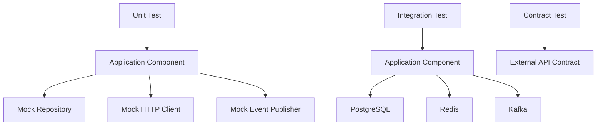
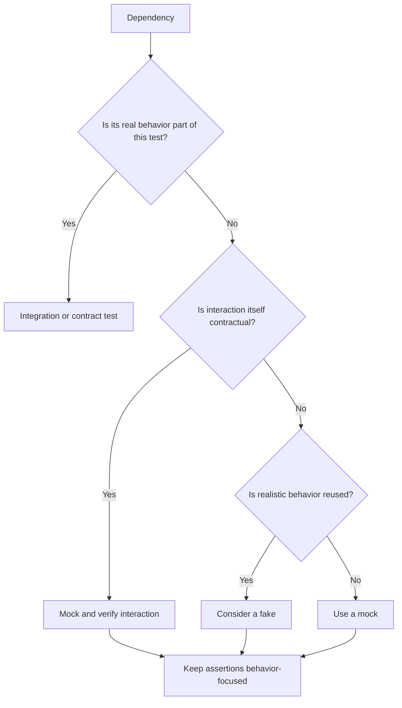

# 09- unittest.mock

## Overview

`unittest.mock` is Python's standard-library mocking framework. It provides programmable test doubles for isolating application code from external dependencies and for verifying important interactions.

It is part of the `unittest` package:

```python
from unittest.mock import Mock, MagicMock, AsyncMock, patch
```

In a backend system, a unit under test commonly depends on:

```text
                    OrderService
                         │
          ┌──────────────┼──────────────┐
          │              │              │
      Repository     Payment API    Event Publisher
          │              │              │
      PostgreSQL      HTTP/gRPC        Kafka
```

A unit test can replace those boundaries with controlled doubles:

```text
                    OrderService
                         │
          ┌──────────────┼──────────────┐
          │              │              │
        Mock           Mock           AsyncMock
          │              │              │
      PostgreSQL      Payment API       Kafka
```

The purpose is not to eliminate real dependencies from the test suite. It is to make **unit-level behavior deterministic and isolated**, while integration and contract tests validate real infrastructure semantics.

`unittest.mock` is especially valuable for testing:

- dependency failures;
- retries;
- HTTP clients;
- repositories;
- message publishers;
- background jobs;
- authentication providers;
- time and randomness;
- external AWS services;
- interactions that are part of a behavioral contract.

---

## `unittest.mock` Components

| Component | Primary use |
|---|---|
| `Mock` | General-purpose mock |
| `MagicMock` | Mock with magic-method support |
| `AsyncMock` | Async functions and awaited dependencies |
| `patch` | Temporarily replace a name |
| `patch.object` | Replace an object attribute |
| `patch.dict` | Temporarily modify a mapping |
| `patch.multiple` | Replace multiple attributes |
| `create_autospec` | Create interface/signature-aware mocks |
| `call` | Represent expected calls |

The most important distinction is between **creating a test double** and **patching an existing dependency**.

```text
Mock / MagicMock / AsyncMock
    ↓
create controlled test double

patch(...)
    ↓
replace an existing name temporarily
```

They are frequently used together.

---

## `Mock`

`Mock` is the core programmable test double.

```python
from unittest.mock import Mock

gateway = Mock()

gateway.charge.return_value = True

assert gateway.charge(100) is True
```

Every call is recorded:

```python
gateway.charge.assert_called_once_with(100)
```

A mock can therefore provide both:

- controlled behavior;
- interaction tracking.

---

## Dynamic Attributes

An unconstrained `Mock` creates child mocks dynamically:

```python
client = Mock()

client.get_customer.return_value = {
    "id": "customer-1",
}

result = client.get_customer("customer-1")
```

This flexibility is convenient but dangerous.

A typo can silently become another mock attribute:

```python
client.get_custmoer("customer-1")
```

An unconstrained mock may not fail immediately.

For important interfaces, prefer:

```python
Mock(spec=CustomerClient)
```

or:

```python
create_autospec(CustomerClient)
```

---

## `MagicMock`

`MagicMock` extends `Mock` with implementations for many Python magic methods.

```python
from unittest.mock import MagicMock

response = MagicMock()

response.status_code = 200
response.json.return_value = {"status": "ok"}
```

It is useful when the dependency participates in protocols such as:

```python
with resource:
    ...
```

or:

```python
for item in resource:
    ...
```

or:

```python
len(resource)
```

For ordinary callable methods, `Mock` is generally sufficient.

---

## `AsyncMock`

`AsyncMock` is designed for asynchronous callables.

```python
from unittest.mock import AsyncMock

client = AsyncMock()

client.get_customer.return_value = {
    "id": "customer-1",
}

customer = await client.get_customer("customer-1")

assert customer["id"] == "customer-1"
```

It also provides await-specific assertions:

```python
client.get_customer.assert_awaited_once_with(
    "customer-1",
)
```

Use `AsyncMock` when the code under test does:

```python
await dependency.method(...)
```

Do not substitute a regular `Mock` and expect it to behave like an async callable.

---

## Mock Configuration

Mocks are normally configured through:

- `return_value`;
- `side_effect`;
- explicit attributes;
- nested child mocks;
- constructor arguments.

Example:

```python
repository = Mock(spec=OrderRepository)

repository.get_by_id.return_value = Order(
    id="order-1",
    amount=100,
)
```

The test now controls the repository response without requiring PostgreSQL.

---

## `return_value`

`return_value` specifies the result of a call.

```python
client = Mock()

client.get.return_value = {
    "status": "active",
}

result = client.get("/customers/1")

assert result["status"] == "active"
```

For asynchronous mocks:

```python
client = AsyncMock()

client.get.return_value = {
    "status": "active",
}
```

The configured result is returned when the coroutine is awaited.

---

## `side_effect`

`side_effect` provides more advanced behavior.

### Raise an Exception

```python
gateway = Mock()

gateway.charge.side_effect = TimeoutError
```

Every call raises `TimeoutError`.

### Return Different Results

```python
gateway = Mock()

gateway.charge.side_effect = [
    TimeoutError,
    PaymentResult(success=True),
]
```

The first call fails and the second succeeds.

### Execute a Callable

```python
def charge(amount: int) -> PaymentResult:
    return PaymentResult(success=amount <= 10_000)


gateway = Mock()
gateway.charge.side_effect = charge
```

`side_effect` is particularly useful for testing retry and branching behavior.

---

## Resetting a Mock

`reset_mock()` clears recorded interaction state:

```python
gateway.reset_mock()
```

By default, this resets call history and related mock state while retaining configured behavior.

In most pytest tests, creating a fresh mock per test is preferable to sharing and resetting one globally.

Fresh test doubles make isolation explicit.

---

## Call Assertions

Common assertions include:

```python
mock.assert_called()
mock.assert_not_called()
mock.assert_called_once()
mock.assert_called_with(...)
mock.assert_called_once_with(...)
```

Example:

```python
gateway.charge(100)

gateway.charge.assert_called_once_with(100)
```

For async mocks:

```python
gateway.charge.assert_awaited()
gateway.charge.assert_awaited_once()
gateway.charge.assert_awaited_with(100)
gateway.charge.assert_awaited_once_with(100)
```

Choose the strongest assertion that represents the actual contract.

---

## `call`

`call` represents a recorded call.

```python
from unittest.mock import Mock, call

repository = Mock()

repository.save(1)
repository.save(2)

assert repository.save.call_args_list == [
    call(1),
    call(2),
]
```

It is useful for validating sequences of calls.

---

## `method_calls`

A mock records method calls on itself and child mocks:

```python
client = Mock()

client.session.open()
client.session.close()
```

You can inspect:

```python
client.method_calls
```

This is useful for debugging complex interaction behavior, but assertions against entire call histories can become brittle.

Prefer targeted assertions when possible.

---

## `mock_calls`

`mock_calls` records calls across nested child mocks.

```python
client = Mock()

client.session.open()
client.session.request("GET", "/orders")
client.session.close()
```

Then:

```python
print(client.mock_calls)
```

This can help diagnose complex mock interactions.

Avoid using it as the default assertion mechanism for ordinary tests.

---

## Inspecting Call Arguments

A mock exposes its latest call:

```python
gateway.charge(
    amount=100,
    currency="USD",
)

args, kwargs = gateway.charge.call_args

assert kwargs["amount"] == 100
assert kwargs["currency"] == "USD"
```

For multiple calls:

```python
gateway.charge.call_args_list
```

Direct methods such as:

```python
assert_called_once_with(...)
```

are generally clearer when exact arguments are known.

---

## `spec`

`spec` constrains a mock to an existing interface.

```python
gateway = Mock(spec=PaymentGateway)
```

Suppose:

```python
class PaymentGateway:
    def charge(self, amount: int) -> PaymentResult:
        ...
```

Then:

```python
gateway.charge
```

is valid, while:

```python
gateway.refundd
```

raises an `AttributeError`.

This protects tests from simple interface-name mistakes.

---

## `spec_set`

`spec_set` provides stricter attribute enforcement.

```python
gateway = Mock(spec_set=PaymentGateway)
```

It prevents setting attributes that are not present in the specification.

For example:

```python
gateway.unknown = "value"
```

will fail.

Use `spec_set` when accidental interface expansion should be detected aggressively.

---

## `create_autospec`

`create_autospec()` creates a mock that more closely follows the target's interface and callable signatures.

```python
from unittest.mock import create_autospec

gateway = create_autospec(PaymentGateway)
```

If the target method is:

```python
def charge(
    self,
    amount: int,
    currency: str,
) -> PaymentResult:
    ...
```

the generated mock checks calls against that signature.

This is valuable because a test can otherwise accidentally use:

```python
gateway.charge(100)
```

when production code requires:

```python
gateway.charge(100, "USD")
```

---

## `spec` vs `spec_set` vs `autospec`

| Feature | `spec` | `spec_set` | `autospec` |
|---|---:|---:|---:|
| Restricts attribute lookup | Yes | Yes | Yes |
| Restricts setting attributes | No | Yes | Generally interface-aware |
| Enforces callable signatures | Limited | Limited | Yes |
| Useful for interface drift | Good | Better | Excellent |
| Typical recommendation | Good | Situational | Preferred where practical |

`autospec` is particularly useful for detecting incorrect argument usage.

---

## `patch`

`patch()` temporarily replaces a name with a mock.

```python
from unittest.mock import patch

with patch("orders.service.PaymentGateway") as gateway:
    gateway.return_value.charge.return_value = True

    ...
```

The patch exists only inside the context manager.

It can also be used as a decorator:

```python
@patch("orders.service.PaymentGateway")
def test_create_order(gateway) -> None:
    gateway.return_value.charge.return_value = True

    ...
```

The context-manager form is often easier to scope and read.

---

## The Critical "Patch Where Used" Rule

Python imports bind names.

Suppose:

```python
# payments.py

class PaymentGateway:
    ...
```

and:

```python
# orders.py

from payments import PaymentGateway


def create_order() -> None:
    gateway = PaymentGateway()
    ...
```

The function looks up:

```text
orders.PaymentGateway
```

Therefore the correct patch target is:

```python
patch("orders.PaymentGateway")
```

not:

```python
patch("payments.PaymentGateway")
```

The runtime lookup is:

```text
orders.create_order()
        │
        ▼
orders.PaymentGateway
        │
        ▼
patched object
```

This is one of the most common sources of failed Python mocks.

---

## Patching Imported Functions

The same rule applies to functions.

Suppose:

```python
# pricing.py

def calculate_tax(amount: int) -> int:
    ...
```

and:

```python
# orders.py

from pricing import calculate_tax


def total(amount: int) -> int:
    return amount + calculate_tax(amount)
```

Patch:

```python
patch("orders.calculate_tax")
```

because that is where the function is looked up.

---

## `patch.object`

`patch.object()` patches an attribute directly on an object.

```python
with patch.object(
    PaymentGateway,
    "charge",
    return_value=True,
):
    ...
```

It is useful when the target object is already available.

It avoids constructing a dotted import path manually.

---

## `patch.dict`

`patch.dict()` temporarily modifies a dictionary.

A common use is environment configuration:

```python
import os
from unittest.mock import patch

with patch.dict(
    os.environ,
    {"APP_ENV": "test"},
):
    assert os.environ["APP_ENV"] == "test"
```

The original dictionary state is restored when the patch exits.

For pytest projects, `monkeypatch` is an equally useful alternative.

---

## `patch.multiple`

Multiple attributes can be patched simultaneously:

```python
with patch.multiple(
    "orders.service",
    DEFAULT_TIMEOUT=5,
    MAX_RETRIES=3,
):
    ...
```

This is useful for a small group of related constants, but many patches in one statement can reduce readability.

---

## `create=True`

`patch()` normally fails if the target attribute does not exist.

With:

```python
patch(
    "module.attribute",
    create=True,
)
```

the attribute can be created dynamically.

This should be used cautiously.

It can hide production/test mismatches because the test may patch something that production code does not actually contain.

Prefer the default behavior unless dynamic attributes are intentional.

---

## Patching Classes

When a class is patched:

```python
with patch(
    "orders.service.PaymentGateway",
) as gateway_class:
    gateway_class.return_value.charge.return_value = True
```

there are two objects to understand:

```text
PaymentGateway mock
       │
       └── return_value
               │
               └── instance mock
                       │
                       └── charge()
```

The class mock represents the constructor.

The `return_value` represents the object created by that constructor.

---

## Constructor Verification

You can verify construction:

```python
gateway_class.assert_called_once_with(
    api_key="test-key",
)
```

And then verify the resulting instance:

```python
gateway_class.return_value.charge.assert_called_once_with(
    100,
)
```

Do this only when construction itself is part of the behavior under test.

If dependency injection already supplies the gateway, patching its constructor is usually unnecessary.

---

## `new`

`patch()` can replace a target with a specific object:

```python
with patch(
    "orders.service.DEFAULT_TIMEOUT",
    new=5,
):
    ...
```

No mock is required when a concrete replacement value is enough.

This is useful for:

- constants;
- feature flags;
- configuration values;
- deterministic objects.

---

## `new_callable`

`new_callable` controls what replacement object `patch()` creates.

```python
with patch(
    "orders.service.PaymentGateway",
    new_callable=Mock,
) as gateway:
    ...
```

Most tests do not need this because `patch()` already creates a suitable mock by default.

---

## Patching Environment and Global State

Global state is easy to patch but should be handled carefully.

Example:

```python
with patch.dict(
    "os.environ",
    {"FEATURE_ENABLED": "true"},
):
    result = load_feature_config()
```

The patch is scoped to the test.

Avoid permanently modifying:

- `os.environ`;
- module globals;
- registries;
- singleton state;
- application dependency maps.

State leaks create order-dependent failures.

---

## Mocking Time

Directly patching time can work:

```python
with patch("orders.service.datetime") as datetime_mock:
    datetime_mock.now.return_value = fixed_time
```

However, this can become fragile because the patch target depends on import style.

A cleaner design is often an injectable clock:

```python
from datetime import datetime, timezone


class Clock:
    def now(self) -> datetime:
        return datetime.now(timezone.utc)
```

Production code receives:

```python
clock = Clock()
```

Tests can use:

```python
clock = Mock(spec=Clock)
clock.now.return_value = fixed_time
```

Dependency injection generally creates a more explicit and maintainable time boundary.

---

## Mocking Randomness

The same principle applies to random behavior.

Instead of allowing business logic to directly depend on global randomness, isolate it:

```python
class TokenGenerator:
    def generate(self) -> str:
        ...
```

Test:

```python
generator = Mock(spec=TokenGenerator)
generator.generate.return_value = "fixed-token"
```

This makes tests deterministic.

---

## Mocking HTTP Clients

Consider:

```python
class CustomerClient:
    async def get_customer(
        self,
        customer_id: str,
    ) -> dict:
        ...
```

A unit test can use:

```python
client = AsyncMock(spec=CustomerClient)

client.get_customer.return_value = {
    "id": "customer-1",
    "status": "active",
}
```

Then:

```python
customer = await client.get_customer("customer-1")

client.get_customer.assert_awaited_once_with(
    "customer-1",
)
```

No network request occurs.

---

## Mocking HTTP Failure

Failure paths are equally important:

```python
client = AsyncMock(spec=CustomerClient)

client.get_customer.side_effect = TimeoutError
```

The test can now verify that the service:

- retries;
- returns an appropriate error;
- records telemetry;
- avoids partial state changes.

External API failures should not need to occur in real time to test recovery behavior.

---

## Mocking REST API Dependencies

For a FastAPI service, dependency injection is usually preferable to patching global application objects.

Conceptually:

```text
HTTP request
      │
      ▼
FastAPI route
      │
      ▼
OrderService
      │
      ├── Repository → mock
      └── Payment API → mock
```

The route can then be tested independently from the external systems.

FastAPI's `dependency_overrides` can provide test-specific implementations, while `unittest.mock` can verify important interactions.

---

## Mocking FastAPI Dependencies

Example:

```python
from unittest.mock import AsyncMock

mock_service = AsyncMock(spec=OrderService)

app.dependency_overrides[
    get_order_service
] = lambda: mock_service
```

After the test, restore application state:

```python
app.dependency_overrides.clear()
```

For a larger suite, put this lifecycle into a fixture so cleanup is guaranteed.

---

## Mocking Django Services

Django code can use `patch()` in the same way:

```python
@patch("orders.services.PaymentClient")
def test_create_order(payment_client) -> None:
    payment_client.return_value.charge.return_value = True

    ...
```

The patch target must still follow Python's name lookup rules.

Avoid mocking Django ORM behavior when the purpose of the test is to validate actual database semantics.

---

## Mocking PostgreSQL

A repository can be mocked in unit tests:

```python
repository = Mock(spec=OrderRepository)

repository.get_by_id.return_value = Order(
    id="order-1",
    amount=100,
)
```

This is appropriate when testing business logic.

It does not validate:

- SQL syntax;
- constraints;
- indexes;
- transaction semantics;
- isolation levels;
- row locking;
- query plans;
- PostgreSQL-specific behavior.

Those require integration tests using a real or appropriately provisioned PostgreSQL environment.

---

## Mocking Redis

Cache access can be mocked:

```python
cache = Mock(spec=OrderCache)

cache.get.return_value = cached_order
```

This tests application behavior around cache hits and misses.

Use real Redis integration tests when correctness depends on:

- TTL;
- atomic operations;
- distributed locks;
- eviction;
- Lua scripts;
- connection behavior;
- Redis serialization.

---

## Mocking Kafka

An event publisher can be mocked:

```python
publisher = AsyncMock(spec=EventPublisher)

await publisher.publish(
    OrderCreated(order_id="order-1"),
)

publisher.publish.assert_awaited_once()
```

This verifies that the application intends to publish the event.

It does not validate:

- broker connectivity;
- partitioning;
- serialization;
- schema compatibility;
- offsets;
- consumer behavior;
- delivery guarantees.

Those belong in integration or contract tests.

---

## Mocking Celery

Task dispatch can be mocked:

```python
with patch(
    "orders.services.send_confirmation.delay",
) as send_confirmation:
    service.create_order(...)

send_confirmation.assert_called_once_with(
    "order-1",
)
```

This verifies dispatch behavior.

It does not validate the Celery broker, worker, retries, acknowledgment, or actual task execution.

Those behaviors need appropriate integration testing.

---

## Mocking AWS Services

AWS clients can be mocked to isolate application logic:

```python
s3 = Mock(spec=S3Client)

s3.put_object.return_value = {
    "ETag": '"abc123"',
}
```

This is useful for testing decisions made around the AWS client.

It cannot validate:

- IAM policies;
- AWS throttling;
- network configuration;
- bucket policies;
- actual service responses;
- regional behavior;
- service quotas.

Use an isolated cloud test environment or suitable integration tooling when real AWS semantics matter.

---

## Mocking Exceptions

Mocks make rare dependency failures deterministic.

```python
gateway = Mock(spec=PaymentGateway)

gateway.charge.side_effect = PaymentProviderError(
    "provider unavailable",
)

with pytest.raises(PaymentFailedError):
    service.create_order(100)
```

Important failure scenarios include:

| Failure | Typical test purpose |
|---|---|
| Timeout | Retry and timeout handling |
| Connection error | Dependency outage handling |
| Authentication error | Credential/configuration behavior |
| Rate limit | Backoff and retry policy |
| Malformed response | Defensive parsing |
| Validation error | Permanent failure handling |
| Server error | Transient failure handling |

---

## Testing Retries

Mocks are particularly effective for deterministic retry tests:

```python
gateway = Mock(spec=PaymentGateway)

gateway.charge.side_effect = [
    TimeoutError,
    TimeoutError,
    PaymentResult(success=True),
]

result = service.charge_with_retry(100)

assert result.success is True
assert gateway.charge.call_count == 3
```

Also test the terminal failure case:

```python
gateway.charge.side_effect = TimeoutError

with pytest.raises(PaymentUnavailableError):
    service.charge_with_retry(100)
```

Production retry tests should consider:

- maximum attempts;
- exponential backoff;
- jitter;
- timeout budgets;
- retryable vs non-retryable errors;
- idempotency;
- duplicate side effects.

---

## Interaction Testing

Interaction assertions are useful when a specific call is part of the contract.

```python
publisher.publish.assert_called_once_with(
    OrderCreated(order_id="order-1"),
)
```

Good candidates include:

- publishing a required event;
- invalidating a required cache key;
- scheduling a required background task;
- charging a payment provider;
- invoking an audit mechanism.

Do not assert every internal call merely because the mock recorded it.

---

## State-Based vs Interaction-Based Testing

| Style | Example | Best used for |
|---|---|---|
| State-based | `assert order.status == "paid"` | Observable outcomes |
| Interaction-based | `gateway.charge.assert_called_once()` | Required external interactions |
| Mixed | Result + critical interaction | Important service boundaries |

Prefer observable behavior when possible.

Interaction assertions should protect meaningful contracts rather than implementation details.

---

## Mocking Internal Methods

Avoid mocking the method being tested indirectly through the same object.

For example:

```python
with patch.object(
    service,
    "_calculate_total",
    return_value=100,
):
    ...
```

This can bypass important application logic.

Prefer:

```text
Service under test
      │
      ├── Repository → mock
      ├── Payment API → mock
      └── Publisher → mock
```

rather than:

```text
Service under test
      │
      └── internal methods → mock
```

The former isolates external boundaries. The latter can make the test meaningless.

---

## Mocking and Dependency Injection

Dependency injection makes mocking cleaner.

Prefer:

```python
class OrderService:
    def __init__(
        self,
        repository: OrderRepository,
        gateway: PaymentGateway,
    ) -> None:
        self.repository = repository
        self.gateway = gateway
```

Then:

```python
service = OrderService(
    repository=Mock(spec=OrderRepository),
    gateway=Mock(spec=PaymentGateway),
)
```

over:

```python
class OrderService:
    def create_order(self, amount: int) -> Order:
        repository = PostgresOrderRepository()
        gateway = PaymentGateway()
        ...
```

Explicit dependency boundaries improve:

- testability;
- modularity;
- deployment flexibility;
- configuration;
- substitution;
- observability.

---

## Mocking Protocols

Protocols provide a stable structural interface:

```python
from typing import Protocol


class PaymentGateway(Protocol):
    async def charge(
        self,
        amount: int,
    ) -> PaymentResult:
        ...
```

Tests can create an interface-aware mock:

```python
gateway = create_autospec(PaymentGateway)
```

This reduces coupling to concrete implementations.

It is particularly useful in service-oriented architectures where external dependencies should be represented by application-level interfaces.

---

## Mocks and Type Checking

Mocks are dynamically flexible, which can weaken static guarantees.

Prefer:

```python
gateway = create_autospec(PaymentGateway)
```

over:

```python
gateway = Mock()
```

For reusable test infrastructure, a typed fake can sometimes be better than a heavily configured mock.

The goal is to make invalid dependency usage fail during development rather than allowing arbitrary mock attributes.

---

## Mocks vs Fakes

A fake is a simplified working implementation.

```python
class InMemoryOrderRepository:
    def __init__(self) -> None:
        self.orders: dict[str, Order] = {}

    def save(self, order: Order) -> None:
        self.orders[order.id] = order

    def get_by_id(self, order_id: str) -> Order | None:
        return self.orders.get(order_id)
```

This is often preferable when many tests need realistic repository behavior.

Use mocks when:

- interaction verification matters;
- behavior needs to be precisely controlled;
- failure injection is important.

Use fakes when:

- the dependency has meaningful behavior;
- many tests need the same behavior;
- repeated mock configuration becomes complex.

---

## `unittest.mock` with pytest

pytest integrates directly with `unittest.mock`.

```python
from unittest.mock import Mock, patch
```

A pytest test can therefore use:

```python
def test_payment_failure() -> None:
    gateway = Mock(spec=PaymentGateway)
    gateway.charge.side_effect = PaymentProviderError()

    ...
```

There is no requirement to use an additional mocking framework.

---

## `pytest-mock`

The `pytest-mock` plugin provides a `mocker` fixture:

```python
def test_payment(mocker) -> None:
    gateway = mocker.Mock(spec=PaymentGateway)

    gateway.charge.return_value = True

    ...
```

Patching becomes:

```python
def test_payment(mocker) -> None:
    charge = mocker.patch(
        "orders.service.PaymentGateway.charge",
        return_value=True,
    )

    ...

    charge.assert_called_once()
```

The fixture handles cleanup.

`unittest.mock` remains the standard-library foundation, while `pytest-mock` primarily improves pytest ergonomics.

---

## Async Mocking with pytest

A typical async test:

```python
import pytest
from unittest.mock import AsyncMock, create_autospec


@pytest.mark.asyncio
async def test_create_order() -> None:
    gateway = create_autospec(PaymentGateway)
    gateway.charge = AsyncMock(
        return_value=PaymentResult(success=True),
    )

    service = OrderService(gateway=gateway)

    result = await service.create_order(100)

    assert result.success is True
    gateway.charge.assert_awaited_once_with(100)
```

Async tests should also cover:

- timeout behavior;
- cancellation;
- dependency failures;
- retry behavior;
- concurrency-sensitive paths.

A mock should not accidentally make incorrect coroutine usage appear valid.

---

## Context Managers

`MagicMock` can represent context-manager behavior:

```python
resource = MagicMock()

resource.__enter__.return_value = resource
resource.__exit__.return_value = False

with resource as active:
    active.process()
```

For application code, a dedicated fake context manager can sometimes communicate intent more clearly than deeply configured magic methods.

---

## Iterators and Async Iterators

`MagicMock` can model iteration:

```python
stream = MagicMock()
stream.__iter__.return_value = iter(
    ["event-1", "event-2"],
)

assert list(stream) == [
    "event-1",
    "event-2",
]
```

For async iteration, configure the relevant asynchronous protocol carefully.

When testing streaming systems, prefer integration tests for actual network or broker streaming semantics.

---

## Mocking Logging

A logger can be patched:

```python
with patch("orders.service.logger") as logger:
    service.cancel_order("order-1")

    logger.info.assert_called_once()
```

Use this only when logging itself is behaviorally important, such as:

- mandatory audit events;
- security events;
- compliance logging.

Do not create brittle tests that assert every incidental log message.

---

## Mocking Metrics

Metrics can similarly be verified when emission is part of a contract:

```python
metrics.increment.assert_called_once_with(
    "orders.created",
)
```

Otherwise, prefer testing business behavior rather than implementation-specific telemetry calls.

Observability should be validated at the appropriate integration level when the actual telemetry pipeline matters.

---

## Mocking Transactions

A mock can verify that transaction-related code was invoked:

```python
transaction_manager.commit.assert_called_once()
```

But this does not prove that a transaction actually commits or rolls back correctly.

Use integration tests for:

- transaction atomicity;
- rollback;
- isolation;
- locks;
- deadlocks;
- concurrent writes.

These are properties of the database and transaction manager, not of the mock.

---

## Mocking Concurrency

Mocks cannot prove thread safety or event-loop correctness.

For example:

```python
worker = Mock()
```

can verify calls but cannot detect:

- race conditions;
- deadlocks;
- incorrect locking;
- scheduling bugs;
- cancellation races.

Use mocks for external boundaries and real concurrency tests for concurrency semantics.

---

## Mock Lifecycle and Cleanup

Patch lifetime should be as small as practical.

Prefer:

```python
with patch("orders.service.PaymentGateway") as gateway:
    ...
```

or:

```python
@patch("orders.service.PaymentGateway")
def test_create_order(gateway) -> None:
    ...
```

Manual patch lifecycle:

```python
patcher = patch("orders.service.PaymentGateway")
gateway = patcher.start()
```

requires reliable cleanup:

```python
patcher.stop()
```

If using `unittest.TestCase`, `addCleanup()` is useful:

```python
patcher = patch("orders.service.PaymentGateway")
gateway = patcher.start()

self.addCleanup(patcher.stop)
```

Leaked patches can cause subsequent tests to observe modified application state.

---

## Test Isolation

A fresh mock per test is generally preferable:

```python
@pytest.fixture
def gateway() -> Mock:
    return Mock(spec=PaymentGateway)
```

Then:

```python
def test_success(gateway: Mock) -> None:
    ...


def test_failure(gateway: Mock) -> None:
    ...
```

Each test gets a separate mock.

Avoid module-level mutable mocks unless there is a compelling reason.

---

## Mocking External Dependencies Without Hiding Failures

A useful testing architecture is:



The unit layer provides speed and deterministic failure injection.

The integration and contract layers provide realism.

A mature suite needs both.

---

## Mocking vs Integration Testing

| Concern | Mock | Integration test |
|---|---|---|
| Business branching | Excellent | Good |
| Dependency failure simulation | Excellent | More expensive |
| SQL correctness | No | Yes |
| PostgreSQL constraints | No | Yes |
| Redis TTL semantics | No | Yes |
| Kafka delivery semantics | No | Yes |
| HTTP contract | Limited | Yes |
| Network behavior | No | Yes |
| Test execution speed | Fast | Slower |
| Infrastructure confidence | Low | High |

The correct strategy is not "mock everything" or "never mock."

It is to test each concern at the layer where it can be validated reliably.

---

## Contract Testing and Mocks

A mock represents what the test author configured.

It does not guarantee that an external provider actually behaves that way.

For example:

```python
client.get_customer.return_value = {
    "id": "customer-1",
    "status": "active",
}
```

may pass even if the real API returns:

```json
{
  "customer_id": "customer-1",
  "state": "active"
}
```

For important external boundaries, combine mocks with contract tests that validate:

- request shape;
- response schema;
- status codes;
- serialization;
- compatibility.

---

## Over-Mocking

Over-mocking is one of the most common advanced testing problems.

A test like:

```python
repository.get_by_id.assert_called_once()
repository.validate.assert_called_once()
repository.transform.assert_called_once()
repository.save.assert_called_once()
```

may encode implementation details rather than behavior.

A refactor can then break the test even though the application's behavior remains correct.

Prefer:

```python
assert result.status == OrderStatus.COMPLETED
```

plus only the critical interaction assertions.

---

## Mocking Chained Calls

Avoid deep chains such as:

```python
client.return_value.session.return_value.response.json.return_value
```

Deep mock chains often indicate that:

- the dependency abstraction is too low-level;
- the code is tightly coupled to implementation details;
- the test is difficult to understand.

Prefer an explicit application-level abstraction:

```python
customer_client.get_customer(...)
```

and mock that boundary.

---

## Mocking Private Methods

Avoid:

```python
with patch.object(
    service,
    "_private_method",
):
    ...
```

unless there is a very specific reason.

Private methods are implementation details.

Testing through the public interface gives the test more resilience to refactoring.

---

## Security Considerations

Mocking must not weaken security tests.

Test both positive and negative authorization cases:

```python
@pytest.mark.parametrize(
    ("role", "allowed"),
    [
        ("admin", True),
        ("operator", True),
        ("viewer", False),
        ("anonymous", False),
    ],
)
def test_order_access(
    role: str,
    allowed: bool,
) -> None:
    ...
```

Avoid mocks that always return an administrator or valid credentials.

Never place real:

- API keys;
- OAuth tokens;
- AWS credentials;
- database passwords;
- customer secrets

in test code.

Tests should use synthetic credentials and isolated environments.

---

## Reliability Considerations

Mocks are valuable for deterministic failure injection.

A reliable test suite should explicitly exercise:

```text
success
timeout
connection failure
rate limit
malformed response
authentication failure
permanent failure
retry exhaustion
```

Do not rely on actual production-like outages to test these paths.

At the same time, validate critical dependency behavior with integration tests.

---

## CI/CD Considerations

Mock-heavy unit tests should generally run early in CI:

```text
Commit
  │
  ├── Formatting / linting
  │
  ├── Type checking
  │
  ├── Unit tests
  │      └── mocks/fakes
  │
  ├── Integration tests
  │      └── PostgreSQL / Redis / Kafka
  │
  └── Contract / E2E tests
```

Benefits include:

- fast developer feedback;
- reduced infrastructure dependency;
- deterministic failure testing;
- easier parallel execution.

Do not use mocks to avoid maintaining necessary integration coverage.

---

## Performance Considerations

Mocks are usually much cheaper than network or database calls.

This makes them appropriate for large unit suites.

However, mock configuration itself can become expensive to maintain when tests contain:

- deep mock trees;
- large `side_effect` structures;
- hundreds of interaction assertions;
- excessive fixture setup.

If a mock is difficult to configure, reconsider the abstraction boundary.

The problem may be architectural rather than testing-related.

---

## Maintainability Guidelines

Prefer:

```python
gateway = create_autospec(PaymentGateway)
```

over:

```python
gateway = Mock()
```

Prefer:

```python
gateway.charge.assert_called_once_with(100)
```

over inspecting:

```python
gateway.mock_calls
```

unless full call ordering is important.

Prefer:

```python
service = OrderService(gateway=gateway)
```

over patching constructors throughout the test suite.

Prefer a reusable fake when many tests require the same realistic dependency behavior.

---

## Common Mistakes

### Patching the Wrong Module

Patch where the dependency is looked up.

### Using `Mock` for Awaited Functions

Use `AsyncMock`.

### Ignoring Interface Drift

Use `spec` or `autospec`.

### Mocking the Unit Under Test

Mock its collaborators instead.

### Verifying Every Call

Assert only interactions that are part of the contract.

### Using Deep Mock Chains

Introduce a meaningful abstraction instead.

### Forgetting Cleanup

Use context managers, decorators, or managed fixtures.

### Mocking Database Semantics

Use integration tests for actual database behavior.

### Using `create=True` Casually

It can hide incorrect patch targets and nonexistent attributes.

### Sharing Mutable Mocks

Create fresh mocks per test whenever possible.

---

## Production Pitfalls

### False Confidence

A mock can make a broken external integration appear correct.

### Unrealistic Responses

Mocks may return simplified objects that do not match production schemas.

### Brittle Interaction Tests

Tests can fail after harmless refactoring if they assert internal call sequences.

### Hidden Global State

Patches can leak across tests.

### Incorrect Async Modeling

A regular mock may not accurately represent an awaited dependency.

### Excessive Isolation

If every component is mocked, the suite may contain little evidence that the system actually works.

---

## Practical Example: Backend Service

A production-oriented service may look like:

```python
from typing import Protocol


class PaymentGateway(Protocol):
    async def charge(
        self,
        amount: int,
    ) -> PaymentResult:
        ...


class OrderRepository(Protocol):
    async def save(self, order: Order) -> None:
        ...


class EventPublisher(Protocol):
    async def publish(self, event: OrderCreated) -> None:
        ...


class OrderService:
    def __init__(
        self,
        gateway: PaymentGateway,
        repository: OrderRepository,
        publisher: EventPublisher,
    ) -> None:
        self.gateway = gateway
        self.repository = repository
        self.publisher = publisher

    async def create_order(self, amount: int) -> Order:
        payment = await self.gateway.charge(amount)

        if not payment.success:
            raise PaymentFailedError

        order = Order.create(amount)

        await self.repository.save(order)

        await self.publisher.publish(
            OrderCreated(order_id=order.id),
        )

        return order
```

The test can isolate all external boundaries:

```python
from unittest.mock import AsyncMock, create_autospec

import pytest


@pytest.mark.asyncio
async def test_create_order() -> None:
    gateway = create_autospec(PaymentGateway)
    repository = create_autospec(OrderRepository)
    publisher = create_autospec(EventPublisher)

    gateway.charge = AsyncMock(
        return_value=PaymentResult(success=True),
    )
    repository.save = AsyncMock()
    publisher.publish = AsyncMock()

    service = OrderService(
        gateway=gateway,
        repository=repository,
        publisher=publisher,
    )

    order = await service.create_order(100)

    assert order.amount == 100

    gateway.charge.assert_awaited_once_with(100)
    repository.save.assert_awaited_once()
    publisher.publish.assert_awaited_once()
```

The test verifies:

```text
OrderService
    │
    ├── charge payment
    ├── persist order
    └── publish event
```

without requiring:

- PostgreSQL;
- Kafka;
- an external payment provider.

Those integrations should be covered elsewhere.

---

## Recommended Mocking Strategy

Use this decision process:



The decision should follow the test's purpose, not a blanket rule.

---

## Mocking Checklist

### Test Design

- [ ] Is the dependency external to the unit?
- [ ] Is isolation actually useful?
- [ ] Would a fake communicate behavior better?
- [ ] Is an integration test required for real semantics?

### Mock Construction

- [ ] Use `spec` or `autospec` where practical.
- [ ] Use `AsyncMock` for async dependencies.
- [ ] Configure explicit return values.
- [ ] Configure realistic failure cases.
- [ ] Avoid unnecessary deep mock hierarchies.

### Patching

- [ ] Patch where the code under test looks up the dependency.
- [ ] Keep patch scope narrow.
- [ ] Use context managers/decorators for automatic cleanup.
- [ ] Avoid `create=True` unless intentional.
- [ ] Avoid patching internal implementation details.

### Assertions

- [ ] Prefer observable behavior.
- [ ] Verify important interactions only.
- [ ] Check critical arguments.
- [ ] Test failures and retry paths.
- [ ] Avoid asserting incidental call sequences.

### Integration Boundaries

- [ ] Test PostgreSQL semantics with real PostgreSQL.
- [ ] Test Redis semantics with real Redis when required.
- [ ] Test Kafka behavior with appropriate integration tests.
- [ ] Test Celery execution and broker behavior separately.
- [ ] Validate external API contracts independently.

### Security

- [ ] Never use production credentials.
- [ ] Test denied authorization cases.
- [ ] Use synthetic sensitive data.
- [ ] Prevent accidental production calls.
- [ ] Avoid permissive mocks that bypass security behavior.

---

## Interview Traps

### What Is `unittest.mock`?

It is Python's standard-library framework for creating configurable test doubles and temporarily replacing dependencies during tests.

### What Is the Difference Between `Mock` and `MagicMock`?

`MagicMock` extends `Mock` with support for many Python magic methods and protocols.

### What Is `AsyncMock`?

`AsyncMock` is designed for mocking asynchronous callables and provides await-aware behavior and assertions.

### What Does `spec` Do?

It constrains mock attribute access to an existing object or class interface.

### What Does `spec_set` Add?

It additionally prevents setting attributes that are not present in the specification.

### Why Use `autospec`?

It makes mocks more closely follow the target's interface and callable signatures, helping detect incorrect argument usage.

### What Is the Most Important `patch()` Rule?

Patch the name where the code under test looks up the dependency.

### Why Does Patching the Definition Module Sometimes Fail?

Because imports bind names in the importing module. If code executed in `orders.py` uses `orders.PaymentGateway`, changing `payments.PaymentGateway` does not necessarily change the already-bound reference.

### `Mock` vs `AsyncMock`?

Use `Mock` for synchronous dependencies and `AsyncMock` for asynchronous callables that are awaited.

### Does Mocking a Database Test the Database?

No. It tests application behavior around the database boundary. SQL, transactions, constraints, locking, and isolation require integration testing.

### Why Is Over-Mocking Dangerous?

It can produce brittle tests coupled to implementation details and create false confidence because real integrations remain unverified.

### When Should You Use a Fake Instead?

Use a fake when many tests need realistic dependency behavior and repeatedly configuring mocks has become complex.

### Should Every External Dependency Be Mocked?

No. Unit tests commonly mock external boundaries, but integration, contract, and end-to-end tests must exercise appropriately realistic dependencies.

### What Does `side_effect` Do?

It can raise exceptions, return a sequence of values, or execute a callable, making it useful for testing failures, retries, and dynamic behavior.

## Key Takeaways

- **`unittest.mock` isolates unit tests from external boundaries:** use `Mock`, `MagicMock`, `AsyncMock`, and patching to control dependency behavior deterministically.
- **Patch where the code looks up the dependency:** Python import bindings make the patch target's location critical.
- **Constrain mocks whenever practical:** `spec`, `spec_set`, and especially `autospec` reduce interface drift and incorrect mock usage.
- **Prefer behavior-focused assertions:** verify critical interactions without coupling tests to incidental implementation details or deep mock chains.
- **Mocks do not replace integration tests:** PostgreSQL, Redis, Kafka, Celery, HTTP, transaction, concurrency, and external-service semantics require appropriately realistic tests.