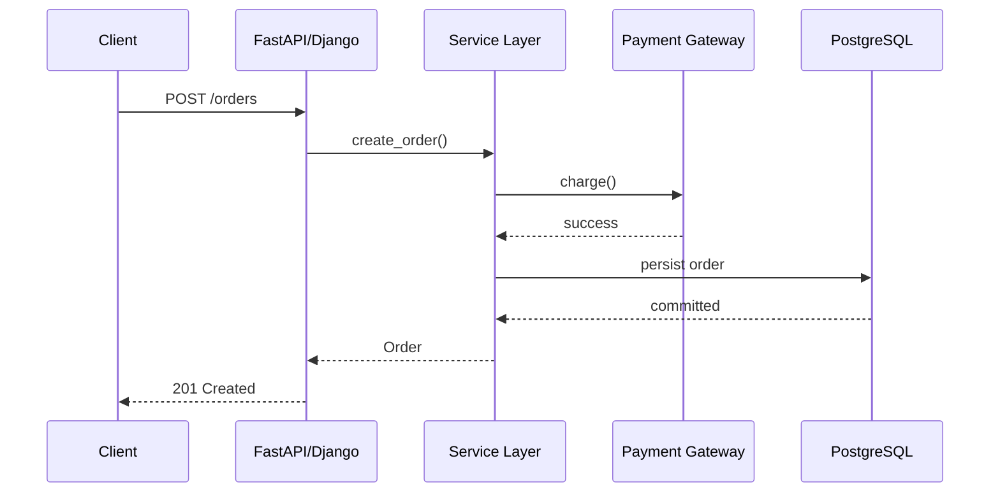

# 10- patch and patch.object

## Overview

`patch()` and `patch.object()` from Python's `unittest.mock` temporarily replace dependencies during a test.

They are primarily used when the code under test obtains a dependency through a module-level name, class attribute, global object, constructor, or another lookup that cannot conveniently be injected directly.

```python
from unittest.mock import patch, patch
```

The important distinction is:

```text
patch("module.name")
    ↓
patch a name resolved through an import path

patch.object(target, "attribute")
    ↓
patch an attribute directly on an object or class
```

Both mechanisms:

- replace the target temporarily;
- restore the original object after the patch scope exits;
- can create a `Mock`, `MagicMock`, or another replacement;
- can be used as context managers or decorators;
- can be used with `unittest.TestCase` lifecycle management.

The most important rule is:

> **Patch where the code under test looks up the dependency, not where that dependency was originally defined.**

Understanding Python's name binding and import behavior is essential for using patching correctly.

---

## Why Patching Exists

Consider a service that directly constructs an external client:

```python
from payments import PaymentGateway


def create_payment(amount: int) -> bool:
    gateway = PaymentGateway()
    return gateway.charge(amount)
```

A unit test should not necessarily contact the real payment provider.

Patching lets the test replace:

```python
PaymentGateway
```

with a controlled test double.

```text
create_payment()
      │
      ▼
PaymentGateway
      │
      ├── production → real provider
      │
      └── test       → mock
```

This allows tests to simulate:

- successful responses;
- timeouts;
- connection failures;
- retries;
- malformed responses;
- provider errors.

Patching is therefore a mechanism for controlling **dependency lookup**.

---

## `patch()` vs `patch.object()`

| Feature | `patch()` | `patch.object()` |
|---|---|---|
| Target | Import-path name | Object/class attribute |
| Syntax | `"module.attribute"` | `target, "attribute"` |
| Best for | Imported dependencies | Known object attributes |
| Temporary replacement | Yes | Yes |
| Context manager | Yes | Yes |
| Decorator | Yes | Yes |
| Automatic restoration | Yes | Yes |
| Common use | Module-level dependency | Class/object method |

Example:

```python
with patch("orders.service.PaymentGateway"):
    ...
```

versus:

```python
with patch.object(
    PaymentGateway,
    "charge",
):
    ...
```

They solve related problems but use different target mechanisms.

---

## `patch()` Basic Usage

```python
from unittest.mock import patch


def test_create_payment() -> None:
    with patch("orders.service.PaymentGateway") as gateway:
        gateway.return_value.charge.return_value = True

        result = create_payment(100)

        assert result is True
```

The patch exists only inside the `with` block.

After the block exits, the original `PaymentGateway` is restored.

This makes context managers a safe default because the patch lifetime is explicit.

---

## How `patch()` Works Conceptually

Suppose:

```python
with patch("orders.service.PaymentGateway") as mock_gateway:
    ...
```

Conceptually:

```text
Before patch

orders.service.PaymentGateway
        │
        ▼
real PaymentGateway


During patch

orders.service.PaymentGateway
        │
        ▼
mock_gateway


After patch

orders.service.PaymentGateway
        │
        ▼
real PaymentGateway
```

The replacement is temporary.

This restoration behavior is one reason context-managed patching is safer than manually changing module globals.

---

## The "Patch Where Used" Rule

Consider:

```python
# payments.py

class PaymentGateway:
    def charge(self, amount: int) -> bool:
        ...
```

Then:

```python
# orders.py

from payments import PaymentGateway


def create_payment(amount: int) -> bool:
    gateway = PaymentGateway()
    return gateway.charge(amount)
```

The correct target is:

```python
patch("orders.PaymentGateway")
```

not:

```python
patch("payments.PaymentGateway")
```

Why?

When `orders.py` executes:

```python
from payments import PaymentGateway
```

the name `PaymentGateway` is bound in the `orders` module.

The runtime lookup is therefore:

```text
create_payment()
      │
      ▼
orders.PaymentGateway
```

Patching `payments.PaymentGateway` does not necessarily replace the already-bound `orders.PaymentGateway`.

---

## Import Semantics Behind Patching

These two import styles behave differently.

### Direct Import

```python
from payments import PaymentGateway
```

The importing module gets its own name:

```text
orders.PaymentGateway → class object
```

Patch:

```python
patch("orders.PaymentGateway")
```

### Module Import

```python
import payments
```

The code accesses:

```python
payments.PaymentGateway
```

Patch:

```python
patch("orders.payments.PaymentGateway")
```

The general rule remains:

> Patch the namespace through which the code under test performs the lookup.

---

## `patch.object()`

`patch.object()` receives the target object directly.

```python
with patch.object(
    PaymentGateway,
    "charge",
    return_value=True,
):
    result = PaymentGateway().charge(100)

    assert result is True
```

Instead of providing a dotted import path, you provide:

```text
target object
+
attribute name
```

This is useful when the target class or object is already available in the test.

---

## Patching a Class Method

```python
class PaymentGateway:
    def charge(self, amount: int) -> bool:
        ...
```

Test:

```python
with patch.object(
    PaymentGateway,
    "charge",
    return_value=True,
):
    gateway = PaymentGateway()

    assert gateway.charge(100) is True
```

The original method is restored after the context exits.

---

## Patching an Instance Method

You can patch an attribute on a specific instance:

```python
gateway = PaymentGateway()

with patch.object(
    gateway,
    "charge",
    return_value=True,
):
    assert gateway.charge(100) is True
```

Only that instance's attribute is replaced.

This differs from patching:

```python
PaymentGateway.charge
```

which affects lookup through the class during the patch scope.

---

## `patch.object()` on Class Attributes

It can also replace constants or configuration attributes:

```python
class PaymentService:
    timeout_seconds = 10
```

Test:

```python
with patch.object(
    PaymentService,
    "timeout_seconds",
    2,
):
    assert PaymentService.timeout_seconds == 2
```

This is useful for testing configuration-dependent behavior without modifying the class permanently.

---

## Context Manager Form

The context manager is the most explicit form:

```python
with patch("orders.service.PaymentGateway") as gateway:
    gateway.return_value.charge.return_value = True

    result = create_payment(100)
```

Advantages:

- clear scope;
- automatic cleanup;
- easy to read;
- prevents accidental leakage.

Keep the patch scope as small as practical.

---

## Decorator Form

`patch()` can decorate a test:

```python
@patch("orders.service.PaymentGateway")
def test_create_payment(gateway) -> None:
    gateway.return_value.charge.return_value = True

    assert create_payment(100) is True
```

The mock is passed into the test function.

The same applies to `patch.object()`:

```python
@patch.object(
    PaymentGateway,
    "charge",
    return_value=True,
)
def test_payment(charge_mock) -> None:
    ...
```

Decorators are convenient for one or two patches.

When many patches are involved, context managers or dependency injection are often easier to understand.

---

## Multiple Patches

Multiple context managers can be used:

```python
with (
    patch("orders.service.PaymentGateway") as gateway,
    patch("orders.service.EventPublisher") as publisher,
):
    gateway.return_value.charge.return_value = True
    publisher.return_value.publish.return_value = None

    ...
```

This makes all temporary replacements explicit.

Avoid large blocks containing many unrelated patches.

A test requiring many patches may indicate excessive coupling in the production code.

---

## Nested Patches

Patches can be nested:

```python
with patch("orders.service.PaymentGateway") as gateway:
    gateway.return_value.charge.return_value = True

    with patch("orders.service.EventPublisher") as publisher:
        publisher.return_value.publish.return_value = None

        ...
```

Prefer a single combined context manager when the dependencies form one coherent test boundary.

---

## Patching a Constructor

A common use case is replacing a dependency constructed inside the function.

Production:

```python
from payments import PaymentGateway


def create_payment(amount: int) -> bool:
    gateway = PaymentGateway()
    return gateway.charge(amount)
```

Test:

```python
with patch(
    "orders.service.PaymentGateway",
) as gateway_class:
    gateway_class.return_value.charge.return_value = True

    assert create_payment(100) is True
```

The important detail is that there are two mock levels:

```text
gateway_class
      │
      └── return_value
              │
              └── instance mock
                      │
                      └── charge()
```

---

## Verifying Constructor Calls

The constructor itself can be verified:

```python
gateway_class.assert_called_once_with(
    api_key="test-key",
)
```

Then the instance interaction:

```python
gateway_class.return_value.charge.assert_called_once_with(
    100,
)
```

Only verify constructor details if construction is part of the behavior under test.

If dependency injection already supplies the gateway, testing constructor invocation is usually unnecessary.

---

## Patching Imported Functions

Suppose:

```python
# pricing.py

def calculate_tax(amount: int) -> int:
    ...
```

and:

```python
# orders.py

from pricing import calculate_tax


def total(amount: int) -> int:
    return amount + calculate_tax(amount)
```

Patch:

```python
with patch(
    "orders.calculate_tax",
    return_value=20,
):
    assert total(100) == 120
```

The target is:

```python
orders.calculate_tax
```

because that is where `total()` looks up the function.

---

## Patching Module Imports

If production code uses:

```python
import pricing


def total(amount: int) -> int:
    return amount + pricing.calculate_tax(amount)
```

then patch:

```python
with patch(
    "orders.pricing.calculate_tax",
    return_value=20,
):
    assert total(100) == 120
```

Again, patch the lookup path used by the code under test.

---

## Patching Built-ins

Built-in functions can be patched, but the target location matters.

For example:

```python
with patch(
    "builtins.open",
) as open_mock:
    ...
```

This can be useful for testing code that directly calls `open()`.

However, filesystem behavior is often better tested with `tmp_path` or real temporary files.

Do not mock standard-library functionality when a cheap, isolated real implementation provides more confidence.

---

## Patching `datetime`

Direct patching can be fragile because of import style.

If:

```python
from datetime import datetime
```

then code might use:

```python
datetime.now()
```

and the relevant target is the name bound in that module:

```python
patch("orders.service.datetime")
```

If the code instead uses:

```python
import datetime
```

the lookup path differs.

This is another practical consequence of the "patch where used" rule.

For business-critical time behavior, an injectable clock is often a better architecture.

---

## Patching Environment Variables

`patch.dict()` is often appropriate for environment configuration:

```python
import os
from unittest.mock import patch

with patch.dict(
    os.environ,
    {"APP_ENV": "test"},
):
    assert os.environ["APP_ENV"] == "test"
```

For pytest projects, `monkeypatch.setenv()` provides similar functionality.

The important property is scoped restoration.

---

## Patching Dictionary State

`patch.dict()` can temporarily modify arbitrary mappings:

```python
settings = {
    "timeout": 10,
    "retries": 3,
}

with patch.dict(
    settings,
    {"timeout": 1},
):
    assert settings["timeout"] == 1

assert settings["timeout"] == 10
```

By default, the original mapping is restored after the patch.

---

## `clear=True`

You can replace the dictionary's contents:

```python
with patch.dict(
    settings,
    {"timeout": 1},
    clear=True,
):
    ...
```

This is useful when the test needs to guarantee that unrelated keys do not influence behavior.

It is particularly useful for environment-variable tests where hidden machine configuration could otherwise affect results.

---

## Patching Async Dependencies

For async methods, use `AsyncMock` as the replacement:

```python
from unittest.mock import AsyncMock, patch


with patch(
    "orders.service.PaymentGateway",
) as gateway_class:
    gateway_class.return_value.charge = AsyncMock(
        return_value=PaymentResult(success=True),
    )

    ...
```

For simpler designs, dependency injection with an `AsyncMock` can be clearer:

```python
gateway = AsyncMock(spec=PaymentGateway)
gateway.charge.return_value = PaymentResult(
    success=True,
)
```

Then inject the mock directly rather than patching the constructor.

---

## Patching Async Functions

Suppose:

```python
# provider.py

async def charge(amount: int) -> bool:
    ...
```

and:

```python
# orders.py

from provider import charge


async def create_payment(amount: int) -> bool:
    return await charge(amount)
```

Patch:

```python
with patch(
    "orders.charge",
    new_callable=AsyncMock,
    return_value=True,
):
    result = await create_payment(100)

    assert result is True
```

This preserves the asynchronous contract.

---

## `new` with `patch()`

A concrete replacement can be supplied with `new`:

```python
replacement = FakePaymentGateway()

with patch(
    "orders.service.PaymentGateway",
    new=replacement,
):
    ...
```

No mock is automatically created.

Use this when a real fake object communicates the intended behavior better than a mock.

---

## `new_callable`

`new_callable` controls what object `patch()` creates:

```python
with patch(
    "orders.service.PaymentGateway",
    new_callable=MagicMock,
) as gateway:
    ...
```

For async targets:

```python
with patch(
    "orders.service.charge",
    new_callable=AsyncMock,
) as charge:
    ...
```

This is useful when the default replacement type is not appropriate.

---

## `spec` with `patch()`

`patch()` supports `spec`:

```python
with patch(
    "orders.service.PaymentGateway",
    spec=PaymentGateway,
) as gateway:
    ...
```

This constrains the replacement based on the target interface.

For stronger signature enforcement:

```python
with patch(
    "orders.service.PaymentGateway",
    autospec=True,
) as gateway:
    ...
```

---

## `autospec=True`

`autospec=True` creates a more interface-aware mock:

```python
with patch(
    "orders.service.PaymentGateway",
    autospec=True,
) as gateway:
    gateway.return_value.charge.return_value = True
```

This helps detect:

- invalid attributes;
- incorrect callable signatures;
- accidental API drift.

It is generally preferable to unconstrained mocks for important application boundaries.

---

## `spec_set`

`patch()` also supports stricter specification:

```python
with patch(
    "orders.service.PaymentGateway",
    spec_set=True,
) as gateway:
    ...
```

This prevents setting attributes outside the specification.

Use strictness when it provides meaningful protection against dependency-interface mistakes.

---

## `create=True`

By default:

```python
patch("orders.service.PaymentGateway")
```

fails if the target does not exist.

With:

```python
patch(
    "orders.service.PaymentGateway",
    create=True,
)
```

the missing attribute can be created.

This is dangerous in most application tests because it can allow tests to patch names that production code does not actually have.

Prefer the default behavior.

---

## `patch.object()` with `create=True`

The same option exists for `patch.object()`:

```python
with patch.object(
    service,
    "dynamic_attribute",
    create=True,
):
    ...
```

Use this only when dynamic attributes are intentional.

Otherwise, a missing attribute should cause the test to fail.

---

## Patching Properties

Properties require care because they are descriptors.

For example:

```python
class User:
    @property
    def is_admin(self) -> bool:
        ...
```

Use `PropertyMock` when appropriate:

```python
from unittest.mock import PropertyMock, patch

with patch.object(
    User,
    "is_admin",
    new_callable=PropertyMock,
    return_value=True,
):
    user = User()

    assert user.is_admin is True
```

This is a specialized use case.

Often a fake object or explicit dependency is clearer than mocking complex properties.

---

## Patching Class Methods

```python
class TokenService:
    @classmethod
    def issue(cls, user_id: str) -> str:
        ...
```

Patch:

```python
with patch.object(
    TokenService,
    "issue",
    return_value="test-token",
):
    token = TokenService.issue("user-1")

    assert token == "test-token"
```

The patch replaces the attribute for the duration of the scope.

---

## Patching Static Methods

```python
class TokenService:
    @staticmethod
    def issue(user_id: str) -> str:
        ...
```

Patch:

```python
with patch.object(
    TokenService,
    "issue",
    return_value="test-token",
):
    assert TokenService.issue("user-1") == "test-token"
```

As with other class attributes, restoration happens automatically.

---

## Patching Instance Attributes

```python
client = ExternalClient()

with patch.object(
    client,
    "timeout",
    1,
):
    assert client.timeout == 1
```

This is useful for temporary test configuration.

For mutable application-wide state, prefer fixture-based isolation instead of repeatedly patching individual instances.

---

## Patching Properties vs Dependency Injection

If tests repeatedly require:

```python
patch.object(...)
patch.object(...)
patch.object(...)
```

against application internals, consider whether the design exposes explicit dependencies.

A service like:

```python
class OrderService:
    def __init__(self, clock, repository, gateway):
        ...
```

is usually easier to test than a service that repeatedly reaches into global classes and module state.

Patching is a useful tool, but it should not compensate indefinitely for poor dependency boundaries.

---

## Patching FastAPI Dependencies

FastAPI provides dependency overrides:

```python
app.dependency_overrides[
    get_order_service
] = lambda: mock_service
```

This is often preferable to patching internal constructors because the dependency boundary is explicit.

`patch()` remains useful for dependencies inside the service itself.

A common structure is:

```text
FastAPI route
      │
      ▼
Dependency override
      │
      ▼
OrderService
      │
      ├── Repository → mock
      ├── HTTP client → mock
      └── Publisher → mock
```

---

## Patching Django Dependencies

Django applications commonly use `patch()` around service boundaries:

```python
@patch("orders.services.PaymentClient")
def test_create_order(payment_client) -> None:
    payment_client.return_value.charge.return_value = True

    ...
```

The target must still follow the module's actual lookup path.

For ORM behavior, prefer real database tests when database semantics matter.

---

## Patching PostgreSQL Access

Suppose a service directly calls a repository:

```python
with patch(
    "orders.service.OrderRepository",
) as repository_class:
    repository_class.return_value.get_by_id.return_value = order

    ...
```

This is appropriate for unit-level business logic.

It does not validate:

- SQL;
- indexes;
- PostgreSQL constraints;
- transactions;
- isolation;
- locking.

Those belong in integration tests.

---

## Patching Redis

A Redis client can be patched:

```python
with patch(
    "orders.service.redis_client",
) as redis_mock:
    redis_mock.get.return_value = b"cached-value"

    ...
```

This tests application behavior around Redis calls.

It does not validate actual Redis semantics such as TTL, eviction, atomicity, or distributed locking.

---

## Patching Kafka Producers

```python
with patch(
    "orders.service.event_producer",
) as producer:
    producer.publish.return_value = None

    service.create_order(...)

    producer.publish.assert_called_once()
```

This verifies application intent.

It does not validate Kafka delivery semantics, serialization compatibility, broker behavior, partitioning, or consumer processing.

---

## Patching Celery Tasks

```python
with patch(
    "orders.service.send_confirmation.delay",
) as send_confirmation:
    service.create_order("order-1")

    send_confirmation.assert_called_once_with(
        "order-1",
    )
```

This verifies task dispatch.

It does not validate:

- broker connectivity;
- worker execution;
- retry behavior;
- acknowledgment;
- task serialization.

Those require integration-level testing.

---

## Patching External HTTP Clients

Suppose:

```python
class CustomerClient:
    async def get_customer(self, customer_id: str) -> dict:
        ...
```

If the service imports it:

```python
from clients import CustomerClient
```

patch the service's reference:

```python
with patch(
    "orders.service.CustomerClient",
    autospec=True,
) as client_class:
    client_class.return_value.get_customer.return_value = {
        "id": "customer-1",
        "status": "active",
    }

    ...
```

For asynchronous methods, configure the replacement as an async mock or prefer direct dependency injection.

---

## Testing Failure Paths with Patching

Patching is particularly useful for deterministic failures:

```python
with patch(
    "orders.service.PaymentGateway",
    autospec=True,
) as gateway_class:
    gateway_class.return_value.charge.side_effect = TimeoutError

    with pytest.raises(PaymentUnavailableError):
        service.create_order(100)
```

This allows reliable testing of paths that may be difficult to reproduce against real infrastructure.

---

## Testing Retries with Patching

```python
with patch(
    "orders.service.PaymentGateway",
    autospec=True,
) as gateway_class:
    gateway = gateway_class.return_value

    gateway.charge.side_effect = [
        TimeoutError,
        TimeoutError,
        PaymentResult(success=True),
    ]

    result = service.create_order(100)

    assert result.status == "created"
    assert gateway.charge.call_count == 3
```

This should be combined with assertions for:

- retry count;
- retryable errors;
- non-retryable errors;
- timeout budgets;
- idempotency;
- final failure.

---

## Patching Time vs Injecting a Clock

Patching time:

```python
with patch("orders.service.datetime") as datetime_mock:
    datetime_mock.now.return_value = fixed_time
```

can work, but it couples the test to import details.

A cleaner design is:

```python
class Clock(Protocol):
    def now(self) -> datetime:
        ...
```

Then:

```python
clock = Mock(spec=Clock)
clock.now.return_value = fixed_time
```

Dependency injection makes the boundary explicit and reduces reliance on global patching.

---

## Patching Randomness

The same principle applies to randomness.

Instead of:

```python
token = secrets.token_urlsafe()
```

throughout business logic, isolate token generation behind a dependency when deterministic behavior is important.

Then tests can inject:

```python
token_generator = Mock(spec=TokenGenerator)
token_generator.generate.return_value = "fixed-token"
```

This is usually more maintainable than repeatedly patching global randomness.

---

## Patch Scope

Keep patches as narrow as practical.

Prefer:

```python
def test_payment() -> None:
    with patch("orders.service.PaymentGateway") as gateway:
        ...
```

over a class-wide or module-wide patch when only one test requires it.

Narrow scope improves:

- readability;
- isolation;
- debugging;
- parallel execution;
- confidence that unrelated tests use real dependencies.

---

## Cleanup and Restoration

`patch()` and `patch.object()` automatically restore their targets when used as context managers or decorators.

```python
original = PaymentGateway.charge

with patch.object(
    PaymentGateway,
    "charge",
    return_value=True,
):
    ...

assert PaymentGateway.charge is original
```

This restoration is critical for test isolation.

---

## Manual Patchers

Patches can also be started manually:

```python
patcher = patch("orders.service.PaymentGateway")
gateway = patcher.start()

try:
    ...
finally:
    patcher.stop()
```

Manual lifecycle management is more error-prone.

With `unittest.TestCase`, use `addCleanup()`:

```python
patcher = patch("orders.service.PaymentGateway")
gateway = patcher.start()

self.addCleanup(patcher.stop)
```

This ensures cleanup even when the test fails.

---

## Patching in `setUp`

In `unittest`:

```python
class TestOrderService(unittest.TestCase):
    def setUp(self) -> None:
        patcher = patch("orders.service.PaymentGateway")

        self.gateway = patcher.start()
        self.addCleanup(patcher.stop)
```

This can be useful when many tests share the same patched dependency.

However, broad setup patches can hide test dependencies.

Use them only when the dependency is genuinely common to the entire test class.

---

## Patching with pytest Fixtures

pytest can manage patch lifecycle through fixtures:

```python
@pytest.fixture
def gateway(mocker):
    return mocker.patch(
        "orders.service.PaymentGateway",
        autospec=True,
    )
```

Tests then receive the patched dependency explicitly:

```python
def test_create_order(gateway) -> None:
    gateway.return_value.charge.return_value = True

    ...
```

This is often cleaner than manually starting patchers.

---

## `mocker.patch()`

With `pytest-mock`:

```python
def test_create_order(mocker) -> None:
    gateway = mocker.patch(
        "orders.service.PaymentGateway",
        autospec=True,
    )

    gateway.return_value.charge.return_value = True

    ...
```

The plugin automatically handles cleanup after the test.

The semantics still follow `unittest.mock`'s patching model.

---

## Patching and Parallel Tests

Patch state is process-local, but global/module-level mutation can still make tests fragile.

Parallel test execution can expose problems caused by:

- shared global state;
- leaked patches;
- singleton mutation;
- environment changes;
- mutable registries.

Prefer narrow patch scopes and isolated fixtures.

Tests should not depend on execution order.

---

## Patching and Threading

Patching a global/module attribute changes what code in that process sees.

If multiple threads execute code while a patch is active, they may observe the patched value.

Therefore avoid broad patches around code that launches concurrent work unless that behavior is intentionally controlled.

For concurrency tests, prefer explicit dependency injection and synchronization.

---

## Patching and Asyncio

The same concern applies to asyncio.

A patch active while multiple tasks execute can affect all tasks that access the patched global.

Use narrow scopes and avoid relying on global mutation for complex concurrent tests.

Inject dependencies into async components where practical.

---

## Patching and Microservices

In a microservice architecture:

```text
Order Service
    │
    ├── Payment Service
    ├── Inventory Service
    ├── Kafka
    └── PostgreSQL
```

Unit tests may patch:

```text
PaymentClient
InventoryClient
EventPublisher
Repository
```

Integration and contract tests should separately verify that those boundaries work against realistic services.

Patching is therefore a **unit isolation mechanism**, not a distributed-system validation mechanism.

---

## Patching and HTTP Request Lifecycles

For an API request:



A unit test can patch `Gateway` and `Repository`:

```text
API/Service
    │
    ├── PaymentGateway → mock
    └── Repository     → mock
```

This tests application control flow without requiring network or database infrastructure.

A separate integration test should validate the actual request-to-database path.

---

## Common Mistakes

### Patching the Definition Instead of the Lookup

Incorrect:

```python
patch("payments.PaymentGateway")
```

when the production code uses:

```python
from payments import PaymentGateway
```

inside `orders.py`.

Correct:

```python
patch("orders.PaymentGateway")
```

### Patching Too Broadly

A module-wide patch can affect unrelated tests.

Keep scope narrow.

### Forgetting Async Behavior

Use `AsyncMock` for awaited functions.

### Mocking Internal Methods

This can bypass the logic the test is supposed to validate.

### Using `create=True` Unnecessarily

It can hide invalid patch targets.

### Relying on Deep Mock Chains

This often indicates poor dependency boundaries.

### Not Verifying Important Interactions

If publishing an event is contractual, verify that it happened.

### Verifying Every Interaction

This produces brittle tests coupled to implementation details.

---

## Production Pitfalls

### False Confidence

A patched dependency can make a test pass even when the real integration is broken.

### Unrealistic Mock Responses

Mocks may return data that does not match production schemas.

### Hidden Import Coupling

Changing import style can change the correct patch target.

### Global State Mutation

Broad patches can interfere with concurrent tests or shared application state.

### Overuse of Patching

Heavy patching often indicates dependencies should be injected explicitly.

### Missing Integration Coverage

Patching PostgreSQL, Redis, Kafka, or HTTP clients does not validate those systems.

---

## Security Considerations

Patching is useful for testing security failures but can also accidentally bypass security behavior.

Test cases should include:

- invalid credentials;
- expired credentials;
- denied authorization;
- missing permissions;
- dependency authentication failures;
- rate limits.

Avoid mocks that always return:

```python
User(role="admin")
```

because this can make authorization tests meaningless.

Never place real credentials, API keys, tokens, or production secrets into patch configurations.

---

## Performance Considerations

Patching generally makes unit tests faster by avoiding expensive dependencies.

However, excessive patching can create large, brittle test suites that provide little integration confidence.

Use patches primarily for:

- slow external I/O;
- nondeterministic services;
- failure injection;
- dependency isolation.

Do not patch cheap deterministic code merely to make every test look like a unit test.

---

## Reliability Considerations

Reliable patches have:

- explicit scope;
- automatic cleanup;
- realistic responses;
- deterministic failure behavior;
- constrained interfaces.

For external dependency tests, model realistic failures:

```text
success
timeout
connection error
rate limit
authentication error
malformed response
retry exhaustion
```

Then validate the real integration separately.

---

## Maintainability Guidelines

Prefer dependency injection when practical:

```python
class OrderService:
    def __init__(
        self,
        gateway: PaymentGateway,
        repository: OrderRepository,
    ) -> None:
        self.gateway = gateway
        self.repository = repository
```

Then tests can directly provide:

```python
gateway = AsyncMock(spec=PaymentGateway)
repository = AsyncMock(spec=OrderRepository)
```

This is generally easier to maintain than repeatedly patching constructors.

Use patching when:

- the dependency cannot easily be injected;
- the code boundary is intentionally module-level;
- replacing a global function is the appropriate unit boundary;
- testing import-time or construction behavior is necessary.

---

## Decision Guide

| Situation | Preferred approach |
|---|---|
| Dependency already injected | Inject a mock/fake |
| Module-level imported dependency | `patch()` |
| Class/object attribute | `patch.object()` |
| Async dependency | `AsyncMock` |
| Environment mapping | `patch.dict()` |
| Reusable realistic dependency | Fake |
| SQL semantics | Integration test |
| Redis semantics | Integration test |
| Kafka semantics | Integration/contract test |
| External API compatibility | Contract/integration test |
| Time dependency | Prefer injectable clock |
| Randomness | Prefer injectable generator |
| Internal private method | Usually do not patch |

---

## Practical Example

Production code:

```python
from payments import PaymentGateway


class OrderService:
    def create_order(self, amount: int) -> bool:
        gateway = PaymentGateway()

        if not gateway.charge(amount):
            raise PaymentFailedError

        return True
```

Unit test:

```python
from unittest.mock import patch


def test_create_order_success() -> None:
    with patch(
        "orders.service.PaymentGateway",
        autospec=True,
    ) as gateway_class:
        gateway_class.return_value.charge.return_value = True

        service = OrderService()

        assert service.create_order(100) is True

        gateway_class.assert_called_once_with()
        gateway_class.return_value.charge.assert_called_once_with(100)
```

Failure test:

```python
def test_create_order_payment_failure() -> None:
    with patch(
        "orders.service.PaymentGateway",
        autospec=True,
    ) as gateway_class:
        gateway_class.return_value.charge.return_value = False

        service = OrderService()

        with pytest.raises(PaymentFailedError):
            service.create_order(100)

        gateway_class.return_value.charge.assert_called_once_with(100)
```

The tests isolate the service from the actual payment provider.

---

## Practical `patch.object()` Example

Given:

```python
class PaymentGateway:
    def charge(self, amount: int) -> bool:
        return call_external_provider(amount)
```

The test can patch only the method:

```python
from unittest.mock import patch


def test_payment_gateway_usage() -> None:
    gateway = PaymentGateway()

    with patch.object(
        PaymentGateway,
        "charge",
        return_value=True,
    ) as charge:
        assert gateway.charge(100) is True

        charge.assert_called_once_with(100)
```

This is appropriate when the class itself should remain real while one specific behavior is controlled.

---

## Patching Checklist

### Target Selection

- [ ] Where does the production code actually look up the dependency?
- [ ] Is `patch()` or `patch.object()` more appropriate?
- [ ] Does the import style affect the target path?
- [ ] Is the dependency injected already?

### Mock Configuration

- [ ] Should `autospec` be enabled?
- [ ] Should `AsyncMock` be used?
- [ ] Are return values realistic?
- [ ] Are failure paths represented?

### Patch Scope

- [ ] Is the patch as narrow as practical?
- [ ] Will it be restored automatically?
- [ ] Could concurrent tasks or threads observe the patch?
- [ ] Could shared state leak?

### Assertions

- [ ] Is the observable behavior asserted?
- [ ] Are critical interactions verified?
- [ ] Are arguments correct?
- [ ] Are incidental implementation calls avoided?

### Integration Coverage

- [ ] Does a real PostgreSQL test exist where SQL semantics matter?
- [ ] Does Redis behavior get tested realistically?
- [ ] Does Kafka behavior get tested realistically?
- [ ] Are external API contracts validated?
- [ ] Are real network and transaction semantics tested elsewhere?

---

## Interview Traps

### What Is `patch()`?

`patch()` temporarily replaces an object referenced by an import path, typically with a mock, and restores the original object when the patch scope exits.

### What Is `patch.object()`?

`patch.object()` temporarily replaces a named attribute on a specific object or class.

### What Is the Difference Between `patch()` and `patch.object()`?

`patch()` identifies its target through a dotted import path:

```python
patch("orders.service.PaymentGateway")
```

while `patch.object()` receives the object and attribute separately:

```python
patch.object(PaymentGateway, "charge")
```

### Where Should You Patch?

Patch the namespace where the code under test looks up the dependency.

### Why Does `from module import name` Matter?

It binds `name` in the importing module. Patching the original module's attribute may not change the already-bound reference.

### What Happens When You Patch a Class?

The patched class becomes a mock, and its `return_value` generally represents the mock instance created by the constructor.

### What Is `autospec=True`?

It creates a mock that more closely follows the target's interface and callable signatures.

### Why Is `create=True` Usually Dangerous?

It permits patching attributes that do not exist, potentially allowing tests to pass against invalid production assumptions.

### Should You Patch Internal Methods?

Usually no. Patch external collaborators and test the unit's public behavior instead.

### Can Patching Validate PostgreSQL?

No. It can isolate application logic from PostgreSQL, but real database behavior requires integration tests.

### Can Patching Validate an External REST API?

No. It validates the behavior configured in the mock. Contract or integration tests are needed for real API compatibility.

### Why Is Dependency Injection Often Better Than Patching?

Dependency injection makes boundaries explicit and allows tests to provide mocks or fakes directly, reducing coupling to module-level global state and import paths.

### Does Patching Guarantee Thread or Async Isolation?

No. A patch changes the referenced object within the process, so concurrent execution can observe it while the patch is active.

## Key Takeaways

- **Patch the lookup location, not the definition location:** Python import binding determines which name the code under test actually resolves.
- **Use `patch()` for import-path targets and `patch.object()` for known object/class attributes:** both temporarily replace the target and restore it automatically when properly scoped.
- **Keep patches narrow and constrained:** use context managers or managed fixtures, prefer `autospec`, and use `AsyncMock` for asynchronous dependencies.
- **Prefer dependency injection for stable application boundaries:** patching is valuable, but excessive patching can indicate hidden global coupling and brittle architecture.
- **Patching isolates behavior but does not validate infrastructure:** PostgreSQL, Redis, Kafka, HTTP, transaction, and distributed-system semantics still require realistic integration or contract tests.