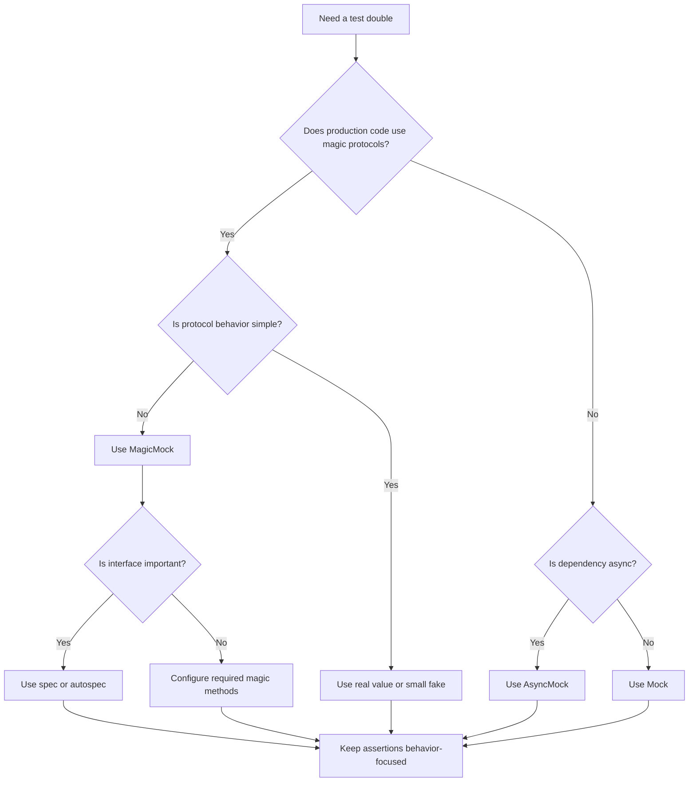

# 11- MagicMock

## Overview

`MagicMock` is an extension of Python's `unittest.mock.Mock` that provides default support for many Python **magic methods**, also called **dunder methods**.

Magic methods implement Python protocols such as:

- iteration;
- context management;
- item access;
- containment;
- numeric operations;
- comparison;
- length;
- asynchronous context management;
- asynchronous iteration.

```python
from unittest.mock import MagicMock
```

A regular `Mock` is primarily designed around ordinary callable attributes:

```python
mock.process()
mock.client.get()
```

`MagicMock` additionally supports operations such as:

```python
len(mock)
mock["key"]
item in mock
with mock:
    ...
for item in mock:
    ...
```

This makes `MagicMock` useful when the dependency under test participates in Python protocols rather than exposing only conventional methods.

However, its flexibility can also make tests too permissive. Use it when protocol behavior is actually part of the test boundary; otherwise, a regular `Mock`, `AsyncMock`, or a small fake may communicate intent more clearly.

---

## Why MagicMock Exists

Python relies heavily on protocols implemented through magic methods.

For example:

```python
len(value)
```

typically resolves through:

```python
value.__len__()
```

Likewise:

```python
value[key]
```

uses:

```python
value.__getitem__(key)
```

and:

```python
with value:
    ...
```

uses context-manager methods such as:

```python
value.__enter__()
value.__exit__()
```

A regular mock does not automatically provide the same convenient support for all of these operations.

`MagicMock` provides pre-created mock implementations for many commonly used magic methods.

```text
Application code
      │
      ├── method call      → Mock / MagicMock
      ├── len(value)       → MagicMock.__len__
      ├── value[key]       → MagicMock.__getitem__
      ├── item in value    → MagicMock.__contains__
      └── with value       → MagicMock.__enter__/__exit__
```

---

## Mock vs MagicMock

```python
from unittest.mock import MagicMock, Mock
```

A regular `Mock`:

```python
mock = Mock()

mock.process.return_value = "ok"
```

A `MagicMock`:

```python
mock = MagicMock()

mock.process.return_value = "ok"
mock.__len__.return_value = 3
```

The primary distinction is protocol support.

| Capability | `Mock` | `MagicMock` |
|---|---:|---:|
| Ordinary methods | Yes | Yes |
| Call tracking | Yes | Yes |
| `return_value` | Yes | Yes |
| `side_effect` | Yes | Yes |
| `spec` / `autospec` | Yes | Yes |
| `len()` | Not automatically | Yes |
| Item access | Not automatically | Yes |
| Iteration | Not automatically | Yes |
| Context manager | Not automatically | Yes |
| Numeric operators | Not automatically | Yes |
| Async context manager | Limited | Supported |
| Async iteration | Limited | Supported |

Use `Mock` by default for ordinary collaborators.

Use `MagicMock` when the code under test actually relies on a Python protocol.

---

## How Magic Methods Work

Consider:

```python
len(cache)
```

Python invokes the object's length protocol.

For a `MagicMock`:

```python
cache = MagicMock()

cache.__len__.return_value = 10

assert len(cache) == 10
```

The important point is that:

```python
cache.__len__
```

is itself a mock.

Therefore it can be configured and inspected:

```python
cache.__len__.assert_called_once_with()
```

This pattern applies to many supported magic methods.

---

## Commonly Supported Magic Methods

`MagicMock` supports many common protocols, including:

| Protocol | Representative methods | Example syntax |
|---|---|---|
| Length | `__len__` | `len(obj)` |
| Item access | `__getitem__`, `__setitem__` | `obj[key]` |
| Containment | `__contains__` | `key in obj` |
| Iteration | `__iter__` | `for item in obj` |
| Context manager | `__enter__`, `__exit__` | `with obj` |
| Async context manager | `__aenter__`, `__aexit__` | `async with obj` |
| Async iteration | `__aiter__`, `__anext__` | `async for item in obj` |
| String conversion | `__str__`, `__repr__` | `str(obj)` |
| Numeric operations | `__add__`, `__sub__`, etc. | `obj + value` |
| Comparison | `__eq__`, `__lt__`, etc. | `obj == value` |
| Boolean conversion | `__bool__` | `bool(obj)` |

The exact set of supported magic methods is implementation-dependent and tied to Python's supported protocols.

---

## Configuring `__len__`

```python
cache = MagicMock()

cache.__len__.return_value = 5

assert len(cache) == 5
```

This is useful when application behavior depends on the size of a protocol-compatible object.

For example:

```python
def should_flush(batch) -> bool:
    return len(batch) >= 100
```

Test:

```python
batch = MagicMock()

batch.__len__.return_value = 100

assert should_flush(batch) is True
```

---

## Item Access with `__getitem__`

A `MagicMock` can represent mapping-like behavior:

```python
settings = MagicMock()

settings.__getitem__.side_effect = {
    "timeout": 5,
    "retries": 3,
}.get

assert settings["timeout"] == 5
```

You can also configure a specific key:

```python
settings = MagicMock()

settings["timeout"] = 5

assert settings["timeout"] == 5
```

For repeated mapping behavior, a real dictionary or small fake may be clearer than a heavily configured mock.

---

## Item Assignment

`__setitem__` records item assignment:

```python
cache = MagicMock()

cache["order-1"] = {"status": "paid"}

cache.__setitem__.assert_called_once_with(
    "order-1",
    {"status": "paid"},
)
```

This verifies that application code performed the expected mapping operation.

---

## Containment with `__contains__`

Code:

```python
def is_supported(value, supported) -> bool:
    return value in supported
```

Test:

```python
supported = MagicMock()

supported.__contains__.return_value = True

assert is_supported("json", supported) is True

supported.__contains__.assert_called_once_with("json")
```

This is useful when testing custom collection-like dependencies.

---

## Iteration

`MagicMock` supports iteration:

```python
stream = MagicMock()

stream.__iter__.return_value = iter(
    ["event-1", "event-2"],
)

assert list(stream) == [
    "event-1",
    "event-2",
]
```

This can represent a dependency that exposes an iterable interface.

---

## Iteration and Reusability

Be careful with iterators:

```python
iterator = iter(["a", "b"])

mock = MagicMock()
mock.__iter__.return_value = iterator
```

An iterator is consumable.

Therefore repeated iteration may produce different results:

```python
list(mock)
list(mock)
```

If the production object is expected to be reusable, configure the mock accordingly:

```python
mock.__iter__.side_effect = lambda: iter(["a", "b"])
```

This creates a fresh iterator for each iteration.

---

## Context Managers

`MagicMock` is useful for mocking context managers:

```python
resource = MagicMock()

resource.__enter__.return_value = resource
resource.__exit__.return_value = False

with resource as active:
    active.process()

resource.__enter__.assert_called_once_with()
resource.__exit__.assert_called_once()
```

The structure is:

```text
with resource:
      │
      ├── __enter__()
      │       │
      │       └── returns active
      │
      └── __exit__()
```

---

## Mocking Database Transactions

A context manager is common in database code:

```python
with database.transaction():
    repository.save(order)
```

The transaction object can be represented by a `MagicMock`:

```python
transaction = MagicMock()

transaction.__enter__.return_value = transaction
transaction.__exit__.return_value = False
```

However, this only tests application interaction with the transaction abstraction.

It does not prove:

- commit behavior;
- rollback behavior;
- transaction isolation;
- lock behavior;
- database durability.

Use PostgreSQL integration tests for those semantics.

---

## Exception Handling in Context Managers

The return value of `__exit__` determines whether an exception is suppressed.

```python
resource = MagicMock()

resource.__enter__.return_value = resource
resource.__exit__.return_value = False
```

Returning `False` means the exception is not suppressed.

For example:

```python
resource.__exit__.return_value = True
```

would model a context manager that suppresses the exception.

Tests should only configure this behavior when the production context manager intentionally has that contract.

---

## Async Context Managers

`MagicMock` can support asynchronous context-manager protocols:

```python
resource = MagicMock()

resource.__aenter__.return_value = resource
resource.__aexit__.return_value = False
```

Then:

```python
async with resource as active:
    await active.process()
```

For explicitly asynchronous callables, `AsyncMock` is usually the correct tool.

---

## Async Iteration

Asynchronous iteration can be modeled when testing streaming code.

For example:

```python
stream = MagicMock()

stream.__aiter__.return_value = [
    "event-1",
    "event-2",
]
```

Then:

```python
async for event in stream:
    ...
```

can consume the configured values.

This is useful for unit testing code that consumes an async iterable without establishing a real network or broker connection.

---

## `MagicMock` and `AsyncMock`

The two solve different problems.

```text
MagicMock
    ├── synchronous magic methods
    ├── context manager protocols
    ├── iteration protocols
    └── mapping/numeric protocols

AsyncMock
    ├── awaited callables
    ├── await assertions
    └── async function behavior
```

Example:

```python
client = MagicMock()

client.__aenter__.return_value = client
client.fetch = AsyncMock(
    return_value={"status": "ok"},
)
```

This can model an asynchronous client that is also an async context manager.

---

## Magic Methods and `spec`

`MagicMock` can be constrained by an existing interface:

```python
class Cache:
    def __getitem__(self, key: str) -> str | None:
        ...

    def __setitem__(self, key: str, value: str) -> None:
        ...
```

Then:

```python
cache = MagicMock(spec=Cache)
```

The mock is constrained to the specification.

This is preferable to an unconstrained `MagicMock` when the protocol is part of an application boundary.

---

## `spec_set`

For stricter enforcement:

```python
cache = MagicMock(spec_set=Cache)
```

This also prevents assigning unsupported attributes.

```python
cache.unknown = "value"
```

should fail.

Strict mocks can detect interface drift earlier.

---

## `autospec`

For stronger callable signature checking:

```python
from unittest.mock import create_autospec

cache = create_autospec(Cache)
```

For classes and functions, `autospec` can prevent tests from calling methods with signatures that do not match the production interface.

Use it when the additional strictness improves confidence without making the test unnecessarily complex.

---

## MagicMock Return Values

Magic methods have their own mock objects and can be configured:

```python
mock = MagicMock()

mock.__len__.return_value = 10
mock.__contains__.return_value = True
mock.__str__.return_value = "cache"
```

Then:

```python
assert len(mock) == 10
assert "key" in mock
assert str(mock) == "cache"
```

Each protocol operation is independently configurable.

---

## MagicMock `side_effect`

Magic methods can also use `side_effect`.

```python
mock = MagicMock()

mock.__getitem__.side_effect = KeyError("missing")
```

Then:

```python
with pytest.raises(KeyError):
    mock["missing"]
```

This is useful for testing error paths involving:

- mapping access;
- iteration;
- context managers;
- custom protocols.

---

## Numeric Operations

`MagicMock` can represent objects used with operators.

```python
value = MagicMock()

value.__add__.return_value = 100

assert value + 50 == 100
```

Other operations include methods such as:

```python
__sub__
__mul__
__truediv__
__floordiv__
__mod__
__pow__
```

Do not use this merely to make arbitrary calculations work.

If the application depends on real numeric semantics, use real values or a small fake object instead.

---

## Comparison Operations

Comparison methods can be configured:

```python
value = MagicMock()

value.__eq__.return_value = True

assert value == object()
```

This can be useful when the comparison itself is part of a protocol.

However, mocking equality can make tests misleading because equality semantics are normally part of the object's domain behavior.

Prefer real value objects where practical.

---

## Boolean Conversion

`MagicMock` supports boolean conversion:

```python
mock = MagicMock()

assert bool(mock) is True
```

You can explicitly configure it:

```python
mock.__bool__.return_value = False

assert bool(mock) is False
```

Be careful with this behavior.

A mock being truthy by default can cause code such as:

```python
if dependency:
    ...
```

to execute a branch unexpectedly.

---

## `__str__` and `__repr__`

String conversion can be configured:

```python
mock = MagicMock()

mock.__str__.return_value = "payment-client"

assert str(mock) == "payment-client"
```

This can be useful when testing logging or formatting behavior, although logging tests should generally focus on meaningful operational output rather than implementation details.

---

## Magic Methods Are Looked Up Specially

Python's special method lookup has behavior that differs from ordinary instance attribute lookup.

For example:

```python
len(obj)
```

does not simply perform:

```python
obj.__getattribute__("__len__")
```

in the same way as an ordinary method call.

Python's data model performs special method lookup through the appropriate type machinery.

`MagicMock` accounts for this by installing magic methods in a way that allows operations such as:

```python
len(mock)
mock[key]
```

to behave as expected.

This is one reason manually assigning arbitrary dunder attributes to a normal `Mock` does not always provide equivalent behavior.

---

## Why `Mock` Is Not Always Enough

Suppose production code does:

```python
def process_batch(batch) -> int:
    return len(batch)
```

With:

```python
batch = Mock()
```

you cannot rely on `len(batch)` behaving like a normal collection.

With:

```python
batch = MagicMock()
batch.__len__.return_value = 100
```

the protocol is explicitly modeled:

```python
assert process_batch(batch) == 100
```

The mock now represents the interface actually consumed by the code.

---

## MagicMock for File-Like Objects

A file-like object often participates in a context manager:

```python
with file:
    data = file.read()
```

A `MagicMock` can model this:

```python
file = MagicMock()

file.__enter__.return_value = file
file.read.return_value = "payload"
file.__exit__.return_value = False

with file as active:
    data = active.read()

assert data == "payload"
```

For filesystem tests, however, real temporary files through pytest's `tmp_path` are often more valuable than mocking file behavior.

---

## MagicMock for HTTP Responses

An HTTP response may expose attributes and methods:

```python
response.status_code
response.json()
response.raise_for_status()
```

A `MagicMock` can represent it:

```python
response = MagicMock()

response.status_code = 200
response.json.return_value = {
    "status": "active",
}
```

Then:

```python
assert response.status_code == 200
assert response.json()["status"] == "active"
```

This is useful for unit tests.

Real HTTP behavior should be tested separately.

---

## MagicMock for Mapping-Like Configuration

A configuration object may behave like a mapping:

```python
def get_timeout(config) -> int:
    return config["timeout"]
```

Test:

```python
config = MagicMock()

config.__getitem__.return_value = 5

assert get_timeout(config) == 5
```

If the actual production contract is a plain dictionary, use a dictionary instead:

```python
config = {"timeout": 5}
```

Do not replace simple data structures with mocks unnecessarily.

---

## MagicMock for Iterables

A repository might return an iterable:

```python
def export_orders(repository) -> list[str]:
    return [order.id for order in repository.list_all()]
```

Test:

```python
repository = MagicMock()

repository.list_all.return_value = [
    Order(id="order-1"),
    Order(id="order-2"),
]

assert export_orders(repository) == [
    "order-1",
    "order-2",
]
```

Here `MagicMock` is not required for the iteration because `list` already provides the real iterable behavior.

This is an important design principle:

> Do not use `MagicMock` for a protocol when a simple real value already models that protocol accurately.

---

## MagicMock for Context-Managed Clients

Suppose:

```python
def load_data(client) -> str:
    with client.session() as session:
        return session.read()
```

Test:

```python
client = MagicMock()
session = client.session.return_value

session.__enter__.return_value.read.return_value = "payload"
session.__exit__.return_value = False

assert load_data(client) == "payload"
```

This can be useful, but deeply nested configuration should trigger architectural review.

A dedicated client abstraction is usually easier to test.

---

## Deep Mock Chains

This is possible:

```python
client.session.return_value.__enter__.return_value.read.return_value = (
    "payload"
)
```

But deep chains are usually a smell.

They indicate the test knows too much about the internal structure of the dependency.

Prefer:

```python
client.read.return_value = "payload"
```

through a higher-level abstraction when possible.

---

## MagicMock and Dependency Injection

Dependency injection reduces the need for deep magic-method mocking.

Instead of:

```python
class ExportService:
    def export(self):
        with self.client.session() as session:
            ...
```

consider exposing a higher-level boundary:

```python
class StorageClient(Protocol):
    def read(self, key: str) -> str:
        ...
```

Then:

```python
storage = Mock(spec=StorageClient)
storage.read.return_value = "payload"
```

The test becomes focused on application behavior rather than client implementation details.

---

## MagicMock in FastAPI

FastAPI services often depend on clients that may expose context-manager or async protocols.

For example:

```python
client = MagicMock()

client.__aenter__.return_value = client
client.__aexit__.return_value = False
client.fetch = AsyncMock(
    return_value={"status": "ok"},
)
```

Inject the client through FastAPI's dependency system where possible.

Use `MagicMock` only when the protocol itself is part of the behavior being tested.

---

## MagicMock in Django

Django code may interact with:

- request objects;
- response objects;
- storage backends;
- context-managed resources;
- iterators.

`MagicMock` can model these protocols, but Django's test utilities often provide more realistic objects.

Prefer framework-provided test clients and real request/response objects for integration-style behavior.

Use mocks at explicit service boundaries.

---

## MagicMock with PostgreSQL

A database cursor may be used as:

```python
with connection.cursor() as cursor:
    cursor.execute(...)
```

A `MagicMock` can represent the context-manager protocol:

```python
connection = MagicMock()
cursor = connection.cursor.return_value

cursor.__enter__.return_value = cursor
cursor.__exit__.return_value = False
```

But this only validates that application code invokes the cursor correctly.

It does not validate actual:

- SQL;
- transactions;
- locks;
- isolation;
- PostgreSQL errors;
- query plans.

Use a real PostgreSQL integration environment for those concerns.

---

## MagicMock with Redis

If application code uses a Redis client as a mapping-like or context-managed abstraction, `MagicMock` can model the protocol.

But Redis-specific behavior such as:

- TTL;
- atomic commands;
- distributed locks;
- eviction;
- connection failures

requires integration tests.

---

## MagicMock with Kafka

Kafka clients may expose iterator-based consumers:

```python
for message in consumer:
    process(message)
```

A `MagicMock` can configure iteration:

```python
consumer = MagicMock()

consumer.__iter__.return_value = iter(
    [message_1, message_2],
)
```

This tests consumer-side business logic.

It does not validate:

- broker connectivity;
- partition assignment;
- offsets;
- rebalancing;
- delivery guarantees;
- serialization.

Those require Kafka integration testing.

---

## MagicMock and Celery

A Celery task may be invoked through a task object:

```python
send_confirmation.delay(order_id)
```

This does not generally require `MagicMock` specifically.

A regular `Mock` is often sufficient:

```python
with patch(
    "orders.service.send_confirmation.delay",
) as send_confirmation:
    ...
```

Use `MagicMock` only when the mocked object participates in additional magic protocols.

---

## Patching with MagicMock

`patch()` can create a `MagicMock` replacement:

```python
with patch(
    "orders.service.PaymentClient",
    new_callable=MagicMock,
) as client:
    client.return_value.__enter__.return_value = client.return_value
```

This is useful when the patched object needs magic-method behavior.

For ordinary methods, the default mock created by `patch()` is often sufficient.

---

## `MagicMock` and `wraps`

A mock can wrap a real object:

```python
real_cache = RealCache()

cache = MagicMock(
    wraps=real_cache,
)
```

Calls can then be delegated to the wrapped object while still being tracked.

This can be useful for partial observation, but it should be used carefully.

A wrapped object is no longer a fully isolated unit boundary.

---

## `wraps` vs `spec`

These solve different problems:

| Feature | Purpose |
|---|---|
| `spec` | Restrict interface |
| `spec_set` | Restrict interface and attribute assignment |
| `autospec` | Preserve callable signatures |
| `wraps` | Delegate calls to a real object |

They can be combined when appropriate.

Do not use `wraps` merely to avoid designing a test boundary.

---

## Resetting MagicMock

Magic method calls are included in mock state.

```python
mock = MagicMock()

len(mock)

mock.reset_mock()
```

After resetting, call history is cleared.

Prefer fresh mocks per test over extensive reset logic.

Fresh objects reduce state leakage and make tests easier to reason about.

---

## Performance Considerations

Mocks are generally inexpensive compared with real network, database, or broker operations.

However, `MagicMock` creates substantial dynamic behavior and bookkeeping compared with simple Python values.

Avoid replacing:

```python
config = {"timeout": 5}
```

with:

```python
config = MagicMock()
config.__getitem__.return_value = 5
```

when a real dictionary is sufficient.

The simplest realistic test double is usually the best-performing and most maintainable choice.

---

## Security Considerations

`MagicMock` should not bypass security behavior unintentionally.

For example, avoid:

```python
auth = MagicMock()
auth.is_admin = True
```

as the default fixture for security-sensitive tests.

Instead, explicitly test:

```text
authenticated + authorized
authenticated + unauthorized
unauthenticated
expired credential
invalid credential
dependency authentication failure
```

Mocks should make security states deterministic, not make every security check succeed.

---

## Reliability Considerations

Magic-method tests should model realistic protocol behavior.

For a context manager, verify:

- resource acquisition;
- normal cleanup;
- exception cleanup;
- exception propagation.

For an iterable, verify:

- empty input;
- normal iteration;
- repeated iteration if supported;
- iteration failure if relevant.

For an async stream, verify:

- normal events;
- empty stream;
- dependency failure;
- cancellation;
- timeout.

A mock should represent the real contract rather than an arbitrary convenient behavior.

---

## Common Mistakes

### Using MagicMock Everywhere

`MagicMock` is not automatically better than `Mock`.

Use the simplest appropriate test double.

### Mocking Simple Values

Do not mock:

```python
list
dict
set
str
int
```

when real values provide the required behavior.

### Ignoring Magic-Method Semantics

Configuring:

```python
mock.__iter__.return_value
```

requires understanding whether the production object is reusable or consumes an iterator.

### Deep Mock Chains

Chains such as:

```python
a.b.return_value.c.__enter__.return_value.d.return_value
```

usually indicate excessive coupling.

### Testing Implementation Details

Do not verify every dunder call unless that protocol interaction is actually contractual.

### Using MagicMock for Database Semantics

A mocked cursor cannot validate PostgreSQL behavior.

### Forgetting Async Boundaries

Use `AsyncMock` for awaited methods.

---

## Production Pitfalls

### False Confidence

A configured magic method can behave exactly as the test expects while the real object behaves differently.

### Unrealistic Protocol Behavior

A mock can claim an object is iterable, reusable, truthy, or context-managed even when the real dependency is not.

### Hidden Coupling

Heavy `MagicMock` configuration often reveals that application code depends directly on low-level protocols.

### Brittle Tests

Assertions against implementation-specific dunder calls can break harmless refactors.

### Shared State

Global `MagicMock` instances can retain call history and configuration between tests.

---

## Recommended Usage

Use `MagicMock` when:

- the unit consumes a Python protocol;
- context management is part of the boundary;
- item access is contractual;
- iteration behavior needs controlled simulation;
- numeric/operator behavior must be isolated;
- async context-manager or async-iterator behavior needs modeling.

Prefer `Mock` when:

- only ordinary methods are used.

Prefer `AsyncMock` when:

- the dependency is an awaited callable.

Prefer a real value when:

- a `dict`, `list`, `set`, or other simple object already models the required behavior.

Prefer a fake when:

- many tests need realistic stateful protocol behavior.

---

## Decision Guide



---

## Practical Backend Example

Suppose a service processes a context-managed transaction:

```python
class OrderService:
    def __init__(self, transaction_manager) -> None:
        self.transaction_manager = transaction_manager

    def create_order(self, order) -> None:
        with self.transaction_manager.transaction() as transaction:
            transaction.save(order)
```

A unit test can model the protocol:

```python
from unittest.mock import MagicMock


def test_create_order() -> None:
    transaction_manager = MagicMock()
    transaction = transaction_manager.transaction.return_value

    transaction.__enter__.return_value = transaction
    transaction.__exit__.return_value = False

    service = OrderService(transaction_manager)

    order = Order(id="order-1")

    service.create_order(order)

    transaction_manager.transaction.assert_called_once_with()
    transaction.save.assert_called_once_with(order)
    transaction.__enter__.assert_called_once_with()
    transaction.__exit__.assert_called_once()
```

The test verifies the application's interaction with the transaction abstraction.

It does **not** verify that the database commits successfully.

That distinction should remain explicit in the test suite.

---

## Practical Async Example

An asynchronous client may be both an async context manager and expose awaited methods:

```python
from unittest.mock import AsyncMock, MagicMock


async def load_customer(client, customer_id: str) -> dict:
    async with client as active_client:
        return await active_client.get_customer(customer_id)
```

Test:

```python
async def test_load_customer() -> None:
    client = MagicMock()

    client.__aenter__.return_value = client
    client.__aexit__.return_value = False
    client.get_customer = AsyncMock(
        return_value={
            "id": "customer-1",
            "status": "active",
        },
    )

    customer = await load_customer(
        client,
        "customer-1",
    )

    assert customer["status"] == "active"

    client.__aenter__.assert_called_once_with()
    client.__aexit__.assert_called_once()
    client.get_customer.assert_awaited_once_with(
        "customer-1",
    )
```

Here:

- `MagicMock` models the async context-manager protocol;
- `AsyncMock` models the awaited method.

Using the two together makes the test accurately represent the dependency's interface.

---

## Testing Protocols Without Over-Mocking

Suppose production code consumes:

```python
def consume(events) -> int:
    return sum(1 for event in events)
```

Do not automatically use:

```python
events = MagicMock()
events.__iter__.return_value = iter(["a", "b"])
```

A real list is simpler:

```python
events = ["a", "b"]

assert consume(events) == 2
```

Use `MagicMock` when the test needs to control or verify a behavior that a real value cannot conveniently represent.

This principle keeps the test suite readable and reduces unnecessary mocking complexity.

---

## Checklist

### Selection

- [ ] Does the code actually use a magic method?
- [ ] Would `Mock` be sufficient?
- [ ] Would `AsyncMock` be more appropriate?
- [ ] Would a real value or fake be simpler?

### Protocol Configuration

- [ ] Configure only the required magic methods.
- [ ] Model realistic iteration behavior.
- [ ] Model context-manager entry and exit correctly.
- [ ] Use `AsyncMock` for awaited methods.
- [ ] Avoid arbitrary truthiness or equality behavior.

### Interface Safety

- [ ] Use `spec` or `autospec` for important boundaries.
- [ ] Avoid unconstrained deep mock trees.
- [ ] Keep protocol assumptions explicit.

### Assertions

- [ ] Assert observable behavior first.
- [ ] Verify critical protocol interactions only.
- [ ] Avoid asserting incidental dunder calls.

### Integration Coverage

- [ ] Test real PostgreSQL semantics separately.
- [ ] Test real Redis behavior separately.
- [ ] Test Kafka behavior separately.
- [ ] Test HTTP contracts separately.
- [ ] Test actual async/network behavior where required.

---

## Interview Traps

### What Is `MagicMock`?

`MagicMock` is a `Mock` subclass that provides convenient support for many Python magic methods and protocols.

### Why Would You Use `MagicMock` Instead of `Mock`?

Use it when the code under test performs operations such as:

```python
len(obj)
obj[key]
item in obj
with obj:
    ...
```

and the protocol needs to be controlled or inspected.

### Does `MagicMock` Replace `AsyncMock`?

No. `AsyncMock` is designed for asynchronous callables that are awaited. `MagicMock` can model async protocols such as `__aenter__` and `__aiter__`, but an awaited method should generally be an `AsyncMock`.

### Why Does `MagicMock` Support Dunder Methods?

Python's core syntax relies heavily on special methods to implement protocols. `MagicMock` provides mock implementations for many of these methods so that protocol-based code can be tested.

### Why Not Use `MagicMock` Everywhere?

Because its flexibility can hide design problems and make tests less realistic. Use the simplest test double that represents the required behavior.

### Can `MagicMock` Validate PostgreSQL Transactions?

No. It can verify that transaction-related methods are invoked, but only realistic database tests can validate actual transaction semantics.

### What Is a Common `MagicMock` Smell?

Deep configurations such as:

```python
client.session.return_value.__enter__.return_value.response.json.return_value
```

often indicate excessive coupling to low-level implementation details.

### Can MagicMock Model Iteration?

Yes:

```python
mock.__iter__.return_value = iter(items)
```

But understand iterator consumption and whether the production object is expected to support repeated iteration.

### Can MagicMock Model an Async Context Manager?

Yes. Configure:

```python
mock.__aenter__.return_value = ...
mock.__aexit__.return_value = ...
```

### What Should You Prefer for Simple Collections?

Use real `list`, `dict`, `set`, or other concrete values when they already provide the required behavior.

## Key Takeaways

- **`MagicMock` extends `Mock` with Python protocol support:** it is useful for context managers, iteration, item access, operators, containment, and other magic-method-driven behavior.
- **Use the simplest appropriate test double:** prefer `Mock` for ordinary methods, `AsyncMock` for awaited callables, and real values for simple collections.
- **Configure protocol behavior explicitly and realistically:** iteration, context management, truthiness, equality, and async protocols can otherwise produce misleading tests.
- **Avoid deep magic-method chains and implementation-focused assertions:** excessive `MagicMock` configuration is often a sign that the application needs a cleaner abstraction boundary.
- **MagicMock isolates protocol interactions but does not validate infrastructure semantics:** PostgreSQL, Redis, Kafka, HTTP, transactions, and distributed behavior still require appropriate integration or contract tests.