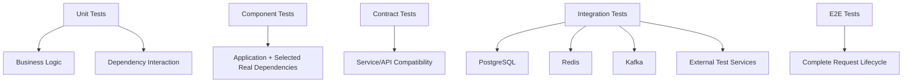

# 12- Dependency Mocking

## Overview

Dependency mocking is the practice of replacing a component used by the code under test with a controlled test double.

In backend systems, a unit rarely operates in isolation. A service may depend on:

- PostgreSQL repositories;
- Redis clients;
- HTTP clients;
- Kafka producers;
- Celery tasks;
- AWS SDK clients;
- authentication providers;
- clocks and random-number generators;
- filesystem or environment configuration.

Calling these dependencies directly during every unit test makes tests slower, less deterministic, harder to isolate, and potentially unsafe.

Mocking creates a controlled boundary:

```text
                    Unit Under Test
                          │
              ┌───────────┴───────────┐
              │                       │
        Business Logic          Dependency Boundary
                                      │
                               ┌──────┴──────┐
                               │             │
                           Real Service    Mock/Fake
```

The goal is not to mock everything. The goal is to isolate a unit where external behavior is not the subject of the test while preserving realistic contracts at the boundaries.

---

## What Is a Dependency?

A dependency is anything a component relies on to perform its work.

For example:

```python
class OrderService:
    def __init__(self, repository, payment_client) -> None:
        self.repository = repository
        self.payment_client = payment_client

    def create_order(self, order):
        saved_order = self.repository.save(order)
        self.payment_client.charge(saved_order.total)
        return saved_order
```

`OrderService` has two direct dependencies:

- `repository`;
- `payment_client`.

A unit test can replace both with test doubles.

```python
from unittest.mock import Mock


repository = Mock()
payment_client = Mock()

service = OrderService(
    repository=repository,
    payment_client=payment_client,
)
```

This allows the test to control dependency behavior and verify important interactions.

---

## Why Dependency Mocking Exists

Mocking primarily provides:

- **Isolation** — test the unit without invoking external systems.
- **Determinism** — control dependency responses and failures.
- **Speed** — avoid network, database, broker, or filesystem operations.
- **Failure simulation** — reproduce rare dependency failures reliably.
- **Interaction verification** — verify important calls and arguments.
- **Security** — prevent unit tests from accidentally reaching production services.
- **Cost control** — avoid unnecessary calls to paid or metered services.

A useful test boundary is:

```text
                 Unit Test
                     │
                     ▼
              ┌─────────────┐
              │ Service     │
              │ under test  │
              └──────┬──────┘
                     │
          ┌──────────┼──────────┐
          ▼          ▼          ▼
       Mock DB    Mock HTTP   Mock Queue
```

The test focuses on service behavior rather than infrastructure availability.

---

## What Should Be Mocked?

A dependency is a strong candidate for mocking when it is:

- external to the unit;
- slow;
- nondeterministic;
- expensive;
- stateful;
- difficult to reproduce;
- unsafe to invoke during unit tests;
- already tested independently.

Typical backend candidates include:

| Dependency | Unit-test strategy | Integration-test strategy |
|---|---|---|
| PostgreSQL repository | Mock/fake | Real PostgreSQL |
| Redis client | Mock/fake | Real Redis |
| HTTP API | Mock | Test server / real sandbox |
| Kafka producer | Mock | Real broker |
| Celery task | Mock | Worker integration |
| AWS SDK | Mock | AWS sandbox/local emulator where appropriate |
| Clock | Inject/mock | Real clock where appropriate |
| Filesystem | Temporary filesystem | Real filesystem behavior |
| Pure function | Usually no mock | Usually no integration test |

The important distinction is **what behavior the test is trying to prove**.

---

## Mocking vs Other Test Doubles

Mocking is one category of test-double strategy.

| Test double | Primary purpose |
|---|---|
| Dummy | Satisfy an unused parameter |
| Stub | Return controlled data |
| Fake | Provide a working simplified implementation |
| Spy | Record interactions with a real or partially real implementation |
| Mock | Simulate behavior and verify interactions |

Python's `unittest.mock` provides tools primarily for mocks and spies, while `pytest` commonly combines them with fixtures and third-party plugins.

---

## Mock vs Stub

Consider:

```python
repository.find_by_id.return_value = order
```

The mock is functioning as a **stub** because the important behavior is the returned value.

```python
repository.find_by_id.assert_called_once_with(order_id)
```

Now the same object is also being used as a **mock** because the test verifies an interaction.

The distinction is conceptual rather than based on a different Python class.

---

## Dependency Injection Makes Mocking Easier

Dependency injection is one of the strongest architectural techniques for making dependencies testable.

Prefer:

```python
class PaymentService:
    def __init__(self, payment_client) -> None:
        self.payment_client = payment_client
```

over:

```python
class PaymentService:
    def charge(self, amount: int) -> None:
        client = StripeClient()
        client.charge(amount)
```

With dependency injection:

```python
payment_client = Mock()

service = PaymentService(payment_client)
```

The dependency boundary is explicit.

With hard-coded construction, tests often require patching constructors or module-level names.

---

## Constructor Injection

Constructor injection is generally the simplest pattern:

```python
class UserService:
    def __init__(self, repository) -> None:
        self.repository = repository
```

Test:

```python
repository = Mock()
repository.get.return_value = user

service = UserService(repository)

result = service.get_user(user.id)

assert result == user
repository.get.assert_called_once_with(user.id)
```

Advantages:

- explicit dependencies;
- easy test setup;
- good static-analysis support;
- no hidden global state;
- straightforward lifecycle management.

---

## Protocol-Based Dependencies

Python's `Protocol` can define the contract without requiring inheritance.

```python
from typing import Protocol


class UserRepository(Protocol):
    def get(self, user_id: str):
        ...

    def save(self, user):
        ...
```

A service can depend on the protocol:

```python
class UserService:
    def __init__(self, repository: UserRepository) -> None:
        self.repository = repository
```

Tests can use a mock constrained by the interface:

```python
from unittest.mock import create_autospec

repository = create_autospec(UserRepository)
```

This reduces accidental coupling between tests and implementation details.

---

## The Most Important Mocking Rule

### Patch Where the Dependency Is Used

Suppose:

```python
# payments/client.py

class PaymentClient:
    def charge(self, amount: int) -> None:
        ...
```

Another module imports it directly:

```python
# orders/service.py

from payments.client import PaymentClient


def charge_order(amount: int) -> None:
    client = PaymentClient()
    client.charge(amount)
```

The code under test looks up:

```python
orders.service.PaymentClient
```

Therefore patch:

```python
with patch("orders.service.PaymentClient"):
    ...
```

not:

```python
with patch("payments.client.PaymentClient"):
    ...
```

The reason is Python's import binding behavior.

```text
payments.client.PaymentClient
             │
             │ imported
             ▼
orders.service.PaymentClient
             │
             │ looked up by code under test
             ▼
         patch here
```

This rule is one of the most common sources of mocking bugs.

---

## Import Semantics

Consider:

```python
from module_a import dependency
```

The importing module receives a local binding:

```text
module_a.dependency
       │
       ▼
module_b.dependency
```

Patching `module_a.dependency` later does not automatically replace `module_b.dependency`.

By contrast:

```python
import module_a
```

and:

```python
module_a.dependency()
```

causes the code to look up the attribute on `module_a`.

The correct patch target depends on the actual lookup performed by the code under test.

---

## Patching Constructors

Suppose:

```python
class ReportService:
    def generate(self):
        client = ReportClient()
        return client.fetch()
```

Test:

```python
from unittest.mock import patch


def test_generate() -> None:
    with patch("reports.service.ReportClient") as client_class:
        client_class.return_value.fetch.return_value = {
            "status": "ready",
        }

        service = ReportService()

        result = service.generate()

        assert result == {"status": "ready"}
        client_class.return_value.fetch.assert_called_once_with()
```

When patching a class, the patched class itself is a mock.

The instance created by:

```python
ReportClient()
```

is represented by:

```python
client_class.return_value
```

---

## Patching Functions

Suppose:

```python
# orders/service.py

from payments.gateway import charge


def process_payment(amount: int) -> None:
    charge(amount)
```

Patch:

```python
with patch("orders.service.charge") as charge_mock:
    process_payment(100)

charge_mock.assert_called_once_with(100)
```

Again, patch the name used by the module under test.

---

## `Mock`

Use `Mock` when the dependency exposes ordinary callable methods.

```python
from unittest.mock import Mock

repository = Mock()

repository.get.return_value = user

result = repository.get("user-123")
```

Assertions:

```python
repository.get.assert_called_once_with("user-123")
```

`Mock` is often the correct default.

---

## `MagicMock`

Use `MagicMock` when the dependency participates in Python protocols such as:

```python
len(obj)
obj[key]
item in obj
with obj:
    ...
```

Example:

```python
from unittest.mock import MagicMock

cache = MagicMock()

cache.__getitem__.return_value = "cached"

assert cache["key"] == "cached"
```

Do not use `MagicMock` automatically when `Mock` is sufficient.

---

## `AsyncMock`

Use `AsyncMock` for asynchronous callables:

```python
from unittest.mock import AsyncMock


client = AsyncMock()

client.fetch.return_value = {
    "status": "ok",
}
```

Then:

```python
result = await client.fetch()
```

You can assert:

```python
client.fetch.assert_awaited_once_with()
```

For async backend applications such as FastAPI services, using `AsyncMock` at async boundaries avoids incorrectly treating coroutines as ordinary return values.

---

## `spec`, `spec_set`, and `autospec`

Unconstrained mocks can silently accept invalid interfaces:

```python
client = Mock()

client.nonexistent_method.return_value = "ok"
```

This can hide production bugs.

Use a specification:

```python
client = Mock(spec=PaymentClient)
```

Stricter:

```python
client = Mock(spec_set=PaymentClient)
```

For signature-aware mocking:

```python
from unittest.mock import create_autospec

client = create_autospec(PaymentClient)
```

| Option | Main purpose |
|---|---|
| `spec` | Restrict attributes to an interface |
| `spec_set` | Also prevent unsupported attribute assignment |
| `autospec` | Preserve callable signatures |
| No spec | Maximum flexibility, least interface safety |

For important application boundaries, `spec` or `autospec` is generally preferable.

---

## Stubbing Return Values

The simplest mock configuration is:

```python
repository.get.return_value = user
```

This makes:

```python
repository.get(user_id)
```

return `user`.

Use this when the test needs a deterministic dependency response.

Avoid configuring irrelevant methods.

---

## Simulating Failures with `side_effect`

Dependencies often fail in production.

Mocking makes those paths deterministic:

```python
repository.get.side_effect = DatabaseError(
    "connection lost",
)
```

Test:

```python
with pytest.raises(DatabaseError):
    service.get_user("user-123")
```

For retries:

```python
repository.get.side_effect = [
    DatabaseError("temporary failure"),
    user,
]
```

This models:

```text
Attempt 1 → failure
Attempt 2 → success
```

Use this to test application retry behavior without intentionally destabilizing infrastructure.

---

## Testing Retry Limits

A production retry policy should have a bounded number of attempts.

```python
repository.get.side_effect = [
    TimeoutError(),
    TimeoutError(),
    TimeoutError(),
]
```

Then:

```python
with pytest.raises(TimeoutError):
    service.get_user("user-123")

assert repository.get.call_count == 3
```

This verifies that the application does not retry indefinitely.

Also test:

- backoff behavior where practical;
- non-retryable exceptions;
- timeout propagation;
- idempotency;
- final failure handling.

---

## Interaction Assertions

Important interaction assertions include:

```python
mock.assert_called_once_with(...)
mock.assert_not_called()
mock.method.assert_called_once()
mock.method.assert_awaited_once()
```

Use them when the interaction is part of the behavior.

For example:

```python
payment_client.charge.assert_called_once_with(
    amount=100,
)
```

is useful if charging the payment provider is a critical business action.

---

## Avoid Over-Assertion

This is often brittle:

```python
repository.begin.assert_called_once()
repository.query.assert_called_once()
repository.commit.assert_called_once()
repository.close.assert_called_once()
```

If the business behavior only requires:

```python
repository.save(order)
```

the test should not necessarily assert every internal database operation.

Prefer:

```text
Behavioral contract
        │
        ▼
Critical interaction
        │
        ▼
Minimal assertion
```

Tests should protect behavior, not prevent legitimate refactoring.

---

## State Assertions vs Interaction Assertions

Consider:

```python
repository.save(order)
```

An interaction assertion verifies:

```python
repository.save.assert_called_once_with(order)
```

A state assertion verifies the resulting behavior:

```python
assert service.create_order(order).status == "created"
```

Neither is universally better.

Use interaction assertions when:

- an external side effect must occur;
- the dependency call itself is contractual;
- the result cannot otherwise expose the behavior.

Prefer state/output assertions when they adequately capture the contract.

---

## Mocking HTTP APIs

Suppose:

```python
class CustomerService:
    def __init__(self, client) -> None:
        self.client = client

    def get_customer(self, customer_id: str):
        response = self.client.get(
            f"/customers/{customer_id}",
        )
        response.raise_for_status()
        return response.json()
```

Unit test:

```python
from unittest.mock import Mock


client = Mock()
response = Mock()

response.json.return_value = {
    "id": "customer-123",
    "status": "active",
}

client.get.return_value = response

service = CustomerService(client)

result = service.get_customer("customer-123")

assert result["status"] == "active"

client.get.assert_called_once_with(
    "/customers/customer-123",
)
response.raise_for_status.assert_called_once_with()
```

This tests service behavior without making a network request.

---

## HTTP Failure Testing

Simulate an HTTP failure:

```python
response.raise_for_status.side_effect = HTTPError(
    "502 Bad Gateway",
)
```

Then verify that the application maps or propagates the failure correctly.

Test meaningful cases such as:

- `400`;
- `401`;
- `403`;
- `404`;
- `409`;
- `429`;
- `500`;
- `502`;
- timeout;
- connection failure;
- malformed response.

Do not assume mocking one HTTP error proves the entire client integration.

---

## Mocking PostgreSQL Repositories

For unit tests:

```python
repository = Mock()
repository.get.return_value = user
repository.save.return_value = user
```

This isolates business logic.

For example:

```python
service = UserService(repository)

result = service.create_user(user)

assert result == user
repository.save.assert_called_once_with(user)
```

But mocked repositories cannot validate:

- SQL correctness;
- constraints;
- transaction isolation;
- deadlocks;
- locking;
- indexes;
- query plans;
- serialization behavior.

Use real PostgreSQL integration tests for those concerns.

---

## Mocking Redis

Redis dependencies can be mocked for service-level tests:

```python
cache = Mock()

cache.get.return_value = '{"status": "active"}'
```

Test cache-hit behavior:

```python
result = service.get_customer("customer-123")

cache.get.assert_called_once_with(
    "customer:customer-123",
)
```

Also test cache misses:

```python
cache.get.return_value = None
```

and failures:

```python
cache.get.side_effect = RedisError(
    "connection refused",
)
```

Redis-specific semantics such as TTL, atomicity, distributed locking, and eviction should be covered by integration tests.

---

## Mocking Kafka Producers

A producer can be mocked:

```python
producer = Mock()

service = EventService(producer)

service.publish_order_created(order)

producer.publish.assert_called_once()
```

You can also simulate publication failure:

```python
producer.publish.side_effect = KafkaError(
    "broker unavailable",
)
```

Tests should verify how the application handles:

- publish failure;
- retries;
- idempotency;
- serialization errors;
- acknowledgment behavior.

Actual Kafka delivery and partition semantics require integration testing.

---

## Mocking Celery Tasks

Suppose:

```python
def create_order(order) -> None:
    repository.save(order)
    send_confirmation.delay(order.id)
```

Unit test:

```python
with patch(
    "orders.service.send_confirmation.delay",
) as send_confirmation:
    create_order(order)

send_confirmation.assert_called_once_with(order.id)
```

This verifies task scheduling.

It does not prove that:

- a Celery worker executes the task;
- the broker accepts the message;
- retries work;
- task serialization works.

Those concerns require appropriate integration tests.

---

## Mocking AWS SDK Clients

AWS SDK clients are common external dependencies.

For example:

```python
class StorageService:
    def __init__(self, client) -> None:
        self.client = client

    def upload(self, bucket: str, key: str, body: bytes) -> None:
        self.client.put_object(
            Bucket=bucket,
            Key=key,
            Body=body,
        )
```

Unit test:

```python
client = Mock()

service = StorageService(client)

service.upload(
    bucket="orders",
    key="order-123.json",
    body=b"{}",
)

client.put_object.assert_called_once_with(
    Bucket="orders",
    Key="order-123.json",
    Body=b"{}",
)
```

Use integration tests or AWS-compatible test environments when actual API semantics matter.

---

## Mocking Time

Time is a hidden dependency.

Avoid scattering direct calls to:

```python
datetime.now()
```

throughout business logic.

Prefer an injectable clock:

```python
from datetime import datetime
from typing import Protocol


class Clock(Protocol):
    def now(self) -> datetime:
        ...
```

Production:

```python
class SystemClock:
    def now(self) -> datetime:
        return datetime.now()
```

Test:

```python
clock = Mock()
clock.now.return_value = fixed_time
```

This is often cleaner than globally patching datetime.

---

## Mocking Randomness

Random behavior should also be controllable.

Instead of deeply patching random internals, inject a generator or boundary where practical:

```python
class TokenService:
    def __init__(self, token_generator) -> None:
        self.token_generator = token_generator
```

Test:

```python
token_generator = Mock()
token_generator.generate.return_value = "fixed-token"

service = TokenService(token_generator)

assert service.create_token() == "fixed-token"
```

Deterministic randomness makes security-sensitive and retry-related tests easier to reason about.

---

## Mocking Environment Variables

Environment configuration can be temporarily patched:

```python
from unittest.mock import patch


with patch.dict(
    "os.environ",
    {"APP_ENV": "test"},
):
    ...
```

Use:

```python
clear=True
```

when the test needs a controlled environment:

```python
with patch.dict(
    "os.environ",
    {"APP_ENV": "test"},
    clear=True,
):
    ...
```

Be careful with environment patching because it modifies process-global state.

---

## Mocking Filesystem Dependencies

For filesystem behavior, a real temporary filesystem is often better than mocking.

With pytest:

```python
def test_export(tmp_path):
    output = tmp_path / "orders.json"

    output.write_text(
        '{"status": "ok"}',
        encoding="utf-8",
    )

    assert output.exists()
```

Use mocks when testing whether a higher-level component delegates to a filesystem abstraction.

Use temporary files when actual filesystem semantics are part of the behavior.

---

## Mocking Authentication

Security tests should explicitly control authentication state.

For example:

```python
auth = Mock()

auth.authenticate.return_value = User(
    id="user-123",
    roles={"admin"},
)
```

Then test:

- valid credentials;
- invalid credentials;
- expired credentials;
- missing credentials;
- authenticated but unauthorized users;
- dependency failures.

Do not configure authentication mocks to always succeed and then assume authorization is tested.

---

## FastAPI Dependency Overrides

FastAPI provides dependency injection that can be overridden in tests.

Example production dependency:

```python
def get_repository():
    return PostgreSQLRepository()
```

Test override:

```python
app.dependency_overrides[get_repository] = (
    lambda: mock_repository
)
```

This is often preferable to patching internal constructors because the application already exposes a dependency boundary.

Always clean up overrides after the test or fixture:

```python
app.dependency_overrides.clear()
```

---

## Django Dependency Boundaries

Django code can use mocks at service boundaries while relying on Django's testing tools for framework behavior.

Good candidates for mocking include:

- external HTTP clients;
- payment providers;
- email providers;
- message publishers;
- third-party APIs.

Avoid mocking Django internals merely to make unit tests pass.

Use Django's test client and integration facilities when the behavior being tested depends on:

- middleware;
- routing;
- authentication;
- ORM semantics;
- serialization;
- transactions.

---

## Microservice Boundaries

In a microservice architecture:

```text
Order Service
     │
     ├── PostgreSQL
     ├── Redis
     ├── Payment Service
     └── Kafka
```

A unit test might mock all external boundaries:

```text
Order Service Unit Test
     │
     ├── Mock Repository
     ├── Mock Redis
     ├── Mock Payment Client
     └── Mock Kafka Producer
```

But the complete test strategy should also include:

```text
Unit Tests
    ↓
Component Tests
    ↓
Contract Tests
    ↓
Integration Tests
    ↓
End-to-End Tests
```

Mocking cannot replace integration or contract testing.

---

## Contract Testing

A mock encodes what the test author believes the dependency looks like.

That belief can become stale.

Contract tests reduce this risk by validating the actual interface between services.

For example:

```text
Consumer Test
     │
     ▼
Expected API Contract
     │
     ▼
Provider Verification
```

For REST or gRPC microservices, contract testing can validate:

- request schemas;
- response schemas;
- status codes;
- required fields;
- error contracts;
- compatibility rules.

Mocks and contract tests solve different problems and complement each other.

---

## Mocking and Concurrency

Mocks are mutable objects.

Using the same mock concurrently across threads or asyncio tasks can make call history difficult to reason about.

Avoid shared mutable mocks:

```python
global_client_mock
```

Prefer one mock per test or per isolated operation.

For concurrent code, test:

- race-sensitive behavior;
- cancellation;
- timeouts;
- retries;
- duplicate execution;
- idempotency.

Do not assume mock call ordering proves production concurrency behavior.

---

## Mocking Transactions

A unit test can verify that a transaction abstraction is used:

```python
transaction_manager = Mock()
transaction = MagicMock()

transaction_manager.transaction.return_value = transaction

transaction.__enter__.return_value = transaction
transaction.__exit__.return_value = False
```

But transaction correctness is an infrastructure property.

Integration tests should verify:

```text
BEGIN
  │
  ├── operation A
  ├── operation B
  │
  └── COMMIT / ROLLBACK
```

including behavior under exceptions and concurrent access.

---

## Mocking Retries and Idempotency

Retries must be tested together with idempotency where side effects are involved.

Example:

```python
payment_client.charge.side_effect = [
    TimeoutError(),
    {"status": "charged"},
]
```

The application should not accidentally create two charges if the first request actually succeeded but the response was lost.

A good test strategy considers:

```text
Request
  │
  ▼
Dependency call
  │
  ├── success
  ├── timeout after side effect
  ├── explicit failure
  └── connection failure
```

Mocking helps reproduce these states, while integration testing verifies the real provider's semantics where required.

---

## Test Isolation

Each test should own its mock configuration.

Prefer:

```python
def test_success():
    repository = Mock()
    ...


def test_failure():
    repository = Mock()
    ...
```

over a shared mutable mock.

Shared mocks can cause:

- stale `return_value`;
- accumulated call history;
- unexpected `side_effect`;
- order-dependent tests.

Fresh test doubles are usually cheap and safer.

---

## Resetting Mocks

`reset_mock()` clears recorded calls and related state:

```python
mock.reset_mock()
```

However, repeated resetting is often a sign that the test structure is too stateful.

Prefer creating a fresh mock where practical.

Use reset when a test intentionally exercises multiple phases against the same dependency.

---

## Mock Lifecycle

Patch-based mocks should be scoped tightly.

Preferred:

```python
with patch("orders.service.PaymentClient"):
    ...
```

or:

```python
@patch("orders.service.PaymentClient")
def test_order(mock_client):
    ...
```

Avoid manually mutating production modules unless there is a strong reason.

If manual patching is necessary:

```python
patcher = patch("orders.service.PaymentClient")
mock_client = patcher.start()

try:
    ...
finally:
    patcher.stop()
```

Failure to restore patches can contaminate subsequent tests.

---

## Test Architecture

A maintainable backend test suite usually separates responsibilities:



Mocking is primarily a unit/component testing technique, not a replacement for the entire testing pyramid.

---

## Performance Considerations

Mocks can make unit tests dramatically faster than real infrastructure calls.

A suite that performs:

```text
10,000 tests
    ×
network/database operations
```

can become slow and unreliable.

Mocks keep most unit tests in-process.

However, excessive mocking can create another performance problem: a large test suite that executes quickly but provides weak confidence.

Optimize for:

```text
Fast unit tests
+
Meaningful integration tests
+
Targeted E2E coverage
```

rather than maximizing the number of mocked tests.

---

## Security Considerations

Dependency mocks must never accidentally point at production infrastructure.

Recommended practices:

- use test-only credentials;
- isolate test databases;
- disable real external calls in unit tests;
- use synthetic customer/payment data;
- fail tests if production endpoints are detected;
- avoid committing credentials into fixtures;
- explicitly test authentication and authorization failures.

A test environment should make accidental production access difficult.

---

## Observability Testing

Mocks can verify that important observability dependencies are invoked:

```python
metrics.increment.assert_called_once_with(
    "orders.created",
)
```

But avoid making tests depend on every internal metric call.

For logging, metrics, and tracing, test critical operational contracts such as:

- security events;
- error counters;
- retry counters;
- business-critical metrics;
- correlation propagation.

Observability itself should also be validated through integration or system-level tests where appropriate.

---

## Reliability Testing

Important dependency failures to model include:

| Failure | Example |
|---|---|
| Timeout | `TimeoutError` |
| Connection failure | `ConnectionError` |
| Rate limit | HTTP `429` |
| Authentication failure | HTTP `401` |
| Authorization failure | HTTP `403` |
| Missing resource | HTTP `404` |
| Conflict | HTTP `409` |
| Server failure | HTTP `500` |
| Dependency unavailable | connection refused |
| Malformed response | invalid JSON/schema |

The purpose is to verify that application failure handling is intentional.

---

## Cost Considerations

Mocking can reduce test infrastructure and third-party API costs.

For example, a unit suite should not repeatedly invoke:

- paid APIs;
- cloud services;
- external payment providers;
- managed databases;
- production-like SaaS systems.

Use mocks for fast local validation and reserve real infrastructure for targeted integration and staging tests.

---

## Common Mistakes

### Mocking Everything

If every dependency is mocked, the test may verify a fictional system rather than the real one.

### Patching the Wrong Namespace

Patching where the dependency was defined instead of where it is looked up causes tests to use the real dependency unexpectedly.

### Using Unconstrained Mocks

A mock can accept nonexistent methods and hide interface drift.

Use `spec` or `autospec` for important boundaries.

### Over-Testing Interactions

Verifying every internal call makes tests brittle.

Assert behavior and critical interactions.

### Deep Mock Chains

Long chains such as:

```python
client.session.return_value.__enter__.return_value.response.json.return_value
```

often indicate excessive coupling.

### Mocking Infrastructure Semantics

A mock cannot prove PostgreSQL transactions, Redis TTL behavior, Kafka delivery semantics, or real HTTP compatibility.

### Shared Mocks

Global mocks can leak state between tests.

### Incorrect Async Mocking

Using `Mock` for an awaited method can produce incorrect coroutine behavior.

Use `AsyncMock`.

---

## Production Pitfalls

### Stale Mocks

A service interface changes while tests continue passing because mocks are unconstrained.

**Mitigation:** use `spec`, `autospec`, protocols, contract tests, and integration tests.

### False Positives

The mock returns exactly what the test expects even though the real dependency would reject the request.

**Mitigation:** test real dependency semantics separately.

### Over-Coupled Tests

Tests know too much about constructors, private methods, and internal call chains.

**Mitigation:** define explicit service boundaries and test observable behavior.

### Hidden Global State

Patching environment variables, module globals, or shared clients can affect unrelated tests.

**Mitigation:** scope patches narrowly and restore state automatically.

### Missing Failure Tests

Only the happy path is mocked.

**Mitigation:** model realistic timeout, rate-limit, dependency, serialization, and authorization failures.

---

## Recommended Mocking Strategy

A strong backend testing strategy follows these principles:

1. **Define explicit dependency boundaries.**
2. **Prefer dependency injection over global patching.**
3. **Use `Mock` for ordinary synchronous collaborators.**
4. **Use `MagicMock` for protocol-heavy dependencies.**
5. **Use `AsyncMock` for awaited callables.**
6. **Use `spec` or `autospec` for important interfaces.**
7. **Patch where the dependency is looked up.**
8. **Assert behavior and only critical interactions.**
9. **Use real infrastructure for infrastructure semantics.**
10. **Use contract tests for service-to-service compatibility.**
11. **Keep test doubles isolated and short-lived.**
12. **Test dependency failures explicitly.**

---

## Mocking Decision Guide

| Situation | Recommended approach |
|---|---|
| Pure business logic | Real inputs, no mocks |
| Ordinary collaborator | `Mock` |
| Magic-method protocol | `MagicMock` |
| Awaited function | `AsyncMock` |
| Important interface | `spec` / `autospec` |
| Stateful lightweight dependency | Fake |
| Real PostgreSQL semantics | Integration test |
| Real Redis semantics | Integration test |
| Kafka delivery behavior | Integration test |
| REST compatibility | Contract/integration test |
| Complete request flow | E2E test |
| Time-dependent logic | Inject clock |
| Random-dependent logic | Inject generator |

---

## Practical Review Checklist

Before adding a mock, ask:

- [ ] Is this dependency actually external to the unit?
- [ ] Could a real value provide the behavior more simply?
- [ ] Would a fake be more realistic?
- [ ] Is dependency injection available?
- [ ] Am I patching where the dependency is used?
- [ ] Should the mock use `spec` or `autospec`?
- [ ] Does the dependency need `MagicMock` or `AsyncMock`?
- [ ] Am I testing behavior rather than implementation details?
- [ ] Have important failure modes been covered?
- [ ] Is the real infrastructure behavior tested elsewhere?
- [ ] Can the test accidentally access production?
- [ ] Is the mock isolated to this test?

---

## Interview Traps

### What Is Dependency Mocking?

It is replacing a real dependency with a controlled test double so the code under test can be isolated and dependency behavior can be deterministic.

### Why Mock External Services?

To avoid network latency, nondeterminism, cost, unavailable infrastructure, external side effects, and difficult-to-reproduce failures during unit tests.

### What Is the Most Important Rule When Using `patch()`?

Patch the name where the code under test looks up the dependency, not necessarily where the dependency was originally defined.

### When Should You Use a Fake Instead of a Mock?

Use a fake when realistic stateful behavior is important and a small working implementation provides more confidence and readability than extensive mock configuration.

### Why Are Unconstrained Mocks Dangerous?

They can accept attributes and method calls that do not exist on the production dependency, allowing tests to pass despite interface drift.

### Does Mocking a Repository Test PostgreSQL?

No. It tests the service's interaction with the repository abstraction. PostgreSQL behavior requires integration testing.

### Should Every External Dependency Be Mocked?

No. The appropriate strategy depends on the test level. Unit tests often mock external boundaries, while integration and contract tests should exercise real or representative dependencies.

### Why Is Dependency Injection Valuable for Testing?

It makes dependencies explicit and replaceable, reducing the need for invasive global patching and improving architecture at the same time.

### What Is the Difference Between `Mock` and `MagicMock`?

`Mock` is generally sufficient for ordinary methods. `MagicMock` additionally provides convenient support for many Python magic methods and protocols.

### Why Use `AsyncMock`?

Because asynchronous functions return awaitable behavior. `AsyncMock` provides correct async semantics and assertions such as `assert_awaited_once_with()`.

## Key Takeaways

- **Mock dependencies to isolate behavior, not to avoid all integration testing:** unit tests should be fast and deterministic, while real infrastructure semantics require integration or contract tests.
- **Patch where the code looks up the dependency:** Python import bindings determine the correct patch target; patching the definition instead of the usage site is a common source of broken tests.
- **Prefer explicit, type-constrained boundaries:** dependency injection, protocols, `spec`, and `autospec` reduce hidden coupling and protect tests from interface drift.
- **Use the appropriate test double:** `Mock` for ordinary collaborators, `MagicMock` for magic-method protocols, `AsyncMock` for awaited callables, and fakes or real values when they provide more realistic behavior.
- **Keep assertions behavior-focused:** verify critical side effects and dependency interactions without encoding unnecessary implementation details into the test suite.