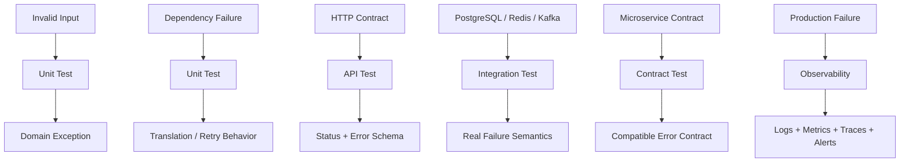

# 13- Testing Exceptions

## Overview

Exception testing verifies that a component fails in the expected way when invalid input, dependency failures, or internal errors occur.

For backend systems, failure behavior is part of the API and service contract. A function that raises the wrong exception, exposes sensitive error details, silently suppresses a failure, or retries an operation incorrectly can cause production incidents even when the happy path works.

A robust exception test verifies more than:

```python
with pytest.raises(ValueError):
    service.process(...)
```

It should establish the relevant contract:

- which exception type is raised;
- when it is raised;
- whether the original cause is preserved;
- whether the exception contains useful structured information;
- whether side effects occurred before failure;
- whether retries happened when appropriate;
- whether the failure is translated correctly at an API boundary;
- whether resources and transactions were cleaned up.

The objective is to make failure behavior deterministic, intentional, and observable.

---

## Why Exception Testing Matters

Production failures commonly originate at dependency and validation boundaries:

```text
HTTP Request
    │
    ▼
Input Validation
    │
    ├── invalid input ───────► 4xx response
    │
    ▼
Service Layer
    │
    ├── domain failure ──────► domain exception
    │
    ▼
Repository / External API
    │
    ├── timeout ──────────────► retry or failure
    ├── connection error ─────► recovery/failure
    └── constraint violation ─► translated error
```

Exception tests ensure that each failure path has an explicit contract.

Without them, developers frequently introduce regressions such as:

- catching `Exception` and hiding defects;
- changing an exception type accidentally;
- losing exception chaining;
- returning `None` instead of failing;
- exposing database errors through an API;
- retrying non-retryable failures;
- performing partial writes;
- suppressing exceptions during cleanup.

---

## What Should Be Tested?

Exception tests should focus on observable failure behavior.

| Concern | Example assertion |
|---|---|
| Exception type | `pytest.raises(NotFoundError)` |
| Exception message | Match stable user-facing context |
| Structured attributes | `exc.value.order_id` |
| Exception cause | `exc.value.__cause__` |
| Side effects | `mock.assert_not_called()` |
| Partial work | Verify rollback or compensating behavior |
| Retry count | `mock.call_count == 3` |
| API translation | HTTP `404`, `409`, `503`, etc. |
| Cleanup | Resource is closed/released |
| Logging/metrics | Critical operational event emitted |

Do not test implementation details that are unrelated to the failure contract.

---

## `pytest.raises`

The standard pytest mechanism is:

```python
import pytest


def test_invalid_amount_raises() -> None:
    with pytest.raises(ValueError):
        calculate_total(-10)
```

The context manager expects the enclosed code to raise the specified exception.

If no exception is raised, the test fails.

If a different exception is raised, the test also fails.

---

## Capturing the Exception

Use `as` when the exception itself needs inspection:

```python
with pytest.raises(ValueError) as exc_info:
    calculate_total(-10)

assert str(exc_info.value) == "amount must be non-negative"
```

`exc_info.value` is the actual exception instance.

This is useful for testing structured exception data.

---

## Exception Type Is More Important Than the Message

Prefer:

```python
with pytest.raises(OrderNotFoundError):
    service.get_order("order-123")
```

over relying entirely on:

```python
with pytest.raises(Exception):
    ...
```

A broad exception assertion can hide defects.

For example, this test may pass when the application accidentally raises `KeyError`, `TypeError`, or `AttributeError`:

```python
with pytest.raises(Exception):
    service.get_order("order-123")
```

Use the narrowest meaningful exception type.

---

## Exact Exception Messages

Exact messages can be appropriate when the message is part of the contract:

```python
with pytest.raises(ValueError, match="amount must be positive"):
    process_payment(0)
```

However, avoid asserting long implementation-specific messages.

Prefer stable contract-level information.

Bad:

```python
assert str(exc_info.value) == (
    "repository.py line 47 failed while executing..."
)
```

Better:

```python
assert "order-123" in str(exc_info.value)
```

or, preferably, test structured fields.

---

## Structured Exceptions

Production exceptions often carry structured information:

```python
class OrderNotFoundError(Exception):
    def __init__(self, order_id: str) -> None:
        self.order_id = order_id
        super().__init__(f"Order {order_id} was not found")
```

Test:

```python
with pytest.raises(OrderNotFoundError) as exc_info:
    service.get_order("order-123")

assert exc_info.value.order_id == "order-123"
```

Structured attributes are generally more stable than parsing strings.

---

## Testing Custom Exceptions

A domain exception should communicate business semantics:

```python
class InsufficientInventoryError(Exception):
    def __init__(self, product_id: str, requested: int) -> None:
        self.product_id = product_id
        self.requested = requested
        super().__init__(
            f"Insufficient inventory for {product_id}"
        )
```

Test:

```python
with pytest.raises(InsufficientInventoryError) as exc_info:
    inventory.reserve("product-123", 10)

assert exc_info.value.product_id == "product-123"
assert exc_info.value.requested == 10
```

The test verifies the domain contract rather than the internal implementation.

---

## Exception Hierarchies

Custom exceptions should usually form a meaningful hierarchy:

```python
class OrderError(Exception):
    """Base class for order-domain failures."""


class OrderNotFoundError(OrderError):
    pass


class InvalidOrderStateError(OrderError):
    pass


class OrderAlreadyExistsError(OrderError):
    pass
```

Tests can verify either the specific exception:

```python
with pytest.raises(OrderNotFoundError):
    ...
```

or, where intentionally testing common handling:

```python
with pytest.raises(OrderError):
    ...
```

Prefer the most specific type when the distinction matters.

---

## Testing Exception Chaining

Exception chaining preserves the original cause:

```python
try:
    repository.get(order_id)
except DatabaseError as exc:
    raise OrderRepositoryError(
        f"Failed to load {order_id}"
    ) from exc
```

Test the chain:

```python
database_error = DatabaseError("connection failed")

repository.get.side_effect = database_error

with pytest.raises(OrderRepositoryError) as exc_info:
    service.get_order("order-123")

assert exc_info.value.__cause__ is database_error
```

Chaining is important for debugging while allowing the application layer to expose a domain-specific exception.

---

## `__cause__` vs `__context__`

Python distinguishes explicit and implicit exception relationships.

Explicit chaining:

```python
raise ServiceError("operation failed") from exc
```

sets:

```python
exception.__cause__
```

Implicit chaining:

```python
try:
    ...
except ValueError:
    raise ServiceError("operation failed")
```

sets the original exception as context:

```python
exception.__context__
```

Tests should inspect these attributes when exception provenance is part of the reliability or debugging contract.

---

## Testing Exception Suppression

Some context managers intentionally suppress exceptions.

For example:

```python
class SuppressErrors:
    def __enter__(self):
        return self

    def __exit__(self, exc_type, exc_value, traceback):
        return True
```

The behavior should be tested explicitly.

Do not assume every exception inside a context manager propagates.

For most application resources, accidental suppression is a defect and should be covered by tests.

---

## Testing `try` / `except` Behavior

Consider:

```python
def load_order(repository, order_id: str):
    try:
        return repository.get(order_id)
    except RepositoryNotFoundError as exc:
        raise OrderNotFoundError(order_id) from exc
```

Test both the expected translation and unrelated failures.

```python
def test_repository_not_found_is_translated() -> None:
    repository = Mock()

    repository.get.side_effect = RepositoryNotFoundError(
        "missing",
    )

    with pytest.raises(OrderNotFoundError):
        load_order(repository, "order-123")
```

Also test that unexpected failures are not accidentally swallowed:

```python
def test_unexpected_error_propagates() -> None:
    repository = Mock()

    repository.get.side_effect = RuntimeError(
        "unexpected failure",
    )

    with pytest.raises(RuntimeError):
        load_order(repository, "order-123")
```

---

## Avoid Catching `Exception` Blindly

This pattern is dangerous:

```python
try:
    process_order(order)
except Exception:
    return None
```

It can hide:

- programming errors;
- database failures;
- serialization errors;
- security failures;
- configuration errors.

If broad exception handling is intentional, test exactly which failures should be converted, logged, retried, or suppressed.

---

## Testing `finally` Cleanup

Cleanup should happen even when an exception occurs.

Example:

```python
def process(resource) -> None:
    try:
        resource.start()
        resource.process()
    finally:
        resource.close()
```

Test:

```python
def test_resource_is_closed_on_failure() -> None:
    resource = Mock()

    resource.process.side_effect = RuntimeError(
        "processing failed",
    )

    with pytest.raises(RuntimeError):
        process(resource)

    resource.close.assert_called_once_with()
```

This validates an important reliability property: failure must not leak resources.

---

## Testing Context Manager Cleanup

For context-managed resources:

```python
def process(resource) -> None:
    with resource:
        resource.process()
```

Test failure propagation and cleanup:

```python
def test_context_manager_handles_failure() -> None:
    resource = MagicMock()

    resource.__enter__.return_value = resource
    resource.__exit__.return_value = False
    resource.process.side_effect = RuntimeError()

    with pytest.raises(RuntimeError):
        process(resource)

    resource.__exit__.assert_called_once()
```

The exact cleanup behavior should reflect the real context manager contract.

---

## Testing API Exception Translation

A backend service should generally not expose raw infrastructure exceptions.

For example:

```text
PostgreSQL
    │
    └── IntegrityError
            │
            ▼
Repository
    │
    └── Domain exception
            │
            ▼
FastAPI exception handler
            │
            ▼
HTTP 409 Conflict
```

A test should verify the externally visible contract.

For example:

```python
def test_duplicate_order_returns_conflict(client) -> None:
    response = client.post(
        "/orders",
        json={"id": "order-123"},
    )

    assert response.status_code == 409
    assert response.json()["code"] == "ORDER_ALREADY_EXISTS"
```

The API test should not require knowledge of PostgreSQL's internal exception message.

---

## FastAPI Exception Testing

FastAPI commonly maps application exceptions to HTTP responses.

For example:

```python
@app.exception_handler(OrderNotFoundError)
async def order_not_found_handler(
    request: Request,
    exc: OrderNotFoundError,
):
    return JSONResponse(
        status_code=404,
        content={
            "code": "ORDER_NOT_FOUND",
            "order_id": exc.order_id,
        },
    )
```

Test the HTTP contract:

```python
response = client.get("/orders/order-123")

assert response.status_code == 404
assert response.json() == {
    "code": "ORDER_NOT_FOUND",
    "order_id": "order-123",
}
```

This separates domain errors from transport-level representation.

---

## Django Exception Testing

Django tests can verify both service-level exceptions and HTTP behavior.

Service-level:

```python
with pytest.raises(OrderNotFoundError):
    service.get_order("order-123")
```

HTTP-level:

```python
response = client.get("/orders/order-123/")

assert response.status_code == 404
```

Use the appropriate layer for the contract being tested.

Do not test an HTTP response when the behavior under test is purely domain logic.

---

## REST API Error Contracts

A mature REST API should have predictable error semantics.

Typical mappings include:

| Exception category | HTTP response |
|---|---:|
| Invalid input | `400 Bad Request` |
| Authentication failure | `401 Unauthorized` |
| Authorization failure | `403 Forbidden` |
| Resource not found | `404 Not Found` |
| Conflict | `409 Conflict` |
| Rate limit | `429 Too Many Requests` |
| Dependency unavailable | `503 Service Unavailable` |
| Unexpected server error | `500 Internal Server Error` |

The exact mapping depends on the API contract.

Tests should verify stable fields such as:

```json
{
  "code": "ORDER_NOT_FOUND",
  "message": "Order was not found"
}
```

Avoid exposing stack traces, SQL statements, credentials, or internal infrastructure details.

---

## gRPC Exception Testing

gRPC uses status codes rather than HTTP status codes.

Application errors may be mapped to statuses such as:

- `INVALID_ARGUMENT`;
- `UNAUTHENTICATED`;
- `PERMISSION_DENIED`;
- `NOT_FOUND`;
- `ALREADY_EXISTS`;
- `RESOURCE_EXHAUSTED`;
- `UNAVAILABLE`;
- `INTERNAL`.

Tests should verify the externally visible gRPC status and structured metadata where applicable.

The underlying Python exception should not automatically become the public contract.

---

## Testing Database Exceptions

A repository may translate database errors:

```python
try:
    cursor.execute(query)
except IntegrityError as exc:
    raise OrderAlreadyExistsError(order_id) from exc
```

Unit test:

```python
cursor.execute.side_effect = IntegrityError(
    "duplicate key",
)

with pytest.raises(OrderAlreadyExistsError):
    repository.create(order)
```

Then integration-test the actual PostgreSQL constraint.

This creates two complementary guarantees:

```text
Unit test
    → exception translation

Integration test
    → actual database constraint behavior
```

---

## Testing Transactions on Failure

Transaction behavior should include failure paths.

A service may perform:

```text
BEGIN
  │
  ├── insert order
  ├── update inventory
  └── publish event
```

If a critical operation fails, the expected result may be:

```text
BEGIN
  │
  ├── insert order
  ├── update inventory
  │
  └── failure
        │
        ▼
     ROLLBACK
```

Mock-based tests can verify that the service invokes the transaction boundary correctly.

Real PostgreSQL tests should verify actual rollback semantics.

---

## Testing Redis Failures

Redis failures should be tested when cache behavior affects reliability.

Example:

```python
cache.get.side_effect = RedisError(
    "connection refused",
)
```

Then verify whether the service:

- fails the request;
- bypasses the cache;
- uses stale data;
- retries;
- records an operational metric.

The correct behavior depends on whether Redis is a performance optimization or a required dependency.

---

## Testing Kafka Failures

Kafka publication failures are important when events represent business side effects.

```python
producer.publish.side_effect = KafkaError(
    "broker unavailable",
)
```

Test whether the application:

- retries;
- returns an error;
- records the event for later delivery;
- rolls back related work;
- relies on an outbox pattern.

For critical events, unit tests alone are insufficient because actual broker and transaction semantics matter.

---

## Testing Celery Failures

A Celery task may fail because of:

- dependency timeout;
- database failure;
- serialization failure;
- invalid input;
- transient infrastructure failure.

Unit tests can simulate these exceptions:

```python
task.run.side_effect = TimeoutError()
```

Then test retry policy and terminal failure behavior.

Integration tests should verify actual Celery retry configuration and broker/worker behavior.

---

## Retryable vs Non-Retryable Exceptions

Not every exception should trigger a retry.

| Failure | Usually retryable? |
|---|---:|
| Temporary network timeout | Often |
| Connection reset | Often |
| HTTP `429` | Usually |
| HTTP `503` | Often |
| Validation error | No |
| Authentication failure | Usually no |
| Authorization failure | No |
| Duplicate request | No |
| Missing resource | Usually no |
| Programming error | No |

The policy depends on the dependency and operation.

Tests should explicitly encode the retry boundary.

---

## Testing Retry Behavior

Example:

```python
client.fetch.side_effect = [
    TimeoutError(),
    TimeoutError(),
    {"status": "ok"},
]
```

Then:

```python
result = service.fetch()

assert result == {"status": "ok"}
assert client.fetch.call_count == 3
```

Also test the terminal failure:

```python
client.fetch.side_effect = TimeoutError()

with pytest.raises(TimeoutError):
    service.fetch()

assert client.fetch.call_count == 3
```

Avoid testing only that "some retry happened."

Verify the bounded retry contract.

---

## Testing Idempotency with Exceptions

Retries become dangerous when operations have side effects.

For example:

```text
Charge payment
     │
     ▼
Payment succeeds
     │
     ▼
Response lost
     │
     ▼
Client retries
     │
     ▼
Second charge?
```

Exception tests should consider failures that occur **after** a side effect.

For critical operations, test:

- timeout after successful remote execution;
- duplicate request;
- retry with same idempotency key;
- partial local state;
- eventual reconciliation.

Mocks can model these states, but provider integration tests are required for actual idempotency guarantees.

---

## Exception Testing in Async Code

For asynchronous functions:

```python
with pytest.raises(TimeoutError):
    await client.fetch()
```

The awaited operation belongs inside the exception assertion.

For asynchronous mocks:

```python
client.fetch = AsyncMock(
    side_effect=TimeoutError(),
)
```

Then:

```python
with pytest.raises(TimeoutError):
    await service.fetch()
```

Also test cancellation separately.

Cancellation is not equivalent to an ordinary application failure.

---

## Testing Cancellation

Async applications should not accidentally convert cancellation into a normal application error.

Avoid broad handling such as:

```python
try:
    await operation()
except Exception:
    ...
```

without understanding cancellation semantics.

Test cancellation explicitly when the service owns long-running async work.

Important concerns include:

- task cancellation;
- cleanup;
- connection release;
- transaction rollback;
- cancellation propagation;
- timeout handling.

---

## Exception Testing and Background Tasks

Background workers such as Celery or asyncio tasks can fail outside the immediate request path.

Tests should determine:

```text
Task failure
    │
    ├── retry
    ├── dead-letter
    ├── alert
    ├── mark failed
    └── propagate to caller
```

Do not treat background exceptions as equivalent to request exceptions.

Their operational handling is different.

---

## Security Considerations

Exception tests should verify that sensitive information is not exposed.

Bad API response:

```json
{
  "error": "password authentication failed for user 'prod_user'"
}
```

or:

```json
{
  "error": "SELECT * FROM customers WHERE ..."
}
```

Tests should assert that externally visible errors contain safe information:

```python
assert "password" not in response.text.lower()
assert "select *" not in response.text.lower()
```

For authentication and authorization failures, verify that error behavior does not leak whether sensitive resources exist when the security model requires uniform responses.

---

## Logging and Observability

Exception tests can verify critical operational signals:

```python
logger.exception.assert_called_once()
```

or:

```python
metrics.increment.assert_called_once_with(
    "orders.failed",
)
```

Avoid asserting every logging call.

Focus on operationally important behavior:

- security events;
- terminal failures;
- retry exhaustion;
- critical dependency outages;
- business failure metrics.

Logs should contain enough context for diagnosis without leaking secrets or sensitive payloads.

---

## Exception Testing and Monitoring

A production system should distinguish:

```text
Expected business failure
    │
    └── normal metric / structured response

Transient dependency failure
    │
    └── retry + metric + warning/error

Unexpected application failure
    │
    └── error + alert + incident signal
```

Tests should ensure that these categories are not accidentally collapsed into one generic error path.

---

## Property-Based Exception Testing

Property-based testing can validate that broad classes of invalid inputs fail safely.

For example, malformed identifiers can be generated automatically.

The key property might be:

```text
For every invalid identifier:
    validation fails with a controlled domain error
    and never produces an unhandled infrastructure exception.
```

This complements example-based exception tests.

Use property-based testing when the invalid-input space is large or difficult to enumerate manually.

---

## Parameterizing Exception Tests

When multiple inputs should produce the same failure:

```python
@pytest.mark.parametrize(
    "amount",
    [-1, 0],
)
def test_invalid_amount(amount) -> None:
    with pytest.raises(ValueError):
        process_payment(amount)
```

When exception details vary:

```python
@pytest.mark.parametrize(
    ("amount", "message"),
    [
        (-1, "amount must be positive"),
        (0, "amount must be positive"),
    ],
)
def test_invalid_amount(
    amount: int,
    message: str,
) -> None:
    with pytest.raises(ValueError, match=message):
        process_payment(amount)
```

Use parametrization when the cases share the same behavioral contract.

---

## Testing Multiple Exception Types

Avoid unnecessarily broad parameterization:

```python
@pytest.mark.parametrize(
    "exception",
    [ValueError, KeyError, RuntimeError],
)
```

if the application treats these errors differently.

If different exceptions have different semantics, give them separate tests.

A test should communicate the intended failure contract rather than merely increase coverage.

---

## Testing Exception Messages with Regex

`pytest.raises` supports regular-expression matching:

```python
with pytest.raises(
    ValueError,
    match=r"amount must be (positive|non-negative)",
):
    process_payment(0)
```

Use this carefully.

Overly broad patterns can accidentally accept incorrect messages.

Overly strict patterns make tests brittle.

Structured exception attributes are usually preferable for machine-consumed information.

---

## Testing `assert` vs Exceptions

Do not use Python's `assert` statement as a substitute for domain exceptions:

```python
assert order.status == "pending"
```

Production `assert` statements can be disabled with optimization settings.

For runtime validation:

```python
if order.status != "pending":
    raise InvalidOrderStateError(order.status)
```

Test the domain exception:

```python
with pytest.raises(InvalidOrderStateError):
    service.process(order)
```

---

## Common Mistakes

### Asserting `Exception`

```python
with pytest.raises(Exception):
    ...
```

This can hide unexpected defects.

Use the narrowest meaningful exception type.

### Testing Only the Happy Path

Dependency failures are production behavior too.

Test meaningful failure modes explicitly.

### Over-Testing Error Messages

Long exact strings create brittle tests.

Prefer exception types and structured attributes.

### Swallowing Exceptions

Code such as:

```python
except Exception:
    pass
```

can turn real incidents into silent failures.

### Testing Only Mock Behavior

A mocked database exception does not prove PostgreSQL produces that exception under the expected conditions.

### Ignoring Side Effects

An exception after a database write or external API call may leave partial state.

Test transactional and idempotency behavior.

### Confusing Retryable and Permanent Errors

Retrying validation or authorization failures wastes resources and can amplify incidents.

### Ignoring Cleanup

Exceptions can leak connections, files, locks, tasks, or transactions.

Test cleanup paths explicitly.

---

## Production Pitfalls

### Exception Translation Without Chaining

Bad:

```python
except DatabaseError:
    raise RepositoryError("database failed")
```

Better:

```python
except DatabaseError as exc:
    raise RepositoryError("database failed") from exc
```

Preserving the cause improves diagnosis.

### Leaking Infrastructure Details

Do not expose:

- SQL statements;
- database credentials;
- stack traces;
- internal hostnames;
- cloud credentials;
- filesystem paths.

### Retry Storms

Unbounded or synchronized retries can amplify dependency outages.

Use bounded retries and appropriate backoff.

### Partial Side Effects

An exception does not automatically undo external side effects.

Use transactions, idempotency keys, outbox patterns, or compensating actions where appropriate.

### Broad Exception Handlers

Broad handlers should have a specific purpose and should not hide programming errors.

---

## Exception Testing Strategy

A mature backend test suite should cover failure behavior at multiple levels.



Each level answers a different question.

---

## Recommended Test Layers

| Test level | Exception behavior validated |
|---|---|
| Unit | Domain failures and dependency translation |
| Component | Application-level failure behavior |
| API | HTTP status and error schema |
| Contract | Cross-service error compatibility |
| Integration | Real database/broker/cache failure semantics |
| E2E | Complete failure path through the system |
| Chaos/failure testing | Behavior under realistic infrastructure degradation |

Do not push every exception scenario into E2E tests.

Most deterministic business and translation behavior belongs in fast unit tests.

---

## Example: Complete Failure Contract

Consider an order creation flow:

```text
POST /orders
      │
      ▼
Validation
      │
      ▼
OrderService
      │
      ▼
PostgreSQL
      │
      ├── duplicate ──────► OrderAlreadyExistsError
      │                           │
      │                           ▼
      │                       HTTP 409
      │
      └── unavailable ────► RepositoryError
                                  │
                                  ▼
                              HTTP 503
```

A strong test suite might include:

```python
def test_duplicate_order_returns_conflict(client) -> None:
    ...


def test_database_outage_returns_service_unavailable(
    client,
) -> None:
    ...


def test_unexpected_error_is_not_exposed(client) -> None:
    ...
```

The exact infrastructure failures can be validated separately with integration tests.

---

## Best Practices

- Test the narrowest meaningful exception type.
- Treat exceptions as part of the component's contract.
- Prefer structured exception attributes over parsing messages.
- Preserve causes with `raise ... from ...`.
- Test cleanup and rollback behavior.
- Test retryable and non-retryable failures separately.
- Verify externally visible API error contracts.
- Keep sensitive infrastructure details out of responses.
- Use mocks for deterministic failure simulation.
- Use integration tests for real infrastructure semantics.
- Test asynchronous cancellation separately from ordinary exceptions.
- Keep exception assertions focused on behavior rather than implementation details.

---

## Exception Testing Checklist

### Exception Contract

- [ ] Is the correct exception type raised?
- [ ] Is the exception raised at the correct boundary?
- [ ] Are structured attributes correct?
- [ ] Is exception chaining preserved where useful?
- [ ] Is the error message stable and meaningful?

### Failure Handling

- [ ] Are expected failures handled?
- [ ] Are unexpected failures propagated?
- [ ] Are retryable failures retried?
- [ ] Are permanent failures not retried?
- [ ] Is retry count bounded?

### Side Effects

- [ ] Is transaction rollback tested?
- [ ] Are resources released?
- [ ] Are duplicate side effects prevented?
- [ ] Is idempotency tested where necessary?
- [ ] Are external side effects considered?

### API and Security

- [ ] Is the correct HTTP/gRPC error returned?
- [ ] Is the error schema stable?
- [ ] Are sensitive details hidden?
- [ ] Are authentication and authorization failures tested?
- [ ] Are security-sensitive resource existence leaks considered?

### Infrastructure

- [ ] Are PostgreSQL failure semantics tested with integration tests?
- [ ] Are Redis failures tested where relevant?
- [ ] Are Kafka failures tested where relevant?
- [ ] Are external HTTP failures covered?
- [ ] Are Celery/background-task failures covered?

---

## Interview Traps

### Why Test Exceptions?

Because failure behavior is part of the system contract. Incorrect exception handling can cause incorrect API responses, data corruption, retry storms, resource leaks, or hidden production failures.

### Why Prefer Specific Exceptions?

A broad assertion such as `pytest.raises(Exception)` can pass for unrelated programming errors. Specific exceptions verify the intended failure mode.

### How Do You Inspect the Raised Exception?

Use:

```python
with pytest.raises(MyError) as exc_info:
    ...

assert exc_info.value.some_field == expected
```

### How Do You Test Exception Chaining?

Inspect:

```python
exc_info.value.__cause__
```

when the code uses:

```python
raise NewError(...) from original
```

### Should You Assert Exact Exception Messages?

Only when the message is part of the contract. Prefer stable structured fields and meaningful exception types when possible.

### Does Mocking a Database Exception Test PostgreSQL?

No. It tests application behavior when that exception occurs. Real PostgreSQL integration tests are required to verify actual database constraints, transaction behavior, locks, and error semantics.

### Should Every Exception Be Retried?

No. Validation, authorization, programming, and many not-found failures are normally permanent. Retry policies should target transient failures.

### Why Is Exception Chaining Important?

It preserves the original cause for debugging and observability while allowing higher layers to expose a domain-specific error.

### What Should an API Do With an Unexpected Exception?

Usually return a generic server error, log the detailed exception internally, emit appropriate telemetry, and avoid exposing implementation or security-sensitive details.

### What Is a Common Exception-Testing Smell?

Testing only that "an exception occurred" without verifying its type, side effects, cleanup, translation, or retry behavior.

## Key Takeaways

- **Exception behavior is part of the application contract:** test the expected type, structured data, propagation, translation, and externally visible behavior.
- **Use precise assertions:** prefer specific exception types and structured attributes over broad `Exception` checks or brittle message matching.
- **Test failure consequences, not only failure occurrence:** verify rollback, cleanup, retry limits, idempotency, and prevention of partial side effects.
- **Separate mocked failure behavior from real infrastructure semantics:** mocks validate application handling, while PostgreSQL, Redis, Kafka, HTTP, and transaction semantics require integration or contract tests.
- **Treat security and observability as part of error handling:** API responses should not leak sensitive internals, while important failures should remain diagnosable through structured logs, metrics, and traces.