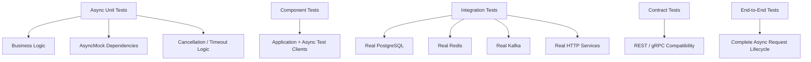

# 14- Testing Async Code

## Overview

Asynchronous Python code introduces a different execution model from synchronous code. Functions may return coroutines, work may be scheduled as tasks, operations can suspend at `await`, and multiple tasks can progress through the same event loop.

Testing async code therefore requires more than adding `async` to a test function. Tests must correctly handle:

- coroutines;
- `await`;
- `asyncio.Task`;
- `AsyncMock`;
- async iterators;
- async context managers;
- cancellation;
- timeouts;
- concurrent execution;
- resource cleanup;
- dependency failures;
- task lifecycle.

For backend systems such as FastAPI services, async HTTP clients, gRPC clients, database drivers, Redis clients, and asynchronous message consumers, incorrect testing can produce false confidence.

The central principle is:

> Test asynchronous behavior at the same abstraction level at which the production code makes its guarantees.

Unit tests should isolate business logic and async dependencies. Integration tests should validate real event-loop, network, database, broker, and cancellation semantics where those behaviors matter.

---

## Why Async Testing Is Different

Synchronous code executes a call immediately:

```python
result = client.fetch()
```

Asynchronous code generally creates an awaitable:

```python
result = await client.fetch()
```

The execution flow becomes:

```text
Test
 │
 ▼
Coroutine
 │
 ▼
Event Loop
 │
 ├── await dependency
 │       │
 │       └── task suspends
 │
 ├── run another ready task
 │
 └── resume original task
 │
 ▼
Result / Exception
```

The test runner must execute the coroutine inside an event loop.

A synchronous test such as:

```python
def test_fetch():
    result = service.fetch()
```

is incorrect when `service.fetch()` is asynchronous.

The coroutine may never execute.

---

## Testing Coroutine Functions

Given:

```python
async def fetch_customer(client, customer_id: str) -> dict:
    return await client.get_customer(customer_id)
```

A pytest test should also be asynchronous:

```python
import pytest


@pytest.mark.asyncio
async def test_fetch_customer() -> None:
    ...
```

The exact pytest async configuration depends on the async plugin and project configuration.

The important distinction is:

```text
def test_*()
    └── synchronous test

async def test_*()
    └── coroutine test executed by async-aware test infrastructure
```

---

## Why `pytest.mark.asyncio` Is Used

With pytest and the commonly used `pytest-asyncio` plugin:

```python
@pytest.mark.asyncio
async def test_fetch_customer() -> None:
    ...
```

the plugin manages the event-loop integration required to execute the test coroutine.

A project may configure asyncio behavior globally in pytest configuration.

For example:

```toml
[tool.pytest.ini_options]
asyncio_mode = "auto"
```

When using a project-wide configuration, keep the chosen mode consistent across the repository.

Do not mix multiple async testing strategies without a clear reason.

---

## Async Test Lifecycle

Conceptually:

```mermaid
sequenceDiagram
    participant Test as Pytest
    participant Loop as Event Loop
    participant TestFn as Async Test
    participant Service as Service
    participant Dependency as Async Dependency

    Test->>Loop: Start test coroutine
    Loop->>TestFn: Execute
    TestFn->>Service: await service.operation()
    Service->>Dependency: await dependency.call()
    Dependency-->>Loop: Suspends / waits
    Loop-->>TestFn: Resumes coroutine
    Dependency-->>Service: Result
    Service-->>TestFn: Result
    TestFn-->>Loop: Test completes
    Loop-->>Test: Test result
```

The event loop is responsible for scheduling runnable tasks and resuming suspended coroutines.

Tests should account for this lifecycle when validating concurrency, cancellation, and resource cleanup.

---

## `AsyncMock`

`AsyncMock` is the standard-library mock type for asynchronous callables.

```python
from unittest.mock import AsyncMock


client = AsyncMock()

client.fetch.return_value = {
    "status": "active",
}

result = await client.fetch()
```

The method can be awaited because it behaves like an asynchronous mock.

Assertions include:

```python
client.fetch.assert_awaited_once_with()
```

Other useful assertions include:

```python
client.fetch.assert_awaited()
client.fetch.assert_not_awaited()
client.fetch.assert_awaited_once()
```

---

## `Mock` vs `AsyncMock`

Use the mock type that matches the callable contract.

| Production dependency | Test double |
|---|---|
| Synchronous function | `Mock` |
| Synchronous method | `Mock` |
| Asynchronous function | `AsyncMock` |
| Asynchronous method | `AsyncMock` |
| Magic protocol | `MagicMock` |
| Async magic protocol | `MagicMock` / `AsyncMock` as appropriate |

Do not use `Mock` for an awaited function.

Incorrect:

```python
client.fetch = Mock(return_value={"status": "ok"})
```

Then:

```python
await client.fetch()
```

will attempt to await a non-awaitable result.

Correct:

```python
client.fetch = AsyncMock(
    return_value={"status": "ok"},
)
```

---

## Testing an Async Service

Example:

```python
class CustomerService:
    def __init__(self, client) -> None:
        self.client = client

    async def get_customer(self, customer_id: str) -> dict:
        return await self.client.get_customer(customer_id)
```

Test:

```python
import pytest
from unittest.mock import AsyncMock


@pytest.mark.asyncio
async def test_get_customer() -> None:
    client = AsyncMock()

    client.get_customer.return_value = {
        "id": "customer-123",
        "status": "active",
    }

    service = CustomerService(client)

    result = await service.get_customer("customer-123")

    assert result == {
        "id": "customer-123",
        "status": "active",
    }

    client.get_customer.assert_awaited_once_with(
        "customer-123",
    )
```

This verifies both:

- returned behavior;
- awaited dependency interaction.

---

## Async Exceptions

Exceptions raised by awaited operations can be tested with `pytest.raises`:

```python
@pytest.mark.asyncio
async def test_timeout_propagates() -> None:
    client = AsyncMock(
        get_customer=AsyncMock(
            side_effect=TimeoutError(),
        ),
    )

    with pytest.raises(TimeoutError):
        await service.get_customer("customer-123")
```

The `await` must occur inside the `pytest.raises` context.

Incorrect:

```python
with pytest.raises(TimeoutError):
    service.get_customer("customer-123")
```

This only creates a coroutine and does not execute the asynchronous operation.

---

## AsyncMock `side_effect`

`AsyncMock` supports controlled failures:

```python
client.fetch.side_effect = TimeoutError(
    "dependency timed out",
)
```

For retries:

```python
client.fetch.side_effect = [
    TimeoutError(),
    {"status": "ok"},
]
```

Then:

```python
result = await service.fetch()

assert result == {"status": "ok"}
assert client.fetch.await_count == 2
```

This allows deterministic testing of retry logic.

---

## `return_value` and Await Semantics

For an `AsyncMock`:

```python
client.fetch.return_value = {"status": "ok"}
```

means:

```python
await client.fetch()
```

produces:

```python
{"status": "ok"}
```

You normally do not need to manually wrap the return value in a coroutine.

The mock handles the awaitable behavior.

---

## Await Assertions

AsyncMock provides await-specific assertions.

| Assertion | Meaning |
|---|---|
| `assert_awaited()` | Called and awaited at least once |
| `assert_awaited_once()` | Awaited exactly once |
| `assert_awaited_with(...)` | Most recent await used arguments |
| `assert_awaited_once_with(...)` | Exactly one await with arguments |
| `assert_any_await(...)` | At least one matching await |
| `assert_has_awaits(...)` | Expected await sequence |
| `assert_not_awaited()` | Never awaited |
| `await_count` | Number of awaits |
| `await_args_list` | All await arguments |

Use await assertions when awaiting the dependency is part of the behavior.

---

## Calls vs Awaits

With async mocks, distinguish between calling and awaiting.

Conceptually:

```python
coroutine = client.fetch()
```

calls the mock and produces an awaitable.

But:

```python
await client.fetch()
```

actually awaits it.

Therefore, a test should generally verify:

```python
client.fetch.assert_awaited_once_with(...)
```

rather than relying only on:

```python
client.fetch.assert_called_once_with(...)
```

When testing async behavior, the await is often the important contract.

---

## Async Context Managers

Some async clients are used with:

```python
async with client:
    ...
```

`MagicMock` can model the protocol:

```python
from unittest.mock import MagicMock


client = MagicMock()

client.__aenter__.return_value = client
client.__aexit__.return_value = False
```

If the context manager itself is asynchronous, verify the lifecycle:

```python
client.__aenter__.assert_called_once_with()
client.__aexit__.assert_called_once()
```

Use `AsyncMock` for awaited methods exposed by the client.

---

## Async Context Manager Example

```python
from unittest.mock import AsyncMock, MagicMock


@pytest.mark.asyncio
async def test_client_context_manager() -> None:
    client = MagicMock()

    client.__aenter__.return_value = client
    client.__aexit__.return_value = False
    client.fetch = AsyncMock(
        return_value={"status": "ok"},
    )

    async with client as active:
        result = await active.fetch()

    assert result == {"status": "ok"}

    client.__aenter__.assert_called_once_with()
    client.__aexit__.assert_called_once()
    client.fetch.assert_awaited_once_with()
```

This is useful for testing resource-managed asynchronous clients.

---

## Async Iterators

Async streams commonly use:

```python
async for message in consumer:
    ...
```

A test may configure an async iterator:

```python
consumer = MagicMock()

consumer.__aiter__.return_value = [
    "message-1",
    "message-2",
]
```

Then:

```python
async for message in consumer:
    ...
```

can consume the configured values.

This is useful for unit testing stream consumers without connecting to Kafka or another real broker.

---

## Async Generators

Consider:

```python
async def events(client):
    async for event in client:
        yield event
```

Tests should verify:

- emitted values;
- empty streams;
- dependency failures;
- cancellation;
- termination.

For more realistic streaming behavior, an actual async generator can be clearer than a deeply configured mock.

---

## Async HTTP Testing

For asynchronous HTTP clients, unit tests can mock the client boundary:

```python
client = AsyncMock()

client.get.return_value = {
    "id": "customer-123",
}
```

However, HTTP semantics are better validated with an async test client or mock transport at the appropriate integration level.

Test both:

```text
Unit
  → business logic + mocked HTTP boundary

Integration
  → application + HTTP stack

Contract
  → actual API schema/behavior
```

Do not attempt to validate real HTTP behavior entirely through mocks.

---

## FastAPI Async Testing

FastAPI commonly uses asynchronous endpoints:

```python
@app.get("/customers/{customer_id}")
async def get_customer(customer_id: str):
    return await service.get_customer(customer_id)
```

The test strategy depends on what is being tested.

For application behavior, an async-capable HTTP client can exercise the request lifecycle:

```python
import pytest
from httpx import ASGITransport, AsyncClient


@pytest.mark.asyncio
async def test_get_customer() -> None:
    transport = ASGITransport(app=app)

    async with AsyncClient(
        transport=transport,
        base_url="http://test",
    ) as client:
        response = await client.get(
            "/customers/customer-123",
        )

    assert response.status_code == 200
```

This validates more of the actual application stack than directly invoking the endpoint function.

---

## FastAPI Dependency Overrides

When a FastAPI dependency is asynchronous, the override can also be asynchronous:

```python
async def get_repository():
    return repository
```

Test:

```python
async def override_repository():
    return mock_repository

app.dependency_overrides[get_repository] = (
    override_repository
)
```

Clean up afterward:

```python
app.dependency_overrides.clear()
```

This is often preferable to patching internal constructors because it uses the application's actual dependency-injection boundary.

---

## Django Async Testing

Modern Django supports asynchronous views and testing patterns.

When testing async behavior, distinguish:

- synchronous Django test APIs;
- asynchronous test methods;
- async-capable clients;
- synchronous ORM operations;
- asynchronous ORM APIs where supported by the Django version.

Do not assume that making a test function `async` automatically makes every underlying Django operation asynchronous.

The database API and framework version determine which operations can safely be awaited.

---

## Async Database Testing

Async PostgreSQL clients can be mocked:

```python
connection = AsyncMock()

connection.execute.return_value = result
```

This is useful for unit tests.

But real async database testing should validate:

- connection pooling;
- transactions;
- cancellation;
- query execution;
- connection release;
- timeout behavior;
- concurrent access.

An async mock cannot validate event-loop interaction with the real database driver.

---

## Async Redis Testing

Async Redis clients can be mocked:

```python
redis = AsyncMock()

redis.get.return_value = '{"status": "active"}'
```

Test:

```python
value = await service.get_cached_customer(
    "customer-123",
)

redis.get.assert_awaited_once_with(
    "customer:customer-123",
)
```

Integration tests should cover real Redis behavior, including:

- connection pooling;
- command latency;
- timeouts;
- cancellation;
- TTL;
- atomic operations;
- distributed locks.

---

## Async gRPC Testing

Async gRPC clients should be treated as asynchronous boundaries.

Unit tests can use:

```python
client = AsyncMock()

client.GetCustomer.return_value = response
```

Then:

```python
result = await client.GetCustomer(request)
```

Contract or integration tests should validate:

- protobuf compatibility;
- deadlines;
- status codes;
- metadata;
- connection behavior;
- cancellation;
- retry policies where configured.

---

## Testing Concurrent Tasks

Consider:

```python
async def load_dashboard(client):
    profile, orders = await asyncio.gather(
        client.get_profile(),
        client.get_orders(),
    )

    return profile, orders
```

A unit test can use `AsyncMock`:

```python
client = AsyncMock()

client.get_profile.return_value = profile
client.get_orders.return_value = orders
```

Then:

```python
result = await load_dashboard(client)

assert result == (profile, orders)
```

This verifies the output.

It does not prove meaningful concurrency.

---

## Testing Actual Concurrency

If concurrency itself is part of the contract, use controlled synchronization.

For example:

```python
import asyncio


@pytest.mark.asyncio
async def test_operations_can_overlap() -> None:
    started = asyncio.Event()
    release = asyncio.Event()

    async def operation() -> str:
        started.set()
        await release.wait()
        return "done"

    task = asyncio.create_task(operation())

    await asyncio.wait_for(
        started.wait(),
        timeout=1,
    )

    assert not task.done()

    release.set()

    assert await asyncio.wait_for(
        task,
        timeout=1,
    ) == "done"
```

This verifies scheduling behavior without relying on arbitrary `sleep()` calls.

---

## Avoid `asyncio.sleep()` in Tests

This is fragile:

```python
await asyncio.sleep(0.1)
assert task.done()
```

The timing is environment-dependent.

It can become:

- flaky on CI;
- unnecessarily slow;
- sensitive to CPU load;
- unreliable under parallel execution.

Prefer synchronization primitives:

- `asyncio.Event`;
- `asyncio.Lock`;
- `asyncio.Queue`;
- explicit task completion;
- controlled futures.

---

## Testing Timeouts

Timeout behavior is part of backend reliability.

For example:

```python
async def fetch_with_timeout(client):
    return await asyncio.wait_for(
        client.fetch(),
        timeout=2,
    )
```

Test with a dependency that blocks until cancelled:

```python
async def never_finishes():
    await asyncio.Future()
```

Then:

```python
@pytest.mark.asyncio
async def test_timeout() -> None:
    with pytest.raises(asyncio.TimeoutError):
        await asyncio.wait_for(
            never_finishes(),
            timeout=0.01,
        )
```

For production code, prefer deterministic synchronization over arbitrary sleep-based timing.

---

## Testing Cancellation

Cancellation is a distinct control-flow event.

Example:

```python
async def worker(stop_event: asyncio.Event) -> None:
    try:
        await stop_event.wait()
    except asyncio.CancelledError:
        raise
```

Test:

```python
@pytest.mark.asyncio
async def test_worker_propagates_cancellation() -> None:
    task = asyncio.create_task(
        worker(asyncio.Event()),
    )

    task.cancel()

    with pytest.raises(asyncio.CancelledError):
        await task
```

Cancellation should generally be propagated unless the application has a deliberate reason to handle it.

---

## Why Cancellation Matters

Production systems cancel work during:

- HTTP client disconnects;
- request timeouts;
- application shutdown;
- Kubernetes termination;
- task cancellation;
- connection closure.

If cancellation is swallowed, resources may remain active longer than intended.

Test cancellation where the component owns:

- database transactions;
- network connections;
- locks;
- background tasks;
- streams;
- long-running computations.

---

## Testing Cleanup After Cancellation

Use `try`/`finally`:

```python
async def worker(resource) -> None:
    try:
        await resource.run()
    finally:
        await resource.close()
```

Test:

```python
@pytest.mark.asyncio
async def test_resource_closes_on_cancellation() -> None:
    resource = AsyncMock()

    resource.run.side_effect = asyncio.CancelledError()

    with pytest.raises(asyncio.CancelledError):
        await worker(resource)

    resource.close.assert_awaited_once_with()
```

This verifies resource ownership across cancellation.

---

## Testing `asyncio.create_task`

Creating a task is not the same as awaiting a coroutine.

```python
task = asyncio.create_task(worker())
```

The task runs independently within the event loop.

Tests should retain and await the task when its outcome matters:

```python
task = asyncio.create_task(worker())

result = await task

assert result == expected
```

Otherwise, failures can occur outside the test's direct assertion path.

---

## Unobserved Task Failures

This is dangerous:

```python
asyncio.create_task(worker())
```

with no lifecycle management.

The test may finish while the task is still running.

A robust test should establish:

- who owns the task;
- when it should finish;
- how exceptions are observed;
- how it is cancelled;
- how it is cleaned up.

This mirrors production task lifecycle management.

---

## Testing `asyncio.gather`

`asyncio.gather()` has specific failure semantics.

Example:

```python
results = await asyncio.gather(
    fetch_profile(),
    fetch_orders(),
)
```

Tests should cover:

- all tasks succeed;
- one task fails;
- multiple tasks fail;
- cancellation;
- `return_exceptions=True` where intentionally used.

For example:

```python
@pytest.mark.asyncio
async def test_gather_failure() -> None:
    with pytest.raises(TimeoutError):
        await asyncio.gather(
            successful_operation(),
            failing_operation(),
        )
```

Do not assume that one failure means every underlying task has immediately completed or stopped.

Task lifecycle must be understood separately.

---

## `gather(return_exceptions=True)`

This changes the contract:

```python
results = await asyncio.gather(
    operation_a(),
    operation_b(),
    return_exceptions=True,
)
```

Results may contain exception instances.

Test explicitly:

```python
assert isinstance(results[1], TimeoutError)
```

Use this mode only when collecting individual task outcomes is intentional.

Otherwise, it can accidentally convert failures into ordinary values.

---

## Testing `TaskGroup`

Modern Python provides structured concurrency through `asyncio.TaskGroup`.

Example:

```python
async with asyncio.TaskGroup() as group:
    task_a = group.create_task(operation_a())
    task_b = group.create_task(operation_b())
```

Tests should verify:

- successful completion;
- child task failure;
- sibling cancellation;
- exception propagation;
- cleanup.

TaskGroup failures are represented through exception groups.

---

## Testing `ExceptionGroup`

When multiple concurrent tasks fail, Python can expose an `ExceptionGroup`.

Tests can use:

```python
with pytest.raises(ExceptionGroup):
    await run_concurrent_operations()
```

For precise handling, Python's `except*` syntax can distinguish exception types.

```python
try:
    await run_concurrent_operations()
except* TimeoutError:
    ...
```

Tests should verify the application's intended behavior when multiple concurrent failures are possible.

---

## Async Fixtures

pytest fixtures can also be asynchronous when using an async-aware pytest plugin.

Conceptually:

```python
@pytest.fixture
async def client():
    client = AsyncClient(...)
    yield client
    await client.aclose()
```

This is useful for resources such as:

- async HTTP clients;
- database pools;
- Redis clients;
- test servers.

The fixture must be managed by an async-capable pytest integration.

---

## Async Fixture Scope

Fixture scope matters more for asynchronous resources because the resource may own:

- event-loop state;
- network connections;
- background tasks;
- connection pools.

Prefer the narrowest practical scope.

A session-scoped async client can improve test speed but may introduce shared state and lifecycle complexity.

---

## Async Resource Cleanup

Every async resource should have a clear owner.

Examples:

```python
await client.aclose()
await pool.close()
await producer.stop()
```

Tests should verify cleanup when the resource is created by the test or fixture.

For long-lived integration resources, centralize lifecycle management in fixtures.

---

## Async HTTP Client Fixture

A common pattern is:

```python
@pytest.fixture
async def client():
    transport = ASGITransport(app=app)

    async with AsyncClient(
        transport=transport,
        base_url="http://test",
    ) as client:
        yield client
```

The `async with` ensures the client is closed even when the test fails.

This is preferable to manually opening a client in every test.

---

## Async Database Fixture

A production-oriented integration fixture may own a database connection or transaction:

```text
Test
 │
 ▼
Async DB Fixture
 │
 ├── acquire connection
 ├── begin transaction
 │
 ▼
Test operations
 │
 ▼
rollback
 │
 ▼
release connection
```

The exact transaction strategy depends on the driver and application architecture.

Tests must ensure that connection cleanup occurs even when the test raises an exception.

---

## Event Loop Isolation

The event loop is shared according to the test framework's fixture and configuration model.

Tests can become order-dependent when they leave behind:

- tasks;
- callbacks;
- sockets;
- background workers;
- pending futures.

A clean async test should not leave unfinished work behind.

If a test creates a task, it should generally own its lifecycle.

---

## Detecting Leaked Tasks

A useful cleanup strategy is to inspect outstanding tasks after a test when diagnosing lifecycle problems.

Conceptually:

```python
pending = [
    task
    for task in asyncio.all_tasks()
    if not task.done()
]
```

Do not blindly cancel every task in a generic fixture without understanding which tasks belong to the test framework itself.

Prefer explicit task ownership.

---

## Async Mocking and Specs

Use interface constraints for async dependencies.

```python
client = create_autospec(
    AsyncCustomerClient,
)
```

When an async method is correctly identified, the generated mock can behave as an async callable.

This protects tests from interface drift.

An unconstrained `AsyncMock` can still accept arbitrary attributes and therefore provide weak contract validation.

---

## Async Protocols

Some objects are asynchronous without being ordinary async functions.

Examples include:

```python
async with resource:
    ...
```

and:

```python
async for item in stream:
    ...
```

Testing should model the appropriate protocol:

| Production behavior | Test mechanism |
|---|---|
| `await dependency.call()` | `AsyncMock` |
| `async with resource` | Async context-manager protocol |
| `async for item in stream` | Async iterator protocol |
| Background task | Explicit task lifecycle |
| Timeout | Controlled blocking/cancellation |
| Cancellation | `task.cancel()` |
| Concurrent operations | Events/queues/task coordination |

---

## Async Generators and Cleanup

Async generators may hold resources across yields.

Example:

```python
async def stream_events(client):
    async with client:
        async for event in client:
            yield event
```

Tests should consider:

- normal exhaustion;
- consumer stops early;
- generator is closed;
- dependency fails;
- cancellation occurs.

For streaming endpoints, early client disconnects are particularly important because they can trigger cancellation before the stream naturally completes.

---

## Testing Streaming APIs

Streaming APIs such as SSE or streaming HTTP responses require more than checking the final response body.

Test:

- first event latency where relevant;
- event ordering;
- stream termination;
- client disconnect;
- cancellation;
- backpressure;
- dependency failure;
- resource cleanup.

Use an integration-capable test client when the actual HTTP streaming lifecycle is part of the contract.

---

## Testing Async Queues

`asyncio.Queue` is useful for testing producer-consumer coordination.

Example:

```python
queue = asyncio.Queue()

await queue.put("event")

event = await queue.get()

assert event == "event"
queue.task_done()
```

For concurrent workers, test:

- queue ordering where guaranteed;
- producer completion;
- consumer completion;
- shutdown;
- cancellation;
- queue backpressure;
- sentinel handling.

---

## Testing Backpressure

A bounded queue:

```python
queue = asyncio.Queue(maxsize=1)
```

can force producers to wait when consumers cannot keep up.

Tests should avoid arbitrary timing.

Use explicit coordination to establish:

```text
Producer
   │
   ▼
Bounded Queue ───── full
   │
   ▼
Producer waits
   │
   ▼
Consumer removes item
   │
   ▼
Producer resumes
```

This is more deterministic than sleeping and checking queue state.

---

## Testing Locks and Synchronization

For concurrency-sensitive code, tests should verify invariants rather than rely on timing.

Examples:

- no duplicate writes;
- no concurrent mutation;
- exactly-once state transition;
- lock release after failure;
- task completion after coordination.

Avoid tests that pass only because the local machine happens to schedule tasks in a particular order.

---

## Race Conditions

Race-condition tests are inherently difficult to make deterministic.

Instead of:

```python
await asyncio.sleep(0.001)
```

use barriers or events to force the relevant interleaving.

For example:

```text
Task A ── reaches barrier ──┐
                            ├── release
Task B ── reaches barrier ──┘
```

This lets the test deliberately create the interleaving that would expose the bug.

---

## Testing Async Retries

An async dependency can use:

```python
client.fetch.side_effect = [
    TimeoutError(),
    TimeoutError(),
    {"status": "ok"},
]
```

Then:

```python
result = await service.fetch()

assert result == {"status": "ok"}
assert client.fetch.await_count == 3
```

Also test:

- maximum attempts;
- non-retryable exceptions;
- cancellation during backoff;
- timeout during retry;
- idempotency;
- final failure.

---

## Testing Async Timeouts and Retries Together

A production operation may have both:

```text
Request timeout
      │
      ├── dependency attempt
      │
      ├── retry/backoff
      │
      └── final deadline
```

Tests should distinguish:

- per-attempt timeout;
- total operation timeout;
- retry count;
- cancellation;
- deadline propagation.

Otherwise, a retry implementation can unintentionally exceed the request's allowed lifetime.

---

## Testing Async Background Work

For background tasks:

```python
task = asyncio.create_task(process_events())
```

tests should establish ownership:

```python
try:
    ...
finally:
    task.cancel()
    with suppress(asyncio.CancelledError):
        await task
```

This prevents background work from leaking across tests.

For production services, prefer structured task ownership such as `TaskGroup` or an explicit worker lifecycle.

---

## Async Code in Docker and CI

Async tests can behave differently under CI due to:

- CPU contention;
- slower networking;
- different event-loop policies;
- container resource limits;
- timing differences.

Avoid tests dependent on exact scheduling timing.

Use:

- explicit synchronization;
- bounded timeouts;
- deterministic fixtures;
- isolated resources;
- task cleanup.

A timeout in a test should prevent hangs, not serve as the primary synchronization mechanism.

---

## Performance Considerations

Async tests are often fast because many operations can share one event loop.

However, excessive integration-level concurrency can overload test infrastructure.

Control:

- concurrent test count;
- database connections;
- Redis connections;
- HTTP clients;
- Kafka consumers;
- external service mocks.

Do not confuse high test concurrency with production concurrency correctness.

Benchmark async code separately from correctness tests.

---

## Security Considerations

Async systems introduce additional security considerations around cancellation and resource exhaustion.

Tests should consider:

- request cancellation during authentication;
- timeouts against slow dependencies;
- connection limits;
- unbounded task creation;
- unbounded queues;
- streaming resource exhaustion;
- authentication calls that fail asynchronously.

For example, an endpoint that creates one background task per request without limits can become a denial-of-service risk.

---

## Reliability Considerations

Reliable async systems require explicit handling of:

- cancellation;
- timeouts;
- retries;
- backpressure;
- dependency failures;
- task ownership;
- graceful shutdown.

Tests should verify these behaviors rather than only successful results.

A useful production model is:

```text
Request
  │
  ▼
Create bounded async work
  │
  ├── success ─────────► response
  │
  ├── timeout ─────────► controlled failure
  │
  ├── cancellation ────► cleanup + propagation
  │
  └── dependency error ─► retry / translation
```

---

## Graceful Shutdown

Async applications must cancel and await background work during shutdown.

Tests should validate:

```text
SIGTERM
  │
  ▼
Stop accepting work
  │
  ▼
Cancel / stop workers
  │
  ▼
Await cleanup
  │
  ▼
Close DB / Redis / HTTP / Kafka
  │
  ▼
Exit
```

This is especially relevant in Kubernetes, where processes receive `SIGTERM` before the termination grace period expires.

---

## Observability Testing

Async failures can be difficult to diagnose because execution is interleaved.

Test important operational signals such as:

- request correlation IDs;
- retry counters;
- timeout metrics;
- cancellation metrics;
- task failure metrics;
- queue depth;
- dependency latency.

Avoid asserting every internal log call.

Focus on observability behavior that materially affects production diagnosis.

---

## Common Mistakes

### Forgetting to Await

Incorrect:

```python
service.fetch()
```

Correct:

```python
await service.fetch()
```

### Using `Mock` for Async Functions

Use:

```python
AsyncMock()
```

for awaited callables.

### Using `asyncio.sleep()` for Synchronization

Prefer events, queues, locks, or explicit task completion.

### Leaving Tasks Running

Every task created by a test should have a clear lifecycle.

### Testing Only Success

Test timeout, cancellation, dependency failure, retries, and cleanup.

### Assuming `gather()` Cancels Everything

Understand actual task lifecycle and failure semantics.

### Swallowing `CancelledError`

Cancellation is a control-flow signal. Do not convert it into a generic application failure without a deliberate design.

### Overusing Async Unit Tests

If the behavior is purely synchronous, keep the test synchronous.

---

## Production Pitfalls

### Unbounded Concurrency

Creating unlimited tasks can exhaust:

- memory;
- database connections;
- sockets;
- CPU;
- external API quotas.

Tests should validate concurrency limits where they are part of the design.

### Hidden Blocking Calls

Calling synchronous blocking libraries inside async code can block the event loop.

Tests that use only fast mocks may not reveal this.

Integration or performance tests should identify event-loop blocking behavior.

### Resource Leaks

A task may hold a connection or lock after its parent request has ended.

Test cancellation and cleanup.

### Timeout Mismatch

An internal dependency timeout longer than the HTTP request deadline can leave work running after the caller has already given up.

### Retry Amplification

Concurrent retries can multiply load against an already unhealthy dependency.

### Shared Async Fixtures

Session-scoped clients or pools can create hidden state coupling.

---

## Unit vs Integration Testing

Use different test levels for different guarantees.

| Concern | Unit test | Integration test |
|---|---:|---:|
| Business logic | Yes | Optional |
| Async dependency interaction | Yes | Yes where useful |
| `AsyncMock` behavior | Yes | No |
| Event-loop scheduling | Limited | Yes |
| PostgreSQL async driver | No | Yes |
| Redis async client | No | Yes |
| Real HTTP behavior | No | Yes |
| Kafka behavior | No | Yes |
| Cancellation | Yes | Yes where infrastructure matters |
| Connection pooling | No | Yes |
| Streaming HTTP | Limited | Yes |
| Retry decision logic | Yes | Yes for real integration |
| Service contract | No | Contract test |

The goal is not to maximize unit-test coverage at the expense of realistic integration coverage.

---

## Recommended Async Test Architecture



Most tests should remain fast and deterministic.

The smaller number of integration tests should validate the semantics mocks cannot reproduce.

---

## Best Practices

- Use `async def` for tests that execute asynchronous code.
- Use an async-aware pytest configuration/plugin consistently.
- Use `AsyncMock` for awaited callables.
- Use await-specific assertions.
- Use `MagicMock` for async context-manager and iterator protocols where appropriate.
- Keep task ownership explicit.
- Always clean up tasks and async resources.
- Test cancellation separately from ordinary exceptions.
- Use synchronization primitives instead of arbitrary sleeps.
- Test timeout and retry boundaries.
- Test bounded concurrency and backpressure where applicable.
- Keep simple synchronous logic synchronous.
- Use real infrastructure for database, broker, network, and pooling semantics.
- Avoid tests dependent on event-loop scheduling luck.
- Use structured concurrency where appropriate.

---

## Async Testing Checklist

### Test Setup

- [ ] Is the test correctly executed by an async-aware runner?
- [ ] Are async fixtures configured correctly?
- [ ] Is event-loop behavior consistent across local and CI environments?
- [ ] Are test resources isolated?

### Async Dependencies

- [ ] Are awaited functions represented by `AsyncMock`?
- [ ] Are async context managers modeled correctly?
- [ ] Are async iterators modeled correctly?
- [ ] Are `assert_awaited_*` assertions used where appropriate?

### Concurrency

- [ ] Are created tasks explicitly owned?
- [ ] Are tasks awaited or cancelled?
- [ ] Are synchronization primitives used instead of sleeps?
- [ ] Are race-sensitive paths tested deterministically?
- [ ] Is concurrency bounded?

### Failures

- [ ] Are dependency exceptions tested?
- [ ] Are timeouts tested?
- [ ] Are cancellations tested?
- [ ] Are retries bounded?
- [ ] Are non-retryable errors handled correctly?
- [ ] Is exception propagation correct?

### Resources

- [ ] Are HTTP clients closed?
- [ ] Are database connections released?
- [ ] Are Redis clients/pools closed?
- [ ] Are Kafka producers/consumers stopped?
- [ ] Are locks and tasks cleaned up?

### Integration

- [ ] Are real async drivers tested where required?
- [ ] Are connection-pooling semantics covered?
- [ ] Are streaming behaviors tested?
- [ ] Are API/gRPC contracts tested?
- [ ] Are infrastructure-specific semantics tested outside unit mocks?

---

## Interview Traps

### Why Can't You Test an Async Function Like a Normal Function?

Calling an async function normally returns a coroutine object. The coroutine must be awaited or scheduled on an event loop for its body to execute.

### Why Use `AsyncMock`?

`AsyncMock` models an asynchronous callable and supports await-aware assertions such as:

```python
mock.assert_awaited_once_with(...)
```

### What Is the Difference Between `assert_called_once_with()` and `assert_awaited_once_with()`?

The first verifies a mock call. The second verifies that an asynchronous mock was actually awaited with the expected arguments.

### Why Is `asyncio.sleep()` Usually a Poor Synchronization Technique?

It introduces timing assumptions that vary across machines and CI environments. Events, queues, locks, and explicit task completion provide deterministic coordination.

### How Should Cancellation Be Tested?

Create the task, cancel it, await it, and verify both cancellation propagation and required cleanup.

### Why Can't AsyncMock Validate an Async PostgreSQL Driver?

It can validate application interaction with the abstraction, but it cannot validate actual connection pooling, transaction behavior, network I/O, cancellation semantics, or PostgreSQL protocol behavior.

### What Is a Common Async Testing Smell?

Creating background tasks without retaining or awaiting them. This can leave failures and resources outside the test's lifecycle.

### How Do You Test Concurrency Deterministically?

Use synchronization primitives such as `asyncio.Event`, `Lock`, or `Queue` to deliberately control task interleavings instead of relying on timing.

### Why Test Timeouts Separately From Exceptions?

A timeout is often a control-flow and resource-lifecycle concern. The system may need to cancel work, release resources, and propagate a specific failure rather than merely raise an exception.

### What Is Structured Concurrency?

It is an approach where concurrent tasks have explicit ownership and lifecycle boundaries, such as `asyncio.TaskGroup`, so child work is coordinated with its parent and failures are handled predictably.

## Key Takeaways

- **Async tests must execute coroutines correctly:** use async-aware pytest infrastructure and `await` asynchronous operations rather than merely calling them.
- **Match the test double to the async protocol:** use `AsyncMock` for awaited callables and appropriate magic-method support for async context managers and iterators.
- **Test concurrency deterministically:** use events, queues, locks, and explicit task lifecycle management instead of timing-based `asyncio.sleep()` synchronization.
- **Cancellation, timeouts, retries, and cleanup are production behavior:** test them explicitly, especially for HTTP requests, database connections, streaming workloads, and background tasks.
- **Mocks do not replace async integration tests:** real PostgreSQL, Redis, Kafka, HTTP, gRPC, connection-pooling, and streaming semantics require appropriate integration or contract coverage.