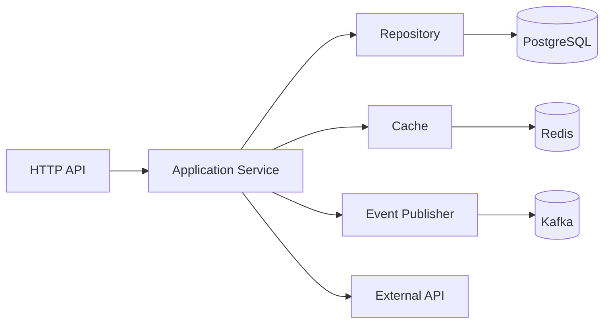

# 15- Integration Testing

## Overview

Integration testing verifies that multiple components work correctly together at a real or production-representative boundary.

Unlike unit tests, which isolate dependencies with mocks and test doubles, integration tests intentionally exercise interactions such as:

- application ↔ PostgreSQL;
- application ↔ Redis;
- application ↔ Kafka;
- service ↔ HTTP API;
- service ↔ gRPC service;
- API ↔ authentication layer;
- Celery worker ↔ broker ↔ database;
- application ↔ filesystem;
- multiple microservices through a real contract.

The objective is to detect failures that unit tests cannot reliably detect:

- incorrect SQL;
- schema mismatches;
- transaction behavior;
- serialization differences;
- connection-pool problems;
- authentication middleware behavior;
- real HTTP semantics;
- broker delivery behavior;
- database constraints;
- concurrency behavior.

A strong backend test strategy therefore combines:

```text
Unit Tests
    │
    ├── Fast, isolated
    │
    ▼
Integration Tests
    │
    ├── Real component interactions
    │
    ▼
Contract Tests
    │
    ├── Service compatibility
    │
    ▼
End-to-End Tests
    │
    └── Complete system behavior
```

Integration tests are usually slower and more operationally expensive than unit tests, so they should be targeted at boundaries where real behavior provides meaningful confidence.

---

## What Integration Testing Validates

Integration testing answers a different question from unit testing.

A unit test asks:

> Does this component behave correctly given controlled dependencies?

An integration test asks:

> Do these components actually work together according to their real interfaces and semantics?

For example:

```text
Unit test:
OrderService → Mock Repository

Integration test:
OrderService → Repository → PostgreSQL
```

The second test can detect problems such as:

- invalid SQL;
- missing columns;
- incorrect transaction handling;
- constraint violations;
- incorrect data types;
- connection configuration errors.

---

## Unit vs Integration Testing

| Concern | Unit | Integration |
|---|---:|---:|
| Business logic | Yes | Yes where relevant |
| Mocked dependencies | Common | Limited |
| Real database | No | Yes |
| Real Redis | No | Yes where relevant |
| Real Kafka | No | Yes where relevant |
| Real HTTP stack | Usually no | Yes where relevant |
| Transaction semantics | Mocked | Real |
| Schema compatibility | Limited | Yes |
| Connection pooling | No | Yes |
| Service contracts | Limited | Often |
| Execution speed | Very fast | Slower |
| Isolation | High | Lower |
| Infrastructure cost | Low | Higher |

The test suite should not force every behavior into one test level.

---

## Integration Test Boundaries

A useful architecture identifies explicit integration boundaries:



Each boundary can have targeted integration coverage.

Examples:

- API + application + database;
- repository + PostgreSQL;
- cache abstraction + Redis;
- event publisher + Kafka;
- HTTP client + test server;
- authentication middleware + application.

---

## Test Environment Design

An integration test environment should be:

- isolated;
- reproducible;
- deterministic where practical;
- disposable;
- safe;
- representative enough to validate the target behavior.

A common architecture is:

```text
CI Runner
   │
   ├── Application
   │
   ├── PostgreSQL Container
   │
   ├── Redis Container
   │
   └── Kafka Container
```

Docker is commonly used to provide reproducible infrastructure locally and in CI.

Avoid relying on shared development infrastructure for automated integration tests when isolated infrastructure is practical.

---

## Test Database Strategy

Integration tests involving PostgreSQL require a controlled database lifecycle.

Common strategies include:

| Strategy | Advantages | Limitations |
|---|---|---|
| Per-test transaction | Fast cleanup | Not suitable for every transaction pattern |
| Truncate/reset | Simple isolation | Can be expensive |
| Database per test suite | Fast setup | Shared state risk |
| Database per worker | Parallel-safe | More infrastructure |
| Database per test | Strong isolation | Expensive |
| Disposable container | Reproducible | Startup overhead |

The appropriate strategy depends on database size, parallelism, transaction behavior, and CI performance requirements.

---

## Schema Management

The integration database should use the same schema-management mechanism as production whenever practical.

For Django:

```bash
python manage.py migrate
```

For SQL migration tools:

```bash
alembic upgrade head
```

The objective is to catch problems such as:

- missing migrations;
- incorrect migration ordering;
- incompatible schema changes;
- missing indexes;
- incorrect constraints.

Do not manually create a simplified schema in integration tests if the purpose is to validate production schema compatibility.

---

## Database Fixtures

pytest fixtures can manage integration database resources:

```python
import pytest


@pytest.fixture
def db_session():
    session = create_test_session()

    try:
        yield session
    finally:
        session.rollback()
        session.close()
```

The exact implementation depends on the database driver and ORM.

The important property is deterministic lifecycle management.

---

## Transactions and Integration Tests

Transactions are one of the areas where mocks provide particularly weak confidence.

Consider:

```python
with database.transaction():
    repository.create_order(order)
    repository.reserve_inventory(order)
```

Integration tests should verify:

```text
BEGIN
  │
  ├── create order
  ├── reserve inventory
  │
  └── failure
       │
       ▼
    ROLLBACK
```

Verify that the expected state does not remain after rollback.

---

## Testing Database Constraints

Suppose PostgreSQL enforces:

```sql
UNIQUE (email)
```

An integration test should actually insert conflicting records:

```python
def test_duplicate_email_rejected(db_session):
    create_user(
        db_session,
        email="user@example.com",
    )

    with pytest.raises(IntegrityError):
        create_user(
            db_session,
            email="user@example.com",
        )
```

This validates the real database constraint.

A mock repository cannot prove that the PostgreSQL schema contains the constraint.

---

## Testing Foreign Keys

Integration tests should cover important relational constraints.

For example:

```text
orders.customer_id
       │
       ▼
customers.id
```

Attempting to create an order for a nonexistent customer should produce the expected database/application behavior.

This catches schema and migration defects that unit tests cannot detect.

---

## Testing Query Correctness

A mocked repository can make any query appear successful.

Integration tests execute the actual query:

```python
def test_find_active_orders(db_session):
    create_order(
        db_session,
        status="active",
    )

    create_order(
        db_session,
        status="cancelled",
    )

    orders = repository.find_active_orders(
        db_session,
    )

    assert len(orders) == 1
    assert orders[0].status == "active"
```

This validates:

- SQL;
- ORM expressions;
- filters;
- joins;
- mapping;
- database schema.

---

## Testing Database Transactions Under Failure

A strong integration test intentionally fails partway through a transaction.

```python
def test_order_creation_rolls_back(db_session):
    with pytest.raises(InventoryUnavailableError):
        service.create_order(order)

    assert repository.find_order(
        db_session,
        order.id,
    ) is None
```

The important assertion is not merely that an exception occurred.

It is that the database state reflects the transaction contract.

---

## Connection Pool Testing

Production applications commonly use connection pools.

Integration tests should validate:

- connections are acquired;
- connections are released;
- pool limits are respected;
- connections recover after failures;
- timeouts behave correctly.

A connection leak may not appear in a short unit test but can eventually exhaust the production pool.

---

## Async Database Integration Testing

For asynchronous applications:

```python
@pytest.mark.asyncio
async def test_create_order(async_session):
    result = await service.create_order(order)

    assert result.id == order.id
```

Real async integration tests can reveal issues involving:

- async drivers;
- connection pools;
- transaction scopes;
- cancellation;
- concurrent operations.

Do not replace all async database tests with `AsyncMock`.

---

## Redis Integration Testing

Redis integration tests validate real behavior such as:

- `GET`;
- `SET`;
- expiration;
- atomic operations;
- transactions;
- Lua scripts;
- distributed locks;
- connection pooling.

Example:

```python
async def test_cache_expiration(redis):
    await redis.set(
        "session:test",
        "active",
        ex=1,
    )

    assert await redis.get("session:test") == "active"

    await asyncio.sleep(1.1)

    assert await redis.get("session:test") is None
```

Time-based expiration tests can be sensitive to scheduling. Where practical, use Redis semantics and sufficiently tolerant timing rather than assuming exact expiration timing.

---

## Testing Redis Failure Behavior

Integration tests can stop or isolate Redis to verify application behavior under dependency failure.

Potential expectations include:

```text
Redis unavailable
      │
      ├── cache bypass
      ├── stale data
      ├── request failure
      └── retry
```

The correct behavior depends on whether Redis is:

- an optional cache;
- a session store;
- a distributed lock provider;
- a required data dependency.

---

## Kafka Integration Testing

Kafka integration tests validate behavior that mocks cannot reproduce:

- broker connectivity;
- topic configuration;
- partitions;
- serialization;
- consumer groups;
- offsets;
- acknowledgments;
- redelivery;
- rebalancing.

A typical flow is:

```text
Producer
   │
   ▼
Kafka Topic
   │
   ▼
Consumer Group
   │
   ▼
Application Handler
   │
   ▼
PostgreSQL
```

Tests should validate the important portions of this flow rather than attempting to reproduce the entire production topology in every test.

---

## Kafka Test Isolation

Avoid having multiple test suites consume from the same shared topic without isolation.

Possible strategies include:

- unique topic names;
- unique consumer groups;
- dedicated partitions;
- isolated Kafka containers;
- cleanup between tests.

Parallel tests require particularly careful message isolation.

---

## Testing Message Delivery

For event-driven applications, integration tests should verify the expected delivery semantics.

Examples:

```text
Publish event
    │
    ▼
Kafka
    │
    ▼
Consumer
    │
    ▼
Process event
    │
    ▼
Database state updated
```

Test:

- event serialization;
- successful consumption;
- processing failure;
- retry/redelivery;
- idempotency;
- acknowledgment behavior.

Exactly-once business behavior generally requires more than simply checking that Kafka accepted a message.

---

## HTTP Integration Testing

HTTP integration tests exercise an actual HTTP stack.

For FastAPI:

```python
import pytest
from httpx import ASGITransport, AsyncClient


@pytest.mark.asyncio
async def test_create_order():
    transport = ASGITransport(app=app)

    async with AsyncClient(
        transport=transport,
        base_url="http://test",
    ) as client:
        response = await client.post(
            "/orders",
            json={
                "customer_id": "customer-123",
                "items": [
                    {
                        "product_id": "product-1",
                        "quantity": 2,
                    }
                ],
            },
        )

    assert response.status_code == 201
```

This can exercise routing, middleware, validation, dependency injection, and application logic without requiring an external network listener.

---

## In-Process vs Real Network HTTP Tests

These are different levels of integration.

### In-Process

```text
AsyncClient
    │
    ▼
ASGI Application
```

Advantages:

- fast;
- deterministic;
- easy to debug.

### Real Network

```text
HTTP Client
    │
    ▼
Nginx / Load Balancer
    │
    ▼
Application Server
```

This validates additional behavior:

- sockets;
- HTTP server configuration;
- reverse proxy behavior;
- headers;
- connection handling;
- TLS termination where applicable.

Use real-network tests selectively.

---

## REST API Integration Tests

API integration tests should verify:

- routing;
- authentication;
- authorization;
- validation;
- serialization;
- database changes;
- status codes;
- error schemas;
- idempotency;
- transaction behavior.

Example:

```python
response = client.post(
    "/orders",
    json=payload,
    headers={
        "Authorization": f"Bearer {token}",
    },
)

assert response.status_code == 201

order = repository.get(response.json()["id"])

assert order is not None
```

The important property is that the HTTP response and persistent state agree.

---

## Testing Authentication

Integration tests should exercise the real authentication middleware or application boundary where practical.

Test:

```text
No credentials
    → 401

Invalid credentials
    → 401

Valid credentials
    → authenticated

Valid but insufficient permissions
    → 403
```

This can catch configuration errors that mocking an authentication service cannot detect.

---

## Testing Authorization

Authorization is often state-dependent.

Test combinations such as:

| User state | Resource | Expected |
|---|---|---|
| Admin | Own resource | Allow |
| Admin | Other tenant | Depends on policy |
| User | Own resource | Allow |
| User | Other user's resource | Deny |
| Anonymous | Protected resource | Deny |
| Disabled user | Protected resource | Deny |

Integration tests are useful because authentication middleware, database state, and authorization logic can interact.

---

## Testing Multi-Tenancy

Multi-tenant systems require strong integration coverage.

Example:

```text
Tenant A
  └── customer-1
  └── order-1

Tenant B
  └── customer-2
  └── order-2
```

A request authenticated as Tenant A must not retrieve Tenant B's data.

Integration tests should verify both:

- application filtering;
- database-level isolation where applicable.

This is a high-value security boundary.

---

## Testing gRPC Integration

gRPC integration tests should exercise:

- protobuf serialization;
- server handlers;
- metadata;
- status codes;
- deadlines;
- authentication;
- streaming;
- cancellation.

For an async service:

```text
gRPC Client
    │
    ▼
gRPC Server
    │
    ▼
Service
    │
    ▼
PostgreSQL
```

Contract tests should additionally verify compatibility between independently deployed services.

---

## External Service Integration

External APIs should generally not be called from ordinary CI integration tests unless there is a controlled sandbox.

Prefer:

```text
Application
    │
    ▼
Test HTTP Server / Mock Transport
```

for deterministic integration tests.

Use real vendor sandbox environments for targeted verification.

Do not build the core test suite around external service availability.

---

## Test Containers

Disposable containers provide production-like infrastructure without requiring shared environments.

Typical dependencies:

```text
PostgreSQL
Redis
Kafka
```

A CI job can create:

```text
Test Environment
    │
    ├── postgres:test
    ├── redis:test
    └── kafka:test
```

Then destroy them after the suite.

This improves reproducibility and reduces environment drift.

---

## Docker Compose for Local Integration Tests

A local environment might define:

```yaml
services:
  postgres:
    image: postgres:18
    environment:
      POSTGRES_DB: app_test
      POSTGRES_USER: app
      POSTGRES_PASSWORD: test
    ports:
      - "5432:5432"

  redis:
    image: redis:8
    ports:
      - "6379:6379"
```

Versions should be pinned according to the project's supported production versions rather than blindly using floating tags.

Never use production credentials.

---

## CI/CD Integration Tests

A typical CI pipeline can separate fast and infrastructure-dependent tests:

```text
Pull Request
     │
     ├── Lint
     ├── Type Check
     ├── Unit Tests
     │
     ▼
Integration Environment
     │
     ├── PostgreSQL
     ├── Redis
     ├── Kafka
     │
     ▼
Integration Tests
     │
     ▼
Contract / E2E Tests
```

This keeps feedback fast while still validating real dependencies before deployment.

---

## Parallel Integration Testing

Parallel execution improves CI speed but increases isolation requirements.

Potential conflicts include:

- database rows;
- Redis keys;
- Kafka topics;
- ports;
- filesystem paths;
- shared test users.

Use unique identifiers:

```python
order_id = f"test-{uuid4()}"
```

Prefer isolated infrastructure per worker where practical.

---

## Database Isolation in Parallel Tests

A test suite running with four workers should not have every worker writing to the same mutable dataset without isolation.

Possible strategies:

```text
Worker 1 → Database/schema 1
Worker 2 → Database/schema 2
Worker 3 → Database/schema 3
Worker 4 → Database/schema 4
```

or:

```text
Worker 1 → unique test data
Worker 2 → unique test data
...
```

The appropriate strategy depends on database capabilities and suite size.

---

## Integration Test Data

Use deterministic test data where practical.

Prefer factories:

```python
def create_customer(
    repository,
    *,
    status="active",
):
    customer = Customer(
        id=str(uuid4()),
        status=status,
    )

    repository.save(customer)

    return customer
```

Avoid large shared fixture datasets unless they are genuinely required.

Test data should communicate the behavior being tested.

---

## Factory vs Fixture

A fixture manages lifecycle:

```python
@pytest.fixture
def repository():
    ...
```

A factory creates domain data:

```python
customer = customer_factory(status="active")
```

Keeping these responsibilities separate makes integration tests easier to compose.

---

## Integration Test Transactions

Transaction-based isolation is attractive because rollback is fast.

However, it can become misleading when the application itself creates independent database connections or transactions.

For example:

```text
Test Transaction
      │
      ├── Application Connection A
      │
      └── Application Connection B
```

The application's writes may not be visible or rollback-able through the test's outer transaction.

Always understand the actual connection and transaction topology before relying on transactional test isolation.

---

## Testing Database Migrations

Migration tests should verify that a production-like schema can be created from scratch.

A useful CI flow is:

```bash
create empty database
run migrations
run integration tests
```

Also test upgrade paths when migration compatibility is important:

```text
Version N
   │
   ▼
Migration
   │
   ▼
Version N+1
```

This catches migration ordering and schema compatibility problems.

---

## Testing Backward-Compatible Migrations

For zero-downtime deployments, schema changes often follow an expand/contract strategy:

```text
Expand
  │
  ├── Add compatible schema
  │
  ▼
Deploy application
  │
  ▼
Migrate data
  │
  ▼
Contract
  └── Remove obsolete schema
```

Integration tests should verify compatibility between the application version and transitional database schema when rolling deployments require it.

---

## Testing Cache-Aside Behavior

A cache-aside service may behave as:

```text
Request
  │
  ▼
Redis GET
  │
  ├── hit ─────► return cached value
  │
  └── miss
       │
       ▼
    PostgreSQL
       │
       ▼
    Redis SET
       │
       ▼
    return value
```

Integration tests can verify that both Redis and PostgreSQL state behave correctly.

Test:

- cache hit;
- cache miss;
- stale entry;
- expiration;
- database fallback;
- cache failure.

---

## Testing Outbox Patterns

For reliable event publication:

```text
Transaction
   │
   ├── Business Data
   └── Outbox Event
          │
          ▼
      COMMIT
          │
          ▼
    Outbox Publisher
          │
          ▼
        Kafka
```

Integration testing should verify that business state and the outbox record are committed atomically.

Then separately test that the publisher delivers the outbox event.

This is significantly more reliable than mocking a Kafka producer and assuming database/event consistency.

---

## Testing Background Workers

For Celery or other workers, integration tests can validate:

```text
Producer
   │
   ▼
Broker
   │
   ▼
Worker
   │
   ▼
Database / External Service
```

Test:

- task serialization;
- task execution;
- retry behavior;
- acknowledgment;
- failure handling;
- idempotency;
- persistent state.

Do not make every unit test depend on a real worker.

---

## Testing Webhooks

Webhook integration tests should verify:

- request authentication;
- signature validation;
- payload parsing;
- idempotency;
- database state changes;
- response status;
- retry behavior.

A useful flow is:

```text
Webhook Provider
      │
      ▼
HTTP Endpoint
      │
      ├── verify signature
      ├── validate payload
      ├── deduplicate
      └── update state
```

Integration tests should exercise the complete application boundary.

---

## Testing File Integration

When file behavior matters, use real temporary directories:

```python
def test_export_file(tmp_path):
    output = tmp_path / "orders.json"

    export_orders(output)

    assert output.exists()
    assert json.loads(
        output.read_text(encoding="utf-8"),
    )["status"] == "complete"
```

This is often more valuable than mocking every filesystem call.

---

## Integration Test Reliability

Integration tests are more exposed to environmental failures.

Control:

- dependency startup order;
- health checks;
- deterministic configuration;
- cleanup;
- network ports;
- resource limits;
- database readiness;
- broker readiness.

Do not treat every infrastructure startup failure as an application defect.

The test harness itself must be observable and diagnosable.

---

## Health Checks

Before running integration tests against dependencies, ensure they are actually ready.

For PostgreSQL:

```text
Container started
    │
    ▼
Port available
    │
    ▼
Database accepts connections
    │
    ▼
Run migrations
    │
    ▼
Run tests
```

A container being "running" does not necessarily mean the service is ready.

---

## Timeouts

Integration tests must have bounded execution time.

Examples:

```python
response = await asyncio.wait_for(
    client.get("/health"),
    timeout=5,
)
```

Use timeouts to prevent infrastructure failures from hanging CI indefinitely.

Avoid extremely aggressive timeouts that produce false failures on busy CI runners.

---

## Integration Test Flakiness

Common causes include:

- race conditions;
- asynchronous startup;
- eventual consistency;
- shared test state;
- random ports;
- timing assumptions;
- Kafka consumer startup delays;
- database connection exhaustion;
- external network dependency.

Do not solve flakiness by blindly retrying the test.

Retries can hide real defects.

Investigate the underlying synchronization or isolation problem.

---

## Eventual Consistency

Event-driven systems often require waiting for state transitions:

```text
Publish Event
     │
     ▼
Kafka
     │
     ▼
Consumer
     │
     ▼
Database
```

The test should wait for a meaningful condition rather than sleep for an arbitrary duration.

Prefer:

```python
await wait_until(
    lambda: repository.exists(order_id),
    timeout=10,
)
```

with bounded polling or event-driven synchronization.

Avoid:

```python
await asyncio.sleep(5)
```

as the only synchronization mechanism.

---

## Integration Test Observability

When integration tests fail, capture enough information to diagnose the failure.

Useful artifacts include:

- application logs;
- PostgreSQL logs;
- Redis logs;
- Kafka logs;
- request/response details where safe;
- container status;
- migration output;
- test timing;
- failed SQL where appropriate.

Never dump secrets or sensitive production-like data into CI logs.

---

## Security Considerations

Integration environments should be isolated from production.

Recommended practices:

- dedicated test credentials;
- dedicated test databases;
- synthetic data;
- restricted network access;
- no production AWS credentials;
- no production Kafka topics;
- no production Redis endpoints;
- secrets supplied through CI secret management;
- explicit environment validation.

A dangerous test configuration is one where:

```text
TEST_DATABASE_URL
       │
       ▼
Production PostgreSQL
```

The test suite should fail safely if a production endpoint is detected.

---

## AWS Integration Testing

AWS-backed applications may use:

- S3;
- SQS;
- SNS;
- DynamoDB;
- RDS;
- Secrets Manager;
- EventBridge.

Do not make every CI run depend on live AWS infrastructure.

Use a combination of:

```text
Unit tests
    +
Local/test doubles
    +
Targeted AWS sandbox integration tests
```

When real AWS integration is required, use a dedicated account or isolated environment with least-privilege IAM and cost controls.

---

## Cost Management

Integration infrastructure can become expensive at scale.

Control costs through:

- ephemeral environments;
- smaller test databases;
- scheduled integration suites;
- reusable local containers;
- parallelism limits;
- dedicated AWS test accounts;
- automatic cleanup;
- resource TTLs.

Do not leave cloud test resources running indefinitely.

---

## Disaster Recovery Testing

Ordinary integration tests do not constitute disaster recovery testing.

For critical systems, separate tests may validate:

- database restore;
- backup integrity;
- failover;
- dependency recovery;
- message replay;
- idempotent reprocessing.

These are higher-level reliability tests and should not be mixed into every CI integration run.

---

## Integration Test Naming

Names should communicate the boundary and behavior.

Prefer:

```python
def test_create_order_persists_order_and_outbox_event():
    ...
```

over:

```python
def test_order():
    ...
```

A good name identifies the important integration contract.

---

## Integration Test Structure

Use a clear structure:

```text
Arrange
  │
  ├── create real test data
  ├── configure test dependency
  └── establish authentication
  │
  ▼
Act
  │
  └── execute actual integration boundary
  │
  ▼
Assert
  │
  ├── response
  ├── persistent state
  └── external side effect
```

Keep infrastructure setup in fixtures so individual tests remain focused.

---

## Example: API + PostgreSQL Integration Test

```python
@pytest.mark.asyncio
async def test_create_order_persists_data(
    client,
    db_session,
):
    response = await client.post(
        "/orders",
        json={
            "customer_id": "customer-123",
            "items": [
                {
                    "product_id": "product-1",
                    "quantity": 2,
                }
            ],
        },
    )

    assert response.status_code == 201

    order_id = response.json()["id"]

    order = await repository.get(
        db_session,
        order_id,
    )

    assert order is not None
    assert order.customer_id == "customer-123"
```

This test validates more than a mocked service call:

- HTTP routing;
- request validation;
- dependency injection;
- service logic;
- repository behavior;
- PostgreSQL persistence.

---

## Example: API + Authentication + Database

```python
@pytest.mark.asyncio
async def test_user_can_access_own_order(
    client,
    user,
    order,
):
    token = create_test_token(user)

    response = await client.get(
        f"/orders/{order.id}",
        headers={
            "Authorization": f"Bearer {token}",
        },
    )

    assert response.status_code == 200
    assert response.json()["id"] == order.id
```

A corresponding cross-user test is equally important:

```python
@pytest.mark.asyncio
async def test_user_cannot_access_other_users_order(
    client,
    other_user,
    order,
):
    token = create_test_token(other_user)

    response = await client.get(
        f"/orders/{order.id}",
        headers={
            "Authorization": f"Bearer {token}",
        },
    )

    assert response.status_code == 404
```

The exact status depends on the application's security policy.

---

## What Not to Test with Integration Tests

Do not use integration tests for every small branch.

Pure logic such as:

```python
def calculate_discount(total: Decimal) -> Decimal:
    ...
```

is better covered by unit tests.

Integration tests should target boundaries where real interactions provide additional confidence.

A useful heuristic:

> If replacing the dependency with a mock removes the behavior you actually need to verify, integration testing is appropriate.

---

## Best Practices

- Keep unit and integration tests clearly separated.
- Test real infrastructure where semantics matter.
- Use disposable, isolated environments.
- Reuse production schema and migration mechanisms.
- Keep integration tests deterministic where practical.
- Use factories for controlled test data.
- Make parallel tests resource-safe.
- Use explicit readiness checks.
- Add bounded timeouts.
- Prefer condition-based synchronization over sleeps.
- Capture useful diagnostics on failure.
- Keep external service dependencies controlled.
- Test authentication and authorization with realistic application boundaries.
- Validate transactions using real database behavior.
- Test event-driven flows with real brokers where delivery semantics matter.
- Keep the integration suite smaller and more focused than the unit suite.

---

## Integration Testing Checklist

### Environment

- [ ] Are dependencies isolated from production?
- [ ] Are test credentials used?
- [ ] Are infrastructure versions controlled?
- [ ] Are services healthy before tests begin?
- [ ] Are resources cleaned up afterward?

### Database

- [ ] Are real migrations executed?
- [ ] Are important constraints tested?
- [ ] Are real queries exercised?
- [ ] Are transactions tested?
- [ ] Are connection pools tested where relevant?
- [ ] Are parallel tests isolated?

### APIs

- [ ] Are routing and middleware exercised?
- [ ] Is authentication tested?
- [ ] Is authorization tested?
- [ ] Are error contracts tested?
- [ ] Is persistent state verified after requests?

### Async and Messaging

- [ ] Are async resources cleaned up?
- [ ] Are timeouts bounded?
- [ ] Are cancellation paths tested where relevant?
- [ ] Are Kafka/Celery delivery behaviors tested?
- [ ] Is eventual consistency handled deterministically?

### Reliability

- [ ] Are dependency failures tested?
- [ ] Are retry behaviors validated?
- [ ] Is idempotency tested?
- [ ] Are partial failures covered?
- [ ] Are logs and diagnostics available?

### CI/CD

- [ ] Are integration tests separated from fast unit tests?
- [ ] Can tests run safely in parallel?
- [ ] Are infrastructure startup failures diagnosable?
- [ ] Are test resources automatically destroyed?
- [ ] Are integration failures blocking before deployment?

---

## Interview Traps

### What Is Integration Testing?

Integration testing verifies that multiple components work correctly together using real or production-representative interfaces and dependencies.

### How Is It Different From Unit Testing?

Unit tests isolate dependencies and focus on one component. Integration tests intentionally exercise interactions between components.

### Why Can't Mocks Replace Integration Tests?

Mocks reproduce assumptions about a dependency. They cannot validate real SQL, database constraints, transaction semantics, network protocols, broker behavior, connection pooling, or service compatibility.

### Should Every Integration Test Use a Real External Service?

No. External dependencies should generally use controlled test environments, test servers, emulators, or mocks unless validating the real vendor integration is specifically required.

### How Do You Keep Integration Tests Fast?

Use targeted coverage, disposable infrastructure, efficient fixtures, parallel execution with proper isolation, database reset strategies, and a relatively small number of high-value integration tests.

### How Do You Test Database Transactions?

Use a real database and verify the resulting persistent state after success and failure. Mocking `commit()` or `rollback()` does not prove actual transaction semantics.

### Why Are Integration Tests Often Flaky?

Common causes include shared state, race conditions, eventual consistency, timing assumptions, dependency startup, resource exhaustion, and external network dependencies.

### Why Is `sleep()` Usually a Bad Synchronization Strategy?

It introduces arbitrary timing assumptions. Condition-based polling, events, explicit task completion, or broker-aware synchronization provide more deterministic tests.

### How Should Integration Tests Handle Parallel Execution?

Isolate database data, Redis keys, Kafka topics/groups, filesystem paths, ports, and other mutable resources. Prefer per-worker infrastructure or unique identifiers where appropriate.

### Should Integration Tests Run Against Production?

No. Automated integration tests should use isolated environments. Production validation should use controlled deployment, smoke tests, canary strategies, or other explicitly designed mechanisms.

### What Is a High-Value Integration Test?

A test that verifies an important boundary that unit tests cannot meaningfully validate, such as an API request persisting data through a real repository into PostgreSQL or an event being consumed and producing the expected persistent state.

## Key Takeaways

- **Integration tests validate real boundaries:** use them for database, cache, broker, HTTP, gRPC, authentication, transaction, and serialization behavior that mocks cannot reliably prove.
- **Keep infrastructure isolated and reproducible:** disposable PostgreSQL, Redis, Kafka, and other test dependencies reduce environmental drift and prevent production interference.
- **Test persistent and external effects, not just responses:** verify database state, transaction rollback, event delivery, cache behavior, and other side effects that form the actual system contract.
- **Design for deterministic execution:** use readiness checks, bounded timeouts, explicit synchronization, isolated test data, and condition-based waiting instead of arbitrary sleeps or blind retries.
- **Use integration tests as part of a layered strategy:** fast unit tests provide broad logic coverage, while targeted integration, contract, and E2E tests provide confidence in real system behavior.