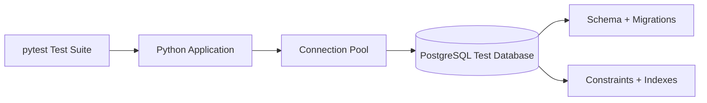

# 17- Database Testing

## Overview

Database testing verifies that application code interacts correctly with a real database and that persistence behavior matches the application's data and transaction contracts.

For Python backend systems, database tests are especially important because many production failures occur at the application-database boundary:

- incorrect SQL or ORM queries;
- missing or incorrect migrations;
- constraint violations;
- transaction bugs;
- isolation-level assumptions;
- connection-pool exhaustion;
- incorrect locking;
- race conditions;
- timezone or data-type mismatches;
- inefficient queries;
- incorrect pagination;
- database-specific behavior that mocks cannot reproduce.

A typical persistence path is:

```text
HTTP Request
     │
     ▼
API Layer
     │
     ▼
Service Layer
     │
     ▼
Repository / ORM
     │
     ▼
Connection Pool
     │
     ▼
PostgreSQL
     │
     ├── Constraints
     ├── Indexes
     ├── Transactions
     └── Query Planner
     │
     ▼
Persistent State
```

Database testing should therefore use real database behavior whenever the behavior being tested depends on database semantics.

---

## Why Database Testing Matters

A mocked repository can verify that application code calls:

```python
repository.save(order)
```

but it cannot prove that:

- the SQL is valid;
- the table exists;
- the columns have the expected types;
- foreign keys are configured correctly;
- unique constraints work;
- transactions roll back correctly;
- indexes support the intended query;
- concurrent transactions behave correctly;
- PostgreSQL returns the expected data.

Database tests provide confidence at this boundary.

---

## Database Testing vs Unit Testing

| Concern | Unit Test | Database Test |
|---|---:|---:|
| Business logic | Excellent | Sometimes |
| Repository logic | Limited | Excellent |
| Real SQL | No | Yes |
| ORM behavior | Partially | Yes |
| Constraints | No | Yes |
| Transactions | Mocked | Real |
| Index behavior | No | Yes |
| Locking | No | Yes |
| Query planner | No | Yes |
| Connection pooling | No | Yes |
| Execution speed | Very fast | Slower |
| Infrastructure required | No | Usually |

The goal is not to replace unit tests with database tests.

Use unit tests for broad business-logic coverage and database tests for persistence behavior that requires a real database.

---

## Database Test Layers

A mature backend commonly uses several database-related test levels.

```text
Pure Unit Tests
    │
    ├── Domain logic
    ├── Validation
    └── Transformation
    │
    ▼
Repository / Database Integration Tests
    │
    ├── SQL
    ├── ORM
    ├── Constraints
    └── Transactions
    │
    ▼
API + Database Tests
    │
    ├── HTTP
    ├── Authentication
    ├── Application logic
    └── Persistence
    │
    ▼
System / E2E Tests
```

Do not make every database test exercise the entire API stack.

Testing the repository directly is often faster and provides clearer failure diagnosis.

---

## Test Database Architecture

A production-like local or CI environment can use disposable infrastructure:



For larger systems:

```text
CI Worker
   │
   ├── PostgreSQL
   ├── Redis
   ├── Kafka
   └── Application
```

The database should be isolated from development and production databases.

---

## Test Database Isolation

Isolation is one of the most important database-testing concerns.

A test must not accidentally depend on:

- records created by another test;
- execution order;
- stale database state;
- another CI worker;
- local developer data.

A strong invariant is:

> Each test creates the state it needs and does not depend on state created by another test.

---

## Database Isolation Strategies

| Strategy | Speed | Isolation | Complexity | Best Use |
|---|---:|---:|---:|---|
| Transaction rollback | High | High | Medium | Simple transactional tests |
| Table truncation | Medium | High | Low | Small/medium suites |
| Schema per worker | High | High | Medium | Parallel CI |
| Database per worker | High | Very high | Medium | Large parallel suites |
| Database per test | Low | Very high | High | Strong isolation requirements |
| Disposable container | Medium | High | Medium | CI/local integration |

No strategy is universally correct.

The correct choice depends on transaction behavior, parallelism, database size, and infrastructure constraints.

---

## Transaction-Based Isolation

A common approach is:

```text
BEGIN
  │
  ├── Test setup
  ├── Execute test
  └── Assertions
  │
  ▼
ROLLBACK
```

This can be extremely fast because data does not need to be individually deleted.

However, transaction rollback can become misleading if the application uses:

- separate database connections;
- nested independent transactions;
- background workers;
- asynchronous tasks;
- connection pools.

The test transaction may not control work performed through another connection.

---

## Example Transaction Fixture

A simplified pytest fixture might look like:

```python
@pytest.fixture
def db_connection():
    connection = create_connection()

    connection.begin()

    try:
        yield connection
    finally:
        connection.rollback()
        connection.close()
```

The exact implementation depends on the database driver, ORM, and transaction model.

Do not copy this pattern blindly into an ORM that manages its own transaction lifecycle.

---

## Database Cleanup

When transactional isolation is unsuitable, tests can reset state explicitly.

For example:

```sql
TRUNCATE TABLE
    order_items,
    orders,
    customers
RESTART IDENTITY CASCADE;
```

Important considerations:

- respect foreign-key dependencies;
- reset sequences when required;
- avoid deleting reference data unnecessarily;
- ensure cleanup cannot target production;
- account for parallel test execution.

Cleanup should be deterministic and centrally managed.

---

## Test Database Lifecycle

A reliable lifecycle is:

```text
Create Environment
       │
       ▼
Start PostgreSQL
       │
       ▼
Wait Until Ready
       │
       ▼
Run Migrations
       │
       ▼
Execute Tests
       │
       ▼
Collect Diagnostics
       │
       ▼
Destroy Environment
```

The test harness should treat infrastructure startup and cleanup as first-class operations.

---

## Schema and Migrations

Database tests should normally run against the schema produced by the application's actual migration system.

For Alembic:

```bash
alembic upgrade head
```

For Django:

```bash
python manage.py migrate
```

This verifies that:

- migrations apply successfully;
- tables are created;
- columns have expected types;
- indexes exist;
- constraints exist;
- migration ordering is valid.

Manually constructing a simplified schema can hide migration defects.

---

## Migration Testing

A useful CI test is:

```text
Empty PostgreSQL
       │
       ▼
Run all migrations
       │
       ▼
Schema created
       │
       ▼
Database tests
```

Migration failures should block deployment when migrations are part of the release.

For mature systems, also test upgrade paths:

```text
Schema N
   │
   ▼
Migration
   │
   ▼
Schema N+1
```

This is particularly important for zero-downtime deployments.

---

## Expand and Contract Migrations

Production migrations often use:

```text
Expand
  │
  ├── Add new compatible column
  ├── Add new index
  └── Preserve old behavior
  │
  ▼
Application Migration
  │
  ▼
Backfill
  │
  ▼
Contract
  └── Remove obsolete schema
```

Database tests should verify transitional states when rolling deployments can run multiple application versions simultaneously.

Avoid migrations that require all application instances to upgrade atomically unless the deployment architecture guarantees that behavior.

---

## Repository Testing

Repository tests focus directly on persistence behavior.

Example:

```python
async def test_get_order_returns_persisted_order(
    repository,
    db_session,
):
    order = Order(
        id="order-123",
        customer_id="customer-123",
        status="pending",
    )

    await repository.save(
        db_session,
        order,
    )

    result = await repository.get(
        db_session,
        "order-123",
    )

    assert result is not None
    assert result.id == order.id
    assert result.status == "pending"
```

This validates the repository against the real database rather than a mocked persistence layer.

---

## Testing Inserts

Insert tests should verify:

- required columns;
- generated identifiers;
- default values;
- timestamps;
- enum values;
- foreign keys;
- constraints.

For generated values, assert the contract rather than implementation details.

For example:

```python
assert order.id is not None
assert order.created_at is not None
```

---

## Testing Updates

Verify both the requested mutation and fields that should remain unchanged.

```python
original = await repository.get(
    db_session,
    order.id,
)

await repository.update_status(
    db_session,
    order.id,
    "confirmed",
)

updated = await repository.get(
    db_session,
    order.id,
)

assert updated.status == "confirmed"
assert updated.customer_id == original.customer_id
```

This protects against accidental broad updates.

---

## Testing Deletes

Deletion tests should verify the intended semantics.

For hard deletion:

```python
await repository.delete(
    db_session,
    order.id,
)

assert await repository.get(
    db_session,
    order.id,
) is None
```

For soft deletion:

```python
await repository.delete(
    db_session,
    order.id,
)

deleted = await repository.get(
    db_session,
    order.id,
)

assert deleted is None
```

or verify the underlying `deleted_at` state according to the application's contract.

---

## Soft Delete Testing

Soft deletion introduces additional requirements.

Verify that:

```text
DELETE
  │
  ▼
deleted_at = timestamp
  │
  ▼
normal queries exclude record
```

Also test administrative or recovery queries if they are supported.

A common defect is applying soft-delete logic to one repository query while forgetting another query path.

---

## Unique Constraints

If the schema defines:

```sql
UNIQUE (email)
```

test the actual database constraint:

```python
await create_user(
    db_session,
    email="user@example.com",
)

with pytest.raises(IntegrityError):
    await create_user(
        db_session,
        email="user@example.com",
    )
```

Do not rely exclusively on application-level pre-checks.

Two concurrent requests can both pass:

```text
SELECT email
     ↓
not found
     ↓
INSERT
```

The database constraint provides the final consistency boundary.

---

## Foreign Key Constraints

Test invalid relationships.

```python
with pytest.raises(IntegrityError):
    await create_order(
        db_session,
        customer_id="does-not-exist",
    )
```

This verifies that the actual database schema protects referential integrity.

---

## Check Constraints

PostgreSQL can enforce domain invariants:

```sql
CHECK (quantity > 0)
```

Test both valid and invalid states.

Database constraints should complement application validation rather than being treated as interchangeable.

Application validation provides useful API errors; database constraints provide authoritative persistence protection.

---

## Nullability

Test required and optional columns explicitly.

For example:

```text
email NOT NULL
phone NULL
```

Verify that:

- valid values are accepted;
- missing required values fail;
- nullable fields behave correctly.

Null semantics can produce subtle query behavior, especially with comparisons and joins.

---

## Default Values

Test database-generated defaults when they are part of the persistence contract.

For example:

```sql
created_at TIMESTAMPTZ NOT NULL DEFAULT now()
```

The test should verify that the database creates the expected value when the application does not provide one.

---

## Database Data Types

Integration tests should cover important database/Python type mappings.

Common examples:

| PostgreSQL | Python |
|---|---|
| `INTEGER` | `int` |
| `NUMERIC` | `Decimal` |
| `BOOLEAN` | `bool` |
| `TEXT` | `str` |
| `TIMESTAMPTZ` | `datetime` |
| `UUID` | `UUID` |
| `JSONB` | `dict` / structured type |
| `BYTEA` | `bytes` |

Pay particular attention to:

- timezone-aware datetimes;
- decimal precision;
- UUID serialization;
- JSON null vs SQL NULL.

---

## Timezone Testing

For backend systems, timestamps should normally have an explicit timezone policy.

Prefer database types and application handling that preserve timezone information.

Test:

```text
stored timestamp
      │
      ▼
retrieved datetime
      │
      ▼
API serialization
```

Avoid tests that pass only because the developer's local timezone matches the CI environment.

---

## Decimal and Monetary Values

Never assume binary floating-point is appropriate for monetary database fields.

Prefer:

```python
from decimal import Decimal

price = Decimal("19.99")
```

and appropriate database `NUMERIC` precision.

Integration tests should verify that values survive:

```text
Python Decimal
    ↓
PostgreSQL NUMERIC
    ↓
Python Decimal
    ↓
API serialization
```

without unintended rounding.

---

## JSON and JSONB Testing

PostgreSQL JSONB fields require tests for:

- nested structures;
- missing keys;
- null values;
- filtering;
- indexing;
- serialization.

Example:

```python
await repository.save_metadata(
    db_session,
    customer_id,
    {
        "preferences": {
            "language": "en",
        },
    },
)

result = await repository.get_metadata(
    db_session,
    customer_id,
)

assert result["preferences"]["language"] == "en"
```

Do not assume Python dictionary semantics and PostgreSQL JSON semantics are identical in every query context.

---

## Query Testing

Database tests should exercise real queries.

Examples include:

- filtering;
- joins;
- aggregation;
- ordering;
- pagination;
- existence checks;
- date ranges;
- conditional updates.

The test should verify behavior rather than merely confirming that a query executed without an exception.

---

## Joins

Test important relationship queries with realistic data:

```text
customers
   │
   └── orders
         │
         └── order_items
```

Verify:

- missing relationships;
- one-to-many relationships;
- duplicate rows;
- filtering across joins;
- correct aggregation.

Join bugs can silently produce incorrect business data even when the query succeeds.

---

## N+1 Query Testing

API and repository tests can detect accidental N+1 queries.

Bad pattern:

```text
SELECT orders
SELECT customer WHERE id = 1
SELECT customer WHERE id = 2
SELECT customer WHERE id = 3
...
```

Better:

```text
SELECT orders
LEFT JOIN customers
```

or an ORM-specific eager-loading strategy.

A targeted test can assert a reasonable query count.

Avoid asserting exact query counts across the entire suite because implementation changes may legitimately alter query structure.

---

## Query Performance Testing

Functional correctness and query performance are related but distinct.

A query can return the correct result while performing poorly.

For critical queries, inspect:

```sql
EXPLAIN (ANALYZE, BUFFERS)
SELECT ...
```

Use this during performance-focused database testing rather than making every CI test depend on exact execution-plan details.

Execution plans can vary with:

- PostgreSQL version;
- statistics;
- data distribution;
- hardware;
- indexes.

---

## Index Testing

Indexes should be tested indirectly through realistic queries and explicitly through schema verification where necessary.

A test can verify that a required index exists through PostgreSQL metadata.

However, an index existing does not guarantee that PostgreSQL will use it.

The query planner decides based on:

- statistics;
- selectivity;
- cost;
- table size;
- available indexes.

---

## Pagination Testing

Database-backed pagination should verify:

- stable ordering;
- first page;
- subsequent pages;
- empty page;
- duplicate prevention;
- missing-record prevention.

For large datasets, cursor/keyset pagination may be preferable to large offsets.

Example:

```text
WHERE created_at < :cursor
ORDER BY created_at DESC
LIMIT :limit
```

Tests should verify deterministic ordering, especially when timestamps are not unique.

---

## Offset vs Cursor Pagination

| Strategy | Advantages | Limitations |
|---|---|---|
| Offset | Simple | Can become expensive for large offsets |
| Cursor | Efficient at scale | More complex |
| Keyset | Stable and efficient | Requires suitable ordering/index |

Database tests should validate the chosen pagination semantics rather than assuming one strategy is universally correct.

---

## Transactions

Transactions are a core database-testing concern.

Test:

```text
BEGIN
  │
  ├── Operation A
  ├── Operation B
  │
  └── failure
       │
       ▼
    ROLLBACK
```

After rollback, verify that partial state does not remain.

---

## Commit Testing

A successful operation should leave durable state after the transaction commits.

Test from an independent connection when necessary:

```text
Connection A
    │
    ├── BEGIN
    ├── INSERT
    └── COMMIT
             │
             ▼
Connection B
    │
    └── SELECT → row exists
```

This can reveal tests that accidentally observe uncommitted state on the same connection.

---

## Rollback Testing

A strong rollback test verifies the database rather than merely catching an exception.

```python
with pytest.raises(OrderCreationError):
    await service.create_order(
        db_session,
        payload,
    )

assert await repository.count_orders(
    db_session,
) == 0
```

If background workers or separate connections are involved, verify the state using an independent database context.

---

## Nested Transactions and Savepoints

Applications may use savepoints:

```text
BEGIN
  │
  ├── operation A
  │
  ├── SAVEPOINT
  │
  ├── operation B
  │
  └── ROLLBACK TO SAVEPOINT
```

Integration tests should verify the actual behavior if the application depends on nested transaction semantics.

Do not assume an ORM's transaction abstraction maps directly to independent database transactions.

---

## Isolation Levels

PostgreSQL transaction isolation affects what concurrent transactions can observe.

Common levels include:

| Isolation | Typical characteristic |
|---|---|
| Read Committed | Default PostgreSQL level; statements see committed data |
| Repeatable Read | Transaction-level snapshot semantics |
| Serializable | Strongest isolation; may require retry after serialization failures |

If application correctness depends on a specific isolation level, test that behavior against the actual database.

---

## Concurrency Testing

Database concurrency bugs require real concurrent transactions.

Example:

```text
Transaction A                 Transaction B
     │                             │
     ├── read inventory = 1        │
     │                             ├── read inventory = 1
     │                             │
     ├── reserve                   ├── reserve
     │                             │
     ▼                             ▼
        invariant violated
```

A concurrency test should verify the business invariant, not merely whether both requests returned.

---

## Row-Level Locking

For inventory or other scarce resources, an application may use:

```sql
SELECT *
FROM inventory
WHERE product_id = $1
FOR UPDATE;
```

Integration tests should verify that concurrent operations respect the intended locking semantics.

A useful invariant is:

```text
successful reservations <= available inventory
```

---

## Deadlock Testing

Deadlocks can occur when transactions acquire locks in inconsistent orders.

For example:

```text
Transaction A:
lock row 1 → lock row 2

Transaction B:
lock row 2 → lock row 1
```

Database integration tests can deliberately exercise important locking paths.

Applications should also define how deadlocks are surfaced and whether safe retry is appropriate.

---

## Optimistic Locking

Optimistic concurrency may use a version field:

```text
id | version | state
```

Update:

```sql
UPDATE orders
SET status = $1,
    version = version + 1
WHERE id = $2
  AND version = $3;
```

The test should verify that stale updates fail rather than silently overwriting newer state.

---

## Database Constraints vs Application Validation

Use both when appropriate.

```text
API Validation
      │
      ▼
User-friendly error
      │
      ▼
Database Constraint
      │
      ▼
Final consistency guarantee
```

Application validation improves user experience.

Database constraints protect integrity when multiple application instances, workers, scripts, or services write to the database.

---

## Testing Stored Procedures and Database Functions

If business-critical logic resides in PostgreSQL functions, triggers, or procedures, test them against a real PostgreSQL instance.

Mocks cannot validate:

- PL/pgSQL;
- trigger behavior;
- database-generated values;
- function semantics.

Keep database-resident logic explicitly covered.

---

## Trigger Testing

Triggers can create hidden side effects:

```text
INSERT order
    │
    ▼
Trigger
    ├── audit record
    └── update timestamp
```

Tests should verify important trigger behavior explicitly.

Avoid excessive reliance on hidden triggers because they can make application behavior harder to reason about.

---

## Repository and ORM Testing

ORMs such as Django ORM and SQLAlchemy abstract SQL but do not eliminate database-specific behavior.

Integration tests should validate:

- query construction;
- relationship loading;
- transaction behavior;
- constraints;
- generated SQL where necessary;
- database-specific features.

Do not assume that successful ORM object construction proves persistence correctness.

---

## Django Database Testing

Django's test framework provides database-aware testing infrastructure.

A typical test:

```python
from django.test import TestCase

from orders.models import Order


class OrderModelTests(TestCase):
    def test_order_is_persisted(self):
        order = Order.objects.create(
            customer_id="customer-123",
            status="pending",
        )

        stored = Order.objects.get(
            id=order.id,
        )

        self.assertEqual(
            stored.status,
            "pending",
        )
```

Django's test database lifecycle and transaction handling should be understood before adding custom cleanup mechanisms.

Do not introduce independent transaction management that conflicts with Django's test isolation model.

---

## SQLAlchemy Testing

With SQLAlchemy, explicitly understand:

- `Session` lifecycle;
- transaction boundaries;
- flush vs commit;
- rollback;
- connection pooling;
- async sessions.

A common distinction is:

```text
session.add(...)
    │
    ▼
flush()
    │
    └── SQL executed
    │
    ▼
commit()
    │
    └── transaction durable
```

A test that only calls `flush()` may observe behavior that differs from a real committed transaction.

---

## Flush vs Commit

This distinction is important in ORM-based testing.

### Flush

Synchronizes pending ORM state with the database inside the current transaction.

### Commit

Commits the transaction and makes the changes durable to other transactions according to the database's visibility rules.

Tests should use the same transaction semantics as production code when validating persistence behavior.

---

## Connection Pool Testing

Production applications commonly use connection pools.

Test important configuration and behavior:

- maximum connections;
- connection acquisition;
- connection release;
- timeout behavior;
- stale connection recovery;
- shutdown cleanup.

A common production failure is:

```text
Requests increase
      │
      ▼
Connections not released
      │
      ▼
Pool exhausted
      │
      ▼
Request failures
```

A simple repository unit test will not detect this.

---

## Database Timeout Testing

Test appropriate timeout behavior for:

- connection acquisition;
- query execution;
- transaction duration;
- lock waits.

Timeouts should prevent indefinite resource consumption.

Avoid making tests dependent on extremely precise timeout durations because CI scheduling can vary.

---

## Database Failure Testing

Important failure scenarios include:

- database unavailable;
- connection refused;
- connection reset;
- query timeout;
- deadlock;
- serialization failure;
- constraint violation;
- connection pool exhaustion.

The application should translate these failures into appropriate behavior.

For example:

```text
PostgreSQL unavailable
        │
        ▼
Repository error
        │
        ▼
Application error handling
        │
        ▼
503 / retry / degraded mode
```

The expected behavior depends on the dependency's role.

---

## Retry Testing

Only retry errors that are safe to retry.

Examples may include:

- transient connection failures;
- serialization failures;
- certain deadlocks.

Do not automatically retry:

- unique constraint violations;
- invalid SQL;
- invalid user input;
- authorization failures.

Database retries must also respect transaction boundaries.

---

## Idempotency and Database Testing

Database tests are useful for verifying idempotent operations.

For example:

```text
Request A
   │
   ▼
Insert idempotency key
   │
   ▼
Business operation

Request A retry
   │
   ▼
Same idempotency key
   │
   ▼
Return original result
```

Verify that concurrent duplicate requests cannot create duplicate business state.

Database uniqueness constraints often form an important part of this design.

---

## Foreign Keys and Cascades

Test deletion semantics explicitly.

Possible behavior:

```text
DELETE customer
    │
    ├── RESTRICT
    ├── CASCADE
    └── SET NULL
```

The correct behavior depends on domain requirements.

Never assume cascade behavior based solely on ORM configuration.

Verify the actual database schema.

---

## Database Seeding

Seed only data required for the test environment.

Separate:

- schema migrations;
- reference data;
- test data.

Avoid a giant global seed that every test implicitly depends on.

Global seed data can create hidden coupling and make tests harder to parallelize.

---

## Test Factories

Factories make database tests easier to compose.

```python
def customer_factory(
    repository,
    *,
    status="active",
):
    customer = Customer(
        id=str(uuid4()),
        status=status,
        email=f"{uuid4()}@example.test",
    )

    repository.save(customer)

    return customer
```

Factories should create valid domain state by default while allowing tests to override relevant attributes.

---

## Valid and Invalid Fixtures

A useful pattern is:

```text
Factory
  │
  ├── valid default
  │
  ├── boundary configuration
  │
  └── intentionally invalid state
```

Do not make the default factory overly complex.

A test should remain clear about which state is important.

---

## Test Data Volume

Small datasets are appropriate for most correctness tests.

Large datasets are useful for:

- query performance;
- pagination;
- indexing;
- memory behavior;
- batch processing.

Do not use production-scale datasets in every CI test.

Separate correctness testing from performance and load testing.

---

## Query Count and Performance Regression Tests

For high-value endpoints, track important query behavior.

Examples:

- list endpoint should not perform N+1 queries;
- search query should use the intended index;
- pagination should remain efficient.

Treat exact query counts as targeted regression tests, not universal assertions.

---

## Database Testing in CI

A practical CI flow is:

```text
Checkout
   │
   ▼
Start PostgreSQL
   │
   ▼
Health Check
   │
   ▼
Run Migrations
   │
   ▼
Run Database Tests
   │
   ▼
Run API/Integration Tests
   │
   ▼
Destroy Database
```

Use a PostgreSQL version compatible with the application's supported production environment.

---

## Docker-Based PostgreSQL Testing

A disposable PostgreSQL container provides:

- reproducibility;
- environment isolation;
- predictable versions;
- easy cleanup.

Example:

```yaml
services:
  postgres:
    image: postgres:18
    environment:
      POSTGRES_DB: app_test
      POSTGRES_USER: app
      POSTGRES_PASSWORD: test
    healthcheck:
      test:
        [
          "CMD-SHELL",
          "pg_isready -U app -d app_test"
        ]
      interval: 5s
      timeout: 5s
      retries: 10
```

Pin the database version intentionally.

Do not use production credentials.

---

## Parallel Database Tests

Parallel execution can significantly reduce CI time.

Possible architecture:

```text
Worker 1 → PostgreSQL database/schema 1
Worker 2 → PostgreSQL database/schema 2
Worker 3 → PostgreSQL database/schema 3
Worker 4 → PostgreSQL database/schema 4
```

Isolation can also be achieved with unique test data, but database-level separation is often easier to reason about for complex suites.

---

## Database Test Performance

Common performance bottlenecks include:

- recreating databases unnecessarily;
- running migrations repeatedly;
- excessive fixture setup;
- large seed datasets;
- serial execution;
- slow cleanup;
- unnecessary network hops.

Optimize the test environment without weakening isolation.

For example:

```text
Session-scoped PostgreSQL
        +
Worker-isolated schemas
        +
Function-scoped data
```

can provide a useful balance for large suites.

---

## Security Considerations

Database tests must be isolated from production.

Use:

- dedicated database credentials;
- dedicated database names;
- restricted permissions;
- synthetic data;
- separate cloud accounts where appropriate;
- CI-managed secrets.

Validate test configuration explicitly.

For example:

```python
if settings.environment == "production":
    raise RuntimeError(
        "Database tests cannot target production"
    )
```

A test suite with permission to drop tables should never have credentials capable of doing so in production.

---

## PostgreSQL in AWS

When production uses Amazon RDS or Aurora PostgreSQL, local PostgreSQL integration tests can validate most application-level database behavior.

Targeted environment tests may additionally validate:

- TLS;
- IAM authentication where used;
- parameter differences;
- connection limits;
- network configuration;
- failover behavior.

Do not assume local PostgreSQL validates every AWS operational characteristic.

---

## High Availability and Failover

Database integration tests normally focus on application/database semantics.

For high-availability systems, separate tests can validate:

```text
Application
    │
    ▼
Primary Database
    │
    X failure
    │
    ▼
Failover
    │
    ▼
New Primary
    │
    ▼
Application Recovery
```

Test:

- connection recovery;
- retry behavior;
- transaction safety;
- request behavior during failover.

These are higher-cost resilience tests and should be targeted rather than executed on every pull request.

---

## Disaster Recovery

Database testing should not be confused with backup validation.

Critical systems may require separate tests for:

- backup creation;
- restore;
- point-in-time recovery;
- replication;
- failover;
- data integrity after recovery.

A passing CRUD test does not prove that the system can recover from database loss.

---

## Monitoring Test Failures

When database tests fail, diagnostics should make the cause visible.

Useful information includes:

- PostgreSQL logs;
- migration output;
- connection errors;
- failed SQL where safe;
- transaction state;
- test duration;
- database version;
- container status.

Never expose database passwords or secrets in CI logs.

---

## Common Mistakes

### Mocking the Database

Mocking:

```python
repository.get.return_value = order
```

does not test persistence.

Use real database integration tests for database behavior.

### Sharing Database State

Tests that depend on records created by previous tests become order-dependent.

Each test should establish its own state.

### Testing Only ORM Objects

Creating an ORM object does not prove that:

- SQL executes;
- constraints exist;
- transactions commit;
- relationships work.

Persist and retrieve through the real database.

### Ignoring Migrations

A test suite that creates tables directly can pass while production migrations fail.

Run the actual migration process.

### Using One Global Transaction Blindly

An outer test transaction may not contain work performed by separate application connections or background workers.

Understand the actual transaction topology.

### Using Production Data

Production data creates security, privacy, and compliance risks.

Use synthetic data.

### Exact Query-Count Everywhere

Exact query counts are useful targeted regressions but can make tests unnecessarily brittle.

Focus on meaningful performance invariants.

### Ignoring Database-Specific Behavior

An abstraction layer does not remove database semantics.

Features such as PostgreSQL locking, JSONB, isolation, constraints, and query planning require real PostgreSQL testing.

---

## Production Pitfalls

### Tests Pass but Production Queries Are Slow

Small test datasets may produce excellent query plans even when production-scale data does not.

Use representative performance tests separately.

### Tests Pass with SQLite but Production Uses PostgreSQL

SQLite and PostgreSQL differ in:

- SQL behavior;
- concurrency;
- locking;
- data types;
- constraints;
- transaction semantics.

Do not use SQLite as a substitute when PostgreSQL-specific behavior matters.

### Test Isolation Hides Transaction Bugs

A test that uses one connection may see uncommitted changes that another production connection cannot see.

Test important commit/visibility behavior using independent connections.

### Database Constraints Are Missing

Application-level validation can pass while concurrent writes violate business invariants.

Enforce critical invariants in the database where appropriate.

### Connection Leaks

Tests that fail to close sessions or connections may eventually exhaust the test database and produce misleading failures.

Make resource cleanup deterministic.

---

## Best Practices

- Use a real database for behavior that depends on database semantics.
- Run the same migration mechanism used by production.
- Keep tests isolated and independent.
- Use factories for controlled test data.
- Prefer transactional cleanup where it is compatible with the application's transaction model.
- Use schema/database isolation for parallel workers when necessary.
- Test constraints, relationships, transactions, and locking explicitly.
- Test both successful and failure paths.
- Verify persistent state, not only returned ORM objects.
- Test commit and rollback behavior using realistic connection boundaries.
- Use targeted query-performance and concurrency tests.
- Keep database versions aligned with supported production versions.
- Protect test environments from production endpoints and credentials.
- Capture useful database diagnostics in CI.
- Separate correctness tests from load, failover, and disaster-recovery testing.

---

## Database Testing Checklist

### Environment

- [ ] Is the database isolated from production?
- [ ] Is the database version controlled?
- [ ] Are test credentials used?
- [ ] Is database readiness verified?
- [ ] Is cleanup deterministic?

### Schema

- [ ] Are real migrations executed?
- [ ] Are constraints verified?
- [ ] Are indexes verified where important?
- [ ] Are defaults tested?
- [ ] Are foreign keys tested?
- [ ] Are schema upgrade paths tested where required?

### Persistence

- [ ] Are inserts tested?
- [ ] Are updates tested?
- [ ] Are deletes tested?
- [ ] Are soft deletes tested?
- [ ] Are data-type mappings tested?
- [ ] Are important queries tested?

### Transactions

- [ ] Is commit behavior tested?
- [ ] Is rollback behavior tested?
- [ ] Are independent connections considered?
- [ ] Are isolation levels tested where important?
- [ ] Are locking behaviors tested?

### Concurrency

- [ ] Are race-sensitive operations tested?
- [ ] Are unique constraints relied upon appropriately?
- [ ] Are optimistic/pessimistic locking paths tested?
- [ ] Are deadlocks or serialization failures handled where relevant?
- [ ] Are concurrent tests deterministic?

### Operations

- [ ] Are connection pools configured safely?
- [ ] Are timeouts bounded?
- [ ] Are database failures handled?
- [ ] Are CI resources isolated?
- [ ] Are logs available for failures?

### Security

- [ ] Can tests ever target production?
- [ ] Are credentials isolated?
- [ ] Is synthetic data used?
- [ ] Are CI secrets protected?
- [ ] Are database permissions least-privileged?

---

## Interview Traps

### Why Do We Need Database Tests If We Have Unit Tests?

Unit tests cannot reliably validate real SQL, schema constraints, transactions, locking, connection behavior, migrations, and database-specific semantics.

### Why Not Mock the Repository?

Mocking the repository is appropriate for testing higher-level business logic in isolation. It is insufficient for testing whether the repository actually persists and retrieves data correctly.

### Why Is PostgreSQL Integration Testing Better Than SQLite When Production Uses PostgreSQL?

SQLite has different SQL, transaction, locking, type, and concurrency semantics. If PostgreSQL behavior matters in production, test against PostgreSQL.

### How Do You Isolate Database Tests?

Common approaches include transaction rollback, truncation, schema-per-worker, database-per-worker, or disposable databases. The correct approach depends on transaction behavior and parallelism.

### Why Can Transaction Rollback Isolation Be Dangerous?

The test's transaction may not contain work performed through separate connections, background workers, or independent transactions. The test can therefore provide false confidence.

### What Should Database Tests Verify?

They should verify persistent state, constraints, relationships, transactions, queries, and other database semantics that the application depends on.

### Should Every Database Test Verify SQL Text?

No. Most tests should verify behavior. SQL-text assertions are generally appropriate only when exact SQL generation is itself a contract or when diagnosing a targeted regression.

### How Do You Test Concurrent Database Operations?

Execute realistic concurrent transactions against the real database and assert business invariants such as uniqueness, inventory limits, or version consistency.

### Why Test Database Constraints If the API Validates Input?

Application validation improves user-facing errors, but concurrent writers can bypass pre-checks. Database constraints provide an authoritative consistency boundary.

### How Do You Test Migrations?

Create an empty test database, run the actual migration chain, and execute relevant database tests. For production deployments, also test important upgrade and backward-compatibility paths.

### How Do You Test Database Performance?

Use representative data and tools such as `EXPLAIN (ANALYZE, BUFFERS)` for targeted query analysis. Functional tests alone cannot establish production-scale query performance.

### How Do Database Tests Fit Into CI/CD?

Start an isolated database, verify readiness, run migrations, execute database and integration tests, collect diagnostics on failure, and destroy the environment. Critical migration failures should block deployment.

## Key Takeaways

- **Use real databases for real database behavior:** SQL, constraints, transactions, locking, migrations, data types, and connection semantics cannot be adequately validated with mocks alone.
- **Isolation is fundamental:** each test should own its state, and parallel workers should use isolated schemas, databases, or carefully partitioned data.
- **Test persistence semantics, not just ORM behavior:** verify commits, rollbacks, constraints, relationships, concurrency invariants, and database-generated values.
- **Match production semantics:** use the production database engine and migration mechanism where practical, especially when PostgreSQL-specific behavior matters.
- **Separate correctness from resilience and performance testing:** targeted query, load, failover, and disaster-recovery tests complement the core database test suite without making every CI run unnecessarily expensive.