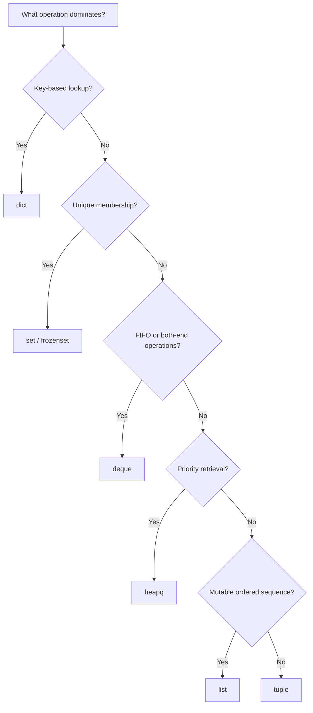

# 02- Python Data Structures

## Overview

Python data structures are a core interview topic because they combine language semantics, algorithmic complexity, memory behavior, and practical engineering tradeoffs.

For backend engineers, choosing the correct data structure directly affects:

- lookup performance;
- memory consumption;
- mutation behavior;
- ordering guarantees;
- concurrency behavior;
- API and database processing;
- caching;
- queues and scheduling;
- algorithmic complexity.

The important interview skill is not memorizing every method. It is recognizing the required operations and selecting the structure whose characteristics match those requirements.

```text
Problem Requirements
        │
        ├── Ordered access?
        ├── Fast membership?
        ├── Key/value lookup?
        ├── Uniqueness?
        ├── FIFO/LIFO?
        ├── Priority ordering?
        ├── Mutation?
        └── Memory constraints?
        │
        ▼
Choose Data Structure
        │
        ▼
Analyze Time + Space Complexity
        │
        ▼
Validate Production Tradeoffs
```

---

## Core Built-in Data Structures

The primary Python data structures are:

- `list`
- `tuple`
- `dict`
- `set`
- `str`
- `bytes`
- `bytearray`
- `frozenset`
- `range`

The standard library also provides specialized structures such as:

- `collections.deque`
- `collections.defaultdict`
- `collections.Counter`
- `collections.OrderedDict`
- `collections.ChainMap`
- `heapq`

---

## Choosing the Right Structure

| Requirement | Typical choice |
|---|---|
| Ordered mutable sequence | `list` |
| Immutable sequence | `tuple` |
| Key/value lookup | `dict` |
| Unique values | `set` |
| Immutable unique values | `frozenset` |
| FIFO/LIFO operations at both ends | `deque` |
| Frequency counting | `Counter` |
| Grouping/default values | `defaultdict` |
| Priority queue | `heapq` |
| Efficient text processing | `str` |
| Immutable binary data | `bytes` |
| Mutable binary buffer | `bytearray` |

The right question is:

> Which operations must be efficient?

For example, if the dominant operation is membership testing, a `set` is usually more appropriate than a `list`.

---

## Lists

A Python `list` is an ordered, mutable, dynamically sized sequence.

```python
customer_ids = [101, 205, 309]

customer_ids.append(412)
customer_ids.extend([501, 502])

print(customer_ids[0])
```

Lists are implemented in CPython as dynamic arrays containing references to Python objects.

Conceptually:

```text
List
 │
 ├── pointer ──► object 101
 ├── pointer ──► object 205
 ├── pointer ──► object 309
 └── pointer ──► object 412
```

The list stores references rather than embedding arbitrary Python objects directly inside the array.

---

## List Complexity

| Operation | Typical complexity |
|---|---:|
| `items[i]` | O(1) |
| `items.append(x)` | Amortized O(1) |
| `items.pop()` | O(1) |
| `items.insert(0, x)` | O(n) |
| `items.pop(0)` | O(n) |
| `x in items` | O(n) |
| `items.remove(x)` | O(n) |
| `items[index] = x` | O(1) |
| `items[a:b]` | O(k) |

`k` represents the size of the resulting slice.

---

## List Growth

Appending repeatedly is efficient because Python lists over-allocate capacity.

Conceptually:

```text
Current capacity
      │
      ▼
[ A ][ B ][ C ][   ][   ]
```

When capacity is exhausted, Python allocates a larger backing array and copies references.

Therefore:

```python
items.append(value)
```

has **amortized O(1)** complexity rather than O(1) for every individual append.

The exact growth strategy is an implementation detail and should not be relied upon as an API contract.

---

## List Insertion and Deletion

Lists are inefficient for frequent operations at the beginning.

```python
items.insert(0, value)
```

Existing elements generally need to move to make room.

Likewise:

```python
items.pop(0)
```

requires shifting remaining elements.

For queue-like workloads, prefer `collections.deque`.

---

## List Slicing

Slicing creates a new list.

```python
subset = items[100:200]
```

This is not a constant-time view.

For a slice containing `k` elements, the operation is generally O(k) and creates a new list containing references to those objects.

This matters when repeatedly slicing large collections.

---

## List Aliasing

Assignment does not copy a list.

```python
original = [1, 2, 3]
alias = original

alias.append(4)
```

Now both names reference the same object.

Use:

```python
copy = original.copy()
```

or:

```python
copy = original[:]
```

for a shallow copy.

For nested mutable structures, a shallow copy does not recursively copy nested objects.

---

## Tuples

A `tuple` is an ordered immutable sequence.

```python
coordinates = (22.5726, 88.3639)
```

Tuples are useful when the collection itself should not be structurally modified.

Common uses include:

- fixed-size records;
- function return values;
- dictionary keys when all elements are hashable;
- immutable configuration values.

```python
def get_position() -> tuple[float, float]:
    return 22.5726, 88.3639
```

---

## Tuple Immutability

Tuple immutability is shallow.

```python
items = ([1, 2], [3, 4])
items[0].append(5)
```

The tuple cannot replace its elements, but the nested list remains mutable.

Therefore:

> An immutable container does not necessarily make its entire object graph immutable.

---

## Tuple vs List

| Characteristic | `list` | `tuple` |
|---|---|---|
| Mutable | Yes | No |
| Ordered | Yes | Yes |
| Indexing | O(1) | O(1) |
| Append | Yes | No |
| Hashable | No | Sometimes |
| Typical intent | Mutable collection | Fixed/immutable record |

Do not claim tuples are universally "faster" than lists. Performance differences depend on the operation and workload.

---

## Dictionaries

A `dict` stores key/value mappings.

```python
customers = {
    "cust_1001": {"status": "active"},
    "cust_1002": {"status": "inactive"},
}
```

Python dictionaries are hash-table-based mappings.

Conceptually:

```text
Key
 │
 ▼
hash(key)
 │
 ▼
Hash table
 │
 ▼
Value
```

Average-case lookup, insertion, and deletion are O(1).

---

## Dictionary Complexity

| Operation | Average complexity |
|---|---:|
| `mapping[key]` | O(1) |
| `mapping[key] = value` | O(1) |
| `del mapping[key]` | O(1) |
| `key in mapping` | O(1) |
| Iteration | O(n) |
| `mapping.get(key)` | O(1) |

Worst-case behavior can degrade, so O(1) should be described as **average-case** complexity.

---

## Dictionary Keys

Dictionary keys must be hashable.

Typical hashable types include:

- `str`;
- `int`;
- `float`;
- `bytes`;
- `tuple` containing only hashable elements;
- `frozenset`.

Mutable objects such as lists and dictionaries are not valid keys.

```python
locations = {
    (22.5726, 88.3639): "Kolkata",
}
```

The tuple works because its elements are hashable.

---

## Hash Contract

For hashable objects:

```text
a == b
    implies
hash(a) == hash(b)
```

The reverse does not hold:

```text
hash(a) == hash(b)
```

does not imply:

```text
a == b
```

Hash collisions are possible and are handled internally by the dictionary implementation.

---

## Dictionary Ordering

Modern Python guarantees that dictionaries preserve insertion order.

```python
data = {}

data["first"] = 1
data["second"] = 2
data["third"] = 3
```

Iteration follows insertion order.

This is different from saying that dictionaries are sorted.

```text
Insertion order ≠ sorted order
```

If sorted ordering is required, explicitly sort the data.

---

## Dictionary Access Patterns

Prefer:

```python
status = customer.get("status")
```

when absence is expected.

Use:

```python
status = customer["status"]
```

when the key is required and missing data should be treated as an error.

Use a default when appropriate:

```python
status = customer.get("status", "unknown")
```

Avoid unnecessary patterns such as:

```python
if "status" in customer:
    status = customer["status"]
```

when a single `.get()` expresses the intent.

---

## `setdefault`

`setdefault()` can initialize a dictionary entry:

```python
groups = {}

groups.setdefault("active", []).append(customer_id)
```

However, repeated use can make logic harder to read.

For grouping workloads, `defaultdict` is often clearer.

---

## Dictionary Comprehensions

Dictionary comprehensions are useful for direct transformations.

```python
customer_status = {
    customer.id: customer.status
    for customer in customers
}
```

Avoid deeply nested comprehensions that obscure business logic.

---

## Sets

A `set` stores unique hashable elements.

```python
allowed_roles = {"admin", "operator", "viewer"}

if role in allowed_roles:
    authorize()
```

Sets are hash-table-based and provide average O(1) membership checks.

---

## Set Complexity

| Operation | Average complexity |
|---|---:|
| `x in items` | O(1) |
| `items.add(x)` | O(1) |
| `items.remove(x)` | O(1) |
| `items.discard(x)` | O(1) |
| Union | O(n + m) |
| Intersection | O(min(n, m)) typical |
| Iteration | O(n) |

Exact costs depend on operand sizes and implementation details.

---

## Set Operations

Sets provide useful mathematical operations.

```python
requested = {"read", "write", "delete"}
allowed = {"read", "write"}

effective = requested & allowed
missing = requested - allowed
```

Common operations:

| Operation | Operator |
|---|---|
| Union | `a \| b` |
| Intersection | `a & b` |
| Difference | `a - b` |
| Symmetric difference | `a ^ b` |
| Subset | `a <= b` |
| Superset | `a >= b` |

These are useful for authorization and feature-flag logic.

---

## `frozenset`

`frozenset` is an immutable set.

```python
permissions = frozenset({"read", "write"})
```

It can be used as a dictionary key or as an element of another set when its members are hashable.

Use it when:

- set semantics are needed;
- mutation should be prevented;
- hashability is required.

---

## Strings

Python strings are immutable Unicode sequences.

```python
message = "customer.created"
```

Strings support indexing and slicing, but operations that appear to modify a string create a new string.

```python
name = "customer"
name = name.upper()
```

The original string object was not mutated.

---

## String Performance

Repeated concatenation can become inefficient in some workloads:

```python
result = ""

for part in parts:
    result += part
```

Prefer:

```python
result = "".join(parts)
```

when constructing a string from many pieces.

For structured serialization, use appropriate serializers rather than manually concatenating strings.

---

## Bytes

`bytes` represents immutable binary data.

```python
payload = b"hello"
```

It is appropriate for:

- network payloads;
- binary files;
- cryptographic material;
- encoded data;
- protocol-level processing.

Convert explicitly when moving between text and binary representations:

```python
payload = text.encode("utf-8")
text = payload.decode("utf-8")
```

---

## Bytearray

`bytearray` provides a mutable binary sequence.

```python
buffer = bytearray(b"hello")
buffer[0] = ord("H")
```

Use it when binary data must be modified in place.

For immutable payloads and API boundaries, `bytes` is usually the clearer choice.

---

## Range

`range` represents an arithmetic progression without materializing every value.

```python
for index in range(1_000_000):
    process(index)
```

This is memory-efficient because it stores the range parameters rather than a million integer objects.

It supports indexing and membership operations without requiring a materialized list.

---

## `deque`

`collections.deque` is a double-ended queue.

```python
from collections import deque

queue = deque()

queue.append("job-1")
queue.append("job-2")

job = queue.popleft()
```

It is designed for efficient operations at both ends.

```text
appendleft ◄── [ A ][ B ][ C ] ──► append
                ▲
             popleft
```

---

## List vs Deque

| Operation | `list` | `deque` |
|---|---:|---:|
| Append right | Amortized O(1) | O(1) |
| Pop right | O(1) | O(1) |
| Insert left | O(n) | O(1) |
| Pop left | O(n) | O(1) |
| Random indexing | O(1) | O(1) near ends; slower toward middle |

Use `deque` for queues rather than repeatedly calling `pop(0)` on lists.

---

## `defaultdict`

`defaultdict` supplies a default value for missing keys.

```python
from collections import defaultdict

events_by_customer = defaultdict(list)

events_by_customer["cust-1"].append("login")
events_by_customer["cust-1"].append("purchase")
```

It is particularly useful for:

- grouping;
- accumulating values;
- building indexes.

Be aware that accessing a missing key can create it.

```python
value = events_by_customer["unknown"]
```

This may mutate the dictionary.

Use `.get()` on a normal dictionary when missing-key access should not mutate state.

---

## `Counter`

`Counter` is specialized for frequency counting.

```python
from collections import Counter

statuses = ["success", "failed", "success", "success"]

counts = Counter(statuses)

print(counts["success"])
```

Useful operations include:

```python
counts.most_common(2)
```

and:

```python
counts.update(["failed", "failed"])
```

Typical use cases:

- event frequencies;
- log analysis;
- categorical counts;
- inventory counts.

---

## `OrderedDict`

Regular dictionaries preserve insertion order in modern Python.

Therefore, `OrderedDict` is no longer necessary merely to preserve insertion order.

It still provides specialized ordering operations such as:

```python
from collections import OrderedDict

cache = OrderedDict()

cache["a"] = 1
cache["b"] = 2

cache.move_to_end("a")
```

It can be useful for explicit ordering semantics, including some LRU-style implementations.

---

## `heapq`

`heapq` provides heap operations over a list.

A heap is useful for efficiently retrieving the smallest item.

```python
import heapq

jobs = []

heapq.heappush(jobs, (10, "low-priority"))
heapq.heappush(jobs, (1, "urgent"))

priority, job = heapq.heappop(jobs)
```

Typical complexity:

| Operation | Complexity |
|---|---:|
| `heappush` | O(log n) |
| `heappop` | O(log n) |
| `heapify` | O(n) |
| Access minimum | O(1) |

---

## Priority Queues

A heap is appropriate when the requirement is:

> Repeatedly retrieve the highest-priority or lowest-value item.

It is not a fully sorted collection.

Only the heap invariant is guaranteed.

For a production task scheduler, also consider:

- persistent queues;
- distributed workers;
- retries;
- visibility timeouts;
- durability.

An in-memory heap is not a replacement for durable infrastructure such as a task queue when reliability is required.

---

## Queue Selection

| Requirement | Structure |
|---|---|
| Simple LIFO | `list` |
| FIFO | `deque` |
| Priority queue | `heapq` |
| Durable distributed queue | SQS/Kafka/task queue |
| High-throughput event streaming | Kafka |
| Background task execution | Celery/task queue |

The distinction between an in-process data structure and a distributed messaging system is important in backend interviews.

---

## Stack

Python lists naturally support stack semantics.

```python
stack = []

stack.append("request")
stack.append("validation")

current = stack.pop()
```

Both append and pop at the right side are amortized O(1).

For simple in-memory stacks, a list is generally sufficient.

---

## Queue

Use `deque` for an in-process queue:

```python
from collections import deque

queue = deque(["job-1", "job-2"])

while queue:
    job = queue.popleft()
    process(job)
```

For production distributed systems, use infrastructure designed for durability and coordination rather than relying on process-local memory.

---

## Ordered vs Unordered Concepts

Python structures have different ordering semantics.

| Structure | Ordering |
|---|---|
| `list` | Insertion order |
| `tuple` | Insertion order |
| `dict` | Insertion order |
| `set` | No ordering guarantee to rely upon |
| `frozenset` | No ordering guarantee to rely upon |
| `deque` | Sequence order |
| `heapq` | Heap invariant, not sorted iteration |

Never build correctness logic around observed set iteration order.

---

## Hashability

An object is hashable when it has a stable hash value during its lifetime and can participate correctly in equality comparisons.

Hashable objects can generally be used as:

- dictionary keys;
- set members.

Example:

```python
cache = {
    ("customer-1", "profile"): response,
}
```

A tuple can be hashable if all of its elements are hashable.

---

## Equality and Hashing

Custom classes require care when defining:

```python
__eq__()
```

and:

```python
__hash__()
```

If an object's hash changes while it is stored in a set or used as a dictionary key, lookup behavior can become invalid.

This is one reason mutable state should generally not participate in an object's hash identity.

---

## Nested Data Structures

Backend applications frequently process nested dictionaries and lists.

```python
payload = {
    "customer": {
        "id": "cust-123",
        "roles": ["admin", "operator"],
    },
    "metadata": {
        "source": "api",
    },
}
```

Nested structures are convenient for JSON APIs but can become difficult to validate and maintain.

For stable domain data, consider typed models or dataclasses.

```text
JSON payload
     │
     ▼
Validation model
     │
     ▼
Domain model
     │
     ▼
Persistence / business logic
```

---

## Data Structures and API Processing

A typical FastAPI request may transform data through several structures:

```text
HTTP JSON
   │
   ▼
dict / validated model
   │
   ▼
domain objects
   │
   ▼
dict / tuple / sequence
   │
   ▼
database driver
```

Choose structures according to responsibility.

For example:

- request payload → validation model;
- lookup index → `dict`;
- unique permissions → `set`;
- ordered response items → `list`;
- immutable configuration → tuple/frozen structure.

---

## Data Structures and PostgreSQL

Do not use Python data structures as a substitute for database indexing.

For example:

```python
customer_by_id = {
    customer.id: customer
}
```

is efficient for an in-memory working set.

It does not replace:

```sql
CREATE INDEX idx_customer_id ON customers(id);
```

The Python dictionary provides application-process-local lookup.

The database index provides persistent query performance across requests and processes.

---

## Data Structures and Redis

Redis itself provides specialized data structures such as:

- strings;
- hashes;
- lists;
- sets;
- sorted sets;
- streams.

The correct structure should match the access pattern.

For example:

```text
Unique membership
    → Redis Set

Sorted ranking
    → Redis Sorted Set

FIFO-style queue
    → Redis List / Streams

Key/value object
    → Redis Hash
```

The same data-structure selection principles apply across local Python and distributed infrastructure.

---

## Memory Considerations

Python collections have non-trivial overhead.

A collection may contain:

```text
Container
  │
  ├── internal bookkeeping
  ├── references
  └── Python objects
```

Therefore:

```python
[1, 2, 3, 4]
```

requires more memory than four raw machine integers in a compact native array.

For large numerical workloads, specialized structures such as NumPy arrays can provide substantially better memory density and vectorized processing.

---

## Copying Data Structures

Understand the difference between assignment and copying.

```python
a = [[1, 2], [3, 4]]
b = a
```

No copy occurs.

A shallow copy:

```python
b = a.copy()
```

copies the outer list but retains references to nested lists.

A deep copy:

```python
from copy import deepcopy

b = deepcopy(a)
```

recursively copies supported nested objects.

Do not automatically use `deepcopy` in production code. It can be expensive and may have undesirable semantics for objects representing resources or complex application state.

---

## Comprehensions vs Loops

For simple transformations:

```python
active_ids = [
    customer.id
    for customer in customers
    if customer.active
]
```

is concise and idiomatic.

For complex business rules:

```python
active_ids = []

for customer in customers:
    if not customer.active:
        continue

    if not customer.is_verified:
        continue

    if customer.region not in supported_regions:
        continue

    active_ids.append(customer.id)
```

The explicit loop may be easier to review and maintain.

Readability is an engineering constraint.

---

## Data Structure Selection by Access Pattern

| Access pattern | Preferred structure |
|---|---|
| Index by integer position | `list` |
| Lookup by identifier | `dict` |
| Membership with uniqueness | `set` |
| Add/remove from both ends | `deque` |
| Last-in-first-out | `list` |
| Repeated minimum/maximum extraction | `heapq` |
| Count occurrences | `Counter` |
| Group values by key | `defaultdict(list)` |
| Immutable fixed sequence | `tuple` |
| Immutable unique collection | `frozenset` |

This table is useful as an interview decision framework.

---

## Common Algorithmic Patterns

### Frequency Map

```python
from collections import Counter

counts = Counter(values)
```

Useful for:

- duplicate detection;
- frequency analysis;
- top-N calculations.

### Membership Set

```python
blocked_ids = set(blocked_customer_ids)

for customer_id in customer_ids:
    if customer_id in blocked_ids:
        reject(customer_id)
```

This can reduce repeated membership checks from O(n) per lookup with a list to average O(1) with a set.

### Lookup Dictionary

```python
customer_by_id = {
    customer.id: customer
    for customer in customers
}
```

Useful when repeated identifier-based access is required.

---

## Time Complexity Comparison

| Structure | Lookup | Membership | Insert | Delete | Ordered |
|---|---:|---:|---:|---:|---|
| `list` | O(1) index | O(n) | O(1) append* | O(n) arbitrary | Yes |
| `tuple` | O(1) index | O(n) | N/A | N/A | Yes |
| `dict` | O(1) avg | O(1) avg | O(1) avg | O(1) avg | Insertion |
| `set` | N/A | O(1) avg | O(1) avg | O(1) avg | No |
| `deque` | O(1) ends | O(n) | O(1) ends | O(1) ends | Yes |
| `heapq` | Min O(1) | O(n) | O(log n) | O(log n) min | Heap order |

\* `list.append()` is amortized O(1).

---

## Backend Example: Efficient Request Processing

Suppose an API receives customer IDs and needs to reject blocked customers.

An inefficient implementation might repeatedly scan a list:

```python
blocked_ids = get_blocked_ids()

for customer_id in requested_ids:
    if customer_id in blocked_ids:
        reject(customer_id)
```

If `blocked_ids` is a list, each membership check is O(n).

A better approach for a large working set is:

```python
blocked_ids = set(get_blocked_ids())

for customer_id in requested_ids:
    if customer_id in blocked_ids:
        reject(customer_id)
```

The membership operation becomes average O(1).

However, if the blocked set is already persisted in PostgreSQL or Redis, the production design should also consider where the authoritative lookup belongs.

---

## Backend Example: Grouping

For grouping records by customer:

```python
from collections import defaultdict

events_by_customer = defaultdict(list)

for event in events:
    events_by_customer[event.customer_id].append(event)
```

This avoids repeatedly checking whether each key exists.

For very large datasets, consider whether grouping should happen:

- in SQL;
- in a streaming pipeline;
- in Pandas;
- in a distributed processing system.

The best Python data structure is not always the best overall system design.

---

## Backend Example: LRU-Style In-Memory Cache

An ordered mapping can support a simple bounded cache pattern:

```python
from collections import OrderedDict


class LRUCache:
    def __init__(self, capacity: int) -> None:
        self.capacity = capacity
        self._items: OrderedDict[str, str] = OrderedDict()

    def get(self, key: str) -> str | None:
        value = self._items.get(key)

        if value is None:
            return None

        self._items.move_to_end(key)
        return value

    def put(self, key: str, value: str) -> None:
        self._items[key] = value
        self._items.move_to_end(key)

        if len(self._items) > self.capacity:
            self._items.popitem(last=False)
```

For production distributed applications, a process-local cache must be evaluated carefully because:

- each process has its own state;
- Kubernetes replicas do not share memory;
- cache invalidation becomes difficult;
- memory usage scales with replica count.

Redis or another shared cache may be more appropriate.

---

## Data Structures and Concurrency

Python data structures are not automatically a synchronization strategy.

For example:

```python
shared_queue = []
```

does not provide a complete producer-consumer coordination mechanism.

For threads, consider:

- `queue.Queue`;
- `threading.Lock`;
- `threading.Condition`.

For asyncio:

- `asyncio.Queue`;
- `asyncio.Lock`;
- `asyncio.Event`;
- `asyncio.Semaphore`.

For distributed workers:

- Kafka;
- SQS;
- Celery;
- other durable messaging infrastructure.

The data structure and the synchronization mechanism solve different problems.

---

## Security Considerations

Data structures can affect security behavior.

### Authorization

Sets are useful for membership checks:

```python
allowed_roles = {"admin", "operator"}

if user.role not in allowed_roles:
    raise PermissionError
```

### Tenant Isolation

Never use a global mutable dictionary for tenant-sensitive data without explicit isolation.

Bad:

```python
cache[user_id] = data
```

when the actual key should include tenant context.

Prefer a key design that reflects the security boundary:

```python
cache[(tenant_id, user_id)] = data
```

### Untrusted Input

Do not allow untrusted input to control memory growth indefinitely.

Examples include:

- huge request lists;
- deeply nested JSON;
- unbounded caches;
- attacker-controlled unique keys.

Apply:

- payload limits;
- pagination;
- bounded collections;
- TTLs;
- validation.

---

## Scalability Considerations

In-memory Python structures scale with process memory.

If an application runs:

```text
Kubernetes
 ├── Pod A → local cache
 ├── Pod B → local cache
 └── Pod C → local cache
```

each pod owns a separate data structure.

Therefore:

```text
Local Python dict
      ≠
Distributed shared state
```

For shared state, use appropriate infrastructure such as:

- PostgreSQL;
- Redis;
- Kafka;
- object storage.

---

## Serialization Considerations

Python-specific structures may not map directly to wire formats.

For example:

```python
payload = {
    "permissions": {"read", "write"}
}
```

A JSON serializer cannot represent a Python `set` directly as a standard JSON array without conversion.

Prefer explicit serialization models:

```python
payload = {
    "permissions": sorted(permissions)
}
```

The API contract should define whether ordering matters.

---

## Performance Pitfalls

### Using Lists for Repeated Membership Checks

```python
if value in large_list:
    ...
```

Repeated lookups may produce O(n²) behavior.

Use a set when uniqueness and hash-based membership are appropriate.

### `pop(0)` on Lists

Repeatedly calling:

```python
items.pop(0)
```

can produce O(n²) behavior.

Use `deque.popleft()`.

### Excessive Copies

Repeated:

```python
new_items = old_items.copy()
```

on large structures can create unnecessary allocation and memory pressure.

### Materializing Large Iterables

Avoid unnecessarily converting:

```python
list(huge_generator)
```

when streaming processing is sufficient.

---

## Common Mistakes

### Mistaking Average O(1) for Guaranteed O(1)

Dictionary and set operations are typically average O(1), not mathematically unconditional O(1).

### Assuming Sets Are Ordered

Do not depend on set iteration order.

### Confusing Tuple Immutability with Deep Immutability

A tuple can contain mutable objects.

### Using `list` as a Queue

`pop(0)` is inefficient.

### Using `deepcopy` Automatically

Deep copying can be expensive and semantically inappropriate.

### Mutating Shared Structures

Shared dictionaries, lists, and caches can introduce subtle state corruption.

### Ignoring Memory Overhead

Millions of Python objects can consume significant memory even when their logical data appears small.

### Treating Local State as Distributed State

A dictionary inside a FastAPI process is not shared across replicas.

---

## Interview Traps

### What Is the Difference Between a List and a Tuple?

Expected answer:

- both are ordered sequences;
- lists are mutable;
- tuples are immutable;
- tuples can be hashable when their elements are hashable;
- choose based on semantics, not simply presumed performance.

### Why Is Dictionary Lookup O(1)?

Because dictionaries use hashing to locate entries, providing average constant-time lookup.

Do not claim that every lookup is guaranteed O(1).

### Why Is `pop(0)` Slow?

Elements after the removed element generally need to shift.

### Why Is Set Membership Faster Than List Membership?

A set uses hashing to provide average O(1) membership, while a list generally performs a linear scan.

### Are Dictionaries Ordered?

Modern Python dictionaries preserve insertion order.

They are not sorted mappings.

### Can a List Be a Dictionary Key?

No. Lists are mutable and therefore unhashable.

### Can a Tuple Be a Dictionary Key?

Yes, if all elements of the tuple are hashable.

### Why Use `deque`?

It provides efficient insertion and removal from both ends.

### Is `heapq` a Sorted List?

No. It maintains a heap invariant, not complete sorted order.

---

## Senior-Level Interview Questions

### How Would You Design an In-Memory Index?

Consider:

```text
Lookup key
    │
    ▼
dict
    │
    ▼
Object / identifier
```

Then discuss:

- memory usage;
- invalidation;
- concurrency;
- process boundaries;
- cache consistency;
- persistence;
- startup time;
- failure recovery.

### How Would You Process Millions of Records?

Avoid automatically materializing everything into lists.

Consider:

- generators;
- database cursors;
- batching;
- streaming;
- chunked Pandas processing;
- Kafka;
- object storage;
- distributed processing.

### When Would You Choose a Set Over a Dictionary?

Use a set when only membership and uniqueness matter.

Use a dictionary when each key maps to associated state.

### When Would You Use Redis Instead of a Python Dictionary?

Use Redis when state must be shared across processes or hosts, survive application restarts as required by the design, or support distributed access patterns.

### When Is an In-Memory Structure the Wrong Choice?

When the data:

- must survive process failure;
- must be shared across replicas;
- is too large for process memory;
- requires durable transactional semantics;
- requires centralized consistency.

---

## Practical Decision Tree



---

## Production Decision Framework

Before selecting a data structure, ask:

1. What operations dominate?
2. What is the expected data volume?
3. Is ordering required?
4. Is mutation required?
5. Is uniqueness required?
6. Does the data need hashing?
7. What are the time-complexity requirements?
8. What is the memory budget?
9. Is the state process-local or distributed?
10. Does the data need durability?
11. Is concurrent access possible?
12. Is the structure part of a public API contract?

This prevents choosing a structure based solely on familiarity.

---

## Quick Reference

| Structure | Mutable | Hashable | Main Use |
|---|---|---|---|
| `list` | Yes | No | Ordered mutable sequence |
| `tuple` | No | Sometimes | Fixed sequence / record |
| `dict` | Yes | No | Key/value mapping |
| `set` | Yes | No | Unique membership |
| `frozenset` | No | Yes | Immutable set |
| `deque` | Yes | No | Queue/deque |
| `Counter` | Yes | No | Frequency counting |
| `defaultdict` | Yes | No | Grouping/default values |
| `heapq` | Yes, via list | N/A | Priority queue |
| `str` | No | Yes | Unicode text |
| `bytes` | No | Yes | Binary data |
| `bytearray` | Yes | No | Mutable binary data |
| `range` | No | Yes | Lazy integer sequence |

---

## Key Takeaways

- **Choose data structures by dominant operations:** `dict` for average O(1) key lookup, `set` for average O(1) membership, `deque` for efficient end operations, `heapq` for priority retrieval, and `list` for general ordered sequences.
- **Understand complexity and memory together:** Python collections contain object references and bookkeeping, so algorithmic complexity alone does not describe production cost.
- **Separate local structures from distributed infrastructure:** a Python `dict`, `list`, or `deque` belongs to one process and does not replace PostgreSQL, Redis, Kafka, SQS, or a durable task queue.
- **Know Python's semantic traps:** assignment aliases objects, tuple immutability is shallow, dictionary/set complexity is average-case, and set ordering must not be relied upon.
- **Senior-level selection considers system constraints:** correctness, access patterns, memory, concurrency, serialization, security boundaries, scalability, durability, and operational behavior all influence the appropriate data structure.