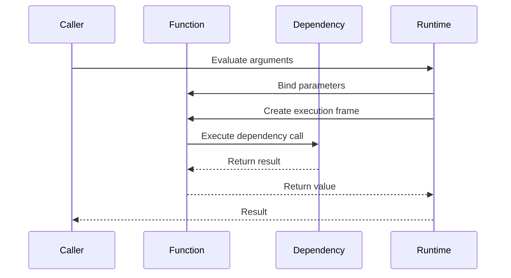

# 03- Functions and Scope

## Overview

Functions are one of Python's most important abstractions. They define reusable behavior, establish scope boundaries, enable dependency injection, support functional programming, and form the foundation for decorators, closures, generators, callbacks, and asynchronous programming.

For interviews, function questions often test more than syntax. They expose whether you understand:

- Python's name-binding model;
- argument evaluation;
- parameter semantics;
- default values;
- positional and keyword arguments;
- first-class functions;
- closures;
- lexical scope;
- `global` and `nonlocal`;
- recursion;
- decorators;
- generators;
- asynchronous functions;
- function object internals;
- performance and maintainability.

A useful mental model is:

```text
Function Definition
       │
       ▼
Function Object
       │
       ├── code object
       ├── globals reference
       ├── defaults
       ├── keyword defaults
       ├── annotations
       └── closure cells
       │
       ▼
Function Call
       │
       ▼
New Execution Frame
       │
       ├── local names
       ├── arguments
       └── execution state
       │
       ▼
Return / Exception
       │
       ▼
Frame released
```

---

## Function Definition

A function is created using `def`.

```python
def calculate_total(amount: Decimal, tax_rate: Decimal) -> Decimal:
    return amount + (amount * tax_rate)
```

The `def` statement creates a function object and binds it to the name `calculate_total`.

The function body does not execute when the function is defined.

```python
def process_order() -> None:
    print("processing")


print("before")
process_order()
print("after")
```

The body executes only when the function is called.

---

## Function Objects

Functions are objects in Python.

They can be:

- assigned to variables;
- passed as arguments;
- returned from functions;
- stored in collections;
- attached to classes;
- decorated;
- inspected.

```python
def normalize(value: str) -> str:
    return value.strip().lower()


processor = normalize

result = processor("  ACTIVE  ")
```

Both `normalize` and `processor` refer to the same function object.

This property is fundamental to callbacks, decorators, dependency injection, and higher-order functions.

---

## Function Identity

A function can be inspected like other Python objects.

```python
def process(value: int) -> int:
    return value * 2


print(process.__name__)
print(process.__module__)
print(process.__annotations__)
```

Other useful attributes include:

- `__defaults__`;
- `__kwdefaults__`;
- `__code__`;
- `__closure__`;
- `__dict__`.

These attributes are useful for debugging and introspection, but production code should generally depend on the documented function interface rather than implementation details.

---

## Calling a Function

A function call creates an execution context for the invocation.

```python
result = calculate_total(
    Decimal("100.00"),
    Decimal("0.18"),
)
```

Conceptually:

```text
Caller
  │
  ▼
Evaluate arguments
  │
  ▼
Bind parameters
  │
  ▼
Create execution frame
  │
  ▼
Execute function body
  │
  ├── return
  └── exception
```

The exact runtime implementation depends on the Python implementation, but CPython uses frames and code objects as important components of function execution.

---

## Argument Evaluation

Arguments are evaluated before the function body runs.

```python
def process(value: int) -> int:
    return value * 2


result = process(expensive_operation())
```

`expensive_operation()` executes before `process()` receives its argument.

This matters when arguments have:

- side effects;
- expensive computation;
- function calls;
- object construction;
- exceptions.

---

## Python's Argument Passing Model

Python is often described as using **call by sharing** or **object-reference semantics**.

The function receives a reference to the same object passed by the caller.

```python
def add_customer(customers: list[str]) -> None:
    customers.append("customer-1")


customers = []
add_customer(customers)

print(customers)
```

The list is mutated because both the caller and function reference the same object.

---

## Mutation vs Rebinding

Mutation changes an existing object.

Rebinding changes what a local name refers to.

```python
def mutate(items: list[int]) -> None:
    items.append(4)


def rebind(items: list[int]) -> None:
    items = [100, 200]
```

After:

```python
items = [1, 2, 3]

mutate(items)
print(items)
```

the caller sees the mutation.

After:

```python
items = [1, 2, 3]

rebind(items)
print(items)
```

the caller still has the original list.

This distinction is one of the most common Python interview topics.

---

## Positional Arguments

Arguments can be passed by position.

```python
def create_user(name: str, email: str) -> User:
    ...


user = create_user("Alice", "alice@example.com")
```

Positional arguments are concise but become harder to maintain when functions have many parameters.

Prefer keyword arguments when the meaning is not obvious.

```python
user = create_user(
    name="Alice",
    email="alice@example.com",
)
```

---

## Keyword Arguments

Keyword arguments explicitly bind values to parameter names.

```python
def connect(
    host: str,
    port: int,
    timeout: float,
) -> Connection:
    ...


connection = connect(
    host="db.internal",
    port=5432,
    timeout=5.0,
)
```

Keyword arguments improve readability and make call sites more resilient to parameter ordering.

---

## Positional-Only Parameters

Python supports positional-only parameters using `/`.

```python
def calculate(amount: Decimal, /, tax_rate: Decimal) -> Decimal:
    return amount + amount * tax_rate
```

`amount` must be supplied positionally:

```python
calculate(Decimal("100"), tax_rate=Decimal("0.18"))
```

but this is invalid:

```python
calculate(amount=Decimal("100"), tax_rate=Decimal("0.18"))
```

Positional-only parameters can be useful for APIs where parameter names should not become part of the public calling contract.

---

## Keyword-Only Parameters

Keyword-only parameters are defined after `*`.

```python
def fetch_customer(
    customer_id: str,
    *,
    include_orders: bool = False,
) -> Customer:
    ...
```

This requires:

```python
fetch_customer(
    "cust-123",
    include_orders=True,
)
```

This is rejected:

```python
fetch_customer("cust-123", True)
```

Keyword-only parameters are valuable for configuration flags because they make call sites self-documenting.

---

## Parameter Categories

A function can combine several parameter kinds.

```python
def request(
    path: str,
    /,
    *headers: str,
    timeout: float = 5.0,
    **options: object,
) -> Response:
    ...
```

The general ordering rules are:

```text
positional-only
        │
        ▼
positional-or-keyword
        │
        ▼
*
        │
        ▼
keyword-only
        │
        ▼
**
```

Real production functions should remain readable rather than exploiting every possible parameter feature.

---

## `*args`

`*args` collects additional positional arguments into a tuple.

```python
def log_values(*values: str) -> None:
    for value in values:
        logger.info("value=%s", value)
```

Calling:

```python
log_values("a", "b", "c")
```

produces a tuple-like collection of positional arguments.

Use `*args` when a genuinely variable number of positional arguments is part of the API.

Do not use it simply to avoid defining a clear function signature.

---

## `**kwargs`

`**kwargs` collects additional keyword arguments into a dictionary.

```python
def configure(**options: object) -> None:
    timeout = options.get("timeout", 5.0)
```

Calling:

```python
configure(timeout=10.0, retries=3)
```

makes those values available through `options`.

This is useful for extensible APIs and wrappers, but excessive use can weaken static analysis and make invalid configuration easier to pass silently.

---

## Argument Unpacking

Existing collections can be unpacked into calls.

```python
values = (100, 0.18)

total = calculate(*values)
```

Mappings can be unpacked with `**`.

```python
options = {
    "timeout": 5.0,
    "retries": 3,
}

client = create_client(**options)
```

The keys must correspond to accepted keyword parameters unless the target function accepts arbitrary keyword arguments.

---

## Default Arguments

Default values are evaluated when the function definition executes, not each time the function is called.

```python
def create_request(timeout: float = 5.0) -> Request:
    ...
```

The default object is associated with the function.

This is why mutable defaults are dangerous.

---

## Mutable Default Argument Trap

Avoid:

```python
def collect(value: str, values: list[str] = []) -> list[str]:
    values.append(value)
    return values
```

The same list can be reused across calls.

Prefer:

```python
def collect(
    value: str,
    values: list[str] | None = None,
) -> list[str]:
    if values is None:
        values = []

    values.append(value)
    return values
```

Alternatively, `default_factory` is appropriate for dataclasses.

---

## Default Arguments and Object Lifetime

Default objects are referenced by the function object.

```python
def process(config: dict[str, str] = {}):
    ...
```

The dictionary can remain alive as long as the function object retains it.

This illustrates a broader Python concept:

> Function definitions can retain references to objects beyond the original execution that created those objects.

---

## Evaluation Order

Python evaluates function arguments from left to right.

```python
def record(value: str) -> str:
    print(value)
    return value


result = combine(
    record("first"),
    record("second"),
)
```

The `"first"` expression is evaluated before `"second"`.

This matters when expressions have side effects or can raise exceptions.

---

## Return Values

A function can return any Python object.

```python
def get_customer(customer_id: str) -> Customer | None:
    ...
```

Returning multiple values:

```python
def parse_coordinates() -> tuple[float, float]:
    return 22.5726, 88.3639
```

is implemented through tuple packing.

The caller can unpack the result:

```python
latitude, longitude = parse_coordinates()
```

---

## `return` vs `None`

A function without an explicit return value returns `None`.

```python
def log_event(event: Event) -> None:
    logger.info("event=%s", event.id)
```

For functions whose purpose is side effects, explicitly annotating `-> None` makes the contract clearer.

---

## Early Returns

Early returns can reduce nesting.

```python
def authorize(user: User, resource: Resource) -> bool:
    if not user.is_active:
        return False

    if not user.has_permission(resource):
        return False

    return True
```

This is often easier to review than deeply nested conditionals.

---

## Functions and Side Effects

Functions can be roughly categorized as:

```text
Pure-ish function
    input → output

Side-effecting function
    input → external state change
```

Examples of side effects:

- database writes;
- network requests;
- logging;
- cache mutation;
- file writes;
- message publishing.

Separating pure transformations from side effects often improves testability and maintainability.

---

## First-Class Functions

Because functions are objects, they can be passed into other functions.

```python
def apply_transform(
    values: list[int],
    transform: Callable[[int], int],
) -> list[int]:
    return [transform(value) for value in values]
```

Usage:

```python
result = apply_transform(
    [1, 2, 3],
    lambda value: value * 10,
)
```

This is the foundation of higher-order functions and many functional programming patterns.

---

## Higher-Order Functions

A higher-order function either:

- accepts a function;
- returns a function;
- or both.

Example:

```python
def make_multiplier(factor: int):
    def multiply(value: int) -> int:
        return value * factor

    return multiply
```

Usage:

```python
double = make_multiplier(2)

print(double(10))
```

The returned function retains access to `factor`.

---

## Scope

Scope determines where a name can be resolved.

Python follows the **LEGB** lookup model:

```text
L → Local
E → Enclosing
G → Global
B → Built-in
```

When Python evaluates a name, it searches these namespaces according to the applicable scope rules.

---

## LEGB Example

```python
name = "global"


def outer():
    name = "enclosing"

    def inner():
        name = "local"
        return name

    return inner()
```

The result is:

```text
local
```

because the local binding takes precedence.

---

## Local Scope

Names assigned inside a function are local by default.

```python
name = "global"


def process() -> None:
    name = "local"
    print(name)


process()
print(name)
```

The function's `name` does not replace the module-level `name`.

---

## Why Python Treats Assigned Names as Local

Consider:

```python
count = 10


def increment():
    count = count + 1
```

Python treats `count` as a local variable because the function contains an assignment to `count`.

The right-hand side therefore attempts to read the uninitialized local variable.

This produces:

```text
UnboundLocalError
```

This behavior is a frequent interview trap.

---

## `global`

`global` tells Python that a name inside the function refers to the module-level binding.

```python
counter = 0


def increment() -> None:
    global counter
    counter += 1
```

This works, but mutable global state is usually a poor application design choice.

Prefer encapsulated state, dependency injection, or explicit state objects.

---

## `nonlocal`

`nonlocal` allows a nested function to modify a variable in its enclosing function scope.

```python
def make_counter():
    count = 0

    def increment():
        nonlocal count
        count += 1
        return count

    return increment
```

Usage:

```python
counter = make_counter()

print(counter())
print(counter())
```

The returned function retains the enclosing variable through a closure.

---

## Closures

A closure occurs when an inner function retains access to variables from an enclosing scope after the enclosing function has returned.

```text
make_counter()
      │
      ├── count = 0
      │
      ▼
returns increment
      │
      ▼
increment retains closure cell
      │
      ▼
count remains available
```

Closures are used in:

- decorators;
- callbacks;
- factories;
- configuration binding;
- encapsulated state.

---

## Closure Example

```python
def make_authorizer(required_role: str):
    def authorize(user: User) -> bool:
        return required_role in user.roles

    return authorize
```

The returned function retains `required_role`.

This is a clean way to create configured behavior without creating a class for every small case.

---

## Closure Cells

Python closures typically retain captured variables through closure cells.

You can inspect them:

```python
authorizer = make_authorizer("admin")

print(authorizer.__closure__)
```

A closure cell allows the nested function to access the variable even after the enclosing function's normal execution has completed.

This is an implementation detail worth understanding for interviews, but application code should rarely inspect closure internals.

---

## Late Binding

Closures capture variables rather than snapshots of their values.

Consider:

```python
functions = []

for multiplier in range(3):
    functions.append(
        lambda value: value * multiplier
    )
```

The lambdas reference the same loop variable.

A common fix is to bind the value through a default argument:

```python
functions = []

for multiplier in range(3):
    functions.append(
        lambda value, multiplier=multiplier: value * multiplier
    )
```

Alternatively, a nested factory function can make the binding explicit.

---

## Scope and Comprehensions

Python 3 comprehensions have their own iteration-variable scope.

```python
values = [value * 2 for value in range(3)]
```

The comprehension variable does not leak into the surrounding scope in the same way it did in Python 2.

This distinction occasionally appears in compatibility-oriented interview questions.

---

## Global Namespace

A module has a global namespace.

```python
DATABASE_URL = "postgresql://..."
```

Functions defined in that module can read the global name.

However, global configuration should generally be centralized and dependency injection should be preferred when it improves testability and explicitness.

---

## Built-in Scope

If a name is not found in local, enclosing, or global scope, Python may resolve it through built-ins.

```python
value = len(items)
```

`len` is normally found in the built-in namespace.

Shadowing built-ins is a common mistake:

```python
list = []
```

Now code in that scope may no longer be able to access the built-in `list` name normally.

Avoid names such as:

- `list`;
- `dict`;
- `set`;
- `str`;
- `id`;
- `input`;
- `type`.

---

## Namespace vs Scope

A namespace is a mapping from names to objects.

A scope determines where Python looks for a name.

They are related but not identical concepts.

Examples of namespaces include:

- module namespace;
- function local namespace;
- class namespace;
- built-in namespace.

Understanding this distinction helps explain imports, closures, classes, and name resolution.

---

## Function Scope vs Class Scope

Class bodies execute in their own namespace, but methods do not automatically use the class namespace as an enclosing lexical scope.

```python
class Service:
    name = "service"

    def process(self):
        return name
```

The method does not resolve `name` directly from the class namespace.

Use:

```python
return self.name
```

or:

```python
return Service.name
```

This is an important interview distinction between class attributes and lexical closure scope.

---

## Recursion

A recursive function calls itself.

```python
def factorial(value: int) -> int:
    if value <= 1:
        return 1

    return value * factorial(value - 1)
```

Recursion can express naturally recursive structures such as:

- trees;
- nested data;
- graph traversal;
- parsers.

However, Python does not generally optimize tail recursion, and recursion depth is limited.

For deeply nested production data, an iterative implementation may be safer.

---

## Recursion and Stack Frames

Each recursive call creates another execution frame.

```text
factorial(4)
    │
    └── factorial(3)
          │
          └── factorial(2)
                │
                └── factorial(1)
```

Deep recursion can therefore consume significant stack space and eventually raise `RecursionError`.

Do not increase Python's recursion limit merely to hide an algorithmic problem without understanding the consequences.

---

## Function Annotations

Type annotations improve readability and static analysis.

```python
def get_customer(
    customer_id: str,
) -> Customer | None:
    ...
```

Annotations are generally not runtime enforcement.

A caller can still pass an incorrect runtime value unless explicit validation exists.

Use:

- mypy;
- Pyright;
- runtime validation frameworks such as Pydantic where appropriate.

---

## Callable Types

The type system can describe functions.

```python
from collections.abc import Callable

Processor = Callable[[str], str]
```

A dependency can then be represented as:

```python
def process(
    value: str,
    normalizer: Processor,
) -> str:
    return normalizer(value)
```

For richer interfaces, protocols are often preferable to deeply nested `Callable` types.

---

## Dependency Injection Through Functions

Functions can provide simple dependency injection.

```python
def create_order(
    repository: OrderRepository,
    publisher: EventPublisher,
    order: Order,
) -> None:
    repository.save(order)
    publisher.publish(OrderCreated(order.id))
```

Testing becomes easier because dependencies can be replaced with fakes or mocks.

```text
Production
    │
    ├── PostgreSQL repository
    └── Kafka publisher

Test
    │
    ├── In-memory repository
    └── Fake publisher
```

Explicit dependencies are usually preferable to hidden globals.

---

## Functions in FastAPI

FastAPI heavily uses functions as request handlers and dependency providers.

```python
from fastapi import APIRouter, Depends

router = APIRouter()


@router.get("/customers/{customer_id}")
async def get_customer(
    customer_id: str,
    service: CustomerService = Depends(get_customer_service),
) -> CustomerResponse:
    customer = await service.get(customer_id)
    return CustomerResponse.from_domain(customer)
```

The function signature participates in:

- routing;
- dependency injection;
- validation;
- serialization.

This demonstrates how Python function semantics become part of a framework's architecture.

---

## Async Functions

An `async def` function returns a coroutine object when called.

```python
async def fetch_customer(
    client: HTTPClient,
    customer_id: str,
) -> Customer:
    response = await client.get(
        f"/customers/{customer_id}"
    )
    return response
```

Calling:

```python
result = fetch_customer(client, "cust-1")
```

does not execute the function body to completion.

The coroutine must be awaited or scheduled.

```python
customer = await fetch_customer(client, "cust-1")
```

---

## Async Function Lifecycle

```text
async def function
        │
        ▼
Call
        │
        ▼
Coroutine object
        │
        ▼
await / schedule
        │
        ▼
Event loop executes
        │
        ├── await I/O
        │       │
        │       ▼
        │   other tasks run
        │
        ▼
Completion
```

A common interview trap is assuming `async def` automatically makes all internal operations non-blocking.

It does not.

---

## Blocking Inside Async Functions

This is problematic:

```python
async def handler() -> Response:
    result = requests.get(url)
    return Response(result.text)
```

A blocking HTTP call can stall the event loop.

Use an asynchronous client or explicitly isolate blocking work in an appropriate executor when necessary.

---

## Generator Functions

A function containing `yield` is a generator function.

```python
def stream_customer_ids(
    customers: Iterable[Customer],
) -> Iterator[str]:
    for customer in customers:
        yield customer.id
```

Calling it produces a generator rather than executing the complete loop immediately.

This is useful for:

- streaming;
- large files;
- database results;
- pipelines;
- memory-efficient processing.

---

## Generator vs Normal Function

| Property | Normal function | Generator function |
|---|---|---|
| Keyword | `return` | `yield` |
| Execution | Runs when called | Runs as iterated |
| Result | Returned value | Generator iterator |
| Memory | May materialize result | Lazy |
| Reusable iteration | Depends on result | Usually single-pass |
| Useful for | Direct computation | Streaming pipelines |

---

## Decorators

Decorators are built on functions, closures, and callable objects.

```python
from functools import wraps


def log_execution(func):
    @wraps(func)
    def wrapper(*args, **kwargs):
        logger.info("function=%s", func.__name__)
        return func(*args, **kwargs)

    return wrapper
```

Usage:

```python
@log_execution
def process_order(order: Order) -> None:
    ...
```

Conceptually:

```text
process_order
     │
     ▼
decorator
     │
     ▼
wrapper
     │
     ▼
original function
```

---

## `functools.wraps`

Always use `functools.wraps` when writing a normal decorator wrapper.

Without it, metadata such as:

- `__name__`;
- `__doc__`;
- `__module__`;

can be replaced by the wrapper's metadata.

Frameworks and debugging tools can depend on function metadata, so preserving it is important.

---

## Async Decorators

A synchronous wrapper cannot blindly wrap an async function.

For an async callable:

```python
from functools import wraps


def trace(func):
    @wraps(func)
    async def wrapper(*args, **kwargs):
        logger.info("calling=%s", func.__name__)
        return await func(*args, **kwargs)

    return wrapper
```

Decorator behavior must match the execution model of the wrapped function.

---

## Decorator Ordering

Multiple decorators are applied from the bottom upward.

```python
@outer
@inner
def process():
    ...
```

is conceptually:

```python
process = outer(inner(process))
```

Order matters when decorators perform:

- authorization;
- retries;
- caching;
- transactions;
- tracing;
- metrics.

---

## Function Factories

A function can return another configured function.

```python
def make_prefixer(prefix: str):
    def prefix(value: str) -> str:
        return f"{prefix}{value}"

    return prefix
```

This is useful when behavior varies by configuration but does not require a full object abstraction.

---

## `lambda`

A lambda creates an anonymous function expression.

```python
customers.sort(
    key=lambda customer: customer.created_at
)
```

Use lambdas for short expressions.

Avoid complex lambda logic. If the behavior needs multiple statements, validation, logging, or meaningful naming, use `def`.

---

## Function Signatures

Python allows signatures to communicate API contracts.

```python
def publish_event(
    event: Event,
    *,
    partition_key: str | None = None,
    timeout: float = 5.0,
) -> None:
    ...
```

A well-designed signature makes invalid or ambiguous usage harder.

For public libraries and internal platform APIs, parameter naming and keyword-only arguments can provide long-term compatibility benefits.

---

## Function Design Principles

Prefer functions that:

- have a clear responsibility;
- expose explicit dependencies;
- have predictable side effects;
- use meaningful names;
- have stable contracts;
- are easy to test;
- avoid excessive parameter counts.

Avoid functions that:

- mutate unrelated global state;
- perform hidden network calls;
- mix validation, persistence, and serialization unnecessarily;
- accept unrestricted `**kwargs`;
- contain deeply nested business logic;
- require callers to understand implementation details.

---

## Too Many Parameters

A function such as:

```python
def create_report(
    user,
    database,
    cache,
    formatter,
    timeout,
    retries,
    region,
    include_metadata,
    include_history,
    output_format,
):
    ...
```

may indicate that responsibilities or configuration boundaries are poorly modeled.

Possible improvements include:

- configuration objects;
- domain models;
- dependency injection;
- service classes;
- smaller functions.

Do not blindly collapse parameters into `**kwargs`; that often hides the underlying design problem.

---

## Function Purity and Testability

Pure functions are easier to test.

```python
def calculate_total(
    amount: Decimal,
    tax_rate: Decimal,
) -> Decimal:
    return amount + amount * tax_rate
```

The output depends only on inputs.

A function that directly reads:

```text
database
environment
clock
network
global cache
```

has more hidden dependencies.

A practical backend architecture often separates:

```text
Pure business logic
        │
        ▼
Explicit side-effect boundaries
        │
        ├── PostgreSQL
        ├── Redis
        ├── Kafka
        └── HTTP
```

---

## Function Scope and Security

Scope mistakes can become security problems when sensitive state is unintentionally shared.

Avoid module-level mutable state such as:

```python
current_user = None
```

in a web application.

Concurrent requests can interact with shared state unexpectedly.

Prefer request-scoped dependencies and explicit context propagation.

---

## Functions and Thread Safety

A function is not thread-safe merely because it is a function.

Consider:

```python
cache = {}


def get_value(key: str):
    if key not in cache:
        cache[key] = load_value(key)

    return cache[key]
```

Concurrent callers can race around the check-and-set sequence.

Thread safety depends on:

- shared state;
- synchronization;
- atomicity;
- underlying data structures;
- execution model.

---

## Functions and Process Isolation

In a multi-process deployment:

```text
Worker A → global dictionary A
Worker B → global dictionary B
Worker C → global dictionary C
```

A function modifying a module-level cache in Worker A does not update Worker B's cache.

This matters for:

- Gunicorn workers;
- Kubernetes replicas;
- Celery workers;
- ECS tasks.

Use shared infrastructure for state that must cross process boundaries.

---

## Functions and Transactions

A function that manages a transaction should have clear ownership.

```python
def create_order(
    repository: OrderRepository,
    payment_service: PaymentService,
) -> Order:
    with repository.transaction():
        order = repository.create(...)
        payment_service.authorize(order)

        return order
```

In production systems, transaction boundaries should be explicit and aligned with consistency requirements.

Do not hide transaction management across unrelated layers without a clear ownership model.

---

## Functions and Retries

Retries should normally live at the boundary where retryability is understood.

Avoid blindly decorating every function with retries.

A retry policy should consider:

- exception type;
- timeout;
- maximum attempts;
- backoff;
- jitter;
- idempotency;
- downstream behavior.

For example, retrying a database read may be reasonable in some circumstances, while blindly retrying a payment side effect may create duplicate effects.

---

## Function Performance

Function calls have overhead, but application performance is usually dominated by higher-level operations such as:

- database queries;
- network requests;
- serialization;
- external APIs;
- large Python loops.

Do not sacrifice maintainability for insignificant function-call micro-optimizations without measurement.

Use profiling when performance actually matters.

---

## Closures and Memory

Closures retain references to captured objects.

```python
def create_processor(large_configuration):
    def process(value):
        return transform(value, large_configuration)

    return process
```

As long as the returned function remains reachable, the captured configuration may remain reachable too.

For large objects, long-lived closures can therefore contribute to memory retention.

---

## Function References and Garbage Collection

Functions can hold references to:

- defaults;
- closures;
- globals;
- annotations;
- arbitrary attributes.

Long-lived function objects can therefore participate in object-reference graphs.

This becomes relevant when dynamically generating many functions or closures in long-running processes.

---

## Common Mistakes

### Mutable Defaults

```python
def f(items=[]):
    ...
```

Use `None` and initialize inside the function.

### Excessive `global`

Global mutable state makes testing and concurrency harder.

### Shadowing Built-ins

Avoid:

```python
list = []
id = 10
```

### Overusing `*args` and `**kwargs`

Flexible signatures can hide errors and weaken contracts.

### Ignoring Keyword-Only Parameters

Configuration-heavy functions are often clearer with keyword-only arguments.

### Blocking Inside Async Functions

A synchronous blocking call can stall the event loop.

### Missing `functools.wraps`

Decorators can destroy useful function metadata.

### Deeply Nested Functions

Closures are powerful but can become difficult to reason about when nesting is excessive.

### Overusing Lambdas

Complex anonymous functions reduce readability and debuggability.

---

## Interview Traps

### Are Arguments Passed by Reference?

The precise answer is that Python uses object-reference semantics, often described as call by sharing.

Objects are passed by sharing references; rebinding a parameter does not rebind the caller's name, while mutation of a shared mutable object is visible to the caller.

### When Are Default Arguments Evaluated?

At function definition time.

### Why Does This Fail?

```python
x = 10

def f():
    x += 1
```

Because assignment makes `x` local to `f`, so the right-hand side attempts to read the uninitialized local binding.

### What Is LEGB?

Python's name-resolution model:

```text
Local
Enclosing
Global
Built-in
```

### What Does `nonlocal` Do?

It allows a nested function to rebind a name from an enclosing function scope.

### What Is a Closure?

A function that retains access to variables from an enclosing lexical scope.

### Does `async def` Execute Immediately?

Calling it creates a coroutine object. Execution proceeds when the coroutine is awaited or otherwise scheduled.

### What Does `yield` Do?

It turns a function into a generator function and allows execution to suspend and resume during iteration.

### Why Use `functools.wraps`?

To preserve useful metadata from the wrapped function.

### Why Can Global State Be Dangerous in Web Applications?

Because multiple requests, threads, processes, and replicas can have different or concurrently accessed state.

---

## Senior-Level Interview Questions

### How Would You Design a Function with Many Optional Behaviors?

Start with a clear signature.

Consider:

- keyword-only parameters;
- configuration objects;
- domain models;
- separate responsibilities;
- dependency injection.

Do not automatically convert everything into `**kwargs`.

### When Would You Use a Closure Instead of a Class?

Use a closure when the abstraction is small, behavior-oriented, and naturally captures a limited amount of configuration or state.

Use a class when the state and behavior become substantial or need multiple operations, explicit lifecycle, inheritance, or a richer interface.

### How Does Function Scope Affect Concurrency?

Local variables are associated with individual function invocations, while module-level mutable state may be shared within a process.

Thread safety depends primarily on shared mutable state and synchronization, not simply on whether code appears inside a function.

### How Would You Make a Function Easy to Test?

Prefer:

```text
Explicit inputs
    │
    ▼
Deterministic transformation
    │
    ▼
Explicit outputs
```

Inject external dependencies such as:

- repositories;
- HTTP clients;
- clocks;
- publishers;
- caches.

Keep side effects at explicit boundaries.

### How Would You Review a Function in Production Code?

Check:

- API clarity;
- parameter design;
- type annotations;
- side effects;
- error handling;
- dependency ownership;
- transaction boundaries;
- concurrency behavior;
- performance;
- observability;
- testability;
- security implications.

---

## Practical Review Checklist

Before approving a function, ask:

- [ ] Does it have one clear responsibility?
- [ ] Are dependencies explicit?
- [ ] Are parameters meaningful?
- [ ] Should any parameters be keyword-only?
- [ ] Are defaults immutable or safely initialized?
- [ ] Are side effects obvious?
- [ ] Is mutation intentional?
- [ ] Are exceptions handled at the correct boundary?
- [ ] Is the function safe under concurrency?
- [ ] Does async code avoid blocking operations?
- [ ] Is the return contract clear?
- [ ] Are type annotations useful?
- [ ] Is the function testable?
- [ ] Is performance measured before optimization?
- [ ] Could captured state create unexpected object retention?

---

## Function Selection Guide

| Requirement | Recommended approach |
|---|---|
| Simple reusable behavior | Normal function |
| Small configured behavior | Closure/function factory |
| Behavior passed into another function | Callable |
| Cross-cutting behavior | Decorator |
| Lazy sequence | Generator |
| Async I/O | `async def` |
| Small one-expression callback | `lambda` |
| Stateful multi-operation abstraction | Class |
| External dependency | Explicit parameter / DI |
| Configuration-heavy API | Keyword-only parameters |
| Public API with stable positional semantics | Consider positional-only parameters |

---

## Function Execution Mental Model

A useful interview model is:



For asynchronous functions, dependency calls may suspend at `await`, allowing the event loop to execute other ready tasks.

---

## Production Function Architecture

A maintainable backend often separates function responsibilities:

```text
HTTP Handler
    │
    ▼
Validation / DTO
    │
    ▼
Application Function
    │
    ├── Domain Functions
    │       │
    │       └── Pure business rules
    │
    ├── Repository Functions
    │       │
    │       └── PostgreSQL
    │
    ├── Cache Functions
    │       │
    │       └── Redis
    │
    └── Publisher Functions
            │
            └── Kafka / Queue
```

This separation makes behavior easier to test and allows infrastructure dependencies to evolve without rewriting business logic.

---

## Key Takeaways

- **Python functions are first-class objects:** they can be passed, returned, stored, decorated, and inspected, forming the foundation for callbacks, dependency injection, closures, and decorators.
- **Understand name binding precisely:** Python uses local, enclosing, global, and built-in scopes; mutation of a shared object differs fundamentally from rebinding a local parameter.
- **Design function signatures as contracts:** use type annotations, keyword-only parameters, sensible defaults, and explicit dependencies to improve readability, correctness, and maintainability.
- **Async, generators, closures, and decorators change function execution semantics:** understand coroutine creation, lazy execution, captured state, wrapper behavior, and resource lifetimes rather than treating them as syntax features.
- **Production-quality functions make side effects and ownership explicit:** isolate business logic from databases, caches, messaging, and network calls, and consider concurrency, retries, observability, security, and testability at the function boundary.