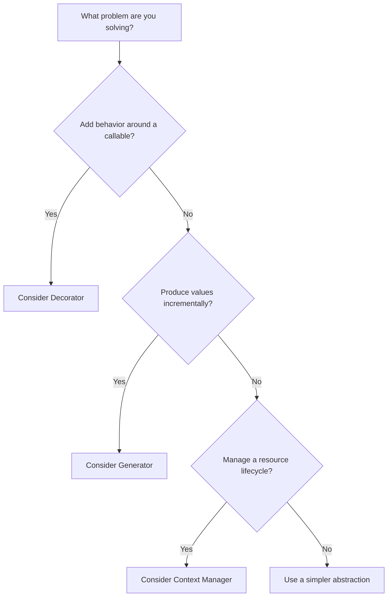

# 05- Decorators and Generators

## Overview

Decorators and generators are two of Python's most important higher-level language features.

They are frequently tested in interviews because they require understanding several underlying concepts at once:

- functions as first-class objects;
- closures;
- lexical scope;
- function metadata;
- lazy evaluation;
- iterator protocols;
- execution state;
- resource lifetimes;
- synchronous vs asynchronous execution.

They also have direct backend applications.

Decorators commonly implement:

- authentication and authorization;
- logging;
- metrics;
- tracing;
- retries;
- caching;
- transaction boundaries;
- request validation.

Generators commonly implement:

- streaming;
- large-file processing;
- database result processing;
- ETL pipelines;
- pagination;
- lazy transformations;
- memory-efficient data processing.

A useful mental model is:

```text
Decorators
    Function
       │
       ▼
   Wrapper
       │
       ▼
Additional behavior
       │
       ▼
Original function


Generators
    Data source
       │
       ▼
   Generator
       │
       ├── yield
       ├── suspend
       ├── resume
       └── yield
       │
       ▼
Consumer
```

---

## Decorators

A decorator is a callable that receives another callable and returns a callable with modified or extended behavior.

```python
def decorator(function):
    def wrapper(*args, **kwargs):
        return function(*args, **kwargs)

    return wrapper
```

The `@` syntax is syntactic sugar.

```python
@decorator
def process():
    ...
```

is approximately equivalent to:

```python
def process():
    ...


process = decorator(process)
```

The decoration happens when the `def` statement is executed, not each time `process()` is called.

---

## Why Decorators Exist

Decorators allow cross-cutting behavior to be applied without duplicating that behavior inside every function.

Without a decorator:

```python
def create_order():
    authenticate()
    log_request()
    record_metrics()
    ...


def cancel_order():
    authenticate()
    log_request()
    record_metrics()
    ...
```

With a decorator:

```python
@authenticated
@logged
@measured
def create_order():
    ...


@authenticated
@logged
@measured
def cancel_order():
    ...
```

This is useful when the behavior is genuinely cross-cutting and consistent.

---

## Decorator Execution Model

```text
Module loading
      │
      ▼
Define function
      │
      ▼
Call decorator
      │
      ▼
Receive original function
      │
      ▼
Return wrapper
      │
      ▼
Bind wrapper to function name
      │
      ▼
Later function call
      │
      ▼
Execute wrapper
      │
      ▼
Execute original function
```

This distinction is important for understanding decorator state, initialization, and configuration.

---

## Basic Decorator

```python
from collections.abc import Callable
from functools import wraps
from typing import Any


def log_execution(
    function: Callable[..., Any],
) -> Callable[..., Any]:
    @wraps(function)
    def wrapper(*args: Any, **kwargs: Any) -> Any:
        logger.info("calling=%s", function.__name__)
        return function(*args, **kwargs)

    return wrapper
```

Usage:

```python
@log_execution
def create_order(order: Order) -> Order:
    return order_service.create(order)
```

The wrapper adds behavior around the original function.

---

## Closures and Decorators

Decorators commonly rely on closures.

```python
def prefix(prefix_value: str):
    def decorator(function):
        def wrapper(value: str):
            return prefix_value + function(value)

        return wrapper

    return decorator
```

The wrapper retains access to `prefix_value`.

Conceptually:

```text
prefix_value
     │
     ▼
decorator closure
     │
     ▼
wrapper
     │
     ▼
original function
```

This allows parameterized decorators to retain configuration.

---

## `functools.wraps`

When writing a decorator wrapper, use `functools.wraps`.

```python
from functools import wraps


def log_execution(function):
    @wraps(function)
    def wrapper(*args, **kwargs):
        logger.info("function=%s", function.__name__)
        return function(*args, **kwargs)

    return wrapper
```

Without `wraps`, the decorated function may appear to have the wrapper's:

- name;
- documentation;
- module;
- metadata.

This can affect:

- debugging;
- stack traces;
- documentation generation;
- framework introspection;
- testing.

`wraps` also updates the wrapper's `__wrapped__` reference, which supports introspection and tools that need access to the original callable.

---

## Parameterized Decorators

A parameterized decorator requires an additional function layer.

```python
from functools import wraps


def retry(max_attempts: int):
    def decorator(function):
        @wraps(function)
        def wrapper(*args, **kwargs):
            for attempt in range(max_attempts):
                try:
                    return function(*args, **kwargs)
                except TemporaryError:
                    if attempt == max_attempts - 1:
                        raise

        return wrapper

    return decorator
```

Usage:

```python
@retry(max_attempts=3)
def fetch_customer(customer_id: str) -> Customer:
    ...
```

The structure is:

```text
retry(3)
   │
   ▼
decorator
   │
   ▼
wrapper
   │
   ▼
fetch_customer
```

---

## Decorator Factory

A parameterized decorator is often called a decorator factory because it creates a decorator.

```python
def require_role(role: str):
    def decorator(function):
        @wraps(function)
        def wrapper(user: User, *args, **kwargs):
            if role not in user.roles:
                raise PermissionError("Insufficient permissions")

            return function(user, *args, **kwargs)

        return wrapper

    return decorator
```

Usage:

```python
@require_role("admin")
def delete_customer(user: User, customer_id: str) -> None:
    ...
```

---

## Decorator Ordering

Multiple decorators are applied from the bottom upward.

```python
@outer
@inner
def process():
    ...
```

is equivalent to:

```python
process = outer(inner(process))
```

At runtime, the outer wrapper receives the result of the inner decoration.

Ordering matters when decorators implement:

- authentication;
- authorization;
- transactions;
- caching;
- retries;
- tracing;
- metrics.

---

## Decorator Ordering Example

Consider:

```python
@cache
@retry(max_attempts=3)
def fetch_customer(customer_id: str):
    ...
```

This means:

```text
cache(
    retry(fetch_customer)
)
```

A cache hit can therefore avoid entering the retry wrapper.

Reversing the decorators changes the behavior:

```python
@retry(max_attempts=3)
@cache
def fetch_customer(customer_id: str):
    ...
```

The retry layer now surrounds the cache layer.

When decorator behavior interacts, explicitly document the intended ordering.

---

## Function Metadata

Decorators can unintentionally change metadata.

Without:

```python
@wraps(function)
```

this:

```python
@decorator
def process():
    ...
```

may expose the wrapper's name instead of `process`.

With `wraps`, introspection is much more accurate.

This is particularly important in frameworks that inspect function signatures or annotations.

---

## Preserving Signatures

`functools.wraps` preserves metadata but does not magically make the wrapper's Python signature identical to the wrapped function's runtime signature.

A wrapper using:

```python
def wrapper(*args, **kwargs):
    ...
```

still has a generic implementation signature.

Frameworks may use `inspect.signature()` and follow `__wrapped__`, but custom decorators should still be designed carefully when framework introspection matters.

---

## Decorators and FastAPI

FastAPI relies heavily on function metadata and signatures for:

- routing;
- dependency injection;
- request parameter extraction;
- validation;
- OpenAPI generation.

A poorly designed decorator can interfere with framework behavior.

For FastAPI-specific concerns, dependency injection is often preferable to wrapping route functions for request concerns that FastAPI already models explicitly.

For example:

```python
@router.get("/customers/{customer_id}")
async def get_customer(
    customer_id: str,
    service: CustomerService = Depends(get_customer_service),
):
    return await service.get(customer_id)
```

Use framework-native mechanisms where they provide a clearer contract.

---

## Authentication and Authorization Decorators

Decorators can be appropriate for application-level cross-cutting checks.

```python
def require_admin(function):
    @wraps(function)
    def wrapper(user: User, *args, **kwargs):
        if "admin" not in user.roles:
            raise PermissionError("Admin role required")

        return function(user, *args, **kwargs)

    return wrapper
```

However, authorization should remain explicit enough that reviewers can understand which operations are protected.

Do not rely on a decorator as the only defense against authorization mistakes when the framework provides stronger policy mechanisms.

---

## Logging Decorators

A logging decorator can capture function-level behavior.

```python
from functools import wraps


def log_execution(function):
    @wraps(function)
    def wrapper(*args, **kwargs):
        start = time.monotonic()

        try:
            return function(*args, **kwargs)
        finally:
            elapsed = time.monotonic() - start
            logger.info(
                "function=%s duration_seconds=%.3f",
                function.__name__,
                elapsed,
            )

    return wrapper
```

Production logging should avoid:

- passwords;
- access tokens;
- authorization headers;
- sensitive request bodies;
- unnecessary personal data.

---

## Metrics Decorators

Decorators can centralize latency and success/failure metrics.

```python
from functools import wraps


def measured(function):
    @wraps(function)
    def wrapper(*args, **kwargs):
        start = time.monotonic()

        try:
            result = function(*args, **kwargs)
            metrics.increment(
                "operation.success",
                operation=function.__name__,
            )
            return result
        except Exception:
            metrics.increment(
                "operation.failure",
                operation=function.__name__,
            )
            raise
        finally:
            metrics.observe(
                "operation.duration_seconds",
                time.monotonic() - start,
                operation=function.__name__,
            )

    return wrapper
```

Be careful with metric label cardinality. Do not use arbitrary user IDs, request IDs, or unbounded values as metric labels.

---

## Retry Decorators

Retry decorators can be useful for clearly transient operations.

However, a generic decorator can be dangerous.

This is risky:

```python
@retry(max_attempts=5)
def charge_credit_card():
    ...
```

If the operation partially succeeds before raising an exception, retrying can create duplicate side effects.

Before retrying, evaluate:

- idempotency;
- exception type;
- timeout semantics;
- backoff;
- jitter;
- maximum attempts;
- downstream behavior.

---

## Caching Decorators

Caching decorators can be useful for deterministic, read-heavy functions.

```python
from functools import lru_cache


@lru_cache(maxsize=1024)
def normalize_region(region: str) -> str:
    return region.strip().lower()
```

This is suitable for process-local pure computations.

It is not automatically appropriate for:

- database-backed state;
- multi-process caches;
- distributed services;
- data requiring immediate invalidation.

For shared application caching, Redis may be more appropriate.

---

## Decorator State

Decorators can retain state through closures.

```python
def counter():
    count = 0

    def decorator(function):
        nonlocal count

        @wraps(function)
        def wrapper(*args, **kwargs):
            nonlocal count
            count += 1
            return function(*args, **kwargs)

        return wrapper

    return decorator
```

This state belongs to the decorated function within that process.

It is not automatically:

- thread-safe;
- process-shared;
- replica-shared;
- durable.

Do not use closure state as a distributed counter.

---

## Thread Safety of Decorators

A decorator can introduce shared mutable state.

```python
def count_calls(function):
    count = 0

    @wraps(function)
    def wrapper(*args, **kwargs):
        nonlocal count
        count += 1
        return function(*args, **kwargs)

    return wrapper
```

Concurrent calls can race depending on the execution model and synchronization requirements.

If state must be shared safely, use an appropriate synchronization mechanism or external state store.

---

## Async Decorators

Async functions require async-aware wrappers.

```python
from collections.abc import Awaitable, Callable
from functools import wraps
from typing import Any


def trace_async(function):
    @wraps(function)
    async def wrapper(*args: Any, **kwargs: Any) -> Any:
        logger.info("start=%s", function.__name__)

        try:
            return await function(*args, **kwargs)
        finally:
            logger.info("end=%s", function.__name__)

    return wrapper
```

A synchronous wrapper that simply calls an async function returns a coroutine rather than awaiting it.

---

## Sync and Async Decorator Design

When a library needs to support both synchronous and asynchronous callables, do not assume one wrapper implementation works correctly for both.

A design may:

- provide separate decorators;
- inspect whether the callable is async;
- use a framework/library abstraction designed for both.

The important requirement is preserving the correct execution semantics.

---

## Async Decorator Pitfall

Incorrect:

```python
def trace(function):
    @wraps(function)
    def wrapper(*args, **kwargs):
        logger.info("calling")
        return function(*args, **kwargs)

    return wrapper
```

For an async function, this wrapper returns the coroutine object without awaiting it.

Correct async wrapper:

```python
def trace(function):
    @wraps(function)
    async def wrapper(*args, **kwargs):
        logger.info("calling")
        return await function(*args, **kwargs)

    return wrapper
```

---

## Context Managers vs Decorators

Some concerns can be implemented using either abstraction.

| Requirement | Decorator | Context manager |
|---|---|---|
| Wrap function execution | Excellent | Possible |
| Explicit resource scope | Less natural | Excellent |
| Transaction boundary | Possible | Excellent |
| Timing operation | Excellent | Excellent |
| Lock acquisition | Possible | Excellent |
| Request middleware | Often framework-specific | Less common |
| Reusable cross-cutting behavior | Excellent | Possible |

Use the abstraction that best communicates ownership and lifecycle.

---

# Generators

A generator is an iterator produced by a generator function or generator expression.

A generator function contains `yield`.

```python
def generate_ids(items):
    for item in items:
        yield item.id
```

Calling:

```python
generator = generate_ids(items)
```

creates a generator object.

The function body does not execute through the loop immediately.

---

## Generator Execution

```text
Call generator function
        │
        ▼
Generator object
        │
        ▼
next()
        │
        ▼
Execute until yield
        │
        ▼
Return yielded value
        │
        ▼
Suspend execution
        │
        ▼
next()
        │
        ▼
Resume after yield
```

This suspended execution state is the defining feature of generators.

---

## `yield` vs `return`

`return` completes a normal function.

`yield` suspends a generator.

```python
def generate():
    yield 1
    yield 2
    yield 3
```

The generator retains enough execution state to resume from the point following each `yield`.

---

## Generator Object

A generator is both:

- an iterator;
- an iterable.

Therefore:

```python
generator = generate()

iterator = iter(generator)

assert iterator is generator
```

It supports the iterator protocol through operations such as `next()`.

---

## Generator Exhaustion

Generators are generally single-pass.

```python
generator = generate()

print(list(generator))
print(list(generator))
```

The first conversion consumes the generator.

The second conversion produces no values.

Conceptually:

```text
Generator
   │
   ├── value 1
   ├── value 2
   ├── value 3
   └── exhausted
```

If repeated iteration is required, use a reusable iterable or recreate the generator.

---

## `StopIteration`

When a generator finishes, iteration ends through `StopIteration`.

```python
generator = generate()

next(generator)
next(generator)
next(generator)

next(generator)
```

The final `next()` raises `StopIteration`.

A `for` loop handles this protocol automatically.

---

## Generator Return Values

A generator can return a final value.

```python
def process():
    yield "started"
    return "completed"
```

The returned value becomes the `value` attribute of the resulting `StopIteration` when the generator is exhausted.

In ordinary application code, this feature is less common than yielding values.

---

## Generator Expressions

Generator expressions provide compact lazy iteration.

```python
active_ids = (
    customer.id
    for customer in customers
    if customer.active
)
```

Compare:

```python
active_ids = [
    customer.id
    for customer in customers
    if customer.active
]
```

The list comprehension materializes the result.

The generator expression computes values lazily.

---

## Generator vs List

| Property | List | Generator |
|---|---|---|
| Evaluation | Eager | Lazy |
| Memory | Stores results | Stores execution state |
| Reusable | Yes | Usually no |
| Random access | Yes | No |
| Streaming | Less natural | Excellent |
| Debugging | Simple | Can require lifecycle awareness |
| Execution timing | Immediate | During iteration |

Generators are not inherently faster. Their primary advantage is deferred computation and reduced materialization.

---

## Lazy Evaluation

Generators defer work until values are requested.

```python
def process_records(records):
    for record in records:
        yield transform(record)
```

Nothing is transformed until the consumer requests values.

This enables pipeline-style processing.

```text
Source
  │
  ▼
Generator A
  │
  ▼
Generator B
  │
  ▼
Generator C
  │
  ▼
Consumer
```

---

## Generator Pipelines

```python
def read_records(source):
    for record in source:
        yield record


def filter_active(records):
    for record in records:
        if record["active"]:
            yield record


def extract_ids(records):
    for record in records:
        yield record["id"]


pipeline = extract_ids(
    filter_active(
        read_records(source)
    )
)
```

The pipeline can process one item at a time rather than materializing every intermediate result.

---

## Memory Efficiency

Consider:

```python
def process_large_dataset(records):
    results = [
        transform(record)
        for record in records
    ]

    return results
```

This stores all transformed results.

A generator:

```python
def process_large_dataset(records):
    for record in records:
        yield transform(record)
```

allows the consumer to control materialization.

This is particularly useful when processing:

- large files;
- database result sets;
- API pagination;
- ETL workloads;
- message streams.

---

## Generator Memory Model

A generator does not eliminate memory usage.

It still retains:

- its execution state;
- local variables;
- references to captured objects;
- underlying iterators.

For example, if a generator holds a reference to a large object, that object may remain alive while the generator remains reachable.

Therefore, lazy evaluation can reduce peak memory while potentially extending object or resource lifetimes.

---

## File Streaming

Generators are useful for large text files.

```python
from collections.abc import Iterator
from pathlib import Path


def read_non_empty_lines(path: Path) -> Iterator[str]:
    with path.open("rt", encoding="utf-8") as file:
        for line in file:
            line = line.strip()

            if line:
                yield line
```

The file is processed incrementally.

The context manager ensures the file is closed when generator execution is finalized through normal iteration or generator cleanup.

However, consumers should avoid retaining the generator indefinitely if it owns scarce resources.

---

## Database Streaming

Database drivers and ORMs often provide mechanisms for iterating results without loading the complete dataset into application memory.

A generator can provide a clean application-level interface:

```python
def stream_customers(
    repository: CustomerRepository,
) -> Iterator[Customer]:
    yield from repository.iter_customers()
```

Production considerations include:

- cursor lifetime;
- transaction lifetime;
- connection pooling;
- network failures;
- consumer speed;
- backpressure;
- cancellation.

Do not assume that a generator automatically makes database access memory-free or connection-safe.

---

## API Streaming

Generators can support streaming responses in web frameworks.

Conceptually:

```text
Client
  │
  ▼
HTTP connection
  │
  ▼
Application generator
  │
  ├── chunk
  ├── chunk
  ├── chunk
  └── chunk
```

This can reduce response buffering and time-to-first-byte for large responses.

Production concerns include:

- client disconnects;
- cancellation;
- timeouts;
- connection lifetime;
- proxy buffering;
- backpressure;
- resource cleanup.

Nginx and other reverse proxies may buffer responses depending on configuration.

---

## Backpressure

A generator itself does not automatically provide distributed backpressure.

For streaming systems, the producer should not outrun the consumer indefinitely.

```text
Producer
   │
   ▼
Buffer
   │
   ▼
Consumer
```

If the buffer grows without bound, memory usage can grow.

For asynchronous pipelines, explicit queues and bounded buffers are often more appropriate.

---

## `yield from`

`yield from` delegates iteration to another iterable.

```python
def combined():
    yield from read_customers()
    yield from read_orders()
```

It is useful for composing generators without manually writing another loop.

---

## Generator Delegation

Conceptually:

```text
combined()
    │
    ├── yield from customers
    │       ├── customer 1
    │       └── customer 2
    │
    └── yield from orders
            ├── order 1
            └── order 2
```

`yield from` also participates in generator protocol features such as forwarding values and exceptions between generators.

---

## Sending Values into Generators

Generators can receive values using `.send()`.

```python
def accumulator():
    total = 0

    while True:
        value = yield total

        if value is None:
            return

        total += value
```

Usage:

```python
generator = accumulator()

next(generator)
generator.send(10)
generator.send(20)
```

This capability is powerful but relatively uncommon in ordinary backend application code.

---

## Throwing Exceptions into Generators

A caller can inject an exception into a generator using `.throw()`.

```python
generator.throw(RuntimeError("failure"))
```

This resumes generator execution by raising the exception at the suspended `yield`.

This is primarily useful for advanced generator protocols and framework-level abstractions.

---

## Closing Generators

A generator can be closed:

```python
generator.close()
```

This causes `GeneratorExit` to be raised inside the generator.

Generators should use `try/finally` when they own resources requiring deterministic cleanup.

```python
def stream_file(path: Path):
    file = path.open()

    try:
        for line in file:
            yield line
    finally:
        file.close()
```

Using a context manager is usually clearer:

```python
def stream_file(path: Path):
    with path.open() as file:
        yield from file
```

---

## Generator Resource Lifetime

A subtle production concern is that a generator can keep resources alive.

```python
generator = stream_database_rows()
```

If the generator owns:

- a database cursor;
- a file;
- a network response;
- a transaction;

and the consumer stops early, cleanup must still occur correctly.

Prefer explicit context management and ensure generator-owned resources are released when iteration terminates.

---

## Async Generators

An asynchronous generator uses `async def` with `yield`.

```python
async def stream_events(
    client: EventClient,
):
    async for event in client.events():
        yield event
```

It is consumed with:

```python
async for event in stream_events(client):
    process(event)
```

Async generators are useful for:

- async streams;
- database cursors;
- paginated APIs;
- WebSockets;
- SSE;
- asynchronous pipelines.

---

## Async Generator Lifecycle

```text
async generator
      │
      ▼
anext()
      │
      ▼
await asynchronous work
      │
      ▼
yield item
      │
      ▼
suspend
      │
      ▼
anext()
      │
      ▼
resume
```

The producer can await I/O between yielded values.

---

## Async Generator Cleanup

Async generators may own asynchronous resources.

Use explicit cleanup where required:

```python
async def stream_events(client: EventClient):
    async with client:
        async for event in client.events():
            yield event
```

When cancellation occurs, cleanup behavior must be designed and tested.

This is particularly important for:

- streaming HTTP responses;
- database cursors;
- message consumers;
- long-running connections.

---

## Decorators vs Generators

Although both are advanced Python features, they solve different problems.

| Feature | Decorator | Generator |
|---|---|---|
| Primary purpose | Extend callable behavior | Lazy iteration |
| Main mechanism | Callable wrapping | `yield` |
| Core concepts | Closure, wrapper | Iterator protocol, suspension |
| Typical backend use | Auth, metrics, retries | Streaming, ETL |
| Main risk | Hidden behavior | Resource lifetime |
| Memory benefit | Not primary | Often significant |
| Async variant | Async wrapper | Async generator |

---

## Performance Considerations

### Decorators

Decorator overhead includes:

- additional Python function call layers;
- argument forwarding;
- wrapper logic.

For normal backend workloads, this is usually negligible compared with network and database operations.

Avoid stacking many expensive decorators around hot CPU-bound loops without measurement.

### Generators

Generators can reduce memory pressure by avoiding materialization.

They can also improve pipeline efficiency by avoiding unnecessary intermediate collections.

However, generator iteration still performs Python-level operations and is not automatically faster than vectorized or native implementations.

---

## Testing Decorators

Test both the wrapped behavior and the added behavior.

For example:

```python
def test_retry_retries_transient_failure():
    service = Mock()
    service.fetch.side_effect = [
        TemporaryError(),
        TemporaryError(),
        "success",
    ]

    result = retry(max_attempts=3)(service.fetch)()

    assert result == "success"
    assert service.fetch.call_count == 3
```

Also test:

- final failure;
- non-retryable exceptions;
- metadata preservation;
- argument forwarding;
- async behavior;
- cancellation;
- logging/metrics where important.

---

## Testing Generators

Generators should be tested for:

- yielded values;
- ordering;
- exhaustion;
- exceptions;
- early termination;
- cleanup;
- resource release.

Example:

```python
def test_stream_customer_ids():
    customers = [
        Customer(id="cust-1"),
        Customer(id="cust-2"),
    ]

    result = list(stream_customer_ids(customers))

    assert result == ["cust-1", "cust-2"]
```

For resource-owning generators, explicitly test early consumer termination and cleanup.

---

## Common Decorator Mistakes

### Forgetting `wraps`

This damages metadata and can interfere with introspection.

### Incorrect Async Wrappers

A synchronous wrapper around an async function may return an unawaited coroutine.

### Hiding Important Behavior

Decorators can make control flow difficult to see.

Use them selectively for genuinely cross-cutting behavior.

### Overusing Generic `**kwargs`

Wrappers often use `*args, **kwargs`, but excessive generic wrapping can reduce type safety and clarity.

### Retrying Non-Idempotent Operations

Retries can duplicate side effects.

### Unbounded Decorator State

Closure state can grow indefinitely and create memory retention.

---

## Common Generator Mistakes

### Materializing the Generator

```python
list(huge_generator)
```

defeats lazy processing if the complete list is unnecessary.

### Reusing an Exhausted Generator

Generators are generally single-pass.

### Holding Resources Too Long

A generator can retain files, database cursors, or network resources.

### Assuming Lazy Means Free

Generators still consume CPU and retain execution state.

### Blocking Async Generators

Async generators can still contain blocking synchronous operations that stall the event loop.

### Ignoring Cancellation

Long-running asynchronous generators must respond correctly to cancellation and release resources.

---

## Interview Traps

### What Does `@decorator` Actually Do?

It approximately performs:

```python
function = decorator(function)
```

when the decorated function is defined.

### When Does the Decorator Run?

The decorator expression is evaluated and applied when the `def` statement executes, not every time the function is called.

### Why Use `functools.wraps`?

To preserve useful metadata and expose the wrapped callable through `__wrapped__`.

### What Is a Closure?

A nested function retaining access to variables from its enclosing scope.

### What Makes a Function a Generator Function?

The presence of `yield` in the function body.

### Does Calling a Generator Function Execute It Immediately?

Calling it creates a generator object; execution proceeds as iteration requests values.

### Are Generators Reusable?

Normally no. A generator is a single-pass iterator.

### Why Are Generators Memory Efficient?

They avoid materializing the complete result set and produce values incrementally.

### Is a Generator Always Faster?

No. Its primary benefits are lazy evaluation and reduced materialization, not guaranteed lower CPU time.

### What Does `yield from` Do?

It delegates iteration to another iterable or generator and forwards generator protocol behavior.

### What Is an Async Generator?

A generator defined with `async def` and `yield`, consumed using `async for`.

---

## Senior-Level Interview Questions

### When Should You Use a Decorator?

Use a decorator when behavior is:

- cross-cutting;
- reusable;
- orthogonal to the function's primary responsibility;
- safe to apply consistently.

Examples include metrics, tracing, and carefully designed authorization checks.

Do not use decorators when explicit control flow would be clearer.

---

### When Should You Use a Generator?

Use a generator when:

- the result can be consumed incrementally;
- the dataset may be large;
- lazy evaluation is useful;
- intermediate materialization is unnecessary;
- streaming semantics are desired.

For small datasets, a list may be simpler.

---

### Why Might a Generator Cause a Database Connection to Stay Open?

If the generator owns or retains an iterator/cursor associated with a database connection, the connection may remain in use while the generator remains active.

This is why transaction and connection ownership must be explicit.

---

### How Would You Design a Retry Decorator?

Start with:

```text
Retryable operation
      │
      ├── classify exception
      ├── check idempotency
      ├── apply bounded attempts
      ├── exponential backoff
      ├── jitter
      └── emit telemetry
```

Also define what happens when the final attempt fails.

---

### How Would You Stream Millions of Database Rows?

Prefer incremental retrieval rather than:

```python
rows = repository.get_all()
```

Consider:

```text
Database cursor / batched query
        │
        ▼
Generator
        │
        ▼
Transform
        │
        ▼
Write / publish
```

Then consider:

- fetch size;
- transaction duration;
- connection lifetime;
- failures;
- backpressure;
- checkpointing;
- retry behavior.

---

### When Is a Decorator the Wrong Abstraction?

A decorator is a poor fit when:

- behavior is central business logic;
- ordering is difficult to understand;
- the wrapper changes semantics substantially;
- debugging becomes difficult;
- explicit dependency injection is clearer;
- framework-native middleware/dependency mechanisms are available.

---

## Production Architecture Example

A backend request may combine both concepts:

```text
HTTP Request
     │
     ▼
Authentication / Tracing
     │
     ▼
FastAPI Handler
     │
     ▼
Service
     │
     ▼
Repository
     │
     ▼
Streaming Iterator
     │
     ▼
Generator Pipeline
     │
     ▼
HTTP Response / Export
```

Decorators or framework-native equivalents can handle cross-cutting concerns around the request.

Generators can handle large result sets without unnecessary materialization.

---

## Security Considerations

Decorators and generators can introduce subtle security issues.

### Decorator Security

Ensure decorators do not accidentally:

- bypass authorization;
- expose sensitive arguments;
- log credentials;
- alter exception handling in ways that hide security failures.

### Generator Security

Bound resource consumption when processing untrusted input.

Consider:

- maximum rows;
- maximum file size;
- maximum stream duration;
- request cancellation;
- memory limits;
- output limits.

Lazy processing reduces memory pressure but does not eliminate denial-of-service risks.

---

## Reliability Considerations

For decorators:

- preserve exceptions unless intentionally translating them;
- make retries bounded;
- distinguish transient and permanent failures;
- preserve cancellation semantics;
- emit useful telemetry.

For generators:

- release resources deterministically;
- handle consumer cancellation;
- avoid unbounded buffering;
- define behavior for partial processing;
- test early termination.

---

## Observability

Decorators are useful for consistent instrumentation:

```text
Function
   │
   ▼
Tracing
   │
   ▼
Metrics
   │
   ▼
Logging
   │
   ▼
Function execution
```

However, instrumentation should not create excessive overhead or high-cardinality metrics.

For generators and streams, monitor:

- items processed;
- throughput;
- latency;
- failures;
- consumer disconnects;
- queue/buffer depth;
- resource usage.

---

## Production Checklist

### Decorators

- [ ] Is the decorator genuinely cross-cutting?
- [ ] Is `functools.wraps` used?
- [ ] Are arguments forwarded correctly?
- [ ] Does async behavior remain async?
- [ ] Is exception behavior preserved?
- [ ] Is retrying actually safe?
- [ ] Is decorator ordering intentional?
- [ ] Is state thread-safe?
- [ ] Is state bounded?
- [ ] Are sensitive values excluded from logs?
- [ ] Does the framework rely on the function signature?

### Generators

- [ ] Is lazy evaluation actually beneficial?
- [ ] Is the generator single-pass behavior understood?
- [ ] Are resources released?
- [ ] Is early termination safe?
- [ ] Is cancellation handled?
- [ ] Is buffering bounded?
- [ ] Are database transactions appropriately scoped?
- [ ] Is backpressure considered?
- [ ] Is the output size bounded?
- [ ] Are large objects accidentally retained?

---

## Interview Decision Guide



---

## Key Takeaways

- **Decorators extend callable behavior through wrapping:** understand closures, decoration time, call time, `functools.wraps`, decorator ordering, async wrappers, and framework introspection.
- **Generators provide lazy, incremental execution:** they are single-pass iterators that can reduce peak memory and enable streaming, but they still retain execution state and may retain scarce resources.
- **Production decorators require semantic discipline:** retries must account for idempotency, async decorators must preserve awaiting behavior, shared state must be concurrency-safe, and cross-cutting behavior should remain observable and understandable.
- **Production generators require explicit lifecycle management:** database cursors, files, network streams, transactions, cancellation, backpressure, and early consumer termination must all be considered.
- **Use the simplest appropriate abstraction:** decorators are best for reusable cross-cutting behavior, generators for incremental data production, and explicit functions, classes, middleware, or context managers when they communicate the design more clearly.