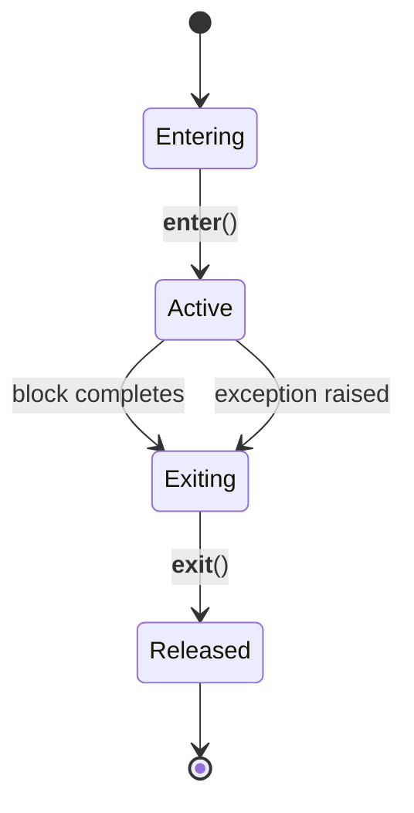
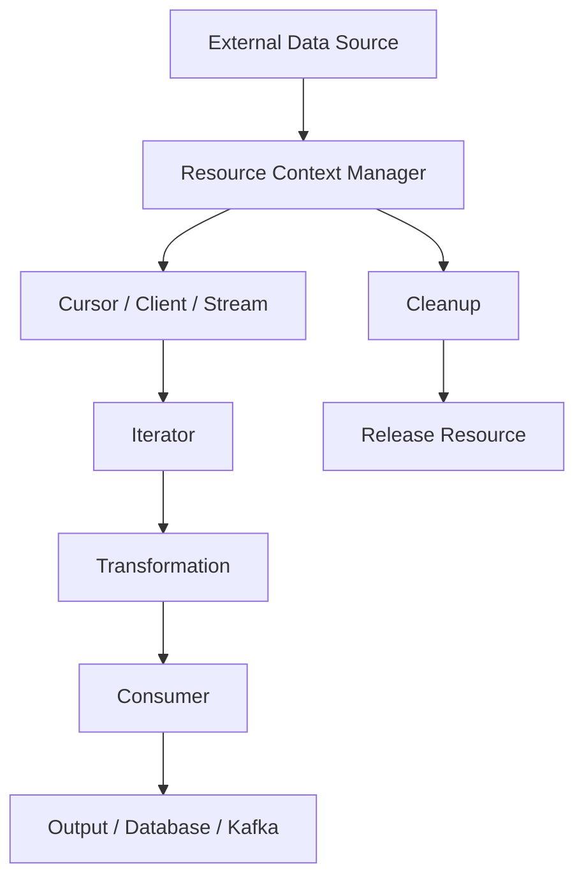
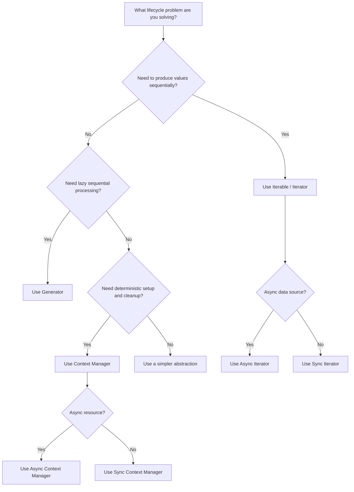

# 06- Iterators and Context Managers

## Overview

Iterators and context managers are core Python protocols that become especially important in backend engineering.

Iterators define how objects produce values sequentially. They underpin `for` loops, comprehensions, generators, streaming APIs, pagination, and many data-processing pipelines.

Context managers define how resources and execution state are acquired and released. They underpin `with` statements and are widely used for files, database transactions, locks, network resources, temporary state, and request-scoped operations.

The two concepts address different lifecycle problems:

| Concept | Primary responsibility | Common backend use |
|---|---|---|
| Iterator | Produce values sequentially | Streaming, pagination, ETL |
| Generator | Convenient iterator implementation | Lazy processing |
| Context manager | Manage setup and cleanup | Files, transactions, locks |
| Async iterator | Produce values asynchronously | Async streams |
| Async context manager | Manage async resources | HTTP clients, DB sessions |

Understanding the protocols behind the syntax is important for senior-level Python development because frameworks frequently rely on these protocols internally.

---

## Iterables and Iterators

An **iterable** is an object that can provide an iterator.

An **iterator** is an object that produces values one at a time and maintains iteration state.

The distinction is fundamental:

```text
Iterable
   │
   │ iter()
   ▼
Iterator
   │
   │ next()
   ├── value
   ├── value
   ├── value
   └── StopIteration
```

Common iterables include:

- `list`
- `tuple`
- `dict`
- `set`
- `str`
- `range`
- generators
- database result abstractions
- custom collection classes

Not every iterable is itself an iterator.

---

## The Iterator Protocol

Python's iterator protocol is based primarily on two methods:

```python
__iter__()
__next__()
```

An iterator must return itself from `__iter__()`:

```python
iterator.__iter__() is iterator
```

`__next__()` returns the next value and raises `StopIteration` when exhausted.

Example:

```python
class CustomerIterator:
    def __init__(self, customers):
        self._customers = customers
        self._index = 0

    def __iter__(self):
        return self

    def __next__(self):
        if self._index >= len(self._customers):
            raise StopIteration

        customer = self._customers[self._index]
        self._index += 1
        return customer
```

Usage:

```python
customers = [
    {"id": "cust-1"},
    {"id": "cust-2"},
]

iterator = CustomerIterator(customers)

for customer in iterator:
    print(customer)
```

In production code, generators are often preferable for simple sequential iteration, but understanding the explicit protocol is important.

---

## What a `for` Loop Does Internally

This:

```python
for customer in customers:
    process(customer)
```

is conceptually similar to:

```python
iterator = iter(customers)

while True:
    try:
        customer = next(iterator)
    except StopIteration:
        break

    process(customer)
```

This explains why implementing `__iter__()` and `__next__()` correctly is sufficient to make a custom iterator work with `for`.

---

## Iterable vs Iterator

A common interview question is:

> What is the difference between an iterable and an iterator?

| Property | Iterable | Iterator |
|---|---|---|
| Implements `__iter__()` | Yes | Yes |
| Implements `__next__()` | Not necessarily | Yes |
| Maintains iteration state | Usually no | Yes |
| Usually reusable | Often | Usually no |
| `iter(obj) is obj` | Not necessarily | Yes |

For example:

```python
items = [1, 2, 3]

iterable = items
iterator = iter(items)

assert iter(iterable) is not iterable
assert iter(iterator) is iterator
```

The list can produce multiple independent iterators.

The iterator itself represents one traversal.

---

## Why Iterators Matter

Iterators provide a common abstraction for sequential data access without requiring the consumer to know how the data is stored.

The source could be:

```text
List
Database cursor
File
Kafka consumer
HTTP pagination
Generator
Custom data source
        │
        ▼
     Iterator
        │
        ▼
    Consumer
```

The consumer only needs the iteration protocol.

This enables loose coupling between data producers and consumers.

---

## Iterator State

An iterator usually contains state describing where it currently is.

For a list-backed iterator:

```text
customers = [A, B, C]

index = 0
   │
   ▼
next() → A
index = 1
   │
   ▼
next() → B
index = 2
   │
   ▼
next() → C
index = 3
   │
   ▼
StopIteration
```

The state may be more complex for production iterators.

A database iterator might retain:

- cursor state;
- connection information;
- fetch position;
- batch size.

A paginated API iterator might retain:

- current page;
- continuation token;
- HTTP client;
- retry state.

---

## Reusable Iterables

A collection should generally return a fresh iterator for each traversal.

```python
class Customers:
    def __init__(self, customers):
        self._customers = customers

    def __iter__(self):
        return iter(self._customers)
```

Now:

```python
customers = Customers(["A", "B", "C"])

first = list(customers)
second = list(customers)

assert first == second
assert second == first
```

This differs from a generator:

```python
customers = (value for value in ["A", "B", "C"])

list(customers)
list(customers)
```

The second traversal is empty because the generator has been exhausted.

---

## Custom Iterable

A custom iterable does not need to implement `__next__()` itself if `__iter__()` returns another iterator.

```python
class CustomerCollection:
    def __init__(self, customers):
        self._customers = customers

    def __iter__(self):
        return iter(self._customers)
```

This is often the simplest design for domain collections.

---

## `iter()` with a Sentinel

Python also provides a two-argument form of `iter()`:

```python
iter(callable, sentinel)
```

It repeatedly calls the callable until it returns the sentinel.

For example:

```python
from functools import partial

with open("events.log", "rb") as file:
    for chunk in iter(partial(file.read, 1024 * 1024), b""):
        process_chunk(chunk)
```

This is useful for chunked I/O.

---

## Iterators and Memory Efficiency

Iterators allow consumers to process data incrementally.

Instead of:

```python
rows = repository.get_all()

for row in rows:
    process(row)
```

a repository can expose:

```python
for row in repository.iter_rows():
    process(row)
```

The latter can avoid materializing the complete result set.

However, memory usage depends on the underlying implementation. An iterator backed by a fully materialized list still retains the list.

---

## Database Iterators

Database drivers and ORMs can expose cursor-based iteration.

A production data pipeline might look like:

```text
PostgreSQL
    │
    │ cursor / batched retrieval
    ▼
Repository Iterator
    │
    ▼
Transformation
    │
    ▼
Batch Writer
    │
    ├── PostgreSQL
    ├── Kafka
    └── S3
```

Important considerations include:

- fetch size;
- transaction scope;
- cursor lifetime;
- connection pool usage;
- query performance;
- network failures;
- consumer speed.

Do not assume that simply returning an iterator automatically creates streaming behavior at the database layer.

---

## Pagination Iterators

An iterator can hide API pagination from the consumer.

```python
class PaginatedCustomers:
    def __init__(self, client, page_size=100):
        self._client = client
        self._page_size = page_size

    def __iter__(self):
        token = None

        while True:
            response = self._client.list_customers(
                limit=self._page_size,
                continuation_token=token,
            )

            yield from response.items

            token = response.next_token

            if token is None:
                break
```

The caller can write:

```python
for customer in PaginatedCustomers(client):
    process(customer)
```

The pagination protocol remains encapsulated.

Production implementations should additionally consider:

- request timeouts;
- retryable failures;
- rate limits;
- authentication expiry;
- cancellation;
- maximum page counts;
- API consistency guarantees.

---

## Iterator Exceptions

`StopIteration` means normal exhaustion.

Other exceptions generally represent failures.

```python
def __next__(self):
    if self._finished:
        raise StopIteration

    try:
        return self._fetch_next()
    except DatabaseError:
        raise
```

Do not silently convert operational failures into `StopIteration`.

Doing so can make a failed data pipeline appear to have completed successfully.

---

## Generators as Iterators

Generators provide a concise way to implement iteration.

```python
def active_customers(customers):
    for customer in customers:
        if customer.active:
            yield customer
```

The generator automatically implements the iterator protocol.

For most straightforward custom iteration logic, this is preferable to manually implementing `__next__()`.

---

## Iterators and Generators

| Requirement | Custom iterator | Generator |
|---|---|---|
| Simple sequential processing | Usually unnecessary | Excellent |
| Complex explicit state machine | Useful | Possible |
| Custom reusable iterable | Excellent | Usually not |
| Lazy evaluation | Yes | Yes |
| Protocol-level control | Excellent | Good |
| Implementation complexity | Higher | Lower |

Choose the simplest implementation that expresses the lifecycle correctly.

---

# Context Managers

A context manager controls setup and cleanup around a block of code.

The syntax:

```python
with resource() as value:
    use(value)
```

provides a structured lifecycle:

```text
Enter
  │
  ▼
Acquire resource
  │
  ▼
Execute body
  │
  ├── success
  └── exception
  │
  ▼
Exit / cleanup
```

The key benefit is deterministic cleanup.

---

## Why Context Managers Exist

Many backend resources have strict lifecycle requirements:

- files must be closed;
- database transactions must commit or roll back;
- locks must be released;
- temporary directories must be removed;
- network sessions must be closed;
- tracing spans must finish.

Without context managers, cleanup is easy to forget.

```python
connection = create_connection()

try:
    process(connection)
finally:
    connection.close()
```

A context manager makes the lifecycle explicit:

```python
with create_connection() as connection:
    process(connection)
```

---

## Context Manager Protocol

A synchronous context manager implements:

```python
__enter__()
__exit__()
```

Example:

```python
class ManagedResource:
    def __enter__(self):
        self.resource = acquire_resource()
        return self.resource

    def __exit__(self, exc_type, exc_value, traceback):
        self.resource.close()
        return False
```

Usage:

```python
with ManagedResource() as resource:
    process(resource)
```

---

## What `with` Does Internally

Conceptually:

```python
manager = ManagedResource()
value = manager.__enter__()

try:
    process(value)
except BaseException as exc:
    if not manager.__exit__(
        type(exc),
        exc,
        exc.__traceback__,
    ):
        raise
else:
    manager.__exit__(None, None, None)
```

The actual bytecode implementation is more specialized, but this model explains the protocol.

---

## `__enter__` Return Value

The object returned by `__enter__()` becomes the value after `as`.

```python
with DatabaseSession() as session:
    ...
```

The `session` variable is whatever `__enter__()` returns.

It does not have to be the context manager itself.

For example:

```python
class Database:
    def __enter__(self):
        return self.connection
```

Then:

```python
with Database() as connection:
    connection.execute(...)
```

---

## Exception Handling in `__exit__`

`__exit__()` receives:

```python
exc_type
exc_value
traceback
```

If no exception occurred, all three are `None`.

Returning:

```python
False
```

or `None` allows the exception to propagate.

Returning:

```python
True
```

suppresses the exception.

Example:

```python
class SuppressValueError:
    def __enter__(self):
        return self

    def __exit__(self, exc_type, exc_value, traceback):
        return exc_type is ValueError
```

This suppresses `ValueError`.

In production code, exception suppression should be rare and explicit because it can hide failures.

---

## Context Manager State Machine



The essential invariant is:

> Once a resource is acquired successfully, cleanup must happen even when the body raises an exception.

---

## File Context Managers

Python's file objects support context management.

```python
from pathlib import Path

path = Path("/var/app/data/events.jsonl")

with path.open("rt", encoding="utf-8") as file:
    for line in file:
        process(line)
```

The file is closed when the `with` block exits.

This is preferable to manually calling `close()`.

---

## Database Transaction Context Managers

Transactions are a major backend use case.

Conceptually:

```python
with database.transaction():
    repository.create_order(order)
    repository.create_payment(payment)
```

The context manager can enforce:

```text
Enter transaction
       │
       ▼
Execute operations
       │
       ├── success ──────► COMMIT
       │
       └── exception ────► ROLLBACK
```

A transaction context manager should define commit and rollback behavior explicitly.

---

## Transaction Scope

Context manager scope should match the intended transaction boundary.

Avoid:

```python
with database.transaction():
    call_external_api()
    process_large_file()
    perform_many_unrelated_operations()
```

Long transactions can cause:

- lock contention;
- connection pool exhaustion;
- increased database resource usage;
- replication lag;
- dead tuples and vacuum pressure;
- reduced throughput.

Keep transaction boundaries as small as business correctness allows.

---

## Locks

Context managers are ideal for lock acquisition and release.

```python
from threading import Lock

lock = Lock()

with lock:
    update_shared_state()
```

The lock is released even if `update_shared_state()` raises.

This is safer than manually calling:

```python
lock.acquire()

try:
    update_shared_state()
finally:
    lock.release()
```

---

## Context Managers and Concurrency

Context managers do not make code thread-safe by themselves.

A context manager can manage a lock correctly, but the underlying shared state still needs a sound concurrency design.

For distributed systems, a local Python lock only protects threads within the relevant process.

It does not coordinate:

- multiple Kubernetes pods;
- multiple EC2 instances;
- multiple worker processes.

Distributed coordination may require systems such as PostgreSQL advisory locks, Redis-based coordination, or a dedicated distributed workflow mechanism, depending on correctness requirements.

---

## Temporary Resources

Context managers are useful for temporary resources.

```python
from tempfile import TemporaryDirectory
from pathlib import Path

with TemporaryDirectory() as directory:
    output = Path(directory) / "result.json"
    output.write_text('{"status": "ok"}', encoding="utf-8")
```

The temporary directory is cleaned up when the block exits.

---

## `contextlib`

Python's `contextlib` provides utilities for implementing and composing context managers.

Important tools include:

- `contextmanager`;
- `asynccontextmanager`;
- `closing`;
- `nullcontext`;
- `ExitStack`.

---

## `@contextmanager`

For simple context managers, `contextlib.contextmanager` can avoid writing `__enter__()` and `__exit__()` manually.

```python
from contextlib import contextmanager


@contextmanager
def managed_connection(factory):
    connection = factory()

    try:
        yield connection
    finally:
        connection.close()
```

Usage:

```python
with managed_connection(create_connection) as connection:
    process(connection)
```

The code before `yield` behaves like entry logic.

The code after `yield` behaves like exit logic.

---

## Exception Handling with `@contextmanager`

A transaction manager can use:

```python
from contextlib import contextmanager


@contextmanager
def transaction(connection):
    try:
        yield connection
    except Exception:
        connection.rollback()
        raise
    else:
        connection.commit()
```

This makes the intended transaction semantics explicit.

Be careful not to catch exceptions too broadly if rollback itself can fail or if some exceptions require special handling.

---

## `finally` for Cleanup

Resource cleanup should generally use `finally`.

```python
@contextmanager
def managed_resource():
    resource = acquire()

    try:
        yield resource
    finally:
        resource.close()
```

The `finally` block executes regardless of whether the managed body:

- completes successfully;
- raises an exception;
- returns early.

---

## `ExitStack`

`ExitStack` is useful when the number or type of resources is dynamic.

```python
from contextlib import ExitStack


with ExitStack() as stack:
    files = [
        stack.enter_context(path.open("rt", encoding="utf-8"))
        for path in input_paths
    ]

    process_files(files)
```

Resources are exited in reverse order.

This is particularly useful when resources are acquired conditionally.

---

## Multiple Context Managers

Python supports multiple context managers:

```python
with open(input_path) as source, open(output_path, "w") as destination:
    transform(source, destination)
```

This is equivalent in lifecycle terms to nested context managers:

```python
with open(input_path) as source:
    with open(output_path, "w") as destination:
        transform(source, destination)
```

Cleanup occurs in reverse acquisition order.

---

## Async Context Managers

Asynchronous resources use:

```python
__aenter__()
__aexit__()
```

and:

```python
async with
```

Example:

```python
class AsyncSession:
    async def __aenter__(self):
        self.session = await create_session()
        return self.session

    async def __aexit__(self, exc_type, exc_value, traceback):
        await self.session.close()
        return False
```

Usage:

```python
async with AsyncSession() as session:
    await session.execute(...)
```

---

## `@asynccontextmanager`

For straightforward asynchronous resource management:

```python
from contextlib import asynccontextmanager


@asynccontextmanager
async def managed_client(factory):
    client = await factory()

    try:
        yield client
    finally:
        await client.close()
```

Usage:

```python
async with managed_client(create_client) as client:
    await client.request()
```

This pattern is common in async backend systems.

---

## FastAPI Lifespan

FastAPI uses an application lifespan mechanism that follows the context-management model.

Conceptually:

```python
from contextlib import asynccontextmanager


@asynccontextmanager
async def lifespan(app):
    app.state.client = await create_client()

    try:
        yield
    finally:
        await app.state.client.close()
```

This is useful for application-wide resources such as:

- database pools;
- HTTP clients;
- Kafka producers;
- Redis clients;
- ML models;
- connection pools.

The resource should be initialized once per application process and cleaned up during shutdown.

---

## Request-Scoped vs Application-Scoped Resources

A senior engineer should distinguish resource lifetime.

| Scope | Example | Typical lifetime |
|---|---|---|
| Function | Temporary file | One operation |
| Request | DB session | One HTTP request |
| Application | HTTP connection pool | Process lifetime |
| Worker | Celery client/pool | Worker lifetime |
| Cluster | Redis/Kafka service | External infrastructure |

Incorrect scope can cause:

- unnecessary connection creation;
- connection leaks;
- resource exhaustion;
- stale state;
- synchronization problems.

---

## Context Managers and Dependency Injection

Context managers are often combined with dependency injection.

For example:

```python
def get_database_session():
    with database.session() as session:
        yield session
```

The dependency framework can control when the resource is created and released.

The important architectural principle is to make ownership explicit.

A service should generally not unexpectedly create and close a globally managed database pool inside every method call.

---

## Context Managers and Exceptions

A good context manager should define clear exception semantics.

Questions to answer:

- Does the exception propagate?
- Does cleanup happen after failure?
- Should the resource be rolled back?
- Can cleanup itself fail?
- Should cleanup errors replace the original exception?
- Is exception suppression intentional?

For infrastructure code, preserving the original failure is often important for debugging.

---

## Cleanup Failures

Cleanup can itself fail.

For example:

```python
try:
    resource.close()
except Exception:
    logger.exception("resource cleanup failed")
```

Whether cleanup failures should propagate depends on the resource and correctness requirements.

For critical transactional operations, silently swallowing cleanup failures can be dangerous.

For best-effort cleanup, logging and continuing may be appropriate.

---

## Reentrant Context Managers

A context manager is **reentrant** if the same manager can safely be entered multiple times.

Not all context managers are reentrant.

For example:

```python
with manager:
    with manager:
        ...
```

should not be assumed to work.

Reusable infrastructure abstractions should explicitly document whether reentrancy is supported.

---

## Reusable vs Single-Use Context Managers

A context manager may also be:

- reusable across separate `with` statements;
- single-use;
- thread-safe;
- process-local;
- async-only.

These properties are independent.

For example, a generator-based context manager created by `@contextmanager` generally represents a single context-manager instance that should not be reused for multiple independent `with` statements.

Create a new instance when necessary.

---

## Iterator and Context Manager Composition

The two protocols frequently appear together.

Example:

```python
def stream_rows(connection):
    cursor = connection.cursor()

    try:
        for row in cursor:
            yield row
    finally:
        cursor.close()
```

Here:

- iteration controls value production;
- cleanup controls cursor lifetime.

A more explicit design may use context management for the resource and iteration for the data:

```python
from contextlib import contextmanager


@contextmanager
def cursor(connection):
    cursor = connection.cursor()

    try:
        yield cursor
    finally:
        cursor.close()
```

Then:

```python
with cursor(connection) as rows:
    for row in rows:
        process(row)
```

This separation makes ownership clearer.

---

## Iterator + Context Manager Architecture



This pattern is common in ETL and backend streaming systems.

---

## Performance Considerations

### Iterators

Iterator overhead is usually small, but custom Python-level iteration can still be CPU-intensive for very large workloads.

For performance-sensitive data processing, consider whether work can be delegated to:

- PostgreSQL;
- NumPy;
- Pandas;
- native libraries;
- batch APIs.

Do not assume that streaming one Python object at a time is optimal.

### Context Managers

Context-manager syntax itself has minimal overhead compared with the resources being managed.

The important performance question is resource scope.

Creating a new database connection per function call is far more expensive than using a properly scoped connection pool.

---

## Memory Considerations

Iterators reduce the need for materialization but do not guarantee constant memory.

For example:

```python
iterator = iter(large_list)
```

still retains `large_list`.

Likewise:

```python
iterator = map(transform, large_objects)
```

may retain references through the underlying iterable.

Always identify what the iterator actually owns.

---

## Backpressure

Iterator-based processing can naturally slow the producer when the consumer pulls values synchronously.

```text
Producer
   │
   ▼
Iterator
   │
   ▼
Consumer
   │
   └── requests next item
```

This pull-based model can help avoid uncontrolled production.

However, asynchronous systems may require explicit bounded queues or flow-control mechanisms.

For Kafka, HTTP streaming, and distributed pipelines, iterator semantics alone do not solve system-wide backpressure.

---

## Security Considerations

Resource lifecycle bugs can become security issues.

Examples include:

- file descriptors exhausted by leaked files;
- database connections exhausted by abandoned sessions;
- locks never released;
- unbounded iterators processing maliciously large input;
- streaming endpoints consuming resources indefinitely.

For externally controlled workloads, define limits such as:

- maximum records;
- maximum request duration;
- maximum page count;
- maximum response size;
- connection timeouts;
- idle timeouts.

---

## Reliability Considerations

Production iterators should define behavior for:

- transient network failures;
- partial reads;
- pagination failures;
- downstream errors;
- cancellation;
- retries.

Production context managers should define:

- cleanup behavior;
- rollback behavior;
- exception propagation;
- cancellation handling;
- resource ownership.

The key principle is:

> Resource ownership and failure semantics should be explicit.

---

## Testing Iterators

Test:

- normal iteration;
- empty input;
- exhaustion;
- ordering;
- source failures;
- partial consumption;
- resource cleanup.

Example:

```python
def test_iterator_exhaustion():
    iterator = iter([1, 2])

    assert next(iterator) == 1
    assert next(iterator) == 2

    with pytest.raises(StopIteration):
        next(iterator)
```

For database or API iterators, integration tests should verify pagination, retries, and cleanup behavior.

---

## Testing Context Managers

Test both successful and exceptional paths.

```python
def test_transaction_rolls_back_on_failure(connection):
    with pytest.raises(RuntimeError):
        with transaction(connection):
            raise RuntimeError("failure")

    connection.rollback.assert_called_once()
    connection.commit.assert_not_called()
```

Also test:

- cleanup on normal exit;
- cleanup on exceptions;
- rollback;
- commit;
- exception suppression;
- cleanup failures;
- async cancellation where relevant.

---

## Common Iterator Mistakes

### Confusing Iterable and Iterator

A list is iterable but is not itself an iterator.

### Returning the Wrong Object from `__iter__`

An iterator must return itself from `__iter__()`.

### Forgetting `StopIteration`

Custom iterators must signal exhaustion correctly.

### Returning `None` on Exhaustion

Returning `None` is not equivalent to raising `StopIteration`.

### Accidentally Reusing a Single-Pass Iterator

Generators and many cursors cannot be restarted.

### Hiding Operational Failures

Do not convert database or network failures into apparent normal exhaustion.

---

## Common Context Manager Mistakes

### Forgetting Cleanup

Resource acquisition without guaranteed cleanup can cause leaks.

### Swallowing Exceptions

Returning `True` from `__exit__()` suppresses the exception.

### Holding Transactions Too Long

Large transaction scopes can damage database throughput and availability.

### Using the Wrong Resource Scope

Per-request creation of expensive clients can create unnecessary overhead.

### Assuming Thread Safety

A context manager does not make the managed resource thread-safe.

### Ignoring Async Semantics

Synchronous cleanup may block an async event loop.

### Hiding Expensive Operations

A context manager can make expensive acquisition appear harmless. Resource creation costs should remain visible in architecture and lifecycle design.

---

## Interview Traps

### Is Every Iterable an Iterator?

No.

An iterable can produce an iterator. An iterator itself is iterable.

### Why Does `iter(iterator) is iterator` Hold?

Because an iterator must return itself from `__iter__()`.

### What Signals Iterator Exhaustion?

`StopIteration`.

### What Happens When an Exception Occurs Inside `with`?

Python calls `__exit__()` with exception information. Unless the context manager suppresses the exception by returning a truthy value, the exception propagates.

### Why Use `finally` in a Context Manager?

To guarantee cleanup for both successful and exceptional execution paths.

### Does `with` Automatically Make a Resource Safe?

No. It guarantees the context manager's exit protocol is invoked, but correctness still depends on the context manager implementation.

### Can a Context Manager Return a Different Object?

Yes. `__enter__()` determines the object assigned after `as`.

### Are Context Managers Automatically Reentrant?

No.

### Are Iterators Automatically Thread-Safe?

No. Shared iterator state can require synchronization.

---

## Senior-Level Design Questions

### How Would You Stream Millions of Rows from PostgreSQL?

Use database-level incremental retrieval or batching, expose the data through an iterator/generator, process records incrementally, and carefully manage connection and transaction lifetime.

Consider:

```text
PostgreSQL
    │
    ▼
Cursor / Batched Query
    │
    ▼
Iterator
    │
    ▼
Transform
    │
    ▼
Bounded Batch
    │
    ▼
Destination
```

Avoid keeping a single transaction open for an unnecessarily long export.

---

### How Would You Design a Paginated API Iterator?

The iterator should encapsulate:

- current continuation token;
- page size;
- API client;
- retry policy;
- termination condition.

The consumer should only see domain items.

Operational concerns include rate limiting, retries, timeouts, cancellation, and maximum traversal limits.

---

### How Would You Implement a Transaction Context Manager?

Define:

```text
Enter
  │
  ▼
BEGIN
  │
  ▼
Business operations
  │
  ├── success ──────► COMMIT
  │
  └── failure ──────► ROLLBACK
```

Then preserve the original exception unless suppression is explicitly part of the contract.

---

### When Should You Implement `__next__()` Manually?

Use a custom iterator when explicit state-machine behavior is valuable or when implementing a specialized protocol that is awkward to express with a generator.

For straightforward iteration, prefer generators.

---

### When Should You Use `ExitStack`?

Use `ExitStack` when resource acquisition is dynamic, conditional, or generated programmatically.

It is especially useful when the number of resources is not known when the source code is written.

---

### How Do Context Managers Help High Availability?

Correct resource cleanup helps prevent resource exhaustion.

For backend services, leaked:

- database connections;
- file descriptors;
- sockets;
- locks;
- temporary resources

can eventually cause cascading failures.

Context managers therefore contribute to reliability by making resource ownership deterministic.

---

## Production Checklist

### Iterators

- [ ] Is the object an iterable or an iterator?
- [ ] Is iteration single-pass or reusable?
- [ ] Is state maintained correctly?
- [ ] Does exhaustion raise `StopIteration`?
- [ ] Are operational errors propagated?
- [ ] Is memory usage bounded?
- [ ] Is database/API pagination incremental?
- [ ] Are retries and timeouts defined?
- [ ] Is cancellation handled?
- [ ] Is backpressure considered?

### Context Managers

- [ ] Is resource ownership explicit?
- [ ] Is cleanup guaranteed?
- [ ] Are exceptions propagated correctly?
- [ ] Is rollback performed when required?
- [ ] Is the transaction scope appropriate?
- [ ] Is the resource scope correct?
- [ ] Is cleanup asynchronous when required?
- [ ] Is the context manager reusable?
- [ ] Is it reentrant?
- [ ] Is thread/process safety documented?
- [ ] Are cleanup failures observable?

---

## Iterator vs Context Manager Decision Guide



---

## Key Takeaways

- **An iterable produces iterators, while an iterator maintains traversal state:** `iter()` obtains an iterator and `next()` retrieves values until `StopIteration`.
- **Generators are usually the simplest way to implement lazy iteration:** custom `__next__()` implementations are appropriate when explicit iteration state or protocol behavior requires them.
- **Context managers provide deterministic resource lifecycle management:** `__enter__()` acquires or prepares resources and `__exit__()` handles cleanup and exception semantics.
- **Production correctness depends on ownership and scope:** database transactions, connections, files, locks, network clients, and streams must have explicit lifetimes, cleanup, timeout, and failure behavior.
- **Iterators and context managers compose naturally:** iterators handle incremental data flow while context managers handle the lifetime of the resources that produce or consume that data.