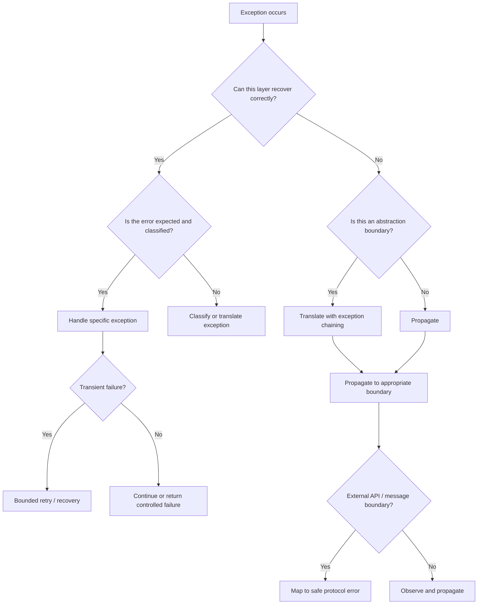

# 07- Exceptions

## Overview

Python exceptions provide a structured mechanism for representing and propagating failures through application code.

In backend systems, exception handling is not simply about preventing crashes. It defines how a system:

- distinguishes expected failures from programming defects;
- propagates errors across layers;
- translates internal failures into API responses;
- performs retries and recovery;
- preserves diagnostic information;
- maintains transactional correctness;
- exposes failures through logs, metrics, and traces.

A robust exception strategy should make failures **observable, predictable, actionable, and correctly classified**.

A useful backend model is:

```text
Infrastructure / External System
            │
            ▼
       Low-level error
            │
            ▼
       Repository / Client
            │
            ▼
      Domain exception
            │
            ▼
       Service layer
            │
            ▼
    API / Message boundary
            │
            ▼
 Client-safe error response
```

The important design principle is to translate exceptions at architectural boundaries without destroying the original diagnostic context.

---

## Exception Fundamentals

An exception is an object representing an abnormal condition during execution.

Example:

```python
customer = customers[customer_id]
```

If the key does not exist, Python raises:

```python
KeyError
```

The exception interrupts normal execution and begins exception propagation.

```text
Statement
   │
   ▼
Exception raised
   │
   ▼
Current frame
   │
   ├── matching handler? ──► handle
   │
   └── no handler
          │
          ▼
     Caller frame
          │
          ▼
     Continue propagation
```

If no handler is found, the exception eventually reaches the top-level execution boundary and terminates that execution path.

---

## Why Exceptions Exist

Exceptions separate normal business flow from failure handling.

Without exceptions, every operation would need to explicitly return an error value:

```python
result, error = create_customer(data)

if error is not None:
    ...
```

Python instead allows:

```python
try:
    customer = create_customer(data)
except CustomerAlreadyExistsError:
    ...
```

This keeps the successful path easier to read while allowing failures to propagate until a layer capable of handling them is reached.

---

## Exception Hierarchy

Python exceptions form an inheritance hierarchy.

A simplified hierarchy is:

```text
BaseException
├── SystemExit
├── KeyboardInterrupt
├── GeneratorExit
└── Exception
    ├── ValueError
    ├── TypeError
    ├── KeyError
    ├── IndexError
    ├── RuntimeError
    ├── OSError
    ├── TimeoutError
    └── ...
```

Application exceptions should generally derive from `Exception`, not directly from `BaseException`.

```python
class CustomerError(Exception):
    pass
```

This keeps them within normal application exception handling.

---

## `Exception` vs `BaseException`

Do not normally catch `BaseException`.

```python
try:
    process()
except BaseException:
    ...
```

This can intercept control-flow exceptions such as:

- `KeyboardInterrupt`;
- `SystemExit`;
- `GeneratorExit`.

Application code generally wants:

```python
except Exception:
    ...
```

Even that should be used carefully because it catches almost every ordinary application exception.

---

## Raising Exceptions

Use `raise` when an operation cannot satisfy its contract.

```python
def parse_customer_id(value: str) -> str:
    if not value:
        raise ValueError("customer ID cannot be empty")

    return value
```

An exception should communicate a meaningful failure condition rather than simply indicate that something unexpected happened.

---

## Built-in Exceptions

Use standard exceptions when they accurately describe the failure.

| Exception | Typical meaning |
|---|---|
| `ValueError` | Correct type, invalid value |
| `TypeError` | Incorrect type or unsupported operation |
| `KeyError` | Mapping key does not exist |
| `IndexError` | Sequence index is invalid |
| `AttributeError` | Attribute does not exist |
| `FileNotFoundError` | Requested file does not exist |
| `PermissionError` | OS-level permission failure |
| `TimeoutError` | Operation exceeded timeout |
| `ConnectionError` | Connection-related failure |
| `RuntimeError` | Generic runtime condition |
| `NotImplementedError` | Operation intentionally not implemented |

Prefer a domain-specific exception when the caller needs to distinguish a business or infrastructure condition.

---

## Custom Exceptions

Custom exceptions create explicit application-level contracts.

```python
class CustomerError(Exception):
    """Base exception for customer operations."""


class CustomerNotFoundError(CustomerError):
    """Requested customer does not exist."""


class CustomerAlreadyExistsError(CustomerError):
    """Customer already exists."""
```

Then:

```python
def get_customer(customer_id: str) -> Customer:
    customer = repository.find(customer_id)

    if customer is None:
        raise CustomerNotFoundError(customer_id)

    return customer
```

The service layer can handle the domain condition without depending on a database-specific exception.

---

## Exception Taxonomy

A well-designed backend commonly separates errors into categories.

```text
ApplicationError
├── ValidationError
├── AuthenticationError
├── AuthorizationError
├── NotFoundError
├── ConflictError
├── DependencyError
│   ├── DatabaseError
│   ├── CacheError
│   └── ExternalServiceError
└── ConfigurationError
```

The exact hierarchy should reflect application needs rather than becoming an elaborate classification system.

---

## Exception Design Across Layers

A backend often has multiple error vocabularies.

For example:

```text
PostgreSQL
    │
    ▼
psycopg / ORM exception
    │
    ▼
Repository exception
    │
    ▼
Domain exception
    │
    ▼
HTTP exception
    │
    ▼
HTTP response
```

Each layer should understand the abstraction appropriate to its responsibility.

A service layer generally should not need to know that a domain failure originated from a specific PostgreSQL driver exception.

---

## `try` / `except`

Basic exception handling uses:

```python
try:
    result = process_payment(payment)
except PaymentDeclinedError:
    mark_payment_declined(payment)
```

The `try` block should contain only the operations whose failures you intend to handle.

Avoid:

```python
try:
    validate()
    save()
    publish_event()
    send_email()
    update_cache()
except Exception:
    ...
```

This makes it unclear which operation failed and may accidentally handle failures that should propagate.

Prefer narrow scopes:

```python
validate()

try:
    save()
except DatabaseError:
    handle_database_failure()
```

---

## Catch Specific Exceptions

Prefer:

```python
try:
    customer = repository.get(customer_id)
except CustomerNotFoundError:
    return None
```

over:

```python
try:
    customer = repository.get(customer_id)
except Exception:
    return None
```

Broad catches can hide:

- programming bugs;
- serialization errors;
- unexpected infrastructure failures;
- corrupted state.

Catch the narrowest exception you can meaningfully handle.

---

## `else`

The `else` block runs only when the `try` block completes successfully.

```python
try:
    customer = repository.get(customer_id)
except DatabaseError:
    handle_database_error()
else:
    publish_customer_loaded(customer)
```

This can keep the exception-handling scope precise.

It prevents exceptions raised by `publish_customer_loaded()` from being accidentally interpreted as database failures.

---

## `finally`

`finally` runs regardless of whether an exception occurred.

```python
connection = create_connection()

try:
    process(connection)
finally:
    connection.close()
```

This is especially useful for cleanup.

However, resource management is usually clearer with a context manager:

```python
with create_connection() as connection:
    process(connection)
```

---

## Exception Propagation

If an exception is not handled at the current level, Python propagates it to the caller.

```python
def repository_operation():
    raise DatabaseError("database unavailable")


def service_operation():
    return repository_operation()


def api_handler():
    return service_operation()
```

The exception travels:

```text
api_handler()
     │
     ▼
service_operation()
     │
     ▼
repository_operation()
     │
     ▼
DatabaseError
     │
     ▲
     │ propagation
     │
API boundary
```

Propagation is useful when lower layers cannot make an appropriate recovery decision.

---

## Re-Raising Exceptions

Inside an exception handler, bare `raise` re-raises the current exception.

```python
try:
    process()
except DatabaseError:
    logger.exception("database operation failed")
    raise
```

This preserves the original exception and traceback.

Avoid:

```python
except DatabaseError as exc:
    raise exc
```

A bare `raise` is generally preferable when the intent is simply to propagate the current exception.

---

## Exception Chaining

Python supports explicit exception chaining.

```python
try:
    response = external_client.fetch()
except ExternalClientError as exc:
    raise CustomerServiceError(
        "customer service unavailable"
    ) from exc
```

This creates:

```text
CustomerServiceError
       │
       └── caused by
              │
              ▼
      ExternalClientError
```

The original exception remains available for diagnostics.

---

## `raise ... from None`

Sometimes the underlying exception is an implementation detail that should not appear in the public exception chain.

```python
try:
    config = load_config()
except FileNotFoundError:
    raise ConfigurationError(
        "application configuration is missing"
    ) from None
```

Use this intentionally. Do not discard useful diagnostic context unnecessarily.

---

## Exception Context

Python also records implicit exception context.

```python
try:
    operation()
except DatabaseError:
    raise ServiceError("operation failed")
```

The resulting exception can retain information about the original exception context.

Explicit chaining with:

```python
raise ServiceError(...) from exc
```

communicates the causal relationship more clearly.

---

## Exception Translation

Exception translation is appropriate at abstraction boundaries.

For example:

```python
def create_customer(customer: Customer) -> Customer:
    try:
        return repository.insert(customer)
    except UniqueViolation as exc:
        raise CustomerAlreadyExistsError(
            customer.email
        ) from exc
```

The service layer exposes a domain-level failure instead of leaking a database-specific implementation detail.

---

## API Error Translation

At an HTTP boundary:

```text
Domain Exception
       │
       ▼
Exception Handler
       │
       ├── status code
       ├── error code
       ├── safe message
       └── correlation ID
       │
       ▼
HTTP Response
```

For example:

```json
{
  "error": {
    "code": "CUSTOMER_NOT_FOUND",
    "message": "Customer was not found",
    "request_id": "req-8f42"
  }
}
```

Do not expose raw database errors, stack traces, SQL statements, credentials, or internal infrastructure details to clients.

---

## FastAPI Exception Handling

FastAPI supports centralized exception handlers.

```python
from fastapi import FastAPI, Request
from fastapi.responses import JSONResponse

app = FastAPI()


@app.exception_handler(CustomerNotFoundError)
async def customer_not_found(
    request: Request,
    exc: CustomerNotFoundError,
):
    return JSONResponse(
        status_code=404,
        content={
            "error": {
                "code": "CUSTOMER_NOT_FOUND",
                "message": "Customer was not found",
            }
        },
    )
```

This keeps endpoint functions focused on successful business behavior.

---

## Django Exception Handling

Django applications commonly use:

- custom exception classes;
- middleware;
- view-level handling;
- framework-specific HTTP exceptions;
- centralized logging and error reporting.

The architectural principle remains the same:

> Translate exceptions at the boundary that owns the external contract.

---

## REST API Error Mapping

A typical mapping might look like:

| Internal condition | HTTP status | Client meaning |
|---|---:|---|
| Validation failure | `400` or `422` | Request data invalid |
| Authentication failure | `401` | Credentials required/invalid |
| Authorization failure | `403` | Authenticated but forbidden |
| Resource missing | `404` | Resource does not exist |
| State conflict | `409` | Request conflicts with current state |
| Rate limited | `429` | Retry after throttling |
| Dependency failure | `502` / `503` | Upstream unavailable |
| Unexpected application failure | `500` | Server error |

The exact status depends on the API contract and semantics.

Do not expose internal exception class names directly as public API contracts unless they are intentionally part of the API design.

---

## gRPC Error Handling

gRPC uses status codes rather than HTTP status codes as its primary error model.

An internal exception can be translated at the RPC boundary into an appropriate gRPC status.

For example:

```text
CustomerNotFoundError
        │
        ▼
gRPC handler
        │
        ▼
NOT_FOUND
```

The same domain error can therefore be mapped differently for:

- REST;
- gRPC;
- asynchronous messaging.

This is another reason not to couple domain logic directly to one transport protocol.

---

## Exception Handling and Transactions

Exception handling must preserve transaction correctness.

```python
with database.transaction():
    repository.create_order(order)
    repository.create_payment(payment)
```

If an exception occurs, the transaction manager can roll back.

A dangerous pattern is catching an exception inside a transaction and continuing as though nothing happened:

```python
with database.transaction():
    try:
        repository.create_order(order)
    except DatabaseError:
        logger.exception("failed")
    
    repository.create_payment(payment)
```

Depending on the database and transaction semantics, the transaction may already be unusable or marked for rollback.

Handle transactional failures deliberately.

---

## Retries

Retries are appropriate only for failures that may succeed if attempted again.

Common retry candidates include:

- transient network errors;
- temporary service unavailability;
- throttling;
- connection resets.

Do not blindly retry:

- validation errors;
- authentication failures;
- authorization failures;
- deterministic business rule failures.

---

## Exponential Backoff

A typical retry strategy uses exponential backoff:

```text
Attempt 1 → immediate
Attempt 2 → short delay
Attempt 3 → longer delay
Attempt 4 → longer delay
```

With jitter:

```text
delay = exponential_backoff + random_jitter
```

Jitter reduces synchronized retry storms across many workers.

A production retry policy should define:

- maximum attempts;
- maximum elapsed time;
- retryable exception classes;
- backoff strategy;
- jitter;
- idempotency requirements.

---

## Idempotency and Retries

Retrying a failed operation can duplicate side effects.

Consider:

```python
charge_card()
```

If the server processes the charge but the network response is lost, retrying can potentially charge the customer twice.

For externally visible side effects, use mechanisms such as:

- idempotency keys;
- unique constraints;
- deduplication records;
- transactional outbox patterns;
- downstream idempotency support.

Retries are a reliability mechanism, not a substitute for idempotent design.

---

## Exception Handling in Celery

Background workers require special care.

A transient exception may justify retrying a task:

```python
@app.task(
    autoretry_for=(TemporaryServiceError,),
    retry_backoff=True,
    retry_jitter=True,
    max_retries=5,
)
def sync_customer(customer_id: str):
    sync_service.sync(customer_id)
```

Tasks should be designed with idempotency because workers can encounter:

- retries;
- duplicate delivery;
- worker crashes;
- visibility timeout behavior;
- broker redelivery.

---

## Exceptions and Kafka Consumers

For event consumers, distinguish:

```text
Message
  │
  ▼
Processing
  │
  ├── success ──────► commit offset
  │
  ├── transient ────► retry / delay
  │
  └── permanent ───► DLQ / failure workflow
```

The correct behavior depends on the consumer architecture.

Do not simply catch every exception and commit the message, because that can silently lose events.

---

## Dead-Letter Queues

For asynchronous systems, permanently failing messages may be moved to a dead-letter queue.

Typical flow:

```text
Message
   │
   ▼
Consumer
   │
   ├── success ──────► Processed
   │
   ├── transient ────► Retry
   │                    │
   │                    └── retry limit
   │
   └── permanent ────► Dead Letter Queue
```

DLQs require operational ownership.

Monitor:

- message count;
- age of oldest message;
- failure reasons;
- retry volume;
- replay success.

A DLQ is not a garbage dump.

---

## Logging Exceptions

Use `logger.exception()` inside an exception handler when a traceback is useful.

```python
try:
    process_order(order)
except OrderProcessingError:
    logger.exception(
        "order processing failed",
        extra={"order_id": order.id},
    )
    raise
```

Avoid logging the same exception at every layer.

Excessive logging creates:

- duplicate stack traces;
- noisy alerts;
- higher storage costs;
- harder incident investigation.

A useful strategy is to log at the boundary where the failure becomes operationally actionable.

---

## Structured Logging

Production systems should prefer structured logs.

```python
logger.error(
    "payment failed",
    extra={
        "payment_id": payment.id,
        "customer_id": customer.id,
        "error_code": "PAYMENT_DECLINED",
    },
)
```

Do not include secrets or sensitive credentials.

Be especially careful with:

- authorization headers;
- access tokens;
- passwords;
- payment data;
- session identifiers;
- personal data.

---

## Metrics for Exceptions

Exceptions should also contribute to metrics.

Useful dimensions include:

```text
operation
exception_type
error_code
dependency
```

Avoid high-cardinality labels such as:

```text
customer_id
request_id
email
```

Metrics should support aggregation rather than reproduce log data.

---

## Tracing

Distributed tracing can preserve failure context across services.

```text
API Gateway
    │ trace_id=abc
    ▼
Order Service
    │
    ▼
Payment Service
    │
    ▼
Payment Provider
    │
    └── timeout
```

The resulting trace should make it possible to identify:

- where the error originated;
- which downstream dependency failed;
- latency before failure;
- retry attempts;
- affected operation.

---

## Exception Performance

Exceptions are not inherently expensive enough to avoid normal error handling.

However, raising exceptions in extremely hot loops for ordinary control flow can be inefficient and unclear.

Prefer:

```python
if index < len(items):
    process(items[index])
```

when absence is expected and frequent.

Use exceptions for exceptional conditions or where they naturally express the operation's contract.

---

## Exception Objects and Memory

An exception can retain traceback information referencing stack frames and local objects.

This means keeping exception objects alive for long periods can retain more memory than expected.

Avoid storing exceptions indefinitely in:

- global collections;
- caches;
- long-lived task state;
- application-level registries.

Log or transform the necessary information and release the exception when no longer needed.

---

## Exception Safety

Exception-safe code maintains important invariants even when operations fail.

For example:

```text
Before operation:
    account balance = valid
    transaction = open

Operation fails
    │
    ▼
Rollback
    │
    ▼
Database invariant preserved
```

A senior engineer should ask:

> What state is the system left in if this line raises?

This question is often more important than simply deciding where to put `try/except`.

---

## Exception Handling in Concurrency

Exceptions behave differently depending on the concurrency abstraction.

### Threads

Exceptions raised in a worker thread do not automatically terminate the parent thread.

With `ThreadPoolExecutor`, exceptions are commonly observed when retrieving the future's result:

```python
future = executor.submit(process)

try:
    future.result()
except ProcessingError:
    handle_failure()
```

### Processes

Process-based executors similarly surface worker exceptions through futures.

### Asyncio

Exceptions in tasks need to be observed correctly.

```python
task = asyncio.create_task(process())

try:
    await task
except ProcessingError:
    handle_failure()
```

Unobserved task failures can become operational problems.

---

## Exception Groups

Modern Python supports exception groups through `ExceptionGroup` and `except*`.

They are useful when concurrent operations can fail independently.

Conceptually:

```text
Concurrent tasks
    │
    ├── Task A → success
    ├── Task B → TimeoutError
    ├── Task C → ValidationError
    └── Task D → ConnectionError
              │
              ▼
        ExceptionGroup
```

Handling can target categories independently:

```python
try:
    await run_concurrently()
except* TimeoutError:
    handle_timeouts()
except* ConnectionError:
    handle_connection_errors()
```

This is particularly relevant to structured concurrency and concurrent batch processing.

---

## Exception Handling Boundaries

A useful architecture is:

```text
Infrastructure
    │
    │ driver-specific exceptions
    ▼
Adapter / Repository
    │
    │ infrastructure abstraction
    ▼
Service / Domain
    │
    │ business exceptions
    ▼
Transport Boundary
    │
    │ HTTP / gRPC / event semantics
    ▼
External Client
```

Avoid allowing infrastructure-specific exception types to leak throughout the entire application.

---

## What Not to Do

### Catch Everything and Continue

```python
try:
    process()
except Exception:
    pass
```

This can convert failures into silent corruption.

### Return `None` for Every Failure

```python
def get_customer():
    try:
        ...
    except Exception:
        return None
```

This makes fundamentally different conditions indistinguishable.

### Log and Swallow

```python
except Exception:
    logger.exception("failed")
```

If the caller expects the operation to succeed, swallowing the exception can cause incorrect downstream behavior.

### Use Exceptions for Normal Branching

Do not intentionally raise exceptions for common expected paths when ordinary control flow is clearer.

### Leak Internal Details

Never return:

```text
psycopg.errors.UniqueViolation:
DETAIL: Key (email)=(...) already exists
```

directly to API clients.

---

## Common Mistakes and Pitfalls

| Mistake | Why it is dangerous | Better approach |
|---|---|---|
| `except Exception: pass` | Hides failures | Handle specific exceptions |
| Catching `BaseException` | Intercepts system control flow | Catch `Exception` or narrower |
| Re-raising incorrectly | Can obscure context | Prefer bare `raise` |
| Logging every layer | Duplicate telemetry | Log at useful boundaries |
| Retrying everything | Retry storms / duplicate side effects | Retry only transient failures |
| Long `try` blocks | Unclear failure ownership | Keep scopes narrow |
| Swallowing transaction errors | Can corrupt workflow state | Roll back and propagate appropriately |
| Exposing raw exceptions | Information disclosure | Map to safe error responses |
| Storing exception objects | Can retain tracebacks and memory | Store necessary diagnostic data |
| Ignoring async task failures | Lost operational failures | Observe task results |

---

## Security Considerations

Exception handling is part of the security boundary.

### Do Not Leak Internal Details

Avoid returning:

- stack traces;
- SQL queries;
- filesystem paths;
- internal hostnames;
- credentials;
- service topology;
- dependency versions.

### Avoid Sensitive Logs

Exception messages can contain sensitive values from external libraries.

Do not blindly serialize entire exception objects into logs or API responses.

### Prevent Error-Based Enumeration

Authentication and authorization errors should not reveal unnecessary information.

For example, avoid responses that distinguish whether a specific account exists when that information should remain private.

---

## Reliability and High Availability

Exception handling contributes directly to availability.

A service should distinguish:

```text
Permanent failure
       │
       └── fail fast

Transient failure
       │
       └── bounded retry

Dependency unavailable
       │
       └── timeout / fallback / circuit breaker

Invalid request
       │
       └── client error

Programming defect
       │
       └── surface + alert + fix
```

Avoid infinite retries and unbounded fallback behavior.

A system that retries indefinitely can remain technically "running" while becoming unavailable to everything else.

---

## Timeouts and Exceptions

Every network boundary should have explicit timeout behavior where supported.

Without timeouts:

```text
Request
  │
  ▼
Service
  │
  ▼
Slow dependency
  │
  └── waits indefinitely
          │
          ▼
Connection/thread/task consumed
          │
          ▼
Capacity exhausted
```

Timeouts convert indefinite waiting into a manageable failure mode.

Combine them with:

- bounded retries;
- circuit breaking where appropriate;
- connection pooling;
- observability.

---

## Circuit Breakers

For repeatedly failing dependencies, a circuit breaker can prevent continuous load against an unhealthy service.

```text
Closed
  │
  │ repeated failures
  ▼
Open
  │
  │ cooldown
  ▼
Half-Open
  │
  ├── success ──► Closed
  └── failure ──► Open
```

Exception classification determines which failures contribute to the breaker.

Not every exception should count as a dependency failure.

---

## Configuration Errors

Configuration failures should usually fail fast during startup.

```python
def load_database_url() -> str:
    value = os.getenv("DATABASE_URL")

    if not value:
        raise ConfigurationError(
            "DATABASE_URL is required"
        )

    return value
```

A missing critical configuration should not be discovered halfway through processing a production request.

---

## Exception Handling and Kubernetes

In Kubernetes, an application process that encounters an unrecoverable startup configuration error may appropriately terminate and allow the deployment system to restart or replace it.

However, blindly catching the error and continuing can result in a pod that is technically running but incapable of serving requests correctly.

Use:

- startup validation;
- readiness probes;
- liveness probes appropriately;
- structured error logging;
- graceful shutdown.

Do not use liveness probes as a substitute for proper exception handling.

---

## Disaster Recovery Considerations

Exception handling should preserve enough information to diagnose failed operations after incidents.

For critical workflows, consider recording:

- stable error codes;
- request/correlation IDs;
- operation IDs;
- event IDs;
- retry counts;
- timestamps;
- dependency identifiers.

For asynchronous systems, durable failure records and DLQs can support replay and recovery.

---

## Testing Exception Behavior

Exception paths should be tested explicitly.

With pytest:

```python
def test_customer_not_found():
    service = CustomerService(repository)

    repository.get.side_effect = CustomerNotFoundError()

    with pytest.raises(CustomerNotFoundError):
        service.get_customer("cust-123")
```

Also test exception translation:

```python
def test_unique_violation_becomes_domain_error(repository):
    repository.insert.side_effect = UniqueViolation()

    with pytest.raises(CustomerAlreadyExistsError):
        create_customer(repository, customer)
```

Important cases include:

- expected exceptions;
- unexpected exceptions;
- exception chaining;
- rollback;
- retry limits;
- API mapping;
- logging/metrics;
- async cancellation;
- background task failures.

---

## Interview Traps

### What Is the Difference Between `raise` and `raise exc`?

Inside an active exception handler, bare `raise` re-raises the current exception and preserves the original traceback semantics more directly.

### Why Use Custom Exceptions?

To create stable application-level error contracts and avoid coupling higher layers to infrastructure-specific exception types.

### Why Should You Avoid `except Exception`?

It can catch programming defects and unrelated failures that the current layer cannot correctly recover from.

### What Does `finally` Guarantee?

Its cleanup code is executed when control leaves the `try` statement, including normal completion and exception paths, subject to abnormal process termination and similar cases outside ordinary Python control flow.

### What Does `raise ... from exc` Do?

It explicitly records the causal relationship between the new exception and the original exception.

### Should Every Exception Be Logged?

No. Logging at every layer causes duplication. Log where the failure becomes operationally actionable.

### Should Exceptions Be Used for Validation?

Exceptions are appropriate when an operation's contract is violated or validation failure needs to propagate. For simple expected branching, ordinary conditionals may be clearer.

### Why Is Retrying an Exception Potentially Dangerous?

Because the first attempt may have succeeded even if the client observed an error. Retrying a non-idempotent operation can duplicate side effects.

---

## Senior-Level Interview Questions

### How Should Exceptions Flow Through a Layered Backend?

A good design usually looks like:

```text
Driver Exception
      │
      ▼
Infrastructure Adapter
      │
      ▼
Domain / Application Exception
      │
      ▼
Transport Boundary
      │
      ▼
HTTP / gRPC / Message Semantics
```

Translate errors only when the abstraction boundary benefits from the translation.

---

### Where Should an Exception Be Handled?

Handle it at the lowest layer that has enough information to make a correct recovery decision.

For example:

- repository handles driver-specific translation;
- service handles business semantics;
- transport layer maps errors to HTTP/gRPC;
- process boundary handles unrecoverable failures.

Do not catch an exception merely because it is possible to catch it.

---

### How Would You Design an Error Taxonomy?

Start with stable categories that matter to callers and operators:

```text
ApplicationError
├── ValidationError
├── AuthenticationError
├── AuthorizationError
├── NotFoundError
├── ConflictError
├── DependencyError
└── ConfigurationError
```

Avoid creating one exception class for every line of code.

The hierarchy should support meaningful handling, observability, and API mapping.

---

### How Would You Handle a Payment Provider Timeout?

First determine whether the request may have reached the provider.

Then:

1. use a bounded timeout;
2. determine whether the operation supports idempotency;
3. use an idempotency key where supported;
4. retry only according to provider semantics;
5. persist operation state if necessary;
6. expose an appropriate application state to the caller;
7. monitor the failure and reconciliation path.

The correct answer is not simply "retry the timeout."

---

### How Would You Handle a Database Error in a Transaction?

Do not blindly catch the exception and continue.

Determine:

- whether the transaction is still usable;
- whether rollback is required;
- whether the error is transient;
- whether retrying the transaction is safe;
- whether the operation is idempotent.

A transaction context manager is often the cleanest way to guarantee rollback.

---

### How Would You Handle Errors in a Kafka Consumer?

Classify the error:

```text
Error
 │
 ├── Permanent → DLQ / failure workflow
 │
 ├── Transient → Retry
 │
 └── Programming defect → Alert / stop or controlled failure
```

Do not commit offsets simply because processing failed.

The offset strategy must preserve the delivery guarantees required by the application.

---

### How Do Exceptions Affect API Reliability?

Poor exception handling can turn a localized dependency failure into a system-wide outage.

For example:

```text
Payment Service slow
      │
      ▼
Requests wait indefinitely
      │
      ▼
Worker capacity exhausted
      │
      ▼
Request queue grows
      │
      ▼
Service unavailable
```

Timeouts, bounded retries, concurrency limits, and proper exception classification prevent this failure cascade.

---

## Production Checklist

### Exception Design

- [ ] Are custom exceptions meaningful?
- [ ] Are exceptions organized around application boundaries?
- [ ] Are infrastructure exceptions translated appropriately?
- [ ] Is exception chaining preserved?
- [ ] Are public error contracts stable?

### Handling

- [ ] Are exceptions caught at the correct layer?
- [ ] Are catch scopes narrow?
- [ ] Are specific exception types preferred?
- [ ] Are unexpected failures allowed to surface?
- [ ] Is exception suppression intentional?

### Reliability

- [ ] Are network operations bounded by timeouts?
- [ ] Are retries limited?
- [ ] Is exponential backoff used where appropriate?
- [ ] Is jitter applied to distributed retries?
- [ ] Are non-idempotent operations protected?
- [ ] Are transaction failures handled correctly?

### Observability

- [ ] Are actionable failures logged?
- [ ] Are logs structured?
- [ ] Are sensitive values excluded?
- [ ] Are stable error codes available?
- [ ] Are metrics emitted for important failures?
- [ ] Are distributed traces correlated?

### API and Security

- [ ] Are internal exceptions translated at transport boundaries?
- [ ] Are stack traces hidden from clients?
- [ ] Are database and infrastructure details protected?
- [ ] Are authentication and authorization errors handled consistently?
- [ ] Are error responses safe for external consumers?

---

## Exception Handling Decision Flow



---

## Key Takeaways

- **Exceptions are part of application architecture, not merely syntax:** classify failures, propagate them through appropriate layers, and translate them at meaningful boundaries.
- **Catch only what you can handle correctly:** prefer specific exceptions, narrow `try` scopes, preserve traceback context, and avoid silently swallowing unexpected failures.
- **Reliability depends on exception semantics:** retries require transient-failure classification, bounded backoff, idempotency, timeouts, and correct transaction behavior.
- **Production errors need operational visibility and safe external contracts:** use structured logs, metrics, tracing, stable error codes, and client-safe API responses without exposing internal details.
- **Design for failure state, not just failure handling:** ask what happens to transactions, messages, resources, tasks, and system invariants when every important operation raises.