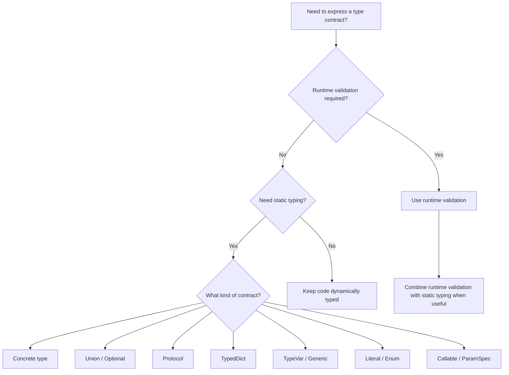

# 08- Type System

## Overview

Python is dynamically typed, but it also provides a mature static type system that can significantly improve the reliability and maintainability of backend systems.

Python type hints do not normally change runtime behavior. They provide a vocabulary for expressing contracts between functions, classes, modules, APIs, and infrastructure components.

A modern Python type system includes:

- built-in generic types;
- unions and optional values;
- type aliases;
- `TypeVar`;
- generics;
- `Callable`;
- `TypedDict`;
- `Literal`;
- `Protocol`;
- `TypeGuard`;
- overloads;
- static type checkers such as mypy and Pyright.

The important distinction is:

```text
Python Runtime
      │
      ├── Executes Python code
      └── Does not normally enforce annotations

Static Type Checker
      │
      ├── Reads annotations
      ├── Infers types
      └── Detects incompatible usage
```

Type hints therefore complement, rather than replace:

- runtime validation;
- tests;
- schema validation;
- database constraints;
- API contracts.

---

## Why Python Typing Matters in Backend Systems

As a codebase grows, the primary value of typing is reducing ambiguity.

Consider:

```python
def create_order(customer, items):
    ...
```

The contract is unclear.

A typed version communicates substantially more:

```python
def create_order(
    customer: Customer,
    items: Sequence[OrderItem],
) -> Order:
    ...
```

The caller can now understand:

- what inputs are expected;
- what abstraction is required;
- what the function returns.

Static analysis can detect many incorrect usages before the code reaches production.

---

## Static Typing vs Runtime Validation

These are different concerns.

| Concern | Type hints | Runtime validation |
|---|---|---|
| Detect incorrect code during development | Excellent | Limited |
| Protect against untrusted input | No | Yes |
| Validate HTTP requests | No | Yes |
| Validate JSON payloads | No | Yes |
| IDE autocomplete | Excellent | Limited |
| Refactoring support | Excellent | Limited |
| Database constraints | No | Yes |
| Production safety by itself | No | No |

For example:

```python
def create_customer(email: str) -> Customer:
    ...
```

does not prevent a malicious HTTP client from sending arbitrary data.

A FastAPI application may additionally use Pydantic for runtime validation.

---

## Type Annotations

Basic annotations:

```python
def get_customer(customer_id: str) -> Customer:
    ...


def delete_customer(customer_id: str) -> None:
    ...
```

Variables can also be annotated:

```python
customer: Customer
customers: list[Customer]
```

Annotations primarily communicate intended types to tools and developers.

---

## Built-in Generic Types

Modern Python supports built-in generic syntax.

Prefer:

```python
def get_customers() -> list[Customer]:
    ...
```

over older typing aliases such as:

```python
from typing import List

def get_customers() -> List[Customer]:
    ...
```

Common generic types include:

```python
list[Customer]
dict[str, Customer]
set[str]
tuple[str, int]
```

The exact syntax available depends on the Python version targeted by the project.

---

## Mutable vs Immutable Collection Types

Typing can communicate whether a function needs a mutable collection.

```python
def process_ids(ids: Sequence[str]) -> None:
    ...
```

If the function only needs iteration and indexing, `Sequence` may be more appropriate than:

```python
list[str]
```

This expresses a more general contract.

Similarly:

```python
def consume_ids(ids: Iterable[str]) -> None:
    ...
```

communicates that the function only requires iteration.

---

## Choosing the Narrowest Useful Type

Prefer the abstraction the implementation actually requires.

```python
def calculate_total(
    prices: Iterable[Decimal],
) -> Decimal:
    return sum(prices, Decimal("0"))
```

This accepts:

- lists;
- tuples;
- generators;
- database iterators;
- other iterable sources.

Using:

```python
list[Decimal]
```

would unnecessarily restrict callers.

This principle improves reuse and reduces coupling.

---

## `Optional`

`Optional[T]` means:

```text
T | None
```

Modern Python commonly expresses this as:

```python
def find_customer(
    customer_id: str,
) -> Customer | None:
    ...
```

The caller must account for the possibility of `None`.

```python
customer = find_customer(customer_id)

if customer is None:
    raise CustomerNotFoundError(customer_id)

customer.activate()
```

Do not use optional types when a missing value represents an exceptional domain condition that should instead be expressed through an exception.

---

## Union Types

A union means a value may have multiple types.

Modern syntax:

```python
str | int
```

For example:

```python
def normalize_id(value: str | int) -> str:
    return str(value)
```

Unions should represent genuine alternatives.

Avoid overly broad unions such as:

```python
str | int | float | dict | list | None
```

when a domain model could express the contract more clearly.

---

## Type Narrowing

Static analyzers can narrow a union after runtime checks.

```python
def format_customer(
    customer: Customer | None,
) -> str:
    if customer is None:
        return "unknown"

    return customer.name
```

After the `None` check, the type checker understands that `customer` is a `Customer`.

Other narrowing mechanisms include:

- `isinstance`;
- `issubclass`;
- equality checks;
- `is None`;
- `TypeGuard`;
- pattern matching.

---

## `Any`

`Any` effectively disables static type checking for a value.

```python
from typing import Any

payload: Any = load_payload()
```

Once a value is `Any`, type checkers generally allow many operations without verifying them.

This makes `Any` useful at uncertain boundaries but dangerous when it spreads through the application.

Avoid:

```python
def process(payload: Any) -> Any:
    ...
```

through core business logic unless the dynamic behavior is intentional.

---

## `Any` vs `object`

`object` means "some Python object" while preserving type-checking constraints.

```python
def log_value(value: object) -> None:
    print(value)
```

You cannot arbitrarily call methods on `object` without narrowing.

By contrast:

```python
def log_value(value: Any) -> None:
    value.some_method()
```

is permitted by static type checkers.

Use `object` when the implementation truly accepts arbitrary objects but does not need to assume their interface.

Use `Any` when dynamic typing is genuinely required.

---

## `Never`

`Never` represents a type with no possible values in the relevant type-system context.

It is useful for functions that cannot return normally.

For example:

```python
from typing import Never


def fail(message: str) -> Never:
    raise RuntimeError(message)
```

It can also help static analyzers reason about exhaustive control flow.

---

## `NoReturn`

Older code may use:

```python
from typing import NoReturn
```

for functions that never return normally.

Modern Python typing increasingly uses `Never` for this concept.

When maintaining an existing codebase, follow the project's supported Python version and typing conventions.

---

## Type Aliases

Type aliases give meaningful names to complex types.

```python
CustomerId = str
```

For more explicit aliases:

```python
from typing import TypeAlias

CustomerId: TypeAlias = str
```

A type alias does not create a new runtime type.

This:

```python
CustomerId = str
```

still means the runtime value is a `str`.

---

## `NewType`

`NewType` creates a distinct static type while retaining the underlying runtime representation.

```python
from typing import NewType

CustomerId = NewType("CustomerId", str)
OrderId = NewType("OrderId", str)
```

Now:

```python
def get_order(order_id: OrderId) -> Order:
    ...
```

A type checker can distinguish `OrderId` from `CustomerId`.

At runtime, `CustomerId("cust-123")` behaves essentially like the underlying `str`.

This is valuable for preventing accidental identifier mixing.

---

## `NewType` vs Type Alias

| Requirement | Type alias | `NewType` |
|---|---|---|
| New static distinction | No | Yes |
| Runtime wrapper type | No | No |
| Prevent ID mixing statically | No | Yes |
| Runtime overhead | None | Minimal function-like construction |
| Best for | Naming complex types | Domain identifiers |

---

## `Callable`

`Callable` describes callable objects.

```python
from collections.abc import Callable


def execute(
    operation: Callable[[Order], bool],
    order: Order,
) -> bool:
    return operation(order)
```

This is useful for:

- callbacks;
- strategies;
- dependency injection;
- hooks;
- decorators.

For a callable with no parameters:

```python
Callable[[], Result]
```

For a callable accepting one string:

```python
Callable[[str], Customer]
```

---

## Callback Contracts

Typing callbacks makes dependency injection more explicit.

```python
from collections.abc import Callable


PaymentProcessor = Callable[
    [PaymentRequest],
    PaymentResult,
]
```

Then:

```python
def process_payment(
    request: PaymentRequest,
    processor: PaymentProcessor,
) -> PaymentResult:
    return processor(request)
```

This can simplify testing because a test double only needs to satisfy the callable contract.

---

## `TypedDict`

`TypedDict` describes the expected structure of dictionary-shaped data.

```python
from typing import TypedDict


class CustomerPayload(TypedDict):
    id: str
    email: str
    active: bool
```

Usage:

```python
payload: CustomerPayload = {
    "id": "cust-123",
    "email": "customer@example.com",
    "active": True,
}
```

The runtime object is still a normal `dict`.

`TypedDict` primarily provides static structure checking.

---

## `TypedDict` for External Data

`TypedDict` is useful for known dictionary contracts such as:

- internal JSON-like structures;
- configuration objects;
- decoded API payloads;
- event envelopes.

However, it does not validate untrusted input at runtime.

For external HTTP requests, use runtime validation such as Pydantic, Django forms/serializers, or another appropriate validation layer.

---

## Required and Not Required Keys

`TypedDict` supports required and optional keys.

```python
from typing import NotRequired, TypedDict


class CustomerPayload(TypedDict):
    id: str
    email: str
    phone: NotRequired[str]
```

The key may be absent.

This is different from:

```python
phone: str | None
```

which means the key is expected to exist but its value may be `None`.

That distinction is important for API payloads.

---

## `Literal`

`Literal` restricts a value to specific constants.

```python
from typing import Literal


Environment = Literal[
    "development",
    "staging",
    "production",
]
```

Then:

```python
def configure(
    environment: Environment,
) -> None:
    ...
```

A static type checker can detect unsupported values.

`Literal` is useful for:

- modes;
- event types;
- status values;
- feature flags;
- protocol variants.

---

## `Enum` vs `Literal`

| Requirement | `Literal` | `Enum` |
|---|---|---|
| Static restriction | Excellent | Excellent |
| Runtime object | No | Yes |
| Runtime validation | No | Possible |
| Serialization | Simple underlying value | Requires deliberate handling |
| Domain semantics | Lightweight | Stronger |
| API constants | Often useful | Useful when behavior accompanies values |

Use `Literal` for small finite static contracts and `Enum` when the values form a meaningful runtime domain abstraction.

---

## `TypeVar`

`TypeVar` represents a type parameter.

```python
from typing import TypeVar

T = TypeVar("T")


def first(items: list[T]) -> T:
    return items[0]
```

If the caller passes:

```python
customers: list[Customer]
```

the return type is inferred as:

```python
Customer
```

The type variable preserves the relationship between input and output.

---

## Generic Classes

Generic classes allow reusable type-safe abstractions.

```python
from typing import Generic, TypeVar

T = TypeVar("T")


class Repository(Generic[T]):
    def get(self, item_id: str) -> T:
        ...
```

Then:

```python
customer_repository: Repository[Customer]
order_repository: Repository[Order]
```

The same repository abstraction can represent different domain types.

---

## Modern Generic Syntax

Modern Python versions support type parameter syntax that can reduce boilerplate.

For example:

```python
class Repository[T]:
    def get(self, item_id: str) -> T:
        ...
```

and:

```python
def first[T](items: list[T]) -> T:
    return items[0]
```

Use this syntax when the project's supported Python version permits it. Otherwise, `TypeVar` and `Generic` remain valid and widely supported approaches.

---

## Bounded Type Variables

A type variable can be constrained to a base type.

```python
from typing import TypeVar

T = TypeVar("T", bound=BaseModel)
```

This means `T` must be compatible with `BaseModel`.

It allows generic code to rely on the base contract while preserving the concrete subtype.

---

## Generic Repository Pattern

A backend repository can be modeled generically:

```python
from abc import ABC, abstractmethod
from typing import Generic, TypeVar

EntityT = TypeVar("EntityT")


class Repository(ABC, Generic[EntityT]):
    @abstractmethod
    def get(self, entity_id: str) -> EntityT | None:
        ...

    @abstractmethod
    def save(self, entity: EntityT) -> None:
        ...
```

Concrete implementations can specialize the type:

```python
class CustomerRepository(Repository[Customer]):
    ...
```

Typing can therefore improve correctness without requiring runtime inheritance solely for typing purposes.

---

## Protocols

`Protocol` provides structural typing.

```python
from typing import Protocol


class SupportsPublish(Protocol):
    def publish(self, topic: str, payload: bytes) -> None:
        ...
```

Any object with a compatible `publish()` method can satisfy this protocol without inheriting from it.

This is often called **duck typing with static verification**.

---

## Protocol vs ABC

| Property | Protocol | ABC |
|---|---|---|
| Typing model | Structural | Nominal |
| Explicit inheritance required | Usually no | Usually yes |
| Runtime abstraction | Optional | Yes |
| Useful for external implementations | Excellent | Less flexible |
| Dependency inversion | Excellent | Excellent |
| Static verification | Excellent | Excellent |

Protocols are particularly useful for infrastructure abstractions.

---

## Protocol-Based Dependency Injection

Instead of coupling a service to a concrete Redis client:

```python
class CustomerCache:
    def __init__(self, redis_client: RedisClient):
        self.redis_client = redis_client
```

define the required behavior:

```python
class Cache(Protocol):
    def get(self, key: str) -> bytes | None:
        ...

    def set(self, key: str, value: bytes, ttl: int) -> None:
        ...
```

Then:

```python
class CustomerService:
    def __init__(self, cache: Cache):
        self.cache = cache
```

Both production and test implementations can satisfy the protocol.

This reduces coupling and improves testability.

---

## Protocols and Third-Party Libraries

Protocols are especially valuable when you do not control the implementation.

For example, a service may only require:

```python
class ObjectStore(Protocol):
    def put(self, key: str, data: bytes) -> None:
        ...
```

The implementation could be:

- AWS S3 client;
- local filesystem adapter;
- test fake;
- MinIO adapter.

The application depends on behavior rather than vendor-specific classes.

---

## `TypeGuard`

`TypeGuard` communicates that a function performs a type-narrowing check.

```python
from typing import TypeGuard


def is_customer(value: object) -> TypeGuard[Customer]:
    return isinstance(value, Customer)
```

Then:

```python
value: object

if is_customer(value):
    value.activate()
```

The type checker understands that `value` is a `Customer` inside the branch.

This is useful for reusable validation and parsing logic.

---

## Runtime Validation vs TypeGuard

`TypeGuard` affects static analysis.

It does not magically validate malformed external data.

For example:

```python
def is_customer(value: object) -> TypeGuard[Customer]:
    return isinstance(value, Customer)
```

works because `Customer` is an actual runtime class.

For arbitrary JSON structures, use runtime validation first.

---

## Overloads

`@overload` describes multiple valid call signatures for a function.

```python
from typing import overload


@overload
def get_value(key: str) -> str:
    ...


@overload
def get_value(key: int) -> int:
    ...


def get_value(key: str | int) -> str | int:
    ...
```

The implementation must support all declared overloads.

Overloads are primarily for static type checkers.

---

## When to Use Overloads

Use overloads when return types depend on input types and the relationship cannot be expressed clearly through a simple union.

A classic example is APIs where:

```text
input type A → output type X
input type B → output type Y
```

Avoid excessive overloads that make an API harder to understand.

---

## Type Inference

Modern type checkers can infer many types.

```python
customer = Customer(...)
```

does not normally require:

```python
customer: Customer = Customer(...)
```

Likewise:

```python
customers = []
```

may need an annotation if the intended element type cannot be inferred.

Prefer inference where it is clear.

Add annotations where they improve:

- public API contracts;
- ambiguous variables;
- complex transformations;
- domain boundaries.

---

## Static Type Checking

A type checker analyzes source code without executing the application in the normal case.

Common choices include:

- mypy;
- Pyright;
- basedpyright.

Typical workflow:

```text
Developer writes code
        │
        ▼
Type checker
        │
        ├── incompatible assignment
        ├── invalid attribute access
        ├── wrong function argument
        └── incompatible return value
        │
        ▼
Fix before merge
```

Typing is therefore particularly valuable in CI/CD.

---

## Mypy

A typical command:

```bash
python -m mypy src/
```

Configuration can be placed in project configuration such as `pyproject.toml`.

Example:

```toml
[tool.mypy]
python_version = "3.13"
strict = true
```

The exact configuration should reflect project maturity and dependency compatibility.

---

## Pyright

Pyright provides another static type-checking implementation and integrates well with editors.

A typical CLI invocation is:

```bash
pyright
```

A project may configure it through:

```toml
[tool.pyright]
include = ["src", "tests"]
typeCheckingMode = "strict"
```

Use one primary checker consistently unless there is a deliberate reason to use multiple tools.

---

## Strict Typing

A mature backend codebase can progressively increase type-checking strictness.

```text
No typing
   │
   ▼
Public interfaces typed
   │
   ▼
Core services typed
   │
   ▼
Infrastructure typed
   │
   ▼
Strict CI enforcement
```

Do not treat strict typing as an all-or-nothing migration.

Incremental adoption usually has a lower engineering cost.

---

## Typing and CI/CD

Type checking should run before deployment.

Example pipeline:

```text
Pull Request
    │
    ├── Formatting
    ├── Linting
    ├── Type checking
    ├── Unit tests
    └── Integration tests
          │
          ▼
       Merge
          │
          ▼
      Deployment
```

A type-checking failure should normally block merging when the project has adopted typing as a correctness contract.

---

## Type Checking and Tests

Static typing and tests catch different classes of problems.

| Tool | Primary purpose |
|---|---|
| Type checker | Static contract violations |
| Unit tests | Behavioral correctness |
| Integration tests | Component interaction |
| API tests | External contract behavior |
| Runtime validation | Untrusted input validation |
| Database constraints | Persistent data integrity |

Do not remove tests merely because code is fully typed.

---

## Type Hints Do Not Enforce Runtime Types

This code is valid Python:

```python
def add(a: int, b: int) -> int:
    return a + b
```

Python itself does not normally reject:

```python
add("10", "20")
```

The type checker can flag the call, but runtime enforcement requires explicit validation.

This distinction is critical at boundaries such as:

- HTTP requests;
- Kafka messages;
- CLI input;
- environment variables;
- JSON;
- database records;
- third-party APIs.

---

## Pydantic and Type Hints

Frameworks such as FastAPI commonly combine type annotations with runtime validation.

```python
from pydantic import BaseModel


class CreateCustomerRequest(BaseModel):
    email: str
    name: str
```

The type annotation communicates the expected structure while Pydantic validates incoming data at runtime.

This provides:

```text
External JSON
     │
     ▼
Runtime validation
     │
     ▼
Typed application object
     │
     ▼
Service layer
```

Static typing and runtime validation therefore complement each other.

---

## Typed API Boundaries

A robust API architecture can separate transport and domain models.

```python
class CreateCustomerRequest(BaseModel):
    email: str
    name: str


@dataclass(frozen=True)
class CreateCustomerCommand:
    email: str
    name: str
```

The transport model handles external validation.

The domain/application model represents internal business semantics.

This avoids allowing framework-specific request objects to spread throughout the service layer.

---

## Typed Configuration

Environment variables are strings at runtime.

```python
port = os.getenv("PORT")
```

Typing does not automatically convert the value.

A configuration layer should perform parsing and validation:

```python
from pydantic_settings import BaseSettings


class Settings(BaseSettings):
    port: int = 8000
    database_url: str
    debug: bool = False
```

This creates a clear boundary between:

```text
Environment
    │
    ▼
Parse + validate
    │
    ▼
Typed Settings
    │
    ▼
Application
```

---

## Typed Event Contracts

Kafka or other messaging systems benefit from explicit event models.

```python
from dataclasses import dataclass


@dataclass(frozen=True)
class CustomerCreated:
    event_id: str
    customer_id: str
    occurred_at: datetime
```

Serialization and deserialization remain runtime concerns, but the application now has a clear internal contract.

For production event systems, also consider:

- schema versioning;
- compatibility;
- validation;
- idempotency;
- dead-letter handling.

---

## Variance

Variance describes how generic types relate when their type parameters are related.

The three concepts are:

- covariance;
- contravariance;
- invariance.

For most application developers, the key practical rule is that mutable containers such as:

```python
list[T]
```

are invariant.

For example, a `list[Dog]` is not generally interchangeable with a `list[Animal]`, because the receiving code could insert a `Cat`.

This prevents unsound mutations.

---

## Covariance

A covariant abstraction can safely substitute a more specific type where a more general type is expected.

Read-only producers are natural candidates.

Conceptually:

```text
Producer[Dog]
    │
    ▼
Producer[Animal]
```

because consumers only receive values.

`Sequence[T]` is designed with covariance in its element type.

---

## Contravariance

Contravariance commonly applies to consumers.

Conceptually:

```text
Consumer[Animal]
    │
    ▼
Consumer[Dog]
```

A function capable of consuming any `Animal` can safely consume a `Dog`.

This matters when designing generic callback and protocol interfaces.

---

## Invariance

Mutable collections are commonly invariant.

```text
list[Dog] ≠ list[Animal]
```

from the perspective of safe static substitution.

This prevents type unsoundness caused by mutation.

---

## `Protocol` and Variance

Protocols with generic type parameters may need explicit variance depending on how the type parameter is used.

For example, a producer that only returns `T` can often be covariant, while a consumer that only accepts `T` can often be contravariant.

This becomes relevant when designing reusable library abstractions rather than ordinary application models.

---

## Type System and Dataclasses

Type annotations work naturally with dataclasses.

```python
from dataclasses import dataclass


@dataclass(frozen=True)
class Customer:
    id: str
    email: str
    active: bool
```

The type annotations communicate the data contract.

`frozen=True` adds runtime immutability semantics to the generated dataclass operations, while typing describes expected types.

These are separate mechanisms.

---

## Type System and Dependency Injection

Typing is particularly useful for dependency injection.

```python
class PaymentGateway(Protocol):
    def charge(
        self,
        request: PaymentRequest,
    ) -> PaymentResult:
        ...


class PaymentService:
    def __init__(self, gateway: PaymentGateway):
        self.gateway = gateway
```

The service depends on a behavioral contract rather than a concrete infrastructure implementation.

This supports:

- unit testing;
- multiple implementations;
- vendor replacement;
- clearer architecture.

---

## Type System and Repository Pattern

A repository interface can be expressed using a protocol:

```python
class CustomerRepository(Protocol):
    def get(self, customer_id: str) -> Customer | None:
        ...

    def save(self, customer: Customer) -> None:
        ...
```

The service can then depend on:

```python
class CustomerService:
    def __init__(self, repository: CustomerRepository):
        self.repository = repository
```

The production repository may use PostgreSQL while tests use an in-memory fake.

---

## Type System and Async Code

Typing is also important for asynchronous APIs.

```python
from collections.abc import Awaitable, Callable


Operation = Callable[
    [str],
    Awaitable[Customer],
]
```

This communicates that calling the operation produces an awaitable customer result.

Modern type checkers can also infer many async return types automatically.

The important distinction remains:

```python
async def fetch_customer(...) -> Customer:
    ...
```

The function's eventual result is a `Customer`, while calling the function produces a coroutine object that must be awaited or scheduled.

---

## Type System and Decorators

Decorators can make typing difficult because a wrapper may change the callable's signature.

A basic decorator:

```python
from collections.abc import Callable
from functools import wraps
from typing import Any


def logged(
    function: Callable[..., Any],
) -> Callable[..., Any]:
    @wraps(function)
    def wrapper(*args: Any, **kwargs: Any) -> Any:
        logger.info("calling %s", function.__name__)
        return function(*args, **kwargs)

    return wrapper
```

works, but loses precise input/output relationships.

For reusable libraries, advanced typing techniques such as `ParamSpec` and `TypeVar` can preserve callable signatures.

---

## `ParamSpec`

`ParamSpec` represents the parameter specification of another callable.

```python
from collections.abc import Callable
from functools import wraps
from typing import ParamSpec, TypeVar

P = ParamSpec("P")
R = TypeVar("R")


def logged(
    function: Callable[P, R],
) -> Callable[P, R]:
    @wraps(function)
    def wrapper(*args: P.args, **kwargs: P.kwargs) -> R:
        logger.info("calling %s", function.__name__)
        return function(*args, **kwargs)

    return wrapper
```

This preserves the relationship between the wrapped function's parameters and the wrapper's parameters.

`ParamSpec` is particularly useful for:

- decorators;
- middleware;
- callback wrappers;
- higher-order functions.

---

## `Concatenate`

`Concatenate` can model decorators that add parameters.

For example, an infrastructure decorator may inject a request context.

The exact design should be used only when the relationship genuinely needs to be represented. Overly sophisticated type signatures can make code harder to maintain.

---

## Type System and Generators

Generators can have separate input and output typing concepts.

A generator may be typed with:

```python
from collections.abc import Iterator


def customer_ids(
    customers: Iterable[Customer],
) -> Iterator[str]:
    for customer in customers:
        yield customer.id
```

For advanced generator protocol interactions involving `.send()` and `.throw()`, `Generator[YieldType, SendType, ReturnType]` can express all three dimensions.

For ordinary iteration, `Iterator[T]` is usually simpler.

---

## Type System and Context Managers

Context managers can be typed using `ContextManager` or explicit protocols.

```python
from collections.abc import Iterator
from contextlib import contextmanager


@contextmanager
def transaction(connection: Connection) -> Iterator[Connection]:
    try:
        yield connection
        connection.commit()
    except Exception:
        connection.rollback()
        raise
```

The yielded value is a `Connection`, while the context manager handles the lifecycle.

---

## Type System and Structural Design

Typing can reinforce architectural boundaries.

A useful backend design is:

```text
Transport Models
       │
       ▼
Application Commands
       │
       ▼
Domain Services
       │
       ├── Repository Protocol
       ├── Cache Protocol
       └── Gateway Protocol
       │
       ▼
Infrastructure Implementations
       │
       ├── PostgreSQL
       ├── Redis
       ├── Kafka
       └── AWS
```

Protocols allow upper layers to depend on behavior rather than infrastructure classes.

---

## Performance Considerations

Type annotations generally have little impact on normal runtime execution because Python does not normally perform static type checking during execution.

However, typing-related tooling can affect:

- CI duration;
- editor analysis;
- build pipelines.

At runtime, frameworks that inspect annotations may perform additional work.

Examples include:

- FastAPI dependency resolution;
- Pydantic model construction;
- serialization frameworks;
- dependency injection frameworks.

This runtime overhead comes from the framework's processing, not from static typing itself.

---

## Memory Considerations

Annotations can be stored as function or class metadata.

For typical backend applications, this overhead is small.

Large frameworks or generated models may create substantial metadata, but optimization should be based on profiling rather than removing useful annotations prematurely.

---

## Security Considerations

Typing is not a security boundary.

This is unsafe as an assumption:

```python
def execute_command(command: AdminCommand) -> None:
    ...
```

The annotation does not prove that an external caller actually supplied a valid `AdminCommand`.

Security-sensitive boundaries require runtime enforcement:

- authentication;
- authorization;
- input validation;
- schema validation;
- database constraints.

Treat type annotations as developer and tooling contracts, not authorization mechanisms.

---

## Production Best Practices

### Type Public Interfaces

Prioritize:

- service interfaces;
- repository interfaces;
- public library APIs;
- configuration objects;
- event models;
- API models.

### Avoid Type Noise

Do not annotate every obvious local variable.

Prefer:

```python
customer = Customer(...)
```

over:

```python
customer: Customer = Customer(...)
```

unless the annotation adds useful information.

### Minimize `Any`

Contain dynamic areas instead of allowing `Any` to spread through the application.

### Prefer Protocols for Behavioral Dependencies

Use structural contracts when concrete inheritance is unnecessary.

### Type at Boundaries

Strong typing is especially valuable at:

```text
API
Database
Message Broker
External Service
Configuration
```

### Keep Runtime Validation Separate

Use Pydantic, Django validation, database constraints, or other appropriate runtime mechanisms where actual validation is required.

---

## Common Mistakes

| Mistake | Problem | Better approach |
|---|---|---|
| Using `Any` everywhere | Removes static guarantees | Type the boundary and narrow unknown values |
| Assuming annotations enforce runtime types | False security/correctness assumption | Validate untrusted input |
| Overusing concrete types | Unnecessary coupling | Use suitable abstractions |
| Over-annotating obvious locals | Adds noise | Let inference work |
| Using `list[T]` unnecessarily | Restricts callers | Use `Sequence` or `Iterable` when appropriate |
| Confusing `TypedDict` with validation | Runtime dictionary remains unchecked | Validate external data |
| Ignoring `None` | Runtime `AttributeError` risk | Narrow optional values |
| Excessive overloads | Complex API contracts | Prefer simpler types when possible |
| Typing infrastructure classes directly | Tight coupling | Use Protocols where appropriate |
| Ignoring type-checking CI | Type errors reach production | Enforce checking in CI |

---

## Interview Traps

### Are Python Type Hints Enforced at Runtime?

Normally no. They are primarily metadata consumed by static analyzers and development tools.

### What Is `Any`?

`Any` tells the type checker to largely stop enforcing constraints for that value.

### What Is the Difference Between `Any` and `object`?

`object` accepts any object but requires narrowing before type-specific operations. `Any` permits operations without static verification.

### What Is a `Protocol`?

A structural interface. A class can satisfy it by implementing the required members without explicitly inheriting from the protocol.

### `Protocol` vs ABC?

ABC uses nominal inheritance; Protocol uses structural compatibility for static typing.

### What Is `TypeVar`?

A type parameter that preserves relationships between input and output types.

### What Is `TypedDict`?

A static description of the expected keys and value types of a dictionary-shaped object. It does not itself perform runtime validation.

### What Does `Literal` Do?

Restricts a type to specified literal values.

### What Is `TypeGuard`?

A function return annotation that tells a static analyzer a successful boolean check narrows the checked value to a specified type.

### Why Is `list[Dog]` Not a `list[Animal]`?

Because lists are mutable. Treating `list[Dog]` as `list[Animal]` could allow inserting an `Animal` that is not a `Dog`.

### Why Use `Protocol` for Dependency Injection?

It allows the service to depend on behavior rather than a concrete implementation, improving testability and reducing coupling.

---

## Senior-Level Interview Questions

### How Would You Introduce Typing into a Large Python Codebase?

Use incremental adoption:

```text
Existing dynamic code
        │
        ▼
Type public interfaces
        │
        ▼
Type domain/application layer
        │
        ▼
Type infrastructure boundaries
        │
        ▼
Reduce Any
        │
        ▼
Increase strictness
        │
        ▼
Enforce in CI
```

Avoid attempting a complete rewrite solely for typing.

Prioritize code that is:

- business-critical;
- frequently changed;
- difficult to understand;
- heavily shared;
- infrastructure-sensitive.

---

### How Would You Type a Service That Depends on Redis?

Define only the required behavior:

```python
class Cache(Protocol):
    def get(self, key: str) -> bytes | None:
        ...

    def set(self, key: str, value: bytes, ttl: int) -> None:
        ...
```

Then inject it:

```python
class CustomerService:
    def __init__(self, cache: Cache):
        self.cache = cache
```

The service does not need to know whether the implementation uses Redis, an in-memory cache, or a test fake.

---

### How Would You Type a Decorator Without Losing the Function Signature?

Use `ParamSpec` and `TypeVar`:

```python
P = ParamSpec("P")
R = TypeVar("R")


def decorator(
    function: Callable[P, R],
) -> Callable[P, R]:
    ...
```

This preserves the relationship between the original callable's parameters and return type.

---

### How Would You Handle Untrusted JSON with Python Typing?

Do not rely on annotations alone.

Use:

```text
JSON
 │
 ▼
Runtime validation
 │
 ▼
Validated model
 │
 ▼
Typed domain/application object
 │
 ▼
Business logic
```

For FastAPI applications, Pydantic models are a common solution.

---

### How Would You Type an API Response with Multiple Shapes?

First determine whether the shapes represent:

- genuine variants;
- versioned schemas;
- optional fields;
- polymorphic domain objects.

Possible approaches include:

- discriminated unions;
- `TypedDict`;
- Pydantic models;
- `Protocol`;
- `Literal`;
- explicit domain classes.

Choose the representation that best expresses the runtime contract.

---

### How Does Typing Improve Microservice Development?

Strong internal typing can reduce ambiguity in service code, while explicit runtime schemas handle the network boundary.

A robust architecture distinguishes:

```text
Static application contract
        +
Runtime network contract
        +
Backward-compatible schema evolution
```

Typing does not replace API compatibility testing or event schema management.

---

## Type Checking Configuration Strategy

A production project can centralize configuration in `pyproject.toml`.

Example:

```toml
[tool.pyright]
include = ["src", "tests"]
typeCheckingMode = "strict"

[tool.mypy]
python_version = "3.13"
strict = true
```

Avoid configuring multiple checkers with conflicting assumptions unless the project has a clear reason to do so.

Whichever checker is selected should be:

- version-controlled;
- reproducible in CI;
- run against the same supported Python versions;
- reviewed as part of dependency upgrades.

---

## Type System Decision Guide



---

## Production Checklist

### Type Design

- [ ] Are public interfaces typed?
- [ ] Are domain models typed?
- [ ] Are `None` cases explicit?
- [ ] Are collection abstractions appropriately general?
- [ ] Are `Any` usages intentional?
- [ ] Are external dependencies abstracted with Protocols where useful?

### Runtime Boundaries

- [ ] Is external input validated?
- [ ] Are API payloads validated?
- [ ] Are Kafka/event messages validated?
- [ ] Are environment variables parsed?
- [ ] Are database constraints used for actual integrity?

### Tooling

- [ ] Is a type checker configured?
- [ ] Does CI run it?
- [ ] Is the Python version pinned consistently?
- [ ] Are third-party stubs/type metadata available?
- [ ] Are type-checking failures treated appropriately in CI?

### Maintainability

- [ ] Does typing clarify rather than obscure the design?
- [ ] Are abstractions based on actual behavior?
- [ ] Are generic types used only where they add value?
- [ ] Are complex type expressions documented when necessary?
- [ ] Are type contracts kept aligned with runtime behavior?

---

## Key Takeaways

- **Python typing is primarily a static contract system:** annotations improve correctness, IDE support, refactoring, and maintainability but normally do not enforce types at runtime.
- **Type at architectural boundaries:** service interfaces, repositories, configuration, API models, event contracts, and infrastructure abstractions benefit most from explicit contracts.
- **Use the right typing abstraction:** `Protocol` for behavioral contracts, `TypedDict` for dictionary shapes, `TypeVar` and generics for reusable relationships, `Literal` for finite values, and `ParamSpec` for type-safe decorators.
- **Static typing does not replace runtime validation:** untrusted HTTP requests, Kafka messages, configuration, and external API data still require explicit validation and security enforcement.
- **Adopt typing incrementally and enforce it through tooling:** combine type checking with tests, linting, runtime validation, database constraints, and CI/CD rather than treating typing as a replacement for them.