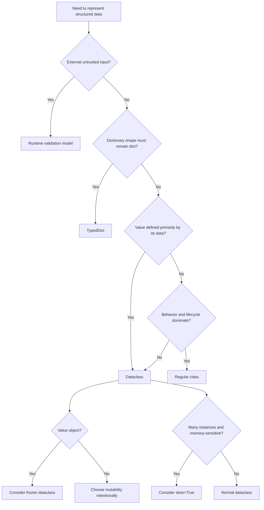

# 09- Dataclasses and Data Modeling

## Overview

Python dataclasses provide a concise way to define classes whose primary purpose is representing structured data.

They are particularly useful for backend engineering because many application components need explicit data models:

- domain objects;
- commands and queries;
- DTOs;
- configuration objects;
- event payloads;
- value objects;
- service-layer results;
- internal application state.

A dataclass reduces boilerplate for common operations such as:

- `__init__`;
- `__repr__`;
- equality;
- ordering;
- default handling.

However, a dataclass is not automatically a domain model, DTO, validation model, or database model. Those concerns should be deliberately separated.

A useful architectural view is:

```text
External Request
      │
      ▼
Runtime Validation Model
      │
      ▼
Application / Domain Model
      │
      ├── Value Objects
      ├── Commands
      ├── Domain Entities
      └── Domain Results
      │
      ▼
Persistence Model
      │
      ▼
PostgreSQL / Redis / Other Storage
```

Dataclasses are often an excellent implementation mechanism for the application/domain layer, but the appropriate model depends on the responsibility being represented.

---

## What Is a Dataclass?

A dataclass is a class transformed by the `dataclasses` module to automatically generate common data-oriented methods.

```python
from dataclasses import dataclass


@dataclass
class Customer:
    id: str
    email: str
    active: bool
```

Python generates an initializer roughly equivalent to:

```python
def __init__(
    self,
    id: str,
    email: str,
    active: bool,
):
    self.id = id
    self.email = email
    self.active = active
```

It can also generate methods such as `__repr__` and `__eq__`, depending on configuration.

---

## Why Dataclasses Exist

Before dataclasses, data-oriented classes often required significant boilerplate.

```python
class Customer:
    def __init__(self, id, email, active):
        self.id = id
        self.email = email
        self.active = active

    def __repr__(self):
        return (
            f"Customer("
            f"id={self.id!r}, "
            f"email={self.email!r}, "
            f"active={self.active!r})"
        )

    def __eq__(self, other):
        if not isinstance(other, Customer):
            return NotImplemented

        return (
            self.id == other.id
            and self.email == other.email
            and self.active == other.active
        )
```

A dataclass expresses the same intent more directly:

```python
@dataclass
class Customer:
    id: str
    email: str
    active: bool
```

The main value is reducing repetitive implementation while retaining normal Python class semantics.

---

## Dataclass Internals

`@dataclass` is itself a class decorator.

Conceptually:

```text
Class definition
      │
      ▼
@dataclass
      │
      ▼
Inspect annotations
      │
      ├── fields
      ├── defaults
      └── configuration
      │
      ▼
Generate selected methods
      │
      ▼
Return modified class
```

The decorator does not create a fundamentally different kind of Python object.

A dataclass remains a normal Python class.

---

## Dataclass Fields

Fields are generally discovered from annotated class attributes.

```python
@dataclass
class Order:
    id: str
    customer_id: str
    total: Decimal
```

The annotations define the dataclass fields.

An unannotated attribute is not treated as a normal dataclass field:

```python
@dataclass
class Order:
    id: str
    created_at: datetime

    source = "api"
```

`source` is a class attribute rather than a generated instance field.

---

## Generated `__init__`

By default, dataclasses generate an initializer.

```python
@dataclass
class Order:
    id: str
    total: Decimal
```

Usage:

```python
order = Order(
    id="ord-123",
    total=Decimal("99.00"),
)
```

The generated constructor follows field declaration order.

---

## Field Defaults

Fields can have defaults:

```python
@dataclass
class Customer:
    id: str
    email: str
    active: bool = True
```

Fields without defaults must generally appear before fields with defaults.

This is analogous to ordinary Python function parameter rules.

---

## `default_factory`

Never use a mutable object directly as a shared default.

Avoid:

```python
@dataclass
class Order:
    tags: list[str] = []
```

Use `default_factory`:

```python
from dataclasses import dataclass, field


@dataclass
class Order:
    tags: list[str] = field(default_factory=list)
```

Each instance receives a separate list.

Conceptually:

```text
Order A ──► tags list A

Order B ──► tags list B
```

rather than:

```text
Order A ──┐
          ├──► shared tags list
Order B ──┘
```

---

## Default Factory for Dictionaries and Sets

The same rule applies to other mutable containers.

```python
@dataclass
class RequestContext:
    metadata: dict[str, str] = field(default_factory=dict)
    permissions: set[str] = field(default_factory=set)
```

Each instance receives independent containers.

---

## `field()`

`field()` provides fine-grained control over dataclass fields.

Common parameters include:

- `default`;
- `default_factory`;
- `init`;
- `repr`;
- `compare`;
- `hash`;
- `metadata`;
- `kw_only`.

Example:

```python
@dataclass
class Customer:
    id: str
    email: str
    password_hash: str = field(repr=False)
```

This prevents the password hash from appearing in the generated representation.

---

## Avoid Sensitive Data in `repr`

Generated `__repr__` is convenient for debugging but can leak sensitive information.

Avoid:

```python
@dataclass
class Credentials:
    username: str
    password: str
```

The generated representation could expose the password.

Prefer:

```python
@dataclass
class Credentials:
    username: str
    password: str = field(repr=False)
```

Better still, avoid storing plaintext credentials in application objects whenever possible.

---

## `__repr__`

Dataclasses normally generate a useful representation:

```python
Customer(
    id='cust-123',
    email='customer@example.com',
    active=True
)
```

This helps debugging and logging.

However, `repr` should never be treated as a security boundary.

Audit fields containing:

- tokens;
- passwords;
- API keys;
- secrets;
- sensitive personal data.

---

## Equality

By default, dataclasses can generate `__eq__`.

```python
@dataclass
class Customer:
    id: str
    email: str
```

Then:

```python
Customer("cust-1", "a@example.com") == Customer(
    "cust-1",
    "a@example.com",
)
```

is `True`.

The generated equality is field-based.

This may or may not match domain identity.

---

## Entity Identity vs Value Equality

This distinction is important in domain modeling.

A value object is usually defined by its values:

```python
@dataclass(frozen=True)
class Money:
    amount: Decimal
    currency: str
```

Two equal `Money` objects represent the same value.

An entity may instead be identified by a stable identifier:

```python
@dataclass
class Customer:
    id: str
    email: str
```

Two customer objects with the same ID may represent the same domain entity even if other fields differ.

Do not blindly rely on generated equality for entity identity.

---

## `frozen=True`

A frozen dataclass prevents normal field reassignment.

```python
@dataclass(frozen=True)
class Money:
    amount: Decimal
    currency: str
```

This is useful for immutable value objects.

```python
money = Money(
    amount=Decimal("10.00"),
    currency="USD",
)

money.amount = Decimal("20.00")
```

This raises `FrozenInstanceError`.

---

## Frozen Does Not Mean Deeply Immutable

`frozen=True` prevents assignment to dataclass fields through normal attribute assignment.

It does not recursively freeze referenced mutable objects.

For example:

```python
@dataclass(frozen=True)
class Configuration:
    options: dict[str, str]
```

The `options` dictionary remains mutable.

Therefore:

```text
Frozen object
    │
    ├── immutable scalar ── safe
    │
    └── mutable object ─── still mutable
```

Use immutable field types when deep immutability matters.

---

## Frozen Dataclasses and Hashing

Frozen dataclasses can be hashable under appropriate configuration because immutable instances are suitable for use as dictionary keys or set members.

However, hashability must reflect actual immutability.

Avoid including mutable state in objects intended to be safely hashable.

The general hash contract remains:

> Objects that compare equal must have equal hashes.

---

## `slots=True`

Modern dataclasses support slots:

```python
@dataclass(slots=True)
class Customer:
    id: str
    email: str
```

This creates a slotted class and can reduce per-instance memory overhead by avoiding a normal instance `__dict__`.

It can also prevent arbitrary new instance attributes.

```python
customer = Customer(
    id="cust-1",
    email="a@example.com",
)

customer.debug = True
```

This is not allowed when the slots configuration does not provide such an attribute.

---

## When to Use `slots=True`

Slots can be useful when:

- there are many instances;
- object memory is measurable as a problem;
- attribute shape is stable;
- dynamic attributes are unnecessary.

They are not automatically beneficial for every class.

Consider compatibility with:

- inheritance;
- frameworks;
- serialization;
- pickling;
- weak references;
- debugging tools.

Use profiling to justify memory-oriented optimizations.

---

## `weakref_slot`

Slotted classes do not necessarily support weak references unless a weak-reference slot is included.

When required:

```python
@dataclass(slots=True, weakref_slot=True)
class Customer:
    id: str
```

Use this only when weak-reference support is actually needed.

---

## Dataclass Inheritance

Dataclasses can participate in inheritance.

```python
@dataclass
class Entity:
    id: str


@dataclass
class Customer(Entity):
    email: str
```

The generated initializer includes inherited fields according to dataclass field ordering rules.

Inheritance involving defaults requires particular care because non-default fields cannot generally follow default fields in the generated constructor.

Composition is often simpler for domain models when inheritance does not express a genuine subtype relationship.

---

## `kw_only=True`

Keyword-only fields can improve API clarity.

```python
@dataclass
class CreateCustomer:
    email: str
    name: str
    active: bool = True
```

A broader class can make configuration fields keyword-only:

```python
@dataclass(kw_only=True)
class ServiceConfig:
    timeout_seconds: float
    retries: int = 3
```

Usage:

```python
config = ServiceConfig(
    timeout_seconds=5.0,
    retries=3,
)
```

This reduces accidental argument ordering mistakes.

---

## `__post_init__`

`__post_init__()` runs after the generated `__init__()`.

```python
@dataclass
class Customer:
    email: str

    def __post_init__(self):
        self.email = self.email.strip().lower()
```

This is useful for derived initialization and lightweight invariants.

However, avoid turning `__post_init__()` into a hidden service layer.

It should not unexpectedly:

- call external APIs;
- access databases;
- perform network I/O;
- publish messages.

Object construction should remain predictable.

---

## Derived Fields

A field can be excluded from the initializer and computed afterward.

```python
@dataclass
class Order:
    subtotal: Decimal
    tax: Decimal
    total: Decimal = field(init=False)

    def __post_init__(self):
        self.total = self.subtotal + self.tax
```

This makes `total` derived rather than caller-supplied.

For more complex invariants, explicit domain methods may be clearer.

---

## Validation in Dataclasses

Dataclasses do not automatically validate types or business rules.

This:

```python
@dataclass
class Customer:
    age: int
```

does not prevent:

```python
Customer(age="invalid")
```

unless application code performs validation.

For simple invariants:

```python
@dataclass
class Percentage:
    value: int

    def __post_init__(self):
        if not 0 <= self.value <= 100:
            raise ValueError("percentage must be between 0 and 100")
```

For external input, prefer dedicated runtime validation models.

---

## Dataclass vs Pydantic Model

| Concern | Dataclass | Pydantic model |
|---|---|---|
| Data-oriented Python object | Excellent | Excellent |
| Runtime validation | Manual | Built-in |
| External API payloads | Possible | Excellent |
| Serialization | Manual/tools | Strong support |
| Domain models | Excellent | Possible |
| Framework integration | General | Strong in FastAPI |
| Type coercion | No automatic validation | Configurable |
| Lightweight | Usually | More runtime machinery |

A common architecture is:

```text
HTTP JSON
   │
   ▼
Pydantic Request Model
   │
   ▼
Dataclass / Domain Model
   │
   ▼
Service
```

This separates external validation from internal domain representation.

---

## Dataclass vs NamedTuple

`NamedTuple` creates tuple-like immutable records.

```python
from typing import NamedTuple


class Coordinate(NamedTuple):
    latitude: float
    longitude: float
```

Dataclasses provide richer object semantics and are generally more suitable when the model may eventually gain behavior.

| Requirement | Dataclass | NamedTuple |
|---|---|---|
| Mutable by default | Yes | No |
| Named fields | Yes | Yes |
| Methods | Yes | Yes |
| Tuple behavior | No | Yes |
| Rich configuration | Excellent | Limited |
| Domain modeling | Excellent | Useful for compact records |

---

## Dataclass vs TypedDict

`TypedDict` describes dictionary-shaped data.

```python
class CustomerPayload(TypedDict):
    id: str
    email: str
```

A dataclass creates an actual class instance:

```python
@dataclass
class Customer:
    id: str
    email: str
```

Use `TypedDict` when the runtime representation must remain a dictionary.

Use a dataclass when a domain object with behavior, identity, or lifecycle is more appropriate.

---

## Dataclass vs ORM Model

A PostgreSQL ORM model represents persistence concerns.

A dataclass can represent application/domain concerns.

For example:

```text
PostgreSQL
    │
    ▼
ORM Model
    │
    ▼
Mapping
    │
    ▼
Domain Dataclass
    │
    ▼
Service Logic
```

Keeping these models separate can reduce coupling between business logic and persistence frameworks.

However, a separate domain model is not mandatory for every CRUD application. The additional mapping layer should be justified by domain complexity and architectural requirements.

---

## DTOs

A Data Transfer Object represents data crossing an application boundary.

```python
@dataclass(frozen=True)
class CustomerResponse:
    id: str
    email: str
    display_name: str
```

DTOs are useful when the transport representation should differ from the domain model.

For example:

```text
Domain Customer
      │
      ▼
Response DTO
      │
      ▼
JSON
```

This prevents internal domain state from automatically becoming part of the public API.

---

## Command Objects

Dataclasses are useful for application commands.

```python
@dataclass(frozen=True)
class CreateCustomerCommand:
    email: str
    name: str
```

The application service can accept:

```python
def create_customer(
    command: CreateCustomerCommand,
) -> Customer:
    ...
```

This makes the use-case boundary explicit.

---

## Query Objects

Complex query parameters can also be modeled.

```python
@dataclass(frozen=True)
class CustomerSearch:
    email: str | None = None
    active: bool | None = None
    limit: int = 100
```

This can be cleaner than passing many loosely related parameters.

---

## Value Objects

Value objects represent concepts whose identity is determined by their values.

Examples include:

- money;
- email addresses;
- coordinates;
- date ranges;
- percentages;
- identifiers with domain semantics.

Example:

```python
@dataclass(frozen=True)
class Money:
    amount: Decimal
    currency: str

    def add(self, other: "Money") -> "Money":
        if self.currency != other.currency:
            raise ValueError("currency mismatch")

        return Money(
            amount=self.amount + other.amount,
            currency=self.currency,
        )
```

Immutability is often desirable for value objects.

---

## Domain Entities

Entities have identity and lifecycle.

```python
@dataclass
class Order:
    id: str
    status: str

    def cancel(self) -> None:
        if self.status == "shipped":
            raise OrderStateError(
                "shipped orders cannot be cancelled"
            )

        self.status = "cancelled"
```

The dataclass stores state while domain methods enforce behavior.

This is more useful than treating every dataclass as a passive data container.

---

## Anemic Domain Models

An anemic model contains mostly fields and pushes all behavior into services.

```python
@dataclass
class Order:
    id: str
    status: str
```

Then:

```python
class OrderService:
    def cancel(self, order: Order):
        ...
```

This can be perfectly reasonable for simple CRUD-oriented systems.

However, if domain invariants become complex, keeping important behavior close to the state it protects can improve consistency.

Do not force rich domain models where the domain does not require them.

---

## Dataclass Methods

Dataclasses can contain normal methods.

```python
@dataclass
class RetryPolicy:
    max_attempts: int
    backoff_seconds: float

    def delay_for(self, attempt: int) -> float:
        return self.backoff_seconds * (2 ** attempt)
```

A dataclass is not limited to passive data.

The key question is whether the class primarily represents structured state.

---

## `ClassVar`

Use `ClassVar` for class-level data that should not become a dataclass field.

```python
from typing import ClassVar


@dataclass
class Customer:
    id: str
    email: str

    entity_name: ClassVar[str] = "customer"
```

`entity_name` is shared at the class level and is not part of generated initialization or equality.

---

## `InitVar`

`InitVar` represents an initialization-only value.

```python
from dataclasses import InitVar


@dataclass
class Customer:
    email: str
    raw_email: InitVar[str | None] = None

    def __post_init__(self, raw_email):
        if raw_email is not None:
            self.email = raw_email.strip().lower()
```

`InitVar` values are passed to `__post_init__()` but are not stored as normal dataclass fields.

Use it when construction requires temporary input that should not become object state.

---

## `asdict`

`dataclasses.asdict()` recursively converts dataclass instances to dictionaries.

```python
from dataclasses import asdict

payload = asdict(customer)
```

This is convenient but should not automatically be treated as a production serialization strategy.

Potential concerns include:

- recursive copying;
- handling nested objects;
- sensitive fields;
- incompatible types;
- API schema differences.

For public APIs, explicit serialization or framework serializers often provide stronger contracts.

---

## `astuple`

Similarly:

```python
from dataclasses import astuple

values = astuple(customer)
```

converts a dataclass to a tuple recursively.

It is useful for some internal transformations but should be used intentionally.

---

## Serialization Boundaries

Do not assume:

```python
asdict(domain_object)
```

is equivalent to a stable API contract.

A domain object may contain:

- internal fields;
- computed values;
- infrastructure references;
- sensitive information.

Prefer explicit DTOs or serializers at external boundaries.

---

## Pattern Matching

Dataclasses can participate in structural pattern matching.

```python
@dataclass
class PaymentResult:
    status: str
    transaction_id: str
```

A caller can use:

```python
match result:
    case PaymentResult("success", transaction_id):
        record_payment(transaction_id)
    case PaymentResult("failed", _):
        handle_failure()
```

Pattern matching should be used when it improves clarity rather than merely because the model supports it.

---

## Dataclasses and Type Checking

Dataclasses integrate well with static typing.

```python
@dataclass(frozen=True)
class Customer:
    id: str
    email: str
```

Static analyzers understand:

- field types;
- generated constructor parameters;
- attributes;
- inheritance;
- generic dataclasses.

This makes dataclasses a useful bridge between Python's object model and its static type system.

---

## Generic Dataclasses

A dataclass can be generic.

```python
from dataclasses import dataclass
from typing import Generic, TypeVar

T = TypeVar("T")


@dataclass(frozen=True)
class Result(Generic[T]):
    value: T | None
    error: str | None
```

Then:

```python
customer_result: Result[Customer]
order_result: Result[Order]
```

Generic models are useful when the same structural result appears across multiple domains.

Do not create generic wrappers when a simple domain-specific result is clearer.

---

## Dataclasses and Dependency Injection

Dataclasses can represent immutable configuration or dependency objects.

```python
@dataclass(frozen=True)
class ServiceConfig:
    timeout_seconds: float
    max_retries: int
```

A service can receive configuration explicitly:

```python
class CustomerService:
    def __init__(self, config: ServiceConfig):
        self.config = config
```

This is preferable to reading environment variables throughout business logic.

---

## Dataclasses and Configuration Management

A production application may use:

```text
Environment / Secrets
        │
        ▼
Runtime configuration validation
        │
        ▼
Typed Settings
        │
        ▼
Dataclass / Application Config
        │
        ▼
Services
```

Environment parsing and secret management remain separate concerns.

Do not place secret values into dataclass representations that may be logged.

---

## Dataclasses and PostgreSQL

A domain dataclass might map to a database record:

```python
@dataclass
class Customer:
    id: str
    email: str
    active: bool
```

A repository can translate database results:

```python
def row_to_customer(row) -> Customer:
    return Customer(
        id=row["id"],
        email=row["email"],
        active=row["active"],
    )
```

This creates a clear boundary between persistence representation and domain representation.

---

## Dataclasses and Event-Driven Systems

Dataclasses are useful for internal event objects.

```python
@dataclass(frozen=True)
class CustomerCreated:
    event_id: str
    customer_id: str
    occurred_at: datetime
```

The event can then be serialized for Kafka.

However, the dataclass itself does not solve:

- schema evolution;
- compatibility;
- serialization format;
- event versioning;
- idempotency;
- delivery guarantees.

Those remain messaging architecture concerns.

---

## Dataclasses and AWS

A dataclass can represent application-level commands or results while AWS SDK objects remain infrastructure-specific.

For example:

```text
Application
    │
    ▼
S3UploadCommand
    │
    ▼
S3 Adapter
    │
    ▼
AWS S3
```

The application does not need to depend directly on SDK-specific request structures.

This improves portability and testing.

---

## Dataclass Inheritance vs Composition

Prefer composition when the relationship is not a true subtype.

Inheritance:

```python
@dataclass
class Event:
    event_id: str


@dataclass
class CustomerCreated(Event):
    customer_id: str
```

Composition:

```python
@dataclass(frozen=True)
class EventMetadata:
    event_id: str
    occurred_at: datetime


@dataclass(frozen=True)
class CustomerCreated:
    metadata: EventMetadata
    customer_id: str
```

Composition often gives better control over coupling and evolution.

---

## Lifecycle and Mutability

Mutable domain objects can be useful when modeling state transitions:

```python
order.status = "paid"
```

Immutable objects can be preferable when representing values:

```python
money = Money(...)
```

A useful guideline is:

| Model type | Typical mutability |
|---|---|
| Value object | Immutable |
| Configuration | Immutable |
| Command | Immutable |
| Event | Immutable |
| DTO | Often immutable |
| Entity | Often mutable |
| Cache entry | Depends |
| Temporary processing object | Depends |

This is a design guideline, not a hard rule.

---

## Thread Safety

A frozen dataclass can reduce accidental mutation, but it does not automatically make an object fully thread-safe.

For example:

```python
@dataclass(frozen=True)
class State:
    values: list[str]
```

The field cannot be rebound, but the list can still be mutated.

For concurrency-sensitive immutable state, prefer immutable field types such as:

```python
@dataclass(frozen=True)
class State:
    values: tuple[str, ...]
```

---

## Performance Considerations

Dataclasses reduce boilerplate but do not automatically make objects faster.

Performance considerations include:

- instance allocation;
- attribute access;
- generated method calls;
- memory consumed by instance dictionaries;
- recursive conversion with `asdict()`.

For large object populations, `slots=True` may reduce memory overhead.

For high-throughput data processing, consider whether object-per-record modeling is appropriate at all. Batch-oriented structures such as database-side processing, NumPy arrays, or Pandas DataFrames may be more efficient for suitable workloads.

---

## Memory Considerations

Normal Python instances commonly maintain an instance dictionary.

A dataclass without slots therefore has ordinary Python object overhead.

Using:

```python
@dataclass(slots=True)
class Record:
    id: int
    value: float
```

can reduce per-instance overhead in suitable cases.

Exact memory savings depend on the Python implementation and object layout.

Measure with appropriate tools such as `tracemalloc` before introducing slots purely for optimization.

---

## `asdict()` Performance

For large nested structures:

```python
payload = asdict(large_object)
```

can create many new objects.

This may increase:

- CPU usage;
- memory usage;
- garbage collection pressure.

For large API or ETL workloads, explicit streaming or specialized serializers may be preferable.

---

## Security Considerations

Dataclasses do not provide security by default.

Pay particular attention to:

- generated `repr`;
- serialization;
- secrets;
- authorization state;
- user-controlled fields;
- object mutation.

Never assume that because a field is typed:

```python
is_admin: bool
```

it is trustworthy.

Authorization must be established through authenticated and validated application state.

---

## Reliability Considerations

Data models should preserve important invariants.

For example:

```python
@dataclass
class Money:
    amount: Decimal
    currency: str

    def __post_init__(self):
        if not self.currency:
            raise ValueError("currency is required")
```

For critical domains, stronger validation may be appropriate.

Database constraints should still enforce persistent invariants:

```text
Application model
      │
      ├── application validation
      │
      ▼
Database
      │
      └── database constraints
```

Application validation improves usability; database constraints provide durable integrity.

---

## Common Mistakes

### Mutable Defaults

Avoid:

```python
items: list[str] = []
```

Use:

```python
items: list[str] = field(default_factory=list)
```

### Treating Type Hints as Validation

Annotations do not validate runtime input.

### Exposing Sensitive Fields

Generated `repr` and `asdict()` can expose fields unexpectedly.

### Using `asdict()` as an API Contract

It couples serialized output to internal model structure.

### Making Everything Frozen

Immutability is valuable, but mutable entities can sometimes model state transitions more naturally.

### Making Everything a Dataclass

Not every class is data-oriented.

Classes with complex lifecycle, infrastructure behavior, or significant encapsulation may be better represented as normal classes.

### Using Inheritance Without a True Subtype

Dataclasses can make inheritance easy, but easy inheritance is not necessarily good architecture.

---

## Production Pitfalls

| Pitfall | Impact | Better approach |
|---|---|---|
| Mutable defaults | Shared state bugs | `default_factory` |
| `repr` exposes secrets | Security issue | `repr=False`, custom representation |
| `asdict()` on huge graphs | Memory/CPU pressure | Explicit serialization/streaming |
| Domain model equals API model | Contract coupling | DTO/serializer boundary |
| Domain model equals ORM model | Persistence coupling | Separate models when justified |
| Frozen object contains mutable fields | False immutability assumption | Immutable nested types |
| Excessive inheritance | Tight coupling | Composition |
| Hidden I/O in `__post_init__` | Unpredictable construction | Keep I/O outside models |
| Unvalidated external data | Runtime/data integrity issues | Runtime validation |
| Dataclasses everywhere | Abstraction mismatch | Choose model based on responsibility |

---

## Testing Dataclasses

Dataclasses themselves often require little testing when behavior is generated by Python.

Focus tests on:

- invariants;
- custom methods;
- derived fields;
- serialization;
- equality semantics;
- domain transitions.

Example:

```python
def test_money_rejects_missing_currency():
    with pytest.raises(ValueError):
        Money(
            amount=Decimal("10.00"),
            currency="",
        )
```

For domain entities:

```python
def test_shipped_order_cannot_be_cancelled():
    order = Order(
        id="ord-123",
        status="shipped",
    )

    with pytest.raises(OrderStateError):
        order.cancel()
```

Test behavior rather than testing that Python generated `__init__()` correctly.

---

## Interview Traps

### What Does `@dataclass` Actually Do?

It is a class decorator that inspects annotated fields and generates selected methods according to configuration.

### Is a Dataclass a New Runtime Type?

No. It remains an ordinary Python class with generated or modified methods.

### Do Type Annotations Validate Dataclass Fields?

No.

```python
Customer(age="invalid")
```

is possible unless validation is explicitly implemented.

### Why Use `default_factory`?

To create a fresh mutable default for each instance.

### Is `frozen=True` Deeply Immutable?

No. It prevents normal field reassignment but does not recursively freeze referenced mutable objects.

### What Does `slots=True` Do?

It creates a slotted dataclass, generally reducing per-instance memory overhead and preventing arbitrary attributes not represented by slots.

### Should Every Dataclass Be Frozen?

No. Choose mutability based on domain semantics.

### Are Dataclasses Suitable for API Validation?

They can be used, but they do not provide runtime validation by themselves. Framework-specific validation models may be more appropriate for external input.

---

## Senior-Level Interview Questions

### When Would You Choose a Dataclass Over a Normal Class?

Use a dataclass when the primary responsibility is structured data representation and generated methods reduce meaningful boilerplate.

Use a normal class when the object has substantial custom lifecycle, invariants, behavior, or infrastructure responsibilities that make generated data semantics less useful.

---

### When Would You Separate a Dataclass from an ORM Model?

Separate them when persistence concerns are creating undesirable coupling with business logic.

For example:

```text
ORM Model
   │
   ▼
Repository Mapping
   │
   ▼
Domain Dataclass
   │
   ▼
Business Logic
```

The additional mapping cost is justified when domain behavior, persistence complexity, or architectural boundaries are significant.

For simple CRUD services, a separate domain model may add unnecessary complexity.

---

### How Would You Model Money?

Prefer an immutable value object:

```python
@dataclass(frozen=True)
class Money:
    amount: Decimal
    currency: str
```

Then enforce invariants such as:

- supported currency;
- valid amount;
- currency compatibility during arithmetic.

This is safer than passing raw `Decimal` values throughout the application with separate currency strings.

---

### How Would You Model an Order Lifecycle?

An entity can combine dataclass state with domain behavior:

```python
@dataclass
class Order:
    id: str
    status: str

    def cancel(self) -> None:
        if self.status not in {"pending", "paid"}:
            raise OrderStateError(
                f"cannot cancel order in state={self.status}"
            )

        self.status = "cancelled"
```

For more complex state machines, explicit state objects or transition services may become more appropriate.

---

### How Would You Design API Models?

Keep external contracts explicit.

```text
HTTP JSON
   │
   ▼
Pydantic Request Model
   │
   ▼
Application Command Dataclass
   │
   ▼
Domain Entity
   │
   ▼
Repository
```

This prevents API-specific concerns from spreading into the domain.

---

### How Would You Handle Immutable Events?

Use a frozen dataclass:

```python
@dataclass(frozen=True)
class OrderCreated:
    event_id: str
    order_id: str
    occurred_at: datetime
```

This communicates that an event represents an already-recorded fact and should not be mutated after creation.

Serialization, schema evolution, and delivery guarantees remain separate concerns.

---

### When Would You Use `slots=True`?

Use it when object memory consumption is meaningful and the class does not require dynamic attributes.

For example, a service processing millions of lightweight records may benefit from reduced per-instance overhead.

Measure first.

---

### How Do Dataclasses Fit Into Clean Architecture?

They can represent data at multiple boundaries:

```text
Transport
   │
   ▼
DTO
   │
   ▼
Application Command
   │
   ▼
Domain Entity / Value Object
   │
   ▼
Repository Port
   │
   ▼
Infrastructure
```

The important design decision is not "use dataclasses everywhere." It is choosing models whose responsibilities align with the architectural boundary.

---

## Data Modeling Decision Guide



---

## Production Checklist

### Modeling

- [ ] Does the model represent data rather than primarily infrastructure behavior?
- [ ] Are field types explicit?
- [ ] Are mutable defaults created with `default_factory`?
- [ ] Is mutability intentional?
- [ ] Are domain invariants enforced appropriately?
- [ ] Are entity identity and value equality distinguished?

### Security

- [ ] Can `repr()` expose secrets?
- [ ] Can serialization expose internal fields?
- [ ] Are sensitive fields excluded?
- [ ] Is external input runtime-validated?
- [ ] Are authorization decisions based on trusted state?

### Architecture

- [ ] Is the model coupled unnecessarily to the ORM?
- [ ] Is the API contract coupled unnecessarily to the domain model?
- [ ] Would a DTO provide a cleaner boundary?
- [ ] Would a Protocol or regular class be more appropriate?
- [ ] Is the mapping complexity justified?

### Performance

- [ ] Are there enough instances for object overhead to matter?
- [ ] Would `slots=True` provide measurable benefit?
- [ ] Is `asdict()` creating unnecessary copies?
- [ ] Is object-per-record processing appropriate?
- [ ] Has memory usage been measured before optimization?

### Operations

- [ ] Are event models versionable?
- [ ] Are configuration objects immutable where appropriate?
- [ ] Are database constraints enforcing persistent invariants?
- [ ] Are serialization failures observable?
- [ ] Are model construction paths free from unexpected network or database I/O?

---

## Key Takeaways

- **Dataclasses are concise data-oriented Python classes:** they generate common methods while remaining ordinary Python objects, making them useful for commands, DTOs, value objects, entities, configuration, and internal models.
- **Choose mutability according to domain semantics:** frozen dataclasses are often excellent for value objects, commands, configuration, and events, while mutable entities can model legitimate state transitions.
- **Dataclasses do not provide runtime validation:** external API, message, configuration, and user input still require explicit runtime validation and security enforcement.
- **Keep architectural boundaries deliberate:** separate transport, domain, and persistence models when the coupling or domain complexity justifies it; do not introduce mapping layers merely for architectural fashion.
- **Treat performance and serialization as separate concerns:** `slots=True` can reduce instance overhead when measured, while `asdict()` can create significant copies and should not automatically become a public API serialization strategy.