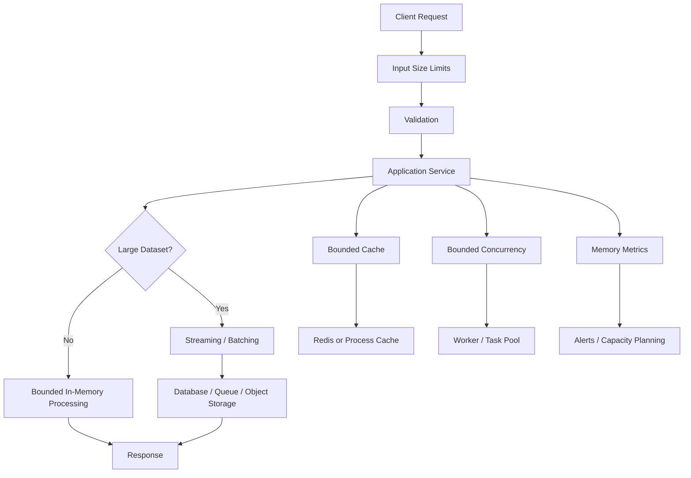

# 10- Memory Management

## Overview

Python memory management determines how objects are allocated, referenced, retained, and eventually released. Understanding it is essential for backend systems because memory behavior directly affects throughput, latency, container sizing, autoscaling, and application stability.

Python provides automatic memory management, but automatic does not mean unlimited or leak-proof. Applications can retain objects accidentally through caches, global state, closures, queues, ORM identity maps, background tasks, and long-lived references.

For backend engineering, the important model is:

```text
Application code
      │
      ▼
Python object references
      │
      ▼
Python memory allocator
      │
      ▼
Process memory
      │
      ▼
Operating System
      │
      ▼
Container / VM
```

Memory problems typically fall into three categories:

| Problem | Typical cause | Result |
|---|---|---|
| Excessive allocation | Large temporary objects | High memory usage |
| Retention | Objects remain reachable | Memory grows over time |
| Fragmentation / allocator behavior | Allocation patterns | RSS remains high after objects are freed |

Python handles object lifetime automatically, but engineers remain responsible for controlling object creation, reference retention, data volume, and process lifetime.

---

## Python's Object Memory Model

Python variables generally hold references to objects rather than storing the object's value directly.

```python
customer = {"id": "cust-123"}
```

Conceptually:

```text
customer
   │
   ▼
┌─────────────────────┐
│ dict object         │
│ id → "cust-123"     │
└─────────────────────┘
```

Assignment creates or changes a binding:

```python
a = [1, 2, 3]
b = a
```

Both names reference the same object:

```text
a ──┐
    ├──► [1, 2, 3]
b ──┘
```

Therefore:

```python
b.append(4)

print(a)
```

produces:

```text
[1, 2, 3, 4]
```

No copy occurred during assignment.

---

## Names, References, and Objects

A useful distinction is:

- **name** — a binding in a namespace;
- **reference** — a relationship from a name/container to an object;
- **object** — the runtime value allocated by Python.

For example:

```python
request_id = "req-123"
```

The name `request_id` refers to a string object.

Rebinding:

```python
request_id = "req-456"
```

does not mutate the original string. It changes the binding.

This distinction is fundamental to understanding:

- mutable vs immutable objects;
- function arguments;
- aliasing;
- garbage collection;
- shallow and deep copying.

---

## Identity and Equality

Python provides separate concepts for identity and equality.

```python
a = []
b = []

a == b
a is b
```

Results:

```text
True
False
```

`==` asks whether objects are equal according to their equality implementation.

`is` asks whether they are the same object.

Use identity comparisons for singleton-like objects:

```python
if value is None:
    ...
```

Do not use `is` as a general replacement for `==`.

---

## Object Identity and `id()`

`id()` returns an integer identifying an object during its lifetime.

```python
value = object()

print(id(value))
```

The exact implementation is interpreter-dependent.

In CPython, `id()` is commonly related to the object's memory address, but application code should not depend on that behavior.

Object IDs can also be reused after an object is destroyed.

---

## Mutability

Python objects can broadly be classified as mutable or immutable.

| Type | Typical behavior |
|---|---|
| `int` | Immutable |
| `float` | Immutable |
| `str` | Immutable |
| `bytes` | Immutable |
| `tuple` | Immutable container |
| `frozenset` | Immutable |
| `list` | Mutable |
| `dict` | Mutable |
| `set` | Mutable |
| `bytearray` | Mutable |

Immutability is about whether an object's state can be changed, not whether references to the object can change.

```python
value = "hello"
value = "world"
```

The original string was not modified. The name was rebound.

---

## Shallow Immutability of Tuples

A tuple is immutable as a container, but it can reference mutable objects.

```python
items = ([1, 2],)

items[0].append(3)
```

The tuple itself was not structurally modified, but the referenced list changed.

```text
tuple
  │
  └──► mutable list
          │
          └──► [1, 2, 3]
```

This distinction matters when designing immutable data models.

---

## Reference Counting in CPython

CPython primarily uses reference counting for object lifetime management.

Conceptually:

```text
object
  │
  ├── reference from variable
  ├── reference from container
  └── reference from another object
```

When the reference count reaches zero, CPython can usually deallocate the object immediately.

Example:

```python
data = {"large": "payload"}

other = data
del data
```

The object remains alive because `other` still references it.

After:

```python
del other
```

the object may become immediately reclaimable under CPython's reference-counting mechanism.

This is a CPython implementation detail, not a language guarantee.

---

## `del` Does Not Directly Mean "Free Memory"

`del` removes a name or container reference.

```python
data = load_data()

del data
```

This means the name `data` no longer references the object.

It does not guarantee that:

- the object has no other references;
- memory is returned to the operating system;
- the process RSS decreases immediately.

A useful mental model is:

```text
del name
   │
   ▼
Remove one reference
   │
   ▼
Object still reachable?
   ├── Yes → remains alive
   └── No  → eligible for reclamation
```

---

## Cyclic References

Reference counting alone cannot immediately reclaim cycles.

```python
class Node:
    def __init__(self):
        self.other = None


a = Node()
b = Node()

a.other = b
b.other = a
```

Now:

```text
a ──► Node A ──► Node B
      ▲           │
      └───────────┘
```

Even if external references to `a` and `b` disappear, the nodes still reference each other.

CPython therefore includes a cyclic garbage collector.

---

## Garbage Collection

CPython uses reference counting together with cyclic garbage collection.

The cyclic GC detects unreachable reference cycles that reference counting alone cannot reclaim.

The `gc` module provides access to the garbage collector.

```python
import gc

print(gc.isenabled())
```

You can inspect collected objects:

```python
collected = gc.collect()
print(collected)
```

Manual collection should generally not be added to application hot paths without measurement.

---

## Garbage Collection Generations

CPython's cyclic GC historically organizes tracked objects into generations based on object age.

The implementation has evolved across Python versions, so production code should not rely on internal generation details.

The important engineering concept is that cyclic garbage collection is optimized around the observation that long-lived objects are less likely to become garbage than newly created objects.

---

## What Garbage Collection Does Not Fix

Garbage collection cannot reclaim an object that is still reachable.

For example:

```python
cache = {}

def process(request):
    cache[request.id] = request
```

If the cache grows indefinitely, the objects remain reachable.

This is a retention problem, not a garbage-collector failure.

```text
Request
   │
   ▼
Cache
   │
   ▼
Object remains reachable
   │
   ▼
GC cannot reclaim it
```

This is one of the most important distinctions in production memory debugging.

---

## Common Sources of Memory Retention

Long-lived references commonly come from:

- global variables;
- module-level caches;
- unbounded dictionaries;
- lists accumulating results;
- queues;
- background tasks;
- closures;
- callbacks;
- ORM caches;
- connection/session state;
- thread-local storage;
- application-level registries;
- metrics labels containing high-cardinality objects;
- improperly managed resources.

A service can therefore have a memory leak even though Python's garbage collector is functioning correctly.

---

## Local Variables and Object Lifetime

Local variables normally disappear from the function's local namespace when the function returns.

```python
def process():
    data = load_large_dataset()
    return transform(data)
```

After the function returns, `data` is normally no longer reachable through that local frame.

However, references can escape through:

- returned values;
- closures;
- globals;
- callbacks;
- task queues;
- caches;
- exceptions and tracebacks.

---

## Closures and Retention

Closures can keep objects alive.

```python
def create_processor():
    large_config = load_large_config()

    def process(request):
        return use_config(large_config, request)

    return process
```

The returned function retains access to `large_config`.

This can be intentional, but long-lived closures can retain substantial object graphs.

Be especially careful when closures are stored in:

- registries;
- callbacks;
- worker pools;
- application-level caches.

---

## Exceptions and Tracebacks

Exceptions contain traceback information that can retain references to stack frames and their local variables.

For example, a large object referenced by a local variable can remain reachable while an exception object retaining the traceback remains alive.

Avoid storing exception objects indefinitely.

Prefer storing concise structured error information when long-term retention is required:

```python
error_record = {
    "type": type(exc).__name__,
    "message": str(exc),
}
```

Do not indiscriminately serialize or retain full traceback objects in long-lived structures.

---

## Function Arguments and Memory

Passing an object to a function normally passes a reference to the same object.

```python
def process(items):
    items.append("new")


values = []
process(values)
```

The caller and function refer to the same list.

This is sometimes described as **call by sharing** or **object-reference semantics**.

Python does not use traditional pass-by-reference variable semantics, nor does it copy every argument.

---

## Copying Objects

Assignment does not copy:

```python
a = {"items": [1, 2]}
b = a
```

A shallow copy creates a new outer object:

```python
b = a.copy()
```

Now:

```text
a ──► dict A ──► list
b ──► dict B ──┘
```

Nested mutable objects may still be shared.

---

## Deep Copy

`copy.deepcopy()` recursively copies supported object graphs.

```python
from copy import deepcopy

b = deepcopy(a)
```

This can be useful when independent nested state is required.

However, deep copying can be expensive in terms of:

- CPU;
- memory;
- allocation count;
- object graph traversal.

It is often the wrong solution for large backend data structures.

Prefer explicit reconstruction when only selected fields need to be copied.

---

## Memory Cost of Python Containers

Python collections have significant per-object overhead compared with compact native arrays.

For example:

```python
records = [
    {"id": 1, "value": 10.5},
    {"id": 2, "value": 20.5},
]
```

This involves many Python objects:

```text
list
 ├── dict
 │    ├── int
 │    ├── str
 │    └── float
 └── dict
      ├── int
      ├── str
      └── float
```

For millions of records, object overhead can become substantial.

This is one reason database-side aggregation, streaming, NumPy, Pandas, or compact serialization formats may be preferable for data-heavy workloads.

---

## `sys.getsizeof()`

`sys.getsizeof()` reports the size of an object as measured by the interpreter.

```python
import sys

values = [1, 2, 3]

print(sys.getsizeof(values))
```

It is important that this is generally a **shallow** measurement.

For:

```python
values = [[1, 2], [3, 4]]
```

the size of the outer list does not represent the complete memory consumed by the nested objects.

Therefore, do not use `sys.getsizeof()` alone to estimate application memory.

---

## Process Memory vs Python Object Memory

Operating-system memory metrics and Python object metrics measure different things.

```text
Python objects
      │
      ▼
Python allocator
      │
      ▼
C heap / memory arenas
      │
      ▼
Process virtual memory / RSS
      │
      ▼
Container / host
```

An object can be destroyed while the Python process retains allocated memory for future reuse.

Therefore:

```text
Objects freed ≠ RSS necessarily decreases
```

This distinction is critical when diagnosing Kubernetes `OOMKilled` events.

---

## Python Memory Allocator

CPython uses its own allocator for many small Python-object allocations.

The allocator can retain memory internally and reuse it for subsequent Python allocations.

As a result, memory may remain associated with the process even after objects become unreachable.

This behavior improves allocation performance but means RSS is not a direct representation of currently live Python objects.

---

## RSS

Resident Set Size (RSS) represents the amount of physical memory associated with a process according to the operating system's accounting.

It includes more than Python objects.

It can include:

- Python-managed memory;
- native allocations;
- shared libraries;
- extension-module allocations;
- memory-mapped regions;
- allocator arenas.

Therefore, RSS should be monitored at the process/container level while Python-specific tools help identify object-level allocation sources.

---

## Memory Fragmentation

Repeated allocation and deallocation of differently sized objects can result in allocator fragmentation.

A simplified example:

```text
Memory:
[used][free][used][free][used][free]
```

There may be enough total free memory but not an ideal contiguous layout for some allocation patterns.

In CPython, allocator behavior and the underlying C allocator affect how memory is reused and returned to the OS.

Do not assume that:

```python
del large_object
```

will immediately produce a corresponding reduction in container RSS.

---

## `tracemalloc`

`tracemalloc` tracks memory allocations made by Python code.

Start tracing:

```python
import tracemalloc

tracemalloc.start()

snapshot = tracemalloc.take_snapshot()
```

You can compare snapshots:

```python
before = tracemalloc.take_snapshot()

process_request()

after = tracemalloc.take_snapshot()

stats = after.compare_to(before, "lineno")

for stat in stats[:10]:
    print(stat)
```

This is useful for identifying Python allocation growth.

---

## What `tracemalloc` Does Not Show

`tracemalloc` is not a complete process-memory profiler.

It primarily traces Python memory allocations and does not account for every native allocation.

For example, memory allocated directly by:

- C extensions;
- native libraries;
- certain database drivers;
- NumPy/native buffers;

may not be fully represented by `tracemalloc`.

Use OS-level metrics and native-memory profiling when appropriate.

---

## `tracemalloc` in Production

Continuous detailed tracing can introduce overhead.

A practical approach is:

1. detect abnormal memory growth through metrics;
2. reproduce or capture the workload;
3. enable `tracemalloc` in a controlled environment;
4. compare snapshots;
5. identify retaining code;
6. validate the fix with load testing.

Avoid enabling expensive diagnostics permanently without understanding their overhead.

---

## Profiling Memory Growth

A useful investigation compares snapshots over time:

```text
Snapshot A
   │
   ▼
Execute workload
   │
   ▼
Snapshot B
   │
   ▼
Compare allocations
   │
   ▼
Identify growing locations
```

If the same code path continually increases retained allocations across equivalent workloads, investigate whether references are escaping unexpectedly.

---

## `gc` Module

The `gc` module can help inspect and control cyclic garbage collection.

Useful operations include:

```python
import gc

gc.collect()
gc.get_count()
gc.get_stats()
```

Use these tools primarily for diagnostics.

Manually forcing collection on every request is generally an anti-pattern because it can increase latency without solving the underlying retention problem.

---

## Weak References

A weak reference does not keep an object alive.

```python
import weakref


class Resource:
    pass


resource = Resource()
reference = weakref.ref(resource)

print(reference())
```

After the strong reference disappears, the object can be reclaimed:

```python
del resource

print(reference())
```

The result can become `None`.

Weak references are useful for caches and registries where retaining an object should not determine its lifetime.

---

## Weak Reference Caches

A cache may sometimes use weak references to avoid keeping objects alive solely because they are cached.

However, weak-reference behavior should be selected deliberately.

If cached values are required for correctness, weak references are inappropriate because objects may disappear unexpectedly from the cache.

Use strong bounded caches when predictable cache semantics are required.

---

## `weakref.WeakValueDictionary`

Python provides weak-reference-aware containers.

```python
from weakref import WeakValueDictionary


class Client:
    pass


clients = WeakValueDictionary()
```

Objects stored as values do not remain alive solely because they are present in the dictionary.

This can be useful for object registries.

---

## Caches and Memory

Unbounded caches are a common production memory problem.

Avoid:

```python
cache = {}

def get_customer(customer_id):
    if customer_id not in cache:
        cache[customer_id] = load_customer(customer_id)

    return cache[customer_id]
```

If customer IDs are effectively unbounded, memory usage can grow with traffic.

Prefer a bounded cache:

```python
from functools import lru_cache


@lru_cache(maxsize=10_000)
def get_configuration(key: str) -> str:
    return load_configuration(key)
```

For distributed applications, Redis or another external cache may be more appropriate.

---

## Process-Local Caches

A Python cache inside a web process is process-local.

With multiple workers:

```text
Load Balancer
      │
      ├──► Worker 1 ──► Cache 1
      ├──► Worker 2 ──► Cache 2
      └──► Worker 3 ──► Cache 3
```

Each process has separate memory and cache state.

This affects:

- memory consumption;
- cache hit rates;
- consistency;
- invalidation.

For shared caching across workers, Redis is often more appropriate.

---

## Queues and Memory

Unbounded in-process queues can create severe memory pressure.

```python
queue.put(large_payload)
```

If producers consistently outpace consumers:

```text
Producer rate > Consumer rate
          │
          ▼
Queue grows
          │
          ▼
Memory grows
          │
          ▼
OOM
```

Production systems should use:

- bounded queues;
- backpressure;
- external durable queues where appropriate;
- payload-size limits;
- consumer scaling.

Kafka, SQS, RabbitMQ, or Celery-backed infrastructure can provide better durability and operational control depending on the workload.

---

## Large API Responses

A backend can accidentally materialize an entire dataset:

```python
rows = list(fetch_all_rows())
```

For millions of records, this can create large memory spikes.

Prefer pagination or streaming:

```text
Database
   │
   ▼
Page / Batch
   │
   ▼
Transform
   │
   ▼
Send / Persist
   │
   ▼
Next Page
```

This reduces peak memory.

---

## Streaming vs Materialization

Materialization:

```python
records = list(generate_records())
process(records)
```

Streaming:

```python
for record in generate_records():
    process(record)
```

The streaming version can keep memory approximately proportional to the active working set rather than the complete dataset.

However, streaming is not automatically better if downstream processing requires the entire dataset.

---

## Generators and Memory

Generators defer production of values.

```python
def read_records(path):
    with open(path, encoding="utf-8") as file:
        for line in file:
            yield line.rstrip("\n")
```

This allows large files to be processed without loading the entire file into memory.

```text
File
 │
 ▼
Generator
 │
 ├── record 1
 ├── record 2
 ├── record 3
 └── ...
```

Generators reduce peak memory but do not eliminate the cost of the objects currently being processed.

---

## Lazy Evaluation Trade-offs

Lazy processing is useful for:

- large files;
- database result streams;
- ETL pipelines;
- event processing;
- large API payloads.

But lazy evaluation can also:

- keep resources open longer;
- delay exceptions;
- make transaction lifetimes less obvious;
- retain references through generator state.

Always consider resource lifetime.

---

## Context Managers and Resource Lifetime

Context managers help make resource ownership explicit.

```python
with open("events.jsonl", encoding="utf-8") as file:
    for line in file:
        process(line)
```

The file is closed when leaving the `with` block.

The same principle applies to:

- database connections;
- transactions;
- HTTP clients;
- locks;
- temporary resources.

Memory management and resource management are related but distinct concerns.

---

## ORM Memory Considerations

ORMs can materialize more state than expected.

For example, loading a large Django QuerySet incorrectly can create substantial memory pressure.

Avoid unnecessarily doing:

```python
customers = list(Customer.objects.all())
```

for very large tables.

Prefer:

- pagination;
- chunked iteration;
- `.iterator()` where appropriate;
- selecting only required fields;
- database-side filtering and aggregation.

The best memory optimization is often to avoid retrieving unnecessary data from PostgreSQL in the first place.

---

## Database-Side Processing

Instead of:

```python
rows = list(query_database())

total = sum(row.amount for row in rows)
```

prefer database-side aggregation where appropriate:

```sql
SELECT SUM(amount)
FROM payments
WHERE customer_id = $1;
```

This changes the data flow:

```text
Bad:
PostgreSQL
    │
    ▼
Millions of rows
    │
    ▼
Python memory
    │
    ▼
Aggregation

Better:
PostgreSQL
    │
    ▼
Aggregation
    │
    ▼
Single result
    │
    ▼
Python
```

This often improves both memory consumption and performance.

---

## Pandas and Memory

Pandas can consume substantial memory because DataFrames can contain large in-memory structures.

For large ETL workloads:

- select only required columns;
- process files in chunks;
- choose appropriate dtypes;
- avoid unnecessary copies;
- push filtering and aggregation to databases where practical;
- consider columnar formats such as Parquet;
- use distributed processing only when workload size justifies it.

Do not assume that moving data into Pandas automatically makes processing memory-efficient.

---

## Memory and Concurrency

Concurrency multiplies memory requirements.

Suppose one request consumes 50 MB of peak working memory.

With 100 concurrent requests, the theoretical aggregate working set could approach:

```text
50 MB × 100 = 5 GB
```

Actual behavior depends on sharing, allocation patterns, workload phases, and concurrency architecture, but the principle is important.

A service that works correctly with one request can still OOM under concurrency.

---

## Asyncio and Memory

Asyncio does not make memory usage free.

Each active coroutine/task retains:

- coroutine state;
- local variables;
- references to awaited objects;
- task metadata.

If thousands of tasks are created simultaneously:

```python
tasks = [
    asyncio.create_task(process(item))
    for item in items
]
```

memory can grow with the number of active tasks.

Use bounded concurrency where appropriate.

---

## Bounded Async Concurrency

A semaphore can limit concurrent work:

```python
import asyncio


async def process_with_limit(
    items: list[str],
    limit: int,
) -> None:
    semaphore = asyncio.Semaphore(limit)

    async def worker(item: str) -> None:
        async with semaphore:
            await process(item)

    await asyncio.gather(
        *(worker(item) for item in items)
    )
```

This limits active processing but still creates all task objects.

For very large inputs, use a bounded worker queue rather than creating millions of tasks.

---

## Thread and Process Memory

Threads generally share a process address space.

Processes have separate address spaces.

```text
Threads:
Process
 ├── Thread 1
 ├── Thread 2
 └── Thread 3
       │
       └── shared process memory

Processes:
Process 1 ── separate memory
Process 2 ── separate memory
Process 3 ── separate memory
```

Multiprocessing can therefore multiply memory consumption significantly.

Copy-on-write and operating-system behavior can reduce actual duplication in some cases, but engineers should size workers based on measured memory usage.

---

## Worker Processes and Web Servers

A FastAPI or Django deployment may use multiple worker processes:

```text
Kubernetes Pod
 ├── Worker 1
 ├── Worker 2
 ├── Worker 3
 └── Worker 4
```

If each worker has a 300 MB working set:

```text
4 × 300 MB = 1.2 GB
```

before accounting for other process and container memory.

Worker count must therefore consider both CPU and memory.

More workers do not always mean better throughput.

---

## Copy-on-Write Considerations

When processes are created using mechanisms that support copy-on-write, initially shared memory pages can be reused.

However, modifications cause pages to be copied.

Large mutable global structures can therefore become expensive when multiple worker processes modify them.

Do not rely on copy-on-write as a substitute for explicit memory planning.

---

## Memory in Containers

Docker and Kubernetes make memory a resource constraint.

A container may be terminated when it exceeds its memory limit.

For Kubernetes, this can result in:

```text
OOMKilled
```

The application may appear healthy under normal load but fail during traffic spikes.

Memory sizing should account for:

- baseline RSS;
- peak request memory;
- concurrency;
- worker count;
- native libraries;
- caches;
- background jobs;
- temporary allocations;
- safety margin.

---

## Kubernetes Memory Planning

A simplified model is:

```text
Pod memory requirement
    =
    baseline process memory
    + peak application working set
    + concurrency overhead
    + native allocations
    + safety margin
```

Requests and limits should be based on observed workload behavior.

Too-low limits cause OOM kills.

Too-high requests can reduce cluster utilization and increase infrastructure cost.

---

## Memory Metrics

Useful production metrics include:

- process RSS;
- container working set;
- heap/allocation metrics where available;
- request concurrency;
- request latency;
- queue depth;
- cache size;
- worker count;
- restart count;
- OOM events.

A useful correlation is:

```text
Memory
  │
  ├──► Request concurrency
  ├──► Queue depth
  ├──► Cache size
  ├──► Deployment version
  └──► Traffic volume
```

Memory metrics without workload context are often difficult to interpret.

---

## Detecting a Memory Leak

A practical investigation:

1. Establish a stable workload.
2. Record baseline memory.
3. Run repeated equivalent workloads.
4. Observe whether memory returns toward a stable level.
5. Compare Python allocation snapshots.
6. Identify growing references.
7. Inspect caches, queues, globals, tasks, and callbacks.
8. Reproduce under load.
9. Validate the fix over a sufficiently long period.

A sawtooth pattern can be normal:

```text
Memory
  │     /\      /\      /\
  │    /  \    /  \    /  \
  │___/    \__/    \__/    \___
  └────────────────────────────── time
```

Persistent upward growth is more concerning:

```text
Memory
  │             /
  │           /
  │         /
  │       /
  │_____/
  └────────────────────────────── time
```

---

## Memory Leak vs Memory Spike

These should not be confused.

### Memory Spike

A large temporary allocation causes memory to rise and later fall.

```text
Normal → Spike → Normal
```

Possible causes:

- large API request;
- serialization;
- batch processing;
- database query;
- image processing.

### Memory Leak / Retention

Memory grows because objects remain reachable.

```text
Normal → Growth → Growth → Growth
```

Possible causes:

- unbounded cache;
- global collection;
- task retention;
- event listener registration;
- object graph retained by a long-lived reference.

The remediation differs.

---

## Performance Trade-offs

Memory optimization is not automatically beneficial.

Examples:

| Technique | Memory effect | Potential trade-off |
|---|---|---|
| Streaming | Lower peak memory | More complex control flow |
| Caching | Higher memory | Lower latency / DB load |
| Serialization | Temporary allocation | Interoperability |
| `slots=True` | Lower object overhead | Less dynamic flexibility |
| Database aggregation | Lower application memory | Database CPU usage |
| Batching | Controlled working set | More round trips |
| Compression | Lower storage/network size | CPU overhead |

Optimize the complete system rather than a single process metric.

---

## Security Considerations

Memory management also has security implications.

Avoid retaining:

- credentials;
- access tokens;
- personally sensitive data;
- encryption keys;
- raw authorization headers.

Python does not provide a general guarantee that sensitive data can be securely erased from memory.

Immutable objects and interpreter/runtime internals can make deterministic memory clearing difficult.

For highly sensitive secrets, use established secret-management and cryptographic libraries and minimize their lifetime in application memory.

---

## Production Memory Strategy

A production Python service should generally follow these principles:

```text
Limit input size
      │
      ▼
Validate early
      │
      ▼
Avoid unnecessary materialization
      │
      ▼
Stream / batch large workloads
      │
      ▼
Bound caches and queues
      │
      ▼
Control concurrency
      │
      ▼
Measure memory
      │
      ▼
Set container limits with headroom
      │
      ▼
Alert on abnormal growth
```

The objective is controlled memory behavior rather than simply "using less memory."

---

## Common Mistakes

### Assuming Garbage Collection Prevents Memory Leaks

GC only reclaims unreachable objects.

If an application retains references, GC cannot help.

### Assuming `del` Returns Memory to the OS

`del` removes a reference. Process RSS may remain unchanged.

### Using `list()` on Large Streams

Materializing an entire dataset can create large memory spikes.

### Building Unbounded Caches

A cache without an eviction or size policy can eventually consume the process memory.

### Creating Unlimited Async Tasks

Millions of active tasks can consume substantial memory.

### Loading Entire Database Tables

The application often does not need every row simultaneously.

### Calling `gc.collect()` Everywhere

Manual collection does not solve object retention and can add latency.

### Using `sys.getsizeof()` as Total Memory

It is generally a shallow object measurement.

### Assuming More Workers Improve Performance

Additional processes also increase aggregate memory consumption.

---

## Interview Traps

### Is Python Garbage Collected?

Yes, Python implementations provide automatic memory management. In CPython, reference counting is combined with cyclic garbage collection.

### Does `del` Free an Object?

It removes a reference. The object becomes reclaimable only when it is no longer reachable, subject to the interpreter's memory-management behavior.

### Does CPython Always Return Freed Memory to the OS?

No. Python and underlying allocators may retain memory for reuse.

### What Causes a Python Memory Leak?

Usually unintended retention of reachable objects, such as through global collections, caches, queues, closures, tasks, or registries.

### Does Garbage Collection Solve Cyclic References?

CPython's cyclic GC can reclaim unreachable reference cycles.

### Does `deepcopy()` Copy Everything?

No. Its behavior depends on object types and copy protocols. It can also be expensive and inappropriate for objects representing external resources.

### Is a Generator Always More Memory Efficient?

Usually for streaming large sequences because it avoids materializing the entire sequence, but generator state and referenced resources still consume memory.

### Does Asyncio Use Less Memory Than Threads?

Not universally. Async tasks can be lightweight compared with threads, but thousands or millions of active tasks can still consume substantial memory.

### What Is the Difference Between RSS and Python Allocations?

RSS is an OS-level process memory measure. Python allocation profilers such as `tracemalloc` provide a more specific view of Python-managed allocations and do not necessarily explain all process memory.

---

## Senior-Level Interview Questions

### How Would You Investigate a Kubernetes Pod That Is Being OOMKilled?

Start with container memory metrics and determine whether the problem is:

- sustained growth;
- temporary allocation spikes;
- excessive concurrency;
- too many worker processes;
- native-memory growth;
- cache growth;
- workload changes.

Then correlate memory with:

- request rate;
- concurrency;
- queue depth;
- deployment version;
- worker count.

Use `tracemalloc` and application profiling when Python allocations are suspected, while remembering that native allocations may require different tooling.

---

### How Would You Design a Memory-Safe ETL Pipeline?

Prefer:

```text
Source
  │
  ▼
Read bounded batch
  │
  ▼
Transform
  │
  ▼
Write batch
  │
  ▼
Release batch
  │
  ▼
Next batch
```

Avoid loading the complete dataset into memory.

Push filtering, joins, and aggregation into PostgreSQL when appropriate, and use streaming or chunked processing for files and external APIs.

---

### Why Can RSS Stay High After a Large Object Is Deleted?

Several layers are involved:

```text
Python object deleted
        │
        ▼
Object memory becomes reusable
        │
        ▼
Python allocator may retain memory
        │
        ▼
Underlying allocator may retain memory
        │
        ▼
OS RSS may remain high
```

Therefore, a stable high RSS after a temporary spike does not automatically indicate a leak.

---

### How Would You Distinguish a Leak From Normal Allocator Behavior?

Run a repeatable workload and observe both:

- live object/allocation behavior;
- process RSS.

If Python allocations continually grow with equivalent workloads, investigate retention.

If Python allocations stabilize but RSS remains elevated, allocator behavior, native allocations, fragmentation, memory mappings, or extensions may be involved.

---

### How Does Concurrency Affect Memory Capacity?

Concurrency increases the number of simultaneous working sets.

If each request needs temporary memory `M` and there are `N` concurrent requests, a simplified upper-bound model is:

```text
Memory ≈ baseline + N × M
```

Real applications have shared state and variable working sets, but the model is useful for capacity planning.

Therefore, concurrency limits are also memory-control mechanisms.

---

## Memory-Safe Backend Architecture



The architecture controls memory before the Python allocator becomes the bottleneck.

---

## Practical Memory Checklist

### Code

- [ ] Avoid unnecessary copies.
- [ ] Avoid `list()` on unbounded or very large iterables.
- [ ] Use generators for streaming workloads.
- [ ] Use `default_factory` for mutable dataclass defaults.
- [ ] Avoid retaining unnecessary references.
- [ ] Bound caches and queues.
- [ ] Avoid long-lived exception objects.
- [ ] Limit async and thread concurrency.

### Data Access

- [ ] Select only required database columns.
- [ ] Filter and aggregate in PostgreSQL when appropriate.
- [ ] Use pagination or chunked iteration.
- [ ] Avoid loading entire tables.
- [ ] Stream large files and responses.
- [ ] Use compact data representations for large datasets.

### Runtime

- [ ] Monitor process RSS.
- [ ] Monitor container memory.
- [ ] Track OOM events and restarts.
- [ ] Use `tracemalloc` when Python allocations are suspected.
- [ ] Investigate native allocations separately when required.
- [ ] Measure before using `slots=True` or other optimizations.

### Deployment

- [ ] Size workers based on memory as well as CPU.
- [ ] Set Kubernetes memory requests realistically.
- [ ] Set memory limits with sufficient headroom.
- [ ] Load-test peak concurrency.
- [ ] Account for background workers and sidecars.
- [ ] Review memory behavior after major dependency or Python-version upgrades.

---

## Key Takeaways

- **Python manages object lifetime automatically, but it does not prevent memory retention:** CPython combines reference counting with cyclic garbage collection, while reachable objects remain alive regardless of GC.
- **Object memory and process memory are different measurements:** `tracemalloc` helps investigate Python allocations, while RSS reflects broader process memory and may remain high after objects are released.
- **Bound the working set:** streaming, batching, database-side aggregation, bounded caches, bounded queues, and controlled concurrency are often more effective than manually invoking garbage collection.
- **Concurrency multiplies memory requirements:** web workers, threads, processes, and asyncio tasks all contribute to the application's aggregate working set and must be considered during capacity planning.
- **Diagnose before optimizing:** distinguish temporary allocation spikes, object retention, allocator behavior, and native-memory growth before changing application architecture or runtime settings.