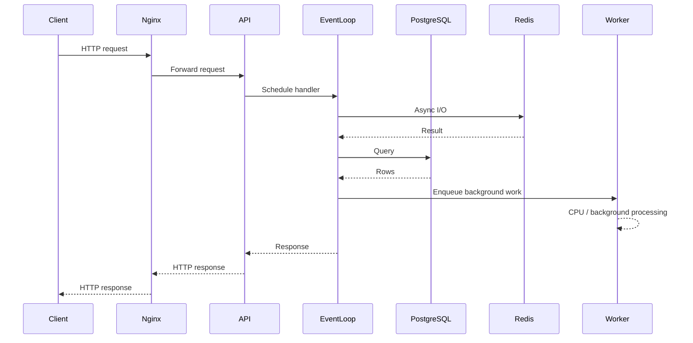

# 11- GIL and Concurrency

## Overview

Concurrency is the ability to make progress on multiple units of work during overlapping periods. Parallelism is the ability to execute multiple units of work simultaneously.

Python supports multiple concurrency models:

- threads;
- processes;
- `asyncio`;
- external workers such as Celery;
- distributed systems such as Kafka-based consumers.

The **Global Interpreter Lock (GIL)** is a critical CPython implementation detail because, in traditional CPython builds, it limits concurrent execution of Python bytecode to one thread per interpreter.

This does **not** mean Python cannot perform concurrent work or use multiple CPU cores. It means the appropriate concurrency mechanism depends on the workload.

```text
                    Python Workload
                         │
             ┌───────────┴───────────┐
             │                       │
          I/O-bound               CPU-bound
             │                       │
       ┌─────┴─────┐           ┌─────┴─────┐
       │           │           │           │
    asyncio     Threads     Processes   Native code
       │           │           │           │
       └─────┬─────┘           └─────┬─────┘
             │                       │
             ▼                       ▼
      Overlap waiting         True CPU parallelism
```

Understanding the GIL is therefore less about memorizing "Python threads are slow" and more about understanding **what is executing, where it is executing, what resource it is waiting for, and whether the workload releases the GIL**.

---

## Concurrency vs Parallelism

These concepts are related but different.

### Concurrency

Multiple tasks make progress during overlapping time periods.

```text
Time ─────────────────────────────►

Task A  ███       ███       ███
Task B      ███       ███       ███
```

The tasks may alternate execution rather than execute simultaneously.

### Parallelism

Multiple tasks execute at the same time on different CPU cores.

```text
Core 1  ███████████████████████████
Core 2  ███████████████████████████
```

For CPU-intensive Python workloads, processes are traditionally used to achieve CPU parallelism.

---

## What Is the GIL?

The Global Interpreter Lock is a lock associated with the traditional CPython execution model that prevents multiple threads from executing Python bytecode simultaneously within the same interpreter.

Conceptually:

```text
CPython Process
│
├── Thread A ──┐
├── Thread B ──┼──► GIL ──► Python bytecode execution
└── Thread C ──┘
```

Only one thread can hold the relevant interpreter execution lock at a time in the traditional GIL-enabled CPython model.

The GIL does **not** mean that only one thread exists.

It means Python bytecode execution by threads is serialized at a given instant within that interpreter.

---

## Why Does the GIL Exist?

The GIL historically simplified important aspects of CPython's runtime implementation.

In particular, CPython uses reference counting as a major component of object memory management:

```text
Python object
     │
     ▼
Reference count
     │
     ▼
Increment / decrement
     │
     ▼
Object lifetime management
```

Without suitable synchronization, concurrent updates to interpreter-managed state could create races.

The GIL historically provided a relatively simple mechanism for protecting many interpreter internals while enabling CPython to maintain a large ecosystem of C extensions.

The trade-off is reduced parallel execution of Python bytecode across threads.

---

## Important GIL Qualification

The GIL is **not a property of the Python language specification**.

It is primarily a CPython implementation detail.

Other Python implementations can have different execution models.

Modern CPython also supports configurations where the traditional GIL can be disabled using the free-threaded build introduced experimentally in Python 3.13 and continuing to evolve.

Therefore, interview answers should avoid saying:

> "Python always has a GIL."

A more accurate statement is:

> Traditional GIL-enabled CPython serializes Python bytecode execution across threads within an interpreter; the Python language itself does not require a GIL.

---

## How the GIL Affects Threads

Consider CPU-bound Python code:

```python
def calculate():
    total = 0

    for value in range(10_000_000):
        total += value

    return total
```

Running this concurrently using multiple threads does not generally provide CPU parallelism for the Python bytecode itself under the traditional GIL.

```text
Thread A ──► Python bytecode ──┐
                               ├──► GIL ──► CPU
Thread B ──► Python bytecode ──┘
```

Threads may take turns acquiring the GIL, but they do not execute Python bytecode simultaneously on separate cores.

---

## Why Threads Still Work Well for I/O

The GIL does not prevent useful concurrency for I/O-bound workloads.

While a thread is waiting for an operation such as:

- network I/O;
- file I/O;
- database I/O;
- socket operations;

the interpreter can release the execution lock and allow another thread to execute Python code.

Conceptually:

```text
Thread A
   │
   ▼
Python code
   │
   ▼
Network request
   │
   ├── releases interpreter execution opportunity
   │
   ▼
Waiting

Thread B
   │
   ▼
Python code executes
```

This allows multiple I/O operations to overlap.

---

## I/O-Bound Backend Example

Consider a service that needs to call three independent APIs.

Sequential execution:

```text
API A ────────────────
                      API B ────────────────
                                            API C ────────────────
```

Concurrent execution:

```text
API A ────────────────
API B ────────────────
API C ────────────────
```

The total latency can approach the slowest operation rather than the sum of all independent waits, subject to connection limits, scheduling, service latency, and other constraints.

This is why Python remains effective for network-heavy backend services.

---

## Threads for I/O-Bound Work

A thread pool is often appropriate when using blocking libraries.

```python
from concurrent.futures import ThreadPoolExecutor


def fetch_customer(customer_id: str) -> dict:
    return blocking_http_client.get(
        f"/customers/{customer_id}"
    )


def fetch_customers(customer_ids: list[str]) -> list[dict]:
    with ThreadPoolExecutor(max_workers=10) as executor:
        return list(
            executor.map(fetch_customer, customer_ids)
        )
```

The exact worker count should be based on:

- downstream latency;
- connection pool capacity;
- service rate limits;
- memory;
- CPU;
- request concurrency.

More threads are not automatically better.

---

## CPU-Bound Work

CPU-bound work spends most of its time actively computing.

Examples:

- large pure-Python transformations;
- cryptographic operations implemented in Python;
- compression implemented in Python;
- image processing;
- numerical calculations;
- expensive parsing;
- complex data transformations.

Traditional threads are usually not the preferred way to achieve CPU parallelism for pure Python bytecode.

---

## Processes for CPU Parallelism

Processes have separate Python interpreters and separate address spaces.

```text
Process 1
 └── Interpreter ──► CPU core

Process 2
 └── Interpreter ──► CPU core

Process 3
 └── Interpreter ──► CPU core
```

Each process can execute Python bytecode independently.

Example:

```python
from concurrent.futures import ProcessPoolExecutor


def calculate(value: int) -> int:
    return value * value


with ProcessPoolExecutor() as executor:
    results = list(
        executor.map(calculate, range(1_000_000))
    )
```

Processes can provide genuine CPU parallelism, but they introduce additional memory and inter-process communication costs.

---

## Thread vs Process

| Characteristic | Threads | Processes |
|---|---|---|
| Address space | Shared | Separate |
| Python bytecode parallelism in traditional CPython | Limited by GIL | Yes |
| I/O-bound work | Excellent | Possible |
| CPU-bound pure Python | Usually poor for scaling | Good |
| Communication | Shared memory | IPC / serialization |
| Memory overhead | Lower | Higher |
| Shared mutable state | Easy but dangerous | Requires explicit IPC |
| Failure isolation | Lower | Higher |
| Startup cost | Lower | Higher |

The workload determines the appropriate model.

---

## GIL and Native Extensions

The GIL primarily constrains execution of Python bytecode.

Native extensions can release the GIL while performing work outside the interpreter.

This means some CPU-intensive operations implemented in native code can execute concurrently across threads.

Examples can include workloads implemented using:

- NumPy;
- certain compression libraries;
- cryptographic libraries;
- database drivers;
- other C/C++/Rust extensions.

Therefore:

> "The GIL makes all Python multithreading slow" is incorrect.

The correct question is whether the workload spends its time executing Python bytecode or native code that can run outside the GIL.

---

## NumPy and the GIL

A NumPy operation may perform substantial work in native code.

For example:

```python
import numpy as np

values = np.random.random(10_000_000)
result = np.sum(values)
```

The expensive computation can occur in native code rather than as a Python loop.

Depending on the operation, NumPy may release the GIL and/or use native parallelism internally.

The exact behavior is operation-dependent.

Do not generalize one library's GIL behavior to every Python extension.

---

## Database and HTTP I/O

Typical backend operations spend significant time waiting:

```text
Python
  │
  ▼
PostgreSQL
  │
  │ waiting
  ▼
Python

Python
  │
  ▼
HTTP service
  │
  │ waiting
  ▼
Python
```

This makes I/O concurrency valuable.

For a FastAPI service, `asyncio` is often preferred for asynchronous I/O.

For existing blocking libraries, threads may be the more practical integration mechanism.

---

## `asyncio` and the GIL

`asyncio` uses cooperative concurrency rather than multiple threads executing Python bytecode simultaneously.

A simplified model:

```text
Event Loop
   │
   ├── Task A ──► await I/O
   │
   ├── Task B ──► execute Python
   │
   ├── Task C ──► await I/O
   │
   └── Task D ──► execute Python
```

When a task reaches:

```python
await network_call()
```

control returns to the event loop while the operation is waiting.

The event loop can schedule another task.

---

## Asyncio Is Not CPU Parallelism

This code:

```python
async def calculate():
    total = 0

    for value in range(10_000_000):
        total += value

    return total
```

does not become CPU-parallel merely because it is `async`.

If the coroutine performs a long CPU-bound loop without yielding:

```text
Task A
██████████████████████████████
                              │
                              ▼
                       Other tasks wait
```

The event loop is blocked.

---

## Blocking the Event Loop

A common mistake is calling blocking code inside an async endpoint.

```python
@app.get("/customers")
async def customers():
    result = requests.get("https://example.com")
    return result.json()
```

The blocking HTTP call prevents the event loop from servicing other tasks efficiently.

Prefer an async-compatible HTTP client:

```python
@app.get("/customers")
async def customers():
    async with httpx.AsyncClient() as client:
        response = await client.get(
            "https://example.com"
        )

    return response.json()
```

In production, the HTTP client should normally be reused rather than instantiated per request.

---

## Offloading Blocking Work

If an unavoidable blocking function must be called from async code, it can be moved to a worker thread.

```python
import asyncio


async def call_legacy_client():
    return await asyncio.to_thread(
        legacy_blocking_operation
    )
```

This keeps the event loop responsive while the blocking operation executes in a thread.

However, thread pools still consume resources and should not be treated as an unlimited escape hatch.

---

## Asyncio vs Threads

| Requirement | Asyncio | Threads |
|---|---|---|
| Async-native HTTP | Excellent | Possible |
| Large number of I/O tasks | Excellent | More memory/thread overhead |
| Blocking legacy library | Requires offloading | Excellent |
| CPU-bound Python | Poor | Poor for parallelism under GIL |
| Programming model | Cooperative | Preemptive scheduling by OS/runtime |
| Shared state | Easy to access | Easy to access |
| Synchronization | Async primitives | Thread primitives |

Choose based on the libraries and workload, not personal preference alone.

---

## Event Loop Architecture

A typical FastAPI deployment might look like:

```text
Nginx / Load Balancer
          │
          ▼
     FastAPI Worker
          │
          ▼
      Event Loop
     ┌────┼────┐
     ▼    ▼    ▼
   Task A Task B Task C
     │    │    │
     ▼    ▼    ▼
    DB   HTTP  Redis
```

The event loop can efficiently manage many I/O-bound operations as long as the application does not block it with synchronous work.

---

## Concurrency Limits

Unbounded concurrency can overwhelm the application or downstream systems.

For example:

```python
tasks = [
    asyncio.create_task(fetch(item))
    for item in items
]
```

If `items` contains millions of records, the application can create a huge number of task objects and overwhelm:

- memory;
- network connections;
- PostgreSQL;
- Redis;
- downstream APIs.

Use bounded concurrency.

```python
import asyncio


async def process_item(
    item: str,
    semaphore: asyncio.Semaphore,
) -> None:
    async with semaphore:
        await fetch(item)


async def process_all(
    items: list[str],
    max_concurrency: int = 50,
) -> None:
    semaphore = asyncio.Semaphore(max_concurrency)

    await asyncio.gather(
        *(
            process_item(item, semaphore)
            for item in items
        )
    )
```

For very large workloads, a bounded queue and fixed number of workers is usually more memory-efficient than creating one task per item.

---

## Backpressure

Concurrency control is closely related to backpressure.

Suppose:

```text
Producer
   │
   │ 10,000 req/s
   ▼
Consumer
   │
   │ 2,000 req/s
   ▼
Downstream
```

If the system accepts unlimited work, queues grow indefinitely.

Eventually:

```text
Queue growth
     │
     ▼
Memory growth
     │
     ▼
Latency growth
     │
     ▼
Timeouts
     │
     ▼
Failure cascade
```

Production systems need explicit capacity controls.

---

## Thread Safety

Threads share process memory.

Therefore, mutable shared state can produce race conditions.

```python
counter = 0


def increment():
    global counter
    counter += 1
```

The operation:

```text
counter += 1
```

should not be treated as a universal atomic operation simply because the GIL exists.

The GIL is not a substitute for application-level synchronization.

---

## Locks

Use locks when multiple threads access shared mutable state and the invariant requires mutual exclusion.

```python
from threading import Lock


counter = 0
lock = Lock()


def increment() -> None:
    global counter

    with lock:
        counter += 1
```

The lock protects the critical section.

However, locks can reduce concurrency and introduce deadlocks if used incorrectly.

---

## GIL vs Application Lock

These solve different problems.

| Mechanism | Purpose |
|---|---|
| GIL | CPython interpreter execution coordination |
| `threading.Lock` | Application-level shared-state synchronization |
| `asyncio.Lock` | Synchronization between async tasks |
| Database transaction | Persistent data consistency |
| Redis distributed lock | Cross-process/distributed coordination |

Never use the GIL as an architectural synchronization primitive.

---

## Race Conditions

A race condition occurs when correctness depends on timing between concurrent operations.

For example:

```text
Thread A              Thread B
   │                     │
 read balance            │
   │                  read balance
   │                     │
 write balance           │
   │                  write balance
```

One update can overwrite another.

This problem remains relevant even when Python bytecode execution is constrained by the GIL because operations can interleave and because application state may span:

- threads;
- processes;
- databases;
- Redis;
- external services.

---

## Multiprocessing and Shared State

Processes do not normally share ordinary Python objects.

```text
Process A
  memory A

Process B
  memory B
```

Communication requires mechanisms such as:

- pipes;
- queues;
- shared memory;
- sockets;
- files;
- databases;
- external services.

Serialization can become a major cost.

For example:

```text
Process A
   │
   ▼
pickle / serialization
   │
   ▼
IPC
   │
   ▼
deserialization
   │
   ▼
Process B
```

Large objects can make multiprocessing significantly more expensive.

---

## Process Memory

Multiple worker processes can multiply memory consumption.

If one worker consumes approximately 400 MB:

```text
1 worker = 400 MB
4 workers = ~1.6 GB
8 workers = ~3.2 GB
```

Actual memory usage depends on shared pages, copy-on-write behavior, native allocations, workload, and allocator behavior.

Worker count should therefore be sized against both CPU and memory.

---

## CPU-Bound Backend Workloads

If a FastAPI request performs expensive pure-Python computation:

```text
HTTP Request
     │
     ▼
FastAPI
     │
     ▼
CPU-heavy Python loop
     │
     ▼
Response
```

Increasing threads may not provide CPU scaling under the traditional GIL.

Better options include:

- process pools;
- separate worker services;
- Celery workers;
- native libraries;
- moving computation to specialized systems;
- database-side computation where appropriate.

---

## Celery and Distributed Workers

For expensive asynchronous workloads, moving computation outside the web process can improve isolation.

```text
Client
  │
  ▼
FastAPI / Django
  │
  ▼
Message Broker
  │
  ▼
Celery Workers
  ├── Worker 1
  ├── Worker 2
  ├── Worker 3
  └── Worker 4
```

Workers can be scaled independently from API servers.

This is often better than performing expensive CPU work directly inside a request handler.

---

## CPU-Bound Work and Kubernetes

Kubernetes can scale worker deployments separately:

```text
API Deployment
  ├── Pod
  ├── Pod
  └── Pod

CPU Worker Deployment
  ├── Pod
  ├── Pod
  ├── Pod
  └── Pod
```

This provides:

- independent scaling;
- resource isolation;
- separate deployment policies;
- workload-specific CPU limits.

It also prevents CPU-heavy jobs from starving latency-sensitive API workers.

---

## GIL and Microservices

The GIL is process-local.

Therefore, separate service processes or containers can execute Python bytecode in parallel across CPU cores.

```text
Node
├── API Process 1 ──► Core 1
├── API Process 2 ──► Core 2
├── API Process 3 ──► Core 3
└── API Process 4 ──► Core 4
```

This is one reason Python web applications can use multiple worker processes effectively.

The GIL limits parallelism between threads inside one interpreter; it does not prevent parallelism across processes.

---

## Free-Threaded CPython

Modern CPython includes an optional free-threaded build that can run without the traditional GIL.

This changes the concurrency model significantly:

```text
Traditional CPython
Thread A ─┐
Thread B ─┼──► GIL ──► Python bytecode
Thread C ─┘

Free-threaded build
Thread A ──► Core 1
Thread B ──► Core 2
Thread C ──► Core 3
```

Free-threaded execution introduces additional considerations:

- thread-safety of application code;
- extension-module compatibility;
- synchronization requirements;
- different runtime overhead characteristics;
- library support;
- deployment compatibility.

It should not be treated as simply "the GIL is gone, therefore all Python applications become faster."

The performance trade-offs depend heavily on workload and ecosystem support.

---

## Concurrency Model Selection

| Workload | Preferred approach |
|---|---|
| HTTP I/O | `asyncio` |
| Async database access | `asyncio` |
| Blocking network library | Threads or `asyncio.to_thread()` |
| Many independent I/O operations | `asyncio` |
| CPU-heavy pure Python | Processes |
| Large CPU jobs | Worker processes / Celery |
| Native CPU computation | Depends on library |
| Distributed processing | Worker system / distributed compute |
| Shared persistent state | Database / Redis / other external store |

The correct answer is workload-dependent.

---

## Backend Request Lifecycle

A production request may involve multiple forms of concurrency:



The GIL is only one component of this architecture.

Database capacity, connection pools, CPU limits, network latency, queue depth, and downstream rate limits may be more important bottlenecks.

---

## Connection Pools and Concurrency

Increasing application concurrency without increasing downstream capacity can make the system worse.

For example:

```text
API concurrency = 500
PostgreSQL pool = 20
```

Most requests cannot execute database operations simultaneously.

If the database pool is increased blindly:

```text
API concurrency = 500
PostgreSQL connections = 500
```

the database may become overloaded.

Concurrency must therefore be designed end-to-end.

---

## Timeouts and Concurrency

Every external operation should have appropriate timeouts.

Without timeouts:

```text
Slow downstream
      │
      ▼
Requests remain active
      │
      ▼
Concurrency increases
      │
      ▼
Connections consumed
      │
      ▼
Queue grows
      │
      ▼
System becomes saturated
```

Timeouts prevent indefinitely retained work.

Use separate timeout budgets for:

- connection establishment;
- reads;
- writes;
- total request duration where supported.

---

## Retries and Concurrency

Retries can amplify load.

Suppose a service receives:

```text
1,000 requests
```

and each failed request retries twice.

The downstream system can receive up to:

```text
3,000 attempts
```

under a simple worst-case model.

This can create a retry storm.

Concurrency controls should therefore be combined with:

- bounded retries;
- exponential backoff;
- jitter;
- timeout budgets;
- circuit-breaking or load-shedding strategies where appropriate;
- idempotency.

---

## Observability

Concurrency problems should be observable.

Useful metrics include:

- active requests;
- event-loop latency;
- thread-pool utilization;
- process CPU;
- process RSS;
- database pool utilization;
- connection wait time;
- queue depth;
- task count;
- request latency;
- timeout rate;
- retry rate;
- worker utilization.

A useful diagnostic relationship is:

```text
High latency
    │
    ├── High CPU? ──► CPU-bound workload
    │
    ├── High I/O wait? ──► Downstream latency
    │
    ├── High queue depth? ──► Capacity bottleneck
    │
    ├── Event loop blocked? ──► Blocking code
    │
    └── Pool exhausted? ──► Concurrency mismatch
```

---

## Common Mistakes

### "The GIL Means Python Cannot Do Concurrency"

False.

Python supports:

- threads;
- asyncio;
- processes;
- distributed workers.

The GIL primarily affects Python bytecode execution across threads in traditional CPython.

### "Threads Are Useless in Python"

False.

Threads are useful for many I/O-bound workloads and for integrating blocking libraries.

### "Asyncio Makes CPU Code Parallel"

False.

Asyncio provides cooperative concurrency, not CPU parallelism.

### "The GIL Makes `counter += 1` Safe"

Do not rely on this.

Application-level shared-state correctness requires appropriate synchronization.

### "Use More Threads for CPU Work"

Usually not for pure Python CPU-bound workloads under the traditional GIL.

Use processes or move the computation into suitable native/distributed execution.

### "Use One Task Per Item"

Creating millions of async tasks can exhaust memory.

Use bounded concurrency and worker queues.

### "More Database Connections Improve Concurrency"

Beyond database capacity, more connections can increase contention and degrade performance.

### "The GIL Is the Main Performance Bottleneck"

Often it is not.

Backend bottlenecks commonly occur in:

- PostgreSQL;
- external APIs;
- network latency;
- serialization;
- locks;
- CPU;
- connection pools;
- queues.

---

## Production Pitfalls

| Pitfall | Consequence | Mitigation |
|---|---|---|
| Blocking call inside async handler | Event-loop stalls | Use async client or thread offload |
| Unlimited async tasks | Memory exhaustion | Bounded concurrency |
| Excessive thread count | Context switching / memory overhead | Tune pool size |
| Too many processes | High memory usage | Size workers to CPU and RAM |
| Shared mutable state | Race conditions | Synchronization or external state |
| Missing timeouts | Stuck work | Explicit timeout budgets |
| Aggressive retries | Retry storms | Backoff, jitter, bounded attempts |
| Oversized DB pool | Database overload | Align pool with DB capacity |
| CPU work in API process | Increased tail latency | Worker/process isolation |
| Assuming GIL provides safety | Incorrect synchronization | Use explicit concurrency primitives |

---

## Security Considerations

Concurrency can affect security as well as performance.

### Race Conditions

Authorization and state changes must be atomic where required.

For example:

```text
Check balance
    │
    ▼
Withdraw
```

If multiple requests perform these operations concurrently without transactional protection, an invariant can be violated.

Use database transactions and appropriate locking where persistent consistency matters.

### Resource Exhaustion

Unbounded concurrency can become a denial-of-service vector.

Apply limits to:

- request body size;
- request concurrency;
- worker queues;
- connection pools;
- task creation;
- file processing;
- external API fan-out.

### Shared State

Never assume process-local locks protect data across multiple Kubernetes pods.

```text
Pod A ── Lock A
Pod B ── Lock B
Pod C ── Lock C
```

For distributed coordination, use an appropriate distributed mechanism rather than a Python `Lock`.

---

## Testing Concurrent Code

Concurrent code should be tested for both functional correctness and operational behavior.

Test:

- race-prone state transitions;
- cancellation;
- timeout behavior;
- retry behavior;
- queue saturation;
- worker failures;
- database transaction conflicts;
- graceful shutdown;
- bounded concurrency.

Load tests should measure:

- throughput;
- p50/p95/p99 latency;
- CPU;
- memory;
- connection utilization;
- queue depth.

A concurrent system that passes unit tests can still fail under realistic contention.

---

## Graceful Shutdown

Production services must handle in-flight work during shutdown.

A simplified model:

```text
Shutdown signal
      │
      ▼
Stop accepting new work
      │
      ▼
Allow in-flight requests to finish
      │
      ▼
Cancel / drain background tasks
      │
      ▼
Close connections
      │
      ▼
Exit
```

This matters for:

- Kubernetes rolling deployments;
- autoscaling;
- spot interruptions;
- node maintenance;
- application restarts.

Uncoordinated shutdown can lose work or leave transactions incomplete.

---

## Interview Traps

### Can Python Threads Run in Parallel?

Traditional GIL-enabled CPython does not allow multiple threads in the same interpreter to execute Python bytecode simultaneously, but threads can overlap I/O and native operations that release the GIL.

### Why Does `asyncio` Help If the GIL Exists?

Because asyncio is primarily about overlapping I/O through cooperative scheduling. It does not require multiple threads to execute Python bytecode simultaneously.

### How Do Multiple CPU Cores Get Used by Python?

Commonly through multiple processes, where each process has its own interpreter, or through suitable native code / free-threaded CPython configurations.

### Is the GIL a Mutex for Application Data?

No.

The GIL is an interpreter/runtime mechanism, not a replacement for locks, transactions, or distributed coordination.

### Why Can a Single-Threaded Async Service Handle Many Requests?

Because most requests spend substantial time waiting for I/O. The event loop can execute another task while one task is awaiting I/O.

### Why Does Asyncio Performance Collapse When Blocking Code Is Added?

A blocking call prevents the event loop from scheduling other tasks during that period.

### Why Not Use Processes for Everything?

Processes provide isolation and CPU parallelism but have higher memory, startup, communication, and serialization costs.

---

## Senior-Level Interview Questions

### How Would You Choose Between Threads, Asyncio, and Processes?

Start with the workload.

```text
Is work primarily I/O-bound?
       │
       ├── Async-native libraries → asyncio
       │
       └── Blocking libraries → threads

Is work CPU-bound?
       │
       ├── Pure Python → processes
       │
       └── Native implementation → evaluate library behavior
```

Then evaluate:

- workload size;
- latency requirements;
- memory;
- downstream limits;
- failure isolation;
- library compatibility;
- operational complexity.

---

### How Would You Diagnose an Async FastAPI Service With High Latency?

Check:

1. event-loop responsiveness;
2. CPU utilization;
3. blocking calls;
4. database connection pool wait;
5. downstream API latency;
6. task concurrency;
7. queue depth;
8. memory pressure.

If the event loop is blocked, look for synchronous operations inside async handlers.

If CPU is saturated, investigate CPU-bound work.

If downstream latency is high, increasing concurrency may make the problem worse rather than better.

---

### Why Can More Concurrency Reduce Throughput?

Because downstream systems have finite capacity.

For example:

```text
Concurrency
    │
    ▼
More requests
    │
    ▼
More DB connections
    │
    ▼
DB contention
    │
    ▼
Higher latency
    │
    ▼
More active requests
    │
    ▼
Further saturation
```

This is a feedback loop.

The optimal concurrency level is usually below the point of resource saturation.

---

### How Would You Process One Million CPU-Heavy Records?

Do not create one million threads or async tasks.

A production design might use:

```text
Input
  │
  ▼
Bounded batches
  │
  ▼
Queue
  │
  ├──► Process Worker 1
  ├──► Process Worker 2
  ├──► Process Worker 3
  └──► Process Worker N
  │
  ▼
Output
```

Workers can use multiple processes or a distributed worker system such as Celery, depending on workload size and reliability requirements.

---

### How Does the GIL Affect a Django or FastAPI Application?

It depends on deployment and workload.

For I/O-heavy requests, the GIL is often not the primary bottleneck.

For CPU-heavy pure-Python requests, the GIL can prevent threads within one interpreter from using multiple CPU cores simultaneously.

Multiple worker processes can provide CPU parallelism:

```text
Load Balancer
      │
      ├──► Worker Process 1
      ├──► Worker Process 2
      ├──► Worker Process 3
      └──► Worker Process 4
```

This must be balanced against memory consumption.

---

### How Would You Prevent a Downstream Service From Being Overloaded?

Use layered controls:

- bounded concurrency;
- connection pool limits;
- request timeouts;
- rate limiting;
- backpressure;
- bounded queues;
- retries with exponential backoff and jitter;
- circuit-breaking/load-shedding where appropriate;
- observability.

Concurrency is a capacity-control problem, not simply a threading problem.

---

## Practical Decision Matrix

| Scenario | Recommended starting point | Primary concern |
|---|---|---|
| FastAPI calling several APIs | `asyncio` | Downstream limits |
| Django using blocking HTTP client | Threads or synchronous execution | Thread pool size |
| CPU-heavy pure Python transformation | Processes | Memory / IPC |
| Millions of background CPU jobs | Celery/process workers | Queue capacity |
| Streaming database results | Async or synchronous streaming | Connection lifetime |
| High-throughput Kafka consumers | Multiple consumer processes/tasks | Partition and broker capacity |
| Shared cache | Redis | Distributed consistency |
| In-process mutable state | Lock / redesign | Race conditions |
| Long-running computation | Separate worker service | API latency isolation |

---

## Key Takeaways

- **The GIL is a CPython runtime constraint, not a statement that Python cannot be concurrent:** traditional GIL-enabled CPython serializes Python bytecode execution across threads within an interpreter, while I/O and suitable native operations can still overlap.
- **Choose concurrency based on workload:** use `asyncio` for async-friendly I/O, threads for blocking I/O integration, and processes or worker systems for CPU-bound pure-Python workloads.
- **The GIL is not a synchronization mechanism:** shared mutable state still requires explicit locks, transactions, atomic operations, or distributed coordination appropriate to the scope of the state.
- **Concurrency must be bounded end-to-end:** request limits, task pools, database connections, queues, retries, and downstream rate limits must be designed together to prevent resource exhaustion and cascading failures.
- **Production Python scaling is usually a systems problem, not merely a GIL problem:** process count, memory, database capacity, network latency, event-loop health, worker queues, and downstream services often dominate real-world performance.