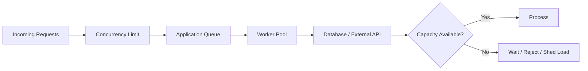
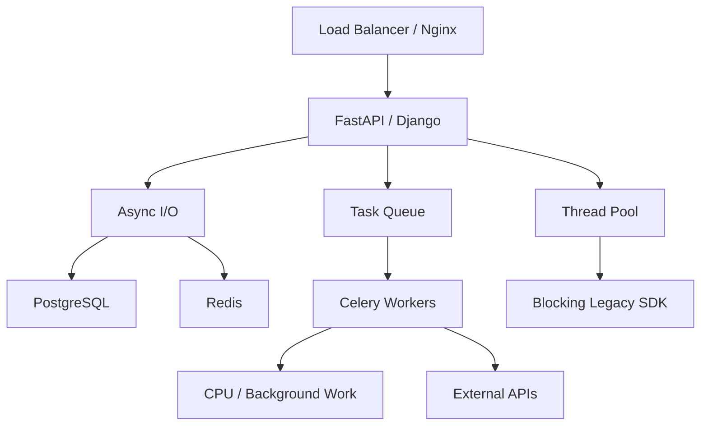

# 12- Threading Multiprocessing Asyncio

## Overview

Python provides several concurrency mechanisms, each optimized for different execution models:

- `threading` for concurrent work within one process;
- `multiprocessing` for process-based parallelism;
- `asyncio` for cooperative concurrency, primarily around I/O;
- executors for integrating synchronous work with asynchronous applications;
- external workers such as Celery for durable, independently scalable background processing.

The key engineering decision is not "which concurrency API is best?" but:

> What resource is the workload waiting on, how much parallelism is required, what state must be shared, and what failure and scaling guarantees are needed?

```text
                         Workload
                            │
              ┌─────────────┴─────────────┐
              │                           │
           I/O-bound                  CPU-bound
              │                           │
       ┌──────┴──────┐              ┌─────┴─────┐
       │             │              │           │
   Async-native   Blocking      Processes   Native code
       │             │              │           │
    asyncio       threads       multiprocessing  │
       │             │              │           │
       └─────────────┴──────────────┴───────────┘
                            │
                            ▼
                    Application architecture
```

Concurrency also has a cost. Every additional task, thread, process, connection, queue entry, and retained object consumes resources. Production systems therefore need bounded concurrency rather than unlimited parallelism.

---

## Concurrency Models

### Threading

Threads execute within the same process and share its memory.

```text
Process
├── Thread A
├── Thread B
└── Thread C
       │
       └── shared process memory
```

Threads are particularly useful for blocking I/O and integration with synchronous libraries.

### Multiprocessing

Processes have independent address spaces and interpreters.

```text
Process A ──► Interpreter A ──► CPU
Process B ──► Interpreter B ──► CPU
Process C ──► Interpreter C ──► CPU
```

Processes are useful for CPU-bound Python workloads and stronger failure isolation.

### Asyncio

`asyncio` uses an event loop and cooperative scheduling.

```text
Event Loop
├── Task A ──► await I/O
├── Task B ──► await I/O
├── Task C ──► execute
└── Task D ──► await I/O
```

It is highly effective when operations are asynchronous and spend substantial time waiting.

---

## Choosing a Concurrency Model

| Workload | Starting point | Main consideration |
|---|---|---|
| Async HTTP calls | `asyncio` | Connection limits |
| Async PostgreSQL access | `asyncio` | DB pool capacity |
| Blocking HTTP library | Threads | Thread pool size |
| Blocking SDK | Threads | Resource limits |
| CPU-heavy pure Python | Processes | Memory and IPC |
| Long CPU jobs | Worker processes / Celery | Queue capacity |
| Large I/O fan-out | `asyncio` | Backpressure |
| Legacy synchronous code | Threads | Blocking duration |
| Distributed background work | Celery / queue | Durability |
| Shared persistent state | Database / Redis | Consistency |

The workload and surrounding infrastructure should determine the design.

---

## Threading

Python's `threading` module provides OS-level threads within a process.

```python
from threading import Thread


def process_customer(customer_id: str) -> None:
    customer = blocking_client.fetch_customer(customer_id)
    save_customer(customer)


thread = Thread(
    target=process_customer,
    args=("cust-123",),
)

thread.start()
thread.join()
```

Threads share the same process memory, making communication relatively simple but also making shared-state bugs possible.

---

## Thread Lifecycle

A typical thread lifecycle is:

```text
Create
  │
  ▼
Start
  │
  ▼
Runnable
  │
  ├──► Running
  │
  ├──► Waiting
  │
  └──► Blocked
  │
  ▼
Finished
```

`start()` launches the thread.

`join()` waits for its completion.

Do not create unbounded threads based directly on incoming request volume.

---

## Thread Pools

For backend applications, a thread pool is usually preferable to manually creating a thread for every task.

```python
from concurrent.futures import ThreadPoolExecutor


def fetch_customer(customer_id: str) -> dict:
    return blocking_client.fetch_customer(customer_id)


customer_ids = [
    "cust-1",
    "cust-2",
    "cust-3",
]

with ThreadPoolExecutor(max_workers=10) as executor:
    customers = list(
        executor.map(fetch_customer, customer_ids)
    )
```

A pool:

- limits thread count;
- reuses threads;
- simplifies lifecycle management;
- provides a natural concurrency boundary.

---

## Thread Pool Sizing

Thread count should be based on workload and downstream capacity.

For I/O-heavy workloads, more threads than CPU cores can be useful because many threads spend time waiting.

However, excessive threads cause:

- memory overhead;
- context-switching overhead;
- connection pressure;
- downstream overload;
- increased latency.

A practical starting point is to measure:

```text
Request rate
     │
     ▼
Concurrent operations
     │
     ▼
Thread pool
     │
     ▼
Downstream connection pool
     │
     ▼
Downstream service
```

The smallest constrained resource often determines the useful concurrency level.

---

## Thread-Safe Data Structures

Sharing mutable state between threads requires careful synchronization.

```python
from threading import Lock


class Counter:
    def __init__(self):
        self._value = 0
        self._lock = Lock()

    def increment(self) -> int:
        with self._lock:
            self._value += 1
            return self._value
```

The lock protects the invariant around `_value`.

Prefer minimizing shared mutable state rather than adding locks everywhere.

---

## Threading Synchronization Primitives

Python provides several synchronization mechanisms.

| Primitive | Use |
|---|---|
| `Lock` | Mutual exclusion |
| `RLock` | Re-entrant mutual exclusion |
| `Semaphore` | Limit concurrent access |
| `BoundedSemaphore` | Detect excessive releases |
| `Event` | Signal between threads |
| `Condition` | Wait for state changes |
| `Barrier` | Coordinate thread phases |
| `Queue` | Thread-safe producer/consumer communication |

Use the simplest primitive that expresses the required coordination.

---

## Thread-Safe Queues

A queue is often preferable to sharing arbitrary mutable structures.

```python
from queue import Queue
from threading import Thread


queue: Queue[str] = Queue()


def worker() -> None:
    while True:
        item = queue.get()

        try:
            process(item)
        finally:
            queue.task_done()


thread = Thread(target=worker, daemon=True)
thread.start()
```

The queue provides synchronization around producer/consumer communication.

For production systems, bounded queues are usually safer.

---

## Producer-Consumer Pattern

```text
Producer
   │
   ▼
Bounded Queue
   │
   ├──► Worker 1
   ├──► Worker 2
   └──► Worker N
           │
           ▼
        Output
```

The queue decouples producers from consumers while providing a natural place for backpressure.

The same architectural pattern appears in:

- Celery;
- Kafka consumers;
- SQS workers;
- internal thread pools;
- async worker queues.

---

## Daemon Threads

A daemon thread does not prevent the Python process from exiting.

```python
thread = Thread(
    target=worker,
    daemon=True,
)
```

Daemon threads can be useful for auxiliary tasks, but they are inappropriate for work that must be completed reliably.

For critical work, prefer explicit lifecycle management and graceful shutdown.

---

## Thread Exceptions

An exception raised in a worker thread does not automatically behave like an exception raised directly by the caller.

Using `ThreadPoolExecutor` is often preferable because `Future.result()` exposes worker exceptions:

```python
with ThreadPoolExecutor(max_workers=5) as executor:
    future = executor.submit(process_customer, "cust-1")

    try:
        future.result()
    except CustomerProcessingError:
        handle_failure()
```

Production systems should make worker failures observable rather than silently losing them.

---

## Threading and the GIL

Traditional GIL-enabled CPython does not allow multiple threads within the same interpreter to execute Python bytecode simultaneously.

This limits CPU parallelism for pure-Python CPU-bound workloads.

Threads can still provide useful concurrency when:

- waiting on network I/O;
- waiting on disk I/O;
- using blocking APIs;
- executing native code that releases the GIL.

Therefore:

```text
I/O-bound
Python → wait → another thread executes
        ✓ useful concurrency

CPU-bound pure Python
Thread A ↔ Thread B
        GIL
        ✗ limited CPU parallelism
```

---

## Multiprocessing

The `multiprocessing` module provides process-based parallel execution.

```python
from multiprocessing import Process


def process_batch(batch: list[int]) -> None:
    for item in batch:
        expensive_calculation(item)


process = Process(
    target=process_batch,
    args=([1, 2, 3],),
)

process.start()
process.join()
```

Each process has its own interpreter and memory space.

---

## Why Processes Help With CPU-Bound Work

With multiple processes:

```text
Process 1 ──► Core 1
Process 2 ──► Core 2
Process 3 ──► Core 3
Process 4 ──► Core 4
```

Each interpreter can execute Python bytecode independently.

This provides genuine CPU parallelism without requiring multiple threads in one GIL-constrained interpreter.

---

## Process Pools

For repeated CPU-bound operations, `ProcessPoolExecutor` is usually cleaner than manually managing processes.

```python
from concurrent.futures import ProcessPoolExecutor


def calculate(value: int) -> int:
    return expensive_calculation(value)


values = range(100_000)

with ProcessPoolExecutor() as executor:
    results = list(
        executor.map(calculate, values)
    )
```

The executor manages process creation and task distribution.

---

## Multiprocessing Serialization

Data sent between processes generally needs inter-process communication and often serialization.

Conceptually:

```text
Process A
   │
   ▼
Serialize object
   │
   ▼
IPC
   │
   ▼
Deserialize object
   │
   ▼
Process B
```

Large Python objects can therefore make multiprocessing expensive.

A CPU-parallel design can lose its benefit if it spends too much time serializing and transferring data.

---

## Process Memory

Processes have separate memory.

```text
Process A ── Memory A
Process B ── Memory B
Process C ── Memory C
```

If one worker requires substantial memory, adding workers can multiply total memory consumption.

This is particularly important in:

- Docker containers;
- Kubernetes pods;
- EC2 instances;
- CI runners.

CPU scaling must therefore be evaluated together with memory scaling.

---

## Process Start Methods

Python multiprocessing supports different process start methods depending on platform and configuration.

Common methods include:

- `spawn`;
- `fork`;
- `forkserver`.

The behavior differs significantly.

`spawn` starts a fresh interpreter and imports the required module.

`fork` creates a child process using the parent's address space initially, relying on copy-on-write.

Do not assume process-start behavior is identical across Linux, macOS, and Windows.

---

## Safe Multiprocessing Entry Point

When using multiprocessing directly, protect the entry point:

```python
from multiprocessing import Process


def main() -> None:
    process = Process(target=worker)
    process.start()
    process.join()


if __name__ == "__main__":
    main()
```

This is particularly important for start methods that import the main module into child processes.

---

## Fork and Copy-on-Write

With `fork`, child processes initially share memory pages with the parent until modifications occur.

Conceptually:

```text
Parent
  │
  ├── shared page A
  ├── shared page B
  └── shared page C
       │
       ▼
     fork()
       │
       ├── Child references same pages
       │
       └── Modification
               │
               ▼
          Copy-on-write
```

This can reduce initial memory duplication, but large mutable state can become expensive once modified.

Do not rely on fork-based memory sharing as a substitute for explicit memory planning.

---

## Inter-Process Communication

Processes can communicate using:

- `multiprocessing.Queue`;
- `Pipe`;
- shared memory;
- manager objects;
- sockets;
- files;
- databases;
- external queues.

For large or distributed workloads, an external system such as Kafka or SQS may be more appropriate than tightly coupling processes through local IPC.

---

## Shared Memory

Python provides shared-memory mechanisms for suitable workloads.

Shared memory can reduce serialization overhead for large data structures, but introduces synchronization and lifecycle complexity.

Use it when:

- data volume is large;
- copying is a measured bottleneck;
- processes share a host;
- the workload benefits from direct memory access.

For general backend jobs, simpler process queues or external storage are often easier to operate.

---

## Asyncio

`asyncio` provides asynchronous cooperative concurrency.

A coroutine:

```python
async def fetch_customer(customer_id: str):
    return await client.get_customer(customer_id)
```

does not execute its body merely because it is called.

Calling it produces a coroutine object:

```python
coroutine = fetch_customer("cust-1")
```

Execution occurs when the coroutine is awaited or scheduled.

---

## Event Loop

The event loop coordinates asynchronous tasks.

```text
                Event Loop
                    │
        ┌───────────┼───────────┐
        ▼           ▼           ▼
      Task A      Task B      Task C
        │           │           │
     await I/O   await I/O   Python work
        │           │
        └──────┬────┘
               ▼
        Ready callbacks
```

The event loop repeatedly runs tasks until they yield control.

---

## Cooperative Scheduling

Asyncio tasks generally yield at `await` points.

```python
async def process():
    result = await fetch_data()
    transformed = transform(result)
    await save_data(transformed)
```

The event loop can schedule other tasks while `fetch_data()` or `save_data()` is waiting.

This differs from threads, where the OS/runtime can switch execution between threads independently of application-level `await` points.

---

## Asyncio Is Not Parallelism

This code remains CPU-bound:

```python
async def calculate() -> int:
    total = 0

    for value in range(10_000_000):
        total += value

    return total
```

The event loop cannot schedule another task during the long CPU loop unless the coroutine yields.

Therefore, async code should keep CPU-heavy operations off the event-loop thread.

---

## Asyncio Tasks

Use `asyncio.create_task()` when work should run concurrently.

```python
task_a = asyncio.create_task(fetch_customer("cust-1"))
task_b = asyncio.create_task(fetch_customer("cust-2"))

customer_a = await task_a
customer_b = await task_b
```

For multiple independent operations:

```python
results = await asyncio.gather(
    fetch_customer("cust-1"),
    fetch_customer("cust-2"),
    fetch_customer("cust-3"),
)
```

The operations can overlap when they spend time awaiting I/O.

---

## Structured Concurrency

Modern Python provides `asyncio.TaskGroup` for structured task management.

```python
import asyncio


async def process_batch() -> None:
    async with asyncio.TaskGroup() as group:
        group.create_task(fetch_customer("cust-1"))
        group.create_task(fetch_customer("cust-2"))
        group.create_task(fetch_customer("cust-3"))
```

`TaskGroup` provides clearer task ownership and failure propagation than manually creating detached tasks.

It is particularly useful when child tasks belong to a specific request or operation.

---

## Task Cancellation

Asyncio supports cooperative cancellation.

```python
task.cancel()

try:
    await task
except asyncio.CancelledError:
    handle_cancellation()
```

Cancellation is an important part of production async design.

Code should avoid swallowing `CancelledError` unintentionally.

Cancellation should also propagate through:

- HTTP requests;
- database operations;
- background tasks;
- cleanup logic.

---

## Blocking Code in Asyncio

This is dangerous:

```python
async def handler():
    result = requests.get("https://example.com")
    return result.json()
```

`requests.get()` blocks the event-loop thread.

A better approach is to use an asynchronous client:

```python
async def handler():
    response = await async_client.get(
        "https://example.com"
    )
    return response.json()
```

For unavoidable blocking work:

```python
async def handler():
    result = await asyncio.to_thread(
        blocking_operation
    )
    return result
```

---

## Async Context Managers

Async resources often require asynchronous setup and cleanup.

```python
async with AsyncClient() as client:
    response = await client.get(url)
```

This is useful for:

- HTTP clients;
- asynchronous database sessions;
- locks;
- streaming resources.

Resource lifetime should align with the application's ownership boundary.

---

## Asyncio Synchronization

Asyncio provides equivalents for several synchronization primitives:

- `asyncio.Lock`;
- `asyncio.Event`;
- `asyncio.Condition`;
- `asyncio.Semaphore`;
- `asyncio.Queue`.

Example:

```python
lock = asyncio.Lock()


async def update_state() -> None:
    async with lock:
        await modify_shared_state()
```

An asyncio lock coordinates tasks within the relevant event-loop environment. It is not a distributed lock.

---

## Asyncio Semaphore

Semaphores are useful for limiting concurrent operations.

```python
import asyncio


semaphore = asyncio.Semaphore(20)


async def fetch(item: str) -> dict:
    async with semaphore:
        return await client.fetch(item)
```

This can prevent excessive concurrency against downstream APIs.

The limit should be based on measured application and downstream capacity.

---

## Asyncio Queue

A bounded async queue implements producer-consumer backpressure.

```python
import asyncio


queue: asyncio.Queue[str] = asyncio.Queue(
    maxsize=1000
)


async def producer(items: list[str]) -> None:
    for item in items:
        await queue.put(item)


async def consumer() -> None:
    while True:
        item = await queue.get()

        try:
            await process(item)
        finally:
            queue.task_done()
```

When the queue is full, `put()` waits rather than allowing unlimited memory growth.

---

## Threading vs Asyncio

Both can handle I/O-bound workloads, but their programming models differ.

```text
Threading
─────────
Thread
  │
  ├── blocking operation
  │
  └── runtime schedules threads

Asyncio
───────
Event loop
  │
  ├── coroutine
  │      └── await
  │
  └── next ready coroutine
```

Asyncio generally scales to large numbers of concurrent I/O tasks with lower per-task overhead, provided the entire stack supports asynchronous operation.

Threads are often easier for integrating blocking libraries.

---

## Asyncio vs Threading

| Aspect | Asyncio | Threading |
|---|---|---|
| Scheduling | Cooperative | OS/runtime threads |
| Typical I/O | Excellent | Excellent |
| Blocking libraries | Poor unless offloaded | Excellent |
| Large I/O fan-out | Efficient | Higher thread overhead |
| CPU-bound Python | Poor | Poor for parallelism under traditional GIL |
| Shared state | Easy to access | Easy to access |
| Synchronization | Async primitives | Thread primitives |
| Debugging | Async-specific complexity | Thread race complexity |

---

## Multiprocessing vs Asyncio

These solve different problems.

| Aspect | Multiprocessing | Asyncio |
|---|---|---|
| Main goal | CPU parallelism | I/O concurrency |
| Execution | Multiple processes | One event loop/thread typically |
| CPU-bound Python | Excellent | Poor |
| I/O-bound | Possible | Excellent |
| Memory | High | Lower per task |
| Communication | IPC / serialization | In-process |
| Failure isolation | Stronger | Lower |
| Programming model | Parallel workers | Cooperative tasks |

A production system may use both.

---

## Combining Asyncio and Processes

An async service may delegate CPU-heavy work to a process pool.

```python
import asyncio
from concurrent.futures import ProcessPoolExecutor


def cpu_heavy_job(value: int) -> int:
    return expensive_calculation(value)


async def handle(value: int) -> int:
    loop = asyncio.get_running_loop()

    with ProcessPoolExecutor() as pool:
        return await loop.run_in_executor(
            pool,
            cpu_heavy_job,
            value,
        )
```

In a production application, do not create a new process pool for every request. Use a properly managed long-lived pool or, for substantial workloads, a dedicated worker service.

---

## Combining Asyncio and Threads

Async applications frequently need to integrate synchronous libraries.

```python
async def get_legacy_data():
    return await asyncio.to_thread(
        legacy_client.fetch
    )
```

This is useful for blocking operations that cannot be replaced immediately.

However, the thread pool must be bounded.

---

## FastAPI Concurrency Model

A FastAPI service may use async endpoints:

```python
@app.get("/customers/{customer_id}")
async def get_customer(customer_id: str):
    return await customer_service.get(customer_id)
```

The request can yield while waiting for:

- PostgreSQL;
- Redis;
- HTTP services;
- object storage.

The application should use async-compatible clients throughout the critical path.

If blocking code is introduced, event-loop responsiveness can degrade.

---

## Django and Concurrency

Django applications can be deployed with multiple worker processes and can also use asynchronous views and APIs where the surrounding stack supports them.

The important consideration is not whether a framework is "async" or "sync" but whether the complete request path matches the concurrency model.

For example:

```text
Async endpoint
     │
     ▼
Async ORM / HTTP client
     │
     ▼
Async-compatible downstream
```

is fundamentally different from:

```text
Async endpoint
     │
     ▼
Blocking HTTP client
     │
     ▼
Event loop blocked
```

---

## Database Concurrency

Database access often becomes the actual bottleneck.

Suppose:

```text
API concurrency = 500
DB connections = 20
```

Only a limited number of operations can execute concurrently against the database.

Increasing application concurrency without considering PostgreSQL capacity can increase:

- connection wait time;
- lock contention;
- CPU usage;
- query latency;
- transaction duration.

Concurrency should therefore be coordinated with database pool sizing.

---

## Connection Pooling

A connection pool is itself a concurrency control mechanism.

```text
500 application tasks
        │
        ▼
20 DB connections
        │
        ▼
PostgreSQL
```

Requests wait for an available connection instead of opening unlimited connections.

The same principle applies to:

- HTTP connection pools;
- Redis connections;
- Kafka consumers;
- thread pools.

---

## Backpressure

Backpressure prevents producers from overwhelming consumers.



A mature system explicitly defines what happens when capacity is exhausted.

Possible strategies include:

- wait;
- reject;
- rate-limit;
- shed load;
- enqueue durably;
- retry later.

---

## Timeouts

Concurrency without timeouts can lead to resource exhaustion.

```text
Downstream request
       │
       ▼
No response
       │
       ▼
Task remains active
       │
       ▼
Connection remains occupied
       │
       ▼
Concurrency grows
```

Use appropriate timeouts for external operations.

Timeouts should be propagated through the request lifecycle rather than independently allowing every layer to wait indefinitely.

---

## Retries

Retries consume concurrency.

A service receiving 1,000 failed requests with two retries can generate up to 3,000 attempts under a simple worst-case model.

Use:

- bounded retries;
- exponential backoff;
- jitter;
- idempotency;
- retryable-error classification;
- overall timeout budgets.

Otherwise, retries can amplify an outage.

---

## CPU-Bound Work in Backend Services

Avoid expensive pure-Python computation inside latency-sensitive request handlers.

Instead:

```text
HTTP Request
     │
     ▼
API Service
     │
     ▼
Queue
     │
     ▼
CPU Worker
     │
     ▼
Result / Event / Storage
```

This separates interactive traffic from resource-intensive work.

Celery, Kafka-based workers, SQS consumers, or dedicated Kubernetes worker deployments can provide stronger operational isolation.

---

## High Availability

Concurrency mechanisms are generally process-local.

A Python lock does not coordinate:

```text
Pod A ── Lock A
Pod B ── Lock B
Pod C ── Lock C
```

For distributed systems, coordination must occur through a shared mechanism such as:

- PostgreSQL transactions/locks;
- Redis;
- distributed coordination systems;
- message brokers.

Design for the actual scope of shared state.

---

## Graceful Shutdown

Production concurrency requires controlled shutdown.

```text
SIGTERM
  │
  ▼
Stop accepting new work
  │
  ▼
Drain / cancel appropriate tasks
  │
  ▼
Finish safe in-flight work
  │
  ▼
Close pools and connections
  │
  ▼
Exit
```

This is particularly important with Kubernetes rolling deployments.

Workers should not silently abandon durable work.

---

## Observability

Monitor concurrency as a first-class production resource.

Useful metrics include:

| Metric | What it reveals |
|---|---|
| Active requests | Application concurrency |
| Event-loop latency | Async blocking |
| Thread-pool utilization | Blocking workload pressure |
| Process CPU | CPU saturation |
| Process RSS | Memory pressure |
| DB pool utilization | Database bottleneck |
| Connection wait time | Pool exhaustion |
| Queue depth | Consumer saturation |
| Task count | Async workload growth |
| Timeout rate | Downstream/resource pressure |
| Retry rate | Failure amplification |

Tracing should also preserve request context across async and worker boundaries where supported.

---

## Testing Concurrent Systems

Concurrency tests should focus on behavior rather than exact execution ordering.

Test:

- race conditions;
- cancellation;
- timeouts;
- retry behavior;
- queue saturation;
- worker failures;
- shutdown;
- database conflicts;
- resource exhaustion.

Load tests should measure:

```text
Throughput
   +
Latency
   +
CPU
   +
Memory
   +
Connection utilization
   +
Queue depth
```

A concurrency implementation that passes unit tests may still fail under production-level contention.

---

## Common Mistakes

### Using Threads for CPU-Bound Python

Traditional GIL-enabled CPython prevents threads from providing straightforward CPU parallelism for pure Python bytecode.

Use processes or appropriate native implementations.

### Using Asyncio With Blocking Libraries

A blocking operation can stall the entire event loop.

Use async-compatible libraries or thread offloading.

### Creating Unlimited Tasks

This can exhaust memory and downstream resources.

Use bounded concurrency.

### Creating a Process Per Request

Process startup, memory, and IPC costs are too high for most request paths.

Use process pools or dedicated workers.

### Assuming the GIL Makes Code Thread-Safe

The GIL is not an application synchronization mechanism.

### Ignoring Downstream Capacity

500 concurrent requests can overwhelm a database configured for 20 useful concurrent connections.

### Swallowing Cancellation

Ignoring `CancelledError` can prevent clean shutdown and waste resources.

### Retrying Without Limits

Retries can turn a partial failure into a cascading outage.

---

## Production Pitfalls

| Problem | Impact | Better approach |
|---|---|---|
| Unlimited threads | Memory/context switching | Bounded thread pool |
| Unlimited asyncio tasks | Memory pressure | Semaphore/queue |
| Unlimited DB connections | Database overload | Connection pool |
| Blocking async handler | Event-loop stall | Async client / thread offload |
| CPU work in API process | High tail latency | Process/worker isolation |
| Unbounded queue | Memory growth | Bounded queue/backpressure |
| Process-per-task | High startup/memory cost | Process pool |
| Shared mutable state | Race conditions | Lock or redesign |
| No timeout | Stuck resources | Timeout budgets |
| Aggressive retry | Retry storm | Backoff + jitter |
| Local lock across pods | Incorrect coordination | Shared/distributed mechanism |

---

## Interview Traps

### Are Threads Concurrent or Parallel in Python?

Threads are concurrent. In traditional GIL-enabled CPython, they do not provide general parallel execution of Python bytecode within one interpreter, although I/O and suitable native operations can overlap.

### Is Asyncio Multithreaded?

Not inherently. An asyncio event loop commonly runs in one thread, coordinating many cooperative tasks.

### Can Asyncio Use Multiple CPU Cores?

Not by itself. CPU parallelism requires processes, suitable native execution, or a free-threaded runtime configuration.

### Why Use Threads Instead of Asyncio?

Threads are often easier when integrating blocking libraries or legacy synchronous code.

### Why Use Processes Instead of Threads?

Processes provide independent interpreters and memory spaces, allowing CPU-bound pure-Python workloads to execute in parallel.

### Does Multiprocessing Automatically Make Code Faster?

No. Serialization, IPC, process startup, memory consumption, scheduling, and workload granularity can outweigh the parallelism benefit.

### Can an Asyncio Lock Protect Data Across Kubernetes Pods?

No. It only coordinates tasks within its applicable event-loop/process context.

### Why Is Bounded Concurrency Important?

Because every concurrent operation consumes resources. Unlimited concurrency can exhaust memory, connections, CPU, queues, or downstream service capacity.

---

## Senior-Level Interview Questions

### How Would You Process 100,000 HTTP Requests Concurrently?

Do not create 100,000 unconstrained connections or tasks.

Use:

```text
Input
  │
  ▼
Bounded work queue
  │
  ▼
Async workers
  │
  ▼
HTTP connection pool
  │
  ▼
Downstream API
```

Control:

- maximum task concurrency;
- connection pool size;
- request timeout;
- retry policy;
- downstream rate limits;
- memory usage.

For very large workloads, durable queues and worker processes may be more appropriate.

---

### How Would You Process a CPU-Heavy Dataset?

Use bounded batches and process workers:

```text
Dataset
   │
   ▼
Batching
   │
   ▼
Process Pool
 ┌─┼─┬─┐
 ▼ ▼ ▼ ▼
P1 P2 P3 P4
 └─┴─┴─┘
   │
   ▼
Output
```

Avoid transferring unnecessarily large objects between processes.

For long-running production jobs, an external worker architecture may provide better observability, retries, and scaling.

---

### How Would You Prevent a FastAPI Service From Overloading PostgreSQL?

Control concurrency at multiple layers:

```text
Requests
   │
   ▼
Application concurrency
   │
   ▼
DB connection pool
   │
   ▼
PostgreSQL
```

Then add:

- query optimization;
- timeouts;
- transaction boundaries;
- rate limiting where appropriate;
- load shedding;
- monitoring of connection wait time;
- database CPU and lock metrics.

Increasing application concurrency without increasing database capacity is usually counterproductive.

---

### When Would You Choose Celery Over `ProcessPoolExecutor`?

Use a local process pool when work is:

- short-lived;
- local to one application instance;
- immediately required;
- not worth durable queue semantics.

Use Celery or another worker system when work needs:

- durable queuing;
- retries;
- independent scaling;
- worker monitoring;
- task persistence;
- failure recovery;
- execution outside the API lifecycle.

The architectural distinction is:

```text
Process Pool
API Process
   └── local CPU workers

Celery
API
 │
 ▼
Broker
 │
 ▼
Independent Worker Fleet
```

---

### How Would You Diagnose an Async Service With Increasing Latency?

Check:

1. event-loop latency;
2. CPU saturation;
3. blocking synchronous calls;
4. connection pool wait;
5. downstream latency;
6. task count;
7. queue depth;
8. memory pressure;
9. retry amplification.

If the event loop is blocked, increasing async concurrency will not solve the problem.

---

### How Would You Design Concurrency for a Payment Service?

Use concurrency carefully because correctness matters more than raw throughput.

For persistent state:

```text
Request
   │
   ▼
Idempotency key
   │
   ▼
Database transaction
   │
   ├── validate state
   ├── update state
   └── record operation
   │
   ▼
Commit
```

Use database constraints and transactions for financial invariants.

Do not attempt to solve distributed correctness with an in-process Python lock.

---

## Production Architecture

A mature Python backend may combine all three mechanisms:



Each mechanism has a specific role:

- **asyncio** handles high-concurrency I/O;
- **threads** isolate blocking synchronous operations;
- **processes/workers** execute CPU-heavy work independently;
- **queues** provide decoupling and backpressure;
- **PostgreSQL/Redis** provide shared state where appropriate.

---

## Practical Decision Framework

Before selecting a concurrency mechanism, answer:

### What Is the Bottleneck?

```text
Network / DB / API wait
        → asyncio or threads

CPU-bound Python
        → processes / workers

Blocking legacy library
        → threads

Long-running background job
        → queue + workers
```

### What Is the State Scope?

```text
Local task
    → local variables

Process
    → locks / queues

Host
    → IPC / shared memory

Cluster
    → Redis / PostgreSQL / Kafka / queue
```

### What Happens During Failure?

Define:

- timeout behavior;
- cancellation;
- retries;
- duplicate execution;
- task persistence;
- worker failure;
- shutdown behavior.

Concurrency without failure semantics is incomplete production design.

---

## Key Takeaways

- **Threading, multiprocessing, and asyncio solve different problems:** use threads primarily for blocking I/O, processes for CPU parallelism, and asyncio for high-concurrency asynchronous I/O.
- **The GIL does not make threading useless:** traditional GIL-enabled CPython limits parallel Python bytecode execution across threads, but threads remain effective for I/O and suitable native operations.
- **Bound concurrency at every layer:** task counts, thread pools, process pools, database connections, HTTP connections, queues, and downstream requests all require explicit capacity limits.
- **Concurrency must include failure and lifecycle semantics:** timeouts, cancellation, retries, backpressure, graceful shutdown, and worker failure handling are as important as execution speed.
- **Use local concurrency primitives only for local coordination:** locks and semaphores do not provide distributed consistency; cross-process or cross-pod state requires appropriate databases, caches, queues, or distributed coordination mechanisms.