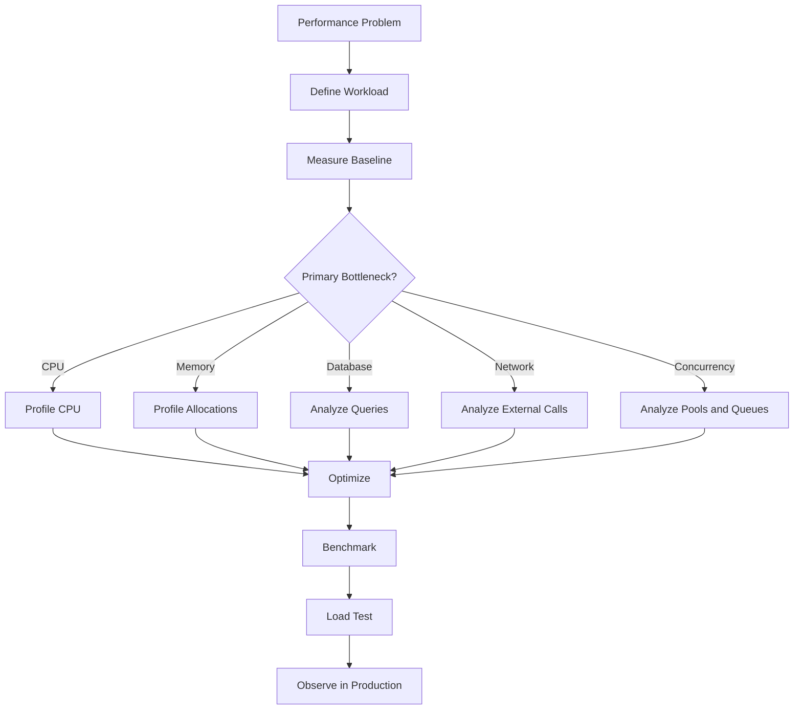
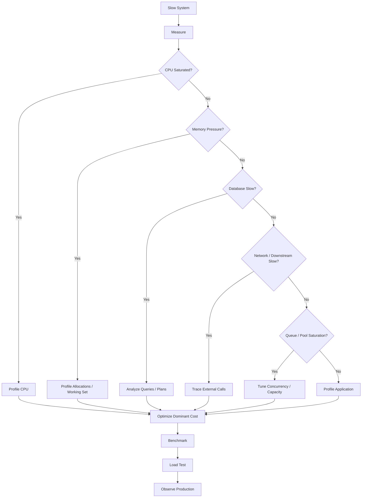

# 13- Performance

## Overview

Python performance engineering is primarily about identifying the actual bottleneck, measuring it, and improving the highest-impact part of the system without unnecessarily reducing code clarity.

For backend systems, performance is broader than execution speed. It includes:

- latency;
- throughput;
- CPU utilization;
- memory consumption;
- database efficiency;
- network utilization;
- concurrency;
- serialization overhead;
- startup time;
- resource contention;
- scalability.

A useful performance model is:

```text
Client
  │
  ▼
Nginx / Load Balancer
  │
  ▼
Application
  │
  ├── CPU
  ├── Memory
  ├── Serialization
  ├── Threads / Async Tasks
  │
  ├── PostgreSQL
  ├── Redis
  ├── External APIs
  └── Message Broker
```

Optimizing Python code while ignoring a slow PostgreSQL query or downstream HTTP call rarely produces a meaningful improvement.

The central principle is:

> Measure first, identify the bottleneck, optimize the bottleneck, and measure again.

---

## Performance Dimensions

Performance has several independent dimensions.

| Dimension | Meaning | Typical metric |
|---|---|---|
| Latency | Time required for one operation | p50 / p95 / p99 |
| Throughput | Work completed per unit time | Requests/sec |
| CPU | Processor utilization | CPU % |
| Memory | Process working set | RSS / working set |
| I/O | Time spent waiting on external resources | I/O latency |
| Concurrency | Active work at a time | Active requests/tasks |
| Startup | Time to become ready | Startup seconds |
| Scalability | Performance as load/resources increase | Throughput vs load |

A system can have low average latency while having unacceptable p99 latency.

---

## Latency Percentiles

Average latency can hide tail behavior.

Suppose request latency is:

```text
10 ms
11 ms
12 ms
13 ms
5000 ms
```

The average is heavily influenced by one outlier.

Percentiles provide a more useful operational view:

- **p50** — median;
- **p95** — 95% of requests are at or below this latency;
- **p99** — 99% are at or below this latency;
- **p99.9** — useful for high-scale systems with strict tail requirements.

Production APIs should generally monitor percentile latency rather than only averages.

---

## Throughput

Throughput measures how much work a system can perform over time.

Examples:

```text
1,000 requests/sec
50,000 messages/sec
200 database operations/sec
```

Latency and throughput are related but not interchangeable.

A system can increase throughput while increasing latency if it operates closer to saturation.

---

## Little's Law

A useful systems relationship is:

```text
L = λ × W
```

Where:

- `L` = average number of items in the system;
- `λ` = throughput;
- `W` = average time in the system.

For example, if a service processes 1,000 requests/sec and average latency is 100 ms:

```text
L = 1,000 × 0.1
  = 100 concurrent requests
```

This helps reason about concurrency and capacity.

---

## Big-O Complexity

Algorithmic complexity describes how resource requirements grow with input size.

Common complexities:

| Complexity | Example |
|---|---|
| O(1) | Dictionary lookup, average case |
| O(log n) | Binary search |
| O(n) | Linear scan |
| O(n log n) | Efficient comparison sorting |
| O(n²) | Nested pairwise loops |
| O(2ⁿ) | Some exhaustive recursive algorithms |

For backend engineering, complexity matters when data volume can grow significantly.

---

## Python Collection Complexity

Typical average-case behavior:

| Operation | `list` | `dict` | `set` | `deque` |
|---|---:|---:|---:|---:|
| Index access | O(1) | — | — | O(1) ends |
| Append | O(1)* | O(1)* | O(1)* | O(1) |
| Membership | O(n) | O(1)* | O(1)* | O(n) |
| Remove arbitrary item | O(n) | O(1)* | O(1)* | O(n) |
| Pop left | O(n) | — | — | O(1) |
| Pop right | O(1) | — | — | O(1) |

`*` indicates typical amortized or average-case behavior rather than an unconditional worst-case guarantee.

Choosing the correct data structure often provides a larger improvement than micro-optimizing the surrounding Python code.

---

## Algorithmic Performance

Consider:

```python
def find_duplicate(values: list[int]) -> bool:
    for i, value in enumerate(values):
        if value in values[i + 1:]:
            return True

    return False
```

This creates slices and repeatedly searches the remaining list.

A set-based approach is typically much more efficient:

```python
def find_duplicate(values: list[int]) -> bool:
    seen: set[int] = set()

    for value in values:
        if value in seen:
            return True

        seen.add(value)

    return False
```

The important optimization is not a Python syntax trick. It is changing the algorithm and data structure.

---

## Avoid Premature Optimization

Premature optimization often introduces complexity without measurable benefit.

Avoid changing:

```python
customers = [
    customer
    for customer in customers
    if customer.active
]
```

merely because you believe another syntax is faster.

First determine:

- how frequently this code runs;
- input size;
- actual execution time;
- whether it is on a critical path;
- whether a database or network operation dominates it.

Optimization should be driven by evidence.

---

## Performance Hierarchy

A useful optimization order is:

```text
Architecture
    │
    ▼
Algorithms / Data Structures
    │
    ▼
Database / Network
    │
    ▼
Concurrency
    │
    ▼
Memory Allocation
    │
    ▼
Python Implementation Details
    │
    ▼
Micro-optimizations
```

The highest layers generally offer the greatest potential impact.

For example, replacing:

```text
1,000,000 database rows → Python → aggregate
```

with:

```text
PostgreSQL → aggregate → one result
```

can produce a much larger improvement than optimizing the Python loop.

---

## CPU-Bound vs I/O-Bound

Performance analysis should first classify the workload.

### CPU-Bound

The process spends most of its time computing.

Examples:

- pure-Python data transformations;
- parsing;
- compression;
- image processing;
- complex calculations.

### I/O-Bound

The process spends substantial time waiting.

Examples:

- PostgreSQL;
- Redis;
- HTTP APIs;
- S3;
- Kafka;
- filesystem operations.

```text
CPU-bound
Python ──► CPU ──► CPU ──► CPU

I/O-bound
Python ──► DB
             │
             │ wait
             ▼
          Python
```

The optimization strategy differs significantly.

---

## Amdahl's Law

Amdahl's Law illustrates why optimizing a small portion of a program has limited overall impact.

If 10% of execution time is spent in a component and that component becomes infinitely fast:

```text
Maximum theoretical speedup = 1 / 0.9
                            ≈ 1.11x
```

If 80% of execution time is optimized infinitely:

```text
Maximum theoretical speedup = 1 / 0.2
                            = 5x
```

The engineering implication is:

> Optimize the dominant cost, not the easiest code to change.

---

## Measuring Before Optimizing

A performance investigation should establish a baseline.

Record:

- workload;
- input size;
- Python version;
- dependency versions;
- hardware/container limits;
- concurrency;
- execution time;
- CPU;
- memory;
- downstream latency.

Without a controlled baseline, it is difficult to determine whether an optimization actually worked.

---

## Benchmarking

Use benchmarks for isolated operations.

```python
from timeit import timeit


def build_payload() -> dict[str, int]:
    return {
        str(i): i
        for i in range(1_000)
    }


elapsed = timeit(
    build_payload,
    number=1_000,
)

print(elapsed)
```

`timeit` reduces some noise associated with ordinary timing and is useful for microbenchmarks.

It should not be used as the primary measurement for complete API requests involving real databases and networks.

---

## `time.perf_counter()`

For application-level timing:

```python
from time import perf_counter


start = perf_counter()

result = process_request()

elapsed = perf_counter() - start
```

`perf_counter()` is appropriate for measuring elapsed durations.

For production observability, use metrics/tracing instrumentation rather than ad hoc timing statements.

---

## Benchmarking Rules

A useful benchmark should control:

- input size;
- warm-up behavior;
- environment;
- concurrency;
- Python version;
- dependency versions;
- CPU limits;
- memory limits.

Avoid conclusions such as:

> "Implementation A is faster."

Prefer:

> "Under this workload, on this environment, implementation A reduced median execution time by 25%."

---

## Microbenchmark Pitfalls

Microbenchmarks can be misleading because:

- CPU caches differ;
- branch prediction differs;
- interpreter warm-up matters;
- garbage collection can introduce variation;
- CPU frequency can change;
- OS scheduling introduces noise;
- compiler/native-library behavior can dominate;
- the benchmark may not represent production.

Use multiple iterations and realistic workloads.

---

## Profiling

Profiling identifies where execution time is actually spent.

Typical workflow:

```text
Slow behavior
     │
     ▼
Measure
     │
     ▼
Profile
     │
     ▼
Find hotspot
     │
     ▼
Optimize
     │
     ▼
Benchmark
     │
     ▼
Load test
     │
     ▼
Deploy
     │
     ▼
Observe
```

Profiling is more useful than guessing.

---

## `cProfile`

`cProfile` provides deterministic function-level CPU profiling.

Run:

```bash
python -m cProfile -s cumulative app.py
```

Typical output contains:

- number of calls;
- total time;
- cumulative time;
- function name.

Two important concepts are:

- `tottime` — time spent directly inside the function;
- `cumtime` — time spent in the function plus functions it calls.

A function with high `cumtime` may be an important entry point even if its own `tottime` is small.

---

## Profiling a Function

```python
import cProfile
import pstats


def main() -> None:
    process_large_dataset()


if __name__ == "__main__":
    profiler = cProfile.Profile()

    profiler.enable()
    main()
    profiler.disable()

    stats = pstats.Stats(profiler)
    stats.sort_stats("cumulative")
    stats.print_stats(20)
```

This is useful for controlled profiling experiments.

---

## CPU Profiling vs Wall-Clock Time

CPU profiling and wall-clock latency answer different questions.

```text
Wall-clock time
──────────────────────────────
Python ── CPU ── DB wait ── CPU

CPU time
──────────────
Python ── CPU ── CPU
```

If an API spends 90% of its latency waiting for PostgreSQL, optimizing Python CPU instructions will have limited effect.

Distributed tracing is often more useful for request-level latency analysis.

---

## Profiling Production APIs

For web services, request latency should be decomposed:

```text
HTTP request
    │
    ├── middleware
    ├── authentication
    ├── application logic
    ├── PostgreSQL
    ├── Redis
    ├── external HTTP
    ├── serialization
    └── response
```

Use tracing to determine which component consumes the latency budget.

Avoid enabling high-overhead profiling indiscriminately on every production request.

---

## Database Performance

Database operations are frequently the dominant backend bottleneck.

Bad pattern:

```python
customers = Customer.objects.all()

for customer in customers:
    customer.orders.count()
```

This can create an N+1 query pattern.

A better approach is often to aggregate or prefetch deliberately.

The exact solution depends on the query and access pattern, but the principle is:

> Measure database round trips and query execution, not just Python execution time.

---

## Push Work to PostgreSQL

Instead of:

```python
orders = list(load_orders())

total = sum(
    order.amount
    for order in orders
)
```

prefer database-side aggregation when appropriate:

```sql
SELECT SUM(amount)
FROM orders
WHERE customer_id = $1;
```

This reduces:

- network transfer;
- Python object allocation;
- Python CPU;
- memory usage.

---

## Network Performance

For HTTP-heavy systems, performance is often dominated by:

- connection establishment;
- TLS;
- DNS;
- remote service latency;
- payload size;
- serialization;
- retries.

Connection pooling avoids unnecessary setup costs.

```text
Without pooling:
Request → Connect → TLS → Request → Close

With pooling:
Request → Reused connection → Request
```

Use appropriate HTTP client connection pools for high-throughput services.

---

## Serialization Performance

JSON serialization can become significant for large payloads.

```text
Python objects
      │
      ▼
Serialization
      │
      ▼
JSON bytes
      │
      ▼
Network
```

Large nested responses increase:

- CPU;
- memory;
- network bandwidth;
- latency.

Reduce payload size by:

- selecting required fields;
- pagination;
- compression where appropriate;
- avoiding redundant nested structures.

---

## Pagination

Returning a million records from one REST endpoint is usually a performance problem.

Prefer:

```text
GET /customers?limit=100&cursor=...
```

rather than:

```text
GET /customers
→ entire table
```

Cursor-based pagination can provide more stable behavior for large changing datasets than offset pagination in suitable workloads.

---

## Memory Efficiency

Performance includes memory behavior.

Avoid:

```python
records = list(generate_records())
```

when the entire dataset is not required simultaneously.

Prefer streaming:

```python
for record in generate_records():
    process(record)
```

Lower peak memory can improve:

- container stability;
- concurrency;
- garbage collection pressure;
- overall throughput.

---

## Allocation Overhead

Python object creation has cost.

For example:

```python
records = [
    {
        "id": i,
        "value": i * 2,
    }
    for i in range(1_000_000)
]
```

creates a large number of Python objects.

For large numerical workloads, compact representations such as NumPy arrays may use memory more efficiently than millions of independent Python objects.

For large tabular processing, Pandas or database-side operations may be more appropriate depending on the workload.

---

## `__slots__`

For object-heavy workloads, `slots=True` can reduce per-instance memory overhead.

```python
from dataclasses import dataclass


@dataclass(slots=True)
class Record:
    id: int
    value: float
```

This is primarily a memory optimization.

Do not use it automatically. Measure the workload and consider framework compatibility before adopting slots broadly.

---

## Generators

Generators can reduce peak memory:

```python
def read_events(path):
    with open(path, encoding="utf-8") as file:
        for line in file:
            yield line.rstrip("\n")
```

This is useful for:

- large files;
- ETL;
- streaming responses;
- database result processing.

Generators do not automatically improve CPU performance. Their primary advantage is lazy evaluation and reduced materialization.

---

## List Comprehensions

List comprehensions are generally idiomatic and often efficient:

```python
active_ids = [
    customer.id
    for customer in customers
    if customer.active
]
```

Do not replace readable comprehensions with obscure tricks solely for small performance gains.

For large streams where materialization is unnecessary:

```python
active_ids = (
    customer.id
    for customer in customers
    if customer.active
)
```

may be more memory-efficient.

---

## Function Call Overhead

Python function calls have non-zero overhead.

In extremely tight loops, reducing function calls can sometimes improve performance.

However, in backend applications, database and network latency are usually orders of magnitude more significant.

Do not sacrifice maintainability to eliminate insignificant function calls.

---

## Local Variable and Attribute Access

Python attribute access and dynamic dispatch have runtime costs.

Micro-optimizations such as caching local references can occasionally matter in extremely hot loops.

For example:

```python
append = results.append

for value in values:
    append(transform(value))
```

However, this should be considered a specialized optimization.

Prefer readable code unless profiling demonstrates that the loop is a meaningful bottleneck.

---

## Built-ins and C-Level Implementations

Many Python built-ins execute substantial work in optimized native code.

For example:

```python
total = sum(values)
```

is generally preferable to manually implementing equivalent iteration when semantics are the same.

Similarly:

```python
sorted(values)
```

uses Python's highly optimized sorting implementation.

Prefer well-implemented standard-library operations before writing custom low-level optimizations.

---

## Vectorization

For numerical workloads, Python-level loops can be expensive.

Compare conceptually:

```python
result = [
    value * 2
    for value in values
]
```

with a suitable NumPy operation:

```python
result = values * 2
```

The NumPy operation can perform the bulk of the work in optimized native code.

This is useful for numerical/data-processing workloads but should not be forced into ordinary backend business logic.

---

## Caching

Caching can reduce repeated expensive computation.

```python
from functools import lru_cache


@lru_cache(maxsize=10_000)
def get_exchange_rate(currency: str) -> Decimal:
    return load_exchange_rate(currency)
```

Caching trades memory and invalidation complexity for lower latency and reduced backend load.

Production caching requires decisions about:

- TTL;
- capacity;
- invalidation;
- consistency;
- cache stampede;
- serialization;
- process locality.

---

## Distributed Caching

A process-local cache is not shared across workers.

```text
Load Balancer
   │
   ├──► Worker A ── Cache A
   ├──► Worker B ── Cache B
   └──► Worker C ── Cache C
```

Redis can provide shared cache state:

```text
Workers
   │
   └──────► Redis
```

But Redis introduces network latency and its own capacity constraints.

Choose caching architecture based on consistency and scale requirements.

---

## Cache Stampede

Suppose a popular cache entry expires.

```text
Cache expires
      │
      ▼
1,000 requests miss
      │
      ▼
1,000 database calls
      │
      ▼
Database overloaded
```

Mitigation strategies include:

- request coalescing;
- jittered expiration;
- stale-while-revalidate;
- locking;
- prewarming;
- bounded refresh concurrency.

Caching improves performance only when its failure modes are also designed.

---

## Concurrency and Performance

Concurrency can improve throughput for I/O-bound work.

```text
Sequential:

Request A ───────
Request B         ───────
Request C                 ───────

Concurrent:

Request A ───────
Request B ───────
Request C ───────
```

But unlimited concurrency can reduce performance by creating contention.

The useful concurrency level is usually bounded by the slowest or most constrained resource.

---

## Async Performance

Asyncio can efficiently handle many concurrent I/O operations when the entire critical path is asynchronous.

```python
results = await asyncio.gather(
    fetch_customer("cust-1"),
    fetch_customer("cust-2"),
    fetch_customer("cust-3"),
)
```

However, blocking operations inside async code can stall the event loop.

Measure event-loop latency when diagnosing asynchronous performance problems.

---

## GIL and CPU Performance

Traditional GIL-enabled CPython limits simultaneous execution of Python bytecode across threads within one interpreter.

Therefore, CPU-bound pure-Python work generally does not scale linearly by adding threads.

Use:

- processes;
- worker services;
- native libraries;
- suitable vectorized operations;
- free-threaded CPython where appropriate and supported.

The GIL is only one part of CPU performance analysis.

---

## Multiprocessing Performance

Processes provide CPU parallelism but introduce:

- process startup;
- memory duplication;
- IPC;
- serialization;
- scheduling overhead.

For tiny tasks:

```text
Task computation
     │
     ▼
IPC overhead
     │
     ▼
Result
```

the overhead may exceed the computation itself.

Use sufficiently coarse-grained work units.

---

## Batch Processing

Batching can reduce overhead.

Instead of:

```text
1 item → DB
1 item → DB
1 item → DB
...
```

prefer:

```text
100 items → DB
100 items → DB
100 items → DB
```

Batching can reduce:

- network round trips;
- transaction overhead;
- serialization;
- scheduling overhead.

Batch size should be tuned because excessively large batches increase memory and latency.

---

## Database Batching

For bulk writes, batching can substantially improve throughput.

Conceptually:

```text
Application
    │
    ▼
Batch 1 ──► PostgreSQL
Batch 2 ──► PostgreSQL
Batch 3 ──► PostgreSQL
```

Use database-native bulk operations where appropriate.

Do not hold unnecessarily large transactions merely to maximize batch size.

---

## Performance and Transactions

Long transactions can cause:

- lock contention;
- stale snapshots;
- increased database resource usage;
- replication lag;
- reduced throughput.

Keep transaction boundaries aligned with business operations and avoid unnecessary work while holding database locks.

---

## Performance and Kubernetes

Container resource limits directly affect application performance.

CPU throttling can increase latency.

Memory pressure can cause:

```text
High memory
   │
   ▼
Container OOM
   │
   ▼
Pod restart
   │
   ▼
Reduced capacity
   │
   ▼
Higher load on remaining pods
```

Monitor:

- CPU usage;
- CPU throttling;
- memory working set;
- OOM events;
- restart counts;
- request latency.

---

## Horizontal Scaling

If one instance cannot handle the workload efficiently, scale horizontally.

```text
                 Load Balancer
                      │
        ┌─────────────┼─────────────┐
        ▼             ▼             ▼
      Pod A         Pod B         Pod C
        │             │             │
        └─────────────┼─────────────┘
                      ▼
                  PostgreSQL
```

Horizontal scaling is effective when the application is sufficiently stateless and shared resources can handle increased load.

Adding application replicas does not automatically scale PostgreSQL, Redis, or external APIs.

---

## Performance Bottleneck Flow



This process prevents random optimization.

---

## Performance Budget

A request should have an explicit latency budget.

For example:

```text
Total API budget: 500 ms

Authentication     30 ms
Application        70 ms
PostgreSQL        200 ms
External API      150 ms
Serialization      20 ms
Network margin     30 ms
                  ─────
                   500 ms
```

If PostgreSQL consumes 350 ms, optimizing serialization from 20 ms to 10 ms does not solve the primary problem.

Performance budgets make optimization priorities explicit.

---

## Tail Latency

Distributed systems are especially sensitive to tail latency.

Suppose one API request calls five downstream services.

```text
Request
 ├── Service A
 ├── Service B
 ├── Service C
 ├── Service D
 └── Service E
```

The overall latency may be strongly influenced by the slowest dependency.

Parallel fan-out can reduce total latency:

```text
A ─────────
B ───────
C ───────────
D ─────
E ─────────
```

but increases concurrent load on downstream services.

Use bounded fan-out and explicit timeouts.

---

## Performance and Reliability

Performance optimizations can create reliability risks.

Examples:

- larger connection pools can overload databases;
- larger batches can increase transaction duration;
- aggressive caching can create stale data;
- more concurrency can trigger rate limits;
- more workers can exhaust memory;
- aggressive retries can amplify outages.

Performance engineering should therefore optimize **throughput under safe operating conditions**, not merely maximize raw request rate.

---

## Security Considerations

Performance optimizations should not weaken security.

Do not:

- disable TLS to reduce latency;
- skip authentication checks without architectural justification;
- cache authorization-sensitive responses incorrectly;
- trust cached user permissions indefinitely;
- remove validation to reduce CPU;
- log sensitive payloads during profiling.

Security controls belong inside the performance budget rather than being treated as optional overhead.

---

## Performance Testing

A mature performance strategy includes several levels.

| Test | Purpose |
|---|---|
| Microbenchmark | Isolated operation |
| Unit benchmark | Component-level behavior |
| Integration benchmark | Component interactions |
| Load test | Expected production load |
| Stress test | Behavior beyond capacity |
| Soak test | Long-running stability |
| Spike test | Sudden traffic increase |
| Capacity test | Determine maximum sustainable load |

Do not rely on a microbenchmark to predict production API performance.

---

## Load Testing

A realistic load test should model:

- request distribution;
- payload sizes;
- authentication;
- database state;
- cache hit/miss behavior;
- downstream services;
- concurrency;
- realistic traffic patterns.

Measure:

```text
Throughput
Latency p50/p95/p99
CPU
Memory
DB utilization
Connection pools
Queue depth
Error rate
```

A system is not considered performant simply because it produces a high requests-per-second number under an unrealistic workload.

---

## Performance Regression Testing

Performance can regress through:

- dependency upgrades;
- Python version changes;
- ORM changes;
- query changes;
- serialization changes;
- new middleware;
- increased payload sizes.

Include performance-sensitive benchmarks in CI where their signal is stable enough to avoid noisy failures.

For critical services, maintain representative load tests outside ordinary unit-test execution.

---

## Profiling Memory

Use `tracemalloc` to investigate Python allocation growth.

```python
import tracemalloc


tracemalloc.start()

before = tracemalloc.take_snapshot()

process_batch()

after = tracemalloc.take_snapshot()

stats = after.compare_to(
    before,
    "lineno",
)

for stat in stats[:10]:
    print(stat)
```

Remember that `tracemalloc` does not represent every native allocation.

Use process-level metrics for total memory behavior.

---

## Performance and Logging

Excessive logging can affect performance.

Potential costs include:

- string formatting;
- serialization;
- stdout/stderr I/O;
- log shipping;
- storage;
- indexing.

Avoid logging large payloads on every request.

Use structured logs and appropriate log levels.

---

## Observability

Performance should be visible in production.

A useful observability stack includes:

```text
Metrics
  ├── latency
  ├── throughput
  ├── CPU
  ├── memory
  └── errors

Logs
  ├── structured events
  └── failures

Traces
  ├── service latency
  ├── DB queries
  └── external calls
```

Metrics tell you **that** a problem exists.

Traces often help explain **where** latency is being spent.

Logs provide detailed contextual evidence.

---

## Production Performance Checklist

### Application

- [ ] Profile before optimizing.
- [ ] Use appropriate algorithms and data structures.
- [ ] Avoid unnecessary object creation.
- [ ] Stream large datasets.
- [ ] Bound concurrency.
- [ ] Avoid blocking the asyncio event loop.
- [ ] Cache only where justified.

### Database

- [ ] Measure query latency.
- [ ] Avoid N+1 queries.
- [ ] Use appropriate indexes.
- [ ] Push aggregation to PostgreSQL where appropriate.
- [ ] Limit selected columns.
- [ ] Keep transactions appropriately scoped.
- [ ] Tune connection pools.

### Network

- [ ] Reuse HTTP connections.
- [ ] Set explicit timeouts.
- [ ] Avoid unnecessary payloads.
- [ ] Use compression where appropriate.
- [ ] Bound concurrent fan-out.
- [ ] Control retries.

### Runtime

- [ ] Monitor CPU.
- [ ] Monitor RSS and container memory.
- [ ] Monitor CPU throttling.
- [ ] Monitor event-loop latency.
- [ ] Profile Python allocations when necessary.
- [ ] Account for worker/process count.

### Testing

- [ ] Establish a baseline.
- [ ] Benchmark representative workloads.
- [ ] Load-test realistic traffic.
- [ ] Test peak concurrency.
- [ ] Run soak tests for long-lived services.
- [ ] Validate performance after major dependency/runtime changes.

---

## Common Mistakes

### Optimizing Without Measuring

The perceived bottleneck is often incorrect.

### Focusing Only on Python Code

Database, network, serialization, and infrastructure costs frequently dominate backend latency.

### Using Microbenchmarks as Production Evidence

A faster isolated function does not guarantee a faster API.

### Increasing Concurrency Indefinitely

More concurrency can increase contention and make the system slower.

### Increasing Database Connections Blindly

The database has finite CPU, memory, locks, and I/O capacity.

### Loading Everything Into Memory

Materialization increases memory usage and can reduce concurrency.

### Ignoring Tail Latency

Average latency can hide severe p99 behavior.

### Overusing Caches

Caches introduce invalidation, consistency, memory, and operational complexity.

### Premature Low-Level Optimization

Readable Python is generally preferable until profiling demonstrates a meaningful hotspot.

---

## Interview Traps

### What Is the First Step in Performance Optimization?

Measure and establish a baseline.

### Is Python Slow?

The useful answer is workload-dependent.

Python can perform very well for I/O-heavy backend services, while CPU-intensive pure-Python workloads may require algorithmic optimization, native libraries, processes, or specialized workers.

### Why Is Big-O Not Enough?

Two algorithms with the same asymptotic complexity can have very different constants, memory behavior, cache behavior, and I/O patterns.

### Why Can a Faster Algorithm Make the System Slower?

It may consume more memory, increase allocations, increase database pressure, or interact poorly with other bottlenecks.

### What Is the Difference Between CPU Time and Wall-Clock Time?

CPU time measures processor execution. Wall-clock time includes waiting for I/O and other delays.

### Why Is p99 More Important Than Average Latency?

Tail latency affects user experience and can propagate through distributed service dependencies.

### Does Caching Always Improve Performance?

No. Cache lookup, serialization, invalidation, network latency, memory usage, and stale-data behavior can outweigh its benefit.

### Does Asyncio Make an Application Faster?

It can improve concurrency and throughput for I/O-bound workloads, but does not make CPU-bound Python code automatically faster.

---

## Senior-Level Interview Questions

### How Would You Optimize a Slow REST API?

Start by measuring the complete request path:

```text
Client
  │
  ▼
Nginx
  │
  ▼
Application
  ├── authentication
  ├── business logic
  ├── PostgreSQL
  ├── Redis
  ├── external APIs
  └── serialization
```

Use metrics and traces to identify the dominant contributor.

Then optimize in order of impact:

1. architecture and request flow;
2. database queries;
3. external calls;
4. algorithm/data structures;
5. concurrency;
6. serialization;
7. Python-level hotspots.

Re-measure after each meaningful change.

---

### How Would You Optimize a Python Service With 90% CPU Usage?

First determine whether the CPU is actually caused by Python application code.

Use profiling to identify hotspots.

Possible solutions include:

- improving algorithms;
- reducing unnecessary work;
- batching;
- vectorizing numerical operations;
- moving aggregation to PostgreSQL;
- using native libraries;
- using process-based workers;
- increasing horizontal capacity.

Do not immediately add more pods without understanding why CPU is saturated.

---

### How Would You Optimize a Service With High Memory Usage?

Determine whether memory is:

- legitimately required by the workload;
- temporarily allocated;
- retained accidentally;
- consumed by caches;
- multiplied by worker processes;
- allocated by native extensions.

Use:

- RSS metrics;
- `tracemalloc`;
- workload profiling;
- heap/object inspection where appropriate.

Then consider:

- streaming;
- batching;
- bounded caches;
- reducing object creation;
- `slots=True`;
- fewer worker processes;
- database-side processing.

---

### How Would You Handle a Slow PostgreSQL-Backed API?

Do not optimize Python first.

Investigate:

- query execution plans;
- indexes;
- N+1 queries;
- result size;
- connection pool wait;
- lock contention;
- transaction duration;
- database CPU and I/O.

Then reduce unnecessary data transfer and application-side processing.

---

### How Would You Improve p99 Latency?

First identify the source of tail latency.

Potential causes include:

- slow database queries;
- downstream service outliers;
- connection pool exhaustion;
- GC/allocation pressure;
- CPU saturation;
- retries;
- lock contention;
- queueing.

Useful techniques include:

- strict timeout budgets;
- bounded concurrency;
- query optimization;
- connection pooling;
- caching;
- load shedding;
- asynchronous fan-out;
- reducing retries;
- isolating expensive workloads.

---

### How Would You Design a High-Throughput Python API?

A possible architecture is:

```text
                    Load Balancer
                         │
              ┌──────────┼──────────┐
              ▼          ▼          ▼
           API Pod    API Pod    API Pod
              │          │          │
              ├──────────┼──────────┤
              │          │          │
              ▼          ▼          ▼
           Redis      PostgreSQL   Queue
                                   │
                                   ▼
                               Workers
```

Important design principles include:

- stateless API workers;
- efficient connection pooling;
- bounded concurrency;
- asynchronous I/O where appropriate;
- database query optimization;
- caching;
- background processing;
- horizontal scaling;
- observability;
- graceful degradation.

---

### How Would You Optimize a Large Data-Processing Pipeline?

Start by identifying whether the bottleneck is:

```text
Read → Transform → Aggregate → Write
```

Then optimize the relevant stage.

Typical strategies include:

- streaming input;
- chunked processing;
- vectorization;
- database-side aggregation;
- column selection;
- appropriate data types;
- batching;
- avoiding unnecessary copies;
- parallel processing for CPU-bound workloads.

For extremely large datasets, redesigning the data flow often provides more benefit than optimizing individual Python functions.

---

## Performance Optimization Decision Tree



---

## Key Takeaways

- **Performance engineering starts with measurement:** establish a representative baseline, identify the dominant bottleneck, optimize it, and verify the result with benchmarks and production-level testing.
- **Optimize the system before micro-optimizing Python:** database queries, network calls, algorithms, data flow, concurrency, and architecture usually provide larger gains than small interpreter-level optimizations.
- **Control resource usage as part of performance design:** memory, CPU, connection pools, queues, concurrency, batch sizes, and worker counts all have finite capacity and interact with one another.
- **Design for tail latency and scalability:** p95/p99 latency, downstream capacity, bounded concurrency, timeouts, caching, and horizontal scaling are more representative of production performance than average execution time alone.
- **Performance optimization must preserve reliability and security:** faster code that overloads PostgreSQL, exhausts memory, causes retry storms, weakens validation, or increases failure rates is not a successful optimization.