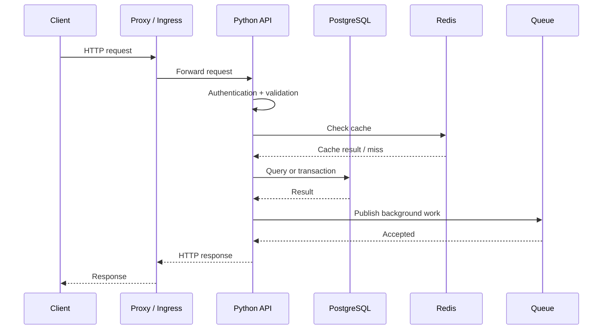

# 14- Backend Python

## Overview

Python is widely used for backend services because it provides strong ecosystem support, productive development, mature libraries, and good integration with databases, queues, cloud services, and infrastructure tooling.

Backend Python engineering is not simply writing Python code behind an HTTP endpoint. A production service must handle:

- HTTP request processing;
- validation and serialization;
- authentication and authorization;
- database access;
- transactions;
- caching;
- external service calls;
- background processing;
- configuration and secrets;
- logging and observability;
- concurrency;
- failures and retries;
- graceful shutdown;
- deployment and scaling.

A useful mental model is:

```text
Client
  │
  ▼
DNS / CDN / Load Balancer
  │
  ▼
Nginx / Ingress
  │
  ▼
Python Application
  ├── Routing
  ├── Validation
  ├── Authentication
  ├── Business Logic
  ├── Database Access
  ├── Cache
  ├── External APIs
  └── Message Queue
           │
           ▼
      Background Workers
```

The framework is only one layer. Good backend engineering comes from designing the entire request and data lifecycle.

---

## Backend Python Architecture

A maintainable service commonly separates responsibilities:

```text
HTTP / gRPC Layer
       │
       ▼
Application / Service Layer
       │
       ├── Domain Logic
       │
       ▼
Infrastructure Layer
       ├── PostgreSQL
       ├── Redis
       ├── Kafka
       └── External APIs
```

A practical project structure might look like:

```text
app/
├── api/
│   ├── routes/
│   └── dependencies.py
├── application/
│   └── services/
├── domain/
│   ├── models/
│   └── exceptions.py
├── infrastructure/
│   ├── database/
│   ├── cache/
│   └── clients/
├── config.py
├── logging.py
└── main.py

tests/
├── unit/
├── integration/
└── api/
```

The exact structure should reflect system complexity. Small services do not need dozens of abstractions.

---

## Request Lifecycle

A typical HTTP request passes through several layers:



Understanding this lifecycle is essential when debugging latency, failures, and resource usage.

---

## Choosing a Python Web Framework

Common backend choices include Django, FastAPI, and lower-level WSGI/ASGI frameworks.

| Framework | Strength | Typical use |
|---|---|---|
| Django | Batteries-included ecosystem | Full web applications |
| FastAPI | Typed APIs and ASGI | APIs and microservices |
| Flask | Minimal and flexible | Smaller services and APIs |
| Starlette | Lightweight ASGI foundation | Custom async services |

The correct choice depends on:

- existing ecosystem;
- team expertise;
- application complexity;
- async requirements;
- ORM requirements;
- operational conventions;
- organizational standards.

Do not select a framework solely because it benchmarks faster in an isolated test.

---

## WSGI and ASGI

### WSGI

WSGI is the traditional Python interface for synchronous web applications.

```text
HTTP Server
    │
    ▼
WSGI
    │
    ▼
Python Application
```

It works well for synchronous workloads but does not provide the async concurrency model of ASGI.

### ASGI

ASGI supports asynchronous applications and protocols such as HTTP and WebSockets.

```text
HTTP
  │
  ▼
ASGI Server
  │
  ▼
Async Python Application
```

FastAPI and modern Starlette-based applications commonly use ASGI.

---

## Application Servers

The application framework does not usually listen directly on the public network.

A production deployment may look like:

```text
Internet
   │
   ▼
AWS Load Balancer
   │
   ▼
Ingress / Nginx
   │
   ▼
Uvicorn / Gunicorn Workers
   │
   ▼
FastAPI / Django
```

The exact architecture varies by deployment platform.

Application servers manage processes, connections, and request execution. They should not be confused with the application framework itself.

---

## Django vs FastAPI

### Django

Django provides:

- ORM;
- routing;
- middleware;
- authentication support;
- administration;
- forms;
- migrations;
- security defaults.

It is well suited to large application platforms where integrated components provide significant value.

### FastAPI

FastAPI provides:

- ASGI-native request handling;
- type-driven validation;
- dependency injection;
- OpenAPI generation;
- strong support for asynchronous endpoints.

It is well suited to API services and systems where explicit API contracts are important.

The architectural principles discussed in this document apply to both.

---

## API Layer

The API layer should primarily handle transport concerns:

- parsing requests;
- validation;
- authentication;
- authorization;
- HTTP status codes;
- response serialization.

Business rules should not become tightly coupled to HTTP.

Prefer:

```text
Route
  │
  ▼
Service
  │
  ▼
Repository / Gateway
```

over putting the entire application inside a route handler.

---

## Request Validation

Validation should happen at system boundaries.

```python
from pydantic import BaseModel, Field


class CreateUserRequest(BaseModel):
    email: str
    age: int = Field(ge=18)
```

Validation protects internal application logic from malformed input.

However, validation is not a replacement for:

- database constraints;
- authorization;
- business invariants;
- security controls.

For example, validating that `age >= 18` does not authorize the caller to create a particular user.

---

## Response Models

Explicit response schemas prevent accidental leakage and stabilize API contracts.

```python
from pydantic import BaseModel


class UserResponse(BaseModel):
    id: int
    email: str
```

Do not automatically serialize entire ORM objects when they contain:

- passwords;
- internal identifiers;
- authorization metadata;
- operational fields;
- secrets.

API response models should define the public contract deliberately.

---

## REST API Design

A resource-oriented API might use:

```text
GET    /users
GET    /users/{id}
POST   /users
PATCH  /users/{id}
DELETE /users/{id}
```

Good API design considers:

- resource identity;
- HTTP semantics;
- idempotency;
- pagination;
- filtering;
- validation;
- error contracts;
- versioning;
- authorization;
- rate limiting.

HTTP status codes should communicate meaningful outcomes rather than being selected arbitrarily.

---

## Idempotency

An operation is idempotent when repeating it produces the same intended result.

This matters especially for retries.

For payment-like operations, a client might send:

```http
POST /payments
Idempotency-Key: 4e6d...
```

The server can persist the key and associated result.

```text
Request
  │
  ▼
Idempotency Key
  │
  ├── Existing → Return previous result
  │
  └── New → Execute operation → Persist result
```

Idempotency is essential when network failures can cause clients or infrastructure to retry requests.

---

## Authentication vs Authorization

Authentication answers:

> Who is the caller?

Authorization answers:

> What is the caller allowed to do?

These concerns should remain distinct.

```text
Request
  │
  ▼
Authentication
  │
  ▼
Identity
  │
  ▼
Authorization
  │
  ▼
Business Operation
```

Never treat possession of a valid identity token as permission to perform every operation.

---

## Authentication Patterns

Common approaches include:

- session-based authentication;
- OAuth 2.0;
- OpenID Connect;
- signed access tokens;
- service-to-service credentials.

For backend services, token validation should include appropriate checks such as:

- signature;
- issuer;
- audience;
- expiration;
- required claims.

Never trust decoded token payloads without cryptographic verification.

---

## Authorization

Authorization can be implemented using:

- role-based access control;
- attribute-based policies;
- resource ownership;
- policy engines;
- service-specific authorization logic.

For example:

```python
if user.id != document.owner_id and not user.is_admin:
    raise PermissionError("Not authorized")
```

Authorization should be enforced server-side regardless of what the frontend displays.

---

## Database Connectivity

Most backend services interact with relational databases.

Typical flow:

```text
API
 │
 ▼
Service
 │
 ▼
Repository / ORM
 │
 ▼
Connection Pool
 │
 ▼
PostgreSQL
```

Connection pooling avoids establishing a new database connection for every request.

---

## Connection Pools

A connection pool has finite capacity.

```text
100 concurrent requests
        │
        ▼
20 database connections
        │
        ▼
Requests wait for connections
```

Increasing the pool indefinitely is not a solution. PostgreSQL also has finite CPU, memory, locks, and connection capacity.

Pool sizing should consider:

- application replicas;
- database capacity;
- query duration;
- concurrency;
- transaction duration.

---

## ORM Usage

Django ORM and SQLAlchemy can improve developer productivity, but abstraction does not eliminate database costs.

For example:

```python
users = (
    session.query(User)
    .filter(User.active.is_(True))
    .limit(100)
    .all()
)
```

The application should still understand:

- generated SQL;
- indexes;
- query plans;
- joins;
- transaction boundaries;
- result size.

ORM knowledge is not a substitute for SQL knowledge.

---

## N+1 Queries

A common ORM performance problem is:

```text
Query users
    │
    ├── Query orders for user 1
    ├── Query orders for user 2
    ├── Query orders for user 3
    └── ...
```

This can produce hundreds or thousands of database round trips.

Use deliberate eager loading, joins, prefetching, or aggregation where appropriate.

Always inspect the resulting SQL rather than assuming the ORM generated an efficient query.

---

## Transactions

Transactions provide atomicity and consistency boundaries.

```python
with session.begin():
    account.debit(amount)
    ledger.record(account.id, amount)
```

If an exception occurs, the transaction can be rolled back.

Transaction design should consider:

- isolation level;
- lock duration;
- deadlocks;
- retries;
- external side effects;
- idempotency.

Do not perform slow external HTTP calls while holding database locks unless there is a strong architectural reason.

---

## Transactional Outbox

Publishing to Kafka while updating PostgreSQL creates a consistency problem:

```text
PostgreSQL COMMIT ✓
Kafka publish     ✗
```

The database state changed but the event was not published.

The transactional outbox pattern stores the event in the same database transaction:

```text
Transaction
 ├── Update business data
 └── Insert outbox event
          │
          ▼
       Commit
          │
          ▼
   Outbox Publisher
          │
          ▼
        Kafka
```

This provides reliable event publication without requiring a distributed transaction between PostgreSQL and Kafka.

---

## Redis

Redis is commonly used for:

- caching;
- rate limiting;
- distributed coordination;
- short-lived state;
- queues in suitable architectures.

Example:

```python
cached = await redis.get(cache_key)

if cached is not None:
    return deserialize(cached)

value = await load_from_database()

await redis.set(
    cache_key,
    serialize(value),
    ex=300,
)

return value
```

Production considerations include:

- TTL;
- eviction policy;
- memory capacity;
- serialization;
- network latency;
- stale data;
- cache stampedes;
- failure behavior.

---

## Cache Failure

A cache should not usually become a single point of failure for a request that can safely operate without it.

Prefer explicit fallback behavior:

```text
Request
  │
  ▼
Redis
  │
  ├── Hit ──► Response
  │
  └── Failure / Miss
          │
          ▼
      PostgreSQL
```

Whether fallback is safe depends on the system's latency and consistency requirements.

---

## External HTTP Calls

External dependencies should always have explicit timeouts.

```python
async with httpx.AsyncClient(timeout=5.0) as client:
    response = await client.get(
        "https://service.example.internal/resource"
    )
    response.raise_for_status()
```

Never allow an external dependency to block a request indefinitely.

Consider:

- connect timeout;
- read timeout;
- total timeout;
- retry policy;
- circuit breaking;
- rate limits;
- idempotency.

---

## Retry Design

Retries are appropriate for transient failures, not arbitrary failures.

Good candidates may include:

- temporary network failures;
- connection resets;
- selected 5xx responses;
- throttling responses with appropriate backoff.

Avoid retries for:

- invalid requests;
- authentication failures;
- deterministic validation errors.

Use bounded exponential backoff with jitter.

```text
Attempt 1 → failure
      │
      ▼
short delay + jitter
      │
Attempt 2 → failure
      │
      ▼
longer delay + jitter
      │
Attempt 3
```

Retries without bounds can amplify an outage into a retry storm.

---

## Circuit Breakers

When a dependency is unhealthy, repeatedly calling it may worsen the failure.

A circuit breaker can transition between:

```text
CLOSED
  │
  │ repeated failures
  ▼
OPEN
  │
  │ recovery interval
  ▼
HALF-OPEN
  │
  ├── success → CLOSED
  └── failure → OPEN
```

Circuit breaking is most useful when downstream failures need isolation.

It does not replace timeouts.

---

## Background Jobs

Long-running or retryable work should often be moved outside the request path.

Examples:

- sending email;
- generating reports;
- processing uploaded files;
- consuming events;
- large data transformations.

```text
HTTP Request
     │
     ▼
Validate
     │
     ▼
Persist Job
     │
     ▼
Return 202
     │
     ▼
Queue
     │
     ▼
Worker
```

Celery is one common Python ecosystem choice for background jobs.

---

## Celery Architecture

A typical Celery deployment may look like:

```text
FastAPI / Django
       │
       ▼
     Redis
       │
       ▼
Celery Workers
       │
       ├── PostgreSQL
       ├── External APIs
       └── Object Storage
```

Workers should be independently scalable from API processes.

Do not execute CPU-heavy or long-running work inside an API worker merely because it is convenient.

---

## Kafka

Kafka is appropriate when systems need durable event streams and independent consumers.

```text
Producer
   │
   ▼
Kafka Topic
   │
   ├── Consumer A
   ├── Consumer B
   └── Consumer C
```

Backend engineers should understand:

- partitions;
- consumer groups;
- offsets;
- ordering guarantees;
- delivery semantics;
- retries;
- dead-letter strategies;
- idempotent consumers.

Kafka is not simply a faster task queue.

---

## Configuration

Configuration should be externalized from application code.

```python
import os

DATABASE_URL = os.environ["DATABASE_URL"]
LOG_LEVEL = os.getenv("LOG_LEVEL", "INFO")
```

For larger applications, a typed settings layer is preferable.

Configuration should distinguish:

- environment-specific settings;
- secrets;
- feature flags;
- operational parameters.

Never commit credentials into source control.

---

## Secrets Management

Secrets should be supplied through an appropriate secret-management system.

Examples include:

- AWS Secrets Manager;
- AWS Systems Manager Parameter Store;
- Kubernetes Secrets with appropriate protection;
- dedicated secret-management platforms.

Avoid:

```python
DATABASE_PASSWORD = "production-password"
```

Secrets should also not appear in:

- logs;
- exceptions;
- metrics labels;
- stack traces;
- API responses.

---

## Environment Separation

Typical environments include:

```text
local
   │
development
   │
staging
   │
production
```

Production configuration should not be copied casually into development environments.

Use environment-specific:

- database endpoints;
- credentials;
- feature flags;
- logging levels;
- resource limits.

---

## Dependency Management

Pin or constrain dependencies deliberately.

A production project should have reproducible dependency resolution.

Typical workflow:

```bash
python -m venv .venv
source .venv/bin/activate
python -m pip install --upgrade pip
```

Modern Python projects commonly define project metadata and dependencies in `pyproject.toml`.

Use a dependency management workflow appropriate to the project and organization.

---

## Python Package Boundaries

Avoid importing infrastructure everywhere.

Prefer:

```text
API
 │
 ▼
Service
 │
 ▼
Repository interface
 │
 ├── PostgreSQL implementation
 └── Test implementation
```

This makes infrastructure replaceable and improves testability.

However, dependency injection should solve a real coupling problem. Excessive abstraction creates unnecessary complexity.

---

## Dependency Injection

Dependency injection means providing dependencies instead of constructing them deep inside business logic.

```python
class OrderService:
    def __init__(self, repository: OrderRepository):
        self.repository = repository

    def create_order(self, order: Order) -> None:
        self.repository.save(order)
```

The service does not need to know how the repository connects to PostgreSQL.

Benefits include:

- testability;
- explicit dependencies;
- separation of concerns;
- easier infrastructure replacement.

---

## Repository Pattern

A repository can isolate persistence operations:

```python
class UserRepository:
    def __init__(self, session):
        self.session = session

    def get_by_id(self, user_id: int) -> User | None:
        return (
            self.session.query(User)
            .filter(User.id == user_id)
            .one_or_none()
        )
```

Repositories should not become generic wrappers around every possible ORM method.

Use them when they create a meaningful boundary between domain/application logic and persistence.

---

## Service Layer

A service layer coordinates business operations.

```python
class OrderService:
    def __init__(self, orders, payments):
        self.orders = orders
        self.payments = payments

    def place_order(self, order):
        self.payments.authorize(order.total)
        self.orders.create(order)
```

The service layer is valuable when operations span multiple repositories, gateways, or business rules.

Do not create service classes merely to move one line of code out of a route.

---

## Domain Logic

Business invariants should be represented close to the domain rather than scattered across HTTP handlers.

For example:

```python
class Account:
    def debit(self, amount: Decimal) -> None:
        if amount <= 0:
            raise ValueError("Amount must be positive")

        if amount > self.balance:
            raise ValueError("Insufficient funds")

        self.balance -= amount
```

This makes important business rules reusable across:

- REST APIs;
- background jobs;
- CLI tools;
- event consumers.

---

## Logging

Production logs should be structured and actionable.

```python
logger.info(
    "order_created",
    extra={
        "order_id": order.id,
        "customer_id": customer.id,
    },
)
```

Useful log fields include:

- timestamp;
- severity;
- service;
- environment;
- request ID;
- trace ID;
- operation;
- relevant resource identifier.

Avoid high-cardinality or sensitive data where inappropriate.

---

## Logging Levels

Typical levels include:

| Level | Use |
|---|---|
| DEBUG | Detailed troubleshooting |
| INFO | Normal operational events |
| WARNING | Unexpected but recoverable condition |
| ERROR | Failed operation requiring attention |
| CRITICAL | Severe system-level failure |

Do not log every normal function call at INFO in a high-throughput service.

---

## Observability

A production Python service should expose:

```text
Metrics
  ├── request rate
  ├── latency
  ├── errors
  ├── CPU
  ├── memory
  └── queue depth

Logs
  └── structured application events

Traces
  └── distributed request flow
```

Important backend metrics include:

- p50/p95/p99 latency;
- requests/sec;
- error rate;
- database pool utilization;
- Redis latency;
- queue depth;
- worker utilization;
- CPU;
- memory;
- event-loop latency.

---

## Health Checks

Health endpoints should distinguish different states.

### Liveness

Answers:

> Should this process be restarted?

### Readiness

Answers:

> Should this process receive traffic?

For Kubernetes:

```text
Pod
 ├── Liveness  → process is functioning
 └── Readiness → dependencies / application state suitable for traffic
```

Do not make liveness checks depend on every external dependency. A temporary database outage should not necessarily cause Kubernetes to restart every application process.

---

## Graceful Shutdown

Production applications must handle termination signals.

```text
SIGTERM
  │
  ▼
Stop accepting new work
  │
  ▼
Finish active requests/tasks
  │
  ▼
Commit/rollback transactions
  │
  ▼
Close connections
  │
  ▼
Exit
```

This is especially important in Kubernetes rolling deployments and autoscaling environments.

---

## Concurrency Model

Choose concurrency based on workload.

| Workload | Typical approach |
|---|---|
| I/O-bound async | `asyncio` / ASGI |
| Blocking I/O | Threads / thread pool |
| CPU-bound Python | Processes / workers |
| Durable background work | Celery / Kafka / SQS |
| Distributed coordination | Redis / database / dedicated system |

Concurrency must be bounded.

For example, an API that creates 1,000 concurrent outbound requests can overload a downstream service even if the Python application itself remains healthy.

---

## Async Pitfalls

This is problematic:

```python
async def handler():
    result = requests.get("https://example.com")
    return result.json()
```

The synchronous HTTP client can block the event loop.

Use an async client where appropriate:

```python
async def handler(client):
    response = await client.get("https://example.com")
    return response.json()
```

If blocking work cannot be avoided, isolate it using an appropriate thread/process mechanism.

---

## Performance and Backend Python

Common backend performance problems include:

- N+1 queries;
- excessive serialization;
- unnecessary ORM object creation;
- blocking async code;
- unbounded concurrency;
- oversized response payloads;
- repeated external calls;
- inefficient algorithms;
- excessive logging;
- memory-heavy materialization.

Use profiling and tracing rather than guessing.

---

## Rate Limiting

Rate limiting protects services from excessive traffic.

Possible dimensions include:

- per user;
- per API key;
- per IP;
- per tenant;
- per endpoint.

Redis can support distributed rate limiting:

```text
Clients
   │
   ▼
API Workers
   │
   ▼
Redis Counter
   │
   ├── Within limit → Process
   └── Exceeded     → 429
```

Rate limits should be explicit API contracts where clients depend on them.

---

## Backpressure

Backpressure prevents producers from overwhelming consumers.

```text
Producer
   │
   ▼
Bounded Queue
   │
   ▼
Workers
```

Without backpressure:

```text
Producer → unlimited queue → memory growth → OOM
```

Use:

- bounded queues;
- concurrency limits;
- rate limits;
- queue capacity monitoring;
- load shedding.

Backpressure is a reliability mechanism as much as a performance mechanism.

---

## Docker

A production Python container should be:

- minimal;
- reproducible;
- non-root where practical;
- configured through environment/runtime configuration;
- observable;
- signal-aware.

A simplified Dockerfile:

```dockerfile
FROM python:3.13-slim

WORKDIR /app

COPY pyproject.toml .
COPY src ./src

RUN pip install --no-cache-dir .

USER 10001

CMD ["python", "-m", "app"]
```

The exact image, dependency installation strategy, and runtime command should match the application's packaging model.

---

## Kubernetes

A Python service on Kubernetes typically requires:

- Deployment;
- Service;
- readiness probe;
- liveness probe;
- resource requests;
- resource limits;
- configuration;
- secrets;
- autoscaling.

Resource configuration matters:

```yaml
resources:
  requests:
    cpu: "250m"
    memory: "256Mi"
  limits:
    cpu: "1"
    memory: "512Mi"
```

Poor limits can cause CPU throttling or OOM kills.

---

## Horizontal Autoscaling

Autoscaling should use meaningful signals.

Potential signals include:

- CPU;
- memory;
- request rate;
- queue depth;
- custom latency/utilization metrics.

For background workers, queue depth may be more meaningful than CPU.

Scaling API workers does not solve a saturated PostgreSQL database.

---

## AWS Considerations

Python backend systems commonly integrate with:

- ECS;
- EKS;
- Lambda;
- API Gateway;
- Application Load Balancer;
- RDS PostgreSQL;
- ElastiCache Redis;
- SQS;
- SNS;
- MSK;
- S3;
- Secrets Manager;
- CloudWatch.

The correct AWS service depends on workload and operational requirements.

Avoid choosing infrastructure based solely on technology familiarity.

---

## API vs Background Worker

A common production split is:

```text
                 Load Balancer
                      │
                      ▼
                 API Workers
                      │
            ┌─────────┴─────────┐
            ▼                   ▼
        PostgreSQL             Queue
                                │
                                ▼
                           Worker Pool
                                │
                     ┌──────────┼──────────┐
                     ▼          ▼          ▼
                    S3       External    Database
                               APIs
```

This isolates long-running work from user-facing request capacity.

---

## Reliability Patterns

Production Python services commonly need:

- timeouts;
- bounded retries;
- exponential backoff;
- jitter;
- idempotency;
- circuit breakers;
- dead-letter queues;
- graceful shutdown;
- health checks;
- transaction boundaries;
- backpressure.

These mechanisms should be applied intentionally rather than as generic middleware everywhere.

---

## Error Handling

Translate internal exceptions into stable external contracts.

```python
try:
    order = service.create_order(request)
except InsufficientInventory as exc:
    raise HTTPException(
        status_code=409,
        detail="Inventory unavailable",
    ) from exc
```

Do not expose:

- stack traces;
- SQL;
- internal service names;
- credentials;
- filesystem paths;
- internal implementation details.

---

## API Error Contracts

A consistent error schema improves client behavior.

Example:

```json
{
  "error": {
    "code": "inventory_unavailable",
    "message": "The requested inventory is unavailable",
    "request_id": "req_123"
  }
}
```

Clients should depend on stable error codes rather than parsing arbitrary error strings.

---

## Security Boundaries

Important backend security controls include:

- TLS;
- authentication;
- authorization;
- input validation;
- SQL parameterization;
- secret management;
- dependency patching;
- secure headers;
- rate limiting;
- audit logging;
- least-privilege IAM.

Never construct SQL by concatenating untrusted input.

Prefer parameterized queries:

```python
cursor.execute(
    "SELECT id FROM users WHERE email = %s",
    (email,),
)
```

---

## Dependency Security

Python applications depend on many third-party packages.

A production security process should include:

- dependency locking;
- vulnerability scanning;
- regular updates;
- minimal dependencies;
- removal of unused packages;
- CI checks.

Supply-chain risk increases with unnecessary dependencies.

---

## Testing Backend Python

A production service typically needs multiple testing layers.

```text
                 Tests
                   │
        ┌──────────┼──────────┐
        ▼          ▼          ▼
      Unit    Integration     API
        │          │          │
        └──────────┼──────────┘
                   ▼
              End-to-End
```

### Unit Tests

Test business logic without real infrastructure.

### Integration Tests

Test interactions with PostgreSQL, Redis, queues, or other components.

### API Tests

Test HTTP behavior, validation, authentication, and response contracts.

---

## Mocking

Mock external dependencies when testing isolated behavior.

```python
def test_service_uses_repository():
    repository = Mock()
    service = UserService(repository)

    service.create_user("user@example.com")

    repository.save.assert_called_once()
```

Do not mock everything.

Over-mocking can make tests verify implementation details instead of behavior.

---

## Database Testing

Integration tests should exercise realistic database behavior when database semantics matter.

Examples include:

- transaction behavior;
- constraints;
- indexes;
- isolation;
- migrations;
- PostgreSQL-specific SQL.

An in-memory substitute may not reproduce PostgreSQL behavior accurately.

---

## CI/CD

A Python backend pipeline commonly performs:

```text
Commit
  │
  ▼
Lint
  │
  ▼
Type Check
  │
  ▼
Unit Tests
  │
  ▼
Integration Tests
  │
  ▼
Security Scan
  │
  ▼
Build Image
  │
  ▼
Deploy
  │
  ▼
Smoke Tests
```

Performance and deployment checks should be proportional to service criticality.

---

## Database Migrations

Schema changes must be deployable safely.

Avoid migrations that require prolonged exclusive locks on large production tables without understanding their impact.

A safe migration may use an expand-and-contract strategy:

```text
Expand
  │
  ▼
Deploy compatible application
  │
  ▼
Backfill
  │
  ▼
Switch reads/writes
  │
  ▼
Contract
```

This supports rolling deployments where old and new application versions may coexist temporarily.

---

## Backward Compatibility

During rolling deployments:

```text
Old API Version ──┐
                   ├──► Database
New API Version ──┘
```

The database schema and APIs may need to support both versions simultaneously.

Avoid destructive changes that assume every application instance has already been upgraded.

---

## Graceful Degradation

When a non-critical dependency fails, the service may continue with reduced functionality.

Example:

```text
Recommendation Service unavailable
             │
             ▼
Return core product response
without recommendations
```

This can improve availability when optional dependencies fail.

Not every dependency should be treated as optional. Critical business invariants must remain enforced.

---

## Disaster Recovery

Backend Python applications depend on infrastructure recovery.

Important considerations include:

- PostgreSQL backups;
- point-in-time recovery;
- Redis recovery strategy;
- Kafka retention;
- S3 durability;
- infrastructure-as-code;
- deployment reproducibility;
- secret recovery;
- cross-region requirements.

Define:

- **RPO** — acceptable data loss;
- **RTO** — acceptable recovery time.

A backup that has never been restored is not a fully validated recovery strategy.

---

## Production Pitfalls

### One Process Does Everything

Running API handling, CPU-heavy processing, and long-running jobs in the same worker pool creates resource contention.

Separate workloads.

### Unbounded Pools

Unlimited database, HTTP, or thread pools can overload dependencies.

Bound them.

### Global Mutable State

Process-local mutable state behaves unpredictably across multiple workers and instances.

Use appropriate external state stores when state must be shared.

### Hidden Database Calls

Properties, serializers, or model methods that silently trigger database queries can create severe performance problems.

Make expensive I/O explicit.

### Catching Every Exception

This can hide programming errors and make failures harder to diagnose.

Catch specific exceptions and handle failures at deliberate boundaries.

### Retrying Everything

Retries amplify outages when the underlying dependency is already overloaded.

Retry only appropriate transient failures with limits and backoff.

### Logging Secrets

Sensitive data can persist in centralized logging systems long after an application request completes.

Treat logs as production data with security controls.

---

## Interview Traps

### Is FastAPI Automatically Faster Than Django?

No.

Framework benchmarks do not determine end-to-end service performance. Database queries, serialization, network calls, application design, and deployment architecture often dominate.

### Should Every Function Be Async?

No.

Async is useful for I/O concurrency. Introducing async where there is no concurrency benefit can increase complexity.

### Should Every Application Use Redis?

No.

Redis adds operational complexity and network dependency. Use it when caching, shared ephemeral state, rate limiting, or another concrete requirement justifies it.

### Should You Use a Repository for Every Database Operation?

No.

A repository is useful when it creates a meaningful architectural boundary. An unnecessary repository can simply duplicate the ORM API.

### Should API Requests Perform Long Jobs?

Usually no.

Long-running, retryable, or resource-intensive work is often better handled asynchronously through a queue and worker system.

### Is More Database Pool Capacity Better?

No.

The database itself is a shared bottleneck. An oversized pool can increase contention and make the system less stable.

---

## Senior-Level Interview Questions

### How Would You Design a Python Microservice?

Start with the business boundary rather than the framework.

Consider:

```text
API
 │
 ▼
Application Service
 │
 ├── Domain Logic
 ├── PostgreSQL
 ├── Redis
 ├── External APIs
 └── Queue
       │
       ▼
    Workers
```

Then define:

- API contract;
- data ownership;
- transactions;
- failure semantics;
- idempotency;
- observability;
- scaling model;
- deployment;
- security;
- disaster recovery.

### How Would You Debug a Production API With High p99 Latency?

Start with traces and metrics.

Determine whether latency comes from:

- queueing;
- application CPU;
- database;
- Redis;
- external APIs;
- connection pools;
- serialization;
- retries.

Then optimize the dominant contributor rather than changing framework code blindly.

### How Would You Prevent Duplicate Background Jobs?

Use a combination of:

- idempotent job handlers;
- unique business keys;
- transactional state transitions;
- queue semantics;
- deduplication where appropriate.

Assume that distributed systems can deliver work more than once unless exactly-once behavior is explicitly guaranteed and correctly implemented.

### How Would You Handle a Database Outage?

The service should have:

- bounded database timeouts;
- controlled failure responses;
- appropriate retry behavior;
- connection-pool protection;
- readiness considerations;
- observability;
- recovery procedures.

Do not allow every application worker to continuously retry a dead database.

### How Would You Scale a Python API From 100 to 10,000 Requests/sec?

First establish the workload and bottleneck.

Then evaluate:

```text
Load Balancer
      │
      ▼
Many API Workers
      │
      ├── Redis
      ├── PostgreSQL
      └── Queue
             │
             ▼
          Workers
```

Scale independently where possible, but verify that shared dependencies can handle the increased load.

Database indexes, query optimization, caching, batching, connection pools, and asynchronous processing may be more important than simply adding application replicas.

---

## Backend Engineering Decision Guide

| Requirement | Common approach |
|---|---|
| Full web platform | Django |
| Typed async API | FastAPI |
| Relational persistence | PostgreSQL |
| Low-latency shared cache | Redis |
| Durable event stream | Kafka |
| Background task execution | Celery / SQS workers |
| Object storage | S3 |
| Reverse proxy / ingress | Nginx / cloud load balancer |
| Container orchestration | Kubernetes / ECS |
| Service observability | Metrics + logs + traces |
| Secret storage | AWS Secrets Manager / equivalent |
| CPU-heavy Python workload | Process workers / dedicated service |
| High-volume I/O | Async I/O with bounded concurrency |

These are starting points, not mandatory architectural choices.

---

## Production Readiness Checklist

### API

- [ ] Input validation is explicit.
- [ ] Authentication and authorization are separated.
- [ ] API errors have stable contracts.
- [ ] Pagination is used for large collections.
- [ ] Idempotency is implemented where retries can duplicate effects.
- [ ] Timeouts exist for external dependencies.

### Database

- [ ] Connection pooling is bounded.
- [ ] N+1 queries are prevented.
- [ ] Important queries are indexed and measured.
- [ ] Transactions are appropriately scoped.
- [ ] Migrations are deployment-safe.
- [ ] Backup and recovery are tested.

### Reliability

- [ ] Retries are bounded and use backoff.
- [ ] Backpressure exists for asynchronous work.
- [ ] Background work is separated from API capacity.
- [ ] Graceful shutdown is implemented.
- [ ] Health checks distinguish liveness and readiness.
- [ ] Dependency failures have deliberate behavior.

### Security

- [ ] Secrets are externalized.
- [ ] TLS is used.
- [ ] Authorization is enforced server-side.
- [ ] SQL is parameterized.
- [ ] Dependencies are scanned and updated.
- [ ] Sensitive data is excluded from logs.

### Operations

- [ ] Metrics expose latency and throughput.
- [ ] p95/p99 latency is monitored.
- [ ] Structured logging is available.
- [ ] Distributed tracing is available where appropriate.
- [ ] CPU and memory are monitored.
- [ ] Queue and connection-pool saturation are visible.
- [ ] Alerts correspond to actionable failure conditions.

### Deployment

- [ ] Container images are reproducible.
- [ ] CI runs tests and static checks.
- [ ] Resource requests and limits are defined.
- [ ] Rolling deployments are compatible with schema changes.
- [ ] Smoke tests run after deployment.
- [ ] Rollback procedures are documented and tested.

## Key Takeaways

- **Backend Python is a system, not just a web framework:** production services combine API handling, business logic, databases, caches, queues, external dependencies, observability, security, and deployment infrastructure.
- **Keep boundaries explicit:** separate transport, application/domain logic, and infrastructure where the complexity justifies it; use dependency injection and repositories to reduce meaningful coupling rather than adding abstractions mechanically.
- **Design for failure and scale:** bounded pools, timeouts, retries with backoff, idempotency, backpressure, graceful shutdown, and asynchronous workers are fundamental production concerns.
- **Understand the infrastructure beneath Python:** ORM abstractions, Redis, PostgreSQL, Kafka, Kubernetes, Docker, and AWS all have resource limits and failure modes that directly affect application behavior.
- **Optimize from evidence:** use metrics, logs, traces, profiling, and realistic load tests to identify bottlenecks while preserving correctness, security, reliability, and maintainability.