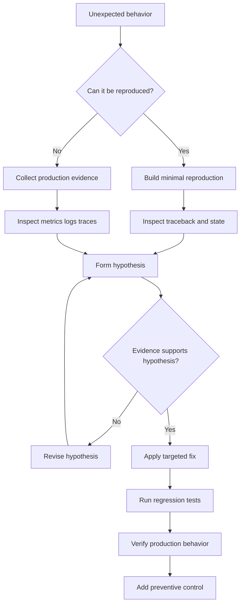

# 17- Debugging Scenarios

## Overview

Debugging is the process of identifying the cause of incorrect, unexpected, slow, or unstable system behavior and applying a targeted fix.

For backend engineering, debugging is broader than stepping through Python code. A production failure can originate in:

```text
Client
  │
  ▼
Nginx / Load Balancer
  │
  ▼
Application
  │
  ├── PostgreSQL
  ├── Redis
  ├── Kafka
  ├── External APIs
  └── Background Workers
```

A strong debugging process reduces the search space systematically rather than changing code until the symptom disappears.

A useful mental model is:

```text
Symptom
   │
   ▼
Observe
   │
   ▼
Reproduce
   │
   ▼
Collect evidence
   │
   ▼
Form hypothesis
   │
   ▼
Test hypothesis
   │
   ▼
Identify root cause
   │
   ▼
Fix
   │
   ▼
Verify
   │
   ▼
Prevent regression
```

The most important debugging skill is not knowing every Python feature. It is knowing **how to reason from evidence**.

---

## Debugging Mindset

Avoid assumptions such as:

- "The database must be slow."
- "This is probably a race condition."
- "The deployment broke it."
- "Redis is returning stale data."
- "Python is slow."

Instead, distinguish:

```text
Observed fact
      ↓
Hypothesis
      ↓
Evidence
      ↓
Confirmed cause
```

For example:

```text
Fact:
API latency increased from 100 ms to 3 seconds.

Hypothesis:
Database queries became slower.

Evidence:
Database query latency increased from 20 ms to 2.7 seconds.

Conclusion:
Database latency is a major contributor.
```

A hypothesis is not a root cause until evidence supports it.

---

## First Response to a Production Incident

When a production system is failing, prioritize stabilization before deep investigation.

Typical sequence:

1. Confirm the impact.
2. Determine whether the problem is ongoing.
3. Check recent deployments and configuration changes.
4. Identify affected endpoints or workloads.
5. Check application, database, cache, and queue health.
6. Mitigate if possible.
7. Preserve evidence.
8. Investigate root cause.
9. Verify recovery.
10. Add preventive controls.

Do not restart everything immediately if doing so destroys useful diagnostic evidence.

---

## Reproduce Before Changing Code

A reproducible failure is much easier to debug.

Capture:

- input;
- environment;
- Python version;
- dependency versions;
- configuration;
- database state;
- request headers where relevant;
- timing;
- concurrency conditions.

Example:

```bash
python --version
pip freeze
pytest tests/test_orders.py::test_duplicate_order -vv
```

If the failure cannot be reproduced locally, use staging, a minimal reproduction, or production telemetry to narrow the conditions.

---

## Minimal Reproduction

Reduce the failing system to the smallest example that still fails.

```text
Large application
      │
      ├── API
      ├── Database
      ├── Cache
      ├── Queue
      └── External services
             │
             ▼
       Remove unrelated components
             │
             ▼
       Minimal failing case
```

A minimal reproduction makes causality easier to establish and prevents unrelated complexity from hiding the problem.

---

## Python Tracebacks

A traceback describes the call path that led to an exception.

Example:

```text
Traceback (most recent call last):
  File "app/api.py", line 42, in create_order
    return service.create_order(request)
  File "app/service.py", line 81, in create_order
    return repository.save(order)
  File "app/repository.py", line 29, in save
    cursor.execute(query)
ValueError: invalid order state
```

Read tracebacks from the bottom upward:

```text
Bottom exception
      ↑
Immediate failure
      ↑
Caller
      ↑
Request path
```

The last exception is often the immediate failure, but the root cause may have occurred earlier.

---

## Exception Chaining

Preserve useful causal information when translating exceptions.

```python
try:
    user = repository.get_by_id(user_id)
except DatabaseError as exc:
    raise UserRepositoryError(
        f"failed to retrieve user {user_id}"
    ) from exc
```

This gives the higher-level layer a meaningful domain exception while retaining the original cause.

Avoid swallowing the original exception:

```python
try:
    ...
except Exception:
    raise RuntimeError("failed")
```

This destroys valuable debugging context.

---

## Logging for Debugging

Logs should provide enough context to correlate an event with a request or operation.

Useful fields include:

- timestamp;
- log level;
- service;
- environment;
- request ID;
- trace ID;
- operation;
- resource identifier where safe;
- duration;
- error type.

Example structured event:

```json
{
  "level": "ERROR",
  "service": "order-api",
  "operation": "create_order",
  "request_id": "req-123",
  "duration_ms": 842,
  "error_type": "DatabaseTimeout"
}
```

Do not log:

- passwords;
- API keys;
- access tokens;
- session secrets;
- unnecessary personal data.

---

## Logging Levels

Use levels intentionally.

| Level | Typical use |
|---|---|
| DEBUG | Detailed diagnostic information |
| INFO | Normal important lifecycle events |
| WARNING | Unexpected but recoverable condition |
| ERROR | Failed operation requiring attention |
| CRITICAL | Severe system-level failure |

Do not make every exception an `ERROR`. Log at the boundary where the failure becomes actionable.

---

## Request Correlation

A backend debugging workflow becomes much easier when requests can be traced across services.

```text
Client
  │ request_id=abc
  ▼
API
  │ request_id=abc
  ▼
Order Service
  │ request_id=abc
  ▼
Payment Service
  │ request_id=abc
  ▼
Database
```

For distributed systems, tracing is often more useful than manually searching logs across services.

---

## Debugging with `pdb`

Python's built-in debugger can inspect execution interactively.

```python
breakpoint()
```

Execution can then be inspected:

```text
p variable
n next
s step
c continue
l list
w where
```

Example:

```python
def calculate_total(items):
    breakpoint()

    return sum(
        item.price * item.quantity
        for item in items
    )
```

Use debuggers primarily in development and controlled environments.

Avoid leaving breakpoints in production code.

---

## Inspecting Runtime State

Useful diagnostic information includes:

```python
type(value)
repr(value)
vars(obj)
```

For objects supporting attributes:

```python
print(vars(order))
```

Be careful when inspecting objects containing secrets or large payloads.

`repr()` implementations should not expose sensitive data.

---

## Common Python Debugging Scenario: `None`

Error:

```text
AttributeError: 'NoneType' object has no attribute 'email'
```

Bad response:

```python
if user is None:
    return
```

This may hide the actual invariant violation.

First determine why `user` is `None`.

Potential causes:

- missing database row;
- incorrect lookup key;
- stale cache;
- failed dependency;
- unexpected API response;
- incorrect control flow.

Then decide whether `None` is valid or represents an error.

---

## `KeyError`

Example:

```python
email = user["email"]
```

Failure:

```text
KeyError: 'email'
```

Debug questions:

- Is `email` required?
- Was the payload validated?
- Did the upstream API change?
- Is the dictionary shape guaranteed?
- Should this be a `TypedDict` or validated model?

Do not blindly replace it with:

```python
email = user.get("email")
```

because that can convert a contract violation into silent incorrect behavior.

---

## `IndexError`

Example:

```python
first = users[0]
```

Failure:

```text
IndexError: list index out of range
```

Determine whether an empty list is:

- valid;
- unexpected;
- a missing database result;
- an upstream filtering bug.

The correct fix depends on the contract.

---

## Mutable Default Argument Bugs

Example:

```python
def add_user(user, users=[]):
    users.append(user)
    return users
```

The list is created once at function definition time.

Symptoms may include state appearing to leak between calls.

Correct approach:

```python
def add_user(
    user: User,
    users: list[User] | None = None,
) -> list[User]:
    if users is None:
        users = []

    users.append(user)
    return users
```

---

## Shared Mutable State

A service-level global cache can produce unexpected behavior:

```python
cache = {}
```

In a web application, multiple requests in the same process can mutate it.

Potential issues:

- stale data;
- memory growth;
- race conditions;
- process-local inconsistency;
- unexpected test coupling.

A Python dictionary is not automatically a safe distributed cache.

---

## Identity vs Equality Bugs

These are different:

```python
if value is other:
    ...
```

```python
if value == other:
    ...
```

Use:

```python
if value is None:
    ...
```

for singleton checks.

Use `==` for value equality.

An `is` comparison can appear to work for interned or cached objects and then fail for other values.

---

## Late-Binding Closure Bugs

Example:

```python
functions = [
    lambda: index
    for index in range(3)
]
```

All functions resolve the captured variable when called, so they can observe the final value.

One way to bind the current value is:

```python
functions = [
    lambda index=index: index
    for index in range(3)
]
```

When debugging closures, inspect what variables are actually captured rather than assuming values were copied.

---

## Import and Module Bugs

A common failure is importing the wrong module or shadowing a standard library/module name.

For example:

```text
requests.py
```

in an application directory can shadow the external `requests` package.

Useful diagnostic:

```python
import requests

print(requests.__file__)
```

Also inspect:

```bash
python -c "import requests; print(requests.__file__)"
```

Import resolution problems can produce confusing runtime behavior.

---

## Environment Mismatch

A service may work locally but fail in CI or production.

Compare:

```text
Python version
Dependency versions
OS / container image
Environment variables
Configuration
Database version
Redis version
CPU architecture
Timezone
Locale
```

Useful commands:

```bash
python --version
pip freeze
env
uname -a
```

Do not expose secrets when collecting or sharing environment output.

---

## Dependency Version Problems

A dependency upgrade can cause:

- changed behavior;
- removed APIs;
- serialization differences;
- changed defaults;
- performance regressions.

When debugging:

```text
Working version
       │
       ▼
Dependency change
       │
       ▼
Failure
```

Compare lockfiles and package metadata rather than assuming the application code changed.

Pin or constrain dependencies appropriately and test upgrades in CI.

---

## Configuration Bugs

Configuration problems often resemble application bugs.

Examples:

- wrong database host;
- wrong Redis URL;
- incorrect timeout;
- disabled feature flag;
- incorrect AWS region;
- missing environment variable.

Separate:

```text
Code behavior
```

from:

```text
Runtime configuration
```

Verify the effective configuration rather than only inspecting configuration files.

---

## Debugging HTTP 4xx Errors

For a 4xx response, inspect:

```text
Method
URL
Headers
Authentication
Authorization
Query parameters
Request body
Content-Type
Validation response
```

Typical interpretation:

| Status | Common area |
|---|---|
| 400 | Invalid request |
| 401 | Authentication |
| 403 | Authorization |
| 404 | Resource/routing |
| 409 | Conflict |
| 422 | Validation, depending on API contract |
| 429 | Rate limiting |

Do not automatically retry 4xx responses.

---

## Debugging HTTP 5xx Errors

For 5xx responses, inspect:

```text
Application logs
Traceback
Request ID
Upstream dependencies
Database
Cache
Recent deployment
Resource utilization
```

A 500 response may be only the visible symptom.

For example:

```text
API 500
  ↓
Service exception
  ↓
Database timeout
  ↓
Connection pool exhausted
```

The useful root cause may be several layers below the HTTP response.

---

## Debugging Slow APIs

Do not begin by optimizing Python code.

Break latency into components:

```text
Request
 │
 ├── Nginx / network
 ├── Application CPU
 ├── Database
 ├── Redis
 ├── External HTTP
 └── Serialization
```

Measure each component.

A request taking 2 seconds may actually be:

```text
Python CPU      20 ms
PostgreSQL    1,500 ms
Redis            10 ms
Serialization    20 ms
Network          50 ms
```

Optimizing Python would have almost no effect.

---

## N+1 Query Problems

An API may execute:

```text
1 query for orders
+
N queries for users
=
N+1 queries
```

For example:

```python
for order in orders:
    print(order.user.email)
```

Depending on the ORM and loading strategy, this may trigger additional queries.

Debug with SQL logging or query instrumentation.

In Django, use appropriate techniques such as:

```python
Order.objects.select_related("user")
```

or:

```python
Order.objects.prefetch_related("items")
```

The correct strategy depends on relationship type and query shape.

---

## Database Connection Pool Exhaustion

A common production symptom:

```text
API latency ↑
Database connection wait ↑
Requests timeout
```

Possible causes:

- too many application workers;
- pool too small;
- connections not returned;
- long-running transactions;
- slow queries;
- traffic increase.

A simplified relationship is:

```text
Application concurrency
        ↓
DB connection demand
        ↓
Pool capacity
        ↓
Database max connections
```

Do not solve pool exhaustion simply by increasing the database connection limit. That can move the failure deeper into PostgreSQL.

---

## Slow PostgreSQL Queries

Start with evidence.

Useful PostgreSQL tools include:

```sql
EXPLAIN (ANALYZE, BUFFERS)
SELECT *
FROM orders
WHERE customer_id = 123;
```

Inspect:

- sequential scans;
- index scans;
- row estimates;
- actual rows;
- execution time;
- buffer usage;
- joins;
- sorts.

An index should be introduced because the workload needs it, not because every column should be indexed.

---

## Lock Contention

A database operation may be slow because it is waiting on another transaction.

Conceptually:

```text
Transaction A
    │
    ├── locks row
    │
    ▼
Transaction B
    │
    └── waits
```

Investigate:

- long-running transactions;
- lock waits;
- transaction boundaries;
- isolation level;
- application concurrency.

Short transactions reduce unnecessary lock duration.

---

## Deadlocks

Deadlocks occur when operations wait cyclically.

```text
Transaction A → lock X → waits for Y
Transaction B → lock Y → waits for X
```

PostgreSQL can detect and abort one transaction.

Debugging requires identifying:

- transaction order;
- lock acquisition order;
- queries involved;
- concurrent code paths.

A common prevention strategy is consistent lock ordering.

---

## Redis Debugging

Possible symptoms:

- stale values;
- missing keys;
- high latency;
- connection failures;
- memory pressure.

Check:

```text
Key naming
TTL
Serialization
Cache invalidation
Connection pool
Eviction policy
Redis memory
Network latency
```

A cache bug can appear to be a database bug because the application may never reach PostgreSQL when a stale cache value is returned.

---

## Cache Stampede

When a popular key expires, many requests may simultaneously rebuild it.

```text
Key expires
    │
    ├── Request A → DB
    ├── Request B → DB
    ├── Request C → DB
    └── Request D → DB
```

This can overload the database.

Mitigation techniques include:

- request coalescing;
- distributed locks;
- jittered expiration;
- stale-while-revalidate;
- prewarming.

The appropriate approach depends on consistency requirements.

---

## Kafka Debugging

For Kafka consumers, inspect:

- consumer lag;
- partition assignment;
- offsets;
- processing latency;
- deserialization failures;
- retry behavior;
- dead-letter queues;
- rebalance activity.

A common failure path:

```text
Kafka message
    │
    ▼
Deserialization
    │
    X
Invalid schema
```

If the consumer repeatedly fails on the same message, it may never make meaningful progress.

---

## Celery Debugging

Inspect:

- worker availability;
- queue depth;
- task retries;
- task duration;
- broker connectivity;
- worker memory;
- concurrency;
- task acknowledgment behavior.

A task that appears "stuck" may actually be:

```text
Queued
  ↓
Waiting for worker
  ↓
Executing
  ↓
Blocked on external dependency
```

Measure each stage rather than assuming Celery itself is broken.

---

## Asyncio Debugging

Async applications commonly fail because blocking work executes on the event loop.

Bad:

```python
async def handler():
    result = requests.get(url)
    return result.json()
```

The synchronous HTTP call blocks the event loop.

Use an async client or deliberately offload unavoidable blocking work:

```python
import asyncio


async def handler():
    result = await asyncio.to_thread(blocking_operation)
    return result
```

For high-throughput services, prefer genuinely asynchronous libraries where available.

---

## Event Loop Blocking

A single blocked event loop can affect many requests.

```text
Request A ─┐
Request B ─┤
Request C ─┼── Event Loop ── blocked
Request D ─┤
Request E ─┘
```

Symptoms can include:

- high request latency;
- timeout spikes;
- low CPU utilization despite poor response times.

Investigate:

- synchronous I/O;
- CPU-heavy functions;
- blocking locks;
- expensive serialization;
- large synchronous loops.

---

## Threading Bugs

Thread-related failures can involve:

- race conditions;
- deadlocks;
- lock contention;
- unsafe shared state.

Example race:

```python
counter += 1
```

The operation should not be treated as a general concurrency-safe atomic transaction merely because it appears to be one statement.

Protect shared invariants explicitly.

---

## Race Conditions

A race condition occurs when correctness depends on timing between concurrent operations.

Example:

```text
Request A: read balance = 100
Request B: read balance = 100
Request A: write 50
Request B: write 20
```

Expected result may be 70, but the final state can incorrectly become 20.

For persistent business invariants, prefer database transactions and appropriate locking rather than relying only on Python locks.

---

## Deadlocks in Python

Potential pattern:

```text
Thread A
  └── Lock A → waits for Lock B

Thread B
  └── Lock B → waits for Lock A
```

Prevention:

- consistent lock ordering;
- narrow critical sections;
- avoiding unnecessary nested locks;
- timeouts where appropriate.

A timeout is useful for detecting or limiting damage, but it does not solve the underlying deadlock.

---

## Memory Growth

Symptoms:

```text
RSS ↑
RSS ↑
RSS ↑
```

Possible causes:

- unbounded caches;
- queues;
- retained references;
- large response objects;
- global state;
- accidental accumulation;
- native-library allocations.

Use:

```text
tracemalloc
```

for Python allocation analysis, while remembering that it does not represent all process memory.

---

## Memory Leak vs Retention

In Python, apparent leaks are often retention problems.

Example:

```python
cache[key] = large_object
```

If keys are never removed, objects remain reachable.

Garbage collection cannot reclaim reachable objects.

Debug:

```text
Object growth
    ↓
Find retaining reference
    ↓
Identify owner
    ↓
Bound or release lifetime
```

---

## CPU Spikes

When CPU increases unexpectedly:

1. Identify affected processes.
2. Check request volume.
3. Check recent deployments.
4. Profile representative workloads.
5. Look for algorithmic regressions.
6. Inspect serialization/parsing.
7. Check retry loops.
8. Check CPU-bound background jobs.

Do not assume high CPU means inefficient Python loops. A runaway retry loop or expensive regular expression can produce the same symptom.

---

## Profiling

Use the appropriate tool.

| Tool | Best use |
|---|---|
| `timeit` | Small isolated benchmarks |
| `cProfile` | Function-level CPU profiling |
| `tracemalloc` | Python allocation tracking |
| Application metrics | Production behavior |
| Distributed tracing | Cross-service latency |
| Database `EXPLAIN` | SQL performance |
| OS/container metrics | CPU/RSS/I/O |

Production debugging should begin with observability and move toward targeted profiling.

---

## `cProfile`

Example:

```bash
python -m cProfile -s cumulative app.py
```

Important concepts:

- `tottime`: time spent inside the function itself;
- `cumtime`: cumulative time including called functions.

A function with high cumulative time may simply be calling an expensive dependency.

---

## `tracemalloc`

Useful for identifying Python-level allocation growth:

```python
import tracemalloc

tracemalloc.start()

# Workload

snapshot = tracemalloc.take_snapshot()

for statistic in snapshot.statistics("lineno")[:10]:
    print(statistic)
```

Compare snapshots over time to identify growing allocation sites.

Do not interpret `tracemalloc` as a complete view of process RSS.

---

## Observability-Driven Debugging

A production service should expose:

```text
Metrics
  ├── Request rate
  ├── Error rate
  ├── Latency
  ├── Saturation
  └── Queue depth

Logs
  ├── Structured events
  └── Exceptions

Traces
  └── Cross-service request flow
```

A useful model is:

```text
What happened?  → Logs
How often?      → Metrics
Where?          → Traces
Why?            → Profiling / deep investigation
```

---

## Four Golden Signals

For backend services, monitor:

- latency;
- traffic;
- errors;
- saturation.

For example:

```text
Traffic       → requests/sec
Latency       → p50 / p95 / p99
Errors        → 5xx rate
Saturation    → CPU / memory / pool utilization
```

Averages alone can hide severe tail latency.

---

## Debugging Tail Latency

Suppose:

```text
p50 = 80 ms
p95 = 300 ms
p99 = 4,000 ms
```

Most requests are fast, but a small percentage are severely delayed.

Investigate:

- slow database queries;
- connection-pool waits;
- garbage collection;
- downstream latency;
- lock contention;
- event-loop blocking;
- overloaded workers.

Tail latency often matters more for user experience than average latency.

---

## Recent Deployment Correlation

When an incident begins shortly after a deployment:

```text
Deployment
    │
    ▼
Metric change
    │
    ▼
Hypothesis
```

Useful actions include:

- compare versions;
- inspect changed configuration;
- compare error rates;
- compare latency;
- roll back if the deployment is strongly correlated and mitigation is needed.

Correlation is evidence, not proof.

---

## Binary Search Through Changes

When a large change introduced a regression, narrow it down.

```text
Known good
    │
    ▼
Half changes
    │
    ├── Still good
    └── Broken
          │
          ▼
      Narrow further
```

Git can help:

```bash
git bisect start
git bisect bad
git bisect good <known-good-commit>
```

This is particularly useful when the regression is deterministic.

---

## Debugging by Feature Flags

Feature flags can isolate behavior:

```text
Request
  │
  ├── Flag OFF → old path
  │
  └── Flag ON  → new path
```

Flags can reduce blast radius during investigation.

However, stale feature flags create complexity and should be removed after the migration is complete.

---

## Kubernetes Debugging

For a failing pod:

```bash
kubectl get pods
kubectl describe pod <pod>
kubectl logs <pod>
kubectl logs <pod> --previous
```

Investigate:

- CrashLoopBackOff;
- readiness failures;
- liveness failures;
- OOMKilled;
- image problems;
- configuration;
- secret mounting;
- resource limits;
- network policies.

For resource issues:

```bash
kubectl top pod
kubectl top node
```

A container restart can hide the original failure, so inspect previous-container logs where available.

---

## OOMKilled

If Kubernetes reports:

```text
Reason: OOMKilled
```

investigate:

- memory limit;
- RSS growth;
- large requests;
- caching;
- queues;
- worker concurrency;
- Python allocation;
- native allocations.

Increasing the memory limit may stop immediate restarts but can hide an unbounded-memory bug.

---

## Container-Specific Debugging

A service may behave differently inside Docker because of:

- environment variables;
- filesystem paths;
- DNS;
- user permissions;
- CPU limits;
- memory limits;
- timezone;
- installed system libraries.

Reproduce inside the same container image where possible.

---

## AWS Debugging

For AWS-hosted Python systems, identify the failing layer.

```text
Client
  ↓
Route 53
  ↓
ALB / API Gateway
  ↓
ECS / EKS / Lambda
  ↓
RDS / ElastiCache / MSK
  ↓
External AWS service
```

Check:

- CloudWatch metrics and logs;
- load balancer errors;
- container/task health;
- IAM permissions;
- security groups;
- subnet routing;
- service quotas;
- throttling;
- dependency health.

IAM failures can look like application failures if an AWS SDK call is denied.

---

## IAM Debugging

If an AWS API call fails, inspect:

```text
Caller identity
        ↓
IAM policy
        ↓
Resource policy
        ↓
Explicit deny
        ↓
Condition keys
        ↓
Region/resource ARN
```

Do not assume that having an IAM role means every AWS API call is permitted.

---

## DNS Debugging

Network failures may actually be DNS failures.

Useful commands:

```bash
nslookup example.internal
```

or:

```bash
dig example.internal
```

Check:

- DNS resolution;
- service name;
- namespace;
- TTL;
- private/public DNS;
- container DNS configuration.

---

## Network Debugging

Separate:

```text
DNS
 ↓
TCP connection
 ↓
TLS
 ↓
HTTP
 ↓
Application
```

A timeout can occur at any layer.

For example:

```text
DNS succeeds
TCP succeeds
TLS succeeds
HTTP request waits
```

This points toward the server or downstream dependency rather than DNS.

---

## Retry Storms

A dependency failure can become much worse when clients retry aggressively.

```text
Dependency slows
      ↓
Requests timeout
      ↓
Clients retry
      ↓
More load
      ↓
Dependency slows further
```

Use:

- bounded retries;
- exponential backoff;
- jitter;
- timeouts;
- circuit breakers where appropriate;
- idempotency.

Retrying every failure is not resilience.

---

## Timeout Debugging

A timeout should answer:

> What operation timed out?

Examples:

```text
Connect timeout
Read timeout
Database pool wait
Database query
Redis operation
Kafka operation
External API
```

Use separate timeout budgets where appropriate.

A single enormous timeout can cause requests to occupy workers for too long.

---

## Error Budget and Reliability

A debugging fix should consider the service's reliability objective.

For example:

```text
Availability target
        ↓
Allowed error budget
        ↓
Incident impact
        ↓
Prioritize mitigation
```

A minor internal error with no customer impact should not necessarily receive the same response as a complete checkout outage.

---

## Post-Incident Analysis

After recovery, capture:

- impact;
- timeline;
- detection;
- root cause;
- contributing factors;
- mitigation;
- permanent fix;
- monitoring gap;
- tests added.

Avoid blame-oriented analysis.

The goal is to improve the system's ability to detect and tolerate similar failures.

---

## Root Cause vs Contributing Factor

Example:

```text
Root cause:
Missing database index.

Contributing factor:
Query volume increased after a new feature launch.

Detection gap:
No alert on database query latency.

Impact amplifier:
Application timeout was too high, causing worker saturation.
```

A strong incident analysis identifies the complete causal chain rather than stopping at the first technical defect.

---

## Preventing Regression

Every important production bug should result in an appropriate preventive mechanism.

Possible controls:

```text
Bug
 │
 ├── Unit test
 ├── Integration test
 ├── Contract test
 ├── Validation
 ├── Monitoring
 ├── Alert
 ├── Rate limit
 └── Architectural change
```

Do not automatically add a unit test for every failure if the actual problem belongs at an integration or operational boundary.

---

## Common Debugging Mistakes

### Changing Multiple Things at Once

If several changes are made simultaneously, causality becomes unclear.

Change one relevant variable at a time where practical.

### Logging Everything

Excessive logs increase:

- cost;
- noise;
- storage;
- search difficulty.

Log structured, actionable information.

### Logging Secrets

Never use debugging as a reason to dump:

```python
print(request.headers)
```

without considering authorization headers, cookies, and sensitive data.

### Assuming the Exception Is the Root Cause

An exception often represents the final visible symptom.

Trace the dependency chain backward.

### Restarting Instead of Investigating

A restart can restore service while leaving the underlying defect unresolved.

### Adding Retries Blindly

Retries can amplify outages and duplicate side effects.

### Ignoring Resource Saturation

A correct algorithm can still fail under CPU, memory, connection, or queue saturation.

---

## Production Debugging Decision Tree



This avoids jumping directly from symptom to code modification.

---

## Debugging Checklist

### Reproduction

- [ ] Can the issue be reproduced?
- [ ] What exact input triggers it?
- [ ] Is the failure deterministic?
- [ ] What environment reproduces it?
- [ ] Did it begin after a known change?

### Evidence

- [ ] What do logs show?
- [ ] What do metrics show?
- [ ] Is there a trace?
- [ ] What does the traceback show?
- [ ] What are CPU and memory doing?
- [ ] Are dependencies healthy?

### Dependencies

- [ ] PostgreSQL latency and locks?
- [ ] Connection pool utilization?
- [ ] Redis latency and TTL?
- [ ] Kafka lag?
- [ ] Celery queue depth?
- [ ] External API latency/errors?
- [ ] AWS throttling or IAM failures?

### Concurrency

- [ ] Race condition?
- [ ] Lock contention?
- [ ] Deadlock?
- [ ] Event-loop blocking?
- [ ] Worker saturation?
- [ ] Connection-pool exhaustion?

### Fix

- [ ] Is the root cause confirmed?
- [ ] Is the fix minimal?
- [ ] Are edge cases covered?
- [ ] Is there a regression test?
- [ ] Does the fix introduce new failure modes?
- [ ] Is observability sufficient to verify recovery?

---

## Interview Scenarios

### An API Suddenly Returns 500

Investigate in this order:

```text
Request ID
   ↓
Application logs
   ↓
Traceback
   ↓
Recent deployment/config
   ↓
Dependency failures
   ↓
Database/cache/message systems
```

Do not immediately restart the application.

### API Latency Increased but CPU Is Low

Likely candidates include:

- database waits;
- connection-pool exhaustion;
- external HTTP latency;
- Redis latency;
- network issues;
- locks;
- event-loop blocking.

Low CPU does not mean the service is healthy.

### Memory Usage Grows Until Kubernetes Restarts the Pod

Investigate:

```text
RSS growth
  ↓
Allocation profile
  ↓
Retained references
  ↓
Caches / queues / globals
  ↓
Worker lifecycle
```

Use `tracemalloc` for Python allocations and container metrics for total process memory.

### Kafka Consumer Is Stuck

Check:

- consumer lag;
- current offset;
- partition assignment;
- repeated message failures;
- deserialization;
- retries;
- dead-letter handling;
- worker health.

A single poison message can prevent progress depending on consumer design.

### Database Is Healthy but Requests Still Timeout

Inspect:

```text
Application connection pool
        ↓
Thread pool
        ↓
Async event loop
        ↓
External services
        ↓
Serialization
        ↓
Network
```

The database being healthy eliminates only one part of the request path.

---

## Senior-Level Debugging Principles

### Debug the System, Not Just the Code

Production failures frequently cross boundaries:

```text
Python
  ↕
Database
  ↕
Network
  ↕
Infrastructure
  ↕
External service
```

The correct debugging scope is the complete request or data flow.

### Prefer Evidence Over Intuition

Experience helps generate hypotheses quickly, but telemetry determines which hypothesis survives.

### Optimize the Bottleneck

If PostgreSQL consumes 95% of request latency, optimizing Python execution is irrelevant.

### Preserve Causality

A good fix explains:

```text
Why did it fail?
Why did it become visible now?
Why did existing safeguards not prevent it?
Why does this fix address the cause?
```

### Design for Debuggability

Systems are easier to debug when they have:

- structured logs;
- request IDs;
- distributed traces;
- meaningful metrics;
- explicit dependencies;
- clear service boundaries;
- bounded resource usage;
- deterministic tests.

Debuggability is an architectural property.

## Key Takeaways

- **Debug from evidence, not assumptions:** separate observed symptoms from hypotheses and validate the root cause using logs, metrics, traces, profiling, and dependency-level evidence.
- **Follow the complete request or data path:** Python application code is only one layer; PostgreSQL, Redis, Kafka, Celery, networking, Kubernetes, AWS, and external services can all contribute to failures.
- **Diagnose bottlenecks before optimizing:** measure latency, CPU, memory, connection pools, queues, database queries, and downstream calls before changing application code.
- **Production debugging must preserve reliability and security:** stabilize incidents carefully, avoid destructive diagnostics, bound retries and timeouts, and never expose secrets or sensitive data while collecting evidence.
- **Turn incidents into engineering improvements:** confirm the root cause, add the appropriate regression or integration test, improve observability, and introduce preventive controls where they provide meaningful protection.