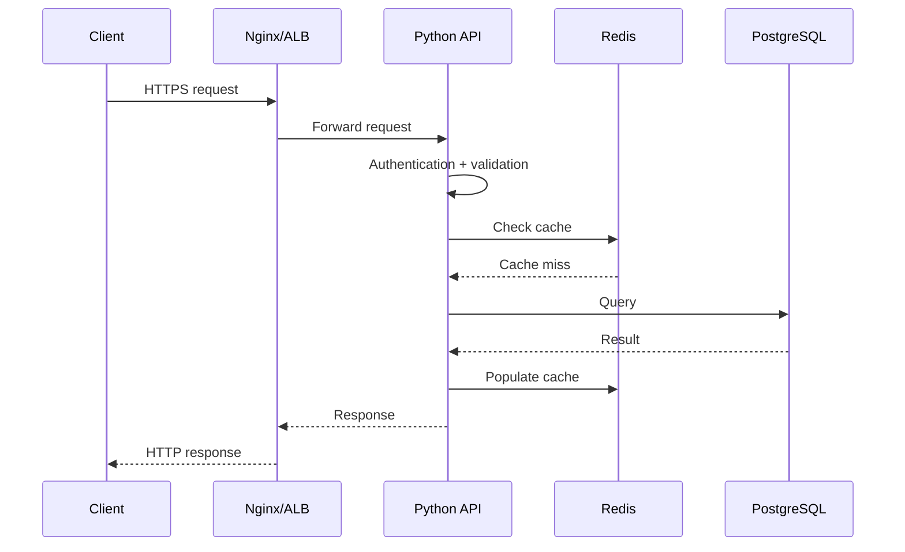

# 18- Backend Scenarios

## Overview

Backend scenario questions test whether you can apply Python knowledge to real production systems rather than answer isolated language questions.

A strong answer connects:

```text
Business requirement
        ↓
API / service design
        ↓
Python implementation
        ↓
Database / cache / queue
        ↓
Concurrency
        ↓
Reliability
        ↓
Observability
        ↓
Security
        ↓
Scalability
```

The goal is not to immediately propose a technology. First establish requirements, constraints, failure modes, consistency requirements, and operational expectations.

A useful interview framework is:

1. Clarify the requirement.
2. Identify the request and data flow.
3. Define the correctness guarantees.
4. Choose appropriate Python and backend primitives.
5. Identify bottlenecks and failure modes.
6. Explain scaling behavior.
7. Add observability and security.
8. Discuss testing and deployment.
9. State trade-offs explicitly.

---

## Scenario Analysis Framework

For almost any backend scenario, ask:

| Area | Questions |
|---|---|
| Correctness | What must always be true? |
| Traffic | Requests/sec? Peak traffic? |
| Latency | p50/p95/p99 target? |
| Data | What is authoritative? |
| Consistency | Strong, eventual, or session-level? |
| Durability | Can data be lost? |
| Concurrency | Can multiple requests modify the same resource? |
| Failure | What happens when dependencies fail? |
| Scaling | What becomes the bottleneck first? |
| Security | Authentication, authorization, secrets, abuse? |
| Observability | What metrics, logs, and traces are required? |
| Deployment | Rolling deployment? Backward compatibility? |
| Recovery | How is the system restored after failure? |

This prevents answers from becoming framework-specific implementation exercises.

---

## Scenario: Design a REST API

Suppose an application needs:

```text
POST   /orders
GET    /orders/{order_id}
GET    /orders
PATCH  /orders/{order_id}
POST   /orders/{order_id}/cancel
```

A production-oriented design separates responsibilities:

```text
HTTP Request
    │
    ▼
Router / Controller
    │
    ▼
Request Validation
    │
    ▼
Service Layer
    │
    ├── Repository
    ├── Cache
    └── External Services
    │
    ▼
Database
```

FastAPI example:

```python
from fastapi import APIRouter, Depends, HTTPException, status
from pydantic import BaseModel

router = APIRouter()


class CreateOrderRequest(BaseModel):
    customer_id: int
    amount_cents: int


class OrderResponse(BaseModel):
    id: int
    customer_id: int
    amount_cents: int
    status: str


@router.post(
    "/orders",
    response_model=OrderResponse,
    status_code=status.HTTP_201_CREATED,
)
async def create_order(
    request: CreateOrderRequest,
    service: OrderService = Depends(get_order_service),
) -> OrderResponse:
    order = await service.create_order(
        customer_id=request.customer_id,
        amount_cents=request.amount_cents,
    )

    return OrderResponse.model_validate(order)
```

Important considerations:

- validate at the boundary;
- keep business logic outside the router;
- define stable response contracts;
- use appropriate HTTP status codes;
- enforce authorization;
- make state-changing operations idempotent where retries are possible.

---

## Scenario: API Request Lifecycle

A typical production request may look like:



When debugging or designing performance improvements, this entire path matters.

---

## Scenario: Authentication vs Authorization

Authentication answers:

> Who are you?

Authorization answers:

> Are you allowed to perform this operation?

For example:

```python
def can_update_order(user: User, order: Order) -> bool:
    return (
        user.is_authenticated
        and order.customer_id == user.customer_id
    )
```

Do not rely only on frontend controls.

The backend must enforce authorization at the resource boundary.

Typical layers:

```text
TLS
 ↓
Authentication
 ↓
Authorization
 ↓
Input validation
 ↓
Business rules
 ↓
Database constraints
```

Defense in depth matters because application checks can contain bugs.

---

## Scenario: Prevent Duplicate Order Creation

Suppose a mobile client sends:

```http
POST /orders
Idempotency-Key: 7c9d...
```

The client times out before receiving the response and retries.

Without idempotency:

```text
Request 1 → create order
Request 2 → create order
```

Two orders may be created.

A robust design stores the idempotency key with the operation result.

```text
Client
  │
  ├── request A ──┐
  │               ▼
  └── retry ──→ Idempotency Store
                    │
                    ├── new key → execute
                    └── existing → return previous result
```

The database should enforce uniqueness where appropriate:

```sql
CREATE UNIQUE INDEX orders_idempotency_key_idx
ON orders (customer_id, idempotency_key);
```

Idempotency should be designed around the actual business operation, not just the HTTP endpoint.

---

## Scenario: Prevent Double Payment

Payment operations require stronger guarantees.

Do not rely on:

```python
if not payment_exists():
    create_payment()
```

because two concurrent requests can both observe absence.

Prefer transactional protection:

```text
Request A ──┐
            ├── database uniqueness / transaction
Request B ──┘
```

Possible mechanisms:

- unique constraints;
- transactions;
- row locking;
- idempotency keys;
- payment-provider idempotency mechanisms.

The database should enforce critical invariants whenever possible.

---

## Scenario: Concurrent Inventory Updates

Suppose inventory is:

```text
stock = 1
```

Two requests arrive simultaneously.

Naive flow:

```text
A: read stock = 1
B: read stock = 1
A: write stock = 0
B: write stock = 0
```

Both requests may incorrectly succeed.

A safer approach can use an atomic conditional update:

```sql
UPDATE inventory
SET quantity = quantity - 1
WHERE product_id = $1
  AND quantity > 0;
```

Then verify affected rows:

```text
affected_rows = 1 → reservation succeeded
affected_rows = 0 → insufficient inventory
```

This avoids relying on a Python-level lock for a database invariant.

---

## Scenario: Database Transaction

When multiple writes must succeed or fail together, use a transaction.

Example:

```python
async with database.transaction():
    order = await create_order(...)
    await create_order_items(order.id, items)
    await record_payment_intent(order.id)
```

The key question is:

> What state must never be partially committed?

Transactions should be kept as short as practical.

Avoid holding transactions open while making slow external HTTP calls.

Bad:

```text
BEGIN
 ↓
DB write
 ↓
External API call
 ↓
Wait 5 seconds
 ↓
DB commit
```

Prefer designs that separate external side effects from local transactional state.

---

## Scenario: External API Failure

Suppose the order service calls a payment provider.

Possible failure:

```text
Order created
    ↓
Payment API timeout
    ↓
Unknown whether payment succeeded
```

A timeout does not necessarily mean the remote operation failed.

The system needs an explicit state model:

```text
PENDING
  │
  ├── success → PAID
  │
  ├── known failure → FAILED
  │
  └── unknown result → PENDING / RECONCILIATION
```

Do not automatically retry an unknown payment operation unless the provider supports safe idempotency.

---

## Scenario: Retry External Requests

Retry only when:

- failure is transient;
- operation is safe to retry;
- timeout is bounded;
- retry count is limited.

Example:

```python
import asyncio
import random


async def retry_with_backoff(
    operation,
    *,
    attempts: int = 3,
    base_delay: float = 0.2,
):
    for attempt in range(attempts):
        try:
            return await operation()
        except TransientError:
            if attempt == attempts - 1:
                raise

            delay = base_delay * (2**attempt)
            delay += random.uniform(0, delay * 0.2)
            await asyncio.sleep(delay)
```

Exponential backoff with jitter prevents many clients from retrying simultaneously.

Never blindly retry:

```text
400
401
403
404
business validation failures
non-idempotent operations
```

unless the API contract explicitly makes the operation retry-safe.

---

## Scenario: API Rate Limiting

Suppose an endpoint must allow:

```text
100 requests / minute / user
```

A distributed backend cannot rely on:

```python
request_counts = {}
```

because each process has separate memory.

Use a shared mechanism such as Redis.

Conceptually:

```text
Request
  ↓
Redis counter
  ↓
limit exceeded?
 ├── yes → 429
 └── no  → application
```

For more precise requirements, token bucket or sliding-window approaches may be appropriate.

Rate limiting protects:

- application capacity;
- databases;
- external dependencies;
- expensive endpoints.

---

## Scenario: Redis Cache

Suppose PostgreSQL is receiving excessive read traffic.

A cache can reduce repeated database work:

```python
cached = await redis.get(cache_key)

if cached is not None:
    return deserialize(cached)

value = await repository.get_order(order_id)

await redis.set(
    cache_key,
    serialize(value),
    ex=300,
)

return value
```

Consider:

- TTL;
- invalidation;
- serialization;
- cache key design;
- stale data;
- memory usage;
- eviction;
- cache availability.

The cache should generally be treated as an optimization unless the architecture deliberately makes it authoritative.

---

## Scenario: Cache Invalidation

Suppose:

```text
DB order.status = PAID
Redis order.status = PENDING
```

Possible strategies:

### Cache-Aside

```text
Read:
Cache → miss → DB → cache

Write:
DB → invalidate cache
```

This is simple and common.

### Write-Through

```text
Application → cache
              ↓
           database
```

Useful when cache and database writes need tighter coordination, but introduces additional complexity.

### Event-Based Invalidation

```text
DB transaction
      ↓
Event
      ↓
Cache invalidation
```

Useful in distributed systems but requires reliable event delivery.

---

## Scenario: Cache Stampede

A popular key expires:

```text
1000 requests
      ↓
Cache miss
      ↓
1000 database queries
```

Mitigations:

- request coalescing;
- locking;
- TTL jitter;
- stale-while-revalidate;
- prewarming.

Do not introduce distributed locking without considering failure and lock-expiry behavior.

---

## Scenario: Pagination

Avoid unbounded responses:

```http
GET /orders
```

with thousands of records.

Offset pagination:

```http
GET /orders?limit=50&offset=1000
```

is simple but can become expensive for large datasets.

Cursor pagination:

```http
GET /orders?limit=50&cursor=eyJpZCI6...
```

can provide more stable performance for large or frequently changing datasets.

A cursor should encode a deterministic ordering key.

For example:

```sql
SELECT id, created_at, total
FROM orders
WHERE (created_at, id) < ($1, $2)
ORDER BY created_at DESC, id DESC
LIMIT 50;
```

The ordering should be deterministic, typically using a unique tie-breaker.

---

## Scenario: N+1 Queries

A service loads:

```text
100 orders
+
100 customer queries
=
101 database queries
```

Identify the problem through query instrumentation.

In Django:

```python
orders = (
    Order.objects
    .select_related("customer")
    .prefetch_related("items")
)
```

The correct solution depends on relationship cardinality and access pattern.

Do not blindly add eager loading everywhere because that can create unnecessarily large joins or result sets.

---

## Scenario: Slow Endpoint

Suppose:

```text
p50 = 100 ms
p95 = 800 ms
p99 = 4 s
```

Break down latency:

```text
HTTP
 ├── Authentication
 ├── Python CPU
 ├── PostgreSQL
 ├── Redis
 ├── External APIs
 └── Serialization
```

Instrument each stage.

Do not begin by replacing Python code with a faster implementation without evidence that Python CPU is the bottleneck.

---

## Scenario: Background Processing

Suppose generating a report takes 30 seconds.

Do not make the HTTP request wait for completion.

Use asynchronous processing:

```text
Client
  │
  ▼
POST /reports
  │
  ├── create job
  └── return 202 + job_id
          │
          ▼
       Queue
          │
          ▼
      Celery Worker
          │
          ▼
      PostgreSQL / S3
```

Example response:

```json
{
  "job_id": "job_123",
  "status": "queued"
}
```

The client can later query:

```http
GET /reports/jobs/job_123
```

---

## Scenario: Celery Task Reliability

A background task may fail after performing part of its work.

Design tasks to be:

- idempotent where possible;
- retryable;
- bounded;
- observable;
- explicit about terminal failures.

Avoid:

```python
@celery.task(autoretry_for=(Exception,))
```

without understanding the consequences.

Retrying every exception can amplify:

- invalid input;
- permanent errors;
- duplicate side effects;
- downstream outages.

---

## Scenario: Kafka Event Processing

Suppose:

```text
Order Service
     ↓
Kafka
     ↓
Email Consumer
```

The consumer receives an event but crashes before completing processing.

A production design must define:

```text
When is the message considered processed?
When is the offset committed?
What happens after failure?
Can processing be repeated?
```

If processing is at-least-once, consumers should generally tolerate duplicate delivery.

A common pattern is:

```text
Message
  ↓
Validate
  ↓
Check idempotency
  ↓
Process
  ↓
Persist result
  ↓
Commit offset
```

Exactly-once semantics should not be claimed casually; the guarantee depends on the complete system.

---

## Scenario: Transactional Outbox

Suppose an order must be stored and an event must be published.

Naive approach:

```text
DB commit
   ↓
Kafka publish
   X
```

If Kafka fails after the database commit, the order exists but the event may be missing.

Transactional outbox:

```text
Database Transaction
 ├── orders
 └── outbox_events
          │
          ▼
     Outbox Publisher
          │
          ▼
        Kafka
```

The order and outbox record commit atomically.

A publisher later sends the event and marks it processed.

This converts an unreliable distributed two-system write into a durable local transaction plus asynchronous delivery.

---

## Scenario: Graceful Shutdown

A Kubernetes pod receiving SIGTERM should not immediately abandon active work.

Typical lifecycle:

```text
SIGTERM
  ↓
Stop accepting new work
  ↓
Finish / cancel active work
  ↓
Commit or release resources
  ↓
Close connections
  ↓
Exit
```

Python services should explicitly handle shutdown behavior where necessary.

For workers, ensure tasks are not acknowledged prematurely if processing has not completed.

---

## Scenario: Health Checks

Separate:

### Liveness

> Is the process alive?

### Readiness

> Can this instance receive traffic?

A readiness failure may be appropriate when:

- application initialization is incomplete;
- required configuration is unavailable;
- the instance cannot serve requests safely.

Do not make liveness depend on every downstream dependency.

Otherwise:

```text
Database outage
    ↓
Liveness fails
    ↓
All pods restart
    ↓
Recovery becomes harder
```

This can turn a dependency outage into a cascading failure.

---

## Scenario: Connection Pool Exhaustion

Suppose API latency suddenly increases.

Metrics show:

```text
CPU       30%
Memory    40%
DB CPU    25%
Pool wait 2.5 s
```

The bottleneck may be the application-to-database connection pool.

Investigate:

- pool size;
- number of workers;
- transaction duration;
- leaked connections;
- slow queries;
- database connection limits.

A common scaling mistake is multiplying application workers without considering database connection capacity.

---

## Scenario: Async API Has High Latency

Suppose FastAPI runs with low CPU but requests are slow.

Check for blocking operations:

```python
async def handler():
    result = requests.get(url)
    return result.json()
```

The synchronous HTTP request blocks the event loop.

Prefer an asynchronous HTTP client:

```python
async def handler(client: AsyncClient):
    response = await client.get(url)
    return response.json()
```

One blocking operation can affect many concurrent requests sharing the event loop.

---

## Scenario: CPU-Bound Python Work

Suppose an endpoint performs expensive pure-Python computation.

Threads may not provide the expected parallelism under traditional GIL-enabled CPython.

Options include:

- optimize the algorithm;
- use efficient native/vectorized libraries;
- move work to processes;
- use a background worker;
- scale horizontally.

The correct choice depends on CPU cost, latency requirements, memory, and workload characteristics.

Modern CPython also has free-threaded builds, but library compatibility and performance characteristics must be evaluated before treating them as a universal replacement for process-based parallelism.

---

## Scenario: Memory Growth

Suppose Kubernetes repeatedly reports:

```text
OOMKilled
```

Investigate:

```text
RSS growth
  ↓
Allocation profile
  ↓
Retained references
  ↓
Caches / queues / globals
  ↓
Worker lifecycle
```

Potential causes:

- unbounded cache;
- large batch processing;
- retained request data;
- queue backlog;
- high worker concurrency;
- native-library allocations.

Increasing the container limit may be an operational mitigation, not the root-cause fix.

---

## Scenario: File Upload API

A naive implementation reads the entire upload:

```python
data = await file.read()
```

For a 2 GB file, this can create unacceptable memory pressure.

Prefer streaming where supported:

```text
Client
  ↓
Nginx / Load Balancer
  ↓
API
  ↓
Streaming
  ↓
Object Storage
```

For large uploads, direct-to-object-storage uploads using presigned URLs can reduce application memory and network load.

Security controls should include:

- authentication;
- authorization;
- maximum size;
- content validation;
- malware scanning where required;
- safe object naming;
- controlled content serving.

Never trust a filename or client-provided MIME type as a security boundary.

---

## Scenario: Configuration and Secrets

Do not hard-code:

```python
DATABASE_PASSWORD = "secret"
```

Use environment/configuration management and a secret manager where appropriate.

```python
import os

database_url = os.environ["DATABASE_URL"]
```

In AWS deployments, secrets may be managed through services such as Secrets Manager or Parameter Store.

Configuration should be validated at startup so invalid deployments fail early.

---

## Scenario: API Versioning

Suppose an existing client expects:

```json
{
  "name": "Aranya"
}
```

Changing it to:

```json
{
  "full_name": "Aranya"
}
```

can break older clients.

Prefer additive changes when possible:

```json
{
  "name": "Aranya",
  "full_name": "Aranya Majumdar"
}
```

For breaking changes, consider:

```text
/api/v1
/api/v2
```

or content/version negotiation.

Backward compatibility is especially important for mobile clients and independently deployed microservices.

---

## Scenario: Zero-Downtime Deployment

Consider:

```text
Version 1
    ↓
Version 2
```

During a rolling deployment, both versions may run simultaneously.

Therefore:

```text
Database schema
      ↓
must support
      ↓
old + new application versions
```

Use an expand-and-contract migration strategy:

```text
Expand
  ↓
Deploy compatible code
  ↓
Backfill / migrate
  ↓
Switch reads/writes
  ↓
Contract old schema
```

Do not deploy a destructive schema change simultaneously with application code that still depends on the old schema.

---

## Scenario: Graceful Database Migration

A safe migration should consider:

- table size;
- locking;
- deployment duration;
- backward compatibility;
- rollback strategy;
- replication;
- traffic volume.

For large PostgreSQL tables, adding or changing indexes may require specialized migration strategies to avoid long blocking operations.

Database migrations are production changes, not merely source-code changes.

---

## Scenario: Microservice Communication

A synchronous call chain can become:

```text
API
 ↓
Order Service
 ↓
Payment Service
 ↓
Inventory Service
 ↓
Shipping Service
```

If each service adds 200 ms:

```text
Potential latency ≈ 800 ms+
```

Failure probability also increases because every dependency can fail.

Reduce unnecessary synchronous chains through:

- asynchronous events;
- local data projections;
- batching;
- caching;
- carefully selected service boundaries.

Do not introduce microservices merely to separate Python modules.

---

## Scenario: Distributed Tracing

A request across services should preserve trace context:

```text
Client
  │
  ▼
API
  │ trace_id=abc
  ▼
Order Service
  │ trace_id=abc
  ▼
Payment Service
  │ trace_id=abc
  ▼
PostgreSQL
```

Tracing helps answer:

> Where did this request spend its time?

Logs answer what happened locally; traces connect the complete distributed path.

---

## Scenario: Preventing Cascading Failure

Suppose PostgreSQL becomes slow.

Without protection:

```text
DB slows
  ↓
Requests wait longer
  ↓
Workers become occupied
  ↓
Request queue grows
  ↓
Memory grows
  ↓
Timeouts increase
  ↓
Clients retry
  ↓
DB receives more load
```

This is a feedback loop.

Controls include:

- timeouts;
- bounded concurrency;
- connection-pool limits;
- circuit breakers where appropriate;
- backpressure;
- rate limiting;
- load shedding;
- caching;
- graceful degradation.

Resilience is about controlling failure propagation, not simply retrying failures.

---

## Scenario: Idempotent Background Jobs

Suppose a job sends an email.

If the worker retries:

```text
Attempt 1 → email sent → worker crashes
Attempt 2 → email sent again
```

Possible approaches:

- idempotency key;
- durable send record;
- provider-supported idempotency;
- state transition recorded transactionally.

For external side effects, distinguish:

```text
Operation failed
```

from:

```text
Operation succeeded but acknowledgement was lost
```

The second case is the harder distributed-systems problem.

---

## Scenario: Multi-Tenant Backend

Suppose one application serves many customers.

Every data access must respect tenant boundaries:

```text
Request
  ↓
Authenticate
  ↓
Resolve tenant
  ↓
Authorize resource
  ↓
Query with tenant constraint
```

Example:

```python
orders = await repository.list_orders(
    tenant_id=current_user.tenant_id,
)
```

Do not rely on the client to provide a trustworthy tenant ID.

Authorization should be derived from authenticated identity and server-side relationships.

---

## Scenario: Prevent SQL Injection

Never construct SQL using string interpolation:

```python
query = f"SELECT * FROM users WHERE email = '{email}'"
```

Use parameterized queries:

```python
query = """
SELECT id, email
FROM users
WHERE email = %s
"""

cursor.execute(query, (email,))
```

ORMs generally parameterize values when used correctly, but raw SQL still requires careful handling.

SQL injection is prevented by separating SQL structure from untrusted values.

---

## Scenario: Serialization Failure

Suppose an API returns:

```python
return {"created_at": datetime.now()}
```

The serializer must have a defined representation for the datetime.

More importantly, API contracts should explicitly define:

- field types;
- timezone semantics;
- nullability;
- enum values;
- pagination;
- error format.

Serialization is part of the external contract, not merely formatting.

---

## Scenario: Large Dataset Processing

Suppose a job processes 20 million rows.

Avoid:

```python
rows = cursor.fetchall()
```

if this materializes the entire dataset.

Prefer:

```text
Database
   ↓
Batched / streamed reads
   ↓
Transform
   ↓
Batched writes
```

For Python:

```python
for batch in repository.iter_batches(batch_size=10_000):
    process(batch)
```

Streaming reduces peak memory and can improve operational stability.

---

## Scenario: Bulk Database Operations

Avoid issuing individual inserts for very large workloads:

```python
for record in records:
    insert(record)
```

Potentially prefer:

```text
Application
    ↓
Batch
    ↓
Bulk insert
    ↓
PostgreSQL
```

Batch size should be chosen based on:

- transaction duration;
- memory;
- network payload;
- database capacity;
- lock duration.

Larger batches are not always faster.

---

## Scenario: Health Check Dependency Failure

Suppose Redis is temporarily unavailable.

Bad design:

```text
Redis unavailable
    ↓
Readiness false
    ↓
All instances removed
    ↓
No instances can serve traffic
```

Instead, determine whether Redis is:

- required for correctness;
- required only for optimization;
- required only for specific endpoints.

If cache failure can safely degrade to PostgreSQL, the service may remain available while emitting appropriate alerts.

---

## Scenario: Observability for a Python API

At minimum track:

| Category | Examples |
|---|---|
| Traffic | Requests/sec |
| Latency | p50, p95, p99 |
| Errors | 4xx, 5xx |
| Database | Query latency, pool wait |
| Cache | Hit rate, latency, errors |
| Queue | Depth, lag, processing time |
| Runtime | CPU, RSS, event-loop latency |
| Dependencies | Timeout and error rate |

Metrics should use bounded labels. Avoid putting unbounded user IDs or request IDs into metric labels.

---

## Scenario: Testing a Backend Change

A production change should be tested at the appropriate boundaries.

```text
Unit
  ↓
Integration
  ↓
API / contract
  ↓
End-to-end
  ↓
Production observability
```

Example:

```python
async def test_duplicate_order_is_idempotent(
    client,
    order_payload,
):
    first = await client.post(
        "/orders",
        json=order_payload,
        headers={"Idempotency-Key": "abc"},
    )

    second = await client.post(
        "/orders",
        json=order_payload,
        headers={"Idempotency-Key": "abc"},
    )

    assert first.status_code == 201
    assert second.status_code == 201
    assert first.json()["id"] == second.json()["id"]
```

The test verifies the business guarantee rather than internal implementation details.

---

## Scenario: Mocking External Dependencies

Mocking is useful for unit tests but should not replace integration coverage.

For a payment client:

```python
class PaymentGateway:
    async def charge(self, amount_cents: int) -> str:
        ...
```

Inject it into the service:

```python
class OrderService:
    def __init__(self, payment_gateway: PaymentGateway):
        self.payment_gateway = payment_gateway
```

This makes testing easier without hard-coding a specific SDK throughout the business logic.

Use integration tests to verify the real adapter separately.

---

## Scenario: Production Incident

Suppose:

```text
5xx rate ↑
p95 latency ↑
CPU normal
DB normal
Redis latency ↑
```

A strong investigation is:

```text
Redis latency increase
        ↓
Cache operations slower
        ↓
API waits longer
        ↓
Request latency increases
        ↓
Timeouts / errors increase
```

Then verify with traces and dependency metrics.

Do not immediately optimize Python CPU because CPU is not showing saturation.

---

## Scenario: Rolling Back a Release

Rollback is appropriate when:

- the regression is strongly correlated with the release;
- impact is significant;
- rollback is safe;
- the previous version remains compatible with current infrastructure/schema.

Before rollback, consider database migrations.

```text
Application rollback
        +
Schema compatibility
```

must be evaluated together.

---

## Scenario: Disaster Recovery

A production backend should define:

- backup frequency;
- retention;
- recovery point objective (RPO);
- recovery time objective (RTO);
- restore procedure;
- dependency recovery;
- failover procedure.

For PostgreSQL:

```text
Primary
  ↓
Backups / WAL
  ↓
Recovery
  ↓
Restored database
```

A backup that has never been restored is not a fully validated recovery strategy.

---

## Scenario: Capacity Planning

Suppose:

```text
Current traffic = 500 req/s
Peak traffic = 2,000 req/s
```

Do not simply multiply the current server count by four.

Measure:

```text
Requests/sec
    ↓
CPU/request
    ↓
Memory/request
    ↓
DB queries/request
    ↓
Connections/request
    ↓
External calls/request
```

The bottleneck may be PostgreSQL rather than application CPU.

Capacity planning should model the complete dependency graph.

---

## Scenario: Backpressure

If a producer generates work faster than consumers can process it:

```text
Producer
  ↓
Queue
  ↓
Queue depth ↑
  ↓
Memory / latency ↑
```

Possible controls:

- bounded queues;
- producer rate limiting;
- consumer scaling;
- load shedding;
- batch processing.

A queue is not an unlimited buffer.

---

## Scenario: Graceful Degradation

If a recommendation service fails, the core checkout operation may still succeed.

```text
Checkout
 ├── Payment → required
 ├── Inventory → required
 └── Recommendations → optional
```

The system can degrade:

```text
Recommendations unavailable
        ↓
Return checkout without recommendations
```

Classify dependencies as:

- critical;
- important;
- optional.

This improves resilience and avoids unnecessary cascading failures.

---

## Scenario: Security Failure

A backend should assume:

```text
Client input = untrusted
```

Validate:

- request body;
- query parameters;
- path parameters;
- uploaded files;
- authentication tokens;
- authorization context.

Also enforce:

- TLS;
- secure secret management;
- least-privilege IAM;
- rate limiting;
- audit logging where required;
- safe error responses.

Never return internal exception details to clients.

---

## Scenario: Choosing Django vs FastAPI

The framework should follow the system's requirements.

| Requirement | Django | FastAPI |
|---|---|---|
| Full web framework | Strong | More minimal |
| ORM/admin ecosystem | Strong | External choices |
| Async-first APIs | Supported, with caveats | Strong |
| API-focused service | Good | Excellent |
| Large integrated application | Excellent | Good |
| Automatic API schema | Available through ecosystem | Strong |
| Fine-grained architecture | Flexible | Flexible |

The important interview answer is not:

> FastAPI is faster.

It is:

> Choose based on workload, ecosystem, team expertise, existing architecture, operational requirements, and concurrency model.

---

## Scenario: Python Service Architecture

A maintainable service may use:

```text
app/
├── api/
│   ├── routes/
│   └── dependencies.py
├── domain/
│   ├── models.py
│   └── services.py
├── repositories/
├── integrations/
├── workers/
├── configuration/
└── main.py
```

The exact structure is less important than maintaining clear boundaries.

Typical dependency direction:

```text
API
 ↓
Service / Domain
 ↓
Repository / Gateway
 ↓
Infrastructure
```

Avoid allowing every module to directly access every other subsystem.

---

## Scenario: Dependency Injection

Instead of:

```python
service = PaymentService(StripeClient())
```

deep inside business logic, inject the dependency:

```python
class PaymentService:
    def __init__(self, gateway: PaymentGateway):
        self.gateway = gateway
```

Benefits:

- easier testing;
- explicit dependencies;
- replaceable infrastructure;
- cleaner boundaries.

Do not create abstractions merely to satisfy a design pattern. Introduce interfaces where substitution or isolation provides real value.

---

## Scenario: Configuration Validation

Fail fast on invalid startup configuration:

```python
from pydantic_settings import BaseSettings


class Settings(BaseSettings):
    database_url: str
    redis_url: str
    environment: str
```

Application startup can validate the complete configuration before accepting traffic.

This is preferable to discovering a missing environment variable during the first production request.

---

## Scenario: Structured Error Responses

Do not expose:

```json
{
  "error": "psycopg2.errors.UniqueViolation: ..."
}
```

Prefer a stable contract:

```json
{
  "code": "ORDER_ALREADY_EXISTS",
  "message": "An order already exists for this request."
}
```

Internally log the detailed exception with correlation information.

External error contracts should be stable and safe.

---

## Scenario: HTTP Timeout Budget

Suppose:

```text
Client timeout = 5 s
API timeout = 4 s
External API timeout = 10 s
```

The system can hold work longer than the client is willing to wait.

Timeout budgets should be coordinated:

```text
Client
  5s
  ↓
API
  4s
  ↓
Dependency
  2-3s
```

This prevents downstream operations from consuming resources after the upstream request has already become irrelevant.

---

## Scenario: Retry + Timeout Interaction

Suppose:

```text
Timeout = 2 seconds
Retries = 3
```

A naive design could hold a request for approximately:

```text
2s + 2s + 2s = 6s
```

before considering backoff and processing overhead.

A senior-level design asks:

- Is six seconds acceptable?
- Is the operation idempotent?
- What happens to concurrent traffic?
- Can retries overload the dependency?
- Should the retry happen synchronously or asynchronously?

Reliability controls must be designed together rather than independently.

---

## Scenario: Database as Source of Truth

For critical state such as:

- account balances;
- inventory;
- orders;
- permissions;

PostgreSQL may be the authoritative store.

Redis can accelerate reads:

```text
PostgreSQL = source of truth
Redis      = acceleration layer
```

Kafka can distribute changes:

```text
PostgreSQL
   ↓
Outbox
   ↓
Kafka
   ↓
Consumers
```

Avoid treating every infrastructure component as an independent source of truth unless the architecture explicitly requires it.

---

## Scenario: Distributed Lock

A Python process-local lock:

```python
lock = asyncio.Lock()
```

only coordinates tasks sharing that process/event loop.

It does not coordinate:

```text
Pod A
Pod B
Pod C
```

For cross-instance coordination, use an appropriate distributed mechanism or, preferably, database constraints/transactions when the invariant is database-owned.

Do not use distributed locks when an atomic database operation can solve the problem more simply.

---

## Scenario: Scaling Python Workers

Increasing worker count can improve concurrency until another resource becomes saturated.

```text
More workers
     ↓
More concurrent requests
     ↓
More DB connections
     ↓
Database saturation
```

Consider:

- CPU;
- memory;
- database connection limits;
- external API quotas;
- queue capacity;
- Kubernetes resource limits.

Scaling one tier independently can simply move the bottleneck.

---

## Scenario: API Gateway and Nginx

Nginx or an AWS load balancer can handle responsibilities such as:

- TLS termination;
- routing;
- connection management;
- request size limits;
- basic protection.

The Python application should still enforce:

- authentication;
- authorization;
- business validation;
- application-level rate limits where necessary.

Infrastructure controls complement application controls.

---

## Scenario: Senior Interview Trade-Offs

When answering backend scenarios, avoid presenting one design as universally correct.

Use:

```text
Requirement
    ↓
Constraint
    ↓
Design
    ↓
Trade-off
    ↓
Failure mode
    ↓
Operational control
```

For example:

> I would use Redis for rate limiting because the service is horizontally scaled and needs shared state. The trade-off is an additional dependency, so I would define behavior for Redis failure and monitor rate-limit-store latency and errors.

This demonstrates engineering judgment rather than memorized architecture patterns.

---

## Common Backend Interview Traps

| Trap | Better approach |
|---|---|
| "Use Redis for everything" | Define source of truth first |
| "Add retries" | Classify failure and verify idempotency |
| "Use a lock" | Determine whether a database invariant solves it |
| "Scale horizontally" | Identify the actual bottleneck |
| "Use async" | Confirm workload is I/O-bound and libraries are non-blocking |
| "Use Kafka" | Establish whether asynchronous messaging is actually required |
| "Use microservices" | Start with domain and operational requirements |
| "Increase DB connections" | Check pool, query latency, and DB capacity |
| "Add caching" | Define consistency and invalidation |
| "Return 500" | Define stable, safe API error contracts |
| "Restart the pod" | Preserve evidence and determine the failure mode |
| "Exactly once" | State the actual end-to-end guarantee |

---

## Backend Scenario Answer Template

A concise senior-level answer can follow this structure:

```text
1. Requirement
   What problem are we solving?

2. Constraints
   Traffic, latency, consistency, durability, dependencies.

3. Architecture
   API → service → database/cache/queue.

4. Correctness
   Transactions, constraints, idempotency, authorization.

5. Failure handling
   Timeouts, retries, backpressure, graceful degradation.

6. Scaling
   Identify bottlenecks and horizontal/vertical scaling strategy.

7. Observability
   Metrics, logs, traces, alerts.

8. Security
   Authentication, authorization, validation, secrets.

9. Testing
   Unit, integration, API, failure-path testing.

10. Trade-offs
    Explain why this design is appropriate.
```

---

## Production Readiness Checklist

### API

- [ ] Input validation
- [ ] Authentication
- [ ] Authorization
- [ ] Stable response contract
- [ ] Correct status codes
- [ ] Pagination
- [ ] Idempotency where required
- [ ] Rate limiting

### Database

- [ ] Appropriate indexes
- [ ] Transactions
- [ ] Constraints
- [ ] Connection pooling
- [ ] Query monitoring
- [ ] Migration strategy
- [ ] Backup and recovery

### Distributed Systems

- [ ] Timeouts
- [ ] Retry policy
- [ ] Backoff and jitter
- [ ] Idempotency
- [ ] Queue limits
- [ ] Failure isolation
- [ ] Event delivery semantics

### Python Runtime

- [ ] Correct concurrency model
- [ ] No blocking calls in async paths
- [ ] Bounded memory usage
- [ ] Appropriate worker model
- [ ] Graceful shutdown
- [ ] Dependency pinning

### Operations

- [ ] Structured logging
- [ ] Metrics
- [ ] Distributed tracing
- [ ] Health checks
- [ ] Alerts
- [ ] Deployment rollback
- [ ] Disaster recovery

---

## Key Takeaways

- **Start with requirements and invariants:** backend scenario answers should establish correctness, consistency, latency, durability, concurrency, and failure requirements before choosing technologies.
- **Design for failure, not only the happy path:** timeouts, retries, idempotency, transactions, backpressure, graceful degradation, and recovery behavior are core parts of backend design.
- **Use the right ownership boundary:** Python handles application behavior, PostgreSQL should enforce persistent invariants, Redis should generally accelerate access, and Kafka/Celery should handle appropriate asynchronous workloads.
- **Scale the complete system:** application workers, connection pools, databases, caches, queues, external APIs, CPU, and memory interact; increasing capacity in one layer can simply move the bottleneck.
- **Think operationally:** production-ready designs include observability, security, testing, backward-compatible deployment, rollback, capacity planning, and disaster recovery—not just working Python code.