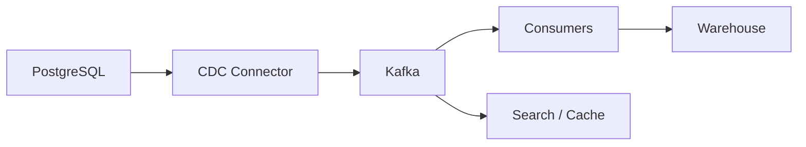
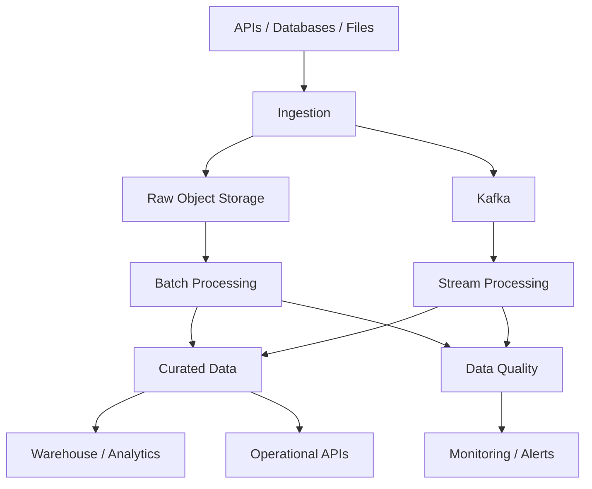

# 19- Data Engineering Scenarios

## Overview

Python is frequently used in data engineering for ingestion, transformation, validation, orchestration, batch processing, API integration, and data-quality workflows.

Data-engineering interview scenarios are less about memorizing Pandas APIs and more about reasoning about:

```text
Source
  ↓
Ingestion
  ↓
Validation
  ↓
Transformation
  ↓
Storage
  ↓
Processing
  ↓
Serving / Analytics
  ↓
Monitoring
```

A production data pipeline must account for:

- volume;
- schema evolution;
- malformed data;
- duplicate records;
- late-arriving data;
- retries;
- idempotency;
- ordering;
- partitioning;
- memory usage;
- data quality;
- observability;
- recovery.

A strong interview answer should distinguish between **correctness**, **performance**, and **operational reliability**.

---

## Data Engineering Scenario Framework

For any pipeline problem, establish:

| Area | Questions |
|---|---|
| Source | API, database, files, Kafka, object storage? |
| Volume | Rows/events per second? Daily data size? |
| Frequency | Streaming, hourly, daily, ad hoc? |
| Schema | Stable, evolving, semi-structured? |
| Correctness | What constitutes valid data? |
| Delivery | At-most-once, at-least-once, effectively-once? |
| Ordering | Is event order important? |
| Duplicates | Can records arrive more than once? |
| Latency | Real-time, near-real-time, batch? |
| Storage | PostgreSQL, S3, Parquet, warehouse? |
| Processing | Python, Pandas, NumPy, Spark, SQL? |
| Recovery | Can failed work restart safely? |
| Observability | What metrics and alerts are required? |
| Security | PII, encryption, access control? |
| Cost | Compute, storage, network, API costs? |

The first architectural decision should be driven by workload characteristics rather than the availability of a familiar library.

---

## Scenario: Build a Batch ETL Pipeline

Suppose an organization receives daily CSV files containing transactions.

A basic pipeline is:


A production pipeline should also include:

```text
Logging
Metrics
Failure handling
Retry
Idempotency
Schema validation
Quarantine / dead-letter data
```

The pipeline should be restartable without creating duplicate output.

---

## Scenario: Ingest a Large CSV

For a small file:

```python
import pandas as pd

df = pd.read_csv("transactions.csv")
```

For a large file, avoid loading everything into memory.

```python
import pandas as pd

for chunk in pd.read_csv(
    "transactions.csv",
    chunksize=100_000,
):
    process_chunk(chunk)
```

The key property is bounded memory usage.

```text
10 million rows
      ↓
100k rows
      ↓
process
      ↓
release
      ↓
next 100k
```

Chunking does not automatically make computation faster. It primarily controls memory and allows incremental processing.

---

## Scenario: Process a Huge Dataset

Suppose a pipeline receives 500 GB of data.

A Python/Pandas process on a single machine may not be appropriate.

Consider:

| Workload | Possible approach |
|---|---|
| Small dataset | Pandas |
| Medium batch | Chunked Pandas / SQL |
| Large SQL transformation | PostgreSQL / warehouse |
| Very large distributed dataset | Spark |
| Streaming events | Kafka + stream processor |
| Object-storage analytics | Parquet + query engine |

A senior engineer asks:

> Where should the computation happen?

Pushing filtering and aggregation into a database can be substantially more efficient than transferring millions of rows into Python.

---

## Scenario: Filter Data Efficiently

Instead of:

```python
result = []

for row in rows:
    if row["status"] == "completed":
        result.append(row)
```

For a DataFrame:

```python
result = df.loc[df["status"].eq("completed")]
```

For database-backed data, consider:

```sql
SELECT id, customer_id, amount
FROM orders
WHERE status = 'completed';
```

The database may use indexes, query planning, parallelism, and storage-level optimizations.

Do not move data into Python simply because Python is familiar.

---

## Scenario: Aggregate Large Data

Suppose the requirement is:

> Calculate total revenue by customer.

In Pandas:

```python
revenue = (
    df.groupby("customer_id", as_index=False)["amount"]
    .sum()
)
```

For a large relational dataset:

```sql
SELECT
    customer_id,
    SUM(amount) AS revenue
FROM orders
GROUP BY customer_id;
```

A good interview answer discusses where the aggregation should occur based on:

- data size;
- database capacity;
- network transfer;
- indexing;
- concurrency;
- downstream requirements.

---

## Scenario: Data Type Optimization

Pandas memory usage can become significant.

Inspect:

```python
df.info(memory_usage="deep")
```

Potential optimizations include:

- appropriate integer widths;
- categorical values for low-cardinality columns;
- datetime types;
- avoiding unnecessary object columns;
- selecting only required columns.

Example:

```python
df["status"] = df["status"].astype("category")
```

Do not optimize types blindly. Validate that the reduced dtype preserves the required value range and semantics.

---

## Scenario: Missing Data

Suppose a customer dataset contains missing values.

Do not automatically use:

```python
df = df.fillna(0)
```

A missing value may mean:

- unknown;
- not applicable;
- unavailable;
- corrupted;
- not yet received.

Different semantics require different treatment.

Example:

```python
df["discount"] = df["discount"].fillna(0)
```

may be correct if `NULL` explicitly means "no discount."

But replacing a missing customer identifier with `0` could corrupt downstream joins.

---

## Scenario: Data Validation

Validate data at ingestion boundaries.

Example:

```python
required_columns = {
    "transaction_id",
    "customer_id",
    "amount",
    "created_at",
}

missing = required_columns - set(df.columns)

if missing:
    raise ValueError(
        f"Missing required columns: {sorted(missing)}"
    )
```

Production validation should also check:

- data types;
- nullability;
- ranges;
- uniqueness;
- referential integrity;
- timestamp validity;
- enum values.

Invalid records can be quarantined instead of causing an entire batch to fail when business requirements allow it.

---

## Scenario: Schema Evolution

Suppose an upstream source changes:

```text
customer_id
```

to:

```text
customerId
```

A fragile pipeline may fail unexpectedly.

A robust pipeline treats schema as an explicit contract.

```text
Producer
   ↓
Schema
   ↓
Validation
   ↓
Consumer
```

Schema evolution strategies include:

- backward-compatible additions;
- explicit versioning;
- schema registries;
- contract tests;
- tolerant readers.

Avoid silently accepting structural changes that alter business meaning.

---

## Scenario: Duplicate Records

Suppose an ingestion job runs twice.

```text
Run 1 → records A B C
Run 2 → records A B C
```

If the target simply appends both batches:

```text
A B C A B C
```

Define a stable business or source identifier:

```text
transaction_id
event_id
source_record_id
```

Then enforce uniqueness where appropriate.

For PostgreSQL:

```sql
CREATE UNIQUE INDEX transaction_id_idx
ON transactions (transaction_id);
```

Idempotency should be designed into the ingestion process rather than added after duplicates occur.

---

## Scenario: Idempotent ETL

An idempotent pipeline can be safely rerun:

```text
Input
  ↓
Transform
  ↓
Output
```

Running it once or multiple times produces the same logical result.

Common approaches:

- deterministic record keys;
- upserts;
- partition replacement;
- staging tables;
- merge operations;
- processed-file tracking.

For example:

```sql
INSERT INTO customer_metrics (
    customer_id,
    metric_date,
    revenue
)
VALUES ($1, $2, $3)
ON CONFLICT (customer_id, metric_date)
DO UPDATE SET revenue = EXCLUDED.revenue;
```

The correct strategy depends on whether the target is append-only, mutable, or derived.

---

## Scenario: Incremental Data Processing

Avoid repeatedly processing an entire table:

```text
Day 1 → 1M rows
Day 2 → 1M rows
Day 3 → 1M rows
...
```

Instead, process only new or changed records.

Possible mechanisms:

```text
updated_at watermark
       ↓
CDC
       ↓
Kafka offsets
       ↓
partition boundaries
```

Example:

```sql
SELECT *
FROM orders
WHERE updated_at > $1
  AND updated_at <= $2;
```

Watermark-based extraction requires careful handling of:

- equal timestamps;
- late updates;
- clock differences;
- transaction visibility;
- retries.

A unique tie-breaker can make the boundary deterministic.

---

## Scenario: Change Data Capture

CDC captures database changes and publishes them for downstream processing.



CDC is useful when downstream systems need database changes without repeatedly polling entire tables.

Important considerations:

- ordering;
- offsets;
- schema changes;
- deletes;
- transaction boundaries;
- duplicate events;
- consumer recovery.

---

## Scenario: Late-Arriving Data

Suppose a daily report for September 5 is generated on September 6.

Later, an event from September 5 arrives.

```text
September 5 partition
       ↓
Already processed
       ↓
Late event arrives
```

The pipeline must define whether historical partitions can be corrected.

Strategies include:

- reprocessing a rolling time window;
- partition overwrite;
- upsert;
- correction events;
- watermark with allowed lateness.

Never assume event time and processing time are identical.

---

## Scenario: Event Time vs Processing Time

An event may contain:

```text
event_time = 10:00
received_at = 10:07
processed_at = 10:08
```

These represent different concepts.

| Timestamp | Meaning |
|---|---|
| Event time | When business event occurred |
| Ingestion time | When system received it |
| Processing time | When computation occurred |

Analytics should use the timestamp appropriate to the business requirement.

---

## Scenario: Timezone Bugs

Avoid naive timestamps when timezone semantics matter.

Prefer timezone-aware values:

```python
from datetime import datetime, timezone

timestamp = datetime.now(timezone.utc)
```

Store a consistent canonical representation, commonly UTC, and convert to local time at presentation boundaries.

A one-hour timezone error can corrupt:

- daily reports;
- billing;
- event windows;
- partitioning;
- SLA calculations.

---

## Scenario: Data Quality Checks

A production pipeline should monitor more than whether the job completed.

Useful checks:

```text
Row count
Null percentage
Duplicate count
Value ranges
Freshness
Distribution changes
Referential integrity
Schema compatibility
```

Example:

```python
if df["transaction_id"].isna().any():
    raise DataQualityError(
        "transaction_id contains null values"
    )
```

A pipeline can successfully process corrupted data. Job success is not equivalent to data correctness.

---

## Scenario: Data Freshness

Suppose a dashboard expects data less than 15 minutes old.

Monitor:

```text
Current time - newest valid event time
```

Example:

```text
Newest event = 10:42
Current time = 11:00
Freshness = 18 minutes
```

The pipeline may be running successfully while still violating the freshness requirement.

Freshness should have explicit thresholds and alerts.

---

## Scenario: Data Completeness

Suppose an expected daily file contains approximately 10 million records.

Today:

```text
Expected ≈ 10M
Received = 200K
```

The pipeline may technically succeed but produce incorrect downstream results.

Completeness checks can compare:

- expected partitions;
- expected row counts;
- source control totals;
- file counts;
- event sequence ranges.

---

## Scenario: Data Reconciliation

For financial or operational pipelines, reconcile source and destination totals.

```text
Source:
10,000 transactions
$1,250,000

Target:
9,998 transactions
$1,245,000
```

The discrepancy should trigger investigation.

Useful reconciliation dimensions include:

- row counts;
- monetary totals;
- distinct IDs;
- min/max timestamps;
- checksums where appropriate.

---

## Scenario: API Ingestion

Suppose a partner API provides 10,000 records per page.

Typical flow:

```text
API
 ↓
Pagination
 ↓
Validation
 ↓
Transformation
 ↓
Durable storage
```

Do not assume the API returns all records in one request.

Handle:

- pagination;
- rate limits;
- timeouts;
- retries;
- authentication;
- schema changes;
- partial failures.

---

## Scenario: API Rate Limits

Suppose the provider allows:

```text
100 requests/minute
```

A pipeline that ignores this may receive:

```text
429 Too Many Requests
```

Use:

- bounded concurrency;
- rate limiting;
- exponential backoff;
- provider-specific retry guidance;
- checkpointing.

Avoid launching hundreds of concurrent requests simply because Python supports asynchronous execution.

Concurrency must respect downstream capacity.

---

## Scenario: Parallel API Ingestion

For independent API requests, asynchronous execution can improve throughput.

```python
import asyncio


async def fetch_page(client, page: int):
    response = await client.get(
        "/records",
        params={"page": page},
    )
    response.raise_for_status()
    return response.json()


async def fetch_pages(client, pages: list[int]):
    return await asyncio.gather(
        *(fetch_page(client, page) for page in pages)
    )
```

In production, bound concurrency:

```text
1000 pages
    ↓
Semaphore(limit=20)
    ↓
20 concurrent requests
```

Unbounded concurrency can exhaust:

- sockets;
- memory;
- API quotas;
- connection pools;
- downstream capacity.

---

## Scenario: Checkpointing

Long-running jobs should avoid restarting from zero after failure.

```text
10M records
    ↓
Processed 7M
    X
Failure
    ↓
Resume from checkpoint
```

Checkpoint information might include:

- source offset;
- timestamp watermark;
- file partition;
- Kafka offset;
- batch ID.

Checkpoints must themselves be durable and consistent with output state.

---

## Scenario: File-Based Pipeline

Suppose files arrive in S3:

```text
s3://bucket/raw/2026/09/06/file-001.csv
```

A robust pipeline can use:

```text
S3
 ↓
Manifest / event
 ↓
Validation
 ↓
Raw storage
 ↓
Transformation
 ↓
Curated Parquet
```

Keep raw data when retention and privacy requirements permit it.

Raw data provides an important recovery and replay mechanism.

---

## Scenario: Partitioning

Partition large datasets by a useful access dimension.

Example:

```text
s3://bucket/events/
    year=2026/
    month=09/
    day=06/
```

Partitioning can reduce scanned data for selective queries.

However, excessive partitioning creates operational overhead.

Avoid:

```text
partition per user
```

for millions of users unless the storage/query system is specifically designed for that access pattern.

Partition based on common query filters and realistic data volume.

---

## Scenario: Parquet vs CSV

| Characteristic | CSV | Parquet |
|---|---|---|
| Schema | Weak | Stronger metadata |
| Compression | Limited | Strong |
| Column pruning | Poor | Excellent |
| Analytics | Less efficient | Efficient |
| Human-readable | Yes | No |
| Nested data | Awkward | Supported |
| Typical use | Interchange | Analytical storage |

For large analytical datasets, Parquet is generally preferable to repeatedly processing CSV.

---

## Scenario: Data Lake Layout

A common architecture is:

```text
                    ┌─────────────┐
Sources ───────────►│ Raw / Bronze│
                    └──────┬──────┘
                           ↓
                    ┌─────────────┐
                    │ Clean /     │
                    │ Silver      │
                    └──────┬──────┘
                           ↓
                    ┌─────────────┐
                    │ Curated /   │
                    │ Gold        │
                    └─────────────┘
```

The names vary by organization, but the principle is useful:

- preserve source data;
- normalize and validate;
- produce business-ready datasets.

Do not duplicate every dataset at every layer without considering storage cost and governance.

---

## Scenario: ETL vs ELT

### ETL

```text
Extract
  ↓
Transform
  ↓
Load
```

### ELT

```text
Extract
  ↓
Load
  ↓
Transform in warehouse
```

ELT is often effective when the analytical database or warehouse has substantial compute and SQL capabilities.

Choose based on:

- transformation complexity;
- data volume;
- storage cost;
- warehouse capacity;
- governance;
- latency requirements.

---

## Scenario: SQL vs Pandas

Use SQL when:

- data already resides in a relational database;
- filtering/aggregation can be pushed to the database;
- data volume is large;
- joins can be efficiently executed server-side.

Use Pandas when:

- data fits comfortably in memory;
- transformation is easier in Python;
- the workload is exploratory or moderate-sized;
- Python ecosystem integration is useful.

Use both when appropriate:

```text
PostgreSQL
   ↓
Select only required data
   ↓
Pandas
   ↓
Complex transformation
   ↓
Target
```

The boundary should minimize unnecessary data movement.

---

## Scenario: Join Produces Unexpected Row Counts

Suppose:

```text
customers = 1M rows
orders = 10M rows
```

After a join, the result unexpectedly contains 50M rows.

Potential cause:

```text
customer_id
```

is not unique on one or both sides.

Validate join cardinality before joining.

Conceptually:

```text
1-to-1
1-to-many
many-to-1
many-to-many
```

Many-to-many joins can cause multiplicative row growth.

---

## Scenario: Data Skew

Suppose one customer owns 40% of all events.

```text
Partition 1 → 1M
Partition 2 → 1M
Partition 3 → 1M
Partition 4 → 80M
```

Parallel processing becomes imbalanced.

Mitigation depends on the processing system and may include:

- better partition keys;
- salting;
- pre-aggregation;
- skew-aware joins;
- repartitioning.

Data distribution matters as much as total data volume.

---

## Scenario: Exactly-Once Processing

Be precise when discussing delivery semantics.

### At-most-once

```text
Message may be lost
No duplicate processing
```

### At-least-once

```text
Message is retried
Duplicates are possible
```

### Exactly-once

A true end-to-end exactly-once guarantee is difficult and depends on all participating systems.

In many practical architectures, aim for:

```text
At-least-once delivery
+
Idempotent processing
=
Effectively-once business result
```

This distinction is important in interviews.

---

## Scenario: Kafka Consumer Lag

Suppose:

```text
Incoming = 100k events/sec
Consumer = 60k events/sec
```

Lag grows continuously.

Potential actions:

- scale consumers;
- optimize processing;
- increase partitions where appropriate;
- batch operations;
- reduce downstream latency;
- identify hot partitions.

But scaling consumers only helps when enough partitions exist and downstream systems can absorb the additional load.

---

## Scenario: Batch Processing vs Streaming

| Requirement | Batch | Streaming |
|---|---|---|
| Hourly/daily reports | Strong fit | Often unnecessary |
| Seconds-level latency | Poor fit | Strong fit |
| Simple operations | Strong fit | More complex |
| Operational complexity | Lower | Higher |
| Large historical processing | Strong fit | Possible but different |
| Continuous events | Poor fit | Strong fit |

Do not choose streaming simply because real-time processing sounds more advanced.

---

## Scenario: Data Backfill

Suppose a transformation bug affected six months of data.

A safe backfill should define:

```text
Affected range
      ↓
Correct transformation
      ↓
Isolated output
      ↓
Validation
      ↓
Controlled replacement
```

Avoid modifying production data blindly.

Backfills should be:

- resumable;
- observable;
- idempotent;
- rate-limited;
- reversible where practical.

---

## Scenario: Pipeline Failure Recovery

A pipeline fails halfway through:

```text
Extract       ✓
Transform     ✓
Load          X
```

Ask:

> Can the pipeline restart without duplicating or corrupting data?

Useful mechanisms:

- staging tables;
- temporary output;
- atomic partition replacement;
- idempotent upserts;
- checkpoints;
- transaction boundaries.

Failure recovery should be part of the initial design.

---

## Scenario: Dead-Letter Data

A small percentage of records may be malformed.

Instead of failing an entire batch:

```text
Input
 ├── valid → normal pipeline
 └── invalid → quarantine
```

Quarantined records should retain enough context to diagnose the failure without storing unnecessary sensitive data.

Track:

- invalid-record count;
- validation reason;
- source;
- batch ID;
- schema version.

A dead-letter mechanism is useful only if someone monitors and processes it.

---

## Scenario: Data Lineage

For a business metric:

```text
Revenue
  ↓
Gold dataset
  ↓
Silver orders
  ↓
Raw events
  ↓
Payment service
```

Lineage answers:

> Where did this number come from?

It is important for:

- debugging;
- governance;
- compliance;
- impact analysis;
- reproducibility.

A metric without clear lineage becomes difficult to trust.

---

## Scenario: Data Security

Data pipelines often process sensitive information.

Controls include:

- encryption at rest;
- TLS in transit;
- IAM least privilege;
- restricted buckets;
- column-level protection where appropriate;
- retention policies;
- audit logging;
- masking/tokenization.

Avoid copying sensitive production data into developer laptops or test environments unnecessarily.

---

## Scenario: PII in Data Pipelines

Before processing personal data, determine:

```text
What data?
Why required?
Who needs access?
How long retained?
Where stored?
```

Potential techniques:

- tokenization;
- hashing where appropriate;
- masking;
- column-level access;
- pseudonymization.

Hashing is not automatically anonymization. Low-entropy identifiers may be reversible through dictionary attacks.

---

## Scenario: Pipeline Cost Optimization

Cost drivers often include:

```text
Compute
Storage
Network transfer
API calls
Database queries
Kafka throughput
Warehouse scans
```

High-impact optimizations include:

- partition pruning;
- column pruning;
- Parquet;
- compression;
- incremental processing;
- batching;
- avoiding unnecessary cross-region transfer;
- right-sizing compute.

Do not optimize tiny Python operations while repeatedly scanning terabytes of storage.

---

## Scenario: Pipeline Observability

Track at least:

| Metric | Purpose |
|---|---|
| Records processed | Throughput |
| Records failed | Data quality |
| Processing duration | Performance |
| Freshness | SLA |
| Input volume | Completeness |
| Output volume | Validation |
| Duplicate count | Idempotency |
| Consumer lag | Streaming health |
| Retry count | Reliability |
| Memory usage | Runtime stability |

Metrics should be associated with bounded dimensions such as:

```text
pipeline
environment
dataset
status
```

Avoid unbounded labels such as individual record IDs.

---

## Scenario: Pipeline Alerting

Alert on meaningful conditions:

```text
Freshness > SLA
Failure rate > threshold
Input volume unexpectedly low
Duplicate rate unexpectedly high
Kafka lag continuously increasing
Memory approaching limit
Schema validation failures
```

Avoid alerting on every individual bad record.

Aggregate operational signals into actionable alerts.

---

## Scenario: Python Concurrency in Data Pipelines

For I/O-heavy ingestion:

```text
API requests
S3 operations
Database reads
```

asyncio or threads can improve throughput when libraries and workload characteristics support it.

For CPU-heavy transformations:

```text
Parsing
Compression
Complex Python computation
```

consider:

- vectorized/native operations;
- multiprocessing;
- distributed processing;
- database-side computation.

Concurrency should be bounded.

---

## Scenario: Pandas Performance

Prefer vectorized operations:

```python
df["total"] = df["price"] * df["quantity"]
```

over Python-level row iteration:

```python
df["total"] = df.apply(
    lambda row: row["price"] * row["quantity"],
    axis=1,
)
```

For large datasets, `apply(axis=1)` can be significantly slower because it executes Python-level function calls for rows.

Prefer built-in operations where they express the transformation clearly.

---

## Scenario: Avoid `iterrows()`

Avoid:

```python
for _, row in df.iterrows():
    process(row)
```

for large transformations.

Consider:

- vectorized operations;
- `itertuples()` when row-wise Python iteration is genuinely necessary;
- SQL;
- chunked processing;
- specialized engines.

The best solution is often to avoid row-by-row Python processing entirely.

---

## Scenario: Memory-Efficient Pandas Pipeline

A production-oriented pattern is:

```text
Read selected columns
        ↓
Process bounded chunks
        ↓
Filter early
        ↓
Transform
        ↓
Write incrementally
```

Example:

```python
columns = [
    "transaction_id",
    "customer_id",
    "amount",
    "created_at",
]

for chunk in pd.read_csv(
    "transactions.csv",
    usecols=columns,
    chunksize=100_000,
):
    chunk = chunk.loc[chunk["amount"].ge(0)]
    write_batch(chunk)
```

Reading only required columns can substantially reduce memory and I/O.

---

## Scenario: Data Contract Between Services

A producer publishes:

```json
{
  "event_id": "evt-123",
  "order_id": "ord-456",
  "amount_cents": 1500,
  "occurred_at": "2026-09-06T10:30:00Z"
}
```

Consumers depend on the contract.

A strong contract defines:

- required fields;
- types;
- semantics;
- units;
- timestamp format;
- compatibility policy.

For example, `amount_cents` is safer than an ambiguous `amount` because its unit is explicit.

---

## Scenario: Schema Validation with Typed Models

For API or event payload validation, Python models can provide explicit contracts.

```python
from datetime import datetime

from pydantic import BaseModel


class OrderCreated(BaseModel):
    event_id: str
    order_id: str
    amount_cents: int
    occurred_at: datetime
```

Static type hints alone do not validate untrusted runtime data.

For external boundaries:

```text
Untrusted data
      ↓
Runtime validation
      ↓
Typed internal model
      ↓
Business logic
```

This distinction is important in production data pipelines.

---

## Scenario: Data Engineering Architecture

A scalable architecture might look like:



Python can participate in many layers, but it should not necessarily own every processing stage.

---

## Scenario: When to Use Spark

Spark becomes attractive when:

- datasets exceed comfortable single-node memory;
- distributed computation is required;
- joins and aggregations are large;
- cluster-scale processing is needed;
- the organization already operates Spark infrastructure.

A useful progression is:

```text
SQL
  ↓
Pandas
  ↓
Chunked / optimized processing
  ↓
Distributed processing such as Spark
```

Do not introduce Spark for a 500 MB dataset simply because it is a data-engineering technology.

---

## Scenario: Data Pipeline Testing

Test different layers:

```text
Unit tests
   ↓
Transformation tests
   ↓
Schema tests
   ↓
Integration tests
   ↓
End-to-end pipeline tests
```

Example:

```python
def test_revenue_aggregation():
    input_data = [
        {"customer_id": 1, "amount": 100},
        {"customer_id": 1, "amount": 50},
        {"customer_id": 2, "amount": 25},
    ]

    result = aggregate_revenue(input_data)

    assert result == {
        1: 150,
        2: 25,
    }
```

Also test:

- duplicates;
- missing values;
- malformed records;
- empty input;
- late events;
- schema changes;
- retries;
- partial failures.

---

## Scenario: Reproducibility

A data transformation should be reproducible when possible.

Record:

```text
Input dataset/version
Code version
Schema version
Configuration
Processing timestamp
Dependencies
```

This enables:

```text
Same input
+
Same transformation version
+
Same configuration
→
Comparable output
```

Reproducibility is especially important for financial, regulatory, and analytical workloads.

---

## Scenario: Data Pipeline Deployment

Treat pipelines as software.

Use:

- version control;
- dependency locking;
- automated tests;
- CI/CD;
- code review;
- environment-specific configuration;
- staged deployment;
- rollback strategy.

A pipeline should not depend on an engineer manually changing production code or environment settings.

---

## Scenario: Airflow / Orchestration

An orchestrator coordinates pipeline dependencies:

```text
Extract
  ↓
Validate
  ↓
Transform
  ↓
Load
  ↓
Quality Check
```

The orchestration layer should coordinate work rather than contain all business logic.

Business transformations should remain testable Python modules where practical.

---

## Scenario: Pipeline DAG Failure

Suppose:

```text
A → B → C
    ↓
    D
```

If B fails, downstream tasks should not execute with invalid input.

A DAG should make dependencies explicit.

For recoverability, distinguish:

```text
Task failed
```

from:

```text
Task completed but output is invalid
```

Data-quality checks should participate in orchestration decisions.

---

## Scenario: Backpressure in Data Pipelines

Suppose ingestion produces:

```text
200k events/sec
```

while processing handles:

```text
100k events/sec
```

The backlog grows.

```text
Producer
   ↓
Queue
   ↓
Consumer
   ↓
Backlog ↑
```

Possible solutions:

- scale consumers;
- batch processing;
- reduce producer rate;
- optimize processing;
- partition workload;
- apply load shedding where acceptable.

A pipeline should have explicit capacity limits.

---

## Common Data Engineering Mistakes

| Mistake | Why it fails | Better approach |
|---|---|---|
| Load entire dataset into memory | OOM risk | Chunk/stream |
| Process every row in Python | Slow | Vectorize/SQL |
| Ignore duplicates | Corrupt aggregates | Idempotent keys |
| Treat job success as data success | Bad data can pass | Data-quality checks |
| Assume timestamps are UTC | Time errors | Explicit timezone semantics |
| Ignore late events | Historical data becomes incorrect | Watermarks/reprocessing |
| Unbounded API concurrency | Rate limits/outage | Bounded concurrency |
| Retry every failure | Retry storms | Classify failures |
| Use many tiny partitions | Metadata/management overhead | Practical partition sizing |
| Use Spark for everything | Operational complexity | Match tool to scale |
| Store sensitive raw data everywhere | Security/compliance risk | Minimize and govern data |
| Overwrite production data directly | Difficult recovery | Staging/versioned outputs |
| Ignore schema evolution | Pipeline breakage | Contracts/versioning |
| Rely only on row counts | Corruption may remain | Multi-dimensional validation |

---

## Senior-Level Interview Traps

### "How would you process a 1 TB CSV with Pandas?"

Do not answer simply:

> Increase the machine's RAM.

Discuss:

```text
Can the source be partitioned?
Can it be converted to Parquet?
Can processing happen incrementally?
Can SQL/object-storage query engines perform the work?
Is distributed processing required?
```

### "How do you guarantee exactly-once processing?"

Do not casually claim exactly-once.

Explain:

```text
Delivery semantics
+
Idempotent consumer
+
Transactional state
+
Offset/checkpoint handling
```

and define the actual end-to-end guarantee.

### "How do you prevent duplicate data?"

Discuss:

- deterministic identifiers;
- unique constraints;
- idempotent writes;
- source offsets;
- deduplication windows.

### "How do you handle a failed pipeline?"

Discuss:

- checkpointing;
- retries;
- idempotency;
- staging;
- quarantine;
- observability;
- replay.

### "How do you scale a Python pipeline?"

Do not immediately say:

> Use multiprocessing.

First determine whether the workload is:

```text
I/O-bound
CPU-bound
Database-bound
Memory-bound
Network-bound
Distributed
```

Then select the appropriate architecture.

---

## Data Engineering Production Checklist

### Ingestion

- [ ] Pagination handled
- [ ] Rate limits respected
- [ ] Timeouts configured
- [ ] Retries bounded
- [ ] Authentication secured
- [ ] Source checkpoints implemented

### Data Quality

- [ ] Schema validation
- [ ] Null checks
- [ ] Range checks
- [ ] Duplicate detection
- [ ] Referential integrity
- [ ] Completeness checks
- [ ] Freshness checks
- [ ] Reconciliation

### Processing

- [ ] Memory bounded
- [ ] Vectorized operations where appropriate
- [ ] SQL pushdown considered
- [ ] Batch sizes controlled
- [ ] Partitioning appropriate
- [ ] Late data handled

### Reliability

- [ ] Idempotent processing
- [ ] Retry strategy
- [ ] Checkpointing
- [ ] Dead-letter/quarantine path
- [ ] Backfill strategy
- [ ] Recovery procedure

### Operations

- [ ] Metrics
- [ ] Structured logs
- [ ] Alerts
- [ ] Data lineage
- [ ] Pipeline ownership
- [ ] CI/CD
- [ ] Dependency management

### Security

- [ ] Least-privilege access
- [ ] Encryption
- [ ] Sensitive-data classification
- [ ] Retention policy
- [ ] Audit logging
- [ ] Safe development datasets

---

## Key Takeaways

- **Design around data characteristics:** volume, latency, schema, ordering, duplication, consistency, and recovery requirements should determine whether to use SQL, Pandas, Python, Kafka, Spark, or other processing systems.
- **Make pipelines restartable and idempotent:** retries, duplicate delivery, partial failures, late data, and backfills are normal production conditions, not exceptional cases.
- **Move computation to the right layer:** push filtering and aggregation into databases or analytical engines when appropriate, use vectorized operations for Pandas, and use distributed processing only when workload scale justifies it.
- **Treat data quality as a first-class production concern:** freshness, completeness, schema validity, duplicates, reconciliation, and lineage are necessary because a successfully executed pipeline can still produce incorrect data.
- **Bound resource usage and observe the pipeline:** control memory, concurrency, queue depth, API usage, partition sizes, and downstream capacity while monitoring throughput, failures, freshness, lag, and data-quality signals.