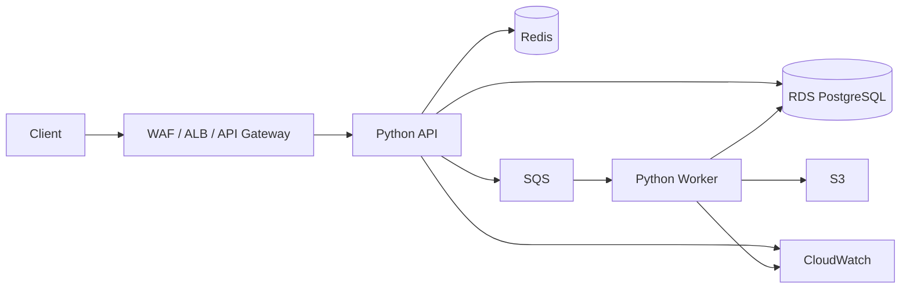
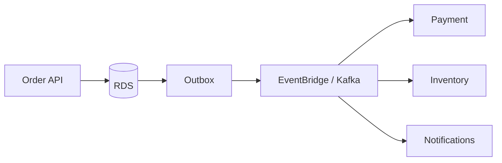

# 20- AWS Python Scenarios

## Overview

Python is widely used in AWS backend systems for APIs, event processing, automation, data pipelines, scheduled jobs, and serverless workloads.

AWS interview scenarios test whether you can connect Python application behavior with cloud architecture:

```text
Client / Event
      ↓
AWS Entry Point
      ↓
Python Compute
      ↓
AWS Services
 ┌────┼────┬──────┬───────┐
 ↓    ↓    ↓      ↓       ↓
S3   SQS  RDS   DynamoDB  Redis
      ↓
   Workers
      ↓
 Observability
```

A strong answer should not stop at:

> "Use Lambda."

Instead, reason about:

- execution model;
- workload type;
- latency;
- concurrency;
- state;
- durability;
- retries;
- idempotency;
- IAM;
- networking;
- scaling;
- observability;
- cost;
- deployment;
- disaster recovery.

The core AWS question is:

> Which component should own this responsibility, and what happens when that component fails?

---

## AWS Architecture Decision Framework

For an AWS Python scenario, establish the workload first.

| Requirement | Questions |
|---|---|
| Traffic | Requests/sec and peak concurrency? |
| Latency | Milliseconds, seconds, minutes? |
| Execution | Short-lived or long-running? |
| State | Stateless or stateful? |
| Trigger | HTTP, queue, event, schedule, file? |
| Storage | Object, relational, key-value? |
| Consistency | Strong or eventual? |
| Processing | CPU-bound, I/O-bound, batch, streaming? |
| Availability | Single-AZ or multi-AZ? |
| Scaling | Automatic or controlled? |
| Security | IAM, network, encryption, secrets? |
| Cost | Per-request or continuously provisioned? |
| Operations | Logs, metrics, tracing, alerting? |

A senior-level answer explicitly identifies the main constraint before selecting AWS services.

---

## Common AWS Python Architecture

A typical production backend may look like:



The exact architecture depends on workload characteristics.

Avoid introducing every AWS service into a design simply because it is available.

---

## Scenario: Choose Between Lambda and ECS

The choice depends primarily on execution characteristics.

| Requirement | Lambda | ECS |
|---|---|---|
| Short event-driven work | Excellent | Good |
| Long-running processes | Limited by Lambda model | Strong |
| Persistent worker process | Poor fit | Strong |
| HTTP APIs | Good | Strong |
| Fine-grained runtime control | Limited | Strong |
| Container workloads | Supported | Native |
| Operational simplicity | High | Higher operational responsibility |
| Predictable continuous workload | Can work | Often appropriate |
| Bursty workload | Excellent | Requires capacity strategy |

Use Lambda when event-driven execution and managed scaling are valuable.

Use ECS when you need more control over runtime, networking, containers, process lifecycle, or long-running workloads.

---

## Scenario: Build a Python API on AWS

A common architecture:

```text
Internet
   ↓
Route 53
   ↓
WAF
   ↓
ALB / API Gateway
   ↓
Python application
   ↓
RDS PostgreSQL
   ↓
ElastiCache Redis
```

For containerized Python:

```text
Docker image
    ↓
ECR
    ↓
ECS / EKS
    ↓
Python workers
```

For serverless:

```text
API Gateway
    ↓
Lambda
    ↓
RDS / DynamoDB / S3
```

The application should remain stateless where possible so instances can scale horizontally.

---

## Scenario: Lambda Handler

A basic Lambda function:

```python
import json


def handler(event, context):
    return {
        "statusCode": 200,
        "headers": {
            "content-type": "application/json",
        },
        "body": json.dumps({"status": "ok"}),
    }
```

The handler should generally:

- validate input;
- perform bounded work;
- handle expected exceptions;
- emit useful logs;
- avoid global mutable request state;
- return a stable contract.

Lambda execution environments may be reused, but reuse must not be treated as guaranteed.

---

## Lambda Execution Model

Conceptually:

```text
Event
  ↓
Lambda service
  ↓
Execution environment
  ↓
Python runtime
  ↓
Handler
  ↓
Response
```

AWS may create multiple execution environments for concurrent invocations:

```text
Request A → Environment 1
Request B → Environment 2
Request C → Environment 3
Request D → Environment 4
```

Therefore:

> Lambda concurrency is not shared Python memory.

A global dictionary in one execution environment is not a distributed cache.

---

## Scenario: Lambda Cold Start

A new execution environment may require:

```text
Create environment
      ↓
Initialize runtime
      ↓
Import modules
      ↓
Initialize application
      ↓
Execute handler
```

This can increase initial latency.

Reduce cold-start impact by:

- keeping deployment packages reasonable;
- minimizing unnecessary imports;
- initializing only what is useful;
- avoiding excessive startup work;
- selecting appropriate runtime architecture;
- using AWS-supported mechanisms such as provisioned concurrency when justified.

Do not optimize cold starts before measuring their impact on the actual latency objective.

---

## Scenario: Lambda Global State

This is sometimes useful:

```python
client = create_client()


def handler(event, context):
    return client.process(event)
```

The client may be reused if the execution environment is reused.

However, never assume:

```python
global_state
```

is:

- durable;
- shared across invocations;
- shared across instances;
- synchronized across concurrent environments.

Durable state belongs in appropriate AWS-managed storage.

---

## Scenario: Lambda and Database Connections

A common mistake is allowing every Lambda execution to create a new database connection.

```text
Traffic spike
    ↓
Many Lambda environments
    ↓
Many DB connections
    ↓
RDS connection exhaustion
```

Use appropriate connection-management strategies and consider an AWS-managed database connection proxy where appropriate.

Also ensure the application does not assume Lambda's concurrency can safely equal database concurrency.

---

## Scenario: SQS Worker

Suppose an application must process image jobs asynchronously.

```text
API
 ↓
SQS
 ↓
Lambda / ECS Worker
 ↓
S3
```

SQS provides durable asynchronous decoupling.

The producer does not need to wait for the worker to finish.

This improves:

- resilience;
- burst absorption;
- independent scaling;
- request latency.

---

## SQS Delivery Semantics

Standard SQS should generally be treated as **at-least-once delivery**.

Therefore:

```text
Message
  ↓
Worker
  ↓
Processing succeeds
  ↓
Delete message
```

If the worker fails before deletion, the message may become visible again.

Consumers should therefore be idempotent.

---

## Scenario: Idempotent SQS Consumer

Suppose a message contains:

```json
{
  "event_id": "evt-123",
  "order_id": "ord-456"
}
```

Store a durable processing record where necessary:

```text
event_id
   ↓
Already processed?
 ├── yes → safely return
 └── no  → process → record completion
```

Do not use an in-memory Python set:

```python
processed = set()
```

because Lambda/ECS instances are not a shared durable state store.

---

## SQS Visibility Timeout

When a consumer receives a message:

```text
Message
   ↓
Invisible temporarily
   ↓
Worker processes
   ↓
Delete
```

If processing exceeds the visibility timeout, another worker may receive the message.

Therefore:

```text
Visibility timeout
>
expected processing duration
```

with an appropriate safety margin.

For long-running or variable workloads, use mechanisms that extend visibility when appropriate.

---

## SQS Dead-Letter Queue

A poison message can repeatedly fail:

```text
Message
  ↓
Worker
  X
  ↓
Retry
  ↓
Worker
  X
  ↓
...
```

Use a dead-letter queue for messages that exceed an appropriate retry threshold.

```text
SQS
 ↓
Consumer
 ├── success → delete
 └── repeated failure → DLQ
```

The DLQ itself must be monitored.

A DLQ is not a substitute for fixing consumer failures.

---

## Scenario: Lambda Triggered by SQS

AWS can poll SQS and invoke Lambda for available messages.

Conceptually:

```text
SQS
 ↓
Event Source Mapping
 ↓
Lambda
 ↓
Python handler
```

Important concerns include:

- batch size;
- concurrency;
- partial batch failures;
- visibility timeout;
- DLQ;
- downstream capacity.

If one message in a batch fails, configure failure handling carefully so successfully processed messages are not unnecessarily retried.

---

## Scenario: S3 File Processing

Suppose customers upload CSV files to S3.

```text
Client
  ↓
S3
  ↓
Object-created event
  ↓
SQS / EventBridge / Lambda
  ↓
Python processor
  ↓
Validated output
```

A robust pipeline should:

- validate object metadata;
- verify file format;
- enforce size limits;
- process incrementally where necessary;
- write output atomically;
- track processing state;
- handle duplicate notifications.

S3 event notifications should not be assumed to represent exactly one processing opportunity.

---

## Scenario: S3 Object Is Large

Avoid downloading a huge object entirely into memory:

```python
body = s3.get_object(
    Bucket=bucket,
    Key=key,
)["Body"].read()
```

For large objects, stream or process in bounded chunks.

For analytical data, consider:

```text
S3
 ↓
Parquet
 ↓
Column pruning
 ↓
Batch / distributed processing
```

Large objects should not automatically become large Python objects.

---

## Scenario: S3 Presigned Upload

For large client uploads:

```text
Client
  ↓
API
  ↓
Presigned URL
  ↓
S3
```

The API does not need to proxy the entire file.

Benefits:

- lower application bandwidth;
- lower application memory;
- better scalability;
- reduced compute load.

The backend should still control:

- who can upload;
- object key;
- expiration;
- maximum size;
- allowed content;
- subsequent processing.

---

## Scenario: RDS PostgreSQL

Use RDS when the workload requires relational capabilities such as:

- transactions;
- joins;
- constraints;
- relational integrity;
- SQL queries.

Python application:

```text
FastAPI / Django
       ↓
Connection pool / proxy
       ↓
RDS PostgreSQL
```

Production considerations include:

- Multi-AZ;
- backups;
- connection limits;
- indexing;
- query performance;
- failover;
- migration strategy;
- monitoring.

RDS is managed infrastructure, not a replacement for database engineering.

---

## Scenario: RDS Connection Exhaustion

Symptoms:

```text
API latency ↑
Connection acquisition ↑
DB CPU normal
Requests timeout
```

Possible causes:

- too many application workers;
- Lambda concurrency;
- leaked connections;
- long transactions;
- insufficient pooling;
- slow queries.

Do not respond by indefinitely increasing `max_connections`.

The database still has finite CPU, memory, and I/O capacity.

---

## Scenario: DynamoDB vs PostgreSQL

| Requirement | DynamoDB | PostgreSQL |
|---|---|---|
| Key-value/access-pattern workloads | Excellent | Good |
| Complex joins | Poor fit | Excellent |
| Relational constraints | Limited | Strong |
| Flexible SQL analytics | Limited | Strong |
| Massive horizontal scale | Strong | Requires architecture |
| Transactions | Supported within defined limits | Strong |
| Schema flexibility | High | Structured |

Choose DynamoDB when access patterns are well-defined and massive scalable key-based access is valuable.

Choose PostgreSQL when relational modeling and flexible querying are important.

Do not choose DynamoDB simply because the application needs "high scale."

---

## Scenario: DynamoDB Hot Partition

If traffic concentrates on a small number of partition keys:

```text
Partition A → 90%
Partition B → 5%
Partition C → 5%
```

one partition can become a bottleneck.

Design partition keys for appropriate distribution.

A senior-level answer discusses:

- access patterns;
- key cardinality;
- traffic distribution;
- item size;
- hot keys;
- read/write patterns.

Data modeling in DynamoDB begins with access patterns rather than normalized relational modeling.

---

## Scenario: DynamoDB Conditional Write

Suppose an order should only be created once.

A conditional write can enforce the invariant:

```python
table.put_item(
    Item=item,
    ConditionExpression="attribute_not_exists(order_id)",
)
```

This is stronger than:

```python
if not exists(order_id):
    create()
```

because the condition is enforced atomically by DynamoDB.

Persistent invariants should be enforced by the storage system whenever possible.

---

## Scenario: AWS Secrets

Do not hard-code:

```python
API_KEY = "production-secret"
```

Prefer AWS-managed secret storage where appropriate.

```text
Python application
      ↓
IAM role
      ↓
Secrets Manager
      ↓
Secret
```

The application should receive permission to access only the secrets it actually needs.

Avoid giving an application broad:

```text
secretsmanager:*
```

permissions.

---

## Scenario: IAM Least Privilege

A Lambda that reads one S3 bucket should not receive:

```text
AdministratorAccess
```

Prefer narrowly scoped permissions.

Conceptually:

```json
{
  "Effect": "Allow",
  "Action": [
    "s3:GetObject"
  ],
  "Resource": "arn:aws:s3:::example-bucket/input/*"
}
```

Permissions should be limited by:

- action;
- resource;
- conditions where appropriate.

IAM is a primary security boundary in AWS.

---

## Scenario: IAM Failure

Suppose Python reports:

```text
AccessDeniedException
```

Do not immediately change the code.

Investigate:

```text
Caller identity
      ↓
IAM role
      ↓
Identity policy
      ↓
Resource policy
      ↓
Explicit deny
      ↓
Conditions
      ↓
Resource ARN
      ↓
Region/account
```

Also verify that the deployed workload is using the identity you expect.

---

## Scenario: Lambda in a VPC

Putting Lambda into a VPC can provide access to private resources such as RDS.

Architecture:

```text
Lambda
  ↓
Private subnet
  ↓
RDS
```

But network design becomes important.

Consider:

- subnet routing;
- security groups;
- DNS;
- NAT requirements;
- private AWS service connectivity;
- available IP addresses.

A Lambda VPC configuration should be designed around actual private-resource requirements, not applied automatically.

---

## Scenario: Private Subnet Cannot Reach AWS Service

A workload in a private subnet may fail to access an AWS service.

Investigate:

```text
DNS
 ↓
Route table
 ↓
NAT / VPC endpoint
 ↓
Security controls
 ↓
IAM
```

For services supporting VPC endpoints, private connectivity can reduce dependence on NAT and potentially reduce network cost and failure surface.

---

## Scenario: API Gateway Timeout

If an API request times out, break the path down:

```text
Client
 ↓
API Gateway
 ↓
Lambda / ALB
 ↓
Python
 ↓
Database / external API
```

Determine which component consumed the timeout budget.

Do not assume the Python function itself is slow.

---

## Scenario: API Gateway + Lambda

A common serverless API:

```text
Client
 ↓
API Gateway
 ↓
Lambda
 ↓
DynamoDB
```

Good for:

- event-driven APIs;
- bursty traffic;
- lightweight services.

Consider other architectures when:

- long-running connections are needed;
- workloads are continuously CPU-heavy;
- runtime control is important;
- predictable sustained workloads favor containers.

---

## Scenario: EventBridge

EventBridge is useful for event-driven integration.

```text
Order Service
     ↓
EventBridge
 ┌───┼────┐
 ↓   ↓    ↓
Email Billing Analytics
```

Benefits:

- loose coupling;
- routing;
- event filtering;
- independent consumers.

Events should have stable schemas and explicit ownership.

Do not put critical business state only into an event without a durable source of truth.

---

## Scenario: Event-Driven Order Processing

Example:



The database transaction and event publication need a reliability strategy.

A transactional outbox can prevent:

```text
DB committed
+
Event lost
```

from leaving the system inconsistent.

---

## Scenario: Step Functions

Step Functions are useful when a workflow contains multiple durable steps.

Example:

```text
Validate Order
      ↓
Reserve Inventory
      ↓
Charge Payment
      ↓
Create Shipment
      ↓
Send Notification
```

A state machine can make:

- retries;
- branching;
- timeouts;
- workflow state;
- failure handling

explicit.

Do not build a long-running distributed workflow entirely inside one Lambda function.

---

## Scenario: Scheduled Python Job

Suppose a report must run every night.

Possible architecture:

```text
EventBridge Scheduler
       ↓
Lambda / ECS task
       ↓
Python processing
       ↓
S3 / RDS
```

The job should be:

- idempotent;
- observable;
- bounded;
- retryable;
- safe to rerun.

Scheduled execution does not eliminate the need for failure handling.

---

## Scenario: Long-Running Batch Job

Suppose a Python process requires 45 minutes.

Lambda may not be the best fit.

Consider:

```text
EventBridge
   ↓
ECS task
   ↓
Python container
   ↓
S3 / RDS
```

For larger distributed workloads, other processing platforms may be more appropriate.

The key distinction is execution duration and workload scale, not whether Python is being used.

---

## Scenario: Dockerized Python on ECS

Typical deployment:

```text
Python application
      ↓
Docker
      ↓
ECR
      ↓
ECS
      ↓
ALB
```

A production container should:

- log to stdout/stderr;
- handle SIGTERM;
- expose health endpoints where appropriate;
- avoid storing durable state locally;
- use environment/configuration injection;
- run as a non-root user where practical;
- have resource limits.

---

## Scenario: ECS Service Scaling

Suppose traffic increases:

```text
Requests ↑
   ↓
CPU / latency ↑
   ↓
ECS desired count ↑
   ↓
More tasks
```

Scaling should consider downstream capacity.

If:

```text
ECS tasks ↑
   ↓
RDS connections ↑
   ↓
RDS saturation
```

application scaling can make the outage worse.

Capacity planning must include the entire dependency chain.

---

## Scenario: EKS Python Service

A Python service on Kubernetes may look like:

```text
ALB
 ↓
Ingress
 ↓
Service
 ↓
Pods
 ↓
PostgreSQL / Redis / AWS services
```

Production concerns include:

- readiness;
- liveness;
- resource requests/limits;
- autoscaling;
- graceful shutdown;
- pod disruption;
- secrets;
- IAM integration;
- observability.

EKS provides Kubernetes infrastructure; it does not eliminate Kubernetes operational responsibilities.

---

## Scenario: AWS Load Balancer Health Checks

A health endpoint should represent whether the application can safely receive traffic.

Avoid making liveness or basic health checks depend on every downstream dependency.

For example:

```text
GET /health/live
```

can answer whether the process is alive.

```text
GET /health/ready
```

can answer whether the instance is ready to serve traffic.

Overly aggressive health checks can cause cascading restarts.

---

## Scenario: CloudWatch Monitoring

Monitor:

```text
Application
 ├── Request rate
 ├── Latency
 ├── Errors
 └── Saturation

AWS services
 ├── Lambda errors/throttles
 ├── SQS depth
 ├── RDS connections
 ├── DynamoDB throttling
 └── ECS task health
```

Logs provide detailed events.

Metrics provide trends.

Traces help connect distributed operations.

---

## Scenario: Lambda Throttling

Suppose incoming events exceed Lambda concurrency capacity.

```text
Traffic ↑
   ↓
Concurrency limit
   ↓
Throttling
```

Do not simply increase the concurrency limit.

Check:

- downstream database capacity;
- external API quotas;
- memory;
- duration;
- queue backlog.

Concurrency limits can act as protection for downstream dependencies.

---

## Scenario: SQS Queue Depth Increases

Suppose:

```text
Incoming = 10k msg/s
Processing = 5k msg/s
```

Queue depth continuously increases.

Possible actions:

- scale consumers;
- optimize processing;
- increase batch size where appropriate;
- reduce downstream latency;
- partition work;
- apply producer throttling.

But scaling workers without checking RDS or external API capacity can move the bottleneck downstream.

---

## Scenario: AWS API Throttling

Python calls an AWS service and receives a throttling error.

A robust client should:

- recognize retryable errors;
- use bounded retries;
- use exponential backoff;
- add jitter;
- respect service limits;
- avoid retrying permanent failures.

Do not create an aggressive retry loop:

```python
while True:
    try:
        call_aws()
        break
    except Exception:
        continue
```

This can create a self-amplifying outage.

---

## Scenario: Boto3 Client Reuse

For repeated calls, create clients appropriately rather than reconstructing them unnecessarily inside every operation.

```python
import boto3

s3 = boto3.client("s3")


def upload(bucket: str, key: str, body: bytes) -> None:
    s3.put_object(
        Bucket=bucket,
        Key=key,
        Body=body,
    )
```

In Lambda, module-level clients can often be reused when the execution environment is reused.

This is an optimization, not a correctness guarantee.

---

## Scenario: AWS Credentials in Python

Avoid embedding access keys:

```python
boto3.client(
    "s3",
    aws_access_key_id="...",
    aws_secret_access_key="...",
)
```

Prefer the AWS credential provider chain and workload identities/roles.

For example:

```python
import boto3

s3 = boto3.client("s3")
```

The runtime obtains credentials from the configured AWS identity mechanism.

This reduces credential-management risk.

---

## Scenario: Region Configuration

A service may fail because it operates against the wrong region.

Verify:

```text
Application configuration
        ↓
AWS region
        ↓
Resource ARN
        ↓
Actual deployed resource
```

Do not assume that a resource exists in the region configured locally.

---

## Scenario: Multi-AZ Availability

For production workloads, identify failure domains.

```text
Region
 ├── AZ-A
 │    └── Application
 └── AZ-B
      └── Application
```

For relational databases, use the appropriate managed high-availability configuration.

For stateless compute, distribute capacity across multiple availability zones.

High availability is about surviving failures, not merely running multiple instances.

---

## Scenario: Multi-Region

Multi-region architectures introduce substantial complexity.

Consider:

- data replication;
- consistency;
- DNS failover;
- application deployment;
- secrets;
- queues;
- regional service dependencies;
- conflict resolution;
- recovery procedures.

Do not propose multi-region automatically.

Use it when the availability, latency, regulatory, or disaster-recovery requirements justify the complexity.

---

## Scenario: Disaster Recovery

Define:

```text
RPO = acceptable data loss
RTO = acceptable recovery time
```

Example:

```text
RPO = 15 minutes
RTO = 1 hour
```

The architecture must provide mechanisms capable of meeting those targets.

Backups alone are insufficient if restoring them takes longer than the RTO.

Test restoration procedures regularly.

---

## Scenario: AWS Cost Optimization

Common cost drivers include:

- Lambda invocation and duration;
- ECS compute;
- RDS instances;
- NAT gateways;
- data transfer;
- S3 storage;
- CloudWatch logs;
- DynamoDB capacity;
- idle resources.

A senior engineer asks:

> What is the workload shape?

For bursty workloads:

```text
Serverless / managed scaling
```

may be cost-effective.

For sustained workloads:

```text
Provisioned compute
```

may provide better economics.

Always validate with actual workload measurements.

---

## Scenario: Logging Sensitive Data

Do not log:

```python
logger.info(
    "request=%s headers=%s body=%s",
    request_id,
    headers,
    body,
)
```

without considering:

- authorization headers;
- cookies;
- passwords;
- personal data;
- payment information.

Structured logs should contain useful correlation data without becoming a data-exfiltration mechanism.

---

## Scenario: AWS Encryption

Sensitive data should generally use encryption:

```text
Client
  ↓ TLS
AWS service
  ↓
Encrypted storage
```

AWS-managed key services can support encryption-at-rest requirements.

Consider:

- key ownership;
- key rotation;
- IAM permissions;
- auditability;
- cross-account access.

Encryption does not replace authorization.

---

## Scenario: Cross-Account Access

Suppose a Python workload in Account A must access an S3 bucket in Account B.

The effective permission may require both:

```text
Account A identity policy
        +
Account B resource policy
```

Debug:

```text
Caller identity
 ↓
AssumeRole / workload identity
 ↓
Identity policy
 ↓
Resource policy
 ↓
Explicit deny
```

Cross-account designs should be explicit and least-privileged.

---

## Scenario: AWS CI/CD for Python

A typical deployment pipeline:

```text
Git push
   ↓
CI
 ├── Unit tests
 ├── Integration tests
 ├── Type checking
 ├── Security checks
 └── Build
       ↓
Container / artifact
       ↓
ECR / deployment artifact
       ↓
ECS / EKS / Lambda
```

Production deployments should also consider:

- migration compatibility;
- rollback;
- artifact immutability;
- environment separation;
- secret handling;
- health checks.

---

## Scenario: Database Migration During Deployment

Suppose version 1 expects:

```text
name
```

and version 2 expects:

```text
full_name
```

During a rolling deployment, both versions may execute simultaneously.

Use an expand-and-contract strategy:

```text
Add new field
      ↓
Deploy compatible application
      ↓
Backfill
      ↓
Switch reads/writes
      ↓
Remove old field
```

Never assume deployment is instantaneous.

---

## Scenario: AWS Environment Separation

Use separate environments such as:

```text
development
staging
production
```

Prefer infrastructure-as-code and controlled configuration rather than manually changing production resources.

Separate environments reduce accidental cross-environment access and simplify testing.

---

## Scenario: Local AWS Development

Avoid giving developer credentials unrestricted production access.

Prefer:

- separate AWS accounts/environments;
- least-privilege roles;
- temporary credentials;
- local emulators only where useful;
- staging resources.

Production access should be explicit and auditable.

---

## Scenario: Failure Isolation

Consider:

```text
API
 ├── PostgreSQL
 ├── Redis
 ├── Payment API
 └── Notification service
```

Classify dependencies:

```text
Critical
Important
Optional
```

If notifications fail:

```text
Order → still succeeds
Notification → queued/retried
```

If payment fails:

```text
Order → remains pending
```

The system should not allow an optional dependency failure to take down the core operation.

---

## Scenario: AWS Architecture Under Load

Suppose traffic increases 10x.

Reason through:

```text
Traffic
  ↓
ALB/API Gateway
  ↓
Python concurrency
  ↓
Connection pools
  ↓
RDS
  ↓
Redis
  ↓
Queues
  ↓
External AWS APIs
```

For each layer ask:

- Can it scale?
- What is its limit?
- What happens at the limit?
- Is scaling automatic?
- Is scaling bounded?
- What dependency becomes the bottleneck?

This is more valuable than simply saying "AWS scales automatically."

---

## Common AWS Python Mistakes

| Mistake | Problem | Better approach |
|---|---|---|
| Store state in Lambda globals | Not shared/durable | Use durable storage |
| Create DB connection per invocation | Connection storms | Pool/proxy/control concurrency |
| Give Lambda admin permissions | Security risk | Least privilege |
| Retry every AWS exception | Retry storms | Retry only transient failures |
| Assume SQS delivers once | Duplicate processing | Idempotent consumers |
| Ignore visibility timeout | Duplicate concurrent processing | Align timeout with workload |
| Put huge files in memory | OOM | Stream/chunk |
| Use Lambda for long jobs | Poor execution fit | ECS/appropriate workflow |
| Scale workers without limits | Downstream overload | Bound concurrency |
| Put everything in a VPC | Extra complexity | Use private networking when required |
| Ignore NAT costs | Unexpected cost | Consider VPC endpoints |
| Hard-code AWS credentials | Credential exposure | IAM roles/provider chain |
| Log request bodies blindly | Data leakage | Redact sensitive fields |
| Use DynamoDB like PostgreSQL | Poor access-pattern fit | Model around access patterns |
| Assume managed services need no monitoring | Blind spots | Monitor service and application metrics |
| Claim multi-region automatically | High complexity | Justify with RTO/RPO/business needs |

---

## Senior AWS Interview Traps

### "Why Lambda?"

Do not answer:

> Because it automatically scales.

Explain:

- workload duration;
- event-driven nature;
- concurrency;
- cold-start requirements;
- downstream capacity;
- cost model;
- operational simplicity.

### "How do you prevent Lambda from overwhelming RDS?"

Discuss:

- bounded concurrency;
- connection management;
- database proxy where appropriate;
- caching;
- queue-based buffering;
- query optimization;
- RDS capacity.

### "Is SQS exactly once?"

No.

Design consumers assuming duplicate delivery can occur.

### "Does AWS automatically make the application highly available?"

No.

Managed services provide capabilities, but the architecture still determines:

- AZ distribution;
- dependency failure behavior;
- database failover;
- deployment strategy;
- recovery.

### "Can I store state in Lambda memory?"

Only for opportunistic, execution-environment-local caching.

Never rely on it for durable or globally shared state.

### "Why is my Lambda timing out?"

Investigate the complete path:

```text
Lambda
 ↓
VPC networking
 ↓
DNS
 ↓
AWS service / RDS
 ↓
External API
```

Do not assume Python execution time is the problem.

---

## AWS Python Scenario Answer Template

A strong interview answer can follow:

```text
Requirement
    ↓
Workload characteristics
    ↓
AWS service selection
    ↓
Python execution model
    ↓
Data / storage design
    ↓
Concurrency and scaling
    ↓
Failure handling
    ↓
Security / IAM
    ↓
Observability
    ↓
Cost
    ↓
Deployment / recovery
    ↓
Trade-offs
```

Example:

> I would use SQS between the API and worker because the work is asynchronous and can tolerate delayed processing. The consumer would be idempotent because SQS delivery can result in duplicate processing. I would bound consumer concurrency based on downstream database capacity, configure an appropriate visibility timeout, use a DLQ for repeated failures, and monitor queue depth, processing latency, and failure rate.

This demonstrates architecture, correctness, and operations together.

---

## Production Readiness Checklist

### Compute

- [ ] Lambda vs ECS/EKS chosen based on workload
- [ ] Concurrency bounded
- [ ] Graceful shutdown implemented where applicable
- [ ] Resource limits defined
- [ ] Cold-start impact measured where relevant

### Storage

- [ ] Correct source of truth
- [ ] Database constraints
- [ ] Connection pooling/proxy strategy
- [ ] S3 lifecycle policy
- [ ] DynamoDB access patterns validated
- [ ] Backup and recovery configured

### Messaging

- [ ] Idempotent consumers
- [ ] Retry strategy
- [ ] Visibility timeout
- [ ] DLQ
- [ ] Queue monitoring
- [ ] Backpressure

### Security

- [ ] IAM least privilege
- [ ] No embedded credentials
- [ ] Secrets managed securely
- [ ] Encryption enabled
- [ ] Network boundaries defined
- [ ] Sensitive logs redacted

### Observability

- [ ] Structured logs
- [ ] Metrics
- [ ] Traces where useful
- [ ] Error alerts
- [ ] Latency alerts
- [ ] Queue-depth alerts
- [ ] Database saturation monitoring

### Deployment

- [ ] CI/CD
- [ ] Immutable artifacts
- [ ] Backward-compatible migrations
- [ ] Health checks
- [ ] Rollback strategy
- [ ] Environment isolation

### Reliability

- [ ] Multi-AZ where required
- [ ] Dependency failure behavior defined
- [ ] Timeouts
- [ ] Bounded retries
- [ ] Graceful degradation
- [ ] RPO/RTO defined
- [ ] Recovery tested

---

## Key Takeaways

- **Choose AWS services from workload characteristics:** execution duration, traffic shape, state, latency, consistency, and operational requirements should determine Lambda, ECS, EKS, SQS, RDS, DynamoDB, S3, or other services.
- **Assume distributed failure and duplicate delivery:** design idempotent consumers, bounded retries, appropriate timeouts, DLQs, transactional boundaries, and explicit recovery behavior.
- **Control concurrency at every layer:** Lambda and ECS scaling can overwhelm RDS, Redis, external APIs, or AWS service quotas; application scalability must respect downstream capacity.
- **Treat IAM and observability as architectural concerns:** least-privilege roles, secure secrets, structured logs, metrics, tracing, and actionable alerts are essential parts of a production AWS Python system.
- **Think beyond deployment:** high availability, multi-AZ design, backward-compatible migrations, cost, backup/restore, RPO/RTO, and disaster recovery distinguish a working AWS application from a production-ready system.