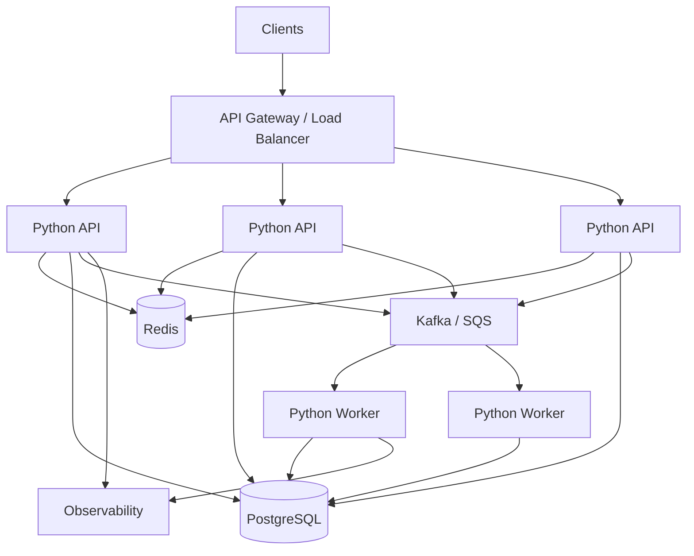

# 21- System Design with Python

## Overview

System design with Python is the application of distributed-systems, backend, data, and infrastructure principles to build reliable services that can handle real production workloads.

Python is primarily the implementation language. The system design determines:

```text
Clients
   ↓
Load Balancer / API Gateway
   ↓
Python Services
   ↓
 ┌───────────────┬───────────────┬───────────────┐
 ↓               ↓               ↓
PostgreSQL      Redis           Kafka / SQS
 ↓               ↓               ↓
Durable State   Cache          Async Processing
```

A strong system-design answer should not begin with Python classes or framework selection. Start with requirements, traffic, data, consistency, failure modes, and scaling constraints.

The central question is:

> How should responsibilities, state, computation, and failure boundaries be distributed across the system?

---

## System Design Process

A practical interview workflow is:

1. Clarify requirements.
2. Estimate scale.
3. Define APIs and major data flows.
4. Identify the source of truth.
5. Design the high-level architecture.
6. Choose storage and communication mechanisms.
7. Design for concurrency and failure.
8. Address scaling and performance.
9. Add security and observability.
10. Discuss trade-offs and alternatives.

Avoid jumping directly to:

```text
"Let's use FastAPI, Redis, Kafka, and Kubernetes."
```

Technology selection should follow requirements.

---

## Functional Requirements

First identify what the system must do.

Example: URL shortener.

Functional requirements:

- create a short URL;
- redirect short URLs;
- optionally track click statistics.

Non-functional requirements:

- low redirect latency;
- high availability;
- durable mappings;
- horizontally scalable reads.

A useful distinction is:

```text
Functional:
What does the system do?

Non-functional:
How well must it do it?
```

---

## Non-Functional Requirements

Important dimensions include:

| Dimension | Example |
|---|---|
| Availability | 99.99% |
| Latency | p99 < 200 ms |
| Throughput | 50k requests/sec |
| Durability | No committed data loss |
| Consistency | Strong for writes |
| Scalability | Horizontal |
| Security | Authenticated access |
| Recovery | RTO < 1 hour |
| Cost | Defined infrastructure budget |

These constraints drive architecture.

---

## Capacity Estimation

Estimate before choosing infrastructure.

Suppose:

```text
100 million requests/day
```

Average requests/sec:

```text
100,000,000 / 86,400 ≈ 1,157 req/s
```

If peak traffic is 5× average:

```text
Peak ≈ 5,785 req/s
```

Also estimate:

- storage growth;
- database operations/sec;
- cache size;
- network bandwidth;
- queue throughput;
- object-storage volume.

Exact numbers are less important than demonstrating the reasoning.

---

## Read-Heavy vs Write-Heavy Systems

Architecture changes significantly based on workload.

### Read-heavy

```text
Client
  ↓
API
  ↓
Redis
  ↓ cache miss
PostgreSQL
```

Use caching, replicas, efficient indexes, and read scaling where appropriate.

### Write-heavy

```text
Client
  ↓
API
  ↓
Queue / Log
  ↓
Workers
  ↓
Database
```

Batching, asynchronous processing, partitioning, and buffering may become more important.

---

## High-Level Architecture

A generic Python backend:



The key property is that application instances are stateless where practical.

---

## Stateless Python Services

A horizontally scalable API should avoid relying on process-local state.

Bad:

```python
sessions = {}
```

With multiple workers:

```text
Request A → Pod 1 → sessions
Request B → Pod 2 → different sessions
```

Instead, store shared state in infrastructure designed for it:

```text
Session
   ↓
Redis / Database
```

Process-local state can still be useful for immutable configuration or opportunistic caches, but it should not hold critical distributed state.

---

## Load Balancing

A load balancer distributes requests across healthy application instances.

```text
                 ┌──► Python Pod A
Client → LB ─────┼──► Python Pod B
                 └──► Python Pod C
```

The application should generally be stateless so any healthy instance can handle the request.

Health checks should distinguish:

- process liveness;
- readiness to serve traffic.

---

## Python Application Architecture

A production Python service can separate:

```text
HTTP Layer
    ↓
Application / Service Layer
    ↓
Domain Logic
    ↓
Repository / Gateway
    ↓
Infrastructure
```

Example:

```text
FastAPI
  ↓
OrderService
  ↓
OrderRepository
  ↓
PostgreSQL
```

This separation improves:

- testability;
- maintainability;
- dependency control;
- replacement of infrastructure components.

Avoid excessive abstraction. A small service does not need ten interfaces for every class.

---

## FastAPI and Django in System Design

Framework choice should follow application requirements.

| Concern | FastAPI | Django |
|---|---|---|
| API-focused service | Strong | Strong |
| Async programming | Strong | Supported |
| Integrated ORM | External ecosystem | Built-in |
| Admin interface | External | Strong |
| Large integrated application | Good | Excellent |
| Minimal API service | Excellent | More comprehensive |
| Existing Django ecosystem | N/A | Strong |

System design should not depend on framework-specific features unless they materially affect the architecture.

---

## API Design

Define the external contract before implementation.

Example:

```http
POST /orders
GET /orders/{order_id}
GET /orders?customer_id=123
POST /orders/{order_id}/cancel
```

Consider:

- resource naming;
- request validation;
- response schema;
- pagination;
- authentication;
- authorization;
- idempotency;
- error contracts;
- versioning.

Example request:

```json
{
  "customer_id": "cust_123",
  "items": [
    {
      "product_id": "prod_456",
      "quantity": 2
    }
  ]
}
```

The API contract should be stable enough for independently deployed clients and services.

---

## Idempotency

Distributed systems frequently retry operations.

```text
Client
  │
  ├── Request A
  │
  └── timeout
       ↓
     Retry
       ↓
    Request B
```

For state-changing operations, use an idempotency key where appropriate:

```http
Idempotency-Key: 8f9c...
```

Persist the key and result in durable storage.

Idempotency is especially important for:

- payments;
- order creation;
- provisioning;
- job submission;
- external side effects.

---

## Database as Source of Truth

Identify which system owns authoritative state.

For example:

```text
PostgreSQL
    ↓
Source of truth for orders

Redis
    ↓
Cache

Kafka
    ↓
Distribution / event transport
```

Do not allow multiple systems to independently become authoritative without an explicit consistency model.

---

## PostgreSQL Design

Use PostgreSQL when the system requires:

- relational modeling;
- transactions;
- constraints;
- joins;
- flexible SQL;
- strong consistency for critical state.

Example:

```sql
CREATE TABLE orders (
    id UUID PRIMARY KEY,
    customer_id UUID NOT NULL,
    status TEXT NOT NULL,
    total_cents BIGINT NOT NULL,
    created_at TIMESTAMPTZ NOT NULL
);
```

Important design decisions include:

- indexes;
- constraints;
- transaction boundaries;
- isolation;
- connection pooling;
- replication;
- partitioning when justified.

---

## Database Indexing

Indexes accelerate selective access patterns but introduce:

- storage overhead;
- write overhead;
- maintenance cost.

Example:

```sql
CREATE INDEX orders_customer_created_idx
ON orders (customer_id, created_at DESC);
```

Index design should follow actual queries.

Do not index every column.

---

## Transactions

Use transactions when multiple changes must preserve an invariant.

```python
async with db.transaction():
    order = await create_order(...)
    await create_order_items(order.id, items)
```

A transaction should generally be:

- short;
- explicit;
- bounded.

Avoid:

```text
BEGIN
 ↓
Database operation
 ↓
External HTTP request
 ↓
Wait
 ↓
Commit
```

Long transactions increase lock duration and connection usage.

---

## Isolation and Concurrency

Consider concurrent requests:

```text
Request A ──┐
            ├── shared state
Request B ──┘
```

Critical invariants should be enforced through:

- database constraints;
- atomic updates;
- transactions;
- row locks;
- appropriate isolation.

Do not assume a Python `Lock` protects data across multiple processes or pods.

---

## Optimistic vs Pessimistic Concurrency

### Optimistic

Assume conflicts are uncommon.

```text
Read version
   ↓
Modify
   ↓
UPDATE ... WHERE version = old_version
```

If no row is updated, another writer changed it.

### Pessimistic

Lock the resource before modifying it.

```text
SELECT ... FOR UPDATE
```

Useful when conflicts are common or serialization is required.

The choice depends on contention and correctness requirements.

---

## Connection Pooling

Creating a new database connection for every request is expensive.

Use a bounded connection pool:

```text
Python workers
      ↓
Connection pool
      ↓
PostgreSQL
```

The pool should be sized based on:

- application concurrency;
- database capacity;
- number of processes/pods;
- query duration.

More connections do not necessarily increase throughput.

---

## N+1 Query Problem

A service may accidentally execute:

```text
1 query
+
N related queries
=
N+1 queries
```

This can dramatically increase latency and database load.

Solutions may include:

- joins;
- eager loading;
- batching;
- prefetching;
- query redesign.

Measure query counts instead of assuming ORM behavior.

---

## Read Replicas

For read-heavy workloads:

```text
                    ┌──► Primary
                    │
Application ────────┤
                    ├──► Replica A
                    └──► Replica B
```

Reads can be distributed across replicas.

However, replication introduces lag:

```text
Write → Primary
          ↓
       Replica
          ↓
       delayed
```

Do not send immediately-after-write consistency-sensitive reads to replicas unless the application can tolerate the lag.

---

## Caching

Caching reduces expensive repeated computation or database access.

```text
Request
  ↓
Redis
 ├── hit → return
 └── miss
       ↓
    PostgreSQL
       ↓
      Redis
```

Define:

- TTL;
- invalidation;
- consistency;
- cache key;
- maximum size;
- failure behavior.

Cache invalidation should be treated as part of the data-consistency design.

---

## Cache Stampede

When a popular key expires:

```text
1000 requests
      ↓
Cache miss
      ↓
1000 database queries
```

Possible mitigations:

- request coalescing;
- locking;
- TTL jitter;
- stale-while-revalidate;
- prewarming.

Do not make Redis a mandatory single point of failure if the application can safely degrade to PostgreSQL.

---

## Queues

Queues decouple producers from consumers.

```text
API
 ↓
SQS / Kafka
 ↓
Workers
```

Advantages:

- burst absorption;
- asynchronous processing;
- independent scaling;
- failure isolation.

Limitations:

- eventual processing;
- duplicate delivery;
- operational complexity;
- ordering considerations.

Queues are particularly useful when work does not need to complete within the HTTP request.

---

## Kafka vs SQS

| Concern | Kafka | SQS |
|---|---|---|
| Durable event log | Strong | No |
| Consumer replay | Strong | Limited |
| Multiple consumer groups | Strong | Different model |
| Simple task queue | Possible | Excellent |
| Ordering | Partition-based | FIFO options |
| Event streaming | Excellent | Not primary purpose |
| Operational complexity | Higher | Lower |

Choose based on communication semantics rather than popularity.

---

## Event-Driven Architecture

Instead of synchronous calls:

```text
Order API
   ↓
Payment
   ↓
Inventory
   ↓
Notification
```

use asynchronous events where appropriate:

```text
Order Service
      ↓
   Event Bus
   ├──► Payment
   ├──► Inventory
   └──► Notification
```

Benefits:

- reduced coupling;
- independent scaling;
- failure isolation.

Trade-offs:

- eventual consistency;
- duplicate events;
- more difficult debugging;
- event schema management.

---

## Transactional Outbox

The dual-write problem occurs when:

```text
DB write ✓
Kafka publish ✗
```

Use an outbox:

```text
Database Transaction
 ├── Business Data
 └── Outbox Event
          ↓
    Publisher
          ↓
        Kafka
```

The business state and event record commit together.

The publisher can safely retry sending the event.

---

## Distributed Transactions

Avoid distributed transactions when simpler patterns work.

Prefer:

- local transactions;
- idempotency;
- transactional outbox;
- sagas;
- compensating actions.

Example:

```text
Order created
    ↓
Payment attempted
    ↓
Payment fails
    ↓
Order cancelled
```

The system models state transitions instead of trying to make every service participate in one global transaction.

---

## Saga Pattern

A saga coordinates a business workflow across services.

```text
Create Order
    ↓
Reserve Inventory
    ↓
Charge Payment
    ↓
Create Shipment
```

If payment fails:

```text
Payment failed
    ↓
Release Inventory
    ↓
Cancel Order
```

Each step has a compensating action where necessary.

Sagas are useful when distributed business workflows cannot use a single database transaction.

---

## Strong vs Eventual Consistency

### Strong consistency

A read after a successful write sees the new value.

Useful for:

- account balances;
- inventory;
- authorization state.

### Eventual consistency

Replicas or consumers converge later.

Useful for:

- analytics;
- search indexes;
- recommendations;
- asynchronous projections.

Do not choose eventual consistency merely for scalability. The business requirement determines whether stale data is acceptable.

---

## Eventual Consistency Example

```text
Order DB
   ↓
Event
   ↓
Search Index
```

Immediately after creating an order:

```text
Database → order exists
Search   → order may not exist yet
```

The API contract should make this behavior explicit where it matters.

---

## Service Boundaries

A microservice should generally own a meaningful business capability.

Example:

```text
Order Service
    ├── orders
    └── order state

Payment Service
    ├── payments
    └── payment state
```

Avoid splitting every database table into a service.

Good boundaries reduce:

- coupling;
- deployment coordination;
- ownership ambiguity.

Bad boundaries increase:

- network calls;
- distributed transactions;
- operational overhead.

---

## Monolith vs Microservices

| Concern | Monolith | Microservices |
|---|---|---|
| Deployment | Simpler initially | Independent |
| Local communication | Easy | Network |
| Transactions | Easier | Distributed |
| Scaling | Coarse-grained | Fine-grained |
| Operations | Lower complexity | Higher |
| Team boundaries | Less explicit | Stronger |
| Failure modes | Fewer network failures | More distributed failures |

A modular monolith can be an excellent starting point.

Microservices should solve organizational or scaling problems rather than serve as an architectural status symbol.

---

## API Gateway

An API gateway can provide:

- routing;
- authentication integration;
- rate limiting;
- TLS termination;
- request transformation;
- observability.

Example:

```text
Internet
   ↓
API Gateway
 ├── Orders
 ├── Users
 └── Payments
```

Do not move all business logic into the gateway.

---

## Rate Limiting

Protect expensive resources:

```text
Client
  ↓
Rate limiter
 ├── allowed → API
 └── rejected → 429
```

Distributed rate limiting can use Redis.

Possible algorithms:

- fixed window;
- sliding window;
- token bucket;
- leaky bucket.

Choose based on fairness, burst behavior, and implementation complexity.

---

## Backpressure

If producers generate work faster than consumers process it:

```text
Producer
   ↓
Queue
   ↓
Consumer
   ↓
Backlog ↑
```

Possible controls:

- bounded queues;
- rate limiting;
- consumer scaling;
- load shedding;
- batching.

Backpressure prevents an overloaded downstream system from causing unbounded resource growth upstream.

---

## Asyncio in System Design

`asyncio` is useful for I/O-bound concurrency.

Example:

```python
async def get_dashboard(
    client: AsyncClient,
) -> Dashboard:
    user, orders, recommendations = await asyncio.gather(
        fetch_user(client),
        fetch_orders(client),
        fetch_recommendations(client),
    )

    return Dashboard(
        user=user,
        orders=orders,
        recommendations=recommendations,
    )
```

Independent I/O can execute concurrently.

But the event loop must not be blocked by synchronous operations.

---

## Asyncio and Bounded Concurrency

Avoid launching unlimited tasks:

```python
await asyncio.gather(
    *(fetch(item) for item in thousands_of_items)
)
```

For large workloads, bound concurrency:

```python
semaphore = asyncio.Semaphore(20)


async def bounded_fetch(item):
    async with semaphore:
        return await fetch(item)
```

Bounded concurrency protects:

- memory;
- sockets;
- downstream services;
- connection pools.

---

## Threads and Processes

Choose based on workload.

| Workload | Typical Python approach |
|---|---|
| I/O-bound blocking library | Threads |
| I/O-bound async library | asyncio |
| CPU-heavy pure Python | Processes / distributed workers |
| Large distributed computation | Distributed processing |
| Durable background work | Celery / SQS / Kafka workers |

The GIL matters for traditional GIL-enabled CPython but is not the only architectural consideration.

Modern CPython also has optional free-threaded builds; production adoption depends on dependency compatibility and workload characteristics.

---

## Background Workers

Move long-running work outside the request path.

```text
HTTP Request
     ↓
Create Job
     ↓
Queue
     ↓
Worker
     ↓
Result
```

Suitable work includes:

- report generation;
- image processing;
- email delivery;
- data ingestion;
- batch processing.

Return an asynchronous job identifier when the client does not need immediate completion.

---

## Object Storage

Use S3-style object storage for large blobs:

```text
API
 ↓
Presigned URL
 ↓
S3
```

Avoid storing large files directly in PostgreSQL unless there is a strong reason.

Object storage provides:

- high durability;
- scalable capacity;
- lifecycle policies;
- inexpensive long-term storage.

The database can store metadata and object references.

---

## Search Systems

If the system requires:

- full-text search;
- relevance ranking;
- fuzzy matching;
- faceting;

a dedicated search system may be appropriate.

Architecture:

```text
PostgreSQL
    ↓
Change Event
    ↓
Search Index
    ↓
Search API
```

The database remains authoritative while the search index becomes a derived projection.

---

## Data Partitioning

Partitioning can distribute data or workload.

Examples:

```text
Kafka
  ├── partition 0
  ├── partition 1
  └── partition 2
```

or:

```text
S3
  ├── year=2026/month=09
  └── year=2026/month=10
```

Partitioning should follow access patterns and distribution.

Poor partition keys can create hotspots.

---

## Sharding

Sharding distributes database data across independent partitions.

```text
Customer ID
    ↓
Shard function
 ┌──┼──┐
 ↓  ↓  ↓
DB1 DB2 DB3
```

Potential benefits:

- larger aggregate capacity;
- horizontal scaling.

Costs:

- cross-shard queries;
- rebalancing;
- operational complexity;
- distributed transactions.

Do not shard prematurely. Exhaust simpler options such as indexing, query optimization, replicas, partitioning, and vertical scaling first.

---

## Hot Keys and Hot Partitions

Suppose one Redis key receives most traffic:

```text
product:popular
       ↓
90% of requests
```

Even a scalable distributed system can develop localized bottlenecks.

Possible solutions:

- local caching;
- replicated cache entries;
- request coalescing;
- key spreading where appropriate.

The solution must preserve correctness.

---

## Distributed Locks

A distributed lock coordinates work across multiple processes or machines.

Potential use cases:

- singleton scheduled job;
- controlled resource mutation;
- duplicate work prevention.

But locks introduce failure modes:

- lock expiry;
- process crashes;
- network partitions;
- stale ownership;
- clock assumptions.

Prefer database constraints or atomic operations when they can express the invariant more simply.

---

## Distributed Lock vs Database Constraint

If the requirement is:

> Only one row with this business identifier may exist.

Prefer:

```sql
UNIQUE (business_id)
```

over:

```text
Acquire distributed lock
 ↓
Check existence
 ↓
Insert
```

The database constraint directly owns the invariant and remains effective across application instances.

---

## Reliability Patterns

Common patterns include:

| Pattern | Purpose |
|---|---|
| Timeout | Bound waiting |
| Retry | Recover transient failures |
| Backoff | Reduce retry pressure |
| Circuit breaker | Stop repeated calls to failing dependency |
| Bulkhead | Isolate resource pools |
| Rate limiting | Protect capacity |
| Backpressure | Control overload |
| Idempotency | Make retries safe |
| DLQ | Isolate repeatedly failing messages |
| Graceful degradation | Preserve core functionality |

These patterns should be applied based on actual failure modes.

---

## Circuit Breaker

A circuit breaker can prevent repeated calls to an unhealthy dependency.

```text
Closed
  ↓ failures
Open
  ↓ cooldown
Half-Open
  ├── success → Closed
  └── failure → Open
```

It is useful when repeatedly calling a failing dependency would consume significant application resources.

A circuit breaker does not replace timeouts or proper retry policies.

---

## Bulkheads

Separate resources for independent workloads:

```text
API Worker Pool
 ├── Checkout
 └── Recommendations
```

If recommendations become slow, they should not consume every worker needed by checkout.

Isolation can also apply to:

- connection pools;
- thread pools;
- queues;
- Kubernetes workloads.

---

## Graceful Degradation

Classify dependencies:

```text
Checkout
 ├── Payment       Critical
 ├── Inventory     Critical
 └── Recommendations Optional
```

If recommendations fail:

```text
Checkout succeeds
Recommendations omitted
```

This prevents optional features from becoming availability dependencies.

---

## Timeouts

Every network dependency should have a bounded timeout.

Without timeouts:

```text
Dependency hangs
    ↓
Python worker waits
    ↓
Concurrency consumed
    ↓
Requests queue
    ↓
System degrades
```

Timeouts should be consistent with the overall request deadline.

---

## Retry Storms

A failing dependency can create:

```text
Dependency failure
      ↓
Timeout
      ↓
Retry
      ↓
More traffic
      ↓
More failure
```

Use:

- bounded retries;
- exponential backoff;
- jitter;
- idempotency;
- circuit breaking where appropriate.

Retries are load multiplication when the dependency is already unhealthy.

---

## Observability Architecture

Production systems should expose:

```text
                    Observability
                         │
        ┌────────────────┼────────────────┐
        ↓                ↓                ↓
      Logs            Metrics           Traces
        │                │                │
        └────────────────┼────────────────┘
                         ↓
                    Dashboards
                         ↓
                       Alerts
```

Useful metrics include:

- request rate;
- error rate;
- p50/p95/p99 latency;
- CPU;
- memory;
- database pool wait;
- queue depth;
- consumer lag;
- cache hit rate;
- downstream errors.

---

## Distributed Tracing

For:

```text
API → Order → Payment → PostgreSQL
```

propagate trace context.

A trace can reveal:

```text
API                  50 ms
Order Service       100 ms
Payment Service    900 ms
Database             20 ms
```

The payment dependency becomes the obvious latency contributor.

Tracing is particularly valuable once a request crosses service boundaries.

---

## Logging Strategy

Use structured logs:

```python
logger.info(
    "order_created",
    extra={
        "order_id": order.id,
        "request_id": request_id,
    },
)
```

Avoid logging:

- credentials;
- tokens;
- passwords;
- sensitive personal data;
- full request bodies without justification.

Logs should support debugging without becoming a security liability.

---

## Security Architecture

A typical request path:

```text
TLS
 ↓
Authentication
 ↓
Authorization
 ↓
Input Validation
 ↓
Business Rules
 ↓
Database
```

Additional controls:

- least-privilege IAM;
- secret management;
- network segmentation;
- encryption at rest;
- rate limiting;
- audit logging;
- dependency security scanning.

Security should be designed into the architecture rather than added after implementation.

---

## Authentication and Authorization

Authentication identifies the caller.

Authorization determines whether the caller can perform an operation.

For a multi-tenant service:

```text
Identity
  ↓
Tenant
  ↓
Resource ownership
  ↓
Permission
```

Do not trust a client-provided tenant ID or role.

Authorization must be enforced server-side.

---

## Multi-Tenant Architecture

Possible models:

| Model | Isolation | Operational complexity |
|---|---|---|
| Shared tables | Lower | Lower |
| Tenant schema | Medium | Medium |
| Database per tenant | High | Higher |

For shared tables, every query must correctly scope tenant data.

Database constraints and authorization logic should reinforce tenant isolation.

---

## Deployment Strategy

A production deployment may use:

```text
Git
 ↓
CI
 ├── Tests
 ├── Type checks
 ├── Security checks
 └── Build
       ↓
Container / Artifact
       ↓
ECR
       ↓
ECS / EKS
       ↓
Rolling deployment
```

Deployment should account for:

- backward compatibility;
- database migrations;
- health checks;
- rollback;
- observability.

---

## Expand-and-Contract Migration

For schema changes:

```text
Expand
  ↓
Deploy compatible code
  ↓
Backfill
  ↓
Switch behavior
  ↓
Contract
```

Example:

```text
Add new column
      ↓
Application writes both
      ↓
Backfill old records
      ↓
Application reads new column
      ↓
Remove old column later
```

This supports rolling deployments where old and new application versions coexist.

---

## High Availability

A highly available architecture avoids unnecessary single points of failure.

```text
Region
 ├── AZ-A
 │    ├── Python instances
 │    └── Supporting resources
 │
 └── AZ-B
      ├── Python instances
      └── Supporting resources
```

For AWS production systems, consider:

- multi-AZ compute;
- managed database failover;
- redundant load balancers;
- replicated storage;
- queue durability;
- dependency failure behavior.

High availability must include the entire dependency chain.

---

## Disaster Recovery

Define:

```text
RPO = maximum acceptable data loss
RTO = maximum acceptable recovery time
```

Example:

```text
RPO = 15 minutes
RTO = 60 minutes
```

The architecture must provide backup, replication, and restoration mechanisms capable of meeting those requirements.

Recovery procedures should be tested rather than documented only.

---

## Cost-Aware System Design

Every architecture has a cost profile.

Major AWS cost drivers can include:

- compute;
- RDS;
- NAT gateways;
- data transfer;
- S3;
- CloudWatch;
- Kafka;
- DynamoDB;
- idle capacity.

Consider workload shape:

```text
Bursty
  → serverless / autoscaling may fit

Steady high utilization
  → provisioned compute may be more economical
```

Cost should be considered alongside latency and reliability, not optimized in isolation.

---

## Performance Engineering

Performance should be analyzed from the outside in:

```text
Client latency
    ↓
Network
    ↓
Load balancer
    ↓
Python application
    ↓
Database / cache
    ↓
External dependencies
```

Measure before optimizing.

Typical bottlenecks include:

- database queries;
- connection pools;
- serialization;
- network calls;
- lock contention;
- event-loop blocking;
- inefficient algorithms.

---

## Python Performance Considerations

Python application performance can be improved through:

- appropriate algorithms;
- efficient data structures;
- avoiding unnecessary allocations;
- batching;
- caching;
- async I/O for suitable workloads;
- native/vectorized libraries;
- profiling.

Do not assume Python code is the bottleneck.

A 10 ms Python function is irrelevant if the request spends 900 ms waiting for PostgreSQL.

---

## Serialization

Serialization can become significant for large APIs.

Potential formats include:

```text
JSON
Protobuf
MessagePack
```

For REST APIs, JSON is common.

For high-throughput internal gRPC communication, Protobuf can provide compact binary serialization and explicit schemas.

Choose based on:

- compatibility;
- payload size;
- latency;
- tooling;
- debugging needs.

---

## REST vs gRPC

| Concern | REST | gRPC |
|---|---|---|
| Browser compatibility | Strong | Limited |
| Human-readable | Strong | Lower |
| Internal service communication | Good | Strong |
| Streaming | Possible | Strong |
| Schema | OpenAPI / JSON schema | Protobuf |
| Binary efficiency | Lower | Strong |
| Public APIs | Common | Less universal |

A hybrid architecture is common:

```text
Internet → REST
Internal services → gRPC / events
```

Do not use gRPC merely because it is faster in benchmarks. Compatibility and operational requirements matter.

---

## Eventual Consistency and Caching

Suppose:

```text
Write → PostgreSQL
      ↓
Cache invalidation
```

There may be a period where:

```text
DB = new value
Cache = old value
```

The system must define whether this temporary inconsistency is acceptable.

For highly sensitive state, bypassing or carefully controlling caches may be preferable.

---

## Disaster Scenario: Database Failure

A resilient service should define:

```text
Database failure
      ↓
Timeout quickly
      ↓
Stop excessive retries
      ↓
Return controlled error / degrade
      ↓
Alert
      ↓
Database recovery
      ↓
Service resumes
```

Avoid allowing database failure to consume all Python workers.

Connection pools, timeouts, circuit breakers, and backpressure can limit blast radius.

---

## Disaster Scenario: Redis Failure

If Redis is only a cache:

```text
Redis failure
   ↓
Cache miss
   ↓
PostgreSQL
```

The system may remain functional with reduced performance.

If Redis contains authoritative session or coordination state, the failure has greater impact.

The architecture should explicitly classify Redis's role.

---

## Disaster Scenario: Kafka Failure

If Kafka becomes unavailable:

```text
Producer
   ↓
Kafka unavailable
```

Options depend on business requirements:

- buffer locally;
- reject writes;
- persist to an outbox;
- degrade optional processing.

Do not silently discard business-critical events.

---

## Disaster Scenario: Worker Failure

Suppose a Celery worker crashes.

A reliable queue architecture should allow work to be retried or recovered.

```text
Queue
 ↓
Worker A
 X
 ↓
Retry / visibility timeout
 ↓
Worker B
```

The task must be designed so repeated execution does not corrupt state or duplicate external side effects.

---

## Disaster Scenario: Traffic Spike

Suppose traffic increases 20×.

Potential flow:

```text
Traffic spike
    ↓
Load balancer
    ↓
Autoscaling
    ↓
Python instances
    ↓
Connection pools
    ↓
Database
```

The critical question is:

> What saturates first?

Possible bottlenecks:

- CPU;
- memory;
- database connections;
- database I/O;
- Redis;
- queue throughput;
- external API quota.

Autoscaling the application does not automatically scale every dependency.

---

## System Design Trade-Offs

Every architectural choice has consequences.

| Decision | Benefit | Cost |
|---|---|---|
| Cache | Lower latency | Staleness/invalidation |
| Queue | Decoupling | Eventual processing |
| Microservice | Independent scaling | Network complexity |
| Replica | Read scaling | Replication lag |
| Sharding | Horizontal data scale | Operational complexity |
| Async | Better I/O concurrency | More complex control flow |
| Serverless | Managed scaling | Execution/runtime constraints |
| Multi-region | Regional resilience | High complexity |

Senior engineers explain both sides.

---

## Common System Design Mistakes

### Starting With Technologies

Bad:

```text
"Use Kubernetes, Kafka, Redis, and microservices."
```

Better:

```text
Requirements
 ↓
Constraints
 ↓
Architecture
 ↓
Technology
```

### Overengineering

Do not introduce:

- Kafka;
- sharding;
- multi-region;
- microservices;

unless requirements justify them.

### Ignoring Failure

A system design without failure handling is incomplete.

Discuss:

- dependency timeout;
- retry;
- duplicate;
- partial failure;
- recovery.

### Ignoring Data Ownership

Every important piece of state should have a clear owner.

### Ignoring Operational Limits

Consider:

- database connections;
- API quotas;
- queue capacity;
- memory;
- CPU;
- network;
- partition limits.

### Assuming AWS Removes Complexity

Managed infrastructure reduces operational work but does not eliminate:

- capacity planning;
- security;
- application failures;
- schema migrations;
- observability;
- recovery.

---

## Interview Traps

| Question | Weak answer | Strong answer |
|---|---|---|
| How do you scale Python? | Add servers | Identify CPU/I/O/state bottleneck |
| Why Redis? | It's fast | Define cache/use-case/consistency |
| Why Kafka? | It's scalable | Need durable event streaming/replay |
| How prevent duplicates? | Use a lock | Idempotency + durable constraint |
| How handle DB failure? | Retry | Timeout + bounded retry + degradation |
| How guarantee exactly once? | Kafka guarantees it | Define end-to-end semantics |
| Why microservices? | Scalability | Domain/team/deployment/scaling requirements |
| Why async? | Faster Python | I/O concurrency and non-blocking dependencies |
| Why shard? | Large database | Demonstrate that simpler scaling is insufficient |
| Why multi-region? | High availability | RTO/RPO/latency/business requirement |

---

## System Design Answer Template

Use this structure during interviews:

```text
1. Requirements
   Functional + non-functional

2. Scale
   Traffic + storage + throughput

3. APIs
   Request/response contracts

4. Data model
   Entities + ownership + indexes

5. High-level architecture
   Clients → services → storage

6. Data flow
   Synchronous + asynchronous paths

7. Scaling
   Stateless services + bottlenecks

8. Reliability
   Timeout + retry + idempotency + recovery

9. Consistency
   Strong vs eventual

10. Security
    Auth + authorization + secrets

11. Observability
    Logs + metrics + traces

12. Deployment
    CI/CD + migrations + rollback

13. Trade-offs
    Why this design and what it costs
```

---

## Production Readiness Checklist

### Requirements

- [ ] Functional requirements defined
- [ ] Traffic estimated
- [ ] Latency target defined
- [ ] Availability target defined
- [ ] RPO/RTO defined

### Application

- [ ] Stateless where practical
- [ ] Explicit service boundaries
- [ ] Validation
- [ ] Authentication
- [ ] Authorization
- [ ] Idempotency
- [ ] Error contracts

### Database

- [ ] Source of truth defined
- [ ] Constraints
- [ ] Indexes
- [ ] Transactions
- [ ] Connection pooling
- [ ] Backup
- [ ] Recovery
- [ ] Migration compatibility

### Distributed Systems

- [ ] Timeouts
- [ ] Bounded retries
- [ ] Backoff and jitter
- [ ] Queues where appropriate
- [ ] Duplicate handling
- [ ] Backpressure
- [ ] Failure isolation
- [ ] Graceful degradation

### Performance

- [ ] Bottlenecks measured
- [ ] Caching strategy
- [ ] Query optimization
- [ ] Bounded concurrency
- [ ] Memory usage controlled
- [ ] Appropriate serialization

### Operations

- [ ] Structured logging
- [ ] Metrics
- [ ] Distributed tracing
- [ ] Alerts
- [ ] Health checks
- [ ] CI/CD
- [ ] Rollback strategy

### Security

- [ ] Least-privilege IAM
- [ ] Secure secret management
- [ ] Encryption
- [ ] Network controls
- [ ] Sensitive-data protection
- [ ] Rate limiting
- [ ] Auditability

---

## Key Takeaways

- **Start with requirements, not technologies:** traffic, latency, consistency, durability, availability, and recovery requirements determine the architecture and technology choices.
- **Make state and ownership explicit:** identify the source of truth, keep Python services stateless where practical, and use PostgreSQL, Redis, queues, and object storage according to their actual responsibilities.
- **Design for distributed failure:** timeouts, bounded retries, idempotency, transactions, backpressure, graceful degradation, and recovery mechanisms are fundamental parts of system design.
- **Scale the complete dependency graph:** adding Python workers or pods can overload databases, caches, queues, or external services; every layer has finite capacity.
- **Senior-level design includes operations and trade-offs:** security, observability, deployment compatibility, cost, high availability, disaster recovery, and explicit architectural trade-offs are as important as the core application design.