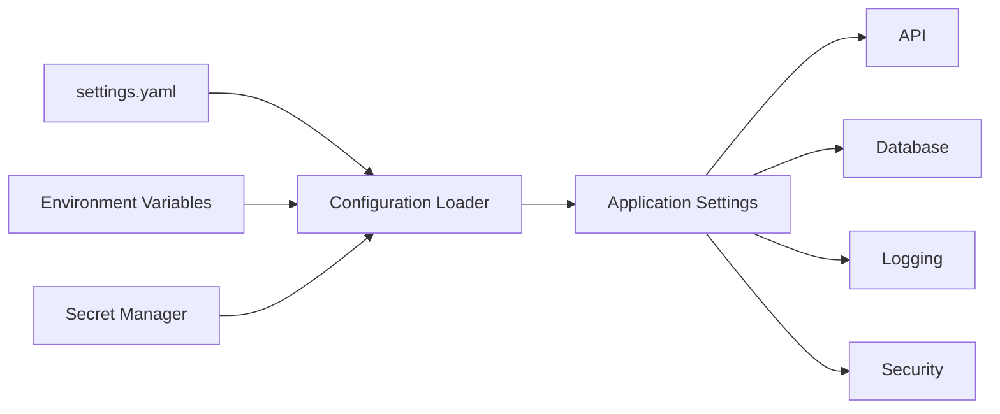
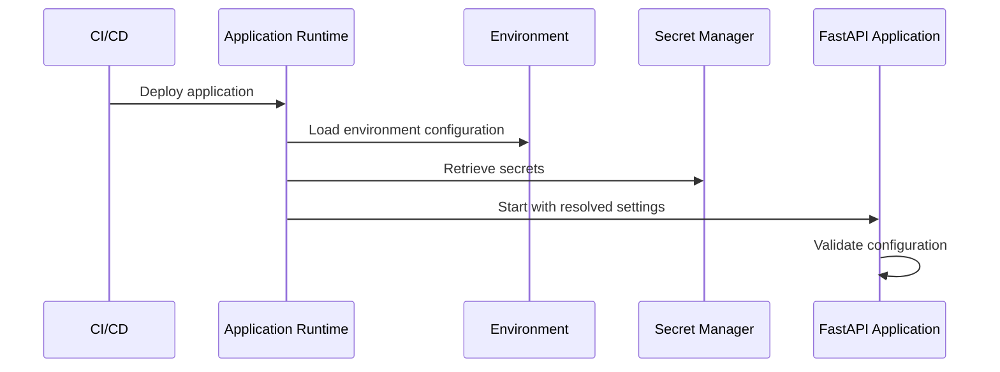

# README

## Overview

The `config` directory contains environment-specific configuration for the REST API service. Configuration is kept separate from application and business logic so runtime behavior can be changed without modifying Python source code.

This directory currently provides `settings.yaml` as a human-readable configuration baseline. Sensitive or deployment-specific values should be supplied through environment variables or a secrets manager rather than committed to source control.

## Configuration Structure

```text
config/
└── settings.yaml
```

The configuration is organized into logical sections:

| Section | Purpose |
|---|---|
| `environment` | Identifies the runtime environment |
| `application` | Host, port, debug behavior, and application identity |
| `database` | Database connection and connection-pool settings |
| `api` | API prefix, version, and documentation endpoints |
| `logging` | Application logging configuration |
| `security` | Authentication and CORS settings |

## Configuration Flow

Configuration should follow a predictable precedence model:



The committed YAML file provides safe defaults and local-development configuration. Environment variables or a secret-management system should override deployment-specific values.

## Environment Configuration

A production service should not rely exclusively on committed configuration files.

Typical deployment-specific values include:

- `DATABASE_URL`
- database pool parameters
- authentication secrets
- allowed CORS origins
- external service credentials
- logging level
- environment name

For example:

```bash
export DATABASE_URL="postgresql+psycopg://app_user:password@db:5432/app"
export DB_POOL_SIZE="20"
export DB_MAX_OVERFLOW="40"
export DB_POOL_TIMEOUT="30"
export DB_POOL_RECYCLE="1800"
```

Secrets should be injected by the deployment platform rather than stored in `settings.yaml`, Git, Docker images, or Kubernetes manifests committed to the repository.

## Development Configuration

The current `settings.yaml` is intended to support local development:

```yaml
environment: development

application:
  name: rest-api-service
  debug: false
  host: 127.0.0.1
  port: 8000
```

Development configuration should remain close to production semantics. For example, keeping `debug` disabled by default helps prevent accidental reliance on development-only behavior.

## Database Configuration

The database configuration defines connection behavior:

```yaml
database:
  url: sqlite:///./app.db
  pool:
    size: 10
    max_overflow: 20
    timeout_seconds: 30
    recycle_seconds: 1800
```

The project currently uses SQLite as its local default while the application is structured to support a production database such as PostgreSQL.

Connection-pool settings matter because every application process can maintain its own pool. In a multi-worker deployment, effective database connection usage can therefore be significantly larger than the configured pool size for one process.

For example:

```text
4 application workers
× 20 pooled connections
= up to ~80 application-side database connections
```

The PostgreSQL connection limit and application concurrency must therefore be designed together.

## API Configuration

API configuration controls routing and interactive documentation:

```yaml
api:
  prefix: /api
  version: v1
  docs:
    enabled: true
    path: /docs
  redoc:
    enabled: true
    path: /redoc
```

A versioned API namespace makes future compatibility management easier. Production deployments may disable interactive API documentation or restrict access to it depending on security requirements.

## Logging Configuration

Logging defaults to an informational level:

```yaml
logging:
  level: INFO
  format: "%(asctime)s %(levelname)s %(name)s %(message)s"
```

Production logging should generally be structured rather than optimized only for human readability. A production application should emit fields such as:

- timestamp
- severity
- service name
- environment
- request ID or trace ID
- logger name
- operation
- error information

Avoid logging passwords, access tokens, authorization headers, database credentials, or other sensitive data.

## Security Configuration

Security-related behavior is explicitly represented in configuration:

```yaml
security:
  authentication:
    enabled: false
  cors:
    enabled: false
    allowed_origins: []
```

Authentication being disabled is appropriate only for the current development stage. A production deployment should require an explicit authentication strategy rather than silently depending on the configuration default.

CORS should use an explicit allowlist. Avoid permissive production configurations such as allowing every origin when authenticated browser clients are involved.

## Configuration Loading

The application should eventually expose configuration through a typed Python settings object rather than reading YAML values throughout the codebase.

A typical pattern with Pydantic Settings is:

```python
from pydantic_settings import BaseSettings, SettingsConfigDict


class Settings(BaseSettings):
    """Application settings loaded from environment variables."""

    environment: str = "development"
    database_url: str = "sqlite:///./app.db"

    model_config = SettingsConfigDict(
        env_file=".env",
        env_file_encoding="utf-8",
        extra="ignore",
    )


settings = Settings()
```

The important design principle is that application code consumes a typed configuration object rather than accessing `os.environ` directly in multiple modules.

## Production Configuration

For production, configuration should be separated into three categories:

| Configuration type | Recommended source |
|---|---|
| Safe application defaults | Source-controlled configuration |
| Environment-specific values | Environment variables |
| Secrets | AWS Secrets Manager, Kubernetes Secrets, or equivalent secret manager |

A typical deployment flow is:



Configuration should be validated during application startup. Invalid configuration should cause the process to fail fast rather than allowing the service to start in a partially functional state.

## Security Considerations

Never commit sensitive values such as:

- database passwords
- JWT signing keys
- API keys
- OAuth client secrets
- private certificates
- cloud credentials

Use IAM roles or workload identity where possible for AWS and Kubernetes workloads instead of embedding long-lived credentials.

For local development, `.env` files may be convenient, but they should be excluded from Git and should never become the production secret-management mechanism.

## Scalability and Reliability

Configuration becomes part of the system's operational design as the service scales.

Important considerations include:

- Database pool size must account for the number of application workers.
- Request timeouts should prevent indefinitely blocked resources.
- Debugging features should not accidentally remain enabled in production.
- CORS origins should be explicitly controlled.
- Logging should support centralized collection and correlation.
- Configuration changes should be reproducible through CI/CD.
- Secrets should be rotated without rebuilding application source code where practical.
- Kubernetes deployments should use ConfigMaps for non-sensitive configuration and Secrets or an external secret manager for sensitive values.

For high-availability deployments, configuration should be consistent across application instances while allowing each environment to provide its own runtime values.

## Common Mistakes

### Hardcoding secrets

Storing credentials directly in `settings.yaml` creates a persistent security risk because configuration files are commonly committed, copied, backed up, and exposed through deployment artifacts.

### Reading environment variables everywhere

Calling `os.getenv()` throughout business logic creates hidden dependencies and makes configuration difficult to validate and test.

Prefer loading configuration once and injecting a typed settings object into components that need it.

### Using development defaults in production

Defaults such as SQLite, disabled authentication, or unrestricted development documentation should never silently become production behavior.

Production configuration should be explicit and validated.

### Ignoring process-level connection multiplication

A pool size of `20` does not necessarily mean the entire service uses only 20 database connections. Four worker processes could potentially create four independent pools.

### Treating configuration as immutable infrastructure data

Some configuration changes may be operationally required without rebuilding the application. Use the deployment platform's configuration and secret-management mechanisms for runtime values while keeping safe defaults in source control.

## Recommended Practices

- Keep configuration schema explicit and typed.
- Separate configuration from business logic.
- Validate required settings during startup.
- Prefer environment variables for deployment-specific configuration.
- Store secrets in a dedicated secret manager.
- Keep local development defaults safe and deterministic.
- Use explicit production configuration rather than relying on development defaults.
- Avoid logging sensitive configuration values.
- Test configuration loading independently.
- Document every non-obvious configuration parameter.
- Keep database pool limits aligned with application worker count and database capacity.
- Treat configuration changes as deployable, reviewable operational changes.

## Key Takeaways

- `config` centralizes runtime behavior and keeps deployment concerns separate from application logic.
- Safe defaults can live in source control, while environment-specific values and secrets should be injected at runtime.
- Database pool configuration must account for every application process, not just one worker.
- Production configuration should be validated at startup and should never silently inherit unsafe development behavior.
- Typed configuration and centralized loading reduce hidden dependencies and make the service easier to test, deploy, and operate.