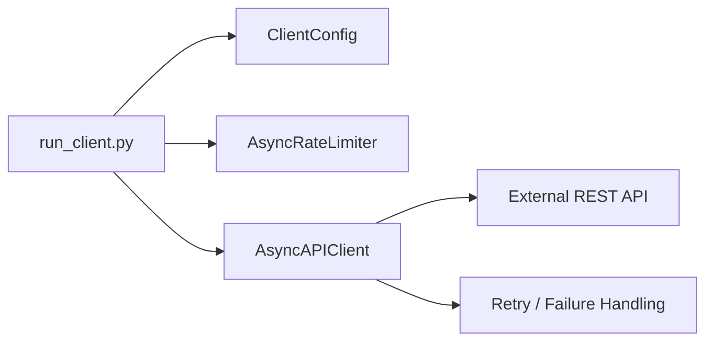
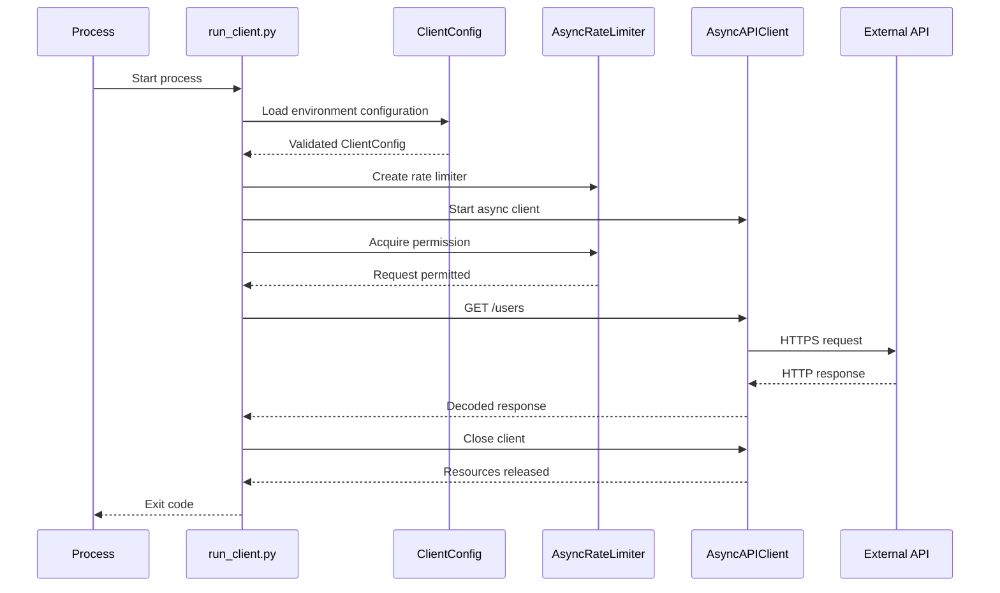

# README

## Overview

The `scripts` directory contains executable entry points for running the Async API Client outside the library and test code.

The primary script is `run_client.py`. It provides a thin operational boundary around the client: loading runtime configuration, initializing the asynchronous client, applying rate limiting, executing an API request, handling expected failures, and returning an appropriate process exit code.

Scripts should remain orchestration-focused. Business logic, HTTP behavior, retry policy, rate limiting, and domain behavior belong in `src/`.

## Directory Structure

```text
scripts/
├── run_client.py
└── README.md
```

The separation keeps executable concerns independent from reusable application components:



## `run_client.py`

`run_client.py` is the operational entry point for executing the client.

Its responsibilities are intentionally limited to:

- Loading configuration from the environment.
- Configuring application logging.
- Creating the API client.
- Creating the rate limiter.
- Running the asynchronous workflow.
- Handling expected application failures.
- Returning meaningful process exit codes.
- Supporting graceful interruption with `KeyboardInterrupt`.

The script should not contain:

- HTTP request implementation.
- Retry algorithms.
- Authentication logic.
- Response parsing rules.
- Domain business logic.
- Persistent state management.
- Complex concurrency orchestration.

Those concerns belong in the corresponding `src/` modules.

## Execution Flow

A typical execution follows this lifecycle:



The important boundary is that `run_client.py` coordinates components rather than implementing them.

## Configuration

The script uses `ClientConfig.from_environment()` rather than embedding operational values in source code.

Typical configuration includes:

| Environment variable | Purpose |
|---|---|
| `API_BASE_URL` | External API base URL |
| `API_TIMEOUT_SECONDS` | Per-request timeout |
| `API_MAX_RETRIES` | Maximum retry count |
| `API_MAX_CONCURRENCY` | Maximum concurrent requests |
| `API_RATE_LIMIT_PER_SECOND` | Local outbound request rate |
| `API_KEY` | Optional API credential |

Example:

```bash
export API_BASE_URL="https://api.example.com"
export API_TIMEOUT_SECONDS="10"
export API_MAX_RETRIES="3"
export API_MAX_CONCURRENCY="10"
export API_RATE_LIMIT_PER_SECOND="10"
export API_KEY="..."
python scripts/run_client.py
```

Credentials should be supplied through environment variables or a production secret-management system such as AWS Secrets Manager, AWS Systems Manager Parameter Store, or Kubernetes Secrets.

Never commit real API credentials to `settings.yaml`, source files, shell scripts, or Git history.

## Error Handling

The script distinguishes configuration and client failures from normal execution.

The intended process-level behavior is:

| Failure | Exit code |
|---|---:|
| Successful execution | `0` |
| API/client failure | `1` |
| Invalid configuration | `2` |
| User interruption | `130` |

This makes the script suitable for shell automation and CI/CD pipelines.

For example:

```bash
python scripts/run_client.py

case $? in
    0) echo "Client completed successfully" ;;
    1) echo "API operation failed" ;;
    2) echo "Configuration is invalid" ;;
    130) echo "Execution interrupted" ;;
esac
```

The script should log operational context without exposing secrets, authorization headers, tokens, or sensitive response payloads.

## Resource Management

The API client is used through an asynchronous context manager:

```python
async with AsyncAPIClient(config) as client:
    ...
```

This ensures the underlying `httpx.AsyncClient` is closed when execution completes or raises an exception.

This matters because an asynchronous HTTP client maintains connection-pool resources. Failing to close it can leave sockets and other resources open longer than necessary.

For short-lived scripts, this is primarily a correctness and resource-lifecycle concern. For long-running services, connection reuse becomes an important performance consideration because repeatedly constructing HTTP clients prevents effective connection pooling.

## Rate Limiting

The script applies the configured `AsyncRateLimiter` before making the API request:

```python
async with rate_limiter:
    response = await client.get("/users")
```

Rate limiting protects the upstream service and helps the client comply with provider quotas.

The current limiter is process-local. Therefore:

- Multiple tasks within one process share its schedule.
- Multiple processes do not share the same limit.
- Multiple containers do not share the same limit.
- Multiple Kubernetes replicas can collectively exceed the upstream quota.

For distributed workloads, rate limiting may need to move to a shared system such as Redis or be enforced through an API gateway.

## Logging

The script configures structured-enough baseline logging for local execution:

```python
logging.basicConfig(
    level=logging.INFO,
    format="%(asctime)s %(levelname)s %(name)s %(message)s",
)
```

Production deployments should generally integrate logging with the platform's centralized logging system.

For example:

- Docker → container stdout/stderr.
- Kubernetes → centralized log aggregation.
- AWS → CloudWatch Logs.
- CI/CD → pipeline logs.

Avoid logging:

- API keys.
- Authorization headers.
- Cookies.
- Personal data.
- Full request bodies unless explicitly safe.
- Full response bodies when they may contain sensitive data.

## Operational Considerations

### Timeouts

Every external API call should have a finite timeout.

Without timeouts, a network operation can remain blocked for an unacceptable amount of time and consume resources while waiting for an unhealthy upstream.

Timeouts should reflect the operation's latency budget rather than being arbitrarily large.

### Retries

Retries should be limited to transient failures.

Typical candidates include:

- Connection failures.
- Timeouts.
- HTTP `408`.
- HTTP `429`.
- Selected `5xx` responses.

Retries must consider idempotency. Automatically retrying a non-idempotent `POST` can create duplicate side effects unless the upstream API supports an idempotency key or equivalent mechanism.

The current client implementation should be treated as a project exercise in retry behavior; production implementations should additionally consider `Retry-After`, jitter, idempotency, and retry budgets.

### Graceful Cancellation

`asyncio.CancelledError` should propagate rather than being swallowed by retry or error-handling code.

This allows:

- CI jobs to terminate cleanly.
- Container shutdown signals to propagate.
- Kubernetes termination to complete predictably.
- Parent tasks to cancel child work.

Cancellation is a control-flow mechanism, not an ordinary application failure.

## Production Deployment

The script can be used as a container entry point when the client is packaged as a batch or scheduled workload.

A typical deployment might look like:

```text
CI/CD or Scheduler
        │
        ▼
Container / Kubernetes Job
        │
        ▼
scripts/run_client.py
        │
        ▼
AsyncAPIClient
        │
        ▼
External API
```

For recurring execution, prefer an external scheduler such as:

- Kubernetes CronJob.
- AWS EventBridge Scheduler.
- CI/CD scheduled workflow.
- An application-level job scheduler when execution state must be managed by the application.

The script should remain stateless unless persistence is explicitly part of the project's requirements.

## Testing

Scripts should have minimal logic so that most behavior can be tested through the underlying modules.

The project's tests are responsible for validating:

- HTTP request behavior.
- Retry behavior.
- Rate limiting.
- Error handling.
- Configuration validation.
- Cancellation behavior.

The script itself primarily requires an integration-level check that configuration and component wiring work correctly.

A useful validation sequence is:

```bash
python -m pytest
python -m ruff check .
python -m mypy .
python scripts/run_client.py
```

The final command should only be executed when a valid API endpoint and credentials are configured.

## Common Mistakes

| Mistake | Why it is problematic | Better approach |
|---|---|---|
| Creating a new HTTP client for every request | Prevents effective connection reuse | Reuse one async client |
| Hardcoding API credentials | Creates a security and rotation problem | Use environment or secret management |
| Omitting request timeouts | Requests can hang indefinitely | Configure bounded timeouts |
| Retrying every exception | Permanent failures waste time and load | Retry only transient failures |
| Retrying non-idempotent operations blindly | Can duplicate side effects | Use idempotency semantics |
| Using `time.sleep()` in async code | Blocks the event loop | Use `await asyncio.sleep()` |
| Treating local rate limits as global | Multiple processes can exceed quotas | Use distributed limiting when required |
| Logging secrets for debugging | Creates credential leakage risk | Redact sensitive fields |
| Putting business logic in scripts | Makes code difficult to reuse and test | Keep scripts thin |

## CI/CD Usage

The script is suitable for automation when its exit code represents execution state.

For example, a CI/CD pipeline can treat a non-zero exit code as a failed job:

```bash
set -e

python scripts/run_client.py
```

For production automation, configuration should be injected by the deployment environment rather than committed into the repository.

Secrets should be provided by the CI/CD secret store or cloud secret-management service.

## Key Takeaways

- `run_client.py` should be a thin orchestration layer over reusable client components.
- Configuration, HTTP behavior, retries, and rate limiting belong in dedicated modules rather than the script.
- External API calls require bounded timeouts, controlled retries, rate limiting, and careful idempotency handling.
- Async resources such as `httpx.AsyncClient` must be closed reliably through an async context manager.
- Process exit codes and safe logging make the script suitable for CI/CD, containers, scheduled jobs, and operational automation.