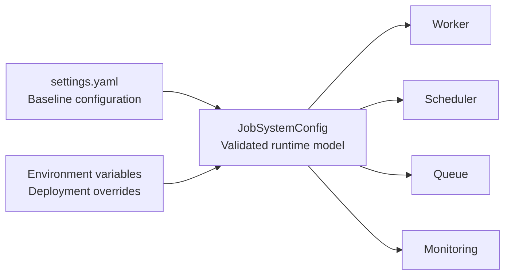
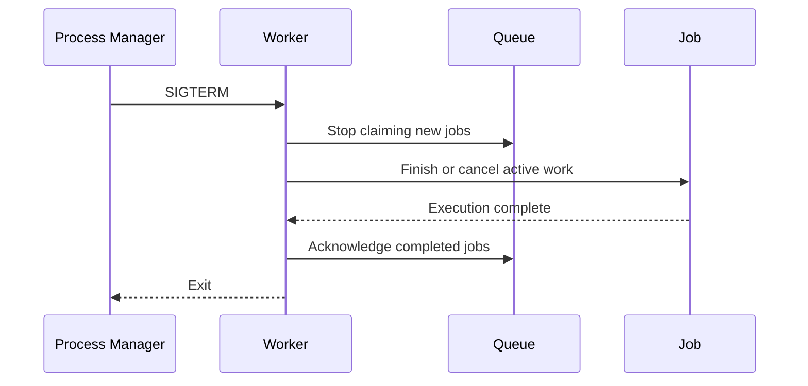

# README

## Overview

The `config` directory contains runtime configuration for the Background Job System. Configuration controls worker concurrency, queue connectivity, retry behavior, visibility timeouts, job execution limits, polling, graceful shutdown, and logging without coupling these concerns to application code.

The project currently uses `settings.yaml` as the human-readable configuration reference, while `src/config.py` provides the runtime configuration model and environment-variable overrides. Keeping configuration separate from business logic makes the worker and scheduler easier to test, deploy, and operate across development, staging, and production environments.

For a production deployment, configuration should be treated as an explicit part of the application's operational contract rather than as a collection of convenient defaults.

## Configuration Files

```text
config/
├── .gitignore
├── pyproject.toml
├── settings.yaml
└── README.md
```

| File | Purpose |
|---|---|
| `settings.yaml` | Human-readable baseline configuration |
| `pyproject.toml` | Python packaging, dependencies, testing, linting, and type-checking configuration |
| `.gitignore` | Prevents local secrets, databases, caches, logs, and build artifacts from being committed |
| `README.md` | Documents the configuration model and operational decisions |

## Configuration Architecture

The intended configuration flow is:



The important boundary is the validated runtime configuration object. Application components should consume typed configuration rather than repeatedly reading environment variables throughout the codebase.

## Runtime Configuration

The main configuration model is defined in `src/config.py` as `JobSystemConfig`.

| Setting | Default | Purpose |
|---|---:|---|
| `environment` | `development` | Identifies the deployment environment |
| `queue_url` | `memory://jobs` | Selects the job queue implementation |
| `worker_concurrency` | `4` | Maximum concurrent worker executions |
| `max_retries` | `3` | Number of retries permitted after the initial attempt |
| `retry_delay_seconds` | `1.0` | Base delay between retry attempts |
| `visibility_timeout_seconds` | `300` | Time a claimed job remains invisible before recovery |
| `poll_interval_seconds` | `1.0` | Delay between queue polling attempts |
| `job_timeout_seconds` | `600` | Maximum expected execution window for a job |
| `shutdown_timeout_seconds` | `30` | Maximum graceful shutdown window |
| `log_level` | `INFO` | Application logging threshold |

The defaults are suitable for local development but should not automatically be considered production values.

## Environment Variables

Runtime configuration is loaded from environment variables by `JobSystemConfig.from_environment()`.

| Environment variable | Configuration |
|---|---|
| `APP_ENVIRONMENT` | `environment` |
| `JOB_QUEUE_URL` | `queue_url` |
| `JOB_WORKER_CONCURRENCY` | `worker_concurrency` |
| `JOB_MAX_RETRIES` | `max_retries` |
| `JOB_RETRY_DELAY_SECONDS` | `retry_delay_seconds` |
| `JOB_VISIBILITY_TIMEOUT_SECONDS` | `visibility_timeout_seconds` |
| `JOB_POLL_INTERVAL_SECONDS` | `poll_interval_seconds` |
| `JOB_TIMEOUT_SECONDS` | `job_timeout_seconds` |
| `JOB_SHUTDOWN_TIMEOUT_SECONDS` | `shutdown_timeout_seconds` |
| `LOG_LEVEL` | `log_level` |

Environment variables are preferred for deployment-specific values because they avoid rebuilding application artifacts for each environment.

Secrets should never be stored directly in `settings.yaml`. Use a secrets manager or workload-provided secret mechanism in production.

## Queue Configuration

`queue_url` identifies the queue backend used by the application.

The development default is:

```yaml
queue_url: memory://jobs
```

An in-memory queue is useful for local development and deterministic tests, but it does not provide durability or cross-process coordination.

A production architecture should use a durable queue such as:

- Amazon SQS
- Redis-backed queues
- RabbitMQ
- Kafka when stream semantics are actually required
- A managed queue exposed by the deployment platform

The queue should provide the durability and delivery guarantees required by the workload rather than simply being selected because it is familiar.

For example, an AWS deployment might conceptually use:

```text
Producer
   │
   ▼
Amazon SQS
   │
   ├── Worker 1
   ├── Worker 2
   └── Worker N
         │
         ▼
     Job Store
```

The worker must assume that delivery can be duplicated unless the selected queue and processing architecture explicitly guarantee otherwise.

## Worker Concurrency

`worker_concurrency` controls how many jobs a worker process may execute concurrently.

Higher concurrency can improve throughput for I/O-bound jobs, but it also increases pressure on downstream systems.

For example:

```text
4 workers × 10 concurrency = up to 40 concurrent job executions
```

This matters when jobs access:

- PostgreSQL connections
- Redis
- external APIs
- filesystem resources
- AWS services
- internal microservices

Concurrency should therefore be sized from downstream capacity rather than CPU count alone.

A useful production constraint is:

```text
effective concurrency
    ≤ downstream connection capacity
```

For a database-backed worker, exceeding the available connection pool can turn increased worker concurrency into connection starvation and latency amplification.

## Retry Configuration

Retries recover from transient failures such as:

- temporary network failures
- service unavailability
- throttling
- temporary database failures
- infrastructure interruptions

`max_retries` should not be interpreted as permission to retry every exception.

Permanent failures such as invalid input, authentication failures, or schema violations should generally fail immediately or follow a separate remediation path.

A production retry policy should use exponential backoff and jitter:

```text
attempt 1 → short delay
attempt 2 → longer delay
attempt 3 → longer delay
...
```

Jitter prevents a large number of workers from retrying simultaneously after a shared outage.

Retries must also be designed around idempotency. A job that sends an email, charges a payment, or mutates another system can produce duplicate side effects if the first attempt succeeds but the worker crashes before acknowledging completion.

## Visibility Timeout

`visibility_timeout_seconds` is relevant when the queue temporarily hides a claimed job from other consumers.

The timeout must be longer than the expected job execution time, with enough margin for normal variance.

A poor configuration creates two common failure modes:

| Configuration | Failure |
|---|---|
| Too short | The same job may become visible while the original worker is still processing it |
| Too long | A crashed worker can delay job redelivery unnecessarily |

For variable-duration jobs, production systems may use visibility-timeout extension or heartbeat mechanisms rather than relying on one static value.

The visibility timeout is not a replacement for idempotency.

## Job Timeout

`job_timeout_seconds` defines the expected upper bound for job execution.

Timeouts protect workers from jobs that become permanently stuck because of:

- downstream requests without deadlines
- deadlocks
- broken integrations
- unexpected infinite loops
- unavailable resources

Every external operation should also have its own timeout. A single global job timeout is not sufficient when a job performs multiple network calls.

For example:

```text
Job timeout:          600s
HTTP connection:        5s
HTTP response:         30s
Database statement:    10s
Redis operation:        2s
```

Timeout budgets should be deliberate and compatible with the overall job deadline.

## Polling Configuration

`poll_interval_seconds` determines how frequently a worker checks for new jobs when the queue has no work.

A very short interval can reduce job-start latency but increase:

- queue API calls
- CPU usage
- network traffic
- infrastructure cost

A long interval reduces polling overhead but increases latency.

Durable queue implementations should prefer long polling or blocking consumption when supported rather than repeatedly issuing empty requests.

## Graceful Shutdown

`shutdown_timeout_seconds` gives workers a bounded window to stop accepting new work and finish in-flight jobs.

A robust shutdown sequence is:



The worker should stop claiming new work before waiting for active jobs.

The timeout should be finite. A worker that waits forever during shutdown can prevent deployments, autoscaling, or node replacement from completing.

Jobs that cannot safely finish should be made recoverable through queue visibility semantics or explicit failure handling.

## Logging

`log_level` controls application logging.

Production workers should generally emit structured logs containing fields such as:

- job ID
- job type
- attempt number
- worker ID
- execution duration
- status
- error type
- queue name
- correlation or trace ID

Avoid logging sensitive job payloads indiscriminately. Background jobs frequently contain credentials, customer information, tokens, or other sensitive data.

Prefer:

```text
job_id=... job_type=send_email attempt=2 duration_ms=184 status=failed
```

over dumping the complete job payload into logs.

## Security Considerations

Configuration is part of the application's security boundary.

### Secrets

Do not commit:

- API keys
- database passwords
- access tokens
- private certificates
- cloud credentials
- encryption keys

Use environment injection, AWS Secrets Manager, AWS Systems Manager Parameter Store, Kubernetes Secrets, or an equivalent secret-management mechanism.

### Queue Access

Production queue credentials should follow least privilege.

A worker typically needs permission to:

- receive jobs
- extend visibility when supported
- acknowledge/delete successful jobs
- publish failures to the appropriate dead-letter mechanism

It should not automatically receive administrative permissions over the entire queue infrastructure.

### Configuration Validation

Configuration should fail fast when invalid values are supplied.

Examples include:

```text
worker_concurrency <= 0
visibility_timeout <= 0
job_timeout <= 0
negative retry count
empty queue URL
```

Failing during startup is safer than allowing an incorrectly configured worker to process production jobs.

## Scalability Considerations

Background systems scale primarily by adding consumers, but worker scaling must respect downstream capacity.

A typical production scaling model is:

```text
Queue depth
    │
    ▼
Autoscaling policy
    │
    ▼
Worker replicas
    │
    ├── PostgreSQL
    ├── Redis
    ├── External APIs
    └── AWS services
```

Useful scaling signals include:

- queue depth
- oldest queued job age
- jobs processed per second
- job execution latency
- failure rate
- retry rate
- worker utilization

Queue depth alone is insufficient. A queue can be small while jobs are taking significantly longer to process.

For Kubernetes, worker replicas and per-process concurrency should be tuned together. For AWS, queue depth and message age can drive worker scaling policies.

## Reliability Considerations

A durable background-job system should explicitly define:

| Concern | Recommended approach |
|---|---|
| Duplicate delivery | Idempotent job handlers |
| Temporary failure | Bounded retries with backoff |
| Permanent failure | Dead-letter handling |
| Worker crash | Queue redelivery |
| Long-running jobs | Visibility extension or heartbeat |
| Shutdown | Graceful drain with timeout |
| Lost state | Durable job store |
| Dependency failure | Timeouts and circuit-breaking where appropriate |
| Poison messages | Retry limit and DLQ |
| Recovery | Operational replay procedures |

The job store should be the authoritative source for job state when durable tracking is required. Queue state and application state should not be assumed to be identical.

## Configuration and Deployment

### Local Development

Local development can use:

```text
environment = development
queue_url = memory://jobs
worker_concurrency = 4
max_retries = 3
```

This keeps the project easy to run without requiring external infrastructure.

### Production

Production should normally override environment-specific settings through the deployment platform:

```text
APP_ENVIRONMENT=production
JOB_QUEUE_URL=<durable-queue>
JOB_WORKER_CONCURRENCY=<capacity-derived-value>
JOB_MAX_RETRIES=3
JOB_VISIBILITY_TIMEOUT_SECONDS=<job-duration-budget>
JOB_TIMEOUT_SECONDS=<maximum-job-duration>
JOB_SHUTDOWN_TIMEOUT_SECONDS=30
LOG_LEVEL=INFO
```

Configuration values should be version-controlled where they are non-sensitive and environment-specific secrets should remain outside source control.

## Testing Configuration

Configuration behavior should be tested independently from job execution.

Important test cases include:

- default values
- valid environment overrides
- invalid integer values
- invalid floating-point values
- negative retry counts
- zero worker concurrency
- invalid visibility timeout
- missing required production configuration
- normalized log levels

Tests should avoid depending on the developer's actual environment. Use isolated environment fixtures or explicit configuration objects.

## Common Mistakes

### Hardcoding Production Configuration

Hardcoding queue URLs, credentials, or concurrency values makes deployments inflexible and encourages configuration drift.

Use typed configuration with explicit environment overrides.

### Treating YAML as the Runtime Source of Truth

A YAML file can document defaults, but production configuration should have a clearly defined loading and precedence model.

Do not allow different components to independently parse configuration files and environment variables.

### Retrying Permanent Failures

Retrying invalid jobs wastes worker capacity and increases queue latency.

Classify failures before defining retry behavior.

### Setting Visibility Timeout Too Low

If a job remains invisible for only a few seconds while execution can take minutes, duplicate execution becomes likely.

Set visibility based on measured execution duration and use extension mechanisms for long-running work.

### Unlimited Concurrency

Increasing concurrency without considering downstream systems can cause:

- database connection exhaustion
- API throttling
- memory pressure
- CPU saturation
- increased failure rates

Scale based on end-to-end capacity.

### Logging Secrets

Job payloads can contain credentials or private customer data.

Use structured, allow-listed fields rather than serializing entire payloads.

## Operational Checklist

Before deploying a worker system, verify:

- [ ] Queue configuration points to a durable production backend.
- [ ] Secrets are supplied through a secret-management mechanism.
- [ ] Worker concurrency matches downstream capacity.
- [ ] Every external dependency has a timeout.
- [ ] Retryable and permanent failures are distinguished.
- [ ] Retries use bounded backoff and jitter.
- [ ] Job handlers are idempotent.
- [ ] Visibility timeout exceeds normal execution duration.
- [ ] Long-running jobs can extend visibility when necessary.
- [ ] Dead-letter handling is configured.
- [ ] Graceful shutdown is bounded.
- [ ] Queue depth and job age are monitored.
- [ ] Job latency and failure rate are measurable.
- [ ] Logs include job identifiers and attempt information.
- [ ] Sensitive payload data is excluded from logs.
- [ ] Configuration validation fails fast during startup.
- [ ] Recovery and replay procedures are documented.
- [ ] Backups and durable job-state recovery have been tested where applicable.

## Key Takeaways

- Treat configuration as a typed runtime contract, not scattered environment-variable reads.
- Size concurrency, timeouts, visibility windows, and retries from measured workload and downstream capacity.
- Durable queues, idempotent handlers, bounded retries, and dead-letter handling are core reliability mechanisms.
- Never place secrets in committed configuration files or log complete job payloads.
- Production configuration should support safe deployment, observability, graceful shutdown, and operational recovery.