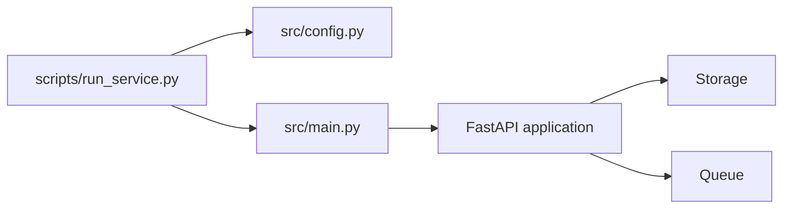
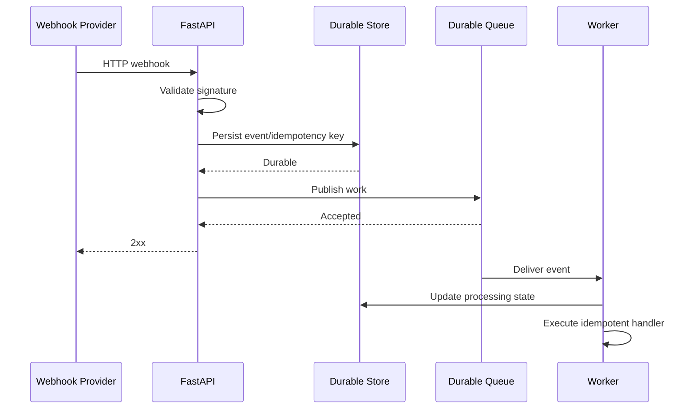

# scripts/README.md

## Overview

The `scripts` directory contains operational entry points for running the Webhook Processing Service outside the application module itself.

These scripts provide a controlled interface for local development, testing, and deployment-oriented execution. They should remain thin orchestration layers: configuration belongs in application configuration, business logic belongs in `src/`, and infrastructure behavior belongs behind explicit interfaces.

The primary service launcher is `run_service.py`.

## Directory Structure

```text
scripts/
├── README.md
├── run_service.py
└── ...
```

The separation provides a simple execution boundary:



## Service Runner

`run_service.py` is the command-line entry point for starting the ASGI application.

It is responsible for:

- Loading environment-based service configuration.
- Parsing command-line overrides.
- Configuring process-level logging.
- Validating runtime arguments.
- Starting Uvicorn.
- Selecting the configured host and port.
- Controlling worker-process count.
- Enabling development reload when explicitly requested.

It should not contain:

- Webhook validation logic.
- Event persistence logic.
- Queue publishing logic.
- Business handlers.
- Retry policies.
- Database queries.
- Application-specific domain rules.

Those responsibilities belong to the application layers under `src/`.

## Running the Service

From the project root:

```bash
python scripts/run_service.py
```

The default configuration uses the values defined by `WebhookServiceConfig`.

### Development Reload

For local development:

```bash
python scripts/run_service.py --reload
```

Reload mode is intended for development only. It watches application files and restarts the process when changes are detected.

It should not be enabled in production because process restarts introduce unnecessary operational behavior and conflict with production process-management strategies.

### Custom Host and Port

```bash
python scripts/run_service.py \
    --host 0.0.0.0 \
    --port 8080
```

Binding to `0.0.0.0` exposes the service on all network interfaces available to the container or host. This is common inside Docker, where the container port is exposed through the runtime or load balancer.

### Multiple Workers

```bash
python scripts/run_service.py --workers 4
```

Multiple Uvicorn workers create separate OS processes. Each process has its own:

- Python interpreter state.
- Memory space.
- Event loop.
- In-memory storage.
- In-memory queues.
- Global variables.

This distinction is critical for this project.

An in-memory queue or event store is therefore **not shared between workers**. A production deployment must use shared durable infrastructure such as PostgreSQL and a real queue.

For example:

```text
                    Load Balancer
                         |
             +-----------+-----------+
             |           |           |
          Worker 1    Worker 2    Worker 3
             |           |           |
             +-----------+-----------+
                         |
              Shared PostgreSQL / Queue
```

## Configuration Precedence

The runner supports command-line overrides while the application configuration is primarily environment-driven.

A practical precedence model is:

| Setting | Highest Priority | Lower Priority |
|---|---|---|
| Host | CLI `--host` | `WEBHOOK_HOST` |
| Port | CLI `--port` | `WEBHOOK_PORT` |
| Log level | CLI `--log-level` | `LOG_LEVEL` |
| Workers | CLI `--workers` | Deployment/runtime default |
| Reload | CLI `--reload` | Disabled by default |

Secrets should never be supplied through source code or committed configuration files.

For example:

```bash
export WEBHOOK_SECRET="replace-with-secret"
export WEBHOOK_HOST="0.0.0.0"
export WEBHOOK_PORT="8000"

python scripts/run_service.py
```

In Docker or Kubernetes, inject secrets through the platform's secret-management mechanism rather than baking them into the image.

## Production Execution

For production, process management should normally be handled by the container platform or service manager.

A container-oriented deployment can use:

```bash
python scripts/run_service.py --host 0.0.0.0 --port 8000 --workers 4
```

A Kubernetes deployment would typically run the service in a container and let Kubernetes manage:

- Process restarts.
- Replica count.
- Health probes.
- Resource limits.
- Rolling deployments.
- Service discovery.
- Horizontal scaling.

The application should remain stateless at the process level.

### Container Considerations

A production container should:

- Run as a non-root user.
- Receive configuration through environment variables or mounted configuration.
- Write logs to stdout/stderr.
- Avoid persistent local state.
- Avoid relying on process-local queues for durable work.
- Use explicit CPU and memory limits.
- Handle `SIGTERM` correctly for graceful shutdown.

A typical container command can be:

```dockerfile
CMD ["python", "scripts/run_service.py", "--host", "0.0.0.0", "--port", "8000"]
```

The exact worker strategy should be determined by the deployment architecture and workload characteristics rather than blindly maximizing worker count.

## Graceful Shutdown

Webhook processing systems must distinguish between stopping HTTP traffic and terminating in-flight work.

A graceful shutdown should allow the application to:

1. Stop accepting new work.
2. Finish or safely hand off in-flight requests.
3. Stop consuming new queue messages.
4. Complete bounded cleanup operations.
5. Close storage connections.
6. Exit within the configured shutdown timeout.

This prevents deployments from unnecessarily losing work.

For Kubernetes, the shutdown sequence should be coordinated with:

- Readiness probes.
- Pod termination grace periods.
- Application shutdown hooks.
- Queue visibility/lease semantics.

The service must not assume that receiving `SIGTERM` means all outstanding work can complete indefinitely.

## Logging

The runner configures process-wide logging using the configured log level.

Production logging should provide enough context to diagnose webhook failures without exposing sensitive payloads.

Useful structured fields include:

- Event ID.
- Event type.
- Request ID.
- Processing attempt.
- Processing duration.
- Result status.
- Failure category.
- Queue operation.
- Storage operation.

Avoid logging:

- Webhook signing secrets.
- Authorization credentials.
- Full sensitive payloads.
- Personal data unless explicitly required.
- Raw authentication headers.

Prefer correlation identifiers over dumping entire requests into logs.

## Operational Usage

Useful commands include:

| Command | Purpose |
|---|---|
| `python scripts/run_service.py` | Start using application defaults |
| `python scripts/run_service.py --reload` | Development auto-reload |
| `python scripts/run_service.py --host 0.0.0.0` | Bind all interfaces |
| `python scripts/run_service.py --port 8080` | Override service port |
| `python scripts/run_service.py --workers 4` | Start multiple worker processes |
| `python scripts/run_service.py --log-level DEBUG` | Enable verbose development logging |

Arguments should be explicit in deployment manifests rather than depending on undocumented shell behavior.

## Testing the Runner

The runner should be tested at the argument and orchestration boundaries rather than by starting a real production server in every test.

Useful tests include:

- Default configuration resolution.
- CLI host override.
- CLI port override.
- CLI log-level override.
- Worker validation.
- Port validation.
- Reload/worker compatibility.
- Invalid configuration handling.
- Uvicorn invocation arguments.

The application itself should have separate API, service, storage, queue, and handler tests.

This keeps failures localized and prevents integration tests from becoming the only verification mechanism.

## Reliability Considerations

The runner is deliberately thin because operational correctness depends on the layers it starts.

For a production webhook service, the critical durability boundary should look like:



A successful HTTP response should not imply that asynchronous work is durable unless the required persistence and queueing guarantees have actually been established.

If persistence and queue publication cannot be made atomic, a transactional outbox pattern is preferable to simply writing to a database and then hoping queue publication succeeds.

## Security Considerations

Operational scripts are part of the deployment attack surface.

Follow these practices:

- Never hard-code webhook secrets.
- Never commit `.env` files containing credentials.
- Avoid secrets in command history where possible.
- Use environment injection or a secret manager.
- Run containers as non-root.
- Restrict exposed network interfaces through infrastructure configuration.
- Keep development reload disabled in production.
- Avoid DEBUG logging in production.
- Validate configuration at startup.
- Fail closed when required security configuration is missing.

For AWS deployments, use IAM roles and managed secret mechanisms instead of embedding long-lived credentials in deployment scripts.

## Scalability Considerations

Scaling the service horizontally is safe only when state that affects correctness is externalized.

| Component | Process-local | Production approach |
|---|---:|---|
| Event store | Yes | PostgreSQL or equivalent |
| Queue | Yes | SQS, Kafka, Redis-backed queue, or equivalent |
| Idempotency state | Yes | Durable database/Redis with appropriate consistency |
| Logs | No | Centralized logging |
| Metrics | Ideally no | Centralized metrics backend |
| Configuration | No | Environment/configuration management |
| Secrets | No | Secret manager |

Increasing Uvicorn worker count does not increase the capacity of an in-memory queue or event store across processes.

For high-volume webhook traffic, scale independently:

- HTTP ingestion replicas for request throughput.
- Queue consumers for processing throughput.
- Database capacity for persistence.
- Queue capacity for buffering.
- Downstream services according to their limits.

## Common Mistakes

### Putting Business Logic in the Script

The runner should not become a second application entry point containing business logic.

Keep it responsible for process startup and configuration only.

### Using In-Memory State in Production

In-memory queues and stores are useful for tests and local development but disappear when the process restarts and are not shared between workers.

Use durable shared infrastructure for production.

### Running Development Reload in Production

Reload mode is a development convenience. Production environments should use controlled deployment and process-management mechanisms.

### Exposing Secrets Through CLI Arguments

Command-line arguments may become visible through process inspection or operational tooling.

Prefer environment variables, mounted secret files, or dedicated secret-management systems.

### Treating HTTP 202 as Guaranteed Processing

Returning `202 Accepted` before durable persistence or queue publication can result in lost events.

The acceptance response must correspond to the service's actual durability contract.

### Overprovisioning Workers

More workers are not automatically faster. Each worker consumes memory and can increase database connections and downstream concurrency.

Worker count should be derived from:

- CPU capacity.
- Request workload.
- I/O behavior.
- Database connection limits.
- Queue throughput.
- Downstream service limits.
- Memory constraints.

## Interview Traps

**Does increasing Uvicorn workers share Python memory?**

No. Worker processes have separate memory spaces.

**Can an in-memory queue provide durable webhook processing?**

No. Process crashes, restarts, and worker isolation can lose queued work.

**Why should the launcher remain thin?**

Because process startup is an operational concern. Business logic belongs in independently testable application services and handlers.

**Why is graceful shutdown important for webhooks?**

Because terminating a process while work is in flight can cause lost or duplicated processing unless the system has explicit delivery and retry semantics.

**Why isn't a successful `202` automatically proof that processing will happen?**

Because HTTP acceptance and durable asynchronous processing are separate guarantees. The system must establish the required persistence and queue durability before acknowledging the provider.

## Key Takeaways

- `run_service.py` should remain a thin operational entry point that configures and starts the ASGI application.
- In-memory queues and storage are suitable for development and tests, not durable multi-worker production deployments.
- Production configuration should come from secure environment or secret-management mechanisms, with CLI arguments limited to deliberate runtime overrides.
- Horizontal scaling requires shared durable state, controlled concurrency, graceful shutdown, and explicit webhook delivery guarantees.
- A `2xx` response should only represent an acceptance boundary that the service can actually guarantee.