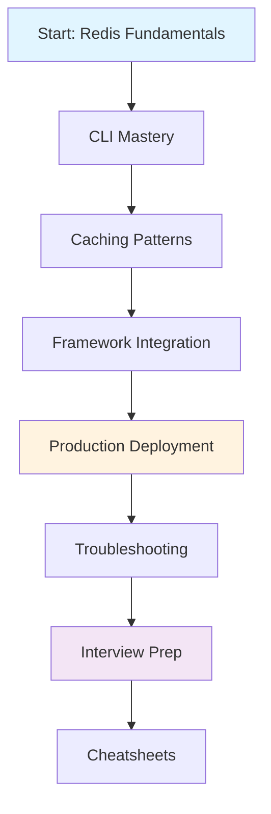

# Redis Backend Engineering Playbook

> **A comprehensive, production-focused Redis knowledge base for senior backend engineers.**

This is not a tutorial. This is a **professional playbook** combining Redis fundamentals, production architecture, framework integration, troubleshooting guides, and interview preparation—designed for backend engineers who need to understand Redis at a systems-level depth.

---

## 📊 Repository Overview

| Component | Content | Files | Level |
|-----------|---------|-------|-------|
| **Concepts** | Architecture, data structures, persistence, replication, clustering | 24 docs | Beginner → Advanced |
| **CLI** | Command mastery, server administration, debugging | 15 docs | Beginner → Intermediate |
| **Caching** | Patterns, strategies, consistency, hot-key handling | 14 docs | Intermediate → Advanced |
| **Integration** | Django/FastAPI implementations, Celery, async patterns | 11 docs | Intermediate → Advanced |
| **Production** | Deployment, scaling, monitoring, performance tuning | 9 docs | Advanced |
| **Troubleshooting** | Incident response, debugging, failure scenarios | 14 docs | Advanced |
| **Interview** | Technical questions, system design, coding challenges | 12 docs | All Levels |
| **Cheatsheets** | Quick reference guides | 7 docs | All Levels |
| **Sample Projects** | Complete FastAPI + Django implementations | 2 projects | Intermediate |

**Total**: 100+ comprehensive documents + 2 production-ready projects

---

## 🎯 Who This Is For

### Primary Audience
- **Backend Engineers** seeking Redis production expertise
- **Senior Developers** architecting distributed systems
- **DevOps/SRE** managing Redis infrastructure
- **System Architects** designing cache layers
- **Interview Candidates** preparing for senior roles

### What Makes This Different
- **Production-First**: Real-world patterns, not toy examples
- **Senior-Level**: Explains *why* and *when*, not just *how*
- **Complete**: Theory + implementation + operations + troubleshooting
- **Code-Heavy**: Actual working projects with 3,500+ lines of production code

---

## 🗺️ Navigation Guide

### 📚 Core Learning Path




---

### 🔍 Quick Access by Role

#### For Backend Engineers
1. [`concepts/`](./concepts/) → Understand Redis architecture
2. [`caching/`](./caching/) → Master caching patterns
3. [`Django-FastAPI integration/`](./Django-FastAPI%20integration/) → Framework integration
4. [`sample projects/`](./sample%20projects/) → Study production implementations

#### For DevOps/SRE
1. [`production/`](./production/) → Deployment strategies
2. [`troubleshooting/`](./troubleshooting/) → Incident response
3. [`cli/`](./cli/) → Command-line operations
4. [`cheatsheets/`](./cheatsheets/) → Quick references

#### For Interview Prep
1. [`interview/`](./interview/) → Technical questions
2. [`cheatsheets/`](./cheatsheets/) → Quick revision
3. [`concepts/`](./concepts/) → Deep understanding
4. [`sample projects/`](./sample%20projects/) → Hands-on practice

---

## 📁 Detailed Directory Structure

### 1. [`concepts/`](./concepts/) - Redis Fundamentals to Advanced

**Path**: `concepts/01- Fundamentals/` (12 files)
- Introduction to Redis
- Architecture & Internals
- Installation & Setup
- Data Structures: Strings, Lists, Sets, Sorted Sets, Hashes, Streams
- Redis JSON, Search, TimeSeries

**Path**: `concepts/02- Data persistence/` (7 files)
- Expiration & TTL strategies
- Persistence (RDB vs AOF)
- Replication architecture
- Transactions & ACID properties
- Pipelining for performance
- Pub/Sub messaging
- Distributed locking patterns

**Path**: `concepts/03- Scaling/` (5 files)
- Redis Sentinel (high availability)
- Redis Cluster (horizontal scaling)
- Sharding strategies
- Memory management & eviction policies
- Security best practices

**💡 Start Here**: If you're new to Redis or need foundational knowledge

---

### 2. [`cli/`](./cli/) - Command-Line Mastery

14 comprehensive guides covering every Redis command category:

- **Administration**: Basics, server commands, configuration
- **Data Operations**: Keys, strings, lists, sets, sorted sets, hashes
- **Advanced**: Streams, transactions, Pub/Sub, TTL management
- **Debugging**: INFO, MONITOR, SLOWLOG, CLIENT commands

**Use Case**: Daily operations, debugging, manual testing

---

### 3. [`caching/`](./caching/) - Production Caching Patterns


**Core Patterns** (6 docs):
- Cache-Aside (Lazy Loading)
- Read-Through Cache
- Write-Through Cache
- Write-Behind (Write-Back) Cache
- Refresh-Ahead Cache
- Eviction strategies (LRU, LFU, TTL)

**Production Challenges** (5 docs):
- Cache Stampede (thundering herd)
- Cache Avalanche
- Cache Penetration
- Cache Consistency
- Hot-Key problem

**Applied Concepts** (3 docs):
- Rate limiting implementations
- Real-world caching architectures
- Performance optimization

**💡 Critical Reading**: Every pattern includes trade-offs, failure modes, and when NOT to use it

---

### 4. [`Django-FastAPI integration/`](./Django-FastAPI%20integration/) - Framework Integration

**Django** (3 docs):
- Django Cache Framework
- Session storage with Redis
- Common integration mistakes

**FastAPI** (4 docs):
- Async Redis clients
- Response caching middleware
- Dependency injection patterns
- Production configuration

**Shared** (4 docs):
- Celery + Redis (distributed task queue)
- Connection pooling strategies
- Background task processing
- Production-grade configurations

**Code Examples**: Python code throughout, production-ready patterns

---

### 5. [`production/`](./production/) - Operating Redis at Scale

**Deployment** (3 docs):
- Production deployment checklist
- High availability architectures
- Scaling strategies (vertical vs horizontal)

**Operations** (3 docs):
- Monitoring & observability
- Performance tuning & optimization
- Backup & disaster recovery

**Platform-Specific** (3 docs):
- Redis on Kubernetes
- Redis on AWS (ElastiCache)
- Benchmarking & capacity planning

**💡 Battle-Tested**: Includes lessons from production incidents and scaling challenges

---

### 6. [`troubleshooting/`](./troubleshooting/) - Incident Response Guide

**Connection Issues** (3 docs):
- Redis won't start
- Connection refused errors
- Authentication failures

**Performance** (4 docs):
- High latency debugging
- Memory issues (OOM)
- Slow commands identification
- Performance degradation

**Replication & Clustering** (3 docs):
- Replication failures
- Sentinel issues
- Cluster problems

**Platform Issues** (4 docs):
- Persistence failures
- Docker/Kubernetes debugging
- AWS ElastiCache troubleshooting
- Production incident playbook

**Format**: Problem → Diagnosis → Solution → Prevention

---

### 7. [`interview/`](./interview/) - Technical Interview Preparation

**Fundamentals** (4 docs):
- Redis basics & architecture
- Data structures deep dive
- Caching concepts
- Persistence & replication

**System Design** (3 docs):
- Distributed cache design
- Rate limiter design
- Session store design
- Real-time leaderboard

**Coding** (2 docs):
- Implementation questions
- Algorithm problems using Redis

**Company-Specific** (3 docs):
- FAANG-style questions
- Startup interview patterns
- Senior backend role questions

**Includes**: 100+ questions with detailed answers and trade-off analysis

---

### 8. [`cheatsheets/`](./cheatsheets/) - Quick Reference Guides

7 comprehensive cheat sheets:
- **CLI Commands**: All Redis commands organized by category
- **Data Structures**: When to use each structure + complexity
- **Performance**: Optimization techniques & benchmarks
- **Production**: Deployment checklist & monitoring
- **Interview**: Most asked questions + answers
- **System Design**: Common patterns & architectures
- **Command Reference**: Quick syntax lookup

**Format**: Scannable, printable, bookmark-worthy

---

### 9. [`sample projects/`](./sample%20projects/) - Production Code

#### 🚀 [`fastapi-redis-lab/`](./sample%20projects/fastapi-redis-lab/)

**A complete, runnable FastAPI application demonstrating 12 Redis patterns**

**What's Included**:
- 3,500+ lines of production-quality Python code
- 25+ REST API endpoints
- 12 Redis integration patterns implemented
- 8 Celery background tasks
- Complete test suite
- One-click setup script
- 4,000+ lines of documentation

**Redis Patterns Implemented**:
1. Response caching (Cache-Aside)
2. Shopping cart (Redis Hash)
3. OTP authentication (String + TTL)
4. Rate limiting (INCR + EXPIRE)
5. View counter (Atomic increment)
6. Leaderboard (Sorted Set)
7. Pub/Sub messaging
8. Event sourcing (Streams)
9. Distributed locking (SET NX EX)
10. Background tasks (Celery)
11. Unique visitors (HyperLogLog)
12. Daily active users (Bitmap)

**Tech Stack**: FastAPI, SQLAlchemy 2.x, Pydantic v2, redis-py async, Celery

**Setup Time**: 5 minutes → working application

**Documentation**:
- `README.md` - Complete guide (650 lines)
- `QUICKSTART.md` - 5-minute setup
- `REDIS_PATTERNS.md` - Pattern explanations (850 lines)
- `PROJECT_SUMMARY.md` - Architecture overview
- `FILE_MANIFEST.md` - Code walkthrough

**Use Cases**:
- Study production-grade Redis integration
- Reference implementation for your projects
- Interview preparation with working code
- Learn FastAPI + Redis best practices

---

#### 🔷 [`django-redis-lab/`](./sample%20projects/django-redis-lab/)


**Django-specific Redis integration**

**Features**:
- Django Cache Framework integration
- Session storage with Redis
- Celery task queue
- Redis-backed rate limiting
- Query result caching
- Template fragment caching

**Coming Soon**: Full implementation guide

---

## 🎓 Learning Paths

### Path 1: Redis Beginner (2-3 weeks)

```
Week 1: Fundamentals
├─ concepts/01- Fundamentals/ (all files)
├─ cli/01- Redis CLI Basics.md
└─ cli/02- Keys Commands.md

Week 2: Data Structures
├─ cli/03-08 (String, List, Set, Sorted Set, Hash commands)
├─ concepts/01- Fundamentals/04-09 (Data structure docs)
└─ caching/01- Caching Fundamentals.md

Week 3: Basic Integration
├─ Django-FastAPI integration/01- Redis with Django.md
├─ Django-FastAPI integration/04- Redis with FastAPI.md
└─ sample projects/fastapi-redis-lab/ (explore code)
```

---

### Path 2: Production Engineer (3-4 weeks)

```
Week 1: Advanced Concepts
├─ concepts/02- Data persistence/ (all files)
├─ concepts/03- Scaling/ (all files)
└─ caching/08-12 (Stampede, Avalanche, Penetration, Consistency, Hot Keys)

Week 2: Integration Deep Dive
├─ Django-FastAPI integration/ (all files)
├─ sample projects/fastapi-redis-lab/ (implement features)
└─ Build your own project with Redis

Week 3: Production Operations
├─ production/ (all files)
├─ troubleshooting/11- Performance Troubleshooting.md
└─ Experiment with Redis Cluster

Week 4: Troubleshooting & Optimization
├─ troubleshooting/ (all files)
└─ Simulate and fix production issues
```

---

### Path 3: Interview Preparation (1-2 weeks)

```
Week 1: Knowledge Consolidation
├─ interview/01-06 (Fundamentals through Performance)
├─ cheatsheets/ (all files - memorize)
└─ Review sample projects/ (explain architecture)

Week 2: Practice & System Design
├─ interview/07-10 (System Design & Senior Questions)
├─ interview/11- Coding Questions.md (solve all)
└─ Mock interviews using interview/12- Company-Wise Questions.md
```

---

## 💼 Real-World Applications

### Use Cases Covered

| Scenario | Redis Pattern | Location |
|----------|---------------|----------|
| API Rate Limiting | INCR + EXPIRE | `caching/13-` |
| Session Management | Hash + TTL | `Django-FastAPI integration/03-` |
| Real-time Leaderboard | Sorted Set | `sample projects/fastapi-redis-lab/` |
| Shopping Cart | Hash | `sample projects/fastapi-redis-lab/` |
| Cache Layer | Cache-Aside | `caching/02-` |
| Message Queue | List + BLPOP | `concepts/01-/05-` |
| Pub/Sub Notifications | Pub/Sub | `cli/10-` |
| Distributed Lock | SET NX EX | `sample projects/fastapi-redis-lab/` |
| Analytics | HyperLogLog, Bitmap | `sample projects/fastapi-redis-lab/` |
| Event Sourcing | Streams | `cli/08-`, `sample projects/` |

---

## ⚡ Quick Start

### For Learners
```bash
# 1. Start with concepts
cd concepts/01-\ Fundamentals/
cat 01-\ Introduction.md

# 2. Practice CLI commands
redis-cli
# Follow cli/ guides

# 3. Study caching patterns
cd caching/
cat 01-\ Caching\ Fundamentals.md
```

### For Builders
```bash
# Clone and run FastAPI Redis Lab
cd "sample projects/fastapi-redis-lab"
./setup.bat  # Windows
# or
python -m venv venv && source venv/bin/activate  # Linux/Mac
pip install -r requirements.txt
python seed_data.py seed
uvicorn app.main:app --reload

# Visit: http://localhost:8000/docs
```

### For Interviewers
```bash
# Quick revision path
cd cheatsheets/
cat 05-\ Redis\ Interview\ Cheat\ Sheet.md

cd ../interview/
cat 10-\ Senior\ Backend\ Interview\ Questions.md
```

---

## 🛠️ Prerequisites

### Required
- **Redis Server** (6.0+) - [Installation Guide](./concepts/01-%20Fundamentals/03-%20Installing%20Redis.md)
- **Basic Linux** - Command line comfort
- **Networking** - TCP/IP, client-server model
- **Programming** - Any language (Python examples provided)

### Recommended
- **Python 3.12+** - For sample projects
- **Docker** - For local experimentation
- **SQL Knowledge** - Database fundamentals
- **Backend Experience** - API development

---

## 📊 Repository Statistics

```
Total Documents:     100+
Lines of Content:    50,000+
Code Examples:       500+
Production Code:     7,000+ lines (2 projects)
CLI Commands:        200+
Interview Questions: 150+
Cheat Sheets:        7
Diagrams:            50+
```

---

## 🏆 What You'll Master

### Technical Skills
- ✅ Redis internals & architecture
- ✅ All 8 data structures (advanced usage)
- ✅ Caching strategies & invalidation
- ✅ Persistence mechanisms (RDB/AOF)
- ✅ Replication & high availability
- ✅ Redis Cluster & Sentinel
- ✅ Performance optimization
- ✅ Memory management
- ✅ Security best practices

### Engineering Skills
- ✅ System design with Redis
- ✅ Distributed systems patterns
- ✅ Production troubleshooting
- ✅ Incident response
- ✅ Capacity planning
- ✅ Monitoring & observability

### Framework Skills
- ✅ Django + Redis integration
- ✅ FastAPI + Redis async patterns
- ✅ Celery distributed tasks
- ✅ Connection pooling
- ✅ Production configurations

---

## 🎯 When to Use This Repository

### Daily Development
- **Reference**: Look up command syntax in `cli/`
- **Patterns**: Check `caching/` for implementation patterns
- **Debug**: Use `troubleshooting/` for production issues
- **Quick Answers**: Check `cheatsheets/`

### Learning Journey
- **Systematic Study**: Follow learning paths
- **Hands-On**: Build with `sample projects/`
- **Deep Dive**: Read `concepts/` thoroughly
- **Practice**: Implement patterns in your apps

### Interview Preparation
- **Theory**: Review `interview/` questions
- **Cheat Sheets**: Memorize `cheatsheets/`
- **Practice**: Explain `sample projects/` code
- **System Design**: Study architecture patterns

### Production Operations
- **Deployment**: Follow `production/` guides
- **Monitoring**: Set up observability
- **Troubleshooting**: Incident response playbooks
- **Optimization**: Performance tuning

---

## 📖 Documentation Standards

All documents follow a consistent structure:

### Conceptual Docs
```
1. Overview
2. How It Works
3. Use Cases
4. Best Practices
5. Common Pitfalls
6. Production Considerations
7. Examples
8. Further Reading
```

### Troubleshooting Docs
```
1. Problem Description
2. Symptoms
3. Diagnosis Steps
4. Solution
5. Prevention
6. Related Issues
```

### Code Examples
- **Type-Safe**: Type hints throughout
- **Production-Ready**: Error handling, logging
- **Documented**: Docstrings and comments
- **Tested**: With test suites

---

## 🔗 External Resources

### Official Documentation
- [Redis Official Docs](https://redis.io/docs/)
- [Redis Commands Reference](https://redis.io/commands/)
- [Redis University](https://university.redis.com/)

### Tools & Libraries
- [redis-py](https://github.com/redis/redis-py) - Python client
- [django-redis](https://github.com/jazzband/django-redis) - Django integration
- [FastAPI](https://fastapi.tiangolo.com/) - Modern Python web framework
- [Celery](https://docs.celeryq.dev/) - Distributed task queue

### Monitoring & Management
- [Redis Insight](https://redis.io/insight/) - GUI management tool
- [RedisInsight](https://redis.com/redis-enterprise/redis-insight/) - Desktop GUI
- [redis-cli](https://redis.io/docs/ui/cli/) - Command-line interface

---

## 🚀 Advanced Topics Covered

### Architecture Patterns
- **Cache-Aside** vs **Read-Through** vs **Write-Through**
- **Cache Stampede** mitigation (probabilistic early expiration)
- **Hot-Key** problem solutions (client-side caching, replication)
- **Multi-level caching** (L1/L2 cache hierarchies)

### Distributed Systems
- **CAP theorem** implications for Redis
- **Eventual consistency** in replication
- **Split-brain** scenarios in Sentinel
- **Data partitioning** strategies in Cluster

### Performance Engineering
- **Memory optimization** (encoding, compression)
- **Network optimization** (pipelining, connection pooling)
- **Latency analysis** (SLOWLOG, latency monitoring)
- **Throughput tuning** (benchmarking, profiling)

### Security
- **Authentication** (ACL, passwords)
- **Encryption** (TLS/SSL)
- **Network isolation** (bind addresses, protected mode)
- **Command restrictions** (rename dangerous commands)

---

## 🎨 Visual Learning

Throughout the repository, you'll find:

### Architecture Diagrams
```
┌─────────────┐
│   Client    │
└──────┬──────┘
       │
       ▼
┌─────────────┐     ┌─────────────┐
│    Redis    │────▶│  Database   │
│   (Cache)   │     │ (Primary)   │
└─────────────┘     └─────────────┘
```

### Data Flow Diagrams
- Request/response patterns
- Replication topology
- Cluster data distribution
- Sentinel failover process

### Performance Graphs
- Latency characteristics
- Memory usage patterns
- Throughput benchmarks
- Eviction policy comparisons

---

## 🧪 Hands-On Exercises

### Beginner Exercises
1. Install Redis and run basic commands
2. Implement a simple cache-aside pattern
3. Build a rate limiter using INCR
4. Create a session store with Hashes
5. Experiment with TTL and expiration

### Intermediate Exercises
1. Implement all 6 caching patterns
2. Build a real-time leaderboard with Sorted Sets
3. Create a job queue using Lists
4. Implement Pub/Sub for real-time notifications
5. Handle cache stampede scenarios

### Advanced Exercises
1. Set up Redis Sentinel for HA
2. Deploy a Redis Cluster
3. Implement distributed locking (Redlock)
4. Optimize memory usage
5. Simulate and resolve production incidents

### Project Ideas
1. **URL Shortener** - Caching + counters
2. **Chat Application** - Pub/Sub + Streams
3. **E-commerce Cart** - Hashes + TTL
4. **Analytics Dashboard** - HyperLogLog + Bitmaps
5. **Rate-Limited API** - Token bucket algorithm

---

## 🏅 Certification & Learning Goals

### Knowledge Checkpoints

After each section, verify you can:

**After Concepts/**
- [ ] Explain Redis architecture and single-threaded model
- [ ] Choose appropriate data structures for use cases
- [ ] Understand persistence trade-offs (RDB vs AOF)
- [ ] Configure replication topology
- [ ] Explain Sentinel and Cluster differences

**After CLI/**
- [ ] Execute commands without documentation
- [ ] Debug using INFO, MONITOR, SLOWLOG
- [ ] Understand command time complexity
- [ ] Use transactions and pipelines correctly
- [ ] Manage memory and eviction policies

**After Caching/**
- [ ] Implement all 6 caching patterns
- [ ] Prevent cache stampede, avalanche, penetration
- [ ] Handle hot-key problems
- [ ] Design cache invalidation strategies
- [ ] Calculate cache hit ratios and cost savings

**After Integration/**
- [ ] Integrate Redis with Django and FastAPI
- [ ] Implement async Redis operations
- [ ] Configure Celery with Redis broker
- [ ] Manage connection pools efficiently
- [ ] Deploy production configurations

**After Production/**
- [ ] Deploy Redis with high availability
- [ ] Monitor Redis metrics
- [ ] Tune performance for workload
- [ ] Implement backup strategies
- [ ] Scale Redis horizontally

**After Troubleshooting/**
- [ ] Diagnose connection issues
- [ ] Resolve memory problems
- [ ] Fix replication lag
- [ ] Debug slow commands
- [ ] Respond to production incidents

---

## 🎓 Career Impact

### Skills for Senior Roles

This repository prepares you for:

**Senior Backend Engineer**
- Architecting cache layers
- Designing distributed systems
- Performance optimization
- Making technology decisions

**Staff Engineer / Architect**
- System design with Redis at scale
- Trade-off analysis (consistency vs availability)
- Cross-service caching strategies
- Infrastructure planning

**DevOps / SRE**
- Redis operations and maintenance
- Incident response and troubleshooting
- Performance tuning and optimization
- Infrastructure automation

**Technical Interviewer**
- Deep Redis knowledge for candidate evaluation
- System design interview skills
- Code review expertise

---

## 📈 Progression Tracking

### Beginner → Intermediate
**Timeframe**: 2-3 weeks
- ✅ Complete `concepts/01- Fundamentals/`
- ✅ Master `cli/` basic commands
- ✅ Build 3 simple projects using Redis
- ✅ Understand caching fundamentals

### Intermediate → Advanced
**Timeframe**: 3-4 weeks
- ✅ Complete `concepts/02-` and `03-`
- ✅ Implement all caching patterns
- ✅ Deploy Redis Cluster
- ✅ Handle production scenarios

### Advanced → Expert
**Timeframe**: Ongoing
- ✅ Contribute to production Redis infrastructure
- ✅ Solve complex distributed systems problems
- ✅ Mentor others on Redis best practices
- ✅ Design systems with Redis as core component
- ✅ Publish technical content about Redis

---

## 🤝 Contributing

This is a living playbook. Contributions welcome:

### How to Contribute
1. **Fix Errors** - Typos, outdated information
2. **Add Examples** - Real-world scenarios
3. **Share Experiences** - Production lessons learned
4. **Improve Docs** - Clarity, structure, diagrams
5. **New Topics** - Emerging Redis features

### Contribution Guidelines
- Maintain senior-level technical depth
- Include production considerations
- Provide working code examples
- Follow existing documentation structure
- Add references to official docs

---

## 📞 Support & Community

### Questions?
1. **Documentation Issues** - Check existing docs thoroughly
2. **Redis Concepts** - Review `concepts/` section
3. **Code Problems** - Study `sample projects/` implementations
4. **Production Issues** - Consult `troubleshooting/`

### Additional Resources
- **Redis Community** - [redis.io/community](https://redis.io/community/)
- **Stack Overflow** - [redis tag](https://stackoverflow.com/questions/tagged/redis)
- **Redis Discord** - Official community server
- **GitHub Discussions** - Redis repository

---

## 🗓️ Maintenance & Updates

### Update Frequency
- **Concepts** - Updated for major Redis versions
- **Integration** - Framework version updates
- **Production** - Best practices evolution
- **Interview** - Current market trends
- **Sample Projects** - Dependency updates

### Version Compatibility
- **Redis** - 6.0+ (7.0+ recommended)
- **Python** - 3.12+
- **Django** - 4.x, 5.x
- **FastAPI** - 0.100+

---

## 📊 Success Metrics

Track your progress:

### Knowledge Metrics
- [ ] Can explain Redis to non-technical stakeholders
- [ ] Can design cache architecture for new projects
- [ ] Can troubleshoot production issues independently
- [ ] Can mentor junior developers on Redis

### Practical Metrics
- [ ] Built 5+ projects using Redis
- [ ] Contributed to production Redis infrastructure
- [ ] Resolved production incidents
- [ ] Passed Redis-related interviews

### Mastery Indicators
- [ ] Write technical blog posts about Redis
- [ ] Give internal tech talks on Redis patterns
- [ ] Review Redis-related PRs confidently
- [ ] Architect systems with Redis as core component

---

## 🎯 Final Goal

**Transform from Redis user to Redis expert**

You'll know you've succeeded when:
1. You instinctively choose the right Redis pattern for any use case
2. You can architect scalable systems with Redis
3. You understand trade-offs deeply (not just "best practices")
4. You can debug production issues efficiently
5. You confidently discuss Redis in senior interviews
6. You contribute to technical decisions involving Redis

---

## 📚 Repository Philosophy

### Why This Approach?

**Production-First**: Learn how Redis works in real systems, not isolated tutorials

**Trade-Off Analysis**: Understand *when* and *why* to use patterns, not just *how*

**Complete Coverage**: From basics to advanced, theory to practice, code to operations

**Senior-Level Depth**: Explanations go beyond surface level to system implications

**Hands-On**: Working code you can run, modify, and learn from

**Interview-Ready**: Preparation for technical discussions and system design

---

## 🔥 Quick Win Checklist

Start here for immediate value:

**Day 1** (2 hours)
- [ ] Read `concepts/01- Fundamentals/01- Introduction.md`
- [ ] Install Redis locally
- [ ] Run 20 commands from `cli/01- Redis CLI Basics.md`
- [ ] Understand 5 data structures

**Week 1** (10 hours)
- [ ] Complete `concepts/01- Fundamentals/` (all docs)
- [ ] Master `cli/` commands for 3 data structures
- [ ] Implement cache-aside pattern in your project
- [ ] Read `caching/02- Cache Aside Pattern.md`

**Month 1** (40 hours)
- [ ] Complete `concepts/`, `cli/`, `caching/` sections
- [ ] Run `sample projects/fastapi-redis-lab/`
- [ ] Integrate Redis into your Django/FastAPI app
- [ ] Implement 3 caching patterns
- [ ] Read `production/` deployment guides

**Quarter 1** (120 hours)
- [ ] Complete entire repository
- [ ] Build 3 Redis-backed projects
- [ ] Deploy Redis to production (or staging)
- [ ] Review `interview/` and `cheatsheets/`
- [ ] Ready for senior backend interviews

---

## 🌟 Star Projects in This Repo

### Must-Explore Content

**📁 Best Documentation**
1. `caching/08- Cache Stampede.md` - Critical production pattern
2. `troubleshooting/14- Production Incident Playbook.md` - Battle-tested
3. `interview/10- Senior Backend Interview Questions.md` - High value
4. `production/05- Performance Tuning & Optimization.md` - Immediate impact

**💻 Must-Study Code**
1. `sample projects/fastapi-redis-lab/` - Complete implementation
2. `sample projects/fastapi-redis-lab/app/redis_client.py` - Helper functions
3. `sample projects/fastapi-redis-lab/app/services.py` - Service layer patterns
4. `sample projects/fastapi-redis-lab/REDIS_PATTERNS.md` - Pattern explanations

**📋 Best Cheatsheets**
1. `cheatsheets/05- Redis Interview Cheat Sheet.md` - Interview gold
2. `cheatsheets/06- Redis System Design Cheat Sheet.md` - Architecture patterns
3. `cheatsheets/03- Redis Performance Cheat Sheet.md` - Optimization quick wins

---

## 🎉 Getting Started NOW

### Option 1: The Explorer
```bash
# Browse documentation first
cd concepts/01-\ Fundamentals/
```
cat 01-\ Introduction.md
# Then systematically go through all sections
```

### Option 2: The Builder
```bash
# Jump into code immediately
cd "sample projects/fastapi-redis-lab"
./setup.bat  # or follow manual setup
# Study working code and modify it
```

### Option 3: The Interviewer
```bash
# Focus on interview preparation
cd interview/
cat 01-\ Redis\ Interview\ Questions\ -\ Fundamentals.md
cd ../cheatsheets/
cat 05-\ Redis\ Interview\ Cheat\ Sheet.md
```

### Option 4: The Operator
```bash
# Production-focused path
cd production/
cat 01-\ Production\ Deployment.md
cd ../troubleshooting/
cat 14-\ Production\ Incident\ Playbook.md
```

---

## 📖 Recommended Reading Order

### Linear Path (Comprehensive)
```
1. concepts/01- Fundamentals/01- Introduction.md
2. concepts/01- Fundamentals/02- Redis Architecture.md
3. concepts/01- Fundamentals/03- Installing Redis.md
4. cli/01- Redis CLI Basics.md
5. (Continue through each section systematically)
```

### Topic-Based Path (Flexible)
```
Pick what you need:
- Need caching? → caching/
- Building app? → Django-FastAPI integration/ + sample projects/
- Production issue? → troubleshooting/
- Interview prep? → interview/ + cheatsheets/
```

---

## 💎 Unique Features of This Repository


### What Sets This Apart

1. **Production Code**: 7,000+ lines of working Python code, not snippets
2. **Complete Projects**: Runnable applications with 25+ endpoints
3. **Senior Focus**: Explains WHY, trade-offs, failure modes
4. **Battle-Tested**: Patterns from real production systems
5. **Interview-Ready**: 150+ questions with detailed answers
6. **Framework-Specific**: Deep Django and FastAPI integration
7. **Troubleshooting**: Actual incident response playbooks
8. **Progressive**: Beginner-friendly with advanced depth

### Not Just Theory
- ✅ Every pattern has working code
- ✅ Every concept has CLI examples
- ✅ Every problem has solutions
- ✅ Every question has answers

---

## 🔒 License & Usage

### Educational Use
- ✅ Free for personal learning
- ✅ Free for educational institutions
- ✅ Free for corporate training
- ✅ Share with attribution

### Commercial Use
- ✅ Use in your projects
- ✅ Reference in documentation
- ✅ Integrate patterns in products
- ✅ Credit appreciated but not required

---

## 📬 Feedback & Improvement

### Help Make This Better

**Found an error?** - Submit corrections
**Have suggestions?** - Share improvement ideas
**Built something cool?** - Share your Redis projects
**Got questions?** - Ask in discussions

---

## 🎊 Acknowledgments

### Built With Love For

- Backend engineers seeking production expertise
- Developers preparing for senior roles
- Teams deploying Redis at scale
- Students learning distributed systems

### Technology Stack
- **Redis** - The amazing in-memory data store
- **Python** - django, FastAPI, Celery, redis-py
- **Markdown** - For documentation
- **Love** - For the craft of backend engineering

---

## 🚀 Start Your Journey

**Ready to become a Redis expert?**

```bash
# 1. Clone/navigate to this repository
cd D:\backend-engineering-playbook\Redis

# 2. Choose your path:

# For learners:
cd concepts/01-\ Fundamentals/
start 01-\ Introduction.md

# For builders:
cd "sample projects/fastapi-redis-lab"
./setup.bat

# For interviewers:
cd interview/
start 01-\ Redis\ Interview\ Questions\ -\ Fundamentals.md

# For operators:
cd production/
start 01-\ Production\ Deployment.md
```

---

## 📈 Repository Stats

```
📦 Repository Size:        ~50MB
📄 Total Documents:        100+
💻 Lines of Content:       50,000+
🐍 Production Code:        7,000+ lines
📝 Code Examples:          500+
❓ Interview Questions:    150+
📋 Cheat Sheets:           7
🎯 Redis Patterns:         12
🏗️ Sample Projects:        2
⭐ Production-Ready:       ✅
```

---

## 🎓 Final Words

Redis is not just a cache. It's a powerful tool for building scalable, performant backend systems.

This repository gives you:
- **Knowledge** to understand Redis deeply
- **Skills** to use it effectively
- **Experience** through production code
- **Confidence** for senior roles

**Start learning. Start building. Start mastering Redis.** 🚀

---

## 📌 Quick Links Summary

| Category | Link | Description |
|----------|------|-------------|
| **Learning** | [`concepts/`](./concepts/) | Start here - fundamentals to advanced |
| **Practice** | [`cli/`](./cli/) | Master command-line operations |
| **Patterns** | [`caching/`](./caching/) | Production caching strategies |
| **Integration** | [`Django-FastAPI integration/`](./Django-FastAPI%20integration/) | Framework-specific guides |
| **Production** | [`production/`](./production/) | Deploy and scale Redis |
| **Debugging** | [`troubleshooting/`](./troubleshooting/) | Incident response |
| **Interview** | [`interview/`](./interview/) | Technical preparation |
| **Reference** | [`cheatsheets/`](./cheatsheets/) | Quick lookup guides |
| **Code** | [`sample projects/`](./sample%20projects/) | Working applications |

---

## 🏁 Next Steps

1. **Bookmark this README** for quick reference
2. **Choose your learning path** from above
3. **Install Redis** if you haven't already
4. **Start with concepts/** or **jump into sample projects/**
5. **Practice daily** - consistency beats intensity
6. **Build projects** - apply what you learn
7. **Share knowledge** - teach others

---

**Welcome to the Redis Backend Engineering Playbook.** 

**Your journey to Redis mastery starts now.** ⚡

---

*Last Updated: 2024*  
*Redis Version: 6.0+ (7.0+ recommended)*  
*Maintained with ❤️ for the backend engineering community*
