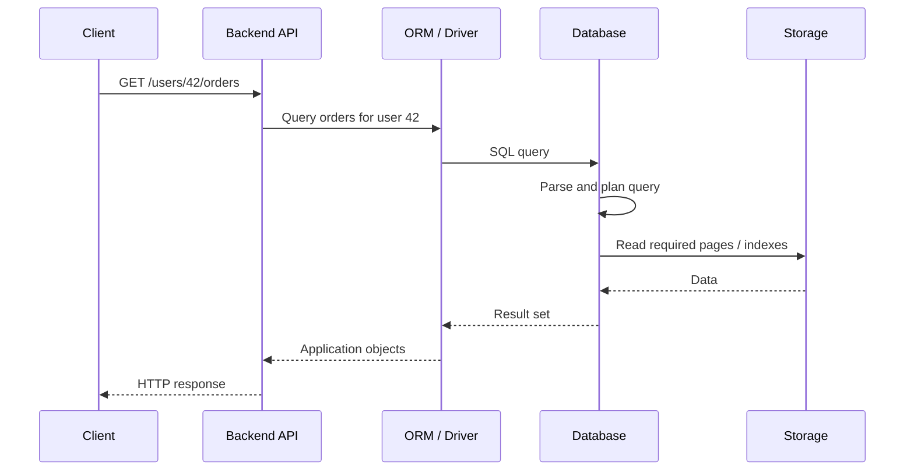

Based on the structure you've been building, I would distribute the folders into **clear learning/engineering domains**, rather than treating every course section as a top-level folder.

The uploaded material already supports a substantial `Transactions and Concurrency`, `Constraints`, `Data Types`, `Database Design`, `Indexes`, `Partitioning`, and `Query Execution and Optimization` layer. 

Pasted text

My recommended distribution is:

```
```
SQL/
    01- Query Fundamentals/
        01- SELECT and Filtering/
        02- Sorting Pagination and Result Control/
        03- SQL Operators/
        04- Aggregate Functions/
        05- String Functions/
        06- Date and Time/
        07- NULL Handling/
        README.md

    02- Query Logic and Transformation/
        01- CASE WHEN/
        02- Type Casting and Conversion/
        03- Set Operators/
        README.md

    03- Query Composition/
        01- JOINs/
        02- Subqueries/
        03- Common Table Expressions (CTE)/
        README.md

    04- Advanced Querying/
        01- Window Functions/
        README.md

    05- Database Objects/
        01- Views/
        02- Temporary Tables and CTAS/
        03- Stored Procedures/
        README.md

    06- Data Modification/
        01- INSERT/
        02- UPDATE/
        03- DELETE/
        04- MERGE and Upsert/
        05- Safe Data Modification/
        README.md

    07- Data Modeling/
        01- Data Types/
        02- Database Constraints/
        03- Database Design and Relationships/
        04- Normalization and Denormalization/
        README.md

    08- Transactions and Concurrency/
        01- Transaction Fundamentals/
        02- ACID Properties/
        03- Transaction Control/
        04- Transaction Boundaries/
        05- Autocommit/
        06- Isolation Levels/
        07- Read Phenomena/
        08- Locks/
        09- Lock Modes/
        10- Deadlocks/
        11- Optimistic vs Pessimistic Concurrency/
        12- Transaction Retry Strategies/
        13- Choosing an Isolation Level/
        14- Transaction Design Rules/
        15- Transactions in Backend Applications/
        16- Common Transaction Mistakes/
        README.md

    09- Performance and Optimization/
        01- Indexes/
        02- Query Execution and Optimization/
        03- Partitioning/
        README.md

    10- Security/
        01- SQL Security Fundamentals/
        02- Database Users Roles and Permissions/
        03- Least Privilege/
        04- SQL Injection/
        05- Parameterized Queries and Prepared Statements/
        06- Dynamic SQL Security/
        07- Row Level Security/
        08- Sensitive Data Protection/
        09- Encryption and Secrets/
        10- Auditing and Logging/
        11- Database Security Best Practices/
        README.md

    11- Architecture/
        01- Relational Database Architecture/
        02- SQL Query Processing Architecture/
        03- Storage and Memory Architecture/
        04- Transaction and Concurrency Architecture/
        05- Index Architecture/
        06- Replication Architecture/
        07- Read Replica Architecture/
        08- High Availability Database Architecture/
        09- Scaling Database Architecture/
        10- Sharding Architecture/
        11- Multi-Tenant Database Architecture/
        12- OLTP Architecture/
        13- OLAP Architecture/
        14- Backend Application Database Architecture/
        README.md

    12- CLI/
        01- SQL CLI Fundamentals/
        02- PostgreSQL psql/
        03- Connecting to Databases/
        04- Database and Schema Inspection/
        05- Table and Column Inspection/
        06- Running Queries/
        07- Importing and Exporting Data/
        08- Transactions from CLI/
        09- EXPLAIN and Query Diagnostics/
        10- Practical CLI Workflows/
        README.md

    13- Troubleshooting/
        01- Troubleshooting Methodology/
        02- Query Result Problems/
        03- JOIN Problems/
        04- Aggregation Problems/
        05- NULL Problems/
        06- Subquery and CTE Problems/
        07- Window Function Problems/
        08- Date and Time Problems/
        09- Constraint Violations/
        10- Transaction Failures/
        11- Lock Contention/
        12- Deadlocks/
        13- Slow Query Troubleshooting/
        14- Execution Plan Troubleshooting/
        15- Index Problems/
        16- Connection and Timeout Problems/
        17- Production Database Incidents/
        18- Diagnostic Queries/
        README.md

    14- Operations/
        01- Database Monitoring/
        02- Query Performance Monitoring/
        03- Connection Monitoring/
        04- Lock and Deadlock Monitoring/
        05- Index Monitoring and Maintenance/
        06- Table and Storage Maintenance/
        07- Database Statistics/
        08- VACUUM and ANALYZE/
        09- Backup and Restore/
        10- Point in Time Recovery/
        11- Capacity Planning/
        12- Connection Pooling/
        13- Read Replicas and Failover/
        14- Production Database Best Practices/
        README.md

    15- Deployment/
        01- Database Deployment Fundamentals/
        02- Schema Changes/
        03- Database Migrations/
        04- Migration Ordering/
        05- Backward Compatible Changes/
        06- Zero Downtime Migrations/
        07- Index Deployment/
        08- Large Table Migrations/
        09- Migration Rollbacks/
        10- Database CI CD/
        11- Django Migrations/
        12- Alembic Migrations/
        README.md

    16- Decision Guides/
        01- JOIN vs Subquery vs EXISTS/
        02- CTE vs Subquery vs Temporary Table/
        03- GROUP BY vs Window Function/
        04- UNION vs UNION ALL/
        05- WHERE vs HAVING/
        06- CASE vs COALESCE/
        07- EXISTS vs IN/
        08- ROW_NUMBER vs RANK vs DENSE_RANK/
        09- LAG vs LEAD/
        10- View vs CTE/
        11- View vs Temporary Table/
        12- Stored Procedure vs Application Logic/
        13- Offset vs Keyset Pagination/
        14- Normalization vs Denormalization/
        15- Index Selection/
        16- Choosing an Isolation Level/
        17- When to Use Transactions/
        18- Choosing the Right SQL Technique/
        README.md

    17- Interview/
        01- SQL Fundamentals Questions/
        02- SELECT and Filtering Questions/
        03- JOIN Questions/
        04- Aggregation Questions/
        05- Query Logic Questions/
        06- Subquery Questions/
        07- CTE Questions/
        08- Window Function Questions/
        09- Database Design Questions/
        10- Constraint Questions/
        11- Transaction Questions/
        12- Concurrency Questions/
        13- Index Questions/
        14- Query Optimization Questions/
        15- Partitioning Questions/
        16- Security Questions/
        17- Architecture Questions/
        18- Backend SQL Questions/
        19- Scenario Based Questions/
        20- Troubleshooting Questions/
        21- Performance Scenarios/
        22- Comparison Questions/
        23- Common Interview Traps/
        24- Senior Level SQL Questions/
        25- Production Database Scenarios/
        README.md

    18- Practice/
        01- SQL Playground Setup/
        02- Schema Creation/
        03- CRUD/
        04- SELECT and Filtering/
        05- Sorting and Pagination/
        06- JOINs/
        07- Aggregation/
        08- String Functions/
        09- Date and Time/
        10- NULL Handling/
        11- CASE WHEN/
        12- Type Casting/
        13- Set Operators/
        14- Subqueries/
        15- CTEs/
        16- Window Functions/
        17- Views/
        18- Data Modification/
        19- Transactions/
        20- Concurrency/
        21- Indexes/
        22- Query Optimization/
        23- Partitioning/
        24- Backend Query Patterns/
        25- Production Scenarios/
        README.md

    19- Projects/
        01- E-Commerce Database/
        02- Banking Transaction Database/
        03- Multi-Tenant SaaS Database/
        04- Analytics and Reporting Database/
        README.md

    README.md
```
```

### The key organizational decision

I would **not** make `Indexes`, `Partitioning`, and `Query Execution and Optimization` three unrelated top-level concepts anymore.

They form a coherent **performance engineering** area:

```
```
09- Performance and Optimization/
    01- Indexes/
    02- Query Execution and Optimization/
    03- Partitioning/
```
```

Likewise:

```
```
07- Data Modeling/
    01- Data Types/
    02- Database Constraints/
    03- Database Design and Relationships/
    04- Normalization and Denormalization/
```
```

And:

```
```
03- Query Composition/
    01- JOINs/
    02- Subqueries/
    03- Common Table Expressions (CTE)/
```
```

This gives your SQL playbook a much stronger hierarchy:

**Fundamentals → Logic → Composition → Advanced Querying → Database Objects → Data Modification → Data Modeling → Transactions → Performance → Security → Architecture → Engineering Operations.**

Most importantly, your **"when to choose what"** material gets its own `16- Decision Guides/` rather than being scattered everywhere. The individual concept files should still contain their own rules and trade-offs, while this folder becomes the **cross-concept decision layer**.

```
```
SQL/
    01- Concepts/
        01- Introduction/
            01- What Is SQL.md
            02- SQL and Relational Databases.md
            03- SQL Standards and Database Dialects.md
            04- SQL Execution Model.md
            05- SQL for Backend Engineers.md
            06- SQL Learning Strategy.md
            README.md

        02- Relational Database Fundamentals/
            01- Tables Rows and Columns.md
            02- Primary Keys.md
            03- Foreign Keys.md
            04- Relationships.md
            05- One-to-One Relationships.md
            06- One-to-Many Relationships.md
            07- Many-to-Many Relationships.md
            08- NULL and Missing Data.md
            09- Constraints.md
            10- Data Integrity.md
            11- Referential Integrity.md
            12- Database Design Rules.md
            README.md

        03- SQL Command Categories/
            01- DDL.md
            02- DML.md
            03- DQL.md
            04- DCL.md
            05- TCL.md
            06- Command Category Comparison.md
            07- When to Use Each SQL Command Category.md
            README.md

        README.md

    02- Query Fundamentals/
        01- SELECT and Filtering/
            01- SELECT Fundamentals.md
            02- Selecting Columns and Expressions.md
            03- Aliases.md
            04- DISTINCT.md
            05- WHERE Clause.md
            06- Comparison Operators.md
            07- Logical Operators.md
            08- Operator Precedence.md
            09- IN and NOT IN.md
            10- BETWEEN.md
            11- LIKE and Pattern Matching.md
            12- NULL Filtering.md
            13- Filtering Rules and Best Practices.md
            14- WHERE vs HAVING.md
            15- When to Use Which Filter.md
            16- Common Filtering Mistakes.md
            README.md

        02- Sorting Pagination and Result Control/
            01- ORDER BY.md
            02- ASC and DESC.md
            03- Sorting by Multiple Columns.md
            04- Sorting Expressions.md
            05- LIMIT and TOP.md
            06- OFFSET.md
            07- Pagination Fundamentals.md
            08- Offset Pagination.md
            09- Keyset Pagination.md
            10- Cursor Pagination.md
            11- Offset vs Keyset vs Cursor.md
            12- Pagination Rules and Tradeoffs.md
            13- When to Choose Each Pagination Strategy.md
            README.md

        03- SQL Operators/
            01- Arithmetic Operators.md
            02- Comparison Operators.md
            03- Logical Operators.md
            04- Bitwise Operators.md
            05- String Operators.md
            06- Operator Precedence.md
            07- Operator Selection Rules.md
            08- Common Operator Mistakes.md
            README.md

        04- Aggregate Functions/
            01- Aggregate Functions Introduction.md
            02- COUNT.md
            03- SUM.md
            04- AVG.md
            05- MIN and MAX.md
            06- COUNT vs COUNT Column vs COUNT Star.md
            07- Aggregates and NULL.md
            08- GROUP BY.md
            09- GROUP BY Multiple Columns.md
            10- HAVING.md
            11- WHERE vs HAVING.md
            12- Aggregation Execution Logic.md
            13- Aggregation Rules.md
            14- Choosing the Right Aggregate.md
            15- Common Aggregation Patterns.md
            16- Common Aggregation Mistakes.md
            README.md

        05- String Functions/
            01- String Functions Introduction.md
            02- CONCAT and Concatenation.md
            03- LENGTH and Character Functions.md
            04- UPPER and LOWER.md
            05- TRIM and Whitespace Functions.md
            06- SUBSTRING.md
            07- REPLACE.md
            08- String Searching and Pattern Matching.md
            09- String Splitting and Aggregation.md
            10- String Function NULL Behavior.md
            11- Choosing the Right String Function.md
            12- Common String Processing Patterns.md
            13- Common String Function Mistakes.md
            README.md

        06- Date and Time/
            01- Date and Time Fundamentals.md
            02- DATE TIME and TIMESTAMP.md
            03- Time Zones.md
            04- Current Date and Time.md
            05- Date Extraction.md
            06- Date Addition and Subtraction.md
            07- Date Difference.md
            08- Date Truncation.md
            09- Date Formatting.md
            10- Date Filtering.md
            11- Date Ranges.md
            12- Inclusive vs Exclusive Time Ranges.md
            13- Time Zone Safe Queries.md
            14- Date Functions and Indexes.md
            15- Choosing the Right Date Type.md
            16- Choosing the Right Date Function.md
            17- Common Date and Time Mistakes.md
            README.md

        07- NULL Handling/
            01- Understanding NULL.md
            02- NULL vs Empty String vs Blank Space.md
            03- Three-Valued Logic.md
            04- IS NULL and IS NOT NULL.md
            05- NULL with Comparison Operators.md
            06- NULL with Logical Operators.md
            07- NULL with Aggregates.md
            08- NULL with JOINs.md
            09- COALESCE.md
            10- ISNULL and Database-Specific Functions.md
            11- NULLIF.md
            12- IFNULL and Database-Specific Functions.md
            13- COALESCE vs ISNULL vs IFNULL.md
            14- Choosing a NULL Handling Strategy.md
            15- NULL Design Rules.md
            16- Common NULL Mistakes.md
            README.md

        README.md

    03- Query Logic and Transformation/
        01- CASE WHEN/
            01- CASE WHEN Introduction.md
            02- Simple CASE.md
            03- Searched CASE.md
            04- CASE Evaluation Rules.md
            05- CASE with NULL.md
            06- CASE with Aggregation.md
            07- CASE with GROUP BY.md
            08- CASE with ORDER BY.md
            09- CASE in UPDATE Statements.md
            10- CASE for Conditional Logic.md
            11- CASE vs COALESCE.md
            12- CASE vs Application Logic.md
            13- When to Use CASE WHEN.md
            14- Common CASE Mistakes.md
            README.md

        02- Type Casting and Conversion/
            01- Data Types and Type Compatibility.md
            02- CAST.md
            03- CONVERT.md
            04- FORMAT.md
            05- CAST vs CONVERT vs FORMAT.md
            06- Numeric Conversion.md
            07- String Conversion.md
            08- Date and Time Conversion.md
            09- Implicit vs Explicit Conversion.md
            10- Conversion Rules.md
            11- Conversion Errors and Edge Cases.md
            12- When to Use Each Conversion Method.md
            13- Conversion and Query Performance.md
            README.md

        03- Set Operators/
            01- Set Operators Introduction.md
            02- UNION.md
            03- UNION ALL.md
            04- INTERSECT.md
            05- EXCEPT.md
            06- Set Operator Rules.md
            07- Column Compatibility Rules.md
            08- UNION vs UNION ALL.md
            09- Set Operators vs JOINs.md
            10- Set Operators vs Subqueries.md
            11- When to Choose Each Set Operator.md
            12- Common Set Operator Mistakes.md
            README.md

        README.md

    04- Query Composition/
        01- JOINs/
            01- JOIN Fundamentals.md
            02- How JOINs Work.md
            03- INNER JOIN.md
            04- LEFT JOIN.md
            05- RIGHT JOIN.md
            06- FULL OUTER JOIN.md
            07- CROSS JOIN.md
            08- SELF JOIN.md
            09- Multiple JOINs.md
            10- JOIN Conditions.md
            11- ON vs WHERE in JOINs.md
            12- JOIN and NULL Behavior.md
            13- One-to-One JOINs.md
            14- One-to-Many JOINs.md
            15- Many-to-Many JOINs.md
            16- JOIN Cardinality.md
            17- JOIN Result Duplication.md
            18- JOIN Ordering and Query Logic.md
            19- INNER vs LEFT JOIN.md
            20- JOIN vs Subquery.md
            21- JOIN vs EXISTS.md
            22- JOIN Selection Rules.md
            23- When to Use Each JOIN Type.md
            24- Common JOIN Mistakes.md
            25- JOIN Performance Considerations.md
            26- Practical JOIN Patterns.md
            README.md

        02- Subqueries/
            01- Subqueries Introduction.md
            02- Subquery Execution Model.md
            03- Scalar Subqueries.md
            04- Single-Row Subqueries.md
            05- Multi-Row Subqueries.md
            06- Subqueries in SELECT.md
            07- Subqueries in FROM.md
            08- Subqueries in WHERE.md
            09- Subqueries in HAVING.md
            10- IN with Subqueries.md
            11- NOT IN with Subqueries.md
            12- EXISTS.md
            13- NOT EXISTS.md
            14- EXISTS vs IN.md
            15- Correlated Subqueries.md
            16- Non-Correlated Subqueries.md
            17- Correlated vs Non-Correlated Subqueries.md
            18- Subquery Execution Rules.md
            19- Subquery vs JOIN.md
            20- Subquery vs CTE.md
            21- Subquery vs Window Function.md
            22- When to Choose a Subquery.md
            23- When Not to Use a Subquery.md
            24- Common Subquery Patterns.md
            25- Common Subquery Mistakes.md
            26- Subquery Performance.md
            README.md

        03- Common Table Expressions (CTE)/
            01- CTE Introduction.md
            02- CTE Syntax and Structure.md
            03- How CTEs Work.md
            04- Single CTE.md
            05- Multiple CTEs.md
            06- CTE Dependencies.md
            07- CTE with JOINs.md
            08- CTE with Aggregations.md
            09- CTE with Window Functions.md
            10- CTE with INSERT UPDATE DELETE.md
            11- Recursive CTEs.md
            12- Recursive CTE Structure.md
            13- Recursive CTE Use Cases.md
            14- CTE Naming and Readability Rules.md
            15- CTE Scope and Lifetime.md
            16- CTE vs Subquery.md
            17- CTE vs Temporary Table.md
            18- CTE vs View.md
            19- CTE vs Derived Table.md
            20- CTE Performance Considerations.md
            21- When to Choose a CTE.md
            22- When Not to Use a CTE.md
            23- Practical CTE Patterns.md
            24- Common CTE Mistakes.md
            README.md

        README.md

    05- Advanced Queries/
        01- Window Functions/
            01- Fundamentals/
                01- Window Functions Introduction.md
                02- Window Function Mental Model.md
                03- Aggregate vs Window Functions.md
                04- OVER Clause.md
                05- PARTITION BY.md
                06- ORDER BY in Window Functions.md
                07- Window Function Execution Rules.md
                08- Window Frames Introduction.md
                09- ROWS vs RANGE.md
                10- Default Window Frames.md
                11- Window Frame Boundaries.md
                12- Window Functions and GROUP BY.md
                13- Window Functions and WHERE.md
                14- Window Functions and HAVING.md
                15- Window Functions and CTEs.md
                16- Window Functions and Subqueries.md
                README.md

            02- Aggregate Functions/
                01- Window Aggregate Functions.md
                02- SUM OVER.md
                03- AVG OVER.md
                04- COUNT OVER.md
                05- MIN and MAX OVER.md
                06- Running Totals.md
                07- Moving Averages.md
                08- Cumulative Aggregations.md
                09- Partitioned Aggregations.md
                10- Window Aggregate Selection Rules.md
                11- Practical Window Aggregate Patterns.md
                README.md

            03- Ranking Functions/
                01- Ranking Functions Introduction.md
                02- ROW_NUMBER.md
                03- RANK.md
                04- DENSE_RANK.md
                05- NTILE.md
                06- ROW_NUMBER vs RANK vs DENSE_RANK.md
                07- Ranking with PARTITION BY.md
                08- Top N per Group.md
                09- Deduplication with ROW_NUMBER.md
                10- Ranking Selection Rules.md
                11- Practical Ranking Patterns.md
                12- Common Ranking Mistakes.md
                README.md

            04- Value Functions/
                01- Value Functions Introduction.md
                02- LAG.md
                03- LEAD.md
                04- FIRST_VALUE.md
                05- LAST_VALUE.md
                06- Previous and Next Row Analysis.md
                07- Change Detection.md
                08- Gap Analysis.md
                09- LAG vs LEAD.md
                10- Value Function Selection Rules.md
                11- Practical Value Function Patterns.md
                12- Common Value Function Mistakes.md
                README.md

            05- Decision Guides/
                01- Window Function Selection Guide.md
                02- Window Function vs GROUP BY.md
                03- Window Function vs Subquery.md
                04- Window Function vs CTE.md
                05- ROW_NUMBER vs RANK vs DENSE_RANK.md
                06- LAG vs LEAD.md
                07- ROWS vs RANGE.md
                08- When to Use Window Functions.md
                09- When Not to Use Window Functions.md
                README.md

            README.md

        README.md

    06- Database Objects/
        01- Views/
            01- Views Introduction.md
            02- Creating and Dropping Views.md
            03- How Views Work.md
            04- View Types.md
            05- Updatable Views.md
            06- Views with JOINs.md
            07- Views with Aggregations.md
            08- Views with CTEs.md
            09- Views vs CTEs.md
            10- Views vs Temporary Tables.md
            11- Views vs Stored Procedures.md
            12- View Security Use Cases.md
            13- View Maintenance.md
            14- When to Use Views.md
            15- When Not to Use Views.md
            16- Common View Mistakes.md
            README.md

        02- Stored Procedures/
            01- Stored Procedures Introduction.md
            02- Stored Procedure Structure.md
            03- Parameters.md
            04- Variables and Control Flow.md
            05- Conditional Logic.md
            06- Error Handling.md
            07- Transactions in Stored Procedures.md
            08- Stored Procedures vs Application Logic.md
            09- Stored Procedures vs Functions.md
            10- Stored Procedures vs CTEs.md
            11- When to Use Stored Procedures.md
            12- When Not to Use Stored Procedures.md
            13- Database Portability Considerations.md
            14- Common Stored Procedure Mistakes.md
            README.md

        README.md

    07- Data Modification/
        01- INSERT Fundamentals.md
        02- INSERT Multiple Rows.md
        03- INSERT from SELECT.md
        04- UPDATE Fundamentals.md
        05- UPDATE with JOIN.md
        06- DELETE Fundamentals.md
        07- DELETE with JOIN.md
        08- MERGE and Upsert Concepts.md
        09- Upsert Patterns.md
        10- Safe UPDATE Practices.md
        11- Safe DELETE Practices.md
        12- Returning Modified Rows.md
        13- DML and NULL.md
        14- DML and Constraints.md
        15- DML Rules and Safety Checklist.md
        16- Choosing INSERT UPDATE DELETE MERGE.md
        README.md

    08- Data Modelling/
        01- Data Types/
            01- SQL Data Types Introduction.md
            02- Integer Types.md
            03- Decimal and Numeric Types.md
            04- Floating Point Types.md
            05- Character Types.md
            06- Boolean Types.md
            07- Date and Time Types.md
            08- UUID Types.md
            09- JSON and JSONB.md
            10- Binary Types.md
            11- Enum Types.md
            12- NULL and Data Types.md
            13- Precision and Scale.md
            14- Choosing the Right Data Type.md
            15- Data Type Storage and Performance.md
            16- Database-Specific Data Types.md
            17- Common Data Type Mistakes.md
            README.md

        02- Database Constraints/
            01- Constraints Introduction.md
            02- NOT NULL.md
            03- UNIQUE.md
            04- PRIMARY KEY.md
            05- FOREIGN KEY.md
            06- CHECK.md
            07- DEFAULT.md
            08- Constraint Enforcement.md
            09- Constraint Naming Rules.md
            10- Constraints vs Application Validation.md
            11- Choosing the Right Constraint.md
            12- Common Constraint Mistakes.md
            README.md

        03- Database Design and Normalization/
            01- Database Schema Design.md
            02- Entity Relationship Modeling.md
            03- Normalization Introduction.md
            04- First Normal Form.md
            05- Second Normal Form.md
            06- Third Normal Form.md
            07- BCNF.md
            08- Functional Dependencies.md
            09- Normalization Rules.md
            10- Denormalization.md
            11- Normalization vs Denormalization.md
            12- When to Normalize.md
            13- When to Denormalize.md
            14- Choosing Between Normalization and Denormalization.md
            15- Schema Evolution.md
            16- Common Database Design Mistakes.md
            README.md

        README.md

    09- Performance and Optimization/
        01- Indexes/
            01- Index Fundamentals.md
            02- Why Indexes Exist.md
            03- How Indexes Work.md
            04- B-Tree Indexes.md
            05- Hash Indexes.md
            06- Bitmap Indexes.md
            07- Clustered Indexes.md
            08- Non-Clustered Indexes.md
            09- Primary Key Indexes.md
            10- Unique Indexes.md
            11- Composite Indexes.md
            12- Index Column Order.md
            13- Covering Indexes.md
            14- Partial and Filtered Indexes.md
            15- Expression and Functional Indexes.md
            16- Indexes for JOINs.md
            17- Indexes for WHERE Conditions.md
            18- Indexes for ORDER BY.md
            19- Indexes for GROUP BY.md
            20- Indexes for Range Queries.md
            21- Index Selectivity.md
            22- Cardinality and Index Design.md
            23- Read Performance vs Write Performance.md
            24- Index Storage Cost.md
            25- Indexing Strategy.md
            26- Usage Pattern Based Indexing.md
            27- Scenario Based Indexing.md
            28- Identifying Missing Indexes.md
            29- Identifying Duplicate Indexes.md
            30- Index Usage Monitoring.md
            31- Index Statistics.md
            32- Index Maintenance.md
            33- Index Fragmentation.md
            34- Choosing the Right Index.md
            35- When Not to Create an Index.md
            36- Index Anti-Patterns.md
            37- Index Decision Checklist.md
            README.md

        02- Query Execution and Optimization/
            01- SQL Query Execution Lifecycle.md
            02- Logical Query Processing Order.md
            03- Physical Query Execution.md
            04- Query Optimizer.md
            05- Cost Based Optimization.md
            06- Execution Plans.md
            07- EXPLAIN.md
            08- EXPLAIN ANALYZE.md
            09- Sequential Scans.md
            10- Index Scans.md
            11- Bitmap Scans.md
            12- Nested Loop Join.md
            13- Hash Join.md
            14- Merge Join.md
            15- Sort Operations.md
            16- Aggregation Strategies.md
            17- Cardinality Estimates.md
            18- Database Statistics.md
            19- Query Plan Interpretation.md
            20- Identifying Slow Queries.md
            21- Finding Query Bottlenecks.md
            22- Query Rewriting.md
            23- Predicate Pushdown.md
            24- SARGability.md
            25- Avoiding Functions on Indexed Columns.md
            26- JOIN Optimization.md
            27- Aggregation Optimization.md
            28- Subquery Optimization.md
            29- CTE Optimization.md
            30- Pagination Optimization.md
            31- Query Optimization Rules.md
            32- When to Optimize SQL.md
            33- When Not to Optimize SQL.md
            34- Query Optimization Decision Guide.md
            35- Common SQL Performance Anti-Patterns.md
            README.md

        03- Partitioning/
            01- Partitioning Introduction.md
            02- Why Partition Tables.md
            03- Partitioning vs Sharding.md
            04- Range Partitioning.md
            05- List Partitioning.md
            06- Hash Partitioning.md
            07- Composite Partitioning.md
            08- Partition Keys.md
            09- Partition Pruning.md
            10- Partition Maintenance.md
            11- Partitioning Large Tables.md
            12- Partitioning by Date.md
            13- Partitioning by Tenant.md
            14- Choosing a Partition Strategy.md
            15- When to Partition.md
            16- When Not to Partition.md
            17- Partitioning Tradeoffs.md
            18- Common Partitioning Mistakes.md
            README.md

        README.md

    10- Transactions and Concurrency/
        01- Transaction Fundamentals.md
        02- ACID Properties.md
        03- COMMIT.md
        04- ROLLBACK.md
        05- SAVEPOINT.md
        06- Transaction Boundaries.md
        07- Autocommit.md
        08- Isolation Levels.md
        09- Read Uncommitted.md
        10- Read Committed.md
        11- Repeatable Read.md
        12- Serializable.md
        13- Snapshot Isolation.md
        14- Dirty Reads.md
        15- Non-Repeatable Reads.md
        16- Phantom Reads.md
        17- Lost Updates.md
        18- Locks.md
        19- Shared and Exclusive Locks.md
        20- Row-Level and Table-Level Locks.md
        21- Deadlocks.md
        22- Optimistic vs Pessimistic Concurrency.md
        23- Transaction Retry Strategies.md
        24- Transaction Design Rules.md
        25- Choosing an Isolation Level.md
        26- When to Use Transactions.md
        27- When Not to Use Large Transactions.md
        28- Transactions in Backend Applications.md
        29- Common Transaction Mistakes.md
        README.md

    11- Architecture/
        01- Relational Database Architecture.md
        02- Database Server and Client Architecture.md
        03- Storage Engine Concepts.md
        04- Buffer Pool and Memory.md
        05- Query Parser Planner and Executor.md
        06- Query Optimizer Architecture.md
        07- Transaction Architecture.md
        08- Locking and Concurrency Architecture.md
        09- Index Architecture.md
        10- Partitioned Table Architecture.md
        11- Read Heavy vs Write Heavy Database Architecture.md
        12- OLTP Architecture.md
        13- OLAP Architecture.md
        14- OLTP vs OLAP Architecture.md
        15- Primary Database and Read Replica Architecture.md
        16- Connection Pooling Architecture.md
        17- Database Scaling Architecture.md
        18- Vertical vs Horizontal Database Scaling.md
        19- Replication Architecture.md
        20- Sharding Architecture.md
        21- Multi-Tenant Database Architecture.md
        22- High Availability Database Architecture.md
        23- Backend Application to Database Architecture.md
        24- Production SQL Architecture Patterns.md
        README.md

    12- Security/
        01- SQL Security Fundamentals.md
        02- Authentication vs Authorization.md
        03- Database Users and Roles.md
        04- Privileges and Permissions.md
        05- GRANT and REVOKE.md
        06- Least Privilege.md
        07- Application Database Users.md
        08- Read Only Database Users.md
        09- SQL Injection.md
        10- Parameterized Queries.md
        11- Prepared Statements.md
        12- Dynamic SQL Security.md
        13- Row Level Security.md
        14- Sensitive Data Protection.md
        15- Encryption at Rest.md
        16- Encryption in Transit.md
        17- Secrets and Credential Management.md
        18- Database Auditing.md
        19- Database Security Logging.md
        20- Backup and Recovery Security.md
        21- Security Rules and Best Practices.md
        22- Choosing the Right Database Permission Model.md
        23- Common SQL Security Mistakes.md
        README.md

    13- CLI/
        01- SQL CLI Fundamentals.md
        02- PostgreSQL psql Fundamentals.md
        03- Connecting to a Database.md
        04- Inspecting Databases and Schemas.md
        05- Inspecting Tables and Columns.md
        06- Running SQL Queries from CLI.md
        07- Importing and Exporting Data.md
        08- Transactions from CLI.md
        09- EXPLAIN and Query Diagnostics.md
        10- PostgreSQL Administrative Commands.md
        11- MySQL CLI Equivalents.md
        12- CLI Querying and Filtering.md
        13- CLI Output Formatting.md
        14- Practical SQL CLI Workflows.md
        README.md

    14- Troubleshooting/
        01- SQL Troubleshooting Methodology.md
        02- Query Returns No Rows.md
        03- Query Returns Too Many Rows.md
        04- Duplicate Rows After JOIN.md
        05- Incorrect JOIN Results.md
        06- NULL Related Query Problems.md
        07- Aggregation and GROUP BY Problems.md
        08- Subquery Problems.md
        09- CTE Problems.md
        10- Window Function Problems.md
        11- Date and Time Query Problems.md
        12- Type Conversion Problems.md
        13- Constraint Violations.md
        14- Transaction Failures.md
        15- Deadlocks.md
        16- Lock Contention.md
        17- Slow Query Troubleshooting.md
        18- Execution Plan Troubleshooting.md
        19- Missing Index Troubleshooting.md
        20- Incorrect Index Troubleshooting.md
        21- High Database CPU Troubleshooting.md
        22- High Database Memory Troubleshooting.md
        23- Connection Pool Problems.md
        24- Too Many Database Connections.md
        25- Timeout Troubleshooting.md
        26- Production Database Incident Workflow.md
        27- SQL Diagnostic Queries.md
        28- Troubleshooting Decision Tree.md
        README.md

    15- Operations/
        01- SQL Production Operations.md
        02- Database Monitoring.md
        03- Query Performance Monitoring.md
        04- Slow Query Monitoring.md
        05- Database CPU Monitoring.md
        06- Database Memory Monitoring.md
        07- Connection Monitoring.md
        08- Lock and Deadlock Monitoring.md
        09- Index Monitoring.md
        10- Table Growth Monitoring.md
        11- Storage Monitoring.md
        12- Database Statistics.md
        13- Index Maintenance.md
        14- Table Maintenance.md
        15- VACUUM and ANALYZE.md
        16- Database Backups.md
        17- Restore and Recovery.md
        18- Point in Time Recovery.md
        19- Database Capacity Planning.md
        20- Connection Pooling.md
        21- Read Replicas.md
        22- Database Failover.md
        23- Production SQL Best Practices.md
        24- Database Reliability Practices.md
        25- Operational Checklists.md
        README.md

    16- Deployment/
        01- Database Deployment Fundamentals.md
        02- Schema Changes.md
        03- Database Migrations.md
        04- Migration Ordering.md
        05- Backward Compatible Schema Changes.md
        06- Zero Downtime Migrations.md
        07- Adding Columns Safely.md
        08- Removing Columns Safely.md
        09- Index Deployment.md
        10- Large Table Migration Strategies.md
        11- Migration Rollback Strategies.md
        12- Database Deployment in CI CD.md
        13- SQLAlchemy and Alembic Migrations.md
        14- Django Database Migrations.md
        15- Production Database Change Checklist.md
        README.md

    17- Interview Questions/
        01- Core SQL Interview Questions.md
        02- SQL Fundamentals Questions.md
        03- SELECT and Filtering Questions.md
        04- JOIN Questions.md
        05- Aggregation Questions.md
        06- NULL and CASE Questions.md
        07- Subquery Questions.md
        08- CTE Questions.md
        09- Window Function Questions.md
        10- Index Questions.md
        11- Query Optimization Questions.md
        12- Transaction Questions.md
        13- Concurrency and Locking Questions.md
        14- Database Design Questions.md
        15- Normalization Questions.md
        16- Partitioning Questions.md
        17- SQL Architecture Questions.md
        18- Backend SQL Questions.md
        19- SQL Scenario Based Questions.md
        20- SQL Troubleshooting Questions.md
        21- SQL Performance Scenarios.md
        22- SQL Security Questions.md
        23- SQL Comparison Questions.md
        24- Why Choose X Instead of Y.md
        25- Common Interview Traps.md
        26- Common SQL Misconceptions.md
        27- Senior Backend SQL Questions.md
        28- Production Database Scenarios.md
        29- SQL Query Writing Exercises.md
        30- SQL Interview Decision Making.md
        README.md

    18- Practice/
        01- SQL Playground Setup.md
        02- Database Setup.md
        03- Schema Creation Exercises.md
        04- CRUD Exercises.md
        05- Filtering Exercises.md
        06- JOIN Exercises.md
        07- Aggregation Exercises.md
        08- NULL Handling Exercises.md
        09- CASE Exercises.md
        10- Date and Time Exercises.md
        11- Subquery Exercises.md
        12- CTE Exercises.md
        13- Window Function Exercises.md
        14- Indexing Exercises.md
        15- Query Optimization Exercises.md
        16- Transaction Exercises.md
        17- Concurrency Exercises.md
        18- Database Design Exercises.md
        19- Pagination Exercises.md
        20- Backend API Query Exercises.md
        21- Production Scenario Exercises.md
        22- SQL Challenge Progress.md
        README.md

    19- SQL Patterns and Decision Guides/
        01- JOIN vs Subquery vs EXISTS.md
        02- CTE vs Subquery vs Temporary Table.md
        03- GROUP BY vs Window Function.md
        04- UNION vs UNION ALL.md
        05- WHERE vs HAVING.md
        06- CASE vs COALESCE.md
        07- EXISTS vs IN.md
        08- ROW_NUMBER vs RANK vs DENSE_RANK.md
        09- LAG vs LEAD.md
        10- View vs CTE.md
        11- View vs Temporary Table.md
        12- Stored Procedure vs Application Logic.md
        13- Offset vs Keyset Pagination.md
        14- NULL vs Empty String.md
        15- Normalization vs Denormalization.md
        16- Index vs No Index.md
        17- Composite Index Column Order.md
        18- Transaction vs No Transaction.md
        19- Choosing the Right SQL Technique.md
        20- SQL Decision Making Checklist.md
        README.md

    20- SQL Anti-Patterns and Common Mistakes/
        01- SELECT Star Problems.md
        02- Missing WHERE Conditions.md
        03- Accidental Cartesian Products.md
        04- Incorrect JOIN Conditions.md
        05- Duplicate Rows from JOINs.md
        06- NULL Comparison Mistakes.md
        07- NOT IN and NULL Problems.md
        08- Implicit Type Conversion.md
        09- Functions on Indexed Columns.md
        10- Over-Indexing.md
        11- Under-Indexing.md
        12- OFFSET Pagination at Scale.md
        13- N Plus One Queries.md
        14- Unnecessary Correlated Subqueries.md
        15- Overusing CTEs.md
        16- Overusing Stored Procedures.md
        17- Large Transactions.md
        18- Unbounded Queries.md
        19- Application Logic in SQL.md
        20- SQL Injection Basics.md
        21- Common Production SQL Mistakes.md
        README.md

    21- Projects/
        01- E-Commerce Database/
            01- Requirements.md
            02- Schema Design.md
            03- Tables and Relationships.md
            04- Sample Data.md
            05- CRUD Queries.md
            06- JOIN Queries.md
            07- Aggregation Queries.md
            08- Subqueries and CTEs.md
            09- Window Function Queries.md
            10- Indexing Strategy.md
            11- Query Optimization.md
            12- Transaction Scenarios.md
            13- Backend Query Patterns.md
            README.md

        02- Banking Transaction Database/
            01- Requirements.md
            02- Schema Design.md
            03- Accounts and Customers.md
            04- Transaction Modeling.md
            05- Transaction Queries.md
            06- Concurrency Scenarios.md
            07- Locking Scenarios.md
            08- Isolation Level Scenarios.md
            09- Indexing Strategy.md
            10- Backend Integration Patterns.md
            README.md

        03- Multi-Tenant SaaS Database/
            01- Requirements.md
            02- Tenant Data Model.md
            03- Tenant Isolation Strategies.md
            04- Query Patterns.md
            05- Indexing Strategy.md
            06- Row Level Security.md
            07- Pagination.md
            08- Performance Considerations.md
            09- Scaling Strategy.md
            README.md

        04- Analytics and Reporting Database/
            01- Requirements.md
            02- Schema Design.md
            03- OLTP vs OLAP Design.md
            04- Aggregation Queries.md
            05- Window Function Queries.md
            06- CTE Based Analytics.md
            07- Reporting Views.md
            08- Performance Optimization.md
            README.md

        README.md

    README.md
```
```

```
Markdown


```
# 01- What Is SQL

## Overview

SQL (Structured Query Language) is the primary language used to interact with relational databases. It is used to define database structures, read and modify data, enforce data integrity, control access, and manage transactions.

For backend engineers, SQL is not simply a language for retrieving rows from a database. It is the interface through which application code interacts with persistent state.

A typical backend request may involve:

```text
Client
  ↓
Nginx / Load Balancer
  ↓
Backend API
  ↓
Application Logic
  ↓
Database Driver / ORM
  ↓
SQL
  ↓
Relational Database
  ↓
Query Execution
  ↓
Result Set
  ↓
Application
  ↓
HTTP / gRPC Response
```

Frameworks such as Django and FastAPI can abstract much of the SQL through ORMs, but the underlying database still executes SQL or SQL-equivalent operations. Understanding SQL therefore becomes increasingly important as an application grows in traffic, data volume, concurrency, and operational complexity.

SQL is standardized, but individual database systems implement different dialects and features. PostgreSQL, MySQL, SQL Server, and Oracle all support SQL while differing in syntax, data types, functions, transaction behavior, indexing features, and administrative capabilities.

---

## Why SQL Matters for Backend Engineers

A backend application typically stores important state in a relational database:

- Users and accounts
- Orders and payments
- Products and inventory
- Permissions
- Transactions
- Audit records
- Configuration
- Application state
- Reporting data

The application layer decides **what the system should do**, while the database is responsible for **persisting and retrieving the state required to do it**.

For example, an API endpoint might need to retrieve a user's recent orders:

```sql
SELECT
    id,
    status,
    total_amount,
    created_at
FROM orders
WHERE user_id = 42
ORDER BY created_at DESC
LIMIT 20;
```

The SQL expresses the required result. The database determines how to execute that request efficiently using its optimizer, indexes, storage structures, memory, and execution engine.

This distinction becomes important in production.

A query that works correctly against 1,000 rows may become a serious performance problem against 100 million rows.

Therefore, SQL knowledge eventually needs to cover more than syntax:

- Query correctness
- Data modeling
- Transactions
- Concurrency
- Indexing
- Query execution
- Query optimization
- Security
- Reliability
- Scalability
- Operational behavior

---

## SQL Is a Declarative Language

SQL is primarily **declarative**.

In an imperative programming language such as Python, you typically describe the sequence of operations the program should perform:

```python
users = []

for user in all_users:
    if user.is_active:
        users.append(user)
```

In SQL, you describe the result you want:

```sql
SELECT *
FROM users
WHERE is_active = TRUE;
```

You generally do not specify:

- Which pages of storage to read
- Which index to use
- Whether to perform a sequential scan
- Which join algorithm to use
- How rows should be physically retrieved

The database optimizer determines an execution strategy.

This separation is fundamental to SQL:

```text
SQL Query
   ↓
Parser
   ↓
Logical Representation
   ↓
Query Optimizer
   ↓
Execution Plan
   ↓
Execution Engine
   ↓
Storage / Memory / Indexes
   ↓
Result
```

The same SQL statement can therefore be executed differently depending on:

- Database engine
- Table size
- Available indexes
- Data distribution
- Statistics
- Configuration
- Current system load
- Database version

---

## What SQL Can Do

SQL is commonly divided into several command categories.

| Category | Purpose | Examples |
|---|---|---|
| DQL | Query data | `SELECT` |
| DML | Modify data | `INSERT`, `UPDATE`, `DELETE`, `MERGE` |
| DDL | Define database structures | `CREATE`, `ALTER`, `DROP` |
| DCL | Control access | `GRANT`, `REVOKE` |
| TCL | Control transactions | `COMMIT`, `ROLLBACK`, `SAVEPOINT` |

These categories are useful for organizing SQL concepts, although exact terminology can vary between database systems and educational resources.

### Querying Data

```sql
SELECT id, email
FROM users
WHERE is_active = TRUE;
```

### Inserting Data

```sql
INSERT INTO users (email, is_active)
VALUES ('user@example.com', TRUE);
```

### Updating Data

```sql
UPDATE users
SET is_active = FALSE
WHERE id = 42;
```

### Deleting Data

```sql
DELETE FROM users
WHERE id = 42;
```

### Creating Database Structures

```sql
CREATE TABLE users (
    id BIGINT PRIMARY KEY,
    email VARCHAR(255) NOT NULL UNIQUE,
    is_active BOOLEAN NOT NULL DEFAULT TRUE
);
```

### Managing Transactions

```sql
BEGIN;

UPDATE accounts
SET balance = balance - 100
WHERE id = 1;

UPDATE accounts
SET balance = balance + 100
WHERE id = 2;

COMMIT;
```

The important distinction is that SQL is not limited to `SELECT`. A production backend engineer needs to understand the entire lifecycle of database interaction.

---

## SQL and the Relational Model

SQL is most closely associated with relational databases.

A relational database organizes data into relations, commonly represented as tables.

A table contains:

- Columns representing attributes
- Rows representing records
- Constraints representing data integrity rules

For example:

```text
users
┌────┬──────────────────────┬───────────┐
│ id │ email                │ is_active │
├────┼──────────────────────┼───────────┤
│ 1  │ alice@example.com    │ true      │
│ 2  │ bob@example.com      │ true      │
│ 3  │ carol@example.com    │ false     │
└────┴──────────────────────┴───────────┘
```

A relational schema can connect multiple tables through relationships.

For example:

```text
users
  │
  │ 1:N
  ↓
orders
  │
  │ 1:N
  ↓
order_items
```

SQL allows the application to query these relationships using operations such as `JOIN`.

```sql
SELECT
    u.email,
    o.id AS order_id,
    o.created_at
FROM users AS u
JOIN orders AS o
    ON o.user_id = u.id
WHERE u.id = 42
ORDER BY o.created_at DESC;
```

This ability to query related data is one of the primary strengths of relational databases.

---

## SQL Does Not Mean "Database"

SQL is a language.

A database management system (DBMS) is the software that stores data and executes SQL.

For example:

| Concept | Example |
|---|---|
| Language | SQL |
| Database system | PostgreSQL |
| Client | `psql` |
| Python driver | `psycopg` |
| ORM | Django ORM / SQLAlchemy |
| Application | FastAPI / Django service |

A Python application might use an ORM:

```python
users = User.objects.filter(is_active=True)
```

The ORM may generate SQL similar to:

```sql
SELECT
    id,
    email,
    is_active
FROM users
WHERE is_active = TRUE;
```

The database ultimately executes a database-specific representation of that operation.

Understanding SQL allows an engineer to reason about what the ORM is actually asking the database to do.

---

## SQL Dialects

SQL has standardized foundations, but real database systems implement different dialects.

Common relational databases include:

- PostgreSQL
- MySQL
- Microsoft SQL Server
- Oracle Database
- SQLite

The core SQL concepts are transferable, but syntax and behavior can differ.

For example, limiting results varies across systems:

```sql
-- PostgreSQL / MySQL
SELECT *
FROM users
LIMIT 20;
```

SQL Server traditionally uses:

```sql
SELECT TOP 20 *
FROM users;
```

PostgreSQL also provides database-specific features such as:

```sql
SELECT
    data->>'email'
FROM users;
```

when working with JSON data.

Therefore, when learning SQL, distinguish between:

```text
SQL concept
    ↓
Standard SQL behavior
    ↓
Database-specific implementation
```

This prevents a PostgreSQL-specific feature from being incorrectly treated as universal SQL syntax.

---

## SQL in a Backend Request Lifecycle

Consider an API endpoint:

```http
GET /users/42/orders
```

A simplified request lifecycle might look like:



At small scale, the database interaction may appear simple.

At production scale, every stage can become relevant:

- Connection acquisition
- Connection pool saturation
- SQL generation
- Query planning
- Index selection
- Lock acquisition
- Disk I/O
- Memory usage
- CPU consumption
- Result-set size
- Network transfer
- Transaction duration

This is why SQL knowledge becomes increasingly important as backend systems become more complex.

---

## Logical Query Processing

SQL is written in one order but conceptually processed in a different logical order.

For a query such as:

```sql
SELECT
    department_id,
    COUNT(*) AS employee_count
FROM employees
WHERE is_active = TRUE
GROUP BY department_id
HAVING COUNT(*) > 10
ORDER BY employee_count DESC;
```

the conceptual processing order is approximately:

```text
FROM
  ↓
WHERE
  ↓
GROUP BY
  ↓
HAVING
  ↓
SELECT
  ↓
ORDER BY
  ↓
LIMIT / OFFSET
```

This explains many SQL behaviors that initially appear unintuitive.

For example, a `WHERE` clause generally cannot directly reference a `SELECT` alias because the `WHERE` stage logically occurs before the `SELECT` projection.

Understanding logical query processing becomes especially important when working with:

- Aggregations
- `HAVING`
- Window functions
- Subqueries
- CTEs
- Aliases
- `ORDER BY`
- Complex joins

---

## SQL and the Query Optimizer

SQL describes the desired result, but the database must determine how to produce it.

Suppose you execute:

```sql
SELECT *
FROM orders
WHERE user_id = 42;
```

The database could potentially:

```text
Option A
Sequentially scan the entire table

Option B
Use an index on user_id

Option C
Use another available index

Option D
Use a different plan based on statistics
```

The query optimizer evaluates possible execution strategies and selects a plan according to its cost model.

A simplified flow is:

```text
SQL
 ↓
Parser
 ↓
Validated Query
 ↓
Query Rewriting
 ↓
Optimizer
 ↓
Candidate Plans
 ↓
Cost Estimation
 ↓
Chosen Execution Plan
 ↓
Execution
```

This is why two SQL queries that produce the same result can have radically different performance.

It also explains why SQL performance cannot be judged purely by reading the query text.

Production performance analysis often requires examining an execution plan:

```sql
EXPLAIN ANALYZE
SELECT *
FROM orders
WHERE user_id = 42;
```

---

## SQL and Indexes

Indexes are data structures maintained by the database to make certain access patterns faster.

For example:

```sql
CREATE INDEX idx_orders_user_id
ON orders(user_id);
```

A query filtering by `user_id` may then be able to avoid scanning every row.

However, indexes are not free.

They introduce:

- Storage overhead
- Write overhead
- Maintenance overhead
- Additional database complexity

Every `INSERT`, `UPDATE`, or `DELETE` affecting indexed columns may require index maintenance.

Therefore, backend engineers should not follow the simplistic rule:

> "Add an index to every column used in a query."

Index design should consider:

- Query patterns
- Selectivity
- Cardinality
- Sort requirements
- Join conditions
- Data distribution
- Write frequency
- Table size
- Composite index ordering

---

## SQL and Transactions

SQL also provides mechanisms for coordinating changes to persistent state.

A transaction groups operations into a unit of work.

For example, transferring money between two accounts should not leave the system in a partially completed state.

```sql
BEGIN;

UPDATE accounts
SET balance = balance - 500
WHERE id = 1001;

UPDATE accounts
SET balance = balance + 500
WHERE id = 1002;

COMMIT;
```

If something fails:

```sql
ROLLBACK;
```

Transactions become increasingly important when backend systems perform multiple related database operations.

They are closely related to:

- Atomicity
- Consistency
- Isolation
- Durability
- Locking
- Isolation levels
- Deadlocks
- Concurrent requests

A senior backend engineer must understand not only how to write SQL, but also **when operations need transactional boundaries**.

---

## SQL and Concurrency

Multiple backend requests can access the same database concurrently.

For example:

```text
Request A ───────┐
                 ├──→ Database
Request B ───────┤
                 │
Request C ───────┘
```

Those requests may attempt to modify the same rows simultaneously.

Without appropriate concurrency control, applications can encounter problems such as:

- Lost updates
- Dirty reads
- Non-repeatable reads
- Phantom reads
- Lock contention
- Deadlocks

SQL databases address these problems using mechanisms such as:

- Transactions
- Locks
- Isolation levels
- MVCC in systems that support it
- Constraints

Concurrency is therefore not separate from SQL in production systems. It is part of understanding how SQL statements behave under real workload.

---

## SQL and Application Code

A common backend architecture is:

```text
HTTP / gRPC
     ↓
Controller / Router
     ↓
Service Layer
     ↓
Repository / ORM
     ↓
Database Driver
     ↓
SQL
     ↓
Database
```

The application should generally own business orchestration, while the database should own data persistence and database-level integrity.

For example, an application might perform:

```python
order = create_order(...)
```

while the persistence layer generates SQL similar to:

```sql
INSERT INTO orders (
    user_id,
    status,
    total_amount
)
VALUES (
    42,
    'pending',
    199.99
);
```

The database can additionally enforce rules:

```sql
CREATE TABLE orders (
    id BIGINT PRIMARY KEY,
    user_id BIGINT NOT NULL,
    status VARCHAR(32) NOT NULL,
    total_amount NUMERIC(12, 2) NOT NULL CHECK (total_amount >= 0)
);
```

This provides defense in depth.

Application validation improves user experience and business behavior. Database constraints protect the stored data even if another application, script, migration, or operational tool bypasses the normal application path.

---

## SQL and ORMs

ORMs are useful abstractions, but they do not eliminate the need to understand SQL.

For example, Django code:

```python
orders = (
    Order.objects
    .filter(user_id=42)
    .order_by("-created_at")[:20]
)
```

may generate SQL conceptually similar to:

```sql
SELECT
    id,
    user_id,
    status,
    total_amount,
    created_at
FROM orders
WHERE user_id = 42
ORDER BY created_at DESC
LIMIT 20;
```

An engineer who understands SQL can reason about:

- Whether the query is correct
- Whether joins are required
- Whether the query can use an index
- Whether pagination is scalable
- Whether unnecessary columns are retrieved
- Whether the ORM generated multiple queries
- Whether an N+1 query problem exists
- Whether a transaction is required

This is particularly important with Django ORM, SQLAlchemy, and other abstraction layers.

---

## SQL and the N+1 Query Problem

One of the most common backend database problems occurs when application code unintentionally executes one query to retrieve a collection and then one additional query for each record.

For example:

```text
1 query → fetch 100 orders

100 queries → fetch customer for each order

Total = 101 queries
```

This can often be replaced with an appropriate join or eager-loading strategy.

Conceptually:

```sql
SELECT
    o.id,
    o.total_amount,
    u.email
FROM orders AS o
JOIN users AS u
    ON u.id = o.user_id
WHERE o.created_at >= CURRENT_DATE - INTERVAL '30 days';
```

The correct solution depends on the application access pattern, result size, and ORM behavior.

The important point is that understanding SQL lets you inspect what the abstraction is actually doing.

---

## SQL and Data Integrity

A relational database should not be treated merely as a passive storage layer.

It can enforce invariants using:

- Primary keys
- Foreign keys
- Unique constraints
- `NOT NULL`
- `CHECK` constraints
- Defaults
- Transactions

For example:

```sql
CREATE TABLE users (
    id BIGINT PRIMARY KEY,
    email VARCHAR(255) NOT NULL UNIQUE
);
```

This prevents duplicate email values and missing email values at the database level.

A foreign key can enforce relationships:

```sql
CREATE TABLE orders (
    id BIGINT PRIMARY KEY,
    user_id BIGINT NOT NULL,
    CONSTRAINT fk_orders_user
        FOREIGN KEY (user_id)
        REFERENCES users(id)
);
```

This prevents an order from referencing a nonexistent user, subject to the configured foreign-key behavior.

Database constraints are particularly valuable in systems with:

- Multiple services
- Background workers
- Administrative scripts
- Data migrations
- Batch jobs
- Multiple application versions

---

## SQL and Security

SQL is also a security boundary.

One of the most important backend security rules is:

> Never construct SQL by directly concatenating untrusted input.

Unsafe:

```python
query = f"SELECT * FROM users WHERE email = '{email}'"
```

A malicious value can alter the SQL statement.

Prefer parameterized queries:

```python
cursor.execute(
    """
    SELECT id, email
    FROM users
    WHERE email = %s
    """,
    (email,),
)
```

The exact parameter syntax depends on the database driver.

ORMs generally provide parameterization automatically when used correctly.

SQL security also includes:

- Least-privilege database users
- Appropriate roles and permissions
- Read-only credentials where possible
- Secure secret management
- Auditing
- Encryption in transit
- Encryption at rest where appropriate
- Careful handling of dynamic SQL

SQL injection is only one part of database security.

---

## SQL and Scalability

As database workloads grow, SQL decisions increasingly affect system architecture.

A system might evolve from:

```text
Application
    ↓
Single Database
```

to:

```text
                    ┌──→ Read Replica
                    │
Application → Primary Database
                    │
                    └──→ Read Replica
```

At larger scale, additional techniques may become relevant:

- Connection pooling
- Read replicas
- Partitioning
- Caching
- Query optimization
- Archival strategies
- Sharding
- Asynchronous processing
- Workload separation

However, architectural complexity should not be introduced merely because it exists.

A well-designed query and appropriate indexes can often solve problems that engineers incorrectly attempt to solve with more infrastructure.

---

## SQL and Reliability

Database reliability is broader than query correctness.

Production systems must consider:

- Connection failures
- Query timeouts
- Deadlocks
- Lock contention
- Database failover
- Replication lag
- Backup and restore
- Point-in-time recovery
- Schema migrations
- Capacity limits
- Connection pool exhaustion

For example, a backend service should not allow an indefinitely running database query to consume a worker indefinitely.

Timeouts, bounded queries, appropriate connection pool settings, and monitoring are part of reliable database interaction.

---

## SQL and Observability

Production SQL should be observable.

Useful database-level signals include:

| Signal | Why it matters |
|---|---|
| Query latency | Identifies slow operations |
| Query frequency | Identifies high-volume operations |
| Rows returned | Detects unexpectedly large result sets |
| CPU usage | Detects expensive workloads |
| I/O | Detects storage pressure |
| Connections | Detects pool or capacity problems |
| Lock waits | Detects contention |
| Deadlocks | Detects concurrency problems |
| Cache hit ratio | Indicates memory efficiency |
| Replication lag | Indicates replica health |

Slow-query logging and execution-plan analysis are particularly useful when diagnosing performance problems.

A production incident should not be approached by simply rewriting SQL until the query "looks faster." Engineers should measure:

```text
Symptom
  ↓
Metrics / Logs
  ↓
Identify Query
  ↓
EXPLAIN / EXPLAIN ANALYZE
  ↓
Understand Execution Plan
  ↓
Change Query / Index / Schema
  ↓
Measure Again
```

---

## SQL and Cost

Database cost is influenced by more than the database instance price.

Poor SQL can increase:

- CPU consumption
- Memory usage
- Storage I/O
- Network traffic
- Replica load
- Connection utilization
- Database capacity requirements

For example, returning thousands of unnecessary columns or rows increases both database work and application-side processing.

Prefer targeted queries:

```sql
SELECT
    id,
    email,
    created_at
FROM users
WHERE id = 42;
```

instead of retrieving an entire record when only a few fields are needed.

At scale, efficient SQL can directly reduce infrastructure requirements.

---

## Production Engineering Principles

When writing SQL for backend systems, prioritize the following:

### Make correctness explicit

Use constraints, transactions, and precise predicates to protect data integrity.

### Retrieve only what is required

Avoid unnecessary columns and unbounded result sets.

### Make query behavior predictable

Use explicit filtering and deterministic ordering when result order matters.

For example:

```sql
ORDER BY created_at DESC, id DESC;
```

is more deterministic than relying only on:

```sql
ORDER BY created_at DESC;
```

when multiple rows can share the same timestamp.

### Design for data volume

Consider how the query behaves when the table grows from thousands to millions or billions of rows.

### Understand the generated SQL

When using Django ORM or SQLAlchemy, inspect generated queries when behavior or performance is unclear.

### Measure before optimizing

Use execution plans, metrics, and workload measurements instead of relying on intuition.

### Treat database permissions as security boundaries

Applications should generally use credentials with only the privileges they require.

### Keep transactions appropriately scoped

Transactions should protect a unit of work without unnecessarily holding locks for long periods.

### Prefer database-enforced integrity

Application validation should not be the only protection for critical invariants.

---

## Common Mistakes

### Treating SQL as simple CRUD

CRUD is only the beginning.

Production SQL requires understanding:

- Joins
- Aggregations
- Subqueries
- CTEs
- Window functions
- Transactions
- Indexes
- Execution plans
- Concurrency

### Assuming ORM knowledge is equivalent to SQL knowledge

An ORM can hide query complexity, but the database still executes a query.

### Adding indexes without understanding workload

More indexes do not automatically mean better performance. They consume storage and can increase write costs.

### Fetching unlimited results

Avoid queries such as:

```sql
SELECT *
FROM orders;
```

for application endpoints unless the result size is genuinely bounded elsewhere.

### Ignoring transactions

Multiple related modifications can leave inconsistent state if they are not executed atomically when required.

### Concatenating user input into SQL

This creates SQL injection risk.

### Assuming all SQL dialects are identical

PostgreSQL, MySQL, SQL Server, Oracle, and SQLite have different capabilities and syntax.

### Optimizing based only on query text

The actual execution plan and workload matter more than whether SQL appears "simple."

### Ignoring database constraints

Application-only validation can be bypassed by other writers, migrations, scripts, or services.

### Holding transactions open unnecessarily

Long-running transactions can increase lock contention, prevent cleanup, and degrade database performance.

---

## Interview Perspective

For backend engineering interviews, "What is SQL?" should not be answered only with:

> SQL is a language used to interact with relational databases.

A stronger answer connects SQL to the database execution model:

> SQL is a declarative language used to define, query, modify, and manage data in relational database systems. The application describes the required result or operation, while the database parses the SQL, optimizes an execution plan, and executes it using storage, indexes, memory, and concurrency mechanisms. For backend engineering, SQL knowledge extends beyond syntax into data modeling, joins, transactions, concurrency, indexing, query optimization, security, and production operations.

Useful follow-up areas include:

- What is the difference between SQL and a relational database?
- Why is SQL declarative?
- How does a database execute a SQL query?
- What is logical query processing order?
- What does a query optimizer do?
- Why can two equivalent queries have different performance?
- What is an index?
- Why are indexes not free?
- What is a transaction?
- What are isolation levels?
- How do ORMs relate to SQL?
- What is an N+1 query?
- How do you diagnose a slow query?
- How do you prevent SQL injection?

---

## SQL Knowledge Progression

A practical progression for a backend engineer is:

```text
SQL Fundamentals
    ↓
SELECT and Filtering
    ↓
Sorting and Pagination
    ↓
Operators
    ↓
Aggregations
    ↓
String / Date / NULL Handling
    ↓
CASE and Type Conversion
    ↓
JOINs
    ↓
Subqueries
    ↓
CTEs
    ↓
Window Functions
    ↓
Views and Stored Procedures
    ↓
Data Modification
    ↓
Data Modeling and Constraints
    ↓
Transactions and Concurrency
    ↓
Indexes
    ↓
Query Execution and Optimization
    ↓
Partitioning
    ↓
Security
    ↓
Architecture
    ↓
Production Operations and Troubleshooting
```

The important progression is from:

```text
"I can write a query."
```

to:

```text
"I understand what query should be written."
```

then:

```text
"I understand how the database will execute it."
```

and eventually:

```text
"I can design, troubleshoot, secure, optimize, and operate database-backed
backend systems at production scale."
```

---

## Key Takeaways

- **SQL is a declarative language for interacting with relational databases**, covering querying, data modification, schema definition, access control, and transaction management.
- **The database, not the application, determines how SQL is physically executed**, using parsing, optimization, execution plans, indexes, memory, and storage.
- **Backend SQL knowledge extends well beyond CRUD** into joins, aggregations, CTEs, window functions, transactions, concurrency, constraints, indexing, and optimization.
- **ORMs abstract SQL but do not eliminate it**; understanding SQL is essential for diagnosing correctness, N+1 queries, performance, and transaction behavior.
- **Production SQL is an engineering concern**, requiring attention to security, scalability, reliability, observability, data integrity, and operational cost.
```
```