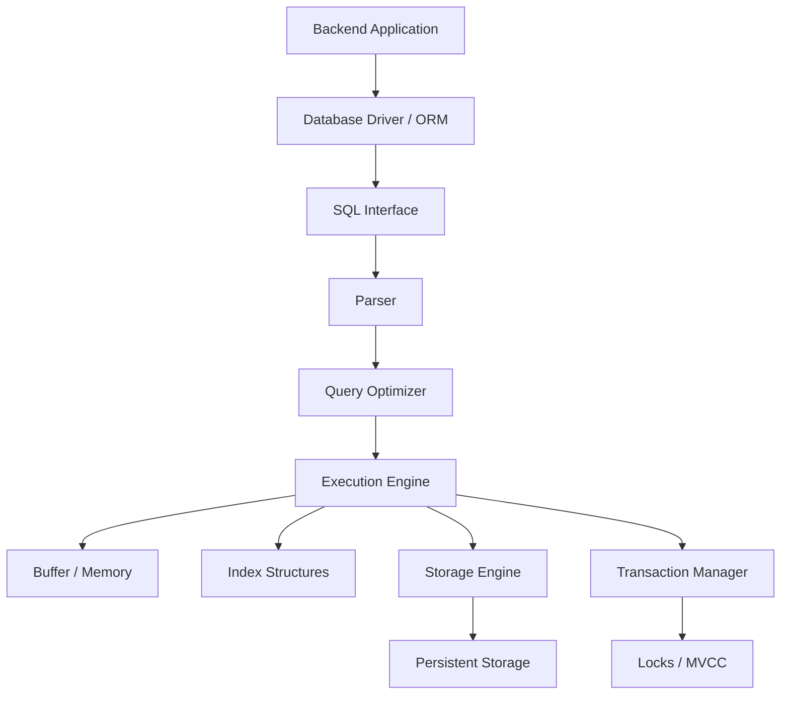

# 02- SQL and Relational Databases

## Overview

SQL is primarily used with **relational database management systems (RDBMSs)**. To use SQL effectively, it is important to understand the database model behind it: tables, rows, columns, relationships, keys, constraints, and relational operations.

A relational database stores data in structured relations, commonly represented as tables. SQL provides the language for querying and modifying those relations while the database engine is responsible for enforcing constraints, managing transactions, optimizing queries, and persisting data.

For backend engineering, this distinction matters:

```text
Application
    │
    │ SQL / ORM / Database Driver
    ▼
Relational Database
    │
    ├── Query Parser
    ├── Query Optimizer
    ├── Execution Engine
    ├── Transaction Manager
    ├── Lock / MVCC Manager
    ├── Buffer / Cache
    └── Storage Engine
            │
            ▼
        Persistent Storage
```

The relational model provides a strong foundation for systems where correctness, transactional consistency, relationships, and structured querying are important.

---

## What Is a Relational Database?

A relational database organizes data into **relations**. In practical SQL systems, these relations are represented primarily as tables.

A table consists of:

- **Columns** — attributes or properties
- **Rows** — individual records
- **Constraints** — rules governing valid data
- **Keys** — mechanisms for identifying and relating records

For example:

```text
users

+----+---------------------+-----------+
| id | email               | is_active |
+----+---------------------+-----------+
| 1  | alice@example.com   | true      |
| 2  | bob@example.com     | true      |
| 3  | carol@example.com   | false     |
+----+---------------------+-----------+
```

Another table can represent orders:

```text
orders

+----+---------+-------------+----------+
| id | user_id | total       | status   |
+----+---------+-------------+----------+
| 10 | 1       | 149.99      | paid     |
| 11 | 1       |  59.99      | pending  |
| 12 | 2       | 249.00      | paid     |
+----+---------+-------------+----------+
```

The relationship between the tables is represented by `orders.user_id` referencing `users.id`.

```text
users
  │
  │ id
  │
  └──────────< orders.user_id
```

This relationship allows SQL to retrieve related data using joins.

---

## Why the Relational Model Exists

The relational model provides a structured way to represent data and relationships while maintaining strong consistency and integrity guarantees.

It is particularly effective when:

- Data has well-defined relationships
- Transactions are important
- Referential integrity matters
- Multiple entities need to be queried together
- Data correctness is more important than schema flexibility
- Complex filtering and aggregation are required
- Strong consistency is required for critical operations

Typical backend workloads include:

- User accounts
- Orders
- Payments
- Inventory
- Billing
- Permissions
- Financial transactions
- Booking systems
- SaaS applications
- Configuration and metadata

---

## Relational Database vs SQL

These concepts should not be treated as synonyms.

| Concept | Meaning |
|---|---|
| Relational model | Data model based on relations and relationships |
| Relational database | Database system implementing the relational model |
| RDBMS | Software that manages a relational database |
| SQL | Language used to interact with relational databases |
| PostgreSQL | An RDBMS implementing SQL and relational database concepts |
| MySQL | An RDBMS implementing SQL and relational database concepts |
| Django ORM | Application-level abstraction that generates database queries |
| `psycopg` | Python PostgreSQL database driver |

For example:

```text
Python application
       │
       ▼
Django ORM
       │
       ▼
SQL
       │
       ▼
PostgreSQL
       │
       ▼
Storage
```

SQL is therefore the language layer, while PostgreSQL or MySQL is the database system executing that language.

---

## Tables

A relational table represents a collection of related records.

Example:

```sql
CREATE TABLE users (
    id BIGINT PRIMARY KEY,
    email VARCHAR(255) NOT NULL,
    is_active BOOLEAN NOT NULL DEFAULT TRUE,
    created_at TIMESTAMPTZ NOT NULL DEFAULT CURRENT_TIMESTAMP
);
```

The schema defines:

- Column names
- Data types
- Constraints
- Default values

A table should generally represent a meaningful entity or relationship rather than an arbitrary collection of unrelated attributes.

### Good Table Boundaries

For an e-commerce application:

```text
users
products
orders
order_items
payments
addresses
```

This is preferable to putting everything into one large table such as:

```text
users_orders_products_payments
```

because separate entities have different lifecycles, relationships, constraints, and access patterns.

---

## Rows

A row represents one record in a table.

Example:

```sql
INSERT INTO users (
    id,
    email,
    is_active
)
VALUES (
    1,
    'alice@example.com',
    TRUE
);
```

The inserted row represents one user.

Rows are not inherently ordered.

This is an important SQL rule.

Without an explicit `ORDER BY`, a query must not be assumed to return rows in a particular order.

Avoid relying on:

```sql
SELECT *
FROM users;
```

to return rows in insertion order.

If ordering matters:

```sql
SELECT *
FROM users
ORDER BY created_at DESC, id DESC;
```

The secondary `id` ordering can provide deterministic ordering when multiple rows have the same timestamp.

---

## Columns

Columns define the attributes stored for each row.

Example:

```text
users
├── id
├── email
├── is_active
└── created_at
```

Each column has a data type and may have constraints.

For example:

```sql
email VARCHAR(255) NOT NULL
```

means:

- `email` stores character data
- the database imposes the declared type
- `NULL` is not permitted

Choosing appropriate data types is important because types affect:

- Storage
- Validation
- Comparisons
- Indexes
- Query performance
- Application behavior

---

## Relationships

Relational databases are particularly useful when data entities are related.

Common relationship types are:

| Relationship | Example |
|---|---|
| One-to-one | User → Profile |
| One-to-many | User → Orders |
| Many-to-many | Students ↔ Courses |

### One-to-Many

One user can have many orders:

```text
users
  │
  │ 1
  │
  └──────────< orders
                 N
```

The foreign key is generally placed on the "many" side:

```sql
CREATE TABLE orders (
    id BIGINT PRIMARY KEY,
    user_id BIGINT NOT NULL,
    total_amount NUMERIC(12, 2) NOT NULL,

    CONSTRAINT fk_orders_user
        FOREIGN KEY (user_id)
        REFERENCES users(id)
);
```

### Many-to-Many

A many-to-many relationship is normally represented using a junction table.

```text
students
    │
    │
    ▼
student_courses
    ▲
    │
    │
courses
```

For example:

```sql
CREATE TABLE student_courses (
    student_id BIGINT NOT NULL,
    course_id BIGINT NOT NULL,

    PRIMARY KEY (student_id, course_id)
);
```

The junction table converts one many-to-many relationship into two one-to-many relationships.

---

## Primary Keys

A primary key uniquely identifies a row within a table.

Example:

```sql
CREATE TABLE users (
    id BIGINT PRIMARY KEY,
    email VARCHAR(255) NOT NULL
);
```

The primary key provides a stable identity for the record.

A primary key should generally be:

- Unique
- Non-null
- Stable
- Appropriate for the application's identity requirements

Common choices include:

- Auto-incrementing integers
- UUIDs
- Application-generated identifiers

The choice depends on workload, architecture, indexing behavior, security requirements, and interoperability.

---

## Foreign Keys

A foreign key represents a relationship between tables and allows the database to enforce referential integrity.

```sql
CREATE TABLE orders (
    id BIGINT PRIMARY KEY,
    user_id BIGINT NOT NULL,

    CONSTRAINT fk_orders_user
        FOREIGN KEY (user_id)
        REFERENCES users(id)
);
```

This prevents an order from referencing a user that does not exist, subject to the configured foreign-key behavior.

Foreign keys are particularly valuable when multiple components can modify the database.

For example:

```text
Django application
Celery worker
Admin script
Data migration
Batch process
        │
        ▼
    PostgreSQL
        │
        ▼
Foreign key constraint
        │
        ▼
Data integrity
```

Without database-level constraints, every writer would have to correctly implement the same integrity rule.

---

## Constraints

Constraints allow the database to enforce data validity.

Common constraints include:

- `PRIMARY KEY`
- `FOREIGN KEY`
- `UNIQUE`
- `NOT NULL`
- `CHECK`
- `DEFAULT`

Example:

```sql
CREATE TABLE products (
    id BIGINT PRIMARY KEY,
    sku VARCHAR(64) NOT NULL UNIQUE,
    price NUMERIC(12, 2) NOT NULL CHECK (price >= 0),
    is_active BOOLEAN NOT NULL DEFAULT TRUE
);
```

This schema establishes several invariants:

```text
id
 └── must uniquely identify the row

sku
 └── cannot be NULL
 └── must be unique

price
 └── cannot be NULL
 └── cannot be negative

is_active
 └── cannot be NULL
 └── defaults to TRUE
```

Database constraints provide protection even when application-level validation is bypassed.

---

## NULL in Relational Databases

`NULL` represents the absence of a value or an unknown/non-applicable value.

It is not equivalent to:

- `0`
- Empty string
- `FALSE`
- `"NULL"`

For example:

```sql
SELECT *
FROM users
WHERE deleted_at IS NULL;
```

This is correct.

The following does not correctly test for SQL `NULL`:

```sql
WHERE deleted_at = NULL;
```

SQL uses three-valued logic involving:

- `TRUE`
- `FALSE`
- `UNKNOWN`

`NULL` behavior affects:

- Filtering
- Joins
- Aggregations
- Constraints
- Expressions
- Index usage
- Application mapping

NULL handling should therefore be treated as a deliberate schema and query-design decision.

---

## Relational Operations

Relational databases provide operations for transforming and combining relations.

Important SQL operations include:

| Operation | SQL concept |
|---|---|
| Select rows | `WHERE` |
| Select columns | `SELECT` |
| Sort rows | `ORDER BY` |
| Aggregate rows | `GROUP BY` |
| Combine tables | `JOIN` |
| Combine result sets | `UNION`, `INTERSECT`, `EXCEPT` |
| Filter based on another query | Subquery / `EXISTS` |
| Analyze related rows | Window functions |

For example:

```sql
SELECT
    u.email,
    COUNT(o.id) AS order_count,
    SUM(o.total_amount) AS total_spend
FROM users AS u
LEFT JOIN orders AS o
    ON o.user_id = u.id
GROUP BY u.id, u.email
ORDER BY total_spend DESC;
```

This query combines several relational operations:

```text
users
  +
orders
  ↓
JOIN
  ↓
GROUP BY
  ↓
Aggregate
  ↓
ORDER BY
  ↓
Result
```

---

## Set-Based Thinking

One of the most important conceptual shifts for SQL development is **set-based thinking**.

Instead of thinking:

```text
Fetch one row
Process it
Fetch another row
Process it
...
```

SQL allows you to describe an operation over a set of rows.

For example:

```sql
UPDATE accounts
SET status = 'inactive'
WHERE last_login_at < CURRENT_DATE - INTERVAL '365 days';
```

The query expresses the entire operation declaratively.

This is generally preferable to loading every account into Python and updating records individually.

However, set-based SQL does not mean that every piece of business logic belongs in the database. Application-level orchestration, external service calls, complex workflows, and domain logic often belong in the application layer.

The engineering decision is about putting each responsibility in the appropriate layer.

---

## Relational Database Architecture

A production relational database contains several important internal components.



The exact architecture varies by database engine, but the general responsibilities are similar.

### Parser

The parser validates SQL syntax and converts the statement into an internal representation.

### Query Optimizer

The optimizer evaluates possible execution strategies and selects a plan.

For example:

```text
SQL Query
    ↓
Possible plans
    ├── Sequential scan
    ├── Index scan
    ├── Nested loop join
    ├── Hash join
    └── Merge join
         ↓
Cost estimation
         ↓
Selected plan
```

### Execution Engine

The execution engine runs the selected plan and produces the requested result or modifies database state.

### Storage

The database persists data using its storage subsystem.

The exact implementation differs between systems, but databases typically manage:

- Data pages
- Index pages
- Transaction metadata
- Write-ahead logs or equivalent durability mechanisms
- Buffer/cache memory

---

## PostgreSQL as a Relational Database

PostgreSQL is a general-purpose open-source relational database frequently used for backend systems.

It provides:

- SQL
- Transactions
- MVCC
- Foreign keys
- Constraints
- Multiple index types
- JSON and JSONB
- Full-text search
- Partitioning
- Replication capabilities
- Extensions
- Advanced query functionality

A typical backend architecture might look like:

```text
                         ┌───────────────┐
                         │   REST API    │
                         └───────┬───────┘
                                 │
                         ┌───────▼───────┐
                         │ FastAPI /     │
                         │ Django        │
                         └───────┬───────┘
                                 │
                         ┌───────▼───────┐
                         │ ORM / Driver  │
                         └───────┬───────┘
                                 │
                              SQL
                                 │
                         ┌───────▼───────┐
                         │  PostgreSQL   │
                         └───────┬───────┘
                                 │
                         ┌───────▼───────┐
                         │ Persistent    │
                         │ Storage       │
                         └───────────────┘
```

PostgreSQL is particularly useful as a learning database because many relational concepts can be explored directly rather than hidden behind an ORM.

---

## Relational Databases and ORMs

Backend frameworks frequently use ORMs to map application objects to relational tables.

For example, a Django model:

```python
class Order(models.Model):
    user = models.ForeignKey("User", on_delete=models.PROTECT)
    total_amount = models.DecimalField(max_digits=12, decimal_places=2)
    created_at = models.DateTimeField(auto_now_add=True)
```

represents a relational structure.

Application code might query it with:

```python
orders = (
    Order.objects
    .filter(user_id=42)
    .order_by("-created_at")[:20]
)
```

The ORM generates SQL for the database.

The abstraction is useful, but an engineer should still understand:

- The generated SQL
- Number of database round trips
- Join behavior
- Index usage
- Transaction boundaries
- Locking behavior
- Result-set size

ORM abstraction should therefore reduce application complexity, not replace database knowledge.

---

## Relational Database vs NoSQL

Relational and NoSQL databases solve different classes of problems.

| Characteristic | Relational Database | Many NoSQL Systems |
|---|---|---|
| Data model | Tables / relations | Document, key-value, wide-column, graph, etc. |
| Schema | Typically structured | Often more flexible |
| Relationships | First-class | Varies by system |
| Joins | Strong support | Often limited or application-managed |
| Transactions | Strong support | Varies considerably |
| Query language | SQL or SQL-derived | Database-specific APIs/languages |
| Referential integrity | Strong support | Often application-managed |
| Horizontal scaling | Possible | Often a primary design goal |
| Best fit | Structured transactional workloads | Workloads requiring flexible models or specialized access patterns |

This is not a simple "SQL vs NoSQL is better" decision.

The correct database depends on:

- Access patterns
- Consistency requirements
- Data relationships
- Transaction requirements
- Scale
- Latency requirements
- Operational model
- Team expertise
- Cost
- Availability requirements

Many production systems use both relational and non-relational databases.

For example:

```text
                         Backend Services
                              │
             ┌────────────────┼────────────────┐
             │                │                │
             ▼                ▼                ▼
        PostgreSQL          Redis            Kafka
        system of           cache /          event
        record              ephemeral        streaming
                            state
```

The relational database may remain the authoritative source of business state while other systems serve specialized workloads.

---

## When to Choose a Relational Database

A relational database is generally a strong choice when the system requires:

### Strong relationships

For example:

```text
Customer
   ↓
Orders
   ↓
Order Items
   ↓
Products
```

### Transactional integrity

For example, transferring money:

```text
Debit Account A
      +
Credit Account B
      ↓
Atomic Transaction
```

### Strong constraints

Examples:

- Unique email addresses
- Valid foreign keys
- Non-negative balances
- Valid order states

### Complex querying

Relational databases are strong when applications need:

- Joins
- Aggregations
- Filtering
- Sorting
- Window functions
- Reporting queries
- Ad hoc investigation

### Mature operational tooling

Relational databases provide mature capabilities around:

- Backups
- Replication
- Monitoring
- Transactions
- Schema migrations
- Query analysis
- Access control

---

## When a Relational Database May Not Be the Best Fit

A relational database may not be the ideal primary store when requirements strongly favor:

- Extremely flexible document structures
- Specialized graph traversal
- Very high-volume key-value access
- Specific time-series workloads
- Specialized search workloads
- Workloads where relational transactions provide little value

Even then, the decision should be based on measured requirements rather than technology trends.

A common production architecture uses multiple data stores, each with a specific responsibility.

---

## Production Considerations

### Data Integrity

Use database constraints for important invariants.

Do not rely exclusively on Python or API validation.

### Query Performance

Design queries and indexes around actual access patterns.

Use execution plans when diagnosing performance:

```sql
EXPLAIN ANALYZE
SELECT
    id,
    email
FROM users
WHERE email = 'alice@example.com';
```

### Transactions

Group related state changes into appropriate transactions.

Avoid unnecessarily long transactions because they can increase lock contention and resource usage.

### Connection Management

Backend applications should use connection pooling rather than creating a new database connection for every request.

A simplified architecture is:

```text
Requests
   │
   ├── Request A ──┐
   ├── Request B ──┤
   ├── Request C ──┤
   └── Request D ──┘
                   │
                   ▼
            Connection Pool
                   │
          ┌────────┼────────┐
          ▼        ▼        ▼
       DB Conn   DB Conn   DB Conn
          │        │        │
          └────────┼────────┘
                   ▼
              PostgreSQL
```

### High Availability

For production workloads, consider:

- Automated backups
- Tested restore procedures
- Replication where appropriate
- Failover strategy
- Monitoring
- Connection management
- Capacity planning

### Disaster Recovery

Backups are only useful if they can be restored.

A production database strategy should define:

- Recovery Point Objective (RPO)
- Recovery Time Objective (RTO)
- Backup retention
- Restore procedures
- Recovery testing

### Security

Use:

- Least-privilege database users
- Parameterized queries
- Secure credentials
- Encrypted connections
- Appropriate network controls
- Auditing where required

Do not expose a database directly to untrusted clients.

---

## Common Mistakes

### Treating tables as independent collections

Relational databases are designed around relationships. Ignoring relationships often leads to duplicated data and difficult consistency problems.

### Using application validation instead of database constraints

Application validation can be bypassed by another writer.

Critical invariants should generally be enforced by the database as well.

### Assuming row order

Without `ORDER BY`, result order is not guaranteed.

### Assuming ORM abstraction removes SQL complexity

ORM-generated queries can still contain:

- Expensive joins
- N+1 queries
- Large scans
- Inefficient pagination
- Missing indexes

### Over-normalizing without considering workload

Normalization reduces duplication and improves integrity, but excessive decomposition can increase query complexity.

### Denormalizing without a clear access pattern

Denormalization can improve read performance but introduces consistency and write complexity.

### Treating relational databases as merely persistent dictionaries

A relational database provides:

- Query processing
- Transactions
- Constraints
- Concurrency control
- Indexes
- Relationships
- Recovery mechanisms

Using only CRUD operations leaves significant capabilities unused.

### Assuming SQL performance is determined by syntax alone

Two equivalent queries can have different execution plans.

Performance should be evaluated using:

- Query plans
- Statistics
- Metrics
- Data volume
- Workload characteristics

---

## Interview Perspective

A strong backend engineer should be able to explain the relational model beyond the statement:

> A relational database stores data in tables.

Important areas include:

- Why tables represent relations
- How primary and foreign keys establish identity and relationships
- Why constraints belong in the database
- How joins combine related data
- Why SQL is declarative
- How the query optimizer selects execution plans
- Why indexes affect performance
- How transactions preserve consistency
- How concurrency affects database operations
- When relational and non-relational databases are appropriate

A useful mental model is:

```text
Data Model
    ↓
Schema
    ↓
Relationships
    ↓
Constraints
    ↓
SQL Query
    ↓
Query Plan
    ↓
Execution
    ↓
Transaction / Concurrency
    ↓
Persistent State
```

At senior level, the discussion should move from:

> "How do I query this table?"

to:

> "What data model, constraints, access patterns, indexes, transaction boundaries, and execution strategy produce a correct and scalable system?"

---

## Key Takeaways

- **A relational database organizes structured data into related tables**, using rows, columns, keys, relationships, and constraints to represent application state.
- **SQL is the language; PostgreSQL, MySQL, and similar systems are database engines** that parse, optimize, execute, and persist SQL operations.
- **Relational databases provide more than storage**: joins, constraints, transactions, concurrency control, indexing, query optimization, and recovery are core capabilities.
- **Backend engineers should understand the database beneath their ORM**, including generated SQL, relationships, transaction boundaries, indexes, and execution plans.
- **Choosing a relational database is an engineering decision based on workload and consistency requirements**, not simply a preference for SQL or NoSQL.