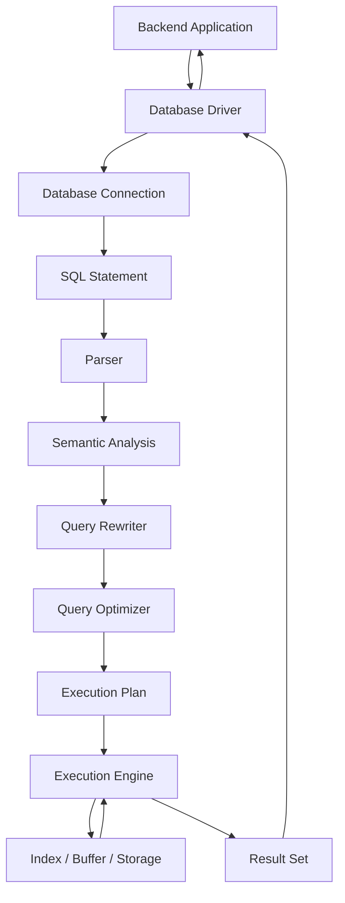

# 04- SQL Execution Model

## Overview

The SQL execution model describes how a database transforms a SQL statement into an executed operation and ultimately produces a result or modifies persistent state.

When a backend application executes:

```sql
SELECT
    id,
    email
FROM users
WHERE is_active = TRUE
ORDER BY created_at DESC
LIMIT 20;
```

the database does not simply read the statement from top to bottom and execute each clause literally.

A relational database generally performs several stages:

```text
Application
    ↓
Database Driver / Connection
    ↓
SQL Statement
    ↓
Parsing
    ↓
Validation / Semantic Analysis
    ↓
Query Rewriting
    ↓
Query Optimization
    ↓
Execution Plan
    ↓
Execution Engine
    ↓
Buffer / Cache / Indexes / Storage
    ↓
Result Set
    ↓
Database Driver
    ↓
Application
```

Understanding this lifecycle is essential for backend engineers because SQL performance, correctness, locking, resource consumption, and scalability are determined by what the database actually does, not merely by how the SQL looks.

A useful distinction is:

> **SQL describes what result or operation is required; the database determines how to produce it.**

---

## Why the SQL Execution Model Matters

At a basic level, an engineer needs to know how to write valid SQL.

At an intermediate level, the engineer needs to understand:

- Logical query processing
- Joins
- Filtering
- Aggregation
- Sorting
- Subqueries
- CTEs
- Window functions

At a senior level, the engineer must also understand:

- Query planning
- Cost estimation
- Execution plans
- Index selection
- Join algorithms
- Cardinality estimation
- Memory usage
- Disk I/O
- Locking and concurrency
- Transaction boundaries
- Query cancellation
- Connection pooling
- Observability
- Production failure modes

Consider:

```sql
SELECT *
FROM orders
WHERE user_id = 42;
```

The SQL does not specify whether the database should:

```text
Sequentially scan the table
```

or:

```text
Use an index on user_id
```

or:

```text
Use another available access path
```

The optimizer decides.

This is the central idea behind SQL execution.

---

## Logical SQL Processing vs Physical Execution

Two different concepts must be kept separate.

### Logical Query Processing

This describes the conceptual order in which SQL clauses determine the result.

For a typical query:

```sql
SELECT
    department_id,
    COUNT(*) AS employee_count
FROM employees
WHERE is_active = TRUE
GROUP BY department_id
HAVING COUNT(*) > 10
ORDER BY employee_count DESC;
```

the conceptual order is approximately:

```text
FROM
  ↓
WHERE
  ↓
GROUP BY
  ↓
HAVING
  ↓
SELECT
  ↓
ORDER BY
  ↓
LIMIT / OFFSET
```

### Physical Query Execution

The database does not necessarily execute the query using that literal sequence.

Instead, the optimizer may transform the query into an efficient physical plan:

```text
SQL
 ↓
Logical representation
 ↓
Optimization
 ↓
Physical execution plan
 ↓
Scan / Join / Filter / Aggregate / Sort
```

For example, a database might push a filter closer to the table scan, choose an index, change the join order, or use a hash-based aggregation strategy.

Therefore:

```text
Logical processing order
        ≠
Physical execution order
```

This distinction explains many SQL behaviors and many performance optimizations.

---

## End-to-End SQL Execution Flow

A simplified execution lifecycle is:



The exact internal architecture varies by database engine, but the overall responsibilities are broadly similar.

---

## Database Connection

Before SQL can execute, the application normally needs a database connection.

For a Python backend:

```text
FastAPI / Django
      ↓
Database Driver
      ↓
Connection Pool
      ↓
PostgreSQL Connection
```

A connection may be reused across multiple requests through a connection pool.

A simplified lifecycle is:

```text
HTTP Request
    ↓
Acquire DB Connection
    ↓
Execute SQL
    ↓
Read Result
    ↓
Commit / Rollback if required
    ↓
Release Connection
    ↓
HTTP Response
```

Connection management is important because database connections are finite resources.

If an application creates too many concurrent connections:

```text
Application
    ↓
Connection Pool
    ├── Connection 1
    ├── Connection 2
    ├── Connection 3
    ├── ...
    └── Connection N
          ↓
     PostgreSQL
```

the database can become resource-constrained even when individual queries are efficient.

Connection pooling is therefore part of SQL execution at the application architecture level.

---

## Sending the SQL Statement

The application sends SQL through a database driver or an abstraction layer.

For example:

```python
cursor.execute(
    """
    SELECT id, email
    FROM users
    WHERE id = %s
    """,
    (42,),
)
```

The driver is responsible for communicating with the database using the database's wire protocol.

A simplified flow is:

```text
Python
  ↓
Database Driver
  ↓
Database Protocol
  ↓
Network
  ↓
Database Server
```

With PostgreSQL, a driver such as `psycopg` handles communication between the Python application and PostgreSQL.

The network itself introduces latency, which is one reason reducing unnecessary database round trips matters.

---

## Parsing

The database first parses the SQL statement.

For example:

```sql
SELECT id
FROM users
WHERE is_active = TRUE;
```

The parser verifies that the SQL follows the database's grammar.

A malformed query might fail at this stage:

```sql
SELECT id
FROM
WHERE is_active = TRUE;
```

Parsing determines the structural meaning of the statement.

Conceptually:

```text
SQL Text
   ↓
Lexer / Parser
   ↓
Syntax Tree / Internal Representation
```

The parser does not yet determine the best physical execution strategy.

---

## Semantic Analysis

After parsing, the database must determine whether the referenced objects and expressions make sense.

For example:

```sql
SELECT
    nonexistent_column
FROM users;
```

The syntax can be valid SQL while the referenced column does not exist.

Semantic analysis can involve resolving:

- Table names
- Column names
- Data types
- Functions
- Operators
- Schemas
- Permissions
- References between objects

The database must establish that the statement is meaningful against the current database schema and security context.

---

## Query Rewriting

Many relational databases can transform a parsed query before optimization.

Query rewriting can involve transformations such as:

- Expanding views
- Simplifying expressions
- Applying rules
- Rewriting predicates
- Transforming equivalent query structures

For example, if a query references a view:

```sql
SELECT
    id,
    email
FROM active_users;
```

the database may internally incorporate the definition of `active_users` into the query before optimization.

This means a view is not necessarily a stored copy of its result.

In many relational systems, a regular view behaves more like a reusable query definition.

---

## Query Optimization

Optimization is one of the most important stages.

The database considers possible ways to execute the query and attempts to select an efficient plan.

For:

```sql
SELECT
    id,
    email
FROM users
WHERE email = 'alice@example.com';
```

possible strategies could include:

```text
Sequential Scan
    ↓
Read many or all table rows
    ↓
Check email

Index Scan
    ↓
Use email index
    ↓
Locate matching row
```

If an appropriate index exists:

```sql
CREATE INDEX idx_users_email
ON users(email);
```

the optimizer may choose an index-based strategy.

However, an index does not guarantee that the optimizer will use it.

The optimizer considers factors such as:

- Table size
- Estimated matching rows
- Index selectivity
- Statistics
- Cost of random I/O
- Available memory
- Sort requirements
- Join strategy
- Parallelism
- Database configuration

---

## Cost-Based Optimization

Modern relational databases commonly use cost-based optimization.

The optimizer estimates the cost of different execution plans and selects a plan it believes will be efficient.

Conceptually:

```text
Query
  ↓
Candidate Plan A ── estimated cost: 100
Candidate Plan B ── estimated cost: 35
Candidate Plan C ── estimated cost: 70
  ↓
Choose Plan B
```

The "cost" is an internal estimate, not necessarily a direct monetary cost.

It can incorporate estimates related to:

- CPU
- I/O
- Memory
- Number of rows
- Number of operations
- Parallel execution

The optimizer does not generally guarantee that the chosen plan is globally optimal. It selects a plan based on its available information and cost model.

---

## Statistics and Cardinality Estimation

The optimizer needs information about the data.

Database statistics can describe properties such as:

- Approximate row counts
- Value distribution
- Distinct values
- Data selectivity
- Correlations between values

For example:

```text
orders.user_id

Total rows:       100,000,000
Distinct users:       10,000,000
Estimated matches:          10
```

The optimizer may infer that filtering on a particular user is highly selective.

If statistics are inaccurate:

```text
Estimated rows: 10
Actual rows:    5,000,000
```

the optimizer can choose a poor plan.

This is why database maintenance and statistics are important for production performance.

---

## Execution Plans

The optimizer produces an execution plan.

A plan describes the physical operations required to execute the query.

For example:

```text
Index Scan
    ↓
Filter
    ↓
Sort
    ↓
Limit
```

A more complex query might produce:

```text
Hash Join
├── Sequential Scan: users
└── Hash
    └── Index Scan: orders
          ↓
      Aggregate
          ↓
        Sort
```

Execution plans are one of the most important diagnostic tools for SQL performance.

In PostgreSQL:

```sql
EXPLAIN
SELECT
    id,
    email
FROM users
WHERE email = 'alice@example.com';
```

To execute the query and show runtime information:

```sql
EXPLAIN ANALYZE
SELECT
    id,
    email
FROM users
WHERE email = 'alice@example.com';
```

`EXPLAIN` describes the planned execution.

`EXPLAIN ANALYZE` executes the query and reports actual execution statistics.

Therefore, `EXPLAIN ANALYZE` should be used carefully for statements that modify data.

---

## Scan Operations

A database must locate the rows required by a query.

Common scan strategies include:

- Sequential scan
- Index scan
- Index-only scan
- Bitmap scan

### Sequential Scan

The database reads table pages and evaluates rows.

```text
Table
 ↓
Page 1
 ↓
Page 2
 ↓
Page 3
 ↓
...
 ↓
Page N
```

A sequential scan is not automatically bad.

For a query that needs a large percentage of the table, sequential access may be cheaper than repeatedly following an index.

### Index Scan

The database uses an index to locate relevant rows.

```text
Query
 ↓
Index
 ↓
Matching row locations
 ↓
Table data
```

This is often effective for selective lookups.

### Index-Only Scan

When the required columns can be satisfied from the index itself and visibility requirements are met, the database may avoid reading the underlying table rows.

This can substantially reduce I/O for suitable workloads.

### Bitmap Scan

Some databases can use an index to identify matching locations and then access table pages in a more efficient grouped manner.

The optimizer decides which scan is appropriate.

---

## Filtering

Filtering determines which rows satisfy predicates.

Example:

```sql
SELECT
    id,
    email
FROM users
WHERE is_active = TRUE;
```

The database must evaluate the predicate:

```text
is_active = TRUE
```

The filter can sometimes be applied very early.

This is beneficial because reducing the number of rows early can reduce downstream work.

For example:

```text
10,000,000 rows
      ↓
Filter
      ↓
100,000 rows
      ↓
Join
      ↓
Aggregate
```

is generally preferable to carrying all 10 million rows through expensive downstream operations when the query semantics allow early filtering.

This is one reason query optimizers perform transformations such as predicate pushdown.

---

## Predicate Pushdown

Predicate pushdown means applying filters as close as possible to the data source when doing so is semantically valid.

Suppose a query joins two large tables and filters one table:

```sql
SELECT
    o.id,
    u.email
FROM orders AS o
JOIN users AS u
    ON u.id = o.user_id
WHERE u.is_active = TRUE;
```

The optimizer may effectively filter active users before performing the full join.

Conceptually:

```text
users
  ↓
Filter active users
  ↓
Smaller relation
  ↓
JOIN
  ↑
orders
```

Reducing intermediate result sizes can significantly improve performance.

---

## Join Execution

A SQL `JOIN` describes the required relationship, but the database chooses how to execute it.

Common join algorithms include:

- Nested loop join
- Hash join
- Merge join

### Nested Loop Join

Conceptually:

```text
For each row in A:
    find matching rows in B
```

This can be highly effective when one side is small and the other side has an appropriate index.

### Hash Join

The database builds a hash structure for one input and probes it with rows from the other.

Conceptually:

```text
Build
  ↓
Hash Table
  ↓
Probe
  ↓
Matches
```

Hash joins are often useful for larger equality joins.

### Merge Join

Two inputs are ordered by the join key and then traversed together.

Conceptually:

```text
Sorted A ─────────┐
                  ├── Merge
Sorted B ─────────┘
```

The optimizer selects the algorithm based on estimated costs and available access paths.

---

## Aggregation

Queries containing:

```sql
GROUP BY
```

require the database to group rows.

For example:

```sql
SELECT
    user_id,
    COUNT(*) AS order_count
FROM orders
GROUP BY user_id;
```

The database may use different aggregation strategies depending on the engine and query.

Conceptually:

```text
Rows
 ↓
Group by user_id
 ↓
Aggregate each group
 ↓
Result
```

Aggregation can require significant memory or sorting depending on the chosen strategy and data volume.

Large aggregations should therefore be evaluated using execution plans and realistic data volumes.

---

## Sorting

`ORDER BY` can require a sort operation.

For example:

```sql
SELECT
    id,
    created_at
FROM orders
ORDER BY created_at DESC;
```

If the database cannot efficiently satisfy the ordering through an existing access path, it may need to sort rows.

Sorting can consume:

- CPU
- Memory
- Temporary storage

For large datasets, an operation that appears simple:

```sql
ORDER BY created_at DESC
```

can become expensive.

Appropriate indexes can sometimes help:

```sql
CREATE INDEX idx_orders_created_at
ON orders(created_at DESC);
```

The optimizer determines whether the index provides a useful access path.

---

## LIMIT Does Not Necessarily Make a Query Cheap

A common misconception is:

> "The query has `LIMIT 10`, so it must be fast."

Consider:

```sql
SELECT *
FROM orders
ORDER BY created_at DESC
LIMIT 10;
```

If the database cannot efficiently obtain rows in the required order, it may need to inspect or sort a large number of rows before returning the first ten.

With an appropriate index, it may be able to retrieve the required rows much more efficiently.

Therefore, query cost depends on how the database obtains the rows, not only on the number of rows returned.

---

## Materialization and Intermediate Results

Complex queries can produce intermediate results during execution.

For example:

```text
Table A
   +
Table B
   ↓
Join result
   ↓
Filter
   ↓
Aggregation
   ↓
Sort
   ↓
Final result
```

Depending on the database and execution plan, intermediate data may remain in memory or spill to temporary storage.

Large intermediate results can cause:

- Increased memory usage
- Temporary disk I/O
- Higher latency
- CPU pressure

This is particularly important for:

- Large joins
- Large aggregations
- Sorting
- Window functions
- Complex CTEs
- Reporting queries

---

## Parallel Query Execution

Some relational databases can execute parts of a query in parallel.

Conceptually:

```text
Query
  ↓
Parallel Plan
  ├── Worker 1
  ├── Worker 2
  ├── Worker 3
  └── Worker 4
       ↓
    Combine
       ↓
    Result
```

Parallel execution can improve performance for sufficiently large operations.

However, parallelism has overhead.

For small queries:

```text
Parallel setup cost > query work
```

For large analytical queries:

```text
Parallel execution benefit > coordination overhead
```

The optimizer and database configuration determine when parallel execution is appropriate.

---

## Returning Results

After execution, the database produces a result set.

For:

```sql
SELECT
    id,
    email
FROM users
WHERE is_active = TRUE;
```

the result might be:

```text
+----+-------------------+
| id | email             |
+----+-------------------+
| 1  | alice@example.com |
| 2  | bob@example.com   |
+----+-------------------+
```

The database sends the result through the database protocol to the client driver.

The driver then converts the database representation into application-level values.

For example:

```text
PostgreSQL
    ↓
Database protocol
    ↓
psycopg
    ↓
Python values
    ↓
Django / FastAPI
    ↓
JSON response
```

---

## Result Set Size and Network Cost

Query performance is not only about database execution time.

Consider:

```sql
SELECT *
FROM events;
```

If the query returns millions of rows, the application must receive and process those rows.

Costs can occur at several stages:

```text
Database CPU
     +
Database I/O
     +
Network transfer
     +
Driver processing
     +
Application memory
     +
Serialization
     +
HTTP response
```

A query can therefore be inefficient even if the database executes it relatively quickly.

Backend APIs should generally:

- Select only required columns
- Apply appropriate filters
- Bound result sizes
- Use pagination
- Avoid returning unbounded datasets

---

## SQL Execution and Transactions

SQL execution occurs within a transaction context.

For example:

```sql
BEGIN;

UPDATE accounts
SET balance = balance - 100
WHERE id = 1;

UPDATE accounts
SET balance = balance + 100
WHERE id = 2;

COMMIT;
```

The database must coordinate:

- Visibility
- Locks or MVCC mechanisms
- Logging
- Durability
- Concurrent transactions

A simplified model is:

```text
Transaction
    ↓
SQL Statement
    ↓
Read / Modify State
    ↓
Concurrency Control
    ↓
Write / Log Changes
    ↓
COMMIT
    ↓
Durable State
```

The exact implementation varies between database systems.

---

## SQL Execution and MVCC

Many modern relational databases use some form of Multi-Version Concurrency Control (MVCC).

The basic idea is that database rows can have multiple visible versions associated with transaction state.

Conceptually:

```text
Row
 │
 ├── Version A
 │
 ├── Version B
 │
 └── Version C
```

Different transactions can observe different versions according to their isolation rules.

This allows databases such as PostgreSQL to provide concurrency without requiring every read to block every write.

Understanding MVCC becomes important when investigating:

- Long-running transactions
- Vacuum behavior
- Snapshot visibility
- Isolation levels
- Lock contention
- Transaction anomalies

The exact MVCC implementation is database-specific.

---

## Locks and SQL Execution

Some SQL operations require locks.

For example:

```sql
UPDATE accounts
SET balance = balance - 100
WHERE id = 1;
```

Concurrent transactions modifying the same row may need to coordinate.

Conceptually:

```text
Transaction A
    ↓
Lock row 1
    ↓
Modify row
    ↓
Commit

Transaction B
    ↓
Attempts row 1
    ↓
Waits
```

Poorly designed transactions can create:

- Lock contention
- Long waits
- Deadlocks
- Reduced throughput

This is why SQL execution cannot be separated entirely from transaction and concurrency design.

---

## Query Cancellation and Timeouts

Long-running queries can consume database resources.

Production applications should use appropriate timeout policies.

Examples include:

- Statement timeout
- Connection timeout
- Application request timeout
- Transaction timeout

The exact configuration depends on the database, driver, framework, and workload.

A useful relationship is:

```text
Client timeout
    >
Application timeout
    >
Database statement timeout
```

The exact values should be designed intentionally rather than copied blindly.

Timeouts should also be coordinated with retries. Retrying an expensive query immediately can amplify database load.

---

## Prepared Statements and Plan Reuse

Applications frequently execute similar SQL statements with different parameter values.

For example:

```sql
SELECT
    id,
    email
FROM users
WHERE id = $1;
```

Parameters can be supplied separately from the SQL text.

This provides important security benefits because application input is not directly concatenated into SQL.

Prepared statements can also allow database or driver-level reuse of parsed or planned structures, depending on the database and driver behavior.

However, plan reuse is not universally beneficial.

Some databases and workloads can encounter parameter-sensitive planning issues where different parameter values have dramatically different optimal execution plans.

This is an advanced performance concern and should be investigated using actual execution plans and workload measurements.

---

## Query Caching

Caching can occur at multiple layers:

```text
Application cache
    ↓
Redis
    ↓
Database
    ↓
Database buffer/cache
    ↓
Storage
```

Do not assume that a database cache makes application-level caching unnecessary.

Likewise, caching query results can introduce:

- Stale data
- Invalidation complexity
- Memory cost
- Consistency problems

For transactional backend systems, the database generally remains the authoritative source of state.

Caching should be introduced based on measured workload characteristics.

---

## SQL Execution in Django

Django's ORM abstracts SQL generation.

For example:

```python
users = (
    User.objects
    .filter(is_active=True)
    .order_by("-created_at")[:20]
)
```

The resulting SQL is then sent to the configured database.

A useful debugging technique is to inspect the generated query:

```python
print(users.query)
```

For production analysis, application-level query logging and database-side observability are generally more useful than manually printing queries.

Django also provides tools such as:

```python
from django.db import connection

print(connection.queries)
```

but query collection should be used carefully because enabling detailed query tracking can introduce overhead and is not a substitute for proper production observability.

---

## SQL Execution in FastAPI

FastAPI does not define a database execution model itself.

A FastAPI service may use:

- SQLAlchemy
- SQLModel
- `psycopg`
- async database drivers
- Other database libraries

A typical architecture is:

```text
FastAPI
   ↓
Service Layer
   ↓
Repository / ORM
   ↓
Database Driver
   ↓
PostgreSQL
```

The SQL execution lifecycle remains the database's responsibility.

Async application code does not make the database query itself automatically faster.

For example:

```text
Async FastAPI
     ↓
Async database driver
     ↓
PostgreSQL
     ↓
Query execution
```

The database still has to parse, plan, execute, and return the result.

Asynchronous application code primarily changes how application workers handle waiting and concurrency.

---

## Production Query Execution Workflow

When a production query is slow, use a measurement-driven workflow.

```text
Identify slow endpoint/query
        ↓
Measure latency and frequency
        ↓
Inspect generated SQL
        ↓
Check query parameters
        ↓
Run EXPLAIN
        ↓
Run EXPLAIN ANALYZE safely
        ↓
Inspect actual vs estimated rows
        ↓
Inspect scans / joins / sorts
        ↓
Check indexes and statistics
        ↓
Change query / index / schema
        ↓
Measure again
```

Avoid immediately adding an index or rewriting the query without understanding the execution plan.

---

## Monitoring SQL Execution

Important metrics include:

| Metric | What it can reveal |
|---|---|
| Query latency | Slow queries |
| Query frequency | High-volume workload |
| Rows returned | Excessive result sets |
| Rows examined | Inefficient filtering |
| CPU | Expensive execution |
| I/O | Storage pressure |
| Buffer/cache behavior | Memory effectiveness |
| Lock wait time | Contention |
| Deadlocks | Concurrency problems |
| Active connections | Connection pressure |
| Temporary file usage | Sort/hash spills |
| Replication lag | Replica pressure |

Production monitoring should correlate database metrics with application metrics.

For example:

```text
API latency increases
        ↓
Database query latency increases
        ↓
CPU increases
        ↓
Specific query pattern identified
        ↓
Execution plan analyzed
```

This is much more useful than monitoring only HTTP latency.

---

## Common Execution Problems

### Full Table Scan on a Large Table

Possible cause:

```text
Missing index
```

But it can also be correct when the query needs a large percentage of the table.

Do not treat every sequential scan as a problem.

### Incorrect Cardinality Estimate

Example:

```text
Estimated rows: 100
Actual rows:    5,000,000
```

This can cause poor join or scan decisions.

Investigate statistics and data distribution.

### Expensive Sort

Large `ORDER BY` operations can consume significant memory or temporary storage.

Investigate whether the required ordering can be supported by an appropriate index or whether the query can reduce the number of rows before sorting.

### Large Intermediate Results

A join or aggregation may create a huge intermediate result even when the final result contains only a few rows.

Inspect execution plans for row counts at each stage.

### Lock Contention

A query may appear slow because it is waiting for another transaction rather than actively consuming CPU.

Distinguish:

```text
Execution time
```

from:

```text
Lock wait time
```

### Connection Pool Exhaustion

The SQL query itself may be fast while requests wait for an available connection.

Application metrics and database metrics must therefore be considered together.

---

## Common Mistakes

### Thinking SQL Executes Top-to-Bottom

SQL is declarative.

The database does not simply execute the written clauses sequentially.

**Avoid it:** Learn logical query processing and physical execution separately.

### Assuming Query Text Determines Performance

The same SQL can produce different execution plans depending on:

- Database engine
- Data volume
- Indexes
- Statistics
- Configuration
- Parameter values

**Avoid it:** Inspect execution plans.

### Assuming an Index Is Always Better

A sequential scan can be faster when a query needs a large percentage of a table.

**Avoid it:** Evaluate selectivity and actual workload.

### Assuming `LIMIT` Guarantees Fast Queries

The database may still need to scan or sort many rows before it can return the limited result.

**Avoid it:** Examine the execution plan.

### Ignoring Result Transfer Cost

A query returning millions of rows can be expensive even when execution itself is efficient.

**Avoid it:** Bound application result sets.

### Ignoring Lock Waits

A slow query is not necessarily CPU-bound.

**Avoid it:** Check lock and wait information.

### Running `EXPLAIN ANALYZE` Carelessly

`EXPLAIN ANALYZE` executes the statement.

Running it against a production `UPDATE` or `DELETE` can modify real data.

**Avoid it:** Use it carefully, preferably with safe read-only queries or controlled environments when analyzing modifying statements.

### Assuming Async Makes SQL Faster

Async application code does not change the database's internal query execution algorithm.

**Avoid it:** Separate application concurrency from database query performance.

### Ignoring Statistics

Outdated or inaccurate statistics can cause poor execution plans.

**Avoid it:** Understand the database's statistics maintenance process.

### Optimizing Before Measuring

Adding indexes or rewriting queries without evidence can increase complexity without improving the workload.

**Avoid it:** Establish a baseline first.

---

## Security Considerations

SQL execution also has security implications.

### Parameterized Queries

Use parameters instead of string concatenation:

```python
cursor.execute(
    """
    SELECT id, email
    FROM users
    WHERE email = %s
    """,
    (email,),
)
```

Do not construct SQL using untrusted input:

```python
query = f"SELECT * FROM users WHERE email = '{email}'"
```

### Least Privilege

The database account used by an application should have only the permissions it requires.

For example:

```text
API Service
    ↓
Application DB Role
    ↓
Required schema/table permissions
```

Avoid giving an application unrestricted administrative access.

### Query Exposure

Production SQL logs can contain:

- Sensitive values
- Identifiers
- Personal data
- Business information

Logging should be designed so that diagnostics do not become a data-leak mechanism.

---

## Scalability Considerations

SQL execution must be evaluated against expected data and traffic growth.

A query that takes:

```text
5 ms at 10,000 rows
```

may behave very differently at:

```text
100,000,000 rows
```

Similarly:

```text
100 requests/second
```

can produce very different database pressure than:

```text
10,000 requests/second
```

Evaluate:

- Query complexity
- Data volume
- Query frequency
- Concurrent connections
- Lock contention
- Index size
- Memory requirements
- I/O requirements
- Replication impact

Scaling a database workload may eventually require:

- Better indexes
- Query optimization
- Connection pooling
- Caching
- Read replicas
- Partitioning
- Archival
- Workload separation
- Sharding

But these should generally follow measurement and workload analysis.

---

## Reliability Considerations

A reliable SQL execution layer should account for:

- Query timeouts
- Connection failures
- Deadlocks
- Transaction rollback
- Database failover
- Retry behavior
- Connection pool exhaustion
- Replication failures

Retries require particular care.

A retry of a read query may be relatively straightforward.

A retry of a write requires consideration of idempotency.

For example:

```text
Request
   ↓
INSERT payment
   ↓
Network timeout
   ↓
Application does not know whether commit succeeded
   ↓
Blind retry
   ↓
Potential duplicate payment
```

Database execution behavior and application retry semantics therefore need to be designed together.

---

## Key Takeaways

- **SQL is declarative:** the query describes the required result or operation, while the database determines the physical execution strategy.
- **SQL execution involves parsing, semantic analysis, rewriting, optimization, planning, and execution**, with indexes, memory, storage, transactions, and concurrency mechanisms participating in the process.
- **Logical query processing and physical execution are different concepts**; the written SQL order does not dictate the database's physical execution order.
- **Execution plans, statistics, actual row counts, waits, and resource usage are essential for diagnosing production SQL performance.**
- **Senior backend SQL engineering is about understanding the complete execution path**, from application connection pooling and generated SQL through database planning, execution, concurrency, observability, and failure handling.