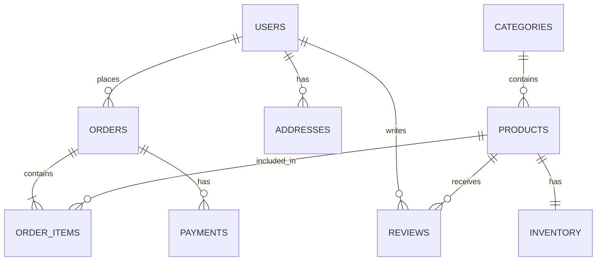

# 06- SQL Learning Strategy

## Overview

SQL should be learned as a backend engineering skill rather than as a collection of query commands.

The objective is not to memorize syntax such as `SELECT`, `JOIN`, or `GROUP BY`. The objective is to develop the ability to:

- Retrieve the correct data.
- Modify data safely.
- Model relational data correctly.
- Choose appropriate SQL constructs.
- Reason about query behavior.
- Understand transactions and concurrency.
- Design indexes around access patterns.
- Diagnose slow queries.
- Work effectively with PostgreSQL and other relational databases.
- Understand how SQL interacts with Django, FastAPI, ORMs, APIs, background workers, and distributed systems.
- Make production decisions involving correctness, performance, scalability, and reliability.

A strong learning strategy should therefore move through several levels:

```text
SQL Syntax
    ↓
Query Construction
    ↓
Relational Thinking
    ↓
Advanced Querying
    ↓
Data Integrity
    ↓
Transactions & Concurrency
    ↓
Indexes & Execution Plans
    ↓
Query Optimization
    ↓
Production Database Engineering
    ↓
System Design & Architecture
```

The progression should be deliberately hands-on.

Reading SQL documentation without repeatedly writing and executing queries creates familiarity, but not proficiency.

---

## The Target Skill Level

For backend engineering, SQL proficiency should eventually look like this:

```text
Given a backend requirement
        ↓
Understand the data model
        ↓
Identify the access pattern
        ↓
Choose the appropriate SQL construct
        ↓
Write the query
        ↓
Verify correctness
        ↓
Inspect generated/executed SQL
        ↓
Inspect execution plan
        ↓
Evaluate indexes and cardinality
        ↓
Consider transactions/concurrency
        ↓
Measure under realistic data
        ↓
Deploy safely
```

The important transition is from:

> "I know how to write this SQL."

to:

> "I understand why this SQL is appropriate, how the database will execute it, what it costs, and how it behaves in production."

---

## The SQL Learning Pyramid

SQL can be divided into several progressively deeper layers.

```text
                         ┌───────────────────────────────┐
                         │ Production Database           │
                         │ Architecture & Operations     │
                         └───────────────┬───────────────┘
                                         │
                         ┌───────────────▼───────────────┐
                         │ Performance & Optimization    │
                         │ Indexes / Plans / Statistics   │
                         └───────────────┬───────────────┘
                                         │
                         ┌───────────────▼───────────────┐
                         │ Transactions & Concurrency     │
                         │ Isolation / Locks / MVCC       │
                         └───────────────┬───────────────┘
                                         │
                         ┌───────────────▼───────────────┐
                         │ Advanced SQL                   │
                         │ CTE / Window / Subqueries      │
                         └───────────────┬───────────────┘
                                         │
                         ┌───────────────▼───────────────┐
                         │ Relational Querying             │
                         │ JOIN / GROUP BY / Aggregation   │
                         └───────────────┬───────────────┘
                                         │
                         ┌───────────────▼───────────────┐
                         │ Query Fundamentals              │
                         │ SELECT / WHERE / ORDER / NULL   │
                         └───────────────┬───────────────┘
                                         │
                         ┌───────────────▼───────────────┐
                         │ SQL Foundations                 │
                         │ Tables / Rows / Columns / CRUD  │
                         └─────────────────────────────────┘
```

Do not skip layers.

Advanced SQL becomes much easier when the relational fundamentals are strong.

---

## Stage: SQL Foundations

Start with the relational model and basic SQL syntax.

The purpose of this stage is to become comfortable interacting directly with a relational database.

### Concepts

Learn:

- Database
- Schema
- Table
- Row
- Column
- Primary key
- Foreign key
- Data types
- Constraints
- `INSERT`
- `SELECT`
- `UPDATE`
- `DELETE`

Example:

```sql
CREATE TABLE users (
    id BIGINT PRIMARY KEY,
    email VARCHAR(255) NOT NULL,
    is_active BOOLEAN NOT NULL
);
```

Then practice:

```sql
INSERT INTO users (
    id,
    email,
    is_active
)
VALUES (
    1,
    'alice@example.com',
    TRUE
);
```

```sql
SELECT
    id,
    email
FROM users;
```

```sql
UPDATE users
SET is_active = FALSE
WHERE id = 1;
```

```sql
DELETE FROM users
WHERE id = 1;
```

### What to Be Able to Do

You should be able to create a small schema and perform CRUD operations without referring constantly to documentation.

### Do Not Move Forward Until

You can comfortably answer:

- What is a table?
- What is a primary key?
- What is a foreign key?
- What does `SELECT` return?
- What does `WHERE` do?
- How does `UPDATE` decide which rows to modify?
- Why is an unrestricted `DELETE` dangerous?

---

## Stage: Query Fundamentals

Once CRUD is comfortable, focus heavily on querying.

This should become one of the strongest sections of the learning path.

### Core Topics

```text
SELECT
Filtering
Sorting
Pagination
Result Control
SQL Operators
Aggregate Functions
String Functions
Date and Time
NULL Handling
```

These concepts should be practiced together because real queries combine them constantly.

Example:

```sql
SELECT
    id,
    email,
    created_at
FROM users
WHERE is_active = TRUE
  AND created_at >= CURRENT_DATE - INTERVAL '30 days'
ORDER BY created_at DESC
LIMIT 20;
```

This single query involves:

- Projection
- Filtering
- Boolean operators
- Date operations
- Sorting
- Result limiting

### Important Concepts

Learn:

- `SELECT`
- Column aliases
- Expressions
- `WHERE`
- `AND`
- `OR`
- `NOT`
- `IN`
- `BETWEEN`
- `LIKE`
- `IS NULL`
- `IS NOT NULL`
- `ORDER BY`
- `ASC`
- `DESC`
- `LIMIT`
- `OFFSET`
- `DISTINCT`

### Practice Standard

Do not practice these concepts individually forever.

After understanding each construct, combine them.

For example:

```sql
SELECT
    customer_id,
    COUNT(*) AS order_count
FROM orders
WHERE status IN ('paid', 'shipped')
  AND created_at >= CURRENT_DATE - INTERVAL '90 days'
GROUP BY customer_id
HAVING COUNT(*) >= 5
ORDER BY order_count DESC
LIMIT 20;
```

The goal is to become comfortable composing SQL.

---

## Stage: SQL Operators

Operators deserve dedicated practice because they appear throughout SQL.

Learn:

### Comparison Operators

```sql
=
<>
!=
>
<
>=
<=
```

### Logical Operators

```sql
AND
OR
NOT
```

### Membership Operators

```sql
IN
NOT IN
```

### Range Operators

```sql
BETWEEN
NOT BETWEEN
```

### Pattern Matching

```sql
LIKE
NOT LIKE
```

Database-specific extensions can later include constructs such as PostgreSQL's:

```sql
ILIKE
```

### NULL Comparisons

Understand why this is incorrect:

```sql
WHERE deleted_at = NULL
```

and why this is correct:

```sql
WHERE deleted_at IS NULL
```

NULL behavior should be understood before moving deeply into joins and aggregation.

---

## Stage: Aggregate Functions

Learn:

```text
COUNT
SUM
AVG
MIN
MAX
```

Then understand:

```text
GROUP BY
HAVING
```

Example:

```sql
SELECT
    status,
    COUNT(*) AS order_count,
    SUM(total_amount) AS total_revenue
FROM orders
GROUP BY status
HAVING COUNT(*) > 100;
```

You should understand:

- Row-level expressions
- Group-level expressions
- Why `WHERE` and `HAVING` are different
- How grouping changes result cardinality
- How NULL affects aggregates

The important mental transition is:

```text
Individual rows
      ↓
Groups
      ↓
One result per group
```

---

## Stage: String Functions

Learn common string operations such as:

```text
LOWER
UPPER
TRIM
LENGTH
SUBSTRING
CONCAT
REPLACE
```

Practice them against realistic backend data.

Example:

```sql
SELECT
    id,
    LOWER(TRIM(email)) AS normalized_email
FROM users;
```

Understand the difference between:

- Transforming data for display
- Transforming data for comparison
- Persisting normalized values
- Applying functions to indexed columns

This becomes important later when learning expression indexes and query performance.

---

## Stage: Date and Time

Date and time should be learned early because backend systems use them constantly.

Learn:

- `DATE`
- `TIME`
- `TIMESTAMP`
- Time zones
- Current date/time
- Date arithmetic
- Intervals
- Extraction
- Truncation
- Date filtering

Example:

```sql
SELECT
    id,
    created_at
FROM orders
WHERE created_at >= CURRENT_TIMESTAMP - INTERVAL '7 days';
```

Practice real backend requirements:

- Orders created today
- Users inactive for 90 days
- Events from the previous hour
- Monthly revenue
- Daily signup counts
- Records between two timestamps

Time-zone behavior should be treated as a production concern, not merely a syntax topic.

---

## Stage: NULL Handling

NULL deserves deliberate practice.

Learn:

```text
IS NULL
IS NOT NULL
COALESCE
NULLIF
```

Understand:

- NULL is not zero
- NULL is not an empty string
- NULL is not false
- NULL participates in SQL's three-valued logic
- Comparisons involving NULL do not behave like ordinary values

Example:

```sql
SELECT
    id,
    COALESCE(display_name, 'Unknown') AS display_name
FROM users;
```

Practice NULL behavior in:

- Filtering
- Aggregation
- Joins
- Sorting
- Expressions
- Constraints

---

## Stage: CASE WHEN

`CASE` expressions are important for conditional SQL logic.

Example:

```sql
SELECT
    id,
    total_amount,
    CASE
        WHEN total_amount >= 1000 THEN 'high'
        WHEN total_amount >= 500 THEN 'medium'
        ELSE 'low'
    END AS order_category
FROM orders;
```

Learn:

- Simple `CASE`
- Searched `CASE`
- Conditional aggregation
- Conditional updates
- Conditional ordering

Example:

```sql
SELECT
    COUNT(*) FILTER (WHERE status = 'paid') AS paid_orders,
    COUNT(*) FILTER (WHERE status = 'cancelled') AS cancelled_orders
FROM orders;
```

Database-specific syntax such as `FILTER` should be learned after the underlying conditional concepts are understood.

---

## Stage: Type Casting and Conversion

Learn how SQL converts between data types.

Examples include:

```sql
SELECT
    CAST(total_amount AS INTEGER)
FROM orders;
```

PostgreSQL also supports:

```sql
SELECT
    total_amount::INTEGER
FROM orders;
```

Understand:

- Explicit casting
- Implicit conversion
- Numeric conversion
- String conversion
- Date/time conversion
- Conversion failures
- Performance implications

Do not rely heavily on implicit conversions in production SQL.

They can produce unexpected semantics and sometimes prevent efficient index usage.

---

## Stage: Set Operators

Learn:

```text
UNION
UNION ALL
INTERSECT
EXCEPT
```

Example:

```sql
SELECT email
FROM customers

UNION

SELECT email
FROM subscribers;
```

Understand:

- Duplicate elimination
- Column compatibility
- Ordering
- Performance differences
- Appropriate use cases

Pay particular attention to:

```text
UNION
vs
UNION ALL
```

`UNION` removes duplicates, while `UNION ALL` preserves them.

---

## Stage: Relational Querying and JOINs

This is one of the most important milestones in SQL learning.

Learn:

```text
INNER JOIN
LEFT JOIN
RIGHT JOIN
FULL OUTER JOIN
CROSS JOIN
SELF JOIN
```

Understand relationships:

```text
One-to-one
One-to-many
Many-to-many
```

Example:

```sql
SELECT
    o.id AS order_id,
    u.email,
    o.total_amount
FROM orders AS o
JOIN users AS u
    ON u.id = o.user_id;
```

Do not merely memorize join syntax.

For every join, ask:

```text
What is the relationship?
How many rows can each side contain?
What is the expected result cardinality?
Can rows be duplicated?
What happens when no match exists?
```

This mindset is more important than memorizing definitions.

---

## JOIN Practice Progression

Practice joins in this order:

```text
One-to-one
    ↓
One-to-many
    ↓
Multiple one-to-many relationships
    ↓
Many-to-many
    ↓
Self joins
    ↓
Outer joins
    ↓
Aggregations over joins
    ↓
Complex multi-table queries
```

Example schema:

```text
users
  │
  ├──── orders
  │         │
  │         └──── order_items
  │                    │
  │                    └──── products
  │
  └──── addresses
```

Use this kind of relational model for practice rather than isolated single-table exercises.

---

## Stage: Subqueries

Once joins are comfortable, learn subqueries.

Practice:

- Scalar subqueries
- `IN` subqueries
- `EXISTS`
- Correlated subqueries
- Subqueries in `FROM`
- Subqueries in `SELECT`

Example:

```sql
SELECT
    u.id,
    u.email
FROM users AS u
WHERE EXISTS (
    SELECT 1
    FROM orders AS o
    WHERE o.user_id = u.id
);
```

Pay particular attention to `EXISTS`.

It is often useful when the requirement is:

> "Return the parent rows for which at least one related row exists."

Do not memorize "JOIN is faster than subquery."

Modern optimizers can transform equivalent expressions.

Compare execution plans when performance matters.

---

## Stage: Common Table Expressions

Learn CTEs after subqueries.

Example:

```sql
WITH paid_orders AS (
    SELECT
        user_id,
        total_amount
    FROM orders
    WHERE status = 'paid'
)
SELECT
    user_id,
    SUM(total_amount) AS total_spend
FROM paid_orders
GROUP BY user_id;
```

Understand:

- Named query stages
- Multiple CTEs
- Recursive CTEs
- CTE readability
- CTE optimization behavior
- Materialization behavior where applicable

Use CTEs when they make complex SQL easier to reason about.

Do not use them merely because they look advanced.

---

## Stage: Window Functions

Window functions should receive substantial attention.

They solve problems that are awkward with ordinary aggregation.

Learn:

```text
OVER
PARTITION BY
ORDER BY
ROW_NUMBER
RANK
DENSE_RANK
LAG
LEAD
SUM OVER
AVG OVER
```

Example:

```sql
SELECT
    user_id,
    id AS order_id,
    total_amount,
    ROW_NUMBER() OVER (
        PARTITION BY user_id
        ORDER BY created_at DESC
    ) AS order_rank
FROM orders;
```

Practice real requirements:

- Latest order per user
- Top N products per category
- Running revenue
- Month-over-month changes
- Previous event
- Next event
- Ranking
- Deduplication

The key conceptual distinction is:

```text
GROUP BY
    ↓
Collapses rows

Window function
    ↓
Calculates across rows
    ↓
Preserves individual rows
```

This distinction should become intuitive.

---

## Stage: Views

Learn views after becoming comfortable with complex queries.

Understand:

- What a view is
- Why views exist
- View definitions
- View security considerations
- Updatable views
- Materialized views
- Performance implications

Example:

```sql
CREATE VIEW active_users AS
SELECT
    id,
    email,
    created_at
FROM users
WHERE is_active = TRUE;
```

Understand the difference between:

```text
View
    ↓
Stored query definition

Materialized View
    ↓
Persisted query result
```

Views can provide abstraction and reuse, but they do not automatically make complex queries fast.

---

## Stage: Stored Procedures

Stored procedures and database-side procedural logic should be learned after strong SQL fundamentals.

Understand:

- Why procedures exist
- Functions vs procedures
- Parameters
- Variables
- Control flow
- Transactions
- Error handling
- Security
- Vendor-specific procedural languages

Examples include:

```text
PostgreSQL → PL/pgSQL
SQL Server → T-SQL
Oracle → PL/SQL
```

Do not make stored procedures the center of application development unless the architecture requires them.

The goal is to understand when database-side execution is appropriate.

---

## Stage: Data Modification

Develop deeper knowledge of:

```text
INSERT
UPDATE
DELETE
UPSERT
MERGE
RETURNING
```

Practice:

```sql
INSERT INTO orders (
    user_id,
    status,
    total_amount
)
VALUES (
    42,
    'pending',
    99.99
)
RETURNING id;
```

Learn how modification interacts with:

- Constraints
- Transactions
- Locks
- Triggers
- Cascades
- Generated values
- Concurrency
- Retry behavior

Writing a correct `UPDATE` is not enough.

You must understand what happens when 1,000 concurrent requests execute it.

---

## Stage: Constraints and Data Integrity

This stage shifts the focus from querying to protecting data.

Learn:

```text
PRIMARY KEY
FOREIGN KEY
UNIQUE
NOT NULL
CHECK
DEFAULT
```

Example:

```sql
CREATE TABLE products (
    id BIGINT PRIMARY KEY,
    sku VARCHAR(64) NOT NULL UNIQUE,
    price NUMERIC(12, 2) NOT NULL CHECK (price >= 0)
);
```

Understand the principle:

> If an invariant must always be true, consider enforcing it at the database boundary.

Application validation is useful, but application validation alone does not protect against:

- Multiple application instances
- Background workers
- Scripts
- Administrative tools
- Race conditions
- Other services

Database constraints provide a final integrity boundary.

---

## Stage: Transactions

Transactions are mandatory knowledge for backend engineers.

Learn:

```text
BEGIN
COMMIT
ROLLBACK
SAVEPOINT
```

Understand:

- Atomicity
- Consistency
- Isolation
- Durability
- Transaction boundaries
- Autocommit
- Nested transaction concepts
- Long-running transactions

Practice realistic workflows.

Example:

```sql
BEGIN;

UPDATE inventory
SET quantity = quantity - 1
WHERE product_id = 100
  AND quantity > 0;

INSERT INTO orders (
    user_id,
    status
)
VALUES (
    42,
    'pending'
);

COMMIT;
```

Do not stop at syntax.

Understand what happens if:

- The second statement fails.
- Another transaction modifies the same row.
- The client disconnects.
- The transaction remains open.
- The application crashes.
- The database fails.

---

## Stage: Isolation Levels

Learn the major transaction isolation concepts:

```text
Read Uncommitted
Read Committed
Repeatable Read
Serializable
```

Understand anomalies such as:

```text
Dirty read
Non-repeatable read
Phantom read
Lost update
Write skew
```

The exact behavior depends on the database engine.

The important skill is learning to reason about concurrent transactions.

Example:

```text
Transaction A
     │
     ├── Read
     │
     ├── Business decision
     │
     └── Write

Transaction B
     │
     ├── Read
     │
     ├── Business decision
     │
     └── Write
```

Ask:

> Can A and B both observe a state that causes the invariant to be violated?

That question is more valuable than memorizing isolation-level definitions.

---

## Stage: Locks and Concurrency

Learn:

- Row locks
- Table locks
- Lock waits
- Deadlocks
- `SELECT ... FOR UPDATE`
- Optimistic concurrency
- Pessimistic concurrency

Example:

```sql
SELECT
    id,
    quantity
FROM inventory
WHERE product_id = 100
FOR UPDATE;
```

Understand when explicit locking is necessary and when an atomic statement is sufficient.

For example:

```sql
UPDATE inventory
SET quantity = quantity - 1
WHERE product_id = 100
  AND quantity > 0;
```

can sometimes express the invariant more directly than:

```text
Read
 ↓
Check
 ↓
Write
```

The learning goal is to recognize race conditions before they become production bugs.

---

## Stage: MVCC

If PostgreSQL is your primary database, learn MVCC deeply enough to reason about:

- Row visibility
- Transaction snapshots
- Updates
- Long-running transactions
- Vacuum
- Dead tuples
- Transaction IDs
- Read consistency

Conceptually:

```text
Logical Row
    │
    ├── Version A
    ├── Version B
    └── Version C
```

Different transactions may observe different row versions according to visibility rules.

This becomes important when diagnosing:

- Long transactions
- Table bloat
- Vacuum issues
- Transaction contention
- Unexpected query behavior

---

## Stage: Indexes

Indexes are a major transition from "writing SQL" to "engineering SQL."

Learn:

- Why indexes exist
- B-tree indexes
- Composite indexes
- Unique indexes
- Partial indexes
- Expression indexes
- Covering/index-only strategies
- Index selectivity
- Index maintenance
- Write amplification

Example:

```sql
CREATE INDEX idx_orders_user_created
ON orders(user_id, created_at DESC);
```

Then reason about:

```sql
SELECT
    id,
    status,
    created_at
FROM orders
WHERE user_id = 42
ORDER BY created_at DESC
LIMIT 20;
```

The index should be understood as an access path designed around a workload.

---

## Index Selection Strategy

Do not learn indexes as:

> "Put an index on every column used in WHERE."

Instead learn:

```text
Query Pattern
    ↓
Filtering
    ↓
Ordering
    ↓
Join Conditions
    ↓
Selectivity
    ↓
Result Size
    ↓
Index Design
```

For each index, ask:

- Which query does it support?
- How selective is the leading column?
- Does column order matter?
- Does it support sorting?
- Does it increase write cost?
- How large will the index become?
- Can the query use it efficiently?

---

## Stage: SQL Execution Plans

This is one of the most important senior-level SQL skills.

Learn:

```text
EXPLAIN
EXPLAIN ANALYZE
```

Example:

```sql
EXPLAIN
SELECT
    id,
    email
FROM users
WHERE email = 'alice@example.com';
```

Then:

```sql
EXPLAIN ANALYZE
SELECT
    id,
    email
FROM users
WHERE email = 'alice@example.com';
```

Learn to recognize:

- Sequential scans
- Index scans
- Bitmap scans
- Index-only scans
- Nested loops
- Hash joins
- Merge joins
- Sorts
- Aggregation
- Parallel execution
- Actual vs estimated rows

Do not memorize plan names without understanding why the optimizer selected them.

---

## Stage: Query Optimization

Optimization should come after execution plans.

Learn to investigate:

```text
Slow query
    ↓
Generated SQL
    ↓
Execution plan
    ↓
Estimated vs actual rows
    ↓
Scans
    ↓
Joins
    ↓
Sorts
    ↓
Indexes
    ↓
Statistics
    ↓
Query / schema change
    ↓
Measure again
```

Typical problems include:

- Missing indexes
- Incorrect indexes
- Poor join strategy
- Bad cardinality estimates
- Large intermediate results
- Expensive sorts
- Excessive result sets
- Lock waits
- Connection pool waits

Optimization should always be measurement-driven.

---

## Stage: Query Cardinality

Cardinality is a critical advanced concept.

It refers broadly to the number of rows produced or expected at different stages of query execution.

For example:

```text
users
1,000,000 rows
      ↓
WHERE is_active = TRUE
200,000 rows
      ↓
JOIN orders
10,000,000 rows
      ↓
GROUP BY user_id
200,000 rows
```

Unexpected row multiplication can cause major performance problems.

Learn to inspect:

```text
Estimated rows
Actual rows
```

When these differ dramatically, the optimizer may make poor decisions.

---

## Stage: Database Statistics

Learn why the optimizer needs statistics.

Statistics can describe:

- Row counts
- Distinct values
- Value distributions
- Selectivity
- Data characteristics

Understand why:

```text
Estimated rows: 10
Actual rows:    5,000,000
```

can result in a poor execution plan.

For PostgreSQL, understand the role of statistics collection and maintenance.

Do not treat database maintenance as purely a DBA concern.

Query performance depends on it.

---

## Stage: Application Integration

Once SQL itself is strong, connect it to your backend framework.

For Django, learn:

```text
Django ORM
    ↓
Generated SQL
    ↓
Database Driver
    ↓
PostgreSQL
```

Practice:

- QuerySets
- Filtering
- `select_related`
- `prefetch_related`
- Transactions
- `F()` expressions
- `Q()` expressions
- Raw SQL
- Query counting
- Query optimization

The goal is to understand what SQL the ORM produces.

---

## ORM Learning Rule

For every ORM operation, ask:

```text
What SQL does this generate?
How many queries does it execute?
What indexes does it need?
What rows does it retrieve?
Can it produce N+1 queries?
What happens at 1 million rows?
```

For example:

```python
orders = (
    Order.objects
    .filter(user_id=42)
    .order_by("-created_at")[:20]
)
```

should eventually be mentally translated into SQL.

This makes ORM behavior much easier to reason about.

---

## Stage: N+1 Query Detection

Learn N+1 queries explicitly.

Problem:

```text
1 query
    ↓
Fetch 100 orders

100 queries
    ↓
Fetch customer for each order
```

Total:

```text
101 database queries
```

Understand how ORM features such as:

```text
select_related
prefetch_related
```

can change database access patterns.

Do not optimize every query by eager-loading everything.

The goal is to understand the actual access pattern and retrieve the required data efficiently.

---

## Stage: SQL and API Design

SQL knowledge should influence API design.

Suppose an API exposes:

```http
GET /users/{id}/orders
```

The API should define:

- Filtering
- Pagination
- Sorting
- Maximum page size
- Required fields
- Ordering guarantees

The SQL should support those requirements efficiently.

For example:

```sql
SELECT
    id,
    status,
    total_amount,
    created_at
FROM orders
WHERE user_id = $1
ORDER BY created_at DESC, id DESC
LIMIT $2;
```

The API and SQL access pattern should be designed together.

---

## Stage: SQL and Caching

After SQL performance fundamentals, understand when caching becomes useful.

Typical architecture:

```text
API
 ↓
Redis
 │
 ├── Hit → Response
 │
 └── Miss
       ↓
   PostgreSQL
       ↓
     Redis
       ↓
    Response
```

Learn:

- Cache-aside
- TTL
- Cache invalidation
- Stale data
- Cache stampede
- Negative caching
- Consistency trade-offs

Do not use Redis to hide an inefficient query without first understanding why the query is expensive.

---

## Stage: SQL and Background Processing

Learn how Celery or other workers affect database workload.

Example:

```text
API
 ↓
Create job state
 ↓
Queue
 ↓
Celery Worker
 ↓
SQL queries
 ↓
Update state
```

Consider:

- Worker concurrency
- Connection pools
- Long-running transactions
- Batch writes
- Lock contention
- Retry behavior

A database can be overloaded by background workers even when API traffic is low.

---

## Stage: SQL and Microservices

Once SQL and transactions are strong, understand database ownership in microservices.

A common architecture is:

```text
Order Service
    ↓
Order Database

Payment Service
    ↓
Payment Database

Inventory Service
    ↓
Inventory Database
```

Cross-service operations cannot always rely on one ACID transaction.

Learn concepts such as:

- Service-owned databases
- Eventual consistency
- Outbox pattern
- Idempotency
- Sagas
- Event-driven workflows

SQL remains important even when Kafka and event-driven architecture are introduced.

---

## Stage: Production Database Engineering

At this point SQL should become part of operational engineering.

Learn:

### Connection Management

```text
Application
    ↓
Connection Pool
    ↓
Database
```

Understand:

- Pool sizing
- Connection limits
- Connection lifetime
- Idle connections
- Pool exhaustion

### Timeouts

Understand:

- Connection timeout
- Statement timeout
- Application timeout
- Transaction timeout

### Monitoring

Learn to monitor:

- Query latency
- Query frequency
- CPU
- I/O
- Connections
- Lock waits
- Deadlocks
- Replication lag
- Cache/buffer behavior

---

## Stage: Database Reliability

Learn how SQL systems behave during failures.

Study:

- Database failover
- Replication
- Read replicas
- Replication lag
- Backups
- Point-in-time recovery
- Recovery Point Objective
- Recovery Time Objective
- Connection recovery

Understand:

```text
High Availability
        ≠
Disaster Recovery
        ≠
Backup
```

Replication can help availability.

Backups help recover data.

Disaster recovery defines how the complete service returns to operation.

---

## Stage: Schema Migrations

Learn production-safe database migrations.

Practice:

```text
Additive changes
    ↓
Backward-compatible deployment
    ↓
Backfill
    ↓
Application migration
    ↓
Constraint tightening
    ↓
Cleanup
```

Understand why this can be safer than:

```text
One deployment
    ↓
Breaking schema change
```

Study:

- Adding columns
- Removing columns
- Renaming columns
- Adding indexes
- Backfills
- Large-table migrations
- Locking
- Zero-downtime migration patterns

---

## Stage: PostgreSQL Specialization

Once standard SQL is strong, choose one primary relational database and go deep.

For backend engineering, PostgreSQL is a strong specialization target.

Learn PostgreSQL-specific capabilities such as:

```text
JSONB
Arrays
UUID
Identity columns
RETURNING
ON CONFLICT
ILIKE
LATERAL
Partial indexes
Expression indexes
GIN
GiST
Full-text search
Extensions
MVCC
VACUUM
ANALYZE
```

Do not learn these all at once.

Prioritize them according to actual backend use cases.

---

## Standard SQL vs PostgreSQL

Use this progression:

```text
Standard SQL
    ↓
Relational concepts
    ↓
Portable SQL
    ↓
PostgreSQL syntax
    ↓
PostgreSQL internals
    ↓
PostgreSQL operations
```

Do not start by memorizing PostgreSQL-specific syntax before understanding SQL fundamentals.

The goal is:

```text
SQL knowledge
+
PostgreSQL expertise
=
Strong backend database capability
```

---

## Hands-On Practice Strategy

Hands-on practice should be a central part of the learning process.

A useful environment is:

```text
PostgreSQL
    ↓
Realistic schema
    ↓
Seeded data
    ↓
SQL client
    ↓
Repeated query practice
    ↓
EXPLAIN / EXPLAIN ANALYZE
```

Do not practice only with isolated questions such as:

```sql
SELECT *
FROM users;
```

Build a small relational system.

---

## Recommended Practice Database

Create a realistic backend schema such as:

```text
users
products
categories
orders
order_items
payments
addresses
reviews
inventory
events
```

Relationships:



This schema is rich enough to practice most important SQL concepts.

---

## Practice Data Should Be Large Enough

Small datasets hide performance problems.

Practice with multiple scales:

```text
1,000 rows
    ↓
10,000 rows
    ↓
100,000 rows
    ↓
1,000,000+ rows
```

At small scale, almost everything appears fast.

At larger scale, you begin to observe:

- Index behavior
- Sort cost
- Join cost
- Query planning
- Memory pressure
- Pagination problems

This is where SQL becomes engineering rather than syntax practice.

---

## Query Practice Categories

Do not practice randomly.

Organize exercises around backend requirements.

### Retrieval

```text
Find active users
Find recent orders
Find unpaid invoices
Find products by category
```

### Aggregation

```text
Revenue per user
Orders per day
Average order value
Top products
```

### Relationships

```text
Users with orders
Users without orders
Products never ordered
Orders with payment information
```

### Analytics

```text
Top-N per category
Running totals
Previous order
Monthly comparisons
Ranking
```

### Data Modification

```text
Create order
Update inventory
Cancel order
Archive records
Perform bulk updates
```

### Concurrency

```text
Prevent overselling
Reserve inventory
Claim jobs
Update counters safely
```

---

## The Query Challenge Method

For each problem, follow the same process.

```text
Read requirement
    ↓
Identify tables
    ↓
Identify relationships
    ↓
Determine required output
    ↓
Write SQL
    ↓
Run SQL
    ↓
Verify result
    ↓
Test edge cases
    ↓
Inspect execution plan
    ↓
Optimize if necessary
```

Do not immediately look at the answer.

SQL proficiency depends heavily on the ability to reason from requirements to relational operations.

---

## Correctness Before Performance

Use this priority order:

```text
Correctness
    ↓
Clarity
    ↓
Performance
    ↓
Maintainability
```

A fast query returning incorrect data is worse than a slower correct query.

Once correctness is established, optimize based on measured requirements.

---

## How to Practice Each Concept

For every major SQL concept, use four levels.

### Level A: Syntax

Learn how to write it.

### Level B: Combination

Combine it with other SQL constructs.

### Level C: Realistic Problem

Use it to solve a backend requirement.

### Level D: Execution

Inspect how the database executes it.

For example, for window functions:

```text
ROW_NUMBER syntax
    ↓
ROW_NUMBER + PARTITION BY
    ↓
Latest order per user
    ↓
EXPLAIN execution
```

This method should be applied repeatedly throughout the curriculum.

---

## When to Move to the Next Topic

Do not move forward simply because you watched a course section.

Move forward when you can perform the following without substantial assistance:

```text
Understand the requirement
        ↓
Identify relevant tables
        ↓
Write the SQL
        ↓
Explain the query
        ↓
Predict the result
        ↓
Handle edge cases
```

For advanced topics, add:

```text
Explain the execution strategy
        ↓
Identify performance risks
        ↓
Suggest appropriate indexes
```

---

## SQL Practice Difficulty Progression

Use this difficulty progression:

| Level | Example |
|---|---|
| Easy | Filter users |
| Easy | Sort orders |
| Easy | Count records |
| Moderate | Join users and orders |
| Moderate | Aggregate revenue |
| Moderate | Find users without orders |
| Advanced | Latest order per user |
| Advanced | Top 3 products per category |
| Advanced | Running totals |
| Advanced | Complex CTE |
| Advanced | Recursive hierarchy |
| Senior | Diagnose slow query |
| Senior | Design indexes |
| Senior | Fix race condition |
| Senior | Design transactional workflow |
| Senior | Plan large schema migration |

This progression prevents spending too much time on syntax exercises after the fundamentals are already comfortable.

---

## Production Scenario Practice

Eventually stop practicing only isolated SQL questions.

Practice scenarios such as:

### Inventory Reservation

Requirement:

> Reserve one unit only if inventory is available.

Think about:

- Atomic updates
- Transactions
- Locking
- Race conditions
- Affected row count

### Payment Creation

Requirement:

> A payment must not be created twice if the client retries.

Think about:

- Unique constraints
- Idempotency keys
- Transactions
- Ambiguous network failures

### Order Listing

Requirement:

> Return the latest 20 orders for a user.

Think about:

- Composite indexes
- Ordering
- Pagination
- Result size

### User Search

Requirement:

> Search users by email efficiently.

Think about:

- Indexes
- Case normalization
- Pattern matching
- Selectivity

### Reporting

Requirement:

> Generate daily revenue for the previous year.

Think about:

- Aggregation
- Date handling
- Indexes
- Query cost
- Precomputation
- Materialized views

This type of practice produces much stronger backend skills than syntax-only exercises.

---

## SQL Interview Preparation

Interview preparation should come after practical understanding.

Organize preparation around four categories.

### Query Construction

Practice:

- Joins
- Aggregation
- Subqueries
- CTEs
- Window functions
- Set operators

### Query Reasoning

Practice explaining:

```text
Why this query?
Why this join?
Why this filter?
Why this ordering?
What happens with NULL?
What happens with duplicates?
```

### Performance

Practice:

```text
Why is this query slow?
Which index would help?
Why is the optimizer choosing this plan?
Why is estimated cardinality wrong?
```

### Backend Systems

Practice:

```text
How would you handle concurrency?
How would you prevent duplicate writes?
How would you migrate a large table?
How would you size a connection pool?
How would you handle database failover?
```

---

## SQL Interview Progression

A useful interview progression is:

```text
Basic SQL syntax
    ↓
JOINs
    ↓
Aggregation
    ↓
Subqueries
    ↓
CTEs
    ↓
Window functions
    ↓
Indexes
    ↓
Execution plans
    ↓
Transactions
    ↓
Isolation
    ↓
Concurrency
    ↓
Database design
    ↓
Production troubleshooting
```

Do not spend disproportionate time solving puzzle-like SQL questions while lacking knowledge of transactions and indexes.

For backend roles, production reasoning is often more valuable.

---

## Learning Resources Strategy

Use different resources for different purposes.

### Documentation

Use official database documentation when:

- Verifying syntax
- Understanding exact semantics
- Checking data types
- Learning database-specific features
- Understanding configuration

### Courses

Use courses for:

- Structured progression
- Initial conceptual understanding
- Guided examples

### Hands-On Platforms

Use interactive environments for:

- Repetition
- Query writing
- Immediate feedback
- Experimentation

### Real Projects

Use projects for:

- Schema design
- Transactions
- Migrations
- Indexing
- Debugging
- Production-like behavior

### Execution Plans

Use actual databases for:

- `EXPLAIN`
- `EXPLAIN ANALYZE`
- Index experiments
- Query benchmarking

No single resource should be expected to teach the entire skill set.

---

## Recommended Learning Ratio

For SQL, a practical ratio is:

```text
20% Learning
30% Query Practice
20% Realistic Problems
20% Database Internals / Performance
10% Review / Interview Practice
```

The exact ratio can change, but SQL should remain heavily hands-on.

If most of the time is spent watching videos, the learning process is too passive.

---

## A Practical Weekly Pattern

A useful study cycle is:

```text
Learn Concept
    ↓
Write Queries
    ↓
Solve Problems
    ↓
Build Realistic Query
    ↓
Inspect Results
    ↓
Inspect Execution Plan
    ↓
Review Mistakes
```

For example:

```text
Monday
JOINs

Tuesday
JOIN practice

Wednesday
Complex JOIN problems

Thursday
JOIN + aggregation

Friday
JOIN performance and EXPLAIN

Weekend
Review + interview problems
```

The exact schedule is less important than maintaining repeated execution.

---

## Keep a SQL Mistake Log

Maintain a record of mistakes such as:

```text
Mistake
    ↓
Why it happened
    ↓
Correct behavior
    ↓
Rule
    ↓
Example
```

Examples:

```text
WHERE column = NULL
```

Rule:

```text
Use IS NULL.
```

Or:

```text
UNION instead of UNION ALL
```

Rule:

```text
Use UNION ALL when duplicate elimination is not required.
```

Or:

```text
Offset pagination on a huge table
```

Rule:

```text
Evaluate keyset/cursor pagination for large sequential datasets.
```

This becomes a personal SQL reference.

---

## The "Why" Rule

Do not accept a SQL rule without understanding why it exists.

Instead of memorizing:

> "Use an index."

ask:

```text
Why?
```

Instead of:

> "Use a transaction."

ask:

```text
What invariant requires atomicity?
```

Instead of:

> "Use a window function."

ask:

```text
Why does GROUP BY not preserve the required row-level information?
```

Instead of:

> "Use a composite index."

ask:

```text
Which access pattern does the column order support?
```

This approach builds transferable engineering reasoning.

---

## The "What Happens Internally?" Rule

For important concepts, eventually ask:

```text
What does the database do internally?
```

For example:

### SELECT

```text
Parse
 ↓
Plan
 ↓
Scan
 ↓
Filter
 ↓
Return
```

### JOIN

```text
Two relations
 ↓
Join strategy
 ↓
Matching
 ↓
Result
```

### INDEX

```text
Query predicate
 ↓
Index access
 ↓
Matching locations
 ↓
Rows
```

### TRANSACTION

```text
BEGIN
 ↓
Statements
 ↓
Concurrency control
 ↓
Commit / rollback
```

### UPDATE

```text
Find target rows
 ↓
Concurrency control
 ↓
Modify state
 ↓
Record changes
 ↓
Commit
```

The more senior the engineering level, the more important this mental model becomes.

---

## What Not to Do

### Do Not Memorize Syntax Without Practice

SQL is too compositional for syntax-only learning.

### Do Not Jump to Window Functions Immediately

They become much easier after joins and aggregation are strong.

### Do Not Avoid JOINs

Most realistic relational applications require them.

### Do Not Treat ORM Knowledge as SQL Knowledge

An ORM is an abstraction over database operations.

### Do Not Optimize Without Execution Plans

Performance decisions should be evidence-driven.

### Do Not Learn Only One-Table Queries

Backend systems are relational.

### Do Not Practice Only Tiny Datasets

Performance behavior changes with scale.

### Do Not Ignore Transactions

Correctness under concurrency is a core backend responsibility.

### Do Not Treat PostgreSQL as "Just SQL"

PostgreSQL has its own features and operational behavior.

### Do Not Try to Learn Every Database Dialect at Once

Become strong in standard SQL and one primary production database first.

---

## A Complete SQL Learning Path

The complete progression can be represented as:

```text
01- Foundations
    ├── Relational concepts
    ├── Tables
    ├── Rows
    ├── Columns
    ├── Keys
    ├── Data types
    └── CRUD

02- Query Fundamentals
    ├── SELECT
    ├── Filtering
    ├── Sorting
    ├── Pagination
    ├── Result control
    ├── Operators
    ├── Aggregate functions
    ├── String functions
    ├── Date and time
    └── NULL handling

03- Query Logic
    ├── CASE WHEN
    ├── Type casting
    └── Set operators

04- Relational Querying
    ├── JOINs
    ├── Join cardinality
    ├── Subqueries
    ├── EXISTS
    └── Correlated queries

05- Advanced Querying
    ├── CTEs
    ├── Recursive CTEs
    └── Window functions

06- Database Objects
    ├── Views
    ├── Materialized views
    └── Stored procedures/functions

07- Data Modification
    ├── INSERT
    ├── UPDATE
    ├── DELETE
    ├── UPSERT
    └── Bulk operations

08- Data Integrity
    ├── Constraints
    ├── Foreign keys
    ├── Unique constraints
    └── CHECK constraints

09- Transactions
    ├── ACID
    ├── Isolation
    ├── Locks
    ├── Deadlocks
    └── MVCC

10- Performance
    ├── Indexes
    ├── Composite indexes
    ├── Partial indexes
    ├── Execution plans
    ├── Cardinality
    ├── Statistics
    └── Query optimization

11- Backend Integration
    ├── Django ORM
    ├── FastAPI
    ├── Connection pools
    ├── N+1 queries
    ├── Transactions in application code
    └── Repository patterns

12- Production
    ├── Monitoring
    ├── Timeouts
    ├── Migrations
    ├── Replication
    ├── Backups
    ├── Failover
    └── Disaster recovery

13- Architecture
    ├── Redis
    ├── Kafka
    ├── Celery
    ├── Microservices
    ├── Eventual consistency
    ├── Outbox pattern
    └── Distributed workflows
```

This progression should be treated as a dependency graph rather than a rigid checklist.

Some topics can overlap, but advanced concepts should not be learned before their prerequisites are strong.

---

## The Final Competency Model

At the end of the journey, you should be able to look at a backend requirement such as:

> "Return a user's latest orders, calculate their lifetime spend, prevent duplicate payments, and support high traffic."

and reason through:

```text
API requirement
      ↓
Data model
      ↓
SQL query
      ↓
JOINs
      ↓
Aggregation
      ↓
Window / CTE if required
      ↓
Indexes
      ↓
Execution plan
      ↓
Transaction boundary
      ↓
Concurrency
      ↓
Idempotency
      ↓
Connection pool
      ↓
Caching
      ↓
Monitoring
      ↓
Failure handling
```

That is the real destination of SQL learning for backend engineering.

The objective is not to become someone who knows hundreds of SQL keywords.

The objective is to become an engineer who can make **correct, efficient, safe, and scalable decisions involving relational data**.

---

## Key Takeaways

- **Learn SQL progressively:** fundamentals → querying → joins → advanced SQL → integrity → transactions → concurrency → indexes → execution plans → production engineering.
- **Make hands-on practice the center of the learning process**; repeatedly solve realistic backend problems rather than relying primarily on courses or syntax exercises.
- **For every important SQL concept, learn both the query syntax and the database behavior behind it**, including correctness, execution strategy, performance, and concurrency.
- **Specialize deeply in one production database, preferably PostgreSQL for a modern backend path, after establishing strong standard SQL fundamentals.**
- **The final goal is backend engineering judgment:** choosing SQL constructs, indexes, transactions, schemas, and operational strategies based on real workload and system requirements.