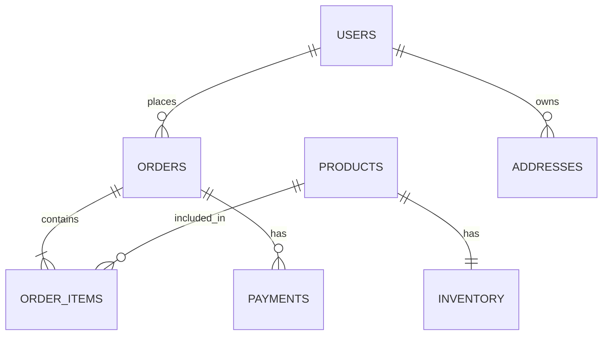

# 01- Tables Rows and Columns

## Overview

Tables, rows, and columns are the fundamental structural units of a relational database.

They appear simple at first:

```text
Database
  ↓
Table
  ↓
Rows
  ↓
Columns
```

For backend engineering, however, these concepts are more than terminology. They define how application state is represented, constrained, queried, indexed, modified, and ultimately persisted.

A backend engineer should understand not only what a table, row, or column is, but also:

- How relational data is structured.
- How rows are uniquely identified.
- How columns represent attributes.
- How data types affect storage and behavior.
- How constraints protect data integrity.
- How relationships are represented.
- How schema design affects queries and performance.
- How application models map to relational tables.
- How the database behaves as data volume grows.

The mental model should progress from:

```text
Table / Row / Column
        ↓
Keys and Constraints
        ↓
Relationships
        ↓
Schema Design
        ↓
Queries and Access Patterns
        ↓
Indexes
        ↓
Transactions and Concurrency
        ↓
Production Database Behavior
```

---

## The Relational Table

A relational table represents a structured collection of related data.

For example:

```text
users

+----+----------------------+-----------+---------------------+
| id | email                | is_active | created_at          |
+----+----------------------+-----------+---------------------+
| 1  | alice@example.com    | true      | 2026-08-01 10:00:00 |
| 2  | bob@example.com      | true      | 2026-08-02 11:30:00 |
| 3  | carol@example.com    | false     | 2026-08-03 09:15:00 |
+----+----------------------+-----------+---------------------+
```

The table has:

- **Columns** that define attributes.
- **Rows** that represent individual records.
- A schema that defines the structure and constraints.

In SQL:

```sql
CREATE TABLE users (
    id BIGINT PRIMARY KEY,
    email VARCHAR(255) NOT NULL,
    is_active BOOLEAN NOT NULL DEFAULT TRUE,
    created_at TIMESTAMPTZ NOT NULL DEFAULT CURRENT_TIMESTAMP
);
```

The database now knows the expected structure of the `users` relation.

---

## What Is a Table?

A table is a database object used to store relational data.

Conceptually:

```text
Table
├── Schema
├── Columns
├── Constraints
├── Indexes
├── Rows
└── Metadata
```

The table defines the logical structure of a particular entity or relationship represented in the database.

Typical backend tables include:

```text
users
orders
products
payments
inventory
addresses
sessions
audit_logs
```

### Why Tables Exist

Tables provide a structured way to represent persistent application state.

For example:

```text
Application entity
      ↓
Database representation
      ↓
Table
```

A Python application might have:

```python
class User:
    id: int
    email: str
    is_active: bool
```

The relational representation could be:

```text
users
├── id
├── email
└── is_active
```

The application model and database table are related, but they are not the same abstraction.

An ORM such as Django's ORM provides a mapping between them.

---

## What Is a Row?

A row represents one record in a table.

For example:

```text
users

id = 42
email = alice@example.com
is_active = true
```

can represent one user.

A row contains values corresponding to the table's columns.

```text
users
        Row
         ↓
┌────┬───────────────────┬───────────┐
│ id │ email             │ is_active │
├────┼───────────────────┼───────────┤
│ 42 │ alice@example.com │ true      │
└────┴───────────────────┴───────────┘
```

### Why Rows Exist

Rows represent individual instances of the data represented by the table.

For an `orders` table:

```text
orders
├── order 1001
├── order 1002
├── order 1003
└── order 1004
```

Each row represents one order.

### Important Engineering Detail

A row should not be thought of merely as a Python object stored in a database.

The database manages:

- Physical storage
- Visibility
- Concurrency
- Constraints
- Index relationships
- Transaction state
- Durability

The row is a logical relational concept.

---

## What Is a Column?

A column defines an attribute of the records represented by a table.

Example:

```text
users

id
email
is_active
created_at
```

Each column has properties such as:

- Name
- Data type
- Nullability
- Default value
- Constraints
- Generated behavior where supported

Example:

```sql
CREATE TABLE users (
    id BIGINT PRIMARY KEY,
    email VARCHAR(255) NOT NULL,
    is_active BOOLEAN NOT NULL DEFAULT TRUE
);
```

Here:

| Column | Type | Constraint |
|---|---|---|
| `id` | `BIGINT` | Primary key |
| `email` | `VARCHAR(255)` | `NOT NULL` |
| `is_active` | `BOOLEAN` | `NOT NULL`, default `TRUE` |

---

## Column Data Types

A column's data type determines what kind of values it can store and how those values behave.

Common categories include:

| Category | Examples |
|---|---|
| Integer | `INTEGER`, `BIGINT` |
| Decimal | `NUMERIC`, `DECIMAL` |
| Floating point | `REAL`, `DOUBLE PRECISION` |
| Boolean | `BOOLEAN` |
| Character | `CHAR`, `VARCHAR` |
| Text | `TEXT` |
| Date | `DATE` |
| Time | `TIME` |
| Timestamp | `TIMESTAMP`, `TIMESTAMPTZ` |
| Binary | Database-specific binary types |
| JSON | `JSON`, `JSONB` in PostgreSQL |
| UUID | `UUID` in PostgreSQL |

Choose data types based on domain requirements rather than convenience.

For example, monetary values should generally not be stored using floating-point types when exact decimal arithmetic is required.

Prefer:

```sql
price NUMERIC(12, 2)
```

over:

```sql
price DOUBLE PRECISION
```

for many financial use cases.

---

## Column Design Principles

A good column should represent one meaningful piece of data.

Prefer:

```text
first_name
last_name
email
created_at
```

over:

```text
user_information
```

where multiple unrelated values are embedded into one column.

The design should also distinguish between:

```text
Data that belongs together
```

and:

```text
Data that has an independent lifecycle
```

This distinction becomes important when deciding whether information belongs in the same table or a related table.

---

## Atomic Values

Relational designs generally work best when columns represent atomic values that can be independently queried and constrained.

Prefer:

```text
orders
├── id
├── customer_id
├── status
└── total_amount
```

over storing structured relational information in a single text field:

```text
order_data = "customer=42,status=paid,total=99.99"
```

The structured design allows the database to:

- Filter efficiently.
- Validate values.
- Index values.
- Join related data.
- Aggregate data.
- Enforce constraints.

This does not mean every piece of structured information must become a separate table. Modern databases such as PostgreSQL also support JSON types for appropriate use cases.

The important distinction is between **relational attributes** and **semi-structured data**.

---

## Primary Keys

A primary key uniquely identifies a row within a table.

Example:

```sql
CREATE TABLE users (
    id BIGINT PRIMARY KEY,
    email VARCHAR(255) NOT NULL
);
```

Here:

```text
id
↓
Unique identity of the row
```

A primary key:

- Must uniquely identify rows.
- Cannot contain `NULL`.
- Represents the table's primary identity.

### Why Primary Keys Matter

Backend systems constantly need to refer to specific records.

For example:

```http
GET /users/42
```

may translate to:

```sql
SELECT
    id,
    email,
    is_active
FROM users
WHERE id = 42;
```

The primary key provides a stable identity for that row.

---

## Primary Key Choices

Common choices include:

```text
INTEGER
BIGINT
UUID
```

Example with identity generation in PostgreSQL:

```sql
CREATE TABLE users (
    id BIGINT GENERATED ALWAYS AS IDENTITY PRIMARY KEY,
    email TEXT NOT NULL UNIQUE
);
```

UUIDs can also be used:

```sql
CREATE TABLE users (
    id UUID PRIMARY KEY,
    email TEXT NOT NULL UNIQUE
);
```

The choice depends on:

- Scale
- Distribution requirements
- Public API exposure
- Storage characteristics
- Index behavior
- Identifier generation strategy

Do not choose an identifier solely because it is fashionable.

---

## Natural Keys vs Surrogate Keys

A **natural key** derives from domain data.

Example:

```text
country_code
email
ISBN
```

A **surrogate key** exists primarily to identify the record.

Example:

```text
user_id = 42
```

Comparison:

| Characteristic | Natural Key | Surrogate Key |
|---|---|---|
| Derived from business data | Yes | No |
| Business meaning | Usually | Usually none |
| Stability | May change | Usually stable |
| Useful for relationships | Sometimes | Commonly |
| Typical backend usage | Select cases | Very common |

A common backend design is:

```text
Internal primary key
+
Business-level UNIQUE constraints
```

For example:

```sql
CREATE TABLE users (
    id BIGINT GENERATED ALWAYS AS IDENTITY PRIMARY KEY,
    email TEXT NOT NULL UNIQUE
);
```

Here:

```text
id
→ technical identity

email
→ business-level uniqueness
```

---

## Foreign Keys

A foreign key represents a relationship between tables.

Example:

```sql
CREATE TABLE orders (
    id BIGINT GENERATED ALWAYS AS IDENTITY PRIMARY KEY,
    user_id BIGINT NOT NULL REFERENCES users(id),
    total_amount NUMERIC(12, 2) NOT NULL
);
```

The relationship becomes:

```text
users
  │
  │ 1
  │
  │
  │ N
  ▼
orders
```

One user can have many orders.

The `orders.user_id` column references `users.id`.

---

## Why Foreign Keys Exist

Foreign keys enforce referential integrity.

Without a foreign key, the database might allow:

```text
orders.user_id = 999999
```

even if no corresponding user exists.

A foreign key can prevent this invalid relationship.

```text
users
id = 42
   ↑
   │
orders.user_id = 42
```

The database becomes responsible for protecting the relationship.

This is especially valuable in systems where multiple application components can write to the same database.

---

## One-to-Many Relationships

One-to-many is one of the most common relational patterns.

Example:

```text
User
 │
 ├── Order
 ├── Order
 └── Order
```

Schema:

```sql
CREATE TABLE orders (
    id BIGINT GENERATED ALWAYS AS IDENTITY PRIMARY KEY,
    user_id BIGINT NOT NULL REFERENCES users(id),
    total_amount NUMERIC(12, 2) NOT NULL
);
```

The foreign key is placed on the "many" side:

```text
users.id
    ↑
    │
orders.user_id
```

This pattern appears throughout backend systems:

```text
customer → orders
user → sessions
order → order_items
category → products
account → transactions
```

---

## One-to-One Relationships

One-to-one relationships are less common but useful.

Example:

```text
users
  │
  │ 1
  │
  │ 1
  ▼
user_profiles
```

A uniqueness constraint can enforce the relationship:

```sql
CREATE TABLE user_profiles (
    user_id BIGINT PRIMARY KEY REFERENCES users(id),
    display_name TEXT,
    avatar_url TEXT
);
```

Because `user_id` is itself the primary key, only one profile can exist for each user.

Use one-to-one tables when the separation provides a meaningful design benefit, such as:

- Optional data
- Different lifecycle
- Access control
- Large or rarely accessed attributes
- Different ownership
- Independent operational concerns

Do not split every group of columns into separate one-to-one tables without a reason.

---

## Many-to-Many Relationships

A many-to-many relationship requires an intermediate table.

Example:

```text
students
    │
    │
    ▼
student_courses
    ▲
    │
    │
courses
```

Schema:

```sql
CREATE TABLE students (
    id BIGINT GENERATED ALWAYS AS IDENTITY PRIMARY KEY,
    name TEXT NOT NULL
);

CREATE TABLE courses (
    id BIGINT GENERATED ALWAYS AS IDENTITY PRIMARY KEY,
    name TEXT NOT NULL
);

CREATE TABLE student_courses (
    student_id BIGINT NOT NULL REFERENCES students(id),
    course_id BIGINT NOT NULL REFERENCES courses(id),
    PRIMARY KEY (student_id, course_id)
);
```

The intermediate table represents the relationship itself.

It can also contain relationship-specific attributes:

```sql
CREATE TABLE student_courses (
    student_id BIGINT NOT NULL REFERENCES students(id),
    course_id BIGINT NOT NULL REFERENCES courses(id),
    enrolled_at TIMESTAMPTZ NOT NULL DEFAULT CURRENT_TIMESTAMP,
    grade TEXT,
    PRIMARY KEY (student_id, course_id)
);
```

This is an important relational modeling pattern.

---

## Constraints

Columns and tables can enforce rules about valid data.

Common constraints include:

```text
PRIMARY KEY
FOREIGN KEY
UNIQUE
NOT NULL
CHECK
DEFAULT
```

Example:

```sql
CREATE TABLE products (
    id BIGINT GENERATED ALWAYS AS IDENTITY PRIMARY KEY,
    sku TEXT NOT NULL UNIQUE,
    price NUMERIC(12, 2) NOT NULL CHECK (price >= 0),
    stock_quantity INTEGER NOT NULL CHECK (stock_quantity >= 0)
);
```

The database now protects several invariants:

```text
id
→ unique

sku
→ required + unique

price
→ required + non-negative

stock_quantity
→ required + non-negative
```

---

## Database Constraints vs Application Validation

Application validation and database constraints serve different purposes.

For example, Django might validate:

```python
price >= 0
```

but the database should also enforce:

```sql
CHECK (price >= 0)
```

Why?

Because data can enter the database through:

```text
Django API
Celery worker
Admin tool
Migration
Batch script
Data import
Another service
```

The database constraint protects the invariant regardless of the writer.

A useful rule is:

> Application validation improves user experience; database constraints protect data integrity.

---

## NULL and Columns

A column may allow `NULL`.

Example:

```sql
CREATE TABLE users (
    id BIGINT PRIMARY KEY,
    email TEXT NOT NULL,
    phone_number TEXT
);
```

Here:

```text
email
→ required

phone_number
→ optional
```

`NULL` means the value is unknown, missing, or not applicable according to the application's data model.

It is not equivalent to:

```text
0
''
FALSE
```

For example:

```sql
SELECT
    id
FROM users
WHERE phone_number IS NULL;
```

Use `IS NULL`, not:

```sql
WHERE phone_number = NULL;
```

NULL behavior becomes increasingly important when filtering, joining, and aggregating data.

---

## Defaults

Defaults allow the database to provide a value when the application does not specify one.

Example:

```sql
CREATE TABLE users (
    id BIGINT GENERATED ALWAYS AS IDENTITY PRIMARY KEY,
    is_active BOOLEAN NOT NULL DEFAULT TRUE,
    created_at TIMESTAMPTZ NOT NULL DEFAULT CURRENT_TIMESTAMP
);
```

Now:

```sql
INSERT INTO users
DEFAULT VALUES;
```

can produce values for `is_active` and `created_at`.

Defaults are useful for:

- Timestamps
- Status values
- Boolean flags
- Generated identifiers
- Database-level defaults

A default does not mean the application should ignore domain semantics.

The default should represent a safe and well-defined initial state.

---

## Table Schema

A table's schema describes its structure and rules.

For example:

```text
users

Columns
├── id BIGINT
├── email TEXT
├── is_active BOOLEAN
└── created_at TIMESTAMPTZ

Constraints
├── PRIMARY KEY(id)
├── UNIQUE(email)
└── NOT NULL constraints

Indexes
└── indexes supporting access patterns
```

The schema defines what the database considers valid.

Schema design therefore affects both:

```text
Correctness
```

and:

```text
Performance
```

---

## Table Design and Access Patterns

A table should not be designed independently of how the application accesses it.

Suppose an API frequently executes:

```sql
SELECT
    id,
    status,
    created_at
FROM orders
WHERE user_id = 42
ORDER BY created_at DESC
LIMIT 20;
```

The table design should account for:

```text
Filtering:
user_id

Ordering:
created_at

Result:
small subset
```

This may lead to an index such as:

```sql
CREATE INDEX idx_orders_user_created
ON orders(user_id, created_at DESC);
```

The table, query, and index are parts of one design.

---

## Wide vs Narrow Tables

A table with many columns is sometimes called a wide table.

Example:

```text
users
├── identity
├── authentication
├── profile
├── preferences
├── billing
├── analytics
├── metadata
└── ...
```

A wide table is not automatically bad.

The decision should consider:

- Access patterns
- Row size
- Update frequency
- Nullability
- Data lifecycle
- Query patterns
- Security boundaries

Sometimes splitting rarely accessed or independently managed data into another table is useful.

Do not normalize solely to make the schema "look clean."

Optimize the model for correctness, maintainability, and actual access patterns.

---

## Row Width and Storage

Columns consume storage.

For example:

```text
Small integer
    ↓
Less storage

Large text / JSON
    ↓
Potentially much larger storage
```

Larger rows can affect:

- Disk usage
- Cache efficiency
- I/O
- Network transfer
- Query performance

This does not mean "use the smallest possible type everywhere."

Choose types based on the actual domain.

For example:

```text
user ID
→ BIGINT if required by expected scale

money
→ NUMERIC

timestamp
→ appropriate timestamp type

large textual content
→ TEXT
```

Premature micro-optimization of data types can make schema design unnecessarily complicated.

---

## Table Relationships

A realistic backend database contains multiple related tables.

For example:



This structure allows the application to model:

```text
User
  ↓
Orders
  ↓
Order Items
  ↓
Products
  ↓
Inventory
```

Instead of duplicating all product information inside every order row, relationships allow the database to represent shared entities separately.

---

## Denormalization

Normalization reduces unnecessary duplication, but production systems sometimes intentionally denormalize data.

For example:

```text
orders
├── product_id
├── product_name
├── product_price
└── ...
```

might duplicate information that also exists in:

```text
products
```

This can be justified when historical correctness requires storing the value at the time of the transaction.

For example:

```text
Product current price
        ≠
Price charged on historical order
```

The order may therefore need its own `unit_price`.

Denormalization should be deliberate.

The question is not:

> "Is duplication always bad?"

The better question is:

> "What consistency and access requirements justify storing this value here?"

---

## Tables and Historical Data

Transactional systems often need to preserve historical state.

Consider:

```text
products.price
```

and:

```text
order_items.unit_price
```

If the product price changes:

```text
products.price
    ↓
Current price
```

the historical order must still represent:

```text
order_items.unit_price
    ↓
Price actually charged
```

This is an important backend modeling principle:

> Current entity state and historical transaction state often require different representations.

---

## Tables and Audit Data

Production systems often need audit information.

Example:

```sql
CREATE TABLE audit_logs (
    id BIGINT GENERATED ALWAYS AS IDENTITY PRIMARY KEY,
    actor_id BIGINT,
    action TEXT NOT NULL,
    entity_type TEXT NOT NULL,
    entity_id TEXT NOT NULL,
    created_at TIMESTAMPTZ NOT NULL DEFAULT CURRENT_TIMESTAMP
);
```

Audit tables can support:

- Security investigations
- Compliance
- Debugging
- Operational troubleshooting
- Change history

However, audit requirements should be designed carefully because audit tables can grow rapidly.

Consider:

- Retention
- Partitioning
- Indexing
- Access control
- Archival
- Sensitive data exposure

---

## Tables and Soft Deletion

Some applications represent deleted records using a flag or timestamp.

Example:

```sql
ALTER TABLE users
ADD COLUMN deleted_at TIMESTAMPTZ;
```

Then:

```sql
SELECT
    id,
    email
FROM users
WHERE deleted_at IS NULL;
```

Soft deletion can support:

- Recovery
- Auditability
- Historical references

But it introduces complexity.

Every relevant query may need to account for:

```text
deleted_at IS NULL
```

It can also affect:

- Unique constraints
- Indexes
- Storage
- Foreign keys
- Reporting

PostgreSQL partial indexes can sometimes help:

```sql
CREATE UNIQUE INDEX uq_active_user_email
ON users(email)
WHERE deleted_at IS NULL;
```

This allows active users to have unique emails while allowing historical soft-deleted records to remain.

---

## Tables and Partitioning

Very large tables may eventually require partitioning.

Conceptually:

```text
events
  │
  ├── events_2026_01
  ├── events_2026_02
  ├── events_2026_03
  └── events_2026_04
```

Partitioning can be useful for:

- Very large datasets
- Time-series workloads
- Data lifecycle management
- Partition-level maintenance
- Reducing the amount of data considered for certain queries

Partitioning is not a default requirement for large tables.

It introduces additional complexity and should be justified by workload characteristics.

---

## Tables and Indexes

A table stores the logical data.

Indexes provide additional access structures that can make specific queries faster.

For example:

```text
Table
┌──────────────────────┐
│ 1                    │
│ 2                    │
│ 3                    │
│ ...                  │
│ 1,000,000            │
└──────────────────────┘

Index
┌──────────────────────┐
│ email → row location │
└──────────────────────┘
```

A backend engineer should understand that an index is not another copy of the table in the application sense.

It is a database-managed structure optimized for particular access patterns.

Indexes also have costs:

- Storage
- Insert overhead
- Update overhead
- Delete overhead
- Maintenance

Therefore:

> More indexes do not automatically mean better performance.

---

## Table Design and Query Performance

Suppose:

```sql
SELECT
    id,
    email
FROM users
WHERE email = 'alice@example.com';
```

If `email` is declared:

```sql
email TEXT NOT NULL UNIQUE
```

the database can maintain a uniqueness structure that can also support efficient lookup.

But a query such as:

```sql
SELECT
    *
FROM users
WHERE LOWER(email) = 'alice@example.com';
```

may require different indexing depending on the database and schema.

The query shape matters.

This demonstrates an important principle:

```text
Schema
  +
Query
  +
Index
  =
Access Pattern
```

---

## Tables and ORMs

Backend frameworks frequently map application models to relational tables.

Django example:

```python
from django.db import models


class User(models.Model):
    email = models.EmailField(unique=True)
    is_active = models.BooleanField(default=True)
    created_at = models.DateTimeField(auto_now_add=True)
```

Conceptually this corresponds to:

```text
users
├── id
├── email
├── is_active
└── created_at
```

The ORM hides some SQL details, but the database still enforces:

- Types
- Constraints
- Indexes
- Relationships
- Transactions

A backend engineer should therefore understand both representations.

---

## ORM Mapping Is Not a Perfect One-to-One Abstraction

An application object may contain behavior that does not exist in the table.

For example:

```python
user.orders.all()
```

is an application-level relationship.

The database may represent it using:

```text
users.id
      ↑
      │
orders.user_id
```

The ORM translates application operations into SQL.

This is convenient, but it can hide database costs.

For example:

```python
for user in users:
    print(user.orders.count())
```

can potentially generate many queries.

Understanding tables and relationships makes these ORM behaviors easier to recognize.

---

## Table Naming

Use consistent naming conventions.

For example:

```text
users
orders
order_items
payment_attempts
audit_logs
```

Common conventions include:

- Lowercase names
- Snake case
- Singular or plural naming consistently
- Descriptive names
- Avoiding database reserved words

The specific convention matters less than consistency.

A production codebase should not contain:

```text
Users
tbl_orders
OrderItems
customer_data_table
```

without a deliberate reason.

---

## Column Naming

Prefer names that describe the value clearly.

Good:

```text
created_at
updated_at
deleted_at
user_id
total_amount
currency_code
```

Avoid ambiguous names such as:

```text
date
value
data
status_code
type
```

unless the meaning is genuinely obvious from the table context.

Timestamp columns should communicate their semantics.

For example:

```text
created_at
updated_at
processed_at
deleted_at
expires_at
```

are more useful than:

```text
time1
time2
timestamp
```

---

## Schema Evolution

Tables change as applications evolve.

For example:

```text
Initial schema
    ↓
Add created_at
    ↓
Add status
    ↓
Add index
    ↓
Add relationship
    ↓
Backfill data
    ↓
Tighten constraints
```

Schema evolution should be treated as part of application deployment.

Large production tables require special consideration when changing:

- Columns
- Constraints
- Indexes
- Data types
- Relationships

A schema change that is harmless on a development database can cause significant locking or I/O on a production table containing hundreds of millions of rows.

---

## Tables and Transactions

Rows are modified within transactions.

For example:

```sql
BEGIN;

UPDATE accounts
SET balance = balance - 100
WHERE id = 1;

UPDATE accounts
SET balance = balance + 100
WHERE id = 2;

COMMIT;
```

The table contains the logical state, but transactions determine how multiple changes become visible and durable.

A backend engineer must understand the distinction:

```text
Table
    ↓
Persistent logical state

Transaction
    ↓
Controlled unit of state transition
```

This distinction becomes critical for concurrent writes.

---

## Tables and Concurrency

Two transactions can attempt to modify the same row.

Example:

```text
Transaction A
    ↓
UPDATE inventory

Transaction B
    ↓
UPDATE inventory
```

The database must coordinate these operations according to its concurrency model.

This can involve:

- Locks
- MVCC
- Isolation levels
- Row visibility
- Conflict detection

The table definition therefore cannot be considered independently from transaction behavior.

---

## Tables and Data Lifecycle

Different tables can have very different lifecycles.

For example:

| Table | Typical Lifecycle |
|---|---|
| `users` | Long-lived |
| `orders` | Long-lived |
| `sessions` | Short-lived |
| `audit_logs` | Long-lived with retention |
| `events` | Potentially very high volume |
| `cache_entries` | Temporary |

This affects schema design and operational decisions.

High-volume event tables may require:

- Partitioning
- Retention
- Archival
- Batch processing

Long-lived transactional tables may prioritize:

- Strong constraints
- Referential integrity
- Efficient point lookups
- Reliable backups

---

## Production Considerations

### Data Growth

Ask:

```text
How many rows today?
How many rows in one year?
How many rows in five years?
```

A table containing:

```text
10,000 rows
```

behaves very differently operationally from:

```text
1,000,000,000 rows
```

Schema and index design should consider expected growth.

### Write Volume

High-write tables require careful consideration of:

- Index count
- Index size
- Lock contention
- Transaction duration
- WAL/storage behavior
- Batch operations

### Read Volume

High-read tables require:

- Efficient indexes
- Appropriate query shapes
- Bounded result sets
- Potential caching
- Read replicas where appropriate

### Retention

Not every row must live forever.

Define retention requirements for:

- Events
- Logs
- Sessions
- Audit records
- Temporary records

Retention can reduce storage and operational costs.

---

## Security Considerations

Tables frequently contain sensitive application data.

Examples include:

```text
users.email
users.phone_number
payment metadata
audit logs
authentication state
```

Protect data through:

- Least-privilege database roles
- Application authorization
- Encryption in transit
- Encryption at rest
- Controlled database access
- Appropriate logging
- Data retention policies

Do not assume that because a column exists in a table, every application component should be able to read it.

Database access should follow least privilege.

---

## Common Mistakes

### Treating Every Table as an Independent Object

Relational tables exist within a connected schema.

Always understand:

```text
What does this table represent?
What tables does it relate to?
What owns the relationship?
```

### Using Text for Everything

This loses type-level validation and can create inefficient or ambiguous queries.

Use appropriate data types.

### Missing Primary Keys

Most transactional tables should have a well-defined identity.

A table without a clear identity often becomes difficult to reference and maintain.

### Using Application Validation Without Database Constraints

Application validation can be bypassed by other writers.

Critical invariants should generally be enforced at the database level.

### Storing Relationships as Strings

Avoid designs such as:

```text
user_ids = "10,20,42,57"
```

when the values represent relational relationships.

Use foreign keys and relationship tables.

### Excessive Normalization

Splitting every attribute into separate tables can make common queries unnecessarily complex.

Normalize to maintain correctness and reduce inappropriate duplication, but design around actual access patterns.

### Excessive Denormalization

Duplicating data everywhere can create consistency problems.

Every duplicated value introduces a potential synchronization problem.

### Ignoring Data Growth

A schema that works with 10,000 rows may fail operationally at 500 million rows.

Consider growth early for important high-volume tables.

### Assuming ORM Models Are the Database

The ORM is an abstraction.

The database still determines:

- Storage
- Constraints
- Query execution
- Transactions
- Locks
- Indexes

### Adding Columns Without Considering Access Patterns

A column is not merely metadata.

It may affect:

- Row size
- Index size
- Query cost
- Storage
- Data lifecycle

---

## Interview Traps

### "A Row Is an Object"

Not exactly.

A row is a relational record. An ORM may represent it as an object, but those are different abstraction layers.

### "A Primary Key Must Be an Integer"

False.

It can be an integer, UUID, or another suitable unique non-null type.

### "Foreign Keys Are Only for Joins"

Foreign keys primarily enforce referential integrity.

They also describe relationships that are commonly used in joins.

### "Normalization Always Improves Performance"

Not necessarily.

Normalization improves data organization and integrity, but some workloads may benefit from deliberate denormalization.

### "More Indexes Always Improve Performance"

False.

Indexes accelerate some reads but increase write and storage costs.

### "NULL Means Empty"

False.

NULL represents the absence/unknown/not-applicable state according to the data model and has special SQL semantics.

---

## Practical Schema Design Checklist

Before creating a production table, ask:

### Meaning

- What real-world concept does this table represent?
- What does one row represent?
- What is the lifecycle of a row?

### Identity

- What uniquely identifies a row?
- Should the primary key be generated?
- Is there a business-level unique constraint?

### Columns

- Does each column represent a clear attribute?
- Is the data type appropriate?
- Should NULL be allowed?
- Is a default appropriate?

### Relationships

- What other tables does this table relate to?
- Is the relationship one-to-one, one-to-many, or many-to-many?
- Should foreign keys enforce it?

### Integrity

- Which invariants must always hold?
- Which should be enforced using constraints?

### Performance

- How will the table be queried?
- What are the common filters?
- What are the common joins?
- What ordering is required?
- Which indexes support those access patterns?

### Growth

- How many rows are expected?
- What is the expected write rate?
- What is the expected read rate?
- Does the data require retention or archival?

### Operations

- How will the schema evolve?
- How will migrations be performed?
- How will backups and recovery work?
- How will the table be monitored?

---

## Practical Mental Model

When designing a table, think in this order:

```text
Business Concept
      ↓
What does one row represent?
      ↓
What identifies the row?
      ↓
What attributes belong to it?
      ↓
What data types represent them?
      ↓
What values are valid?
      ↓
What relationships exist?
      ↓
What constraints protect them?
      ↓
How will the application query it?
      ↓
What indexes support those queries?
      ↓
How will the data grow?
      ↓
How will the schema evolve?
```

This prevents table design from becoming a simple exercise in listing columns.

---

## Key Takeaways

- **A table defines a relational structure, rows represent records, and columns define typed attributes**, but production database design extends beyond these basic concepts.
- **Primary keys, foreign keys, and constraints establish identity and protect data integrity**, providing guarantees that application-level validation alone cannot provide.
- **Table design should follow both domain semantics and application access patterns**, because schema, queries, indexes, and performance are tightly connected.
- **Normalization, denormalization, data types, and relationships should be deliberate engineering decisions**, driven by correctness, lifecycle, workload, and scalability requirements.
- **A senior backend engineer designs tables with future behavior in mind**, including concurrency, query performance, data growth, migrations, security, retention, and operational requirements.