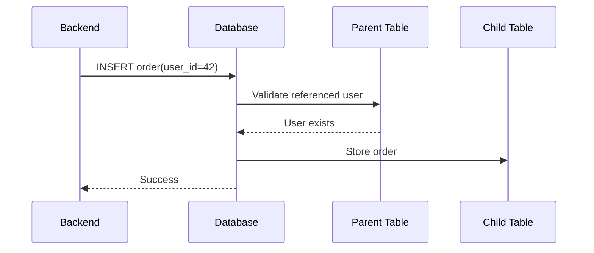
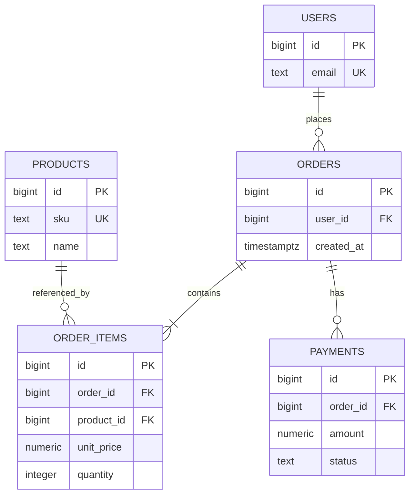

# 03- Foreign Keys

## Overview

A foreign key defines a relationship between rows in relational tables and allows the database to enforce **referential integrity**.

Consider a typical backend system:

```text
users
┌────┬──────────────────────┐
│ id │ email                │
├────┼──────────────────────┤
│ 1  │ alice@example.com    │
│ 2  │ bob@example.com      │
└────┴──────────────────────┘
          ▲
          │
          │ user_id
          │
orders
┌────┬─────────┬─────────────┐
│ id │ user_id │ total       │
├────┼─────────┼─────────────┤
│ 10 │ 1       │ 99.99       │
│ 11 │ 1       │ 49.50       │
│ 12 │ 2       │ 150.00      │
└────┴─────────┴─────────────┘
```

`orders.user_id` is a foreign key referencing `users.id`.

The database can therefore guarantee that an order cannot reference a user that does not exist, unless the schema explicitly permits a different relationship behavior such as `NULL`.

Foreign keys are fundamental to backend systems because they provide database-level guarantees around:

- Referential integrity
- One-to-many relationships
- One-to-one relationships
- Many-to-many relationships
- Cascading behavior
- Deletion semantics
- Update semantics
- Transactional consistency
- Data modeling
- Schema correctness

A useful mental model is:

```text
Parent Table
     │
     │ Primary Key
     ▼
Referenced Identity
     │
     │ Foreign Key
     ▼
Child Table
     │
     ▼
Related Row
```

---

## What Is a Foreign Key?

A foreign key is a constraint that requires values in one or more columns to correspond to a candidate key in another table, normally a primary key or suitable unique constraint.

Example:

```sql
CREATE TABLE users (
    id BIGINT GENERATED ALWAYS AS IDENTITY PRIMARY KEY,
    email TEXT NOT NULL UNIQUE
);

CREATE TABLE orders (
    id BIGINT GENERATED ALWAYS AS IDENTITY PRIMARY KEY,
    user_id BIGINT NOT NULL REFERENCES users(id),
    total_amount NUMERIC(12, 2) NOT NULL
);
```

Here:

```text
users.id
    ↑
    │ referenced key
    │
orders.user_id
    │
    └── foreign key
```

The table containing the foreign key is commonly called the **child** or **referencing** table.

The referenced table is commonly called the **parent** or **referenced** table.

---

## Why Foreign Keys Exist

Without foreign-key enforcement, an application could accidentally create invalid relationships.

Suppose:

```text
users

id
---
1
2
3
```

and:

```text
orders

id    user_id
---   -------
10    1
11    999
```

If user `999` does not exist, the second order contains a broken reference.

A foreign key prevents this:

```sql
INSERT INTO orders (user_id, total_amount)
VALUES (999, 100.00);
```

The database rejects the operation because the referenced user does not exist.

This is valuable because database writes can come from many sources:

```text
Django
FastAPI
Celery
Management scripts
Data imports
Admin tools
Batch jobs
Other services
```

Application-level validation alone cannot guarantee that every writer respects the same relationship rules.

---

## Referential Integrity

Referential integrity means that references between relational records remain valid according to the defined constraints.

For:

```sql
orders.user_id REFERENCES users(id)
```

the invariant is approximately:

```text
Every non-NULL orders.user_id
must reference an existing users.id
```

The database enforces this invariant whenever relevant rows are inserted, updated, or deleted.

This makes the database responsible for protecting an important part of the domain model.

---

## Parent and Child Tables

Consider:

```sql
CREATE TABLE customers (
    id BIGINT GENERATED ALWAYS AS IDENTITY PRIMARY KEY,
    name TEXT NOT NULL
);

CREATE TABLE orders (
    id BIGINT GENERATED ALWAYS AS IDENTITY PRIMARY KEY,
    customer_id BIGINT NOT NULL REFERENCES customers(id),
    total_amount NUMERIC(12, 2) NOT NULL
);
```

The relationship is:

```text
customers
   │
   │ 1
   │
   │
   │ N
   ▼
orders
```

`customers` is the parent table.

`orders` is the child table.

The parent contains the referenced identity:

```text
customers.id
```

The child contains the foreign key:

```text
orders.customer_id
```

---

## One-to-Many Relationships

One-to-many is the most common foreign-key relationship.

Examples:

```text
User → Orders
Customer → Addresses
Order → Order Items
Account → Transactions
Category → Products
```

Example:

```sql
CREATE TABLE users (
    id BIGINT GENERATED ALWAYS AS IDENTITY PRIMARY KEY,
    email TEXT NOT NULL UNIQUE
);

CREATE TABLE orders (
    id BIGINT GENERATED ALWAYS AS IDENTITY PRIMARY KEY,
    user_id BIGINT NOT NULL REFERENCES users(id),
    created_at TIMESTAMPTZ NOT NULL DEFAULT CURRENT_TIMESTAMP
);
```

A single user can have multiple orders:

```text
users
  42
   │
   ├── orders 100
   ├── orders 101
   └── orders 102
```

The foreign key belongs on the "many" side.

```text
users.id
   ↑
   │
orders.user_id
```

---

## One-to-One Relationships

Foreign keys can also model one-to-one relationships.

Example:

```sql
CREATE TABLE users (
    id BIGINT GENERATED ALWAYS AS IDENTITY PRIMARY KEY,
    email TEXT NOT NULL UNIQUE
);

CREATE TABLE user_profiles (
    user_id BIGINT PRIMARY KEY REFERENCES users(id),
    display_name TEXT,
    avatar_url TEXT
);
```

Because `user_id` is the primary key of `user_profiles`, the same user cannot have multiple profiles.

The constraint establishes:

```text
One user
   ↓
At most one profile
```

Without the uniqueness requirement, a foreign key alone would allow:

```text
user_id = 42
user_id = 42
user_id = 42
```

in multiple child rows, which represents one-to-many rather than one-to-one.

---

## Many-to-Many Relationships

A foreign key cannot directly represent an unrestricted many-to-many relationship using only one column.

Instead, use a junction or association table.

Example:

```sql
CREATE TABLE users (
    id BIGINT GENERATED ALWAYS AS IDENTITY PRIMARY KEY
);

CREATE TABLE roles (
    id BIGINT GENERATED ALWAYS AS IDENTITY PRIMARY KEY,
    name TEXT NOT NULL UNIQUE
);

CREATE TABLE user_roles (
    user_id BIGINT NOT NULL REFERENCES users(id),
    role_id BIGINT NOT NULL REFERENCES roles(id),
    PRIMARY KEY (user_id, role_id)
);
```

The structure becomes:

```text
users
  │
  │
  ▼
user_roles
  ▲
  │
  │
roles
```

Each foreign key represents one side of the relationship:

```text
user_roles.user_id → users.id
user_roles.role_id → roles.id
```

The composite primary key prevents duplicate relationships.

---

## Foreign Keys to UNIQUE Columns

A foreign key does not always have to reference a primary key.

It can reference an appropriate unique key.

Example:

```sql
CREATE TABLE countries (
    code CHAR(2) PRIMARY KEY,
    name TEXT NOT NULL
);

CREATE TABLE users (
    id BIGINT GENERATED ALWAYS AS IDENTITY PRIMARY KEY,
    country_code CHAR(2) NOT NULL REFERENCES countries(code)
);
```

Here:

```text
users.country_code
        ↓
countries.code
```

is valid because `countries.code` uniquely identifies a country.

The referenced key must satisfy the database's requirements for uniqueness and compatibility.

---

## Foreign-Key Column Types

The referencing and referenced columns should use compatible data types.

For example:

```sql
CREATE TABLE users (
    id BIGINT PRIMARY KEY
);

CREATE TABLE orders (
    id BIGINT PRIMARY KEY,
    user_id BIGINT NOT NULL REFERENCES users(id)
);
```

The relationship is straightforward:

```text
users.id       BIGINT
orders.user_id BIGINT
```

Avoid arbitrary type mismatches.

A primary key of:

```text
BIGINT
```

should generally have foreign keys designed appropriately for that type.

This matters because primary-key type choices propagate through the relational schema.

---

## NULL and Foreign Keys

A foreign-key column can be nullable.

Example:

```sql
CREATE TABLE orders (
    id BIGINT GENERATED ALWAYS AS IDENTITY PRIMARY KEY,
    user_id BIGINT REFERENCES users(id)
);
```

Here:

```text
user_id = NULL
```

is allowed.

This means the relationship is optional.

For example, an order may initially exist without an assigned customer.

If every order must belong to a user, use:

```sql
user_id BIGINT NOT NULL REFERENCES users(id)
```

The combination:

```text
NOT NULL
+
FOREIGN KEY
```

means:

```text
A relationship is mandatory
and
the referenced parent must exist.
```

This distinction is important in domain modeling.

---

## Optional vs Mandatory Relationships

Compare:

```sql
user_id BIGINT REFERENCES users(id)
```

with:

```sql
user_id BIGINT NOT NULL REFERENCES users(id)
```

| Definition | Meaning |
|---|---|
| Foreign key only | Relationship may be absent via `NULL` |
| `NOT NULL` + foreign key | Relationship must exist |
| Foreign key + `UNIQUE` | At most one child per parent |
| Composite foreign key | Relationship depends on multiple columns |

The database constraints should reflect the actual domain rules.

---

## Foreign-Key Actions

Foreign keys can define what happens when referenced rows are updated or deleted.

Common actions include:

```text
NO ACTION
RESTRICT
CASCADE
SET NULL
SET DEFAULT
```

Example:

```sql
CREATE TABLE orders (
    id BIGINT GENERATED ALWAYS AS IDENTITY PRIMARY KEY,
    user_id BIGINT NOT NULL
        REFERENCES users(id)
        ON DELETE RESTRICT
);
```

The action determines what happens when the parent row is deleted.

This is a critical production decision.

---

## ON DELETE RESTRICT

`RESTRICT` prevents deletion of a parent row while dependent child rows exist.

Example:

```sql
FOREIGN KEY (user_id)
REFERENCES users(id)
ON DELETE RESTRICT
```

Suppose:

```text
users.id = 42

orders.user_id
├── 100
├── 101
└── 102
```

Attempting:

```sql
DELETE FROM users
WHERE id = 42;
```

fails while those orders reference the user.

This is appropriate when the child records should prevent deletion of the parent.

Examples:

```text
Product → historical order items
Account → financial transactions
Customer → legally retained records
```

---

## ON DELETE CASCADE

`CASCADE` automatically deletes dependent child rows when the parent is deleted.

Example:

```sql
CREATE TABLE user_sessions (
    id BIGINT GENERATED ALWAYS AS IDENTITY PRIMARY KEY,
    user_id BIGINT NOT NULL
        REFERENCES users(id)
        ON DELETE CASCADE
);
```

Deleting a user:

```sql
DELETE FROM users
WHERE id = 42;
```

can automatically delete that user's sessions.

This can be appropriate for tightly owned dependent data:

```text
User
 ├── Sessions
 └── Temporary preferences
```

However, cascading deletion can be dangerous.

A single delete may trigger:

```text
user
 ↓
sessions
 ↓
related records
 ↓
additional dependent records
```

Use cascading behavior deliberately.

---

## ON DELETE SET NULL

`SET NULL` changes the foreign-key value to `NULL` when the parent is deleted.

Example:

```sql
CREATE TABLE support_tickets (
    id BIGINT GENERATED ALWAYS AS IDENTITY PRIMARY KEY,
    assigned_agent_id BIGINT
        REFERENCES users(id)
        ON DELETE SET NULL
);
```

If the assigned agent is removed:

```text
assigned_agent_id
        ↓
       NULL
```

The ticket remains.

This requires the foreign-key column to allow `NULL`.

This is appropriate when:

```text
Parent identity is optional
but
child record must survive.
```

---

## ON DELETE SET DEFAULT

`SET DEFAULT` replaces the foreign-key value with the column's default when the parent is deleted.

Example:

```sql
CREATE TABLE tasks (
    id BIGINT GENERATED ALWAYS AS IDENTITY PRIMARY KEY,
    owner_id BIGINT DEFAULT 1
        REFERENCES users(id)
        ON DELETE SET DEFAULT
);
```

This requires the resulting default value to satisfy the foreign-key constraint.

This pattern is less common than:

```text
RESTRICT
CASCADE
SET NULL
```

and should only be used when the domain has a clear default owner or fallback entity.

---

## NO ACTION vs RESTRICT

These actions are similar but have important semantic differences in databases that support deferred constraint checking.

In PostgreSQL:

- `NO ACTION` allows the constraint to be checked at the end of the statement or, for a deferrable constraint, later according to the constraint mode.
- `RESTRICT` prevents the referenced-row deletion immediately and cannot be deferred.

For most application schemas, the practical distinction is less important than deliberately choosing the desired deletion semantics.

---

## ON UPDATE

Foreign keys can also define behavior when the referenced key changes.

Example:

```sql
FOREIGN KEY (country_code)
REFERENCES countries(code)
ON UPDATE CASCADE
```

If:

```text
countries.code
```

changes, dependent foreign keys can be updated automatically.

In modern backend systems, primary keys are usually designed to be stable, so `ON UPDATE CASCADE` is less commonly needed for surrogate primary keys.

It can still be useful when natural keys are intentionally used and may change.

---

## Foreign-Key Enforcement

Conceptually, when inserting:

```sql
INSERT INTO orders (user_id, total_amount)
VALUES (42, 100.00);
```

the database must ensure that:

```text
users.id = 42
```

exists according to the transaction's visibility and constraint semantics.

Conceptually:



The actual implementation is database-specific, but the important engineering concept is:

> Referential integrity is enforced by the database, not merely by the application.

---

## Foreign Keys and Transactions

Foreign-key checks participate in transaction semantics.

Consider:

```sql
BEGIN;

INSERT INTO users (id, email)
VALUES (42, 'alice@example.com');

INSERT INTO orders (user_id, total_amount)
VALUES (42, 100.00);

COMMIT;
```

The order can reference the newly inserted user within the transaction.

If the transaction is rolled back:

```sql
ROLLBACK;
```

both changes are discarded.

This is one reason relational constraints and transactions work together so effectively.

---

## Foreign Keys and Concurrency

Foreign-key relationships must remain valid while concurrent transactions modify parent and child records.

Consider:

```text
Transaction A
    DELETE user 42

Transaction B
    INSERT order for user 42
```

The database must coordinate these operations according to its transaction and locking semantics.

This prevents concurrent operations from silently creating invalid referential states.

The exact locking behavior is database-specific, but the key principle is:

```text
Foreign-key integrity
+
Transaction isolation
+
Concurrency control
=
Consistent relationships
```

---

## Foreign Keys and Indexes

A foreign-key column should often have an index when it is frequently used for:

- Joins
- Filtering
- Parent-child lookups
- Cascading operations
- Referential checks

Example:

```sql
CREATE INDEX idx_orders_user_id
ON orders(user_id);
```

Consider:

```sql
SELECT
    o.id,
    o.total_amount
FROM orders AS o
WHERE o.user_id = 42;
```

An index on `orders.user_id` can make this access pattern efficient.

### Important PostgreSQL Consideration

PostgreSQL does not automatically create an index on the referencing foreign-key column.

It does create an index to enforce a primary key.

Therefore, this:

```sql
user_id BIGINT REFERENCES users(id)
```

does not automatically mean:

```text
orders(user_id)
```

has an index.

Whether an index is needed depends on workload, but foreign-key columns involved in frequent joins and parent-level operations commonly benefit from one.

---

## Parent Deletes and Child Indexes

Foreign-key indexes can become particularly important when deleting or updating parent rows.

Suppose:

```text
users.id = 42
```

and:

```text
orders.user_id
```

references it.

When the database needs to verify dependent rows, an index on:

```text
orders.user_id
```

can avoid inefficient scanning of the entire child table.

For large production tables, missing foreign-key indexes can therefore contribute to poor performance and increased locking behavior during parent modifications.

---

## Foreign Keys and Joins

Foreign keys naturally support relational joins.

Example:

```sql
SELECT
    users.email,
    orders.id,
    orders.total_amount
FROM users
JOIN orders
    ON orders.user_id = users.id
WHERE users.id = 42;
```

The relationship is:

```text
users.id
   ↑
   │
orders.user_id
```

The foreign key describes the relationship, while the join determines how the query retrieves data across that relationship.

A foreign key does not automatically make every join fast.

Indexes, query shape, cardinality, and database statistics still matter.

---

## Foreign Keys and Data Integrity vs Application Validation

Suppose a FastAPI endpoint accepts:

```json
{
  "user_id": 42,
  "total_amount": 100
}
```

The application might check:

```python
user = await get_user(user_id)

if user is None:
    raise HTTPException(status_code=404)
```

This is useful for producing a good API response.

But it is not sufficient as the only integrity mechanism.

Another process could simultaneously:

```text
Delete user 42
```

or another application component could insert an order.

The database foreign key provides the authoritative integrity guarantee.

A robust system often uses both:

```text
Application validation
        +
Database constraints
```

---

## Foreign Keys in Django

Django represents foreign keys using `ForeignKey`.

Example:

```python
from django.db import models


class User(models.Model):
    email = models.EmailField(unique=True)


class Order(models.Model):
    user = models.ForeignKey(
        User,
        on_delete=models.PROTECT,
        related_name="orders",
    )
    total_amount = models.DecimalField(
        max_digits=12,
        decimal_places=2,
    )
```

Conceptually:

```text
users.id
    ↑
    │
orders.user_id
```

Django's:

```python
on_delete=models.PROTECT
```

represents application/model-level deletion behavior corresponding to a restrictive relationship.

Other Django behaviors include:

```text
CASCADE
PROTECT
SET_NULL
SET_DEFAULT
DO_NOTHING
```

The ORM behavior and actual database constraint configuration should be understood separately when reasoning about production behavior.

---

## Foreign Keys in SQLAlchemy

A SQLAlchemy model may represent the same relationship using:

```python
from sqlalchemy import ForeignKey
from sqlalchemy.orm import Mapped, mapped_column


class Order(Base):
    __tablename__ = "orders"

    id: Mapped[int] = mapped_column(primary_key=True)
    user_id: Mapped[int] = mapped_column(ForeignKey("users.id"))
```

The ORM provides application-level relationship handling, but the underlying database remains responsible for enforcing the foreign-key constraint when configured and supported.

This distinction is important when debugging:

```text
ORM relationship
≠
Database constraint
```

---

## Foreign Keys Across Microservices

Foreign keys are straightforward when related data lives in the same database.

For example:

```text
users database
    │
    └── orders database
```

If `users` and `orders` are in the same relational database, a foreign key can enforce their relationship.

But if services own separate databases:

```text
User Service
    │
    ▼
User Database

Order Service
    │
    ▼
Order Database
```

a database foreign key cannot normally enforce:

```text
orders.user_id → users.id
```

across independent databases.

The system must instead use application-level mechanisms such as:

- API validation
- Events
- Data replication
- Consistency checks
- Workflow coordination

This is an important architectural trade-off.

---

## Foreign Keys and Service Boundaries

A useful rule for microservices is:

> A foreign key is strongest when the referenced data belongs to the same database consistency boundary.

If:

```text
Order Service
```

owns:

```text
orders
```

and:

```text
User Service
```

owns:

```text
users
```

then creating a database-level foreign key across those service boundaries would undermine independent ownership.

Instead:

```text
Order Service
      │
      │ Validate user
      ▼
User Service
```

or use an event-driven model.

The trade-off is that application-level relationships may become eventually consistent.

---

## Foreign Keys and Soft Deletes

Soft deletion introduces an important distinction.

Suppose:

```sql
users.deleted_at
```

marks a user as deleted.

The row still physically exists.

Therefore:

```sql
orders.user_id REFERENCES users(id)
```

still considers the user row valid.

The foreign key does not understand:

```text
deleted_at IS NULL
```

as a semantic requirement.

This means soft deletion is an application/domain concern unless additional database mechanisms are designed around it.

Do not assume a foreign key automatically prevents references to "soft-deleted" records.

---

## Foreign Keys and Audit Records

Consider:

```sql
CREATE TABLE audit_logs (
    id BIGINT GENERATED ALWAYS AS IDENTITY PRIMARY KEY,
    actor_id BIGINT,
    action TEXT NOT NULL,
    created_at TIMESTAMPTZ NOT NULL DEFAULT CURRENT_TIMESTAMP,
    FOREIGN KEY (actor_id)
        REFERENCES users(id)
        ON DELETE SET NULL
);
```

If a user is removed, the audit record survives:

```text
audit_logs.actor_id
        ↓
       NULL
```

This can be useful because audit history may need to remain even when the original user record no longer exists.

The appropriate behavior depends on retention, compliance, and domain requirements.

---

## Foreign Keys and Historical Data

Historical transactional data often should survive the deletion or deactivation of current entities.

For example:

```text
products
    ↓
order_items
```

An order item may reference the product that was purchased.

Deleting a product should not necessarily delete historical order items.

A common approach is:

```text
Product
  ↓
Order Item
```

with restrictive deletion semantics or by keeping products logically active/inactive instead of physically deleting them.

This protects historical business records.

---

## Choosing ON DELETE Behavior

Use the domain relationship to decide.

| Relationship | Typical Choice |
|---|---|
| Temporary child fully owned by parent | `CASCADE` |
| Historical record must survive | `RESTRICT` / `NO ACTION` |
| Child can survive without parent | `SET NULL` |
| Parent deletion should be impossible while children exist | `RESTRICT` |
| Child should automatically disappear with parent | `CASCADE` |
| Fallback parent exists | Potentially `SET DEFAULT` |

These are patterns, not universal rules.

Always ask:

> What should happen to the child if the parent disappears?

---

## Production Design Example

Consider an e-commerce system:



A possible implementation:

```sql
CREATE TABLE users (
    id BIGINT GENERATED ALWAYS AS IDENTITY PRIMARY KEY,
    email TEXT NOT NULL UNIQUE
);

CREATE TABLE products (
    id BIGINT GENERATED ALWAYS AS IDENTITY PRIMARY KEY,
    sku TEXT NOT NULL UNIQUE,
    name TEXT NOT NULL
);

CREATE TABLE orders (
    id BIGINT GENERATED ALWAYS AS IDENTITY PRIMARY KEY,
    user_id BIGINT NOT NULL
        REFERENCES users(id)
        ON DELETE RESTRICT,
    created_at TIMESTAMPTZ NOT NULL DEFAULT CURRENT_TIMESTAMP
);

CREATE TABLE order_items (
    id BIGINT GENERATED ALWAYS AS IDENTITY PRIMARY KEY,
    order_id BIGINT NOT NULL
        REFERENCES orders(id)
        ON DELETE CASCADE,
    product_id BIGINT NOT NULL
        REFERENCES products(id)
        ON DELETE RESTRICT,
    unit_price NUMERIC(12, 2) NOT NULL,
    quantity INTEGER NOT NULL CHECK (quantity > 0)
);

CREATE INDEX idx_orders_user_id
ON orders(user_id);

CREATE INDEX idx_order_items_order_id
ON order_items(order_id);

CREATE INDEX idx_order_items_product_id
ON order_items(product_id);
```

The deletion semantics are intentional:

```text
User
 ↓
Orders
 ↓
Order Items
```

Deleting an order can delete its owned order items.

Deleting a user is restricted because orders represent historical business records.

Deleting a product is restricted because historical order items still reference the product.

This is the type of reasoning expected in production schema design.

---

## Performance Considerations

Foreign keys provide correctness, but they also have operational costs.

### Insert Cost

When inserting a child row:

```sql
INSERT INTO orders (user_id)
VALUES (42);
```

the database may need to validate that the referenced parent exists.

### Update Cost

Updating a foreign-key value requires maintaining relationship integrity.

### Delete Cost

Deleting or updating a referenced parent can require checking dependent rows.

### Index Maintenance

Indexes on foreign-key columns improve certain access patterns but increase:

- Storage
- Write cost
- Maintenance work

The goal is not:

```text
Index every foreign key automatically
```

The goal is:

```text
Index foreign keys that support important workload patterns
```

---

## Foreign Keys and Large Tables

Suppose:

```text
users
10 million rows

orders
2 billion rows
```

A parent deletion can become operationally expensive if the child relationship is not indexed appropriately.

For example:

```sql
DELETE FROM users
WHERE id = 42;
```

If:

```text
orders.user_id
```

has no useful index, checking for dependent rows may require substantial work.

At large scale, foreign-key design must therefore be evaluated together with:

- Indexes
- Query patterns
- Delete behavior
- Batch operations
- Locking
- Transaction duration
- Partitioning
- Retention

---

## Foreign Keys and Bulk Operations

Large bulk deletes require particular care.

For example:

```sql
DELETE FROM users
WHERE created_at < CURRENT_DATE - INTERVAL '5 years';
```

If many child records exist, foreign-key enforcement and cascading behavior can result in substantial work.

Production strategies may include:

- Batch deletes
- Archival
- Partition-level operations
- Explicit dependency handling
- Controlled maintenance windows

Do not assume that a single SQL statement is operationally cheap simply because the syntax is simple.

---

## Foreign Keys and Partitioning

Very large systems may partition child tables.

For example:

```text
orders
├── orders_2026_01
├── orders_2026_02
├── orders_2026_03
└── orders_2026_04
```

Foreign-key behavior with partitioned tables depends on the database and version.

When using partitioning, verify:

- Supported foreign-key configurations
- Constraint behavior
- Index requirements
- Maintenance operations
- Partition lifecycle

Do not design partitioned foreign-key relationships based solely on conceptual diagrams.

---

## Common Mistakes

### Treating Foreign Keys as Application-Level Validation

Checking the parent in application code is not equivalent to database enforcement.

Use database constraints for critical referential integrity.

### Forgetting `NOT NULL`

A foreign key alone allows `NULL` unless the column is declared otherwise.

If every child must have a parent:

```sql
user_id BIGINT NOT NULL REFERENCES users(id)
```

### Using `CASCADE` Everywhere

Cascades can cause unexpectedly large deletes.

Choose them only when the child is genuinely owned by the parent.

### Forgetting Indexes on High-Use Foreign Keys

A foreign key does not automatically mean the child column has an index in PostgreSQL.

Evaluate the workload and add indexes where appropriate.

### Deleting Historical Parents

Deleting a product, customer, or account can conflict with historical business records.

Consider:

```text
RESTRICT
soft deletion
archival
```

instead of blindly cascading.

### Assuming Foreign Keys Work Across Databases

A foreign key normally operates within a database's supported constraint boundary.

Independent microservice databases require application-level consistency mechanisms.

### Using String IDs Without Reason

Foreign keys using large text values can increase storage and index size.

Use appropriate key types based on domain requirements.

### Ignoring Type Compatibility

Referencing and referenced columns should be designed with compatible types.

### Assuming Foreign Keys Improve Query Performance

Foreign keys enforce integrity.

They do not automatically optimize joins.

Indexes and query plans determine performance.

---

## Interview Traps

### "A Foreign Key Must Reference a Primary Key"

Not necessarily.

It can reference an appropriate unique key, depending on database rules.

### "Foreign Keys Automatically Create Indexes"

Not universally.

In PostgreSQL, the referencing column does not automatically receive an index.

### "Foreign Keys Are Only Used for Joins"

No.

Their primary purpose is referential integrity.

### "CASCADE Means Delete Only the Immediate Child"

Not necessarily.

Cascading relationships can propagate through multiple dependent tables.

### "NULL Violates a Foreign Key"

Not necessarily.

A nullable foreign-key column can contain `NULL`; `NOT NULL` is a separate constraint.

### "Soft Delete Breaks the Foreign Key"

No.

The row still physically exists, so the foreign key can remain valid.

### "Microservices Should Never Use Foreign Keys"

Too broad.

Foreign keys are useful inside a service's database boundary. The issue arises when services independently own separate databases.

### "A Foreign Key Guarantees Business Validity"

Only the relationship it actually constrains.

For example:

```sql
user_id REFERENCES users(id)
```

guarantees that the user exists according to the constraint.

It does not guarantee:

```text
User is active
User is authorized
User belongs to the same tenant
User has sufficient balance
```

Those may require additional constraints or application logic.

---

## Multi-Tenant Systems

Foreign keys require additional thought in multi-tenant schemas.

Suppose:

```text
users
├── tenant_id
└── id

orders
├── tenant_id
└── user_id
```

A simple foreign key:

```text
orders.user_id → users.id
```

may guarantee that the user exists but may not guarantee that:

```text
orders.tenant_id = users.tenant_id
```

If tenant isolation is part of the integrity model, the schema may need a composite relationship or another mechanism.

For example:

```sql
CREATE TABLE users (
    tenant_id BIGINT NOT NULL,
    id BIGINT NOT NULL,
    PRIMARY KEY (tenant_id, id)
);

CREATE TABLE orders (
    tenant_id BIGINT NOT NULL,
    id BIGINT NOT NULL,
    user_id BIGINT NOT NULL,
    PRIMARY KEY (tenant_id, id),
    FOREIGN KEY (tenant_id, user_id)
        REFERENCES users(tenant_id, id)
);
```

Now the database relationship includes tenant identity.

This is an advanced but important production consideration for shared-schema multi-tenant systems.

---

## Foreign-Key Design Checklist

Before adding a foreign key, ask:

### Relationship

- What does the relationship represent?
- Is it one-to-one, one-to-many, or many-to-many?
- Which table owns the relationship?

### Optionality

- Must the child always have a parent?
- Should the foreign-key column allow `NULL`?

### Identity

- What key is being referenced?
- Is the referenced key stable?
- Is the referenced key appropriately unique?

### Deletion

- What should happen if the parent is deleted?
- Should deletion be restricted?
- Should children cascade?
- Should the relationship become `NULL`?

### Performance

- Is the foreign-key column indexed?
- Is it used for joins or filtering?
- Could parent deletes or updates become expensive?

### Transactions

- How does the relationship behave under concurrent writes?
- Are large modifications performed inside manageable transactions?

### Architecture

- Are both tables inside the same database ownership boundary?
- If they belong to separate services, how is consistency maintained?

### Lifecycle

- Do child records outlive their parents?
- Are historical records retained?
- Is soft deletion involved?

### Multi-Tenancy

- Does tenant identity need to be part of the relationship?
- Can a child accidentally reference another tenant's parent?

---

## Key Takeaways

- **Foreign keys enforce referential integrity**, ensuring that relationships between tables remain valid at the database level.
- **The foreign-key design must reflect domain semantics**, including optionality, one-to-many vs one-to-one relationships, and what should happen when a parent is deleted.
- **`CASCADE`, `RESTRICT`, `SET NULL`, and related actions are architectural decisions**, not defaults to apply indiscriminately.
- **Foreign keys and indexes solve different problems**: constraints protect correctness, while indexes support efficient access and can be critical for large parent-child relationships.
- **Foreign-key strategy changes across service and database boundaries**, with shared relational databases enabling strong database-level integrity and independently owned microservice databases generally requiring application- or event-driven consistency.