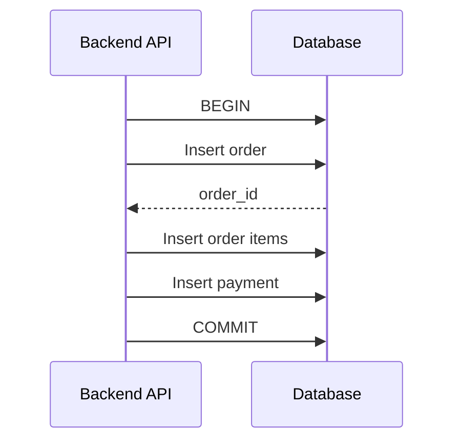
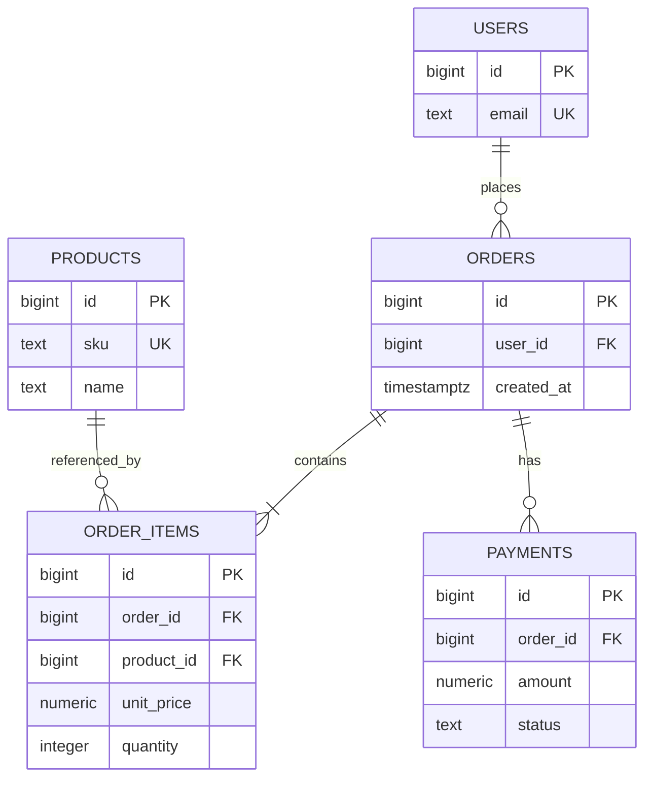

# 04- Relationships

## Overview

Relationships are the mechanism through which a relational database represents how entities are connected.

In a backend system, data rarely exists as isolated tables. A typical application may contain:

```text
users
orders
order_items
products
payments
addresses
roles
permissions
```

These entities have relationships such as:

```text
User → Orders
Order → Order Items
Product → Order Items
Order → Payment
User → Roles
Role → Permissions
```

Relational database design represents these relationships primarily through:

- Primary keys
- Foreign keys
- Unique constraints
- Composite keys
- Junction tables
- Referential actions
- Cardinality constraints

Understanding relationships is more than knowing how to write `JOIN`. It requires understanding **cardinality, ownership, integrity, optionality, lifecycle, deletion behavior, indexing, transactions, and service boundaries**.

A useful mental model is:

```text
Entity
  ↓
Table
  ↓
Primary Key
  ↓
Foreign Key
  ↓
Relationship
  ↓
Constraints + Indexes
  ↓
Queries + Transactions
```

---

## What Is a Database Relationship?

A relationship describes how rows in one table correspond to rows in another table.

For example:

```text
users
┌────┬───────────────┐
│ id │ email         │
├────┼───────────────┤
│ 1  │ alice@x.com   │
│ 2  │ bob@x.com     │
└────┴───────────────┘

orders
┌────┬─────────┬────────┐
│ id │ user_id │ total  │
├────┼─────────┼────────┤
│ 10 │ 1       │ 99.00  │
│ 11 │ 1       │ 50.00  │
│ 12 │ 2       │ 75.00  │
└────┴─────────┴────────┘
```

The relationship is:

```text
users.id
   ↑
   │
orders.user_id
```

This means:

```text
One user
   ↓
Zero or more orders
```

The relationship is implemented through a foreign key:

```sql
FOREIGN KEY (user_id)
REFERENCES users(id)
```

---

## Why Relationships Exist

Relationships prevent data from becoming duplicated, disconnected, or inconsistent.

Without relationships, an order table might contain:

```text
order_id
user_id
user_email
user_name
user_address
```

Every order would duplicate user information.

Instead:

```text
users
├── id
├── email
└── name

orders
├── id
├── user_id
└── total
```

The relationship allows the database to store each entity once and reference it where needed.

This supports:

- Reduced duplication
- Referential integrity
- Consistent updates
- Better normalization
- Clear data ownership
- Efficient joins
- Strong transactional guarantees

---

## Relationship Terminology

Several terms are important when discussing relational models.

| Term | Meaning |
|---|---|
| Parent | Referenced table |
| Child | Table containing the foreign key |
| Primary key | Identity of a row |
| Foreign key | Reference to another row |
| Cardinality | Number of related rows |
| Optionality | Whether a relationship is required |
| Junction table | Table representing many-to-many relationships |
| Referential integrity | Guarantee that references remain valid |

Example:

```text
users
  │
  │ parent
  ▼
orders
  │
  │ child
```

The exact terms may vary across database literature, but the underlying concepts are consistent.

---

## Cardinality

Cardinality describes how many records can participate in a relationship.

The three fundamental relational patterns are:

```text
One-to-One
One-to-Many
Many-to-Many
```

These should be distinguished from **optionality**.

For example:

```text
One user → many orders
```

describes cardinality.

But:

```text
A user may have zero orders
```

describes optionality.

These are separate dimensions.

---

## One-to-One Relationships

A one-to-one relationship means that one row in table A corresponds to at most one row in table B, and vice versa.

Example:

```text
users
  │
  │ 1
  │
  ▼
user_profiles
  │
  │ 1
  │
  ▼
one profile
```

A PostgreSQL implementation could be:

```sql
CREATE TABLE users (
    id BIGINT GENERATED ALWAYS AS IDENTITY PRIMARY KEY,
    email TEXT NOT NULL UNIQUE
);

CREATE TABLE user_profiles (
    user_id BIGINT PRIMARY KEY
        REFERENCES users(id),
    display_name TEXT,
    avatar_url TEXT
);
```

The important detail is:

```sql
user_id BIGINT PRIMARY KEY
```

Because `user_id` is unique in `user_profiles`, a user cannot have multiple profiles.

A foreign key alone would not create one-to-one cardinality.

---

## When to Use One-to-One

One-to-one relationships are useful when two sets of attributes have different lifecycle or access characteristics.

Examples:

```text
User → User Profile
User → Authentication Settings
Company → Company Billing Account
Order → Specialized Metadata
```

They can also be useful when:

- Sensitive data should be separated.
- Optional data should live in a separate table.
- A table would otherwise become excessively wide.
- Different components own different parts of an entity.

Do not split every entity into one-to-one tables merely because the data can technically be separated.

Every additional table introduces joins and operational complexity.

---

## One-to-Many Relationships

One-to-many is the most common relationship in relational applications.

Example:

```text
users
  │
  ├── order 101
  ├── order 102
  └── order 103
```

Schema:

```sql
CREATE TABLE users (
    id BIGINT GENERATED ALWAYS AS IDENTITY PRIMARY KEY,
    email TEXT NOT NULL UNIQUE
);

CREATE TABLE orders (
    id BIGINT GENERATED ALWAYS AS IDENTITY PRIMARY KEY,
    user_id BIGINT NOT NULL
        REFERENCES users(id),
    total_amount NUMERIC(12, 2) NOT NULL
);
```

The foreign key belongs on the **many side**:

```text
users.id
   ↑
   │
orders.user_id
```

This allows:

```text
One user → many orders
```

but each order references one user.

---

## Optional One-to-Many

A user may have no orders.

That is naturally represented by:

```text
users
  ├── zero orders
  ├── one order
  └── many orders
```

No additional constraint is necessary.

The absence of child rows represents zero related records.

---

## Mandatory Many-to-One

If every order must belong to a user:

```sql
user_id BIGINT NOT NULL
    REFERENCES users(id)
```

The two constraints mean:

```text
NOT NULL
→ an order must specify a user

FOREIGN KEY
→ that user must exist
```

This is stronger than application-level validation alone.

---

## Many-to-Many Relationships

A many-to-many relationship means:

```text
One A → many B
One B → many A
```

For example:

```text
Users ↔ Roles
```

A user may have multiple roles:

```text
Alice
 ├── admin
 ├── editor
 └── reviewer
```

A role can belong to many users:

```text
admin
 ├── Alice
 ├── Bob
 └── Carol
```

A relational database represents this through a junction table.

```sql
CREATE TABLE users (
    id BIGINT GENERATED ALWAYS AS IDENTITY PRIMARY KEY
);

CREATE TABLE roles (
    id BIGINT GENERATED ALWAYS AS IDENTITY PRIMARY KEY,
    name TEXT NOT NULL UNIQUE
);

CREATE TABLE user_roles (
    user_id BIGINT NOT NULL
        REFERENCES users(id),
    role_id BIGINT NOT NULL
        REFERENCES roles(id),
    PRIMARY KEY (user_id, role_id)
);
```

The structure is:

```text
users
  │
  │ 1
  ▼
user_roles
  ▲
  │ 1
  │
roles
```

The junction table converts:

```text
many-to-many
```

into two:

```text
one-to-many
```

relationships.

---

## Why Junction Tables Exist

A relational table represents rows and columns.

A many-to-many relationship cannot be represented cleanly by placing a list of IDs into one relational column.

Avoid:

```text
user_id | role_ids
--------|----------------
1       | 1,3,7
```

or:

```text
role_ids = [1, 3, 7]
```

as a substitute for a proper relational relationship when normalized relational behavior is required.

Instead:

```text
user_roles

user_id | role_id
--------|--------
1       | 1
1       | 3
1       | 7
```

Each relationship becomes its own row.

This makes the relationship:

- Queryable
- Constraint-enforceable
- Indexable
- Transactional
- Extensible

---

## Relationship Attributes

A junction table is particularly useful when the relationship itself has attributes.

For example:

```text
employee ↔ project
```

The relationship may contain:

```text
assigned_at
role
hourly_rate
allocation_percentage
```

Schema:

```sql
CREATE TABLE project_assignments (
    employee_id BIGINT NOT NULL
        REFERENCES employees(id),
    project_id BIGINT NOT NULL
        REFERENCES projects(id),
    role TEXT NOT NULL,
    assigned_at TIMESTAMPTZ NOT NULL DEFAULT CURRENT_TIMESTAMP,
    PRIMARY KEY (employee_id, project_id)
);
```

Now the relationship is a first-class entity.

This is often a signal that a junction table is the correct modeling choice.

---

## Self-Referential Relationships

A table can reference itself.

For example, an employee can have a manager who is also an employee.

```sql
CREATE TABLE employees (
    id BIGINT GENERATED ALWAYS AS IDENTITY PRIMARY KEY,
    name TEXT NOT NULL,
    manager_id BIGINT
        REFERENCES employees(id)
);
```

The relationship is:

```text
employees
   │
   └── manager_id
          │
          ▼
     employees.id
```

Example:

```text
Alice
  │
  └── Bob
       │
       └── Carol
```

where each employee points to their manager.

Self-referential relationships are useful for:

- Organizational hierarchies
- Categories
- Comment threads
- Referral trees
- Parent-child structures

---

## Hierarchical Data

Self-referential relationships create hierarchical structures.

Example:

```text
Company
└── Engineering
    ├── Backend
    │   ├── Team A
    │   └── Team B
    └── Platform
```

A simple adjacency-list model stores:

```text
id
parent_id
```

For example:

```sql
CREATE TABLE categories (
    id BIGINT GENERATED ALWAYS AS IDENTITY PRIMARY KEY,
    name TEXT NOT NULL,
    parent_id BIGINT REFERENCES categories(id)
);
```

This model is simple and flexible.

However, querying an entire hierarchy can require recursive queries or alternative modeling strategies.

For simple parent-child structures, this approach is often sufficient.

For deeply nested or heavily read-oriented hierarchies, other models may be considered.

---

## Recursive Queries

PostgreSQL supports recursive CTEs for hierarchical relationships.

Example:

```sql
WITH RECURSIVE category_tree AS (
    SELECT
        id,
        name,
        parent_id,
        0 AS depth
    FROM categories
    WHERE id = 1

    UNION ALL

    SELECT
        c.id,
        c.name,
        c.parent_id,
        ct.depth + 1
    FROM categories AS c
    JOIN category_tree AS ct
        ON c.parent_id = ct.id
)
SELECT
    id,
    name,
    parent_id,
    depth
FROM category_tree
ORDER BY depth, id;
```

This is useful when the hierarchy itself is part of the query requirement.

The recursive CTE belongs conceptually to SQL querying, but understanding the underlying relationship is essential for using it correctly.

---

## Relationship Optionality

Cardinality and optionality should be modeled independently.

Consider:

```text
Customer → Address
```

Possible business rules include:

```text
Every customer must have one address.
```

or:

```text
A customer may have zero or one address.
```

or:

```text
A customer may have many addresses.
```

These produce different schemas.

### Mandatory One-to-One

```sql
customer_id BIGINT PRIMARY KEY
    REFERENCES customers(id)
```

### Optional One-to-One

```sql
customer_id BIGINT PRIMARY KEY
    REFERENCES customers(id)
```

with the parent row simply not having a child row.

### One-to-Many

```sql
customer_id BIGINT NOT NULL
    REFERENCES customers(id)
```

in the child table.

The schema should represent the actual business invariant rather than merely the application UI behavior.

---

## Relationship Ownership

A useful design question is:

> Which entity owns the lifecycle of the related record?

Consider:

```text
Order → Order Items
```

Order items generally belong to an order.

This often suggests:

```sql
order_id BIGINT NOT NULL
    REFERENCES orders(id)
    ON DELETE CASCADE
```

because an order item has little independent meaning after the order is removed.

Contrast that with:

```text
Order → Product
```

A product is an independent entity.

Deleting an order should not delete the product.

This usually suggests restrictive behavior:

```sql
product_id BIGINT NOT NULL
    REFERENCES products(id)
    ON DELETE RESTRICT
```

Ownership is therefore a useful way to reason about referential actions.

---

## Relationship Lifecycle

For every relationship, consider its lifecycle.

Example:

```text
User
  ↓
Session
```

Sessions are typically dependent on users.

Possible lifecycle:

```text
User created
    ↓
Session created
    ↓
User remains
    ↓
Session expires
```

Another example:

```text
User
  ↓
Order
```

An order may need to survive the user's lifecycle because it represents historical business data.

Therefore, the correct deletion behavior may be:

```text
User deletion
    ↓
Orders remain
```

rather than:

```text
User deletion
    ↓
Orders deleted
```

The same relationship cardinality can therefore have very different lifecycle semantics.

---

## Referential Actions

Foreign keys can specify what happens when the referenced row is deleted or updated.

Common actions include:

| Action | Behavior |
|---|---|
| `RESTRICT` | Prevents the parent modification when dependent rows exist |
| `NO ACTION` | Allows constraint checking according to transaction/constraint semantics |
| `CASCADE` | Propagates the delete/update |
| `SET NULL` | Removes the relationship by setting the FK to `NULL` |
| `SET DEFAULT` | Replaces the FK with its default value |

Example:

```sql
CREATE TABLE order_items (
    id BIGINT GENERATED ALWAYS AS IDENTITY PRIMARY KEY,
    order_id BIGINT NOT NULL
        REFERENCES orders(id)
        ON DELETE CASCADE
);
```

Deleting an order can delete its owned items.

---

## Choosing CASCADE

Use `CASCADE` when the child is genuinely dependent on the parent.

Typical examples:

```text
Order → Order Items
User → Temporary Sessions
Document → Document Metadata
Shopping Cart → Cart Items
```

A useful test is:

> Does the child have meaningful independent existence after the parent disappears?

If the answer is no, cascading may be appropriate.

Do not use `CASCADE` simply because it makes deletes easier.

---

## Choosing RESTRICT

Use restrictive behavior when child records should prevent deletion of the parent.

Examples:

```text
Product → Historical Order Items
Account → Financial Transactions
Customer → Legal Records
```

This protects historical or important business data.

A failed deletion forces the application or operator to explicitly decide what should happen.

That is often preferable to silently deleting data.

---

## Choosing SET NULL

Use `SET NULL` when the child should survive but the relationship itself is optional.

Example:

```sql
CREATE TABLE support_tickets (
    id BIGINT GENERATED ALWAYS AS IDENTITY PRIMARY KEY,
    assigned_agent_id BIGINT
        REFERENCES users(id)
        ON DELETE SET NULL
);
```

If the agent is removed:

```text
ticket
  ↓
assigned_agent_id = NULL
```

The ticket survives.

The column must permit `NULL`.

---

## Relationship Constraints

Relationships are not fully defined by foreign keys alone.

Consider:

```text
User → Role
```

You may need:

```text
Foreign key
+
Uniqueness
+
NOT NULL
```

Example:

```sql
CREATE TABLE user_roles (
    user_id BIGINT NOT NULL REFERENCES users(id),
    role_id BIGINT NOT NULL REFERENCES roles(id),
    PRIMARY KEY (user_id, role_id)
);
```

This guarantees:

```text
User exists
Role exists
User-role relationship is unique
Neither relationship endpoint is NULL
```

Constraints should encode important invariants as close to the data as practical.

---

## Relationships and Unique Constraints

Suppose you want:

```text
One user → one profile
```

This is not sufficient:

```sql
user_id BIGINT REFERENCES users(id)
```

Multiple profiles could still reference the same user.

You need uniqueness:

```sql
user_id BIGINT UNIQUE
    REFERENCES users(id)
```

or:

```sql
user_id BIGINT PRIMARY KEY
    REFERENCES users(id)
```

This illustrates a general principle:

> Cardinality often requires more than a foreign key.

---

## Relationships and Composite Keys

Some relationships naturally require multiple columns.

Consider multi-tenant data:

```text
tenant_id
user_id
```

The combination may identify the user within the tenant.

A relationship can therefore be represented using a composite foreign key:

```sql
CREATE TABLE users (
    tenant_id BIGINT NOT NULL,
    id BIGINT NOT NULL,
    PRIMARY KEY (tenant_id, id)
);

CREATE TABLE orders (
    tenant_id BIGINT NOT NULL,
    id BIGINT NOT NULL,
    user_id BIGINT NOT NULL,
    PRIMARY KEY (tenant_id, id),
    FOREIGN KEY (tenant_id, user_id)
        REFERENCES users(tenant_id, id)
);
```

This can prevent a child row from accidentally referencing a parent belonging to another tenant.

---

## Relationships and JOINs

A relationship defines how tables correspond.

A `JOIN` retrieves data across that relationship.

Example:

```sql
SELECT
    u.email,
    o.id AS order_id,
    o.total_amount
FROM users AS u
JOIN orders AS o
    ON o.user_id = u.id
WHERE u.id = 42;
```

The relationship is:

```text
orders.user_id → users.id
```

The query uses:

```sql
ON o.user_id = u.id
```

Do not confuse the concepts:

```text
Foreign key
→ integrity

JOIN
→ data retrieval
```

A table can be joined even without a declared foreign key, and a foreign key does not automatically make joins fast.

---

## INNER JOIN and Relationships

An `INNER JOIN` returns matching rows from both sides.

```sql
SELECT
    u.id,
    u.email,
    o.id AS order_id
FROM users AS u
INNER JOIN orders AS o
    ON o.user_id = u.id;
```

Users without orders are excluded.

Conceptually:

```text
Users
  +
Orders
  ↓
Only matching relationships
```

---

## LEFT JOIN and Relationships

A `LEFT JOIN` preserves rows from the left side even when no child exists.

```sql
SELECT
    u.id,
    u.email,
    o.id AS order_id
FROM users AS u
LEFT JOIN orders AS o
    ON o.user_id = u.id;
```

This is useful for:

```text
Find all users
including users with zero orders
```

The result can contain:

```text
user_id | order_id
--------|---------
1       | 101
1       | 102
2       | NULL
```

The `NULL` means no matching child row was found.

---

## JOIN Cardinality and Duplicate Rows

A common production mistake is misunderstanding one-to-many joins.

Suppose:

```text
User 42
 ├── Order 100
 ├── Order 101
 └── Order 102
```

This query:

```sql
SELECT u.*
FROM users AS u
JOIN orders AS o
    ON o.user_id = u.id
WHERE u.id = 42;
```

returns the user row multiple times.

The database is not duplicating the stored user.

The join result contains one result row per matching relationship.

This matters when writing:

```text
COUNT
DISTINCT
Pagination
Aggregations
ORM queries
```

---

## Relationship Multiplication

Consider:

```text
User
 ├── Orders
 └── Addresses
```

Suppose:

```text
1 user
3 orders
2 addresses
```

Joining both child tables can produce:

```text
3 × 2 = 6
```

rows for that user.

Example:

```sql
SELECT
    u.id,
    o.id AS order_id,
    a.id AS address_id
FROM users AS u
LEFT JOIN orders AS o
    ON o.user_id = u.id
LEFT JOIN addresses AS a
    ON a.user_id = u.id
WHERE u.id = 42;
```

This is a common source of incorrect aggregates.

When aggregating across multiple one-to-many relationships, consider:

- Pre-aggregation
- `COUNT(DISTINCT ...)`
- Separate queries
- Subqueries
- CTEs
- Window functions where appropriate

The correct solution depends on the query.

---

## Relationship Indexing

Relationships should be designed together with indexes.

Suppose:

```sql
CREATE TABLE orders (
    id BIGINT PRIMARY KEY,
    user_id BIGINT NOT NULL REFERENCES users(id)
);
```

If the application frequently executes:

```sql
SELECT *
FROM orders
WHERE user_id = 42;
```

an index is usually appropriate:

```sql
CREATE INDEX idx_orders_user_id
ON orders(user_id);
```

The foreign key provides:

```text
Correctness
```

The index provides:

```text
Efficient access
```

These are separate concerns.

---

## Composite Relationship Indexes

Sometimes relationship queries filter on more than the foreign key.

For example:

```sql
SELECT *
FROM orders
WHERE user_id = 42
  AND status = 'completed'
ORDER BY created_at DESC;
```

A workload-specific index may be appropriate:

```sql
CREATE INDEX idx_orders_user_status_created
ON orders(user_id, status, created_at DESC);
```

Index design should follow actual query patterns rather than simply creating one index per relationship.

---

## Relationship Direction

A foreign key establishes a reference from child to parent:

```text
orders.user_id
        ↓
users.id
```

But application navigation can work in both directions.

You can ask:

```text
Which user owns this order?
```

or:

```text
Which orders belong to this user?
```

The database stores the relationship through the foreign key, while SQL joins allow either traversal direction.

---

## Relationships in ORMs

Modern backend frameworks often expose relationships as objects.

Django:

```python
class User(models.Model):
    email = models.EmailField(unique=True)


class Order(models.Model):
    user = models.ForeignKey(
        User,
        on_delete=models.PROTECT,
        related_name="orders",
    )
```

Application code can then access:

```python
order.user
```

or:

```python
user.orders.all()
```

The ORM makes relationship traversal convenient, but the underlying model remains:

```text
users.id
      ↑
orders.user_id
```

Understanding the SQL remains essential for performance.

---

## ORM Relationships and the N+1 Problem

Consider:

```python
orders = Order.objects.all()

for order in orders:
    print(order.user.email)
```

Depending on ORM behavior, this can result in:

```text
1 query for orders
+
N queries for users
```

For 1,000 orders:

```text
1 + 1,000 queries
```

This is the classic N+1 query problem.

Django can solve this with:

```python
orders = Order.objects.select_related("user")
```

The ORM can generate a join so that related data is retrieved efficiently.

The underlying lesson is:

> Database relationships are not expensive by themselves; inefficient access patterns are.

---

## Relationships and Transactions

Relationships frequently participate in multi-step transactions.

Example:

```text
Create Order
   ↓
Create Order Items
   ↓
Create Payment Record
```

A transaction may ensure that these changes succeed or fail together.

Conceptually:



If an operation fails:

```text
ROLLBACK
```

can restore the database to its previous consistent state.

Foreign keys and transactions complement each other:

```text
Foreign keys
→ relationship integrity

Transactions
→ atomic state transitions
```

---

## Relationships and Concurrency

Consider two concurrent requests:

```text
Request A
    ↓
Delete customer

Request B
    ↓
Create order for customer
```

The database must preserve referential integrity under concurrent execution.

Foreign keys participate in the database's transaction and locking mechanisms.

The exact behavior depends on:

- Database engine
- Transaction isolation
- Constraint configuration
- Locking
- Statement order

Production systems should not assume that application-level checks alone are race-condition-safe.

---

## Relationships Across Microservices

Foreign keys work naturally when related tables share a database consistency boundary.

For example:

```text
users
orders
payments
```

may all belong to one relational database.

But microservices often use:

```text
User Service
   ↓
User DB

Order Service
   ↓
Order DB
```

A database foreign key generally cannot enforce:

```text
order.user_id → users.id
```

across independently owned databases.

The relationship must instead be managed through mechanisms such as:

- Service APIs
- Events
- Local projections
- Application validation
- Reconciliation
- Distributed workflows

This changes the consistency model.

---

## Strong vs Eventual Relationship Consistency

Within one relational database:

```text
Foreign key
+
Transaction
```

can provide strong consistency around a relationship.

Across service-owned databases:

```text
Order Service
      │
      │ event/API
      ▼
User Service
```

the relationship may become eventually consistent.

For example:

```text
User created
   ↓
UserCreated event
   ↓
Order service updates local projection
```

This architectural choice should be deliberate.

Do not create distributed foreign-key-like dependencies accidentally through service calls.

---

## Relationships and Soft Deletes

Soft deletion means the row remains physically present:

```text
deleted_at = timestamp
```

A foreign key still sees the row as existing.

For example:

```sql
users
-----
id
deleted_at
```

and:

```sql
orders.user_id
```

can still reference a user whose:

```text
deleted_at IS NOT NULL
```

The database foreign key does not automatically understand business semantics such as:

```text
active user
```

If active-only relationships are required, additional application or database design may be necessary.

---

## Relationships and Historical Records

Historical records frequently require special relationship handling.

Consider:

```text
products
    ↓
order_items
```

An order item may need to retain information about a product even after the product is no longer sold.

Possible approaches include:

```text
Keep product row
+
Mark product inactive
```

or:

```text
Store historical snapshot fields
```

such as:

```text
product_name
unit_price
tax_rate
```

inside the order item.

Do not assume a foreign key alone solves historical data requirements.

A foreign key answers:

```text
Does this referenced row exist?
```

It does not answer:

```text
What did this entity look like when the transaction occurred?
```

---

## Relationships and Data Ownership

A strong schema starts by identifying ownership.

Consider:

```text
Order
 └── Order Items
```

Order items are generally owned by the order.

But:

```text
Order
 └── Product
```

does not imply that the order owns the product.

The product is independently managed.

This difference affects:

- Delete behavior
- Update behavior
- Lifecycle
- Transactions
- API boundaries
- Data retention

Relationship modeling should therefore begin with domain semantics, not merely table structure.

---

## Relationship Design Process

When modeling a new relationship, work through the following sequence.

### Identify the Entities

Determine what independent concepts exist.

Example:

```text
Customer
Order
Product
Payment
```

### Determine Cardinality

Ask:

```text
One-to-one?
One-to-many?
Many-to-many?
Self-referential?
```

### Determine Optionality

Ask:

```text
Must the relationship exist?
Can it be NULL?
Can the child simply be absent?
```

### Determine Ownership

Ask:

```text
Who owns the lifecycle?
Can the child exist independently?
```

### Define Constraints

Choose:

```text
PRIMARY KEY
FOREIGN KEY
NOT NULL
UNIQUE
CHECK
```

### Define Delete Semantics

Choose deliberately:

```text
CASCADE
RESTRICT
NO ACTION
SET NULL
SET DEFAULT
```

### Design Indexes

Look at:

```text
JOINs
WHERE clauses
ORDER BY
parent deletes
high-volume access patterns
```

### Consider Transactions

Determine whether changes to related entities must occur atomically.

### Consider Service Boundaries

If entities belong to different services, determine how consistency will be maintained without a database-level foreign key.

---

## Production Example

Consider an e-commerce schema:



A possible implementation:

```sql
CREATE TABLE users (
    id BIGINT GENERATED ALWAYS AS IDENTITY PRIMARY KEY,
    email TEXT NOT NULL UNIQUE
);

CREATE TABLE products (
    id BIGINT GENERATED ALWAYS AS IDENTITY PRIMARY KEY,
    sku TEXT NOT NULL UNIQUE,
    name TEXT NOT NULL
);

CREATE TABLE orders (
    id BIGINT GENERATED ALWAYS AS IDENTITY PRIMARY KEY,
    user_id BIGINT NOT NULL
        REFERENCES users(id)
        ON DELETE RESTRICT,
    created_at TIMESTAMPTZ NOT NULL DEFAULT CURRENT_TIMESTAMP
);

CREATE TABLE order_items (
    id BIGINT GENERATED ALWAYS AS IDENTITY PRIMARY KEY,
    order_id BIGINT NOT NULL
        REFERENCES orders(id)
        ON DELETE CASCADE,
    product_id BIGINT NOT NULL
        REFERENCES products(id)
        ON DELETE RESTRICT,
    unit_price NUMERIC(12, 2) NOT NULL,
    quantity INTEGER NOT NULL CHECK (quantity > 0)
);

CREATE TABLE payments (
    id BIGINT GENERATED ALWAYS AS IDENTITY PRIMARY KEY,
    order_id BIGINT NOT NULL
        REFERENCES orders(id)
        ON DELETE RESTRICT,
    amount NUMERIC(12, 2) NOT NULL,
    status TEXT NOT NULL
);

CREATE INDEX idx_orders_user_id
    ON orders(user_id);

CREATE INDEX idx_order_items_order_id
    ON order_items(order_id);

CREATE INDEX idx_order_items_product_id
    ON order_items(product_id);

CREATE INDEX idx_payments_order_id
    ON payments(order_id);
```

The design reflects domain semantics:

```text
User
  ↓
Orders
```

Orders should survive normal user deletion because they represent historical business data.

```text
Order
  ↓
Order Items
```

Order items are dependent on their order, so cascading deletion is reasonable if orders themselves are allowed to be deleted.

```text
Product
  ↓
Order Items
```

Historical order items should not disappear merely because a product is removed, so deletion is restricted.

This is relationship design as a business and operational decision, not merely a database syntax exercise.

---

## Common Mistakes

### Confusing Cardinality With Optionality

These are different:

```text
One-to-many
```

and:

```text
Optional relationship
```

A one-to-many relationship can allow zero, one, or many children.

### Assuming Foreign Key Means One-to-One

A foreign key alone usually permits many child rows to reference the same parent.

Use:

```text
UNIQUE
```

or:

```text
PRIMARY KEY
```

on the child foreign key when one-to-one cardinality is required.

### Putting the Foreign Key on the Wrong Side

For:

```text
User → Orders
```

the foreign key normally belongs in:

```text
orders.user_id
```

because many orders reference one user.

### Storing Lists of IDs in a Column

Avoid:

```text
role_ids = "1,3,7"
```

when the relationship should be relational.

Use a junction table.

### Cascading Deletes Blindly

`CASCADE` can remove large amounts of related data.

Always understand the complete dependency graph.

### Forgetting Foreign-Key Indexes

In PostgreSQL, creating a foreign key does not automatically create an index on the referencing column.

High-volume relationships often need explicit indexes.

### Ignoring Join Multiplication

Joining multiple one-to-many relationships can produce a Cartesian-like multiplication of result rows.

This can produce incorrect aggregates.

### Assuming ORM Relationships Are Free

Convenient relationship access can produce N+1 queries.

Always understand the SQL generated by the ORM.

### Treating Soft Deletes as Physical Deletes

A soft-deleted row still exists from the foreign key's perspective.

### Assuming Relationships Guarantee Business Rules

A foreign key can guarantee:

```text
Referenced row exists
```

It does not automatically guarantee:

```text
Referenced user is active
Referenced user belongs to the correct tenant
Referenced product is purchasable
```

Additional constraints or application logic may be required.

### Creating Cross-Service Foreign-Key Dependencies

Independent service databases should not be tightly coupled through relationships they cannot enforce transactionally.

---

## Interview Traps

### "One-to-Many Means One Parent Must Have at Least One Child"

False.

One-to-many commonly means:

```text
One parent
→ zero or more children
```

Minimum cardinality is a separate concern.

### "A Foreign Key Creates an Index"

Not necessarily.

In PostgreSQL, the referencing side does not automatically receive an index.

### "A Foreign Key Creates a Relationship in the Query"

No.

The foreign key defines an integrity constraint.

`JOIN` determines how data is retrieved.

### "Many-to-Many Requires an Array Column"

No.

The normalized relational representation is usually a junction table.

### "CASCADE Is Always Safer"

False.

`CASCADE` can cause extensive and irreversible data deletion.

### "One-to-One Requires Two Foreign Keys"

No.

A single foreign key with an appropriate uniqueness constraint can enforce one-to-one cardinality.

### "Soft Delete Removes the Relationship"

No.

The referenced row still physically exists.

### "Foreign Keys Work Across Microservice Databases"

Generally no.

Independent databases require other consistency mechanisms.

### "A Relationship Guarantees Business Validity"

No.

Foreign keys enforce referential existence, not arbitrary business rules.

### "JOINs Require Foreign Keys"

No.

SQL can join tables based on arbitrary expressions.

A declared foreign key is about integrity, not whether SQL permits a join.

---

## Security Considerations

Relationships can affect authorization in multi-tenant and resource-owned systems.

Suppose:

```text
tenant
  ↓
user
  ↓
order
```

An API request:

```http
GET /orders/123
```

should not merely verify:

```text
order.id = 123
```

It may also need to verify:

```text
order belongs to the authenticated tenant
```

A simple foreign key:

```text
orders.user_id → users.id
```

does not necessarily enforce tenant isolation.

For shared-schema multi-tenancy, relationship constraints may need to include tenant identity.

Security should therefore be considered at multiple levels:

```text
Database constraints
        +
Application authorization
        +
Tenant isolation
```

Do not treat referential integrity as authorization.

---

## Scalability Considerations

As tables grow, relationship design increasingly affects performance.

Important considerations include:

### Index Size

Foreign keys are often repeated across large child tables.

Use appropriately sized key types.

### Join Selectivity

Highly selective relationships can be efficient with appropriate indexes.

### Hot Parents

Some parent records may have extremely large numbers of children.

For example:

```text
one customer
→ millions of events
```

Queries and indexes should account for this distribution.

### Cascading Operations

Large cascades can create:

- Long-running transactions
- Lock contention
- Large WAL volume
- Replication lag
- Operational risk

### Distributed Systems

At sufficiently large architectural boundaries, enforcing every relationship in one database may no longer be practical.

The system may instead use:

```text
Local constraints
+
Events
+
Idempotency
+
Reconciliation
```

---

## Operational Considerations

Relationships should be considered during:

- Schema migrations
- Bulk imports
- Data cleanup
- Backfills
- Archival
- Disaster recovery
- Replication
- Database restores

For example, loading child records before their parent records can violate foreign-key constraints.

A migration may therefore require:

```text
Parent data
    ↓
Child data
    ↓
Constraints
```

or a carefully designed staged migration.

When disabling constraints during operational work, understand the risk of introducing invalid data and ensure integrity is re-established and verified afterward.

---

## Relationship Design Checklist

Before finalizing a relationship, ask:

### Modeling

- What entities are being related?
- What does the relationship mean?
- Is it one-to-one, one-to-many, many-to-many, or hierarchical?

### Cardinality

- Can one parent have multiple children?
- Can one child reference multiple parents?
- Is uniqueness required?

### Optionality

- Can the relationship be absent?
- Should the foreign key allow `NULL`?

### Ownership

- Does the child depend on the parent?
- Can the child exist independently?

### Integrity

- Is a foreign key required?
- Is `NOT NULL` required?
- Is a `UNIQUE` constraint required?
- Are composite keys needed?

### Lifecycle

- What happens when the parent is deleted?
- Should data cascade?
- Should the relationship become `NULL`?
- Should deletion be blocked?

### Performance

- How will the relationship be queried?
- Does the child foreign key need an index?
- Are composite indexes required?
- Could joins multiply result rows?

### Application

- How will the ORM load the relationship?
- Could the design produce N+1 queries?
- Is eager loading required?

### Architecture

- Do both entities belong to the same database?
- If not, how is consistency maintained?
- Does the relationship cross a microservice boundary?

### Security

- Does the relationship participate in tenant isolation?
- Does resource ownership affect authorization?

---

## Key Takeaways

- **Relational relationships describe how entities correspond**, with one-to-one, one-to-many, many-to-many, and hierarchical relationships being the core patterns.
- **Cardinality, optionality, ownership, and lifecycle are separate design decisions** and should be explicitly modeled rather than inferred from application behavior.
- **Foreign keys provide integrity, while JOINs provide retrieval**; neither automatically guarantees query performance, business validity, or authorization.
- **Junction tables, uniqueness constraints, indexes, and referential actions complete relationship design** for real production schemas.
- **At service boundaries, database relationships may give way to API-, event-, and reconciliation-based consistency**, making architectural ownership as important as SQL schema design.