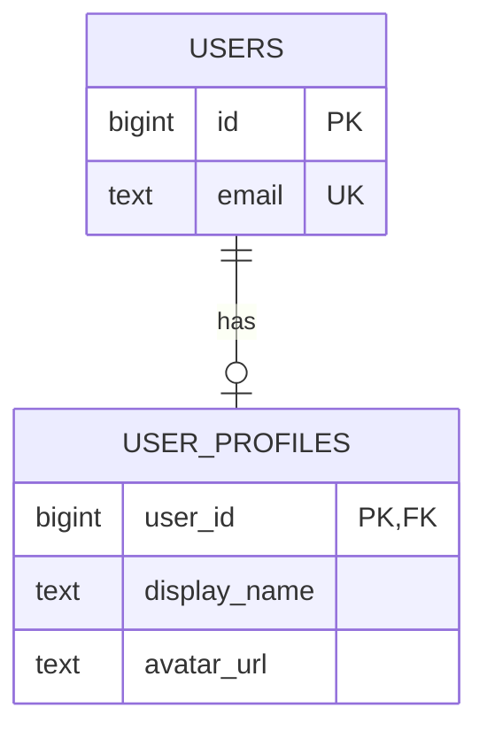
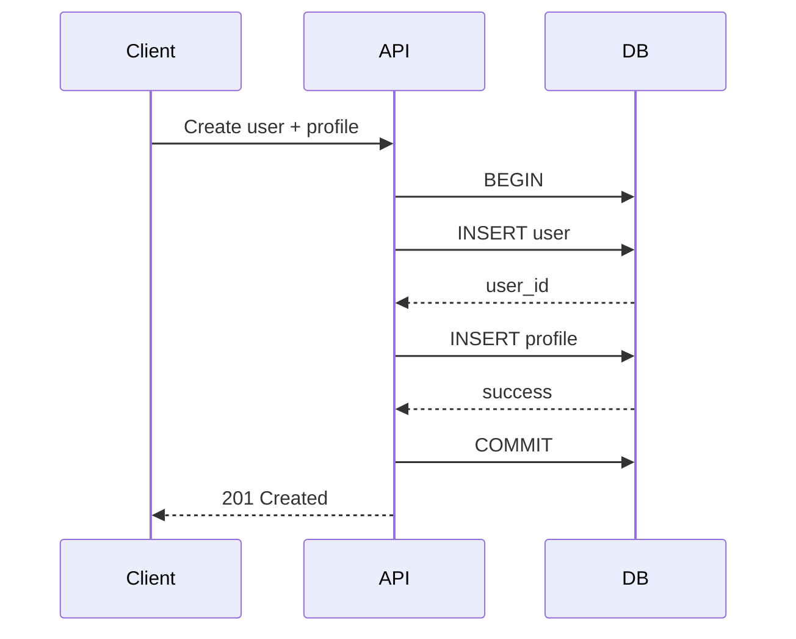

# 05- One-to-One Relationships

## Overview

A one-to-one relationship exists when a row in one table corresponds to **at most one row** in another table, and the related row corresponds back to at most one row in the first table.

The important part is not the phrase "one-to-one" itself. The database must enforce the uniqueness that makes the relationship one-to-one.

A basic example is:

```text
users
┌────┬───────────────────┐
│ id │ email             │
├────┼───────────────────┤
│ 1  │ alice@example.com │
│ 2  │ bob@example.com   │
└────┴───────────────────┘

user_profiles
┌─────────┬──────────────┐
│ user_id │ display_name │
├─────────┼──────────────┤
│ 1       │ Alice        │
│ 2       │ Bob          │
└─────────┴──────────────┘
```

The relationship is:

```text
users.id
   │
   │ 1
   │
   ▼
user_profiles.user_id
   │
   │ 1
   ▼
one profile
```

A one-to-one relationship can be modeled using:

- A foreign key with `UNIQUE`
- A foreign key that is also the primary key
- A shared primary key
- A unique foreign key
- Sometimes table inheritance or subtype tables

The choice depends on **ownership, lifecycle, optionality, query patterns, and domain semantics**.

---

## What a One-to-One Relationship Means

Suppose we have:

```text
User
Profile
```

and the business rule is:

```text
Each user can have at most one profile.
Each profile belongs to exactly one user.
```

The relationship has two cardinality constraints:

```text
User → 0..1 Profile
Profile → exactly 1 User
```

The `0..1` matters.

A one-to-one relationship does not necessarily mean:

```text
Every user must have a profile.
```

It may instead mean:

```text
A user may have zero or one profile.
```

This is why **cardinality and optionality should be considered separately**.

---

## Why One-to-One Relationships Exist

One-to-one relationships are useful when two groups of attributes conceptually belong to the same entity but have different lifecycle, ownership, security, or operational characteristics.

Common examples include:

| Parent | Child | Reason |
|---|---|---|
| User | User Profile | Optional profile information |
| User | Authentication Settings | Separate security-sensitive data |
| Company | Billing Account | Different lifecycle |
| Customer | Customer Preferences | Optional configuration |
| Employee | Employee Details | Separate domain responsibility |
| Order | Order Metadata | Additional optional information |
| Account | Compliance Record | Restricted access or separate lifecycle |

A one-to-one table split can be useful, but it should not be used automatically.

If two tables always have:

```text
same lifecycle
same access pattern
same ownership
same cardinality
```

combining them may be simpler.

---

## The Core Implementation

The most important rule is:

> A foreign key alone does not create a one-to-one relationship.

This does **not** enforce one-to-one:

```sql
CREATE TABLE user_profiles (
    user_id BIGINT NOT NULL
        REFERENCES users(id)
);
```

The database could contain:

```text
user_id
-------
1
1
1
```

That represents:

```text
One user → many profiles
```

To enforce one-to-one, `user_id` must be unique.

```sql
CREATE TABLE user_profiles (
    user_id BIGINT NOT NULL UNIQUE
        REFERENCES users(id)
);
```

Now:

```text
user_id
-------
1
2
3
```

is valid, but:

```text
1
1
```

is rejected.

---

## Shared Primary Key Pattern

A particularly strong implementation is to make the foreign key the primary key.

```sql
CREATE TABLE users (
    id BIGINT GENERATED ALWAYS AS IDENTITY PRIMARY KEY,
    email TEXT NOT NULL UNIQUE
);

CREATE TABLE user_profiles (
    user_id BIGINT PRIMARY KEY
        REFERENCES users(id),
    display_name TEXT NOT NULL,
    bio TEXT
);
```

Here:

```sql
user_id PRIMARY KEY
```

automatically provides:

```text
NOT NULL
+
UNIQUE
```

and:

```sql
REFERENCES users(id)
```

provides referential integrity.

Therefore:

```text
users.id
    ↓
user_profiles.user_id
```

is one-to-one.

This is often the cleanest pattern when the child has no independent identity.

---

## Shared Primary Key Semantics

With:

```sql
user_profiles.user_id PRIMARY KEY
    REFERENCES users(id)
```

the identity of the profile is the identity of the user.

There is no separate:

```text
profile_id
```

The model effectively says:

> A profile is an extension of a user.

For example:

```text
users
id = 42

user_profiles
user_id = 42
```

The profile's identity is:

```text
42
```

This is useful when the child is strongly dependent on the parent.

---

## Unique Foreign Key Pattern

Another option is:

```sql
CREATE TABLE user_profiles (
    id BIGINT GENERATED ALWAYS AS IDENTITY PRIMARY KEY,
    user_id BIGINT NOT NULL UNIQUE
        REFERENCES users(id),
    display_name TEXT NOT NULL
);
```

Now the profile has its own identity:

```text
profile.id
```

while:

```text
profile.user_id
```

uniquely identifies its associated user.

The relationship remains one-to-one because `user_id` is unique.

---

## Shared Primary Key vs Unique Foreign Key

| Property | Shared Primary Key | Unique Foreign Key |
|---|---|---|
| Child has independent ID | No | Yes |
| Parent identity reused | Yes | No |
| Enforces one-to-one | Yes | Yes |
| Strong parent-child dependency | Strong | Moderate |
| Useful for entity extension | Excellent | Good |
| Useful when child needs independent references | Less convenient | Better |
| Schema complexity | Lower | Slightly higher |

A useful rule:

```text
Child is an extension of parent
→ shared primary key

Child is independently identifiable
→ separate primary key + unique foreign key
```

---

## Optional One-to-One Relationships

Consider:

```text
User → Profile
```

where a profile is optional.

The parent table can contain:

```text
User 1 → Profile 1
User 2 → Profile 0
```

The child table simply has no row for user 2.

```text
users
-----
1
2

user_profiles
------------
1
```

This is usually preferable to storing many nullable profile fields directly in `users`.

The relationship itself represents optionality:

```text
profile row exists
→ profile exists

profile row absent
→ profile does not exist
```

---

## Mandatory One-to-One Relationships

Suppose the requirement is:

```text
Every user must have exactly one profile.
```

A foreign key on the profile table does not, by itself, enforce this.

This:

```sql
user_profiles.user_id
    REFERENCES users(id)
```

guarantees:

```text
Every profile belongs to a user.
```

It does **not** guarantee:

```text
Every user has a profile.
```

This distinction is important.

A foreign key generally enforces:

```text
child → parent
```

not:

```text
parent → child must exist
```

Enforcing mandatory existence on both sides can require:

- Transactional application logic
- Deferred constraints where supported and appropriate
- Schema redesign
- Database triggers in specialized cases

Often the simplest solution is to keep mandatory attributes in the same table when the relationship is truly inseparable.

---

## One-to-One Relationship Diagram



The notation represents:

```text
USERS
  │
  └── zero or one USER_PROFILE
```

The database implementation determines whether that relationship is actually enforced.

---

## One-to-One Relationship With a Unique Constraint

The database constraint is the critical part.

```sql
CREATE TABLE users (
    id BIGINT GENERATED ALWAYS AS IDENTITY PRIMARY KEY
);

CREATE TABLE user_profiles (
    id BIGINT GENERATED ALWAYS AS IDENTITY PRIMARY KEY,
    user_id BIGINT NOT NULL,
    display_name TEXT NOT NULL,

    CONSTRAINT fk_user_profile_user
        FOREIGN KEY (user_id)
        REFERENCES users(id),

    CONSTRAINT uq_user_profile_user
        UNIQUE (user_id)
);
```

The important constraint is:

```sql
UNIQUE (user_id)
```

Without it, the database cannot guarantee:

```text
User → at most one profile
```

---

## Primary Key vs UNIQUE for the Foreign Key

Both can enforce one-to-one cardinality.

### Primary Key

```sql
user_id BIGINT PRIMARY KEY
    REFERENCES users(id)
```

Use when:

```text
user_id is the child's identity
```

### UNIQUE

```sql
user_id BIGINT UNIQUE
    REFERENCES users(id)
```

Use when:

```text
child has a separate identity
```

The difference is primarily about **identity modeling**, not relationship cardinality.

---

## One-to-One and NULL

`NULL` introduces an important consideration.

Consider:

```sql
CREATE TABLE user_profiles (
    id BIGINT PRIMARY KEY,
    user_id BIGINT UNIQUE
        REFERENCES users(id)
);
```

The foreign key is nullable.

Depending on the database's uniqueness semantics, multiple rows may be allowed to contain `NULL`.

For example:

```text
user_id
-------
42
NULL
NULL
```

This does not violate ordinary unique semantics because `NULL` represents an unknown/absent value rather than an ordinary equal value.

If every profile must belong to a user, use:

```sql
user_id BIGINT NOT NULL UNIQUE
```

This is a common production requirement.

---

## One-to-One and `NULL` in PostgreSQL

PostgreSQL normally permits multiple `NULL` values in a unique constraint because `NULL` values are not considered equal under traditional unique semantics.

For example:

```sql
CREATE TABLE user_profiles (
    id BIGINT PRIMARY KEY,
    user_id BIGINT UNIQUE REFERENCES users(id)
);
```

can permit multiple rows with:

```text
user_id = NULL
```

If the relationship is mandatory for every profile:

```sql
user_id BIGINT NOT NULL UNIQUE
    REFERENCES users(id)
```

is clearer and stronger.

PostgreSQL also provides more advanced unique-index options for cases where `NULL` should be treated differently, but those should be used only when the domain requires that behavior.

---

## One-to-One and Referential Actions

One-to-one relationships require deliberate deletion behavior.

Consider:

```text
User
  ↓
Profile
```

Possible behavior:

```text
Delete User
    ↓
Delete Profile
```

or:

```text
Delete User
    ↓
Prevent deletion
```

or:

```text
Delete User
    ↓
Keep Profile
```

The correct choice depends on ownership and lifecycle.

---

## `ON DELETE CASCADE`

If the profile has no meaning without the user:

```sql
CREATE TABLE user_profiles (
    user_id BIGINT PRIMARY KEY
        REFERENCES users(id)
        ON DELETE CASCADE,
    display_name TEXT NOT NULL
);
```

Now:

```text
DELETE user
    ↓
profile automatically deleted
```

This is often appropriate for dependent data.

Examples:

```text
User → User Preferences
User → Temporary Authentication Configuration
Account → Account Settings
```

---

## `ON DELETE RESTRICT`

If the child should prevent parent deletion:

```sql
CREATE TABLE user_profiles (
    user_id BIGINT PRIMARY KEY
        REFERENCES users(id)
        ON DELETE RESTRICT
);
```

The database prevents deleting the user while the profile exists.

This can be useful when the profile represents data that must be explicitly handled before parent deletion.

---

## `ON DELETE SET NULL`

This is usually less natural for a strict one-to-one child because:

```text
profile.user_id = NULL
```

means the profile no longer belongs to a user.

It may nevertheless be appropriate when the child has an independent lifecycle.

For example:

```sql
CREATE TABLE external_identity_records (
    id BIGINT PRIMARY KEY,
    user_id BIGINT UNIQUE
        REFERENCES users(id)
        ON DELETE SET NULL,
    provider TEXT NOT NULL
);
```

Now the record can survive even if the user is removed.

Whether this remains conceptually a one-to-one relationship after deletion depends on the business model.

---

## Choosing Referential Actions

| Situation | Typical choice |
|---|---|
| Child is fully dependent | `CASCADE` |
| Parent must not be deleted while child exists | `RESTRICT` |
| Child survives independently and relationship is optional | `SET NULL` |
| Business requires explicit handling | `RESTRICT` or `NO ACTION` |
| Historical record must survive | Usually `RESTRICT` or separate retention design |

Do not choose `CASCADE` merely because it is convenient.

---

## One-to-One vs Same Table

A common design question is:

> Why not simply keep everything in one table?

Consider:

```text
users
-----
id
email
display_name
bio
avatar_url
timezone
language
```

versus:

```text
users
-----
id
email

user_profiles
-------------
user_id
display_name
bio
avatar_url
timezone
language
```

The second design may be useful when profile information is:

- Optional
- Large
- Infrequently accessed
- Separately secured
- Managed by a different domain component
- Expected to evolve independently

But if the fields are always required and always accessed together, splitting them can unnecessarily introduce joins.

---

## When to Keep Data in One Table

Prefer a single table when:

- The attributes are always present.
- They share the same lifecycle.
- They are almost always queried together.
- There is no meaningful ownership distinction.
- Splitting would not improve security or maintainability.
- The table remains reasonably manageable in width.

For example:

```text
users
-----
id
email
first_name
last_name
created_at
```

does not generally need a separate one-to-one table merely to demonstrate relational modeling.

---

## When to Split Into a One-to-One Table

A split becomes more compelling when:

```text
users
-----
id
email

user_security_settings
----------------------
user_id
mfa_secret
recovery_configuration
```

Security-sensitive fields may deserve separate access controls and operational handling.

Another example:

```text
orders
------
id
status
created_at

order_metadata
--------------
order_id
external_reference
shipping_instructions
provider_payload
```

The metadata may have a different lifecycle and access pattern.

---

## One-to-One as Entity Extension

One of the strongest use cases is extending a core entity.

For example:

```text
users
    │
    ├── core identity
    │
    ▼
user_profiles
    │
    └── optional presentation data
```

The parent contains the stable core identity.

The child contains an extension.

This resembles subtype or extension modeling:

```text
Base Entity
     ↓
Additional Attributes
```

A shared primary key is often a good fit.

---

## One-to-One as Vertical Partitioning

One-to-one relationships can also be used for vertical partitioning.

Suppose a table contains:

```text
frequently accessed columns
+
rarely accessed columns
```

The rarely accessed fields can sometimes be moved into another table:

```text
users
    ↓
user_extended_data
```

This can reduce the amount of data read for common queries.

However, modern databases already handle wide rows reasonably well, and splitting tables introduces joins.

Do not use one-to-one decomposition solely as a performance optimization without measuring the workload.

---

## One-to-One and Security

One-to-one separation can be useful for sensitive data.

For example:

```text
users
-----
id
email
display_name

user_security
-------------
user_id
mfa_secret
recovery_data
security_metadata
```

The application can apply stricter access controls around:

```text
user_security
```

This can help operationally, but the table split itself is **not** a security boundary.

A database user with permission to read both tables can still access both.

Security should be implemented through:

- Database roles
- Least-privilege access
- Application authorization
- Encryption where appropriate
- Secret management
- Auditing

---

## One-to-One and Multi-Tenancy

Consider:

```text
tenant
  ↓
user
  ↓
profile
```

In a shared database, relationship constraints must not accidentally allow cross-tenant references.

A simple:

```sql
profile.user_id REFERENCES users(id)
```

is sufficient only if the user ID itself is globally unique and the application correctly scopes access.

In systems where identity is composite:

```text
tenant_id
user_id
```

the relationship may need to include both columns.

```sql
CREATE TABLE users (
    tenant_id BIGINT NOT NULL,
    id BIGINT NOT NULL,
    PRIMARY KEY (tenant_id, id)
);

CREATE TABLE user_profiles (
    tenant_id BIGINT NOT NULL,
    user_id BIGINT NOT NULL,
    display_name TEXT NOT NULL,

    PRIMARY KEY (tenant_id, user_id),

    FOREIGN KEY (tenant_id, user_id)
        REFERENCES users(tenant_id, id)
);
```

This prevents a profile from referencing a user belonging to another tenant through an incomplete key.

---

## One-to-One Queries

Retrieving the parent and child is straightforward.

```sql
SELECT
    u.id,
    u.email,
    p.display_name,
    p.avatar_url
FROM users AS u
LEFT JOIN user_profiles AS p
    ON p.user_id = u.id
WHERE u.id = 42;
```

`LEFT JOIN` is useful when the profile is optional.

The result can be:

```text
id | email             | display_name | avatar_url
---|-------------------|--------------|-----------
42 | alice@example.com | Alice        | ...
```

or:

```text
42 | alice@example.com | NULL         | NULL
```

The second result means:

```text
User exists
Profile does not exist
```

---

## INNER JOIN vs LEFT JOIN

| Query | Behavior |
|---|---|
| `INNER JOIN` | Returns only users with profiles |
| `LEFT JOIN` | Returns all users, including those without profiles |

If the profile is mandatory from the business perspective, an `INNER JOIN` may be appropriate.

If the profile is optional:

```sql
LEFT JOIN
```

is generally the safer representation when retrieving users regardless of profile existence.

---

## Finding Missing One-to-One Records

A useful operational query is finding parents that do not have their expected child.

```sql
SELECT u.id
FROM users AS u
LEFT JOIN user_profiles AS p
    ON p.user_id = u.id
WHERE p.user_id IS NULL;
```

This identifies:

```text
users without profiles
```

It can be useful for:

- Data-quality audits
- Migration validation
- Backfills
- Detecting broken application workflows
- Operational reconciliation

This becomes especially important if the business expects every user to eventually have a profile.

---

## One-to-One and ORM Modeling

Django supports one-to-one relationships directly.

```python
class UserProfile(models.Model):
    user = models.OneToOneField(
        User,
        on_delete=models.CASCADE,
        related_name="profile",
    )
    display_name = models.CharField(max_length=200)
```

The ORM expresses:

```text
User → one profile
```

but the underlying database still needs a uniqueness constraint.

Django's `OneToOneField` is therefore conceptually equivalent to a foreign key with one-to-one cardinality enforcement.

---

## Accessing the Relationship in Django

Given:

```python
class UserProfile(models.Model):
    user = models.OneToOneField(
        User,
        on_delete=models.CASCADE,
        related_name="profile",
    )
```

you can navigate from the profile:

```python
profile.user
```

and from the user:

```python
user.profile
```

The latter may raise an exception if no related profile exists.

For optional relationships, application code should account for the possibility that the child row does not exist.

---

## One-to-One and N+1 Queries

Suppose an API returns many users:

```python
users = User.objects.all()

for user in users:
    print(user.profile.display_name)
```

Depending on ORM behavior, accessing each profile can produce additional queries.

A common Django optimization is:

```python
users = User.objects.select_related("profile")
```

This allows the ORM to fetch the relationship efficiently, typically using a join.

The general rule is:

```text
One-to-one relationship
+
Repeated ORM traversal
→ check for N+1 queries
```

---

## One-to-One and FastAPI / SQLAlchemy

In a FastAPI application using SQLAlchemy, the relationship can be modeled explicitly.

```python
from sqlalchemy import ForeignKey, String
from sqlalchemy.orm import DeclarativeBase, Mapped, mapped_column, relationship


class Base(DeclarativeBase):
    pass


class User(Base):
    __tablename__ = "users"

    id: Mapped[int] = mapped_column(primary_key=True)
    email: Mapped[str] = mapped_column(String(320), unique=True)

    profile: Mapped["UserProfile | None"] = relationship(
        back_populates="user",
        uselist=False,
    )


class UserProfile(Base):
    __tablename__ = "user_profiles"

    user_id: Mapped[int] = mapped_column(
        ForeignKey("users.id"),
        primary_key=True,
    )

    display_name: Mapped[str] = mapped_column(String(200))

    user: Mapped[User] = relationship(back_populates="profile")
```

The important database constraint remains:

```text
user_profiles.user_id
→ PRIMARY KEY
→ FOREIGN KEY
```

The ORM configuration does not replace database-level integrity.

---

## One-to-One Creation in an API

Suppose a REST API creates:

```text
User
+
Profile
```

A robust implementation should consider whether these operations must be atomic.

Conceptually:



If profile creation fails:

```text
INSERT user
    ↓
INSERT profile fails
    ↓
ROLLBACK
```

This prevents partially created domain state when the business operation requires atomicity.

---

## Race Conditions When Creating a One-to-One Child

Suppose two requests arrive simultaneously:

```text
Request A
    ↓
Create profile for user 42

Request B
    ↓
Create profile for user 42
```

Both requests may initially observe:

```text
profile does not exist
```

Application-level checking alone is unsafe.

The correct protection is a database constraint:

```sql
UNIQUE (user_id)
```

or:

```sql
PRIMARY KEY (user_id)
```

Then one transaction succeeds and the other receives a uniqueness violation.

This illustrates an important production principle:

> Use database constraints to protect invariants against concurrent requests.

Do not rely exclusively on:

```python
if not profile_exists:
    create_profile()
```

---

## Upsert Patterns

If an API should create or update the one-to-one record, an upsert can be useful.

PostgreSQL example:

```sql
INSERT INTO user_profiles (
    user_id,
    display_name
)
VALUES (
    42,
    'Alice'
)
ON CONFLICT (user_id)
DO UPDATE SET
    display_name = EXCLUDED.display_name;
```

The unique relationship constraint:

```sql
UNIQUE (user_id)
```

provides the conflict target.

This is often safer than manually performing:

```text
SELECT
    ↓
if exists UPDATE
else INSERT
```

because the latter can introduce race conditions under concurrent requests.

---

## One-to-One and Transactions

When parent and child creation represent one business operation, use a transaction.

For example:

```text
Create customer
+
Create billing settings
```

should often be:

```text
BEGIN
  INSERT customer
  INSERT billing settings
COMMIT
```

rather than two independent operations.

This protects consistency.

However, not every one-to-one relationship needs to be created atomically.

If the child is optional and can be created asynchronously, eventual creation may be perfectly valid.

The correct choice depends on domain requirements.

---

## One-to-One and Caching

Suppose:

```text
User
  ↓
Profile
```

is frequently retrieved.

You might cache the combined representation:

```text
user:42
```

rather than separately caching:

```text
user:42
profile:42
```

The important issue is invalidation.

If:

```text
profile.display_name
```

changes, any cached representation containing it must be updated or invalidated.

Database relationships do not automatically solve cache consistency.

For Redis-backed applications, treat the cache as a performance layer rather than the source of relationship integrity.

---

## One-to-One and Read Performance

A one-to-one join is generally straightforward for a relational database when properly indexed.

If:

```sql
user_profiles.user_id
```

is the primary key or unique key, it is already indexed in PostgreSQL.

A typical lookup:

```sql
SELECT
    u.email,
    p.display_name
FROM users AS u
JOIN user_profiles AS p
    ON p.user_id = u.id
WHERE u.id = 42;
```

can efficiently locate:

```text
users.id = 42
        ↓
user_profiles.user_id = 42
```

Do not assume every join requires manual optimization.

Measure using tools such as:

```sql
EXPLAIN (ANALYZE, BUFFERS)
SELECT
    u.email,
    p.display_name
FROM users AS u
JOIN user_profiles AS p
    ON p.user_id = u.id
WHERE u.id = 42;
```

---

## Production Considerations

### Constraint First

If one-to-one is a business invariant, enforce it in the database.

Prefer:

```sql
PRIMARY KEY (user_id)
```

or:

```sql
UNIQUE (user_id)
```

rather than relying only on application code.

### Design for Lifecycle

Determine:

```text
What happens when parent is deleted?
What happens when child is deleted?
Can the child exist independently?
```

### Consider Optionality

Distinguish:

```text
Parent may not have child
```

from:

```text
Child may not have parent
```

They are different rules.

### Avoid Unnecessary Splitting

A one-to-one table introduces:

- Another table
- Another migration
- Another relationship
- Potential joins
- Additional ORM configuration
- Additional operational complexity

Use it when the separation provides a real benefit.

### Index Appropriately

A primary key or unique constraint already provides an index for the child foreign key in common relational databases such as PostgreSQL.

Do not create a redundant index without a query-driven reason.

---

## Migration Considerations

Adding a one-to-one relationship to an existing production table requires care.

Suppose existing users need profiles.

A safe migration sequence may be:

```text
Existing users
      ↓
Create user_profiles table
      ↓
Backfill profile rows
      ↓
Validate uniqueness/integrity
      ↓
Deploy application code
```

If the application expects every user to have a profile, deployment ordering matters.

A migration that adds a mandatory relationship before existing data is populated can fail or cause application errors.

For large datasets, backfills should be designed around:

- Batch size
- Lock duration
- Transaction duration
- Replication lag
- Database load
- Retryability
- Observability

---

## Data Integrity Validation

For a one-to-one relationship, useful checks include:

```sql
SELECT
    user_id,
    COUNT(*)
FROM user_profiles
GROUP BY user_id
HAVING COUNT(*) > 1;
```

If the unique constraint is correctly enforced, this should return no rows.

You can also check orphaned relationships:

```sql
SELECT p.user_id
FROM user_profiles AS p
LEFT JOIN users AS u
    ON u.id = p.user_id
WHERE u.id IS NULL;
```

With a properly enforced foreign key, this should also return no rows.

These checks can be useful during migrations and data-quality investigations.

---

## Common Mistakes

### Using Only a Foreign Key

Incorrect:

```sql
user_id BIGINT REFERENCES users(id)
```

This allows multiple child rows.

Use:

```sql
UNIQUE (user_id)
```

or:

```sql
PRIMARY KEY (user_id)
```

### Confusing One-to-One With Mandatory

This:

```text
User → Profile
```

does not automatically mean every user must have a profile.

The child table can simply have no row.

### Using `NULL` Carelessly

If every profile must reference a user:

```sql
user_id NOT NULL
```

should usually be used.

### Splitting Tables Without a Reason

A one-to-one relationship is not automatically better normalization.

Additional tables increase schema and query complexity.

### Assuming ORM Configuration Is Enough

Even if the ORM says:

```text
OneToOne
```

the database should still enforce the invariant.

### Relying on Application Checks for Uniqueness

This is unsafe under concurrency:

```text
check
↓
create
```

Use a database uniqueness constraint.

### Choosing CASCADE Blindly

Cascading parent deletion may delete important data.

Understand the entire dependency graph first.

### Forgetting Optionality

A profile might be:

```text
0..1
```

rather than:

```text
1..1
```

This affects API behavior and query design.

### Overusing One-to-One Tables for Performance

A table split can reduce row width, but it also introduces joins.

Measure before optimizing.

---

## Interview Traps

### "A Foreign Key Makes a Relationship One-to-One"

False.

A foreign key normally permits many children to reference one parent.

### "UNIQUE and PRIMARY KEY Are Completely Different for This Use Case"

They differ in identity semantics, but both can enforce one-to-one cardinality on a foreign key.

### "If Every Child Has a Parent, Every Parent Has a Child"

False.

A foreign key guarantees:

```text
child → valid parent
```

It does not guarantee:

```text
parent → child
```

### "One-to-One Means Both Tables Must Have the Same Number of Rows"

False.

If the child is optional:

```text
users = 1,000,000
profiles = 850,000
```

is completely valid.

### "A One-to-One Relationship Always Requires Two IDs"

False.

The child can use the parent's ID as its own primary key.

### "The ORM Handles Concurrency"

Not by itself.

Database constraints are still required to prevent concurrent duplicate relationships.

### "A Unique Foreign Key Guarantees Business Validity"

Only partially.

It guarantees uniqueness and referential existence, not arbitrary business rules.

### "Splitting a Table Into Two Always Improves Performance"

False.

It may reduce row width for some access patterns, but it introduces an additional relationship and potentially a join.

---

## Design Checklist

Before creating a one-to-one relationship, verify:

### Relationship

- Is the relationship genuinely one-to-one?
- Can the parent have zero related children?
- Can the child exist independently?

### Identity

- Should the child share the parent's identity?
- Should the child have its own primary key?

### Constraints

- Is the foreign key unique?
- Should the foreign key be `NOT NULL`?
- Is a shared primary key more appropriate?

### Lifecycle

- Should child deletion be independent?
- What happens when the parent is deleted?
- Is `CASCADE` appropriate?
- Should deletion be restricted?

### Querying

- Are the tables commonly accessed together?
- Is `LEFT JOIN` or `INNER JOIN` appropriate?
- Will the ORM generate N+1 queries?

### Performance

- Is the relationship key indexed?
- Is the unique constraint already providing the required index?
- Have actual query plans been measured?

### Transactions

- Must parent and child creation be atomic?
- Could concurrent requests create duplicate children?
- Is the uniqueness invariant protected by the database?

### Architecture

- Do both entities belong to the same database?
- Does the relationship cross a service boundary?
- Is eventual consistency required?

### Security

- Does separating the tables improve access control?
- Are sensitive fields stored separately?
- Are database permissions appropriately restricted?

---

## Key Takeaways

- **A one-to-one relationship requires uniqueness on the foreign key**; a foreign key alone only guarantees that the referenced parent exists.
- **A shared primary key is ideal when the child is an extension of the parent**, while a separate primary key plus `UNIQUE` foreign key is useful when the child has an independent identity.
- **Cardinality and optionality are different**: a parent can have zero or one child even though the relationship is still one-to-one.
- **Database constraints must protect one-to-one invariants under concurrency**; application-level existence checks alone are vulnerable to race conditions.
- **Use one-to-one tables for meaningful lifecycle, security, ownership, or access-pattern boundaries—not merely to split tables unnecessarily.**