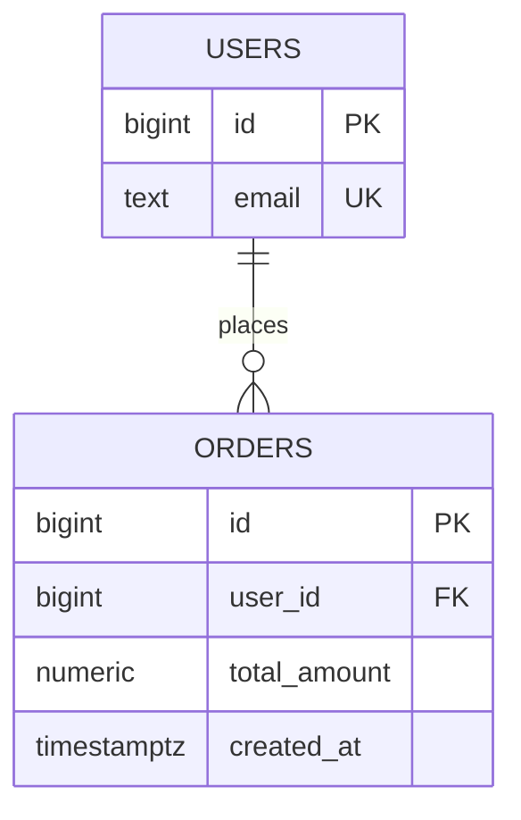
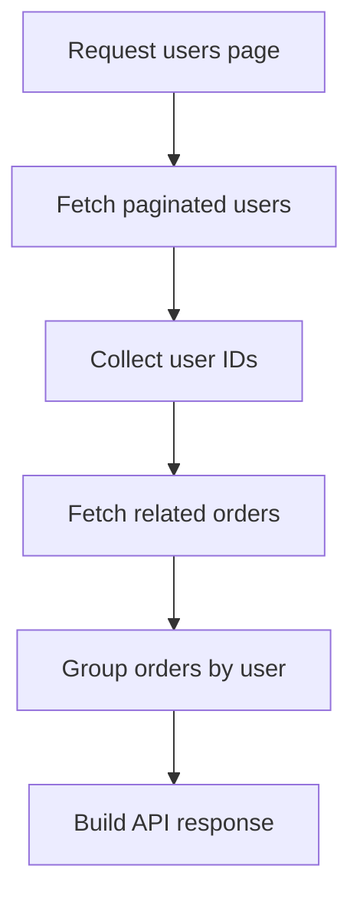
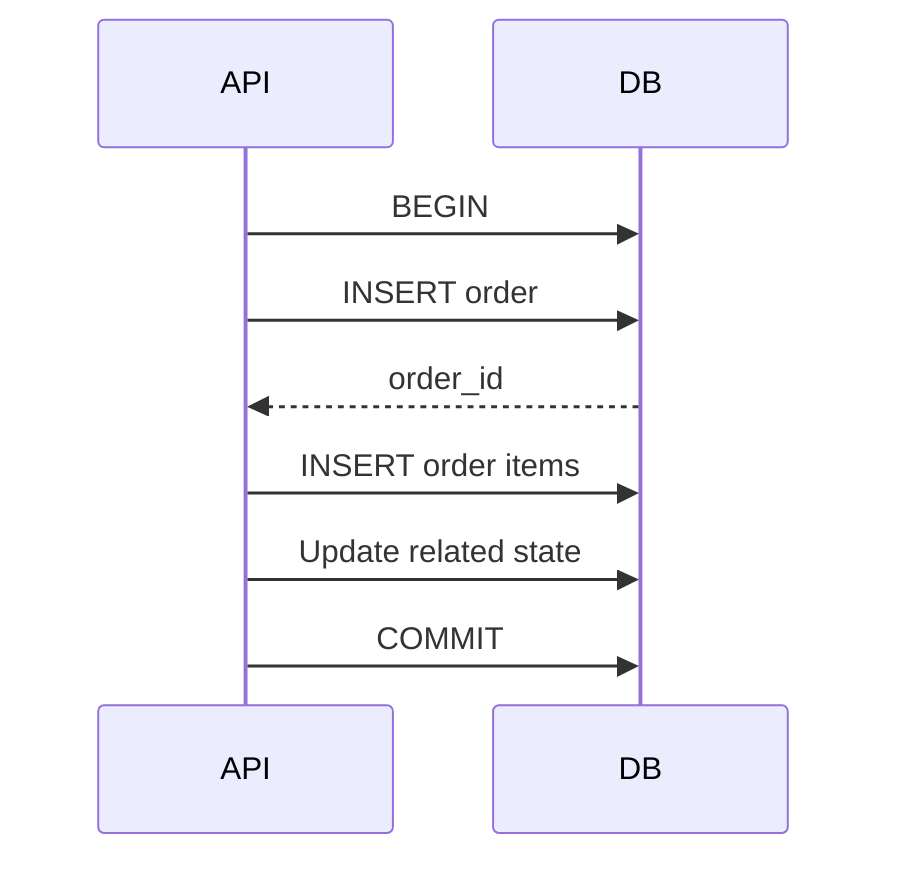
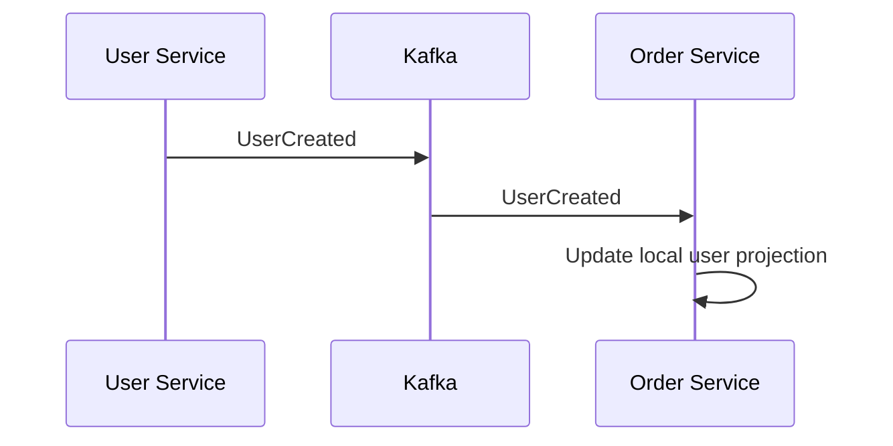

# 06- One-to-Many Relationships

## Overview

A one-to-many relationship is one of the most common relationship patterns in relational database systems.

It means:

```text
One row in the parent table
        ↓
Zero, one, or many rows in the child table
```

and, from the child side:

```text
One child row
        ↓
One parent row
```

Typical backend examples include:

```text
User → Orders
Order → Order Items
Customer → Addresses
Post → Comments
Department → Employees
Author → Books
```

For example:

```text
users
┌────┬───────────────────┐
│ id │ email             │
├────┼───────────────────┤
│ 1  │ alice@example.com │
│ 2  │ bob@example.com   │
└────┴───────────────────┘

orders
┌────┬─────────┬──────────────┐
│ id │ user_id │ total_amount │
├────┼─────────┼──────────────┤
│ 101│ 1       │ 99.00        │
│ 102│ 1       │ 50.00        │
│ 103│ 2       │ 75.00        │
└────┴─────────┴──────────────┘
```

The relationship is:

```text
User 1
 ├── Order 101
 └── Order 102

User 2
 └── Order 103
```

The child table stores the foreign key:

```text
orders.user_id → users.id
```

This relationship pattern is fundamental because it connects database modeling, foreign keys, indexing, joins, transactions, ORM behavior, pagination, cascading operations, and application architecture.

---

## What One-to-Many Means

Suppose we have:

```text
customers
orders
```

and the business rule is:

```text
A customer can have many orders.
Each order belongs to exactly one customer.
```

The cardinality is:

```text
Customer → 0..N Orders
Order    → exactly 1 Customer
```

The `0..N` is important.

A customer may have:

```text
zero orders
one order
many orders
```

The relationship remains one-to-many.

Similarly, `NOT NULL` on the foreign key determines whether an order must have a customer. It does not determine how many orders a customer may have.

---

## Why One-to-Many Relationships Exist

One-to-many relationships allow repeated occurrences of an entity to reference a single authoritative parent.

Without a relationship, an order table might duplicate customer information:

```text
order_id
customer_id
customer_email
customer_name
customer_address
total
```

This creates unnecessary duplication.

A relational design separates the entities:

```text
customers
---------
id
email
name

orders
------
id
customer_id
total
```

Now:

```text
customers.id
      ↑
      │
orders.customer_id
```

The customer exists once, while any number of orders can reference that customer.

Benefits include:

- Reduced duplication
- Referential integrity
- Consistent updates
- Clear ownership
- Better normalization
- Efficient relationship queries
- Strong transactional semantics

---

## Parent and Child Tables

In a one-to-many relationship:

```text
Parent
  ↓
Child
```

The parent is the referenced table.

The child contains the foreign key.

Example:

```text
users
  ↓
orders
```

Therefore:

```text
users.id
    ↑
    │
orders.user_id
```

The foreign key belongs on the **many side**.

This is one of the most important rules to remember:

> In a standard one-to-many relationship, the foreign key is stored in the table on the many side.

---

## Basic Implementation

A PostgreSQL schema could be:

```sql
CREATE TABLE users (
    id BIGINT GENERATED ALWAYS AS IDENTITY PRIMARY KEY,
    email TEXT NOT NULL UNIQUE
);

CREATE TABLE orders (
    id BIGINT GENERATED ALWAYS AS IDENTITY PRIMARY KEY,
    user_id BIGINT NOT NULL
        REFERENCES users(id),
    total_amount NUMERIC(12, 2) NOT NULL
);
```

The important part is:

```sql
user_id BIGINT NOT NULL
    REFERENCES users(id)
```

This enforces:

```text
Every order must reference an existing user.
```

It does **not** limit a user to one order.

A user can have:

```text
Order 101
Order 102
Order 103
...
```

because there is no uniqueness constraint on:

```text
orders.user_id
```

---

## Why the Foreign Key Is Not Unique

Compare one-to-one:

```sql
user_id BIGINT UNIQUE
    REFERENCES users(id)
```

with one-to-many:

```sql
user_id BIGINT
    REFERENCES users(id)
```

The difference is:

```text
UNIQUE
```

A unique foreign key means:

```text
One parent → at most one child
```

A normal foreign key means:

```text
One parent → potentially many children
```

Therefore:

| Constraint | Relationship |
|---|---|
| FK + `UNIQUE` | One-to-one |
| FK without `UNIQUE` | One-to-many |
| Composite FK + appropriate uniqueness | Depends on constraint design |

---

## Optionality

One-to-many relationships commonly have optional parent-to-child cardinality.

For example:

```text
Customer A → 0 orders
Customer B → 1 order
Customer C → 100 orders
```

All three are valid.

The child foreign key determines whether the child must have a parent:

```sql
user_id BIGINT NOT NULL
    REFERENCES users(id)
```

means:

```text
Every order must belong to a user.
```

If the foreign key is nullable:

```sql
user_id BIGINT
    REFERENCES users(id)
```

then:

```text
An order may exist without a user.
```

Whether that is appropriate depends on the business model.

---

## Cardinality vs Optionality

These concepts should not be mixed.

### Cardinality

Describes the number of related rows:

```text
One user → many orders
```

### Optionality

Describes whether the relationship must exist:

```text
A user may have zero orders.
```

or:

```text
Every order must have a user.
```

These can coexist:

```text
User → 0..N Orders
Order → exactly 1 User
```

This is a very common production relationship.

---

## Relationship Ownership

One-to-many relationships often represent ownership.

Consider:

```text
Order → Order Items
```

An order item generally has little meaning without its order.

This suggests:

```text
Order
  ↓
Order Item
```

where the order owns its items.

Another relationship:

```text
Order → Product
```

is different.

A product is independently managed and may participate in thousands of orders.

Therefore:

```text
Order
  ↓
references
  ↓
Product
```

does not imply that the order owns the product.

Ownership affects:

- Delete behavior
- Lifecycle
- Transactions
- Data retention
- API design
- Service boundaries

---

## One-to-Many Relationship Diagram



The relationship means:

```text
USERS
  │
  ├── zero orders
  ├── one order
  └── many orders
```

while each order points to one user.

---

## Parent-to-Child Navigation

From the parent side:

```sql
SELECT *
FROM orders
WHERE user_id = 42;
```

This answers:

```text
What orders belong to user 42?
```

From the child side:

```sql
SELECT
    o.id,
    u.email
FROM orders AS o
JOIN users AS u
    ON u.id = o.user_id
WHERE o.id = 1001;
```

This answers:

```text
Which user owns order 1001?
```

The physical relationship is represented by:

```text
orders.user_id
```

but SQL can traverse the relationship in either direction.

---

## JOINing One-to-Many Relationships

A common query is:

```sql
SELECT
    u.id,
    u.email,
    o.id AS order_id,
    o.total_amount
FROM users AS u
JOIN orders AS o
    ON o.user_id = u.id;
```

If:

```text
User 1 → 3 orders
```

the result contains three rows for that user.

For example:

```text
user_id | email             | order_id
--------|-------------------|---------
1       | alice@example.com | 101
1       | alice@example.com | 102
1       | alice@example.com | 103
```

The database has not duplicated the stored user.

The **result set** contains one row for every matching relationship.

This distinction becomes extremely important for aggregation and pagination.

---

## INNER JOIN

An `INNER JOIN` returns only parent rows that have matching children.

```sql
SELECT
    u.id,
    u.email,
    o.id AS order_id
FROM users AS u
INNER JOIN orders AS o
    ON o.user_id = u.id;
```

If a user has no orders, that user does not appear.

Conceptually:

```text
Users
  +
Orders
  ↓
Users having at least one order
```

---

## LEFT JOIN

A `LEFT JOIN` preserves every parent row.

```sql
SELECT
    u.id,
    u.email,
    o.id AS order_id
FROM users AS u
LEFT JOIN orders AS o
    ON o.user_id = u.id;
```

If a user has no orders:

```text
user_id | email             | order_id
--------|-------------------|---------
42      | alice@example.com | NULL
```

The `NULL` represents:

```text
No matching child row exists.
```

This is useful for:

```text
List all customers
including customers with zero orders
```

---

## Finding Parents With No Children

A common one-to-many query is:

```text
Find users who have never placed an order.
```

One approach:

```sql
SELECT
    u.id,
    u.email
FROM users AS u
LEFT JOIN orders AS o
    ON o.user_id = u.id
WHERE o.id IS NULL;
```

Another often useful approach is `NOT EXISTS`:

```sql
SELECT
    u.id,
    u.email
FROM users AS u
WHERE NOT EXISTS (
    SELECT 1
    FROM orders AS o
    WHERE o.user_id = u.id
);
```

For existence checks, `EXISTS` / `NOT EXISTS` can often express the intent more directly than a join.

The best execution plan depends on the database, indexes, and data distribution.

---

## Counting Children

A typical backend query is:

```text
How many orders does each user have?
```

Use aggregation:

```sql
SELECT
    u.id,
    u.email,
    COUNT(o.id) AS order_count
FROM users AS u
LEFT JOIN orders AS o
    ON o.user_id = u.id
GROUP BY
    u.id,
    u.email;
```

`LEFT JOIN` is important if users with zero orders should be included.

For a user with no orders:

```text
COUNT(o.id) = 0
```

This works because `o.id` is `NULL` for the unmatched row and `COUNT(column)` ignores `NULL`.

---

## COUNT(*) vs COUNT(column)

This is an important one-to-many aggregation detail.

Consider:

```sql
SELECT
    u.id,
    COUNT(*) AS count_rows,
    COUNT(o.id) AS count_orders
FROM users AS u
LEFT JOIN orders AS o
    ON o.user_id = u.id
GROUP BY u.id;
```

For a user with no orders:

```text
COUNT(*)    = 1
COUNT(o.id) = 0
```

because the `LEFT JOIN` still produces one result row for the parent.

Therefore, when counting optional child records after a `LEFT JOIN`, use:

```sql
COUNT(child.id)
```

when the intent is to count actual children.

---

## One-to-Many and Aggregation

One-to-many relationships naturally create multiple rows.

This affects:

```text
COUNT
SUM
AVG
MIN
MAX
DISTINCT
GROUP BY
```

For example:

```sql
SELECT
    u.id,
    SUM(o.total_amount) AS lifetime_value
FROM users AS u
JOIN orders AS o
    ON o.user_id = u.id
GROUP BY u.id;
```

The database aggregates all matching order rows for each user.

The relationship determines the aggregation grain:

```text
Orders
   ↓ GROUP BY user
User-level result
```

Always ask:

> At what grain should the result exist?

This prevents many SQL mistakes.

---

## One-to-Many and Join Multiplication

Suppose:

```text
User
 ├── 3 Orders
 └── 2 Addresses
```

Joining both relationships can produce:

```text
3 × 2 = 6 result rows
```

For example:

```sql
SELECT
    u.id,
    o.id AS order_id,
    a.id AS address_id
FROM users AS u
LEFT JOIN orders AS o
    ON o.user_id = u.id
LEFT JOIN addresses AS a
    ON a.user_id = u.id
WHERE u.id = 42;
```

The result may contain:

```text
order 1 | address 1
order 1 | address 2
order 2 | address 1
order 2 | address 2
order 3 | address 1
order 3 | address 2
```

This can produce incorrect aggregates such as:

```text
SUM(order_amount)
```

because each order appears multiple times.

Potential solutions include:

- Pre-aggregate children
- Aggregate separately
- Use `COUNT(DISTINCT ...)` when appropriate
- Use subqueries
- Use CTEs
- Restructure the query

The correct solution depends on the intended result grain.

---

## Pre-Aggregating a Child Relationship

Instead of joining multiple one-to-many relationships directly, aggregate one side first.

```sql
WITH order_totals AS (
    SELECT
        user_id,
        SUM(total_amount) AS lifetime_value
    FROM orders
    GROUP BY user_id
)
SELECT
    u.id,
    u.email,
    COALESCE(ot.lifetime_value, 0) AS lifetime_value
FROM users AS u
LEFT JOIN order_totals AS ot
    ON ot.user_id = u.id;
```

This changes the relationship from:

```text
User → many orders
```

into:

```text
User → one aggregated result
```

before joining it to other entities.

This is a useful technique for avoiding relationship multiplication.

---

## Foreign-Key Indexing

A one-to-many relationship commonly requires an index on the child foreign key.

Given:

```sql
CREATE TABLE orders (
    id BIGINT PRIMARY KEY,
    user_id BIGINT NOT NULL REFERENCES users(id)
);
```

and the query:

```sql
SELECT *
FROM orders
WHERE user_id = 42;
```

an index can make locating the user's orders much more efficient:

```sql
CREATE INDEX idx_orders_user_id
ON orders(user_id);
```

The distinction is:

```text
Foreign key
→ integrity

Index
→ access performance
```

A foreign key does not automatically mean the referencing column has the index required by your workload.

---

## Why Parent Indexing Is Usually Different

Suppose:

```text
users.id
```

is the primary key.

It already has an index.

But:

```text
orders.user_id
```

is the referencing column and may need its own index.

The common access path:

```text
User
 ↓
Find all child rows
 ↓
orders.user_id
```

benefits from indexing the child foreign key.

This is especially important when:

- The child table is large.
- Parent deletion is common.
- Queries frequently fetch children by parent.
- Joins use the foreign key.
- The relationship has high cardinality.

---

## Composite Indexes

Sometimes the foreign key alone is not enough.

Consider:

```sql
SELECT
    id,
    total_amount
FROM orders
WHERE user_id = 42
  AND status = 'completed'
ORDER BY created_at DESC;
```

A workload-specific index may be:

```sql
CREATE INDEX idx_orders_user_status_created
ON orders(user_id, status, created_at DESC);
```

Column ordering matters.

A composite index should be designed around actual access patterns rather than blindly adding columns.

Use query plans to verify whether the index provides value.

---

## One-to-Many and Pagination

One-to-many relationships become tricky when pagination is performed after a join.

Suppose:

```text
User 1 → 100 orders
User 2 → 2 orders
User 3 → 1 order
```

This query:

```sql
SELECT
    u.id,
    o.id AS order_id
FROM users AS u
JOIN orders AS o
    ON o.user_id = u.id
ORDER BY u.id
LIMIT 10;
```

paginates **result rows**, not users.

The first page could contain mostly rows belonging to User 1.

If the API's requirement is:

```text
10 users per page
```

then directly paginating the one-to-many join is often incorrect.

Possible strategies include:

- Paginate parent rows first
- Use separate child queries
- Use keyset pagination
- Aggregate child data
- Use ORM prefetching
- Use carefully designed subqueries

Always identify the entity being paginated.

---

## Parent Pagination Followed by Child Fetching

For an API such as:

```text
GET /users?page=2
```

where each user includes recent orders, a common strategy is:

```text
Query users for page
       ↓
Obtain user IDs
       ↓
Query orders for those users
       ↓
Group orders by user
       ↓
Build response
```

Conceptually:



This can avoid both:

```text
incorrect pagination
```

and:

```text
N+1 queries
```

---

## One-to-Many and ORM Queries

Django provides a natural representation:

```python
class User(models.Model):
    email = models.EmailField(unique=True)


class Order(models.Model):
    user = models.ForeignKey(
        User,
        on_delete=models.PROTECT,
        related_name="orders",
    )
    total_amount = models.DecimalField(
        max_digits=12,
        decimal_places=2,
    )
```

The database relationship is:

```text
orders.user_id → users.id
```

The ORM provides:

```python
order.user
```

and:

```python
user.orders.all()
```

The ORM makes navigation easier, but it does not eliminate SQL performance concerns.

---

## N+1 Queries

Consider:

```python
users = User.objects.all()

for user in users:
    print(user.orders.count())
```

Depending on the exact query and ORM behavior, this can produce repeated database queries.

Conceptually:

```text
1 query
+
N child queries
```

For 1,000 users:

```text
1 + 1,000 queries
```

This is an N+1 query pattern.

For collection relationships, Django commonly uses:

```python
users = User.objects.prefetch_related("orders")
```

Unlike `select_related`, `prefetch_related` is designed for multi-valued relationships such as:

```text
one-to-many
many-to-many
```

The distinction matters:

| Relationship | Typical Django optimization |
|---|---|
| ForeignKey / OneToOne | `select_related()` |
| One-to-many / reverse FK | `prefetch_related()` |
| Many-to-many | `prefetch_related()` |

---

## FastAPI and SQLAlchemy

In a FastAPI application using SQLAlchemy, a one-to-many relationship can be represented as:

```python
from sqlalchemy import ForeignKey, Numeric, String
from sqlalchemy.orm import DeclarativeBase, Mapped, mapped_column, relationship


class Base(DeclarativeBase):
    pass


class User(Base):
    __tablename__ = "users"

    id: Mapped[int] = mapped_column(primary_key=True)
    email: Mapped[str] = mapped_column(String(320), unique=True)

    orders: Mapped[list["Order"]] = relationship(
        back_populates="user",
    )


class Order(Base):
    __tablename__ = "orders"

    id: Mapped[int] = mapped_column(primary_key=True)
    user_id: Mapped[int] = mapped_column(
        ForeignKey("users.id"),
        index=True,
    )
    total_amount: Mapped[float] = mapped_column(Numeric(12, 2))

    user: Mapped[User] = relationship(
        back_populates="orders",
    )
```

The important database concepts remain:

```text
orders.user_id
    ↓
Foreign key
    ↓
users.id
```

and:

```text
index on orders.user_id
```

for common lookup patterns.

---

## Loading Strategies in ORMs

A one-to-many relationship can be loaded in several ways.

### Lazy Loading

The parent is loaded first.

The child collection is fetched when accessed.

```text
SELECT users
      ↓
access user.orders
      ↓
SELECT orders
```

This is convenient but can cause N+1 queries.

### Eager Loading

The application intentionally loads related records together.

```text
SELECT users
SELECT orders WHERE user_id IN (...)
```

This can avoid N+1 behavior.

### Joined Loading

The ORM may retrieve related data using a SQL join.

This can be useful for single-valued relationships, but for collection relationships it can increase result-set size significantly.

The correct loading strategy depends on:

- Number of parent rows
- Number of children
- Required fields
- API shape
- Query frequency
- Memory constraints

---

## One-to-Many and Delete Behavior

Deleting a parent requires a deliberate policy.

Consider:

```text
User
 └── Orders
```

Possible semantics include:

```text
Delete user
    ↓
Delete all orders
```

or:

```text
Delete user
    ↓
Prevent deletion
```

or:

```text
Delete user
    ↓
Set order.user_id = NULL
```

The correct choice depends on business semantics.

---

## `ON DELETE CASCADE`

Use cascade when children are genuinely dependent on the parent.

Example:

```sql
CREATE TABLE orders (
    id BIGINT GENERATED ALWAYS AS IDENTITY PRIMARY KEY,
    user_id BIGINT NOT NULL
        REFERENCES users(id)
        ON DELETE CASCADE
);
```

Deleting a user can then delete all their orders.

This is appropriate only when deleting the parent should logically remove the children.

For production business data, this is often dangerous.

An order may represent:

- Financial history
- Legal records
- Tax records
- Audit information
- Customer activity

Such data often should not disappear merely because a user is deleted.

---

## `ON DELETE RESTRICT`

Restrictive behavior prevents parent deletion while children exist.

```sql
CREATE TABLE orders (
    id BIGINT GENERATED ALWAYS AS IDENTITY PRIMARY KEY,
    user_id BIGINT NOT NULL
        REFERENCES users(id)
        ON DELETE RESTRICT
);
```

Conceptually:

```text
DELETE user
    ↓
orders exist
    ↓
DELETE rejected
```

This is often a safer default for important historical records.

It forces the application to explicitly determine what should happen.

---

## `ON DELETE SET NULL`

If the child can survive without its parent:

```sql
CREATE TABLE comments (
    id BIGINT GENERATED ALWAYS AS IDENTITY PRIMARY KEY,
    author_id BIGINT
        REFERENCES users(id)
        ON DELETE SET NULL,
    body TEXT NOT NULL
);
```

Deleting the user results in:

```text
author_id = NULL
```

The comment remains.

This is useful when:

```text
The relationship is optional
+
The child has an independent lifecycle
```

---

## Choosing Referential Actions

| Situation | Typical approach |
|---|---|
| Child has no independent meaning | `CASCADE` |
| Child is historical/important | `RESTRICT` / explicit lifecycle |
| Child can survive without parent | `SET NULL` |
| Deletion requires explicit business handling | `RESTRICT` or `NO ACTION` |
| Data should be retained | Soft delete / archival / retention strategy |

The correct choice is a domain decision.

---

## One-to-Many and Soft Deletes

Suppose users use soft deletion:

```sql
ALTER TABLE users
ADD COLUMN deleted_at TIMESTAMPTZ;
```

A soft-deleted user still physically exists.

Therefore:

```text
orders.user_id → users.id
```

remains a valid foreign key relationship.

The database does not automatically understand:

```text
deleted_at IS NULL
```

as part of referential integrity.

Application queries may therefore need:

```sql
SELECT
    o.id,
    o.total_amount
FROM orders AS o
JOIN users AS u
    ON u.id = o.user_id
WHERE u.deleted_at IS NULL;
```

Soft deletion is a business visibility rule, not a replacement for relational integrity.

---

## Historical Data

One-to-many relationships often represent historical events.

For example:

```text
Customer
   ↓
Orders
```

Deleting a customer should not necessarily delete their orders.

An order may need to preserve:

```text
customer identity
order date
price
tax
currency
billing information
```

for years.

In such systems, consider:

```text
Soft delete
+
Restricted deletion
+
Historical snapshots
+
Archival
```

rather than blindly cascading.

A foreign key answers:

```text
Does the referenced row exist?
```

It does not answer:

```text
What was the business state when this transaction occurred?
```

---

## Snapshotting Historical Values

Consider:

```text
products
---------
id
name
price
```

and:

```text
order_items
-----------
order_id
product_id
quantity
unit_price
```

Even though:

```text
order_items.product_id → products.id
```

the order item stores:

```text
unit_price
```

because the current product price may change.

For example:

```text
Product today
price = $120

Historical order
unit_price = $99
```

The relationship identifies the product, while the snapshot preserves historical transaction state.

This is a critical distinction in production systems.

---

## One-to-Many and Transactions

Relationships often participate in atomic operations.

For example:

```text
Create order
    ↓
Create order items
    ↓
Update inventory
```

These operations may need to occur inside a transaction depending on the consistency requirements.

Conceptually:



Foreign keys protect:

```text
Referential integrity
```

while the transaction protects:

```text
Atomicity of the business operation
```

They solve different problems.

---

## Concurrent Child Creation

Consider:

```text
User 42
```

and two simultaneous requests:

```text
Request A → create order
Request B → create order
```

A one-to-many relationship normally allows both.

There is no uniqueness conflict because:

```text
orders.user_id
```

is intentionally non-unique.

If the business rule says:

```text
Only one active order of a particular type may exist per user
```

then additional constraints may be required.

For PostgreSQL, a partial unique index can sometimes enforce such an invariant:

```sql
CREATE UNIQUE INDEX uq_active_order_per_user
ON orders(user_id)
WHERE status = 'active';
```

Now:

```text
User 42 → one active order
```

can be enforced while allowing many historical orders.

This illustrates an important principle:

> Relationship cardinality and business uniqueness are not always the same thing.

---

## Composite Relationship Keys

In multi-tenant systems, a relationship may need to include tenant identity.

For example:

```text
tenant_id
user_id
```

can together identify a user within a tenant.

A schema may use:

```sql
CREATE TABLE users (
    tenant_id BIGINT NOT NULL,
    id BIGINT NOT NULL,
    PRIMARY KEY (tenant_id, id)
);

CREATE TABLE orders (
    tenant_id BIGINT NOT NULL,
    id BIGINT NOT NULL,
    user_id BIGINT NOT NULL,

    PRIMARY KEY (tenant_id, id),

    FOREIGN KEY (tenant_id, user_id)
        REFERENCES users(tenant_id, id)
);
```

This prevents an order from accidentally referencing a user belonging to another tenant.

For multi-tenant systems, relationship design should therefore consider:

```text
Identity
+
Tenant boundary
+
Authorization
+
Database constraints
```

---

## One-to-Many Across Microservices

A database foreign key works best when the parent and child share the same consistency boundary.

For example:

```text
users DB
├── users
└── orders
```

can enforce:

```text
orders.user_id → users.id
```

But in a microservice architecture:

```text
User Service
    ↓
User Database

Order Service
    ↓
Order Database
```

the Order Service generally cannot use a database foreign key to enforce a relationship to the User Service's database.

Instead, consistency may use:

```text
API calls
+
Events
+
Local projections
+
Idempotency
+
Reconciliation
```

For example:



The architectural relationship still exists, but it is no longer enforced by a single database foreign key.

---

## Strong vs Eventual Consistency

Within one database:

```text
Foreign key
+
Transaction
```

can provide strong relationship integrity.

Across independent services:

```text
Service A
   ↓ event
Service B
```

the relationship may become eventually consistent.

For example:

```text
User created
    ↓
UserCreated event
    ↓
Order service receives event
    ↓
Local representation updated
```

A senior backend engineer should distinguish:

```text
Database relationship
```

from:

```text
Distributed system relationship
```

They have different consistency and failure characteristics.

---

## One-to-Many and API Design

Suppose an API exposes:

```http
GET /users/42/orders
```

The endpoint directly represents:

```text
User
  ↓
Orders
```

A production API should consider:

- Pagination
- Ordering
- Filtering
- Authorization
- Tenant boundaries
- Maximum page size
- Query performance
- Consistent ordering

Example:

```http
GET /users/42/orders?status=completed&limit=50
```

The backend may execute:

```sql
SELECT
    id,
    total_amount,
    created_at
FROM orders
WHERE user_id = 42
  AND status = 'completed'
ORDER BY created_at DESC, id DESC
LIMIT 50;
```

The index should reflect the actual query workload.

---

## Keyset Pagination for Large Child Collections

Offset pagination:

```sql
LIMIT 50 OFFSET 100000;
```

can become inefficient for large datasets.

For a high-volume one-to-many relationship, keyset pagination can be more appropriate.

Example:

```sql
SELECT
    id,
    total_amount,
    created_at
FROM orders
WHERE user_id = 42
  AND (created_at, id) < ('2026-08-30T10:00:00Z', 987654)
ORDER BY created_at DESC, id DESC
LIMIT 50;
```

A supporting index might be:

```sql
CREATE INDEX idx_orders_user_created_id
ON orders(user_id, created_at DESC, id DESC);
```

This can provide stable and efficient traversal of large child collections.

---

## Relationship and Query Plan Analysis

Never optimize relationship queries purely from intuition.

Use:

```sql
EXPLAIN (ANALYZE, BUFFERS)
SELECT
    id,
    total_amount
FROM orders
WHERE user_id = 42
ORDER BY created_at DESC
LIMIT 50;
```

Look for:

- Sequential scans
- Index scans
- Rows examined
- Rows returned
- Sort operations
- Buffer usage
- Join strategy
- Actual vs estimated row counts

A relationship that looks simple logically can still be expensive at production scale.

---

## Relationship and Data Distribution

Cardinality is not only about schema semantics.

Data distribution also matters.

Consider:

```text
User A → 5 orders
User B → 20 orders
User C → 50,000,000 orders
```

The relationship is still one-to-many.

But User C is a **high-cardinality parent**.

This can affect:

- Query latency
- Index scans
- Memory usage
- API response sizes
- Pagination
- Lock contention
- Archival strategies

A senior engineer should consider both:

```text
Logical cardinality
```

and:

```text
Actual data distribution
```

---

## Hot Parents

Some systems contain parent records that receive disproportionate child activity.

Examples:

```text
Popular product → millions of events
Large account → millions of transactions
Popular post → millions of comments
```

These are sometimes called hot or high-traffic parents.

Potential mitigations include:

- Efficient foreign-key indexes
- Keyset pagination
- Partitioning where appropriate
- Archival
- Read replicas
- Caching
- Pre-aggregation
- Asynchronous processing

Do not add complexity before measuring the actual bottleneck.

---

## One-to-Many and Partitioning

Very large child tables may eventually require partitioning.

For example:

```text
orders
  ├── orders_2026_01
  ├── orders_2026_02
  ├── orders_2026_03
  └── ...
```

Partitioning is primarily driven by:

- Data volume
- Query patterns
- Retention requirements
- Maintenance requirements
- Time-based archival

A one-to-many relationship alone does not imply that partitioning is necessary.

---

## One-to-Many and Caching

Suppose an API repeatedly requests:

```text
User 42's recent orders
```

Caching may reduce database load.

For example:

```text
Redis
recent_orders:user:42
```

But cache design must account for:

```text
New order
    ↓
Cached collection becomes stale
```

Potential approaches include:

- TTLs
- Explicit invalidation
- Write-through patterns
- Event-driven invalidation
- Cache-aside

The database remains the source of truth unless the architecture explicitly defines another source.

---

## Security Considerations

A one-to-many relationship can represent resource ownership.

For example:

```text
Tenant
  ↓
Users
  ↓
Orders
```

An API request:

```http
GET /orders/123
```

must not simply check:

```text
order.id = 123
```

It may need to verify:

```text
order.user_id belongs to authenticated user
```

and:

```text
user belongs to authenticated tenant
```

A foreign key guarantees:

```text
Referenced user exists.
```

It does not guarantee:

```text
Caller is authorized to access the order.
```

Authorization must be implemented separately.

---

## Common Mistakes

### Putting the Foreign Key on the Parent

For:

```text
User → Orders
```

do not normally create:

```text
users.order_id
```

because one parent would then only be able to point naturally to one child.

The foreign key belongs on the many side:

```text
orders.user_id
```

### Making the Foreign Key Unique

This:

```sql
user_id BIGINT UNIQUE REFERENCES users(id)
```

turns the relationship into:

```text
One user → at most one order
```

which is not one-to-many.

### Forgetting the Foreign-Key Index

A large child table frequently needs:

```sql
CREATE INDEX ...
ON orders(user_id);
```

depending on workload.

### Confusing JOIN Results With Stored Data

A user appearing three times in a join result does not mean the database contains three user records.

The join produces one result row per relationship.

### Incorrect COUNT With LEFT JOIN

For optional children:

```sql
COUNT(o.id)
```

usually represents the number of actual orders.

`COUNT(*)` counts the joined result row, including the parent-only row created by `LEFT JOIN`.

### Joining Multiple Child Collections

Joining:

```text
orders
+
addresses
```

can multiply rows.

Always consider the resulting grain.

### Paginating Joined Rows

Pagination after a one-to-many join may paginate children rather than parents.

Identify what the API actually needs to paginate.

### Loading Collections Lazily in Loops

ORM access such as:

```python
for user in users:
    user.orders.all()
```

can cause N+1 queries.

Use appropriate eager-loading strategies.

### Cascading Historical Data

Do not automatically cascade deletion through financial, legal, audit, or historical records.

### Assuming Foreign Keys Provide Authorization

Referential integrity is not access control.

### Using Offset Pagination at Massive Scale

Large offsets can become increasingly expensive.

Keyset pagination is often better for high-volume child collections.

---

## Interview Traps

### "One-to-Many Means Every Parent Has At Least One Child"

False.

It can be:

```text
Parent → zero or more children
```

### "The Foreign Key Should Be on the Parent"

Usually false.

For a standard one-to-many relationship, the foreign key is on the many side.

### "A Foreign Key Makes the Child Unique"

False.

Many child rows can reference the same parent.

### "Foreign Keys Automatically Create the Required Index"

Not necessarily.

Check the database engine and workload. In PostgreSQL, an index on the referencing column is not automatically created simply because a foreign key exists.

### "LEFT JOIN + COUNT(*) Gives Child Count"

Not for parents with zero children.

Use:

```sql
COUNT(child.id)
```

when counting actual child rows.

### "One User With 100 Orders Means the User Row Is Stored 100 Times"

False.

The join result can contain 100 rows while the underlying user exists once.

### "Deleting a Parent Automatically Deletes Children"

False.

The behavior depends on the foreign key's referential action and database configuration.

### "CASCADE Is the Correct Default"

Not necessarily.

The correct action depends on lifecycle and business requirements.

### "One-to-Many Always Requires a JOIN"

No.

You can directly query the child table:

```sql
SELECT *
FROM orders
WHERE user_id = 42;
```

A join is required only when data from another table is needed or when the query semantics benefit from it.

### "ORM Relationship Access Is One Query"

Not necessarily.

Lazy-loading a collection repeatedly can produce N+1 queries.

### "One-to-Many and Many-to-Many Are Basically the Same"

No.

In one-to-many:

```text
Each child → one parent
```

In many-to-many:

```text
Each child-side entity can relate to many parent-side entities
```

A junction table is normally required for the latter.

---

## Production Design Checklist

Before implementing a one-to-many relationship, verify:

### Modeling

- What are the parent and child entities?
- Is the relationship genuinely one-to-many?
- Can the parent have zero children?
- Must every child have a parent?

### Foreign Key

- Is the foreign key on the many side?
- Should it be `NOT NULL`?
- Does it reference the correct key?
- Is the foreign key indexed for actual workloads?

### Constraints

- Should additional uniqueness rules exist?
- Are there business-specific constraints?
- Are composite keys required?
- Does multi-tenancy need to be part of the relationship key?

### Lifecycle

- Can the child exist independently?
- What happens when the parent is deleted?
- Should deletion cascade?
- Should deletion be restricted?
- Should the relationship become `NULL`?

### Querying

- How are children fetched by parent?
- Are joins required?
- What is the result grain?
- Could multiple one-to-many joins multiply rows?

### Aggregation

- Are `COUNT`, `SUM`, or `AVG` operating at the correct grain?
- Should child collections be pre-aggregated?
- Could duplicate rows distort aggregates?

### Performance

- Is the foreign key indexed?
- Are composite indexes needed?
- Does the query require keyset pagination?
- Are high-cardinality parents expected?
- Have actual query plans been inspected?

### ORM

- Could the access pattern cause N+1 queries?
- Should `prefetch_related()` or an equivalent strategy be used?
- Is the ORM generating excessive joins or result rows?

### API

- What entity is being paginated?
- Are page sizes bounded?
- Is ordering deterministic?
- Is authorization checked through the complete ownership chain?

### Architecture

- Do parent and child share one database?
- If they belong to separate services, how is consistency maintained?
- Are events or local projections required?

### Data Retention

- Is the child historical data?
- Can it safely be deleted?
- Is soft deletion or archival required?
- Are historical values snapshotted where necessary?

---

## Key Takeaways

- **In a one-to-many relationship, the foreign key normally belongs on the many side**, allowing multiple child rows to reference the same parent.
- **Cardinality and optionality are separate**: a parent can have zero, one, or many children, while `NOT NULL` determines whether each child must have a parent.
- **One-to-many relationships directly affect query behavior** through joins, aggregation, pagination, row multiplication, and ORM loading strategies.
- **Foreign-key indexes are a performance concern separate from referential integrity**, and high-volume child collections often require workload-specific indexing and pagination strategies.
- **Production relationship design must account for lifecycle, historical data, authorization, concurrency, multi-tenancy, and service boundaries—not just table structure.**