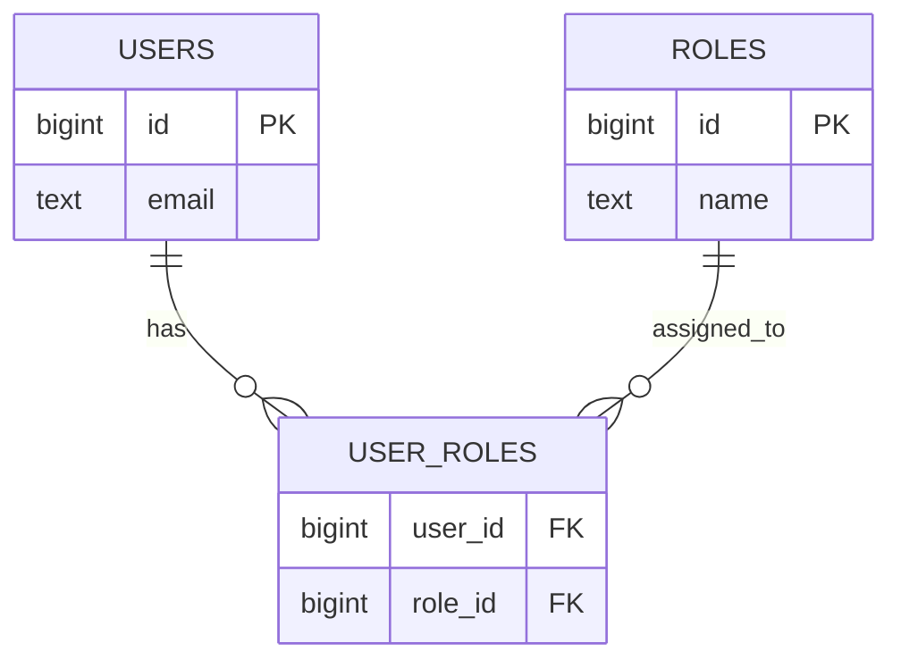
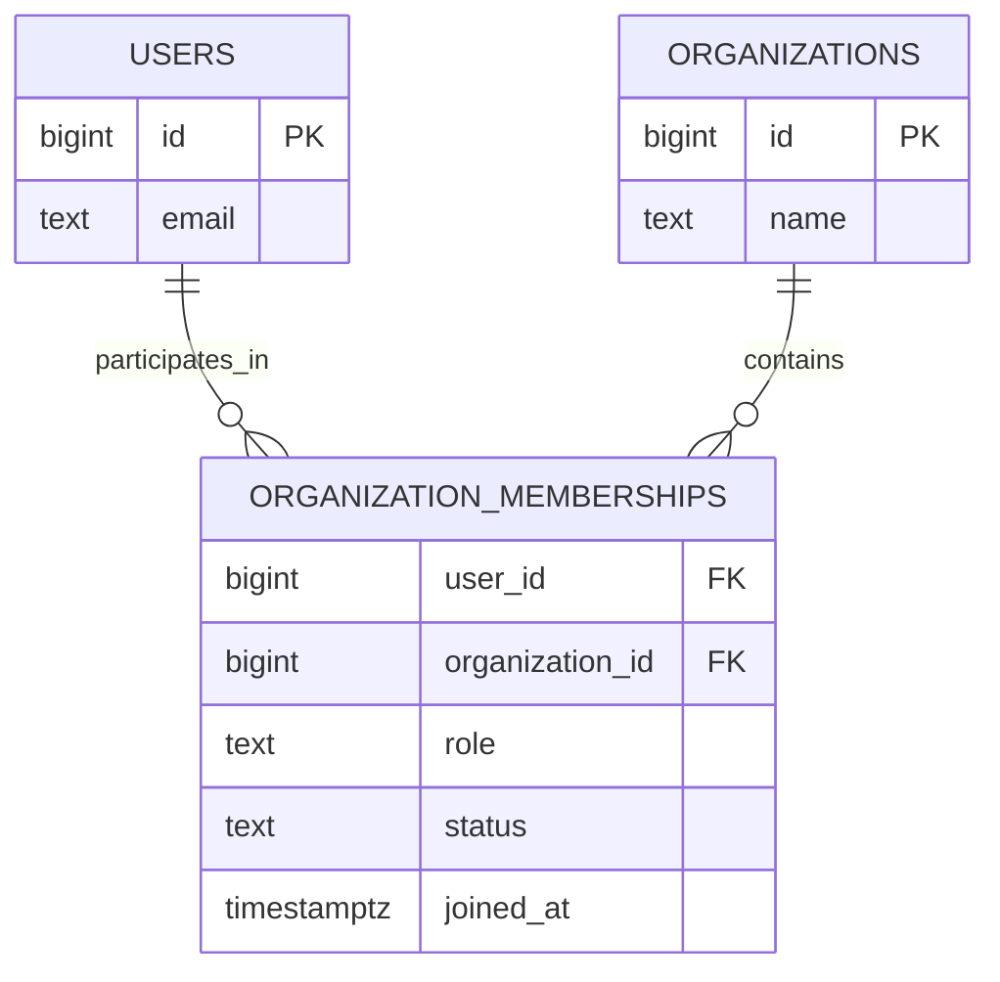
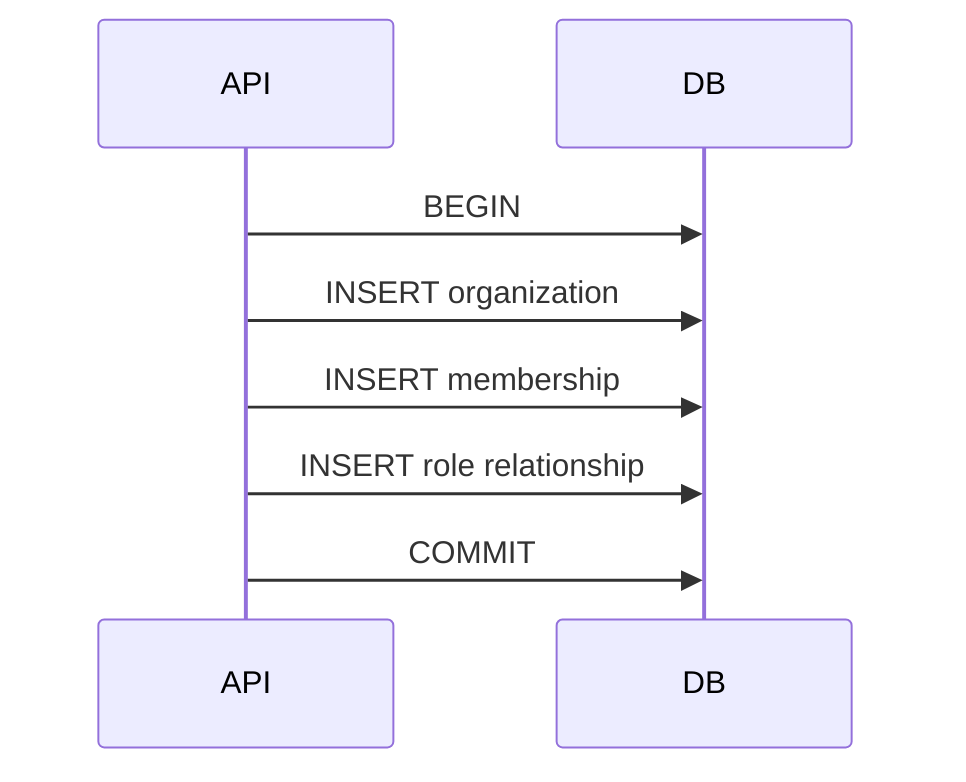
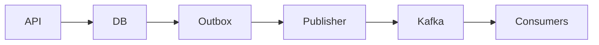

# 07- Many-to-Many Relationships

## Overview

A many-to-many relationship exists when multiple rows in one entity can be associated with multiple rows in another entity.

Typical backend examples include:

```text
Users ↔ Roles
Students ↔ Courses
Products ↔ Categories
Posts ↔ Tags
Orders ↔ Promotions
Users ↔ Organizations
```

For example:

```text
User 1 ──── Role Admin
       └─── Role Editor

User 2 ──── Role Editor
       └─── Role Viewer

User 3 ──── Role Admin
       └─── Role Viewer
```

Both sides can have multiple relationships:

```text
One User   → many Roles
One Role   → many Users
```

Relational databases normally represent this relationship through a **junction table**, also called a:

- Association table
- Bridge table
- Linking table
- Join table

For example:

```text
users
  │
  │ 1:N
  ▼
user_roles
  ▲
  │ N:1
  │
roles
```

The junction table is the core implementation mechanism.

---

## Why Many-to-Many Relationships Exist

Consider a system where users can have multiple roles and roles can belong to multiple users.

Storing role IDs directly in `users` would require something like:

```text
user_id | role_ids
--------|---------
1       | 1,3,5
```

This creates several problems:

- Difficult querying
- Poor referential integrity
- Difficult indexing
- Awkward updates
- No clean foreign-key relationship
- Poor normalization
- Difficult uniqueness enforcement

Instead, use:

```text
users
-----
id

roles
-----
id

user_roles
----------
user_id
role_id
```

For example:

```text
users
┌────┬───────────────┐
│ id │ email         │
├────┼───────────────┤
│ 1  │ alice@x.com   │
│ 2  │ bob@x.com     │
└────┴───────────────┘

roles
┌────┬───────────────┐
│ id │ name          │
├────┼───────────────┤
│ 1  │ admin         │
│ 2  │ editor        │
│ 3  │ viewer        │
└────┴───────────────┘

user_roles
┌─────────┬─────────┐
│ user_id │ role_id │
├─────────┼─────────┤
│ 1       │ 1       │
│ 1       │ 2       │
│ 2       │ 2       │
│ 2       │ 3       │
└─────────┴─────────┘
```

The junction table represents the relationships independently from either entity.

---

## Core Data Model

A typical implementation is:

```sql
CREATE TABLE users (
    id BIGINT GENERATED ALWAYS AS IDENTITY PRIMARY KEY,
    email TEXT NOT NULL UNIQUE
);

CREATE TABLE roles (
    id BIGINT GENERATED ALWAYS AS IDENTITY PRIMARY KEY,
    name TEXT NOT NULL UNIQUE
);

CREATE TABLE user_roles (
    user_id BIGINT NOT NULL
        REFERENCES users(id)
        ON DELETE CASCADE,

    role_id BIGINT NOT NULL
        REFERENCES roles(id)
        ON DELETE CASCADE,

    PRIMARY KEY (user_id, role_id)
);
```

The relationship is:

```text
users.id
    ↓
user_roles.user_id

roles.id
    ↓
user_roles.role_id
```

The junction table contains two foreign keys.

---

## The Junction Table

The junction table is the central component of a relational many-to-many relationship.

For:

```text
Users ↔ Roles
```

the table might be:

```text
user_roles
----------
user_id
role_id
```

Each row represents one relationship:

```text
(1, 1) → User 1 has Role 1
(1, 2) → User 1 has Role 2
(2, 2) → User 2 has Role 2
```

The relationship itself becomes data.

This is an important conceptual difference from one-to-many relationships.

In a one-to-many relationship:

```text
orders.user_id
```

is enough to represent the relationship.

In many-to-many:

```text
user_roles
```

is required because neither `users` nor `roles` can contain all relationship references cleanly.

---

## Composite Primary Key

A common design is:

```sql
PRIMARY KEY (user_id, role_id)
```

This means:

```text
A user-role pair can exist only once.
```

For example:

```text
(1, 2)
```

cannot be inserted twice.

This protects against duplicate relationships at the database level.

Example:

```sql
INSERT INTO user_roles (user_id, role_id)
VALUES (1, 2);

INSERT INTO user_roles (user_id, role_id)
VALUES (1, 2);
```

The second operation violates the primary key.

For relationship tables where the pair itself is the identity, a composite primary key is often the simplest design.

---

## Surrogate Key vs Composite Key

Another design is:

```sql
CREATE TABLE user_roles (
    id BIGINT GENERATED ALWAYS AS IDENTITY PRIMARY KEY,
    user_id BIGINT NOT NULL REFERENCES users(id),
    role_id BIGINT NOT NULL REFERENCES roles(id),

    UNIQUE (user_id, role_id)
);
```

Now:

```text
id
user_id
role_id
```

exist together.

The `UNIQUE` constraint is still important.

Without it:

```text
(1, 2)
(1, 2)
```

could occur multiple times.

### Comparison

| Design | Advantages | Limitations |
|---|---|---|
| Composite PK | Natural relationship identity, prevents duplicates directly | Wider foreign keys if referenced elsewhere |
| Surrogate PK + unique pair | Simple single-column identity, useful when relationship has its own identity | Requires additional uniqueness constraint |
| Surrogate PK without unique pair | Flexible but unsafe | Allows duplicate relationships |

Do not add a surrogate key merely because every table "should" have an integer ID.

The relationship itself may already have a natural composite identity.

---

## Foreign Keys and Referential Integrity

Both sides of the junction table should normally use foreign keys:

```sql
user_id BIGINT NOT NULL
    REFERENCES users(id),

role_id BIGINT NOT NULL
    REFERENCES roles(id)
```

This prevents:

```text
user_roles.user_id → nonexistent user
```

and:

```text
user_roles.role_id → nonexistent role
```

The database therefore guarantees that every relationship points to valid entities.

Conceptually:



---

## Querying Many-to-Many Relationships

### Find Roles for a User

```sql
SELECT
    r.id,
    r.name
FROM roles AS r
JOIN user_roles AS ur
    ON ur.role_id = r.id
WHERE ur.user_id = 42;
```

The query traverses:

```text
user
 ↓
user_roles
 ↓
roles
```

### Find Users for a Role

```sql
SELECT
    u.id,
    u.email
FROM users AS u
JOIN user_roles AS ur
    ON ur.user_id = u.id
WHERE ur.role_id = 3;
```

The relationship can therefore be traversed in either direction.

---

## Joining Both Entities

Suppose you want:

```text
User email
+
Role name
```

Use:

```sql
SELECT
    u.id AS user_id,
    u.email,
    r.id AS role_id,
    r.name AS role_name
FROM users AS u
JOIN user_roles AS ur
    ON ur.user_id = u.id
JOIN roles AS r
    ON r.id = ur.role_id;
```

The execution conceptually becomes:

```text
users
  ↓
user_roles
  ↓
roles
```

The junction table translates the many-to-many relationship into two one-to-many relationships.

---

## Filtering Through a Many-to-Many Relationship

Suppose:

```text
Find users who have the "admin" role.
```

A direct query is:

```sql
SELECT
    u.id,
    u.email
FROM users AS u
JOIN user_roles AS ur
    ON ur.user_id = u.id
JOIN roles AS r
    ON r.id = ur.role_id
WHERE r.name = 'admin';
```

For existence-style queries, `EXISTS` can also be useful:

```sql
SELECT
    u.id,
    u.email
FROM users AS u
WHERE EXISTS (
    SELECT 1
    FROM user_roles AS ur
    JOIN roles AS r
        ON r.id = ur.role_id
    WHERE ur.user_id = u.id
      AND r.name = 'admin'
);
```

Choose based on query semantics and verify the resulting execution plan.

---

## Finding Entities With No Relationships

To find users who have no roles:

```sql
SELECT
    u.id,
    u.email
FROM users AS u
LEFT JOIN user_roles AS ur
    ON ur.user_id = u.id
WHERE ur.user_id IS NULL;
```

Alternatively:

```sql
SELECT
    u.id,
    u.email
FROM users AS u
WHERE NOT EXISTS (
    SELECT 1
    FROM user_roles AS ur
    WHERE ur.user_id = u.id
);
```

`NOT EXISTS` often expresses the business question clearly:

```text
Does no relationship exist?
```

---

## Counting Relationships

To count roles per user:

```sql
SELECT
    u.id,
    u.email,
    COUNT(ur.role_id) AS role_count
FROM users AS u
LEFT JOIN user_roles AS ur
    ON ur.user_id = u.id
GROUP BY
    u.id,
    u.email;
```

The `LEFT JOIN` ensures users with zero roles remain in the result.

For a user with no relationships:

```text
COUNT(ur.role_id) = 0
```

rather than excluding the user.

---

## `COUNT(*)` Trap

With:

```sql
LEFT JOIN user_roles AS ur
```

a user with no roles still produces a parent result row.

Therefore:

```sql
COUNT(*)
```

can return:

```text
1
```

while:

```sql
COUNT(ur.role_id)
```

returns:

```text
0
```

When counting actual relationship rows after a `LEFT JOIN`, count a nullable child column such as:

```sql
COUNT(ur.role_id)
```

---

## Indexing a Junction Table

Indexing is critical because junction tables can become very large.

For:

```sql
PRIMARY KEY (user_id, role_id)
```

PostgreSQL creates an index beginning with:

```text
user_id
```

This efficiently supports queries such as:

```sql
SELECT role_id
FROM user_roles
WHERE user_id = 42;
```

But the same index is not optimal for:

```sql
SELECT user_id
FROM user_roles
WHERE role_id = 3;
```

because `role_id` is the second column.

Therefore, add the reverse index when that access pattern matters:

```sql
CREATE INDEX idx_user_roles_role_id
ON user_roles(role_id);
```

A common production design is therefore:

```text
PRIMARY KEY (user_id, role_id)
+
INDEX (role_id)
```

---

## Index Column Order

Consider:

```sql
PRIMARY KEY (user_id, role_id)
```

This is effectively an index ordered by:

```text
user_id
    ↓
role_id
```

It is excellent for:

```sql
WHERE user_id = ?
```

and:

```sql
WHERE user_id = ?
AND role_id = ?
```

It is not generally the right index for:

```sql
WHERE role_id = ?
```

because the query does not constrain the leading column.

If both directions are frequently queried:

```sql
CREATE INDEX idx_user_roles_role_user
ON user_roles(role_id, user_id);
```

Now the junction table has efficient access from both sides.

---

## Composite Index vs Two Single-Column Indexes

You may encounter:

```sql
CREATE INDEX ON user_roles(user_id);
CREATE INDEX ON user_roles(role_id);
```

instead of:

```sql
PRIMARY KEY (user_id, role_id);
CREATE INDEX ON user_roles(role_id);
```

The designs are not automatically equivalent.

A composite index:

```text
(user_id, role_id)
```

also provides ordering and efficient lookup by the combined pair.

Index selection should be based on:

- Query patterns
- Cardinality
- Sort requirements
- Join patterns
- Write volume
- Storage overhead
- Execution plans

Avoid indexing every column by default.

---

## Relationship Attributes

A major reason many-to-many relationships are important in production systems is that the relationship itself may contain data.

Consider:

```text
Users ↔ Organizations
```

The relationship might include:

```text
joined_at
role
status
invited_by
created_at
```

Now the junction table becomes:

```sql
CREATE TABLE organization_memberships (
    organization_id BIGINT NOT NULL
        REFERENCES organizations(id),

    user_id BIGINT NOT NULL
        REFERENCES users(id),

    role TEXT NOT NULL,
    status TEXT NOT NULL,
    joined_at TIMESTAMPTZ,

    PRIMARY KEY (organization_id, user_id)
);
```

The relationship is no longer just:

```text
User belongs to Organization
```

It is:

```text
User belongs to Organization
with role X
and status Y
since time Z
```

This is often called an **association entity** or **associative entity**.

---

## Why Relationship Attributes Matter

Suppose:

```text
user_id = 42
organization_id = 100
```

The relationship may have:

```text
role = admin
status = active
joined_at = 2026-08-01
```

These values do not belong naturally to:

```text
users
```

or:

```text
organizations
```

They belong to the relationship.

This is a strong indicator that the junction table should be treated as a first-class domain entity.

---

## Association Entity Design

A more complete model might be:



This model supports richer business rules than a simple two-column junction table.

---

## Relationship Lifecycle

Once the relationship has attributes, it has its own lifecycle.

For example:

```text
invited
   ↓
active
   ↓
suspended
   ↓
removed
```

The membership is now a business object.

This may require:

- State transitions
- Audit fields
- Authorization
- Timestamps
- Soft deletion
- Unique constraints
- Event publishing
- Transaction boundaries

The database design should reflect the domain rather than treating every junction table as disposable plumbing.

---

## Soft Deletion of Relationships

Suppose a user leaves an organization.

You could physically delete:

```sql
DELETE FROM organization_memberships
WHERE organization_id = 100
  AND user_id = 42;
```

But if history matters, you may instead retain the row:

```sql
UPDATE organization_memberships
SET status = 'removed',
    removed_at = CURRENT_TIMESTAMP
WHERE organization_id = 100
  AND user_id = 42;
```

This preserves:

```text
Who belonged to the organization
When they joined
When they left
What role they had
```

This is often valuable for audit and compliance requirements.

---

## Partial Unique Constraints

Suppose an organization should have at most one active membership for a user.

If historical rows are retained, a normal unique constraint on:

```text
(organization_id, user_id)
```

would prevent historical records.

Instead, PostgreSQL can use a partial unique index:

```sql
CREATE UNIQUE INDEX uq_active_membership
ON organization_memberships(organization_id, user_id)
WHERE status = 'active';
```

This allows:

```text
historical removed membership
+
one active membership
```

while preventing multiple active memberships.

---

## Duplicate Relationship Prevention

A production system should generally enforce relationship uniqueness in the database.

Bad:

```sql
CREATE TABLE user_roles (
    user_id BIGINT NOT NULL,
    role_id BIGINT NOT NULL
);
```

This allows:

```text
(1, 2)
(1, 2)
(1, 2)
```

which makes:

```text
COUNT
```

and relationship semantics unreliable.

Better:

```sql
PRIMARY KEY (user_id, role_id)
```

or:

```sql
UNIQUE (user_id, role_id)
```

depending on whether the pair is the table's identity.

Application-level checks alone are insufficient under concurrent requests.

---

## Concurrency and Duplicate Relationships

Consider two simultaneous requests:

```text
Request A → assign role 2 to user 1
Request B → assign role 2 to user 1
```

Both requests might execute:

```sql
SELECT ...
```

and see no relationship.

Then both try:

```sql
INSERT INTO user_roles (user_id, role_id)
VALUES (1, 2);
```

Without a database constraint, duplicates can be created.

With:

```sql
PRIMARY KEY (user_id, role_id)
```

one transaction succeeds and the other receives a uniqueness violation.

The database constraint is therefore the authoritative concurrency protection.

---

## Idempotent Relationship Creation

An API such as:

```http
PUT /users/42/roles/3
```

may semantically mean:

```text
Ensure relationship exists.
```

PostgreSQL can support this with:

```sql
INSERT INTO user_roles (user_id, role_id)
VALUES (42, 3)
ON CONFLICT (user_id, role_id)
DO NOTHING;
```

This is useful for idempotent operations.

The important pattern is:

```text
Unique constraint
+
Atomic upsert/conflict handling
```

rather than:

```text
SELECT first
INSERT second
```

which is vulnerable to race conditions.

---

## Removing Relationships

To remove one relationship:

```sql
DELETE FROM user_roles
WHERE user_id = 42
  AND role_id = 3;
```

For association entities with lifecycle state, prefer an update when history must be preserved:

```sql
UPDATE organization_memberships
SET status = 'removed',
    removed_at = CURRENT_TIMESTAMP
WHERE organization_id = 100
  AND user_id = 42;
```

The correct approach depends on whether the relationship is:

```text
Pure association
```

or:

```text
Business entity with history
```

---

## Cascading Deletes

For a pure junction table:

```sql
CREATE TABLE user_roles (
    user_id BIGINT NOT NULL
        REFERENCES users(id)
        ON DELETE CASCADE,

    role_id BIGINT NOT NULL
        REFERENCES roles(id)
        ON DELETE CASCADE,

    PRIMARY KEY (user_id, role_id)
);
```

Cascade can be appropriate.

If a user is deleted:

```text
User
 ↓
user_roles
 ↓
relationships removed
```

The roles themselves remain.

This is very different from cascading deletion into important business entities.

---

## Cascade Does Not Mean Delete Both Entities

Given:

```text
users
roles
user_roles
```

with cascading foreign keys from `user_roles`, deleting a user removes:

```text
user_roles rows
```

but does not delete:

```text
roles
```

The cascade operates from the referenced parent into the referencing rows.

Understanding the direction of cascading behavior is important when designing destructive operations.

---

## Many-to-Many and Transactions

A relationship modification often occurs inside a larger transaction.

For example:

```text
Create organization
    ↓
Create membership
    ↓
Assign initial role
    ↓
Commit
```

If these operations represent one business operation, they may need atomicity.

Conceptually:



Foreign keys provide:

```text
Referential integrity
```

while the transaction provides:

```text
Atomicity
```

They solve different problems.

---

## Many-to-Many and ORMs

Django provides explicit many-to-many relationships:

```python
class User(models.Model):
    email = models.EmailField(unique=True)


class Role(models.Model):
    name = models.CharField(max_length=100, unique=True)


class UserRole(models.Model):
    user = models.ForeignKey(User, on_delete=models.CASCADE)
    role = models.ForeignKey(Role, on_delete=models.CASCADE)

    class Meta:
        constraints = [
            models.UniqueConstraint(
                fields=["user", "role"],
                name="uq_user_role",
            ),
        ]
```

You can then model the relationship explicitly.

For relationships without additional attributes, Django also supports:

```python
class User(models.Model):
    roles = models.ManyToManyField(Role)
```

When the relationship has important attributes, an explicit intermediary model is generally more appropriate.

---

## Django Through Models

For:

```text
User ↔ Organization
```

with membership attributes:

```python
class OrganizationMembership(models.Model):
    organization = models.ForeignKey(
        "Organization",
        on_delete=models.CASCADE,
    )
    user = models.ForeignKey(
        "User",
        on_delete=models.CASCADE,
    )
    role = models.CharField(max_length=50)
    joined_at = models.DateTimeField()

    class Meta:
        constraints = [
            models.UniqueConstraint(
                fields=["organization", "user"],
                name="uq_organization_user",
            ),
        ]
```

The relationship becomes a first-class Django model.

This is preferable when the relationship has:

```text
business attributes
+
business behavior
+
lifecycle
```

---

## N+1 Queries With Many-to-Many Relationships

ORMs can also create N+1 queries for many-to-many relationships.

Conceptually:

```python
users = User.objects.all()

for user in users:
    roles = user.roles.all()
```

may produce:

```text
1 query for users
+
N queries for roles
```

For collection relationships, Django commonly uses:

```python
users = User.objects.prefetch_related("roles")
```

This allows Django to fetch the related collection efficiently and associate it in application memory.

The exact generated SQL should still be inspected for important production paths.

---

## SQLAlchemy Many-to-Many

SQLAlchemy can represent a simple association table:

```python
from sqlalchemy import ForeignKey, String, Table, Column
from sqlalchemy.orm import DeclarativeBase, Mapped, mapped_column, relationship


class Base(DeclarativeBase):
    pass


user_roles = Table(
    "user_roles",
    Base.metadata,
    Column("user_id", ForeignKey("users.id"), primary_key=True),
    Column("role_id", ForeignKey("roles.id"), primary_key=True),
)


class User(Base):
    __tablename__ = "users"

    id: Mapped[int] = mapped_column(primary_key=True)
    email: Mapped[str] = mapped_column(String(320), unique=True)

    roles: Mapped[list["Role"]] = relationship(
        secondary=user_roles,
        back_populates="users",
    )


class Role(Base):
    __tablename__ = "roles"

    id: Mapped[int] = mapped_column(primary_key=True)
    name: Mapped[str] = mapped_column(String(100), unique=True)

    users: Mapped[list[User]] = relationship(
        secondary=user_roles,
        back_populates="roles",
    )
```

The ORM abstraction still maps to:

```text
users
roles
user_roles
```

The database remains the authoritative source for integrity.

---

## API Design

Many-to-many relationships can appear in APIs in several ways.

For example:

```http
GET /users/42/roles
```

returns roles assigned to a user.

Or:

```http
POST /users/42/roles/3
```

could create the relationship.

A REST-oriented design might also use:

```http
PUT /users/42/roles/3
```

for idempotent assignment and:

```http
DELETE /users/42/roles/3
```

for removal.

The API should clearly define:

- Whether assignment is idempotent
- Whether duplicates are possible
- Authorization requirements
- Maximum collection size
- Pagination behavior
- Transaction boundaries
- Audit requirements

---

## Authorization Through Many-to-Many Relationships

Many-to-many relationships frequently implement authorization.

For example:

```text
User ↔ Organization
```

may determine whether a user can access an organization's resources.

The authorization flow might be:

```text
Request
   ↓
Authenticated User
   ↓
Membership lookup
   ↓
Membership status
   ↓
Role / permissions
   ↓
Resource access
```

A query might be:

```sql
SELECT 1
FROM organization_memberships AS m
WHERE m.organization_id = 100
  AND m.user_id = 42
  AND m.status = 'active';
```

The application should not assume:

```text
User exists
```

means:

```text
User is authorized for organization
```

Identity and authorization are separate concerns.

---

## Multi-Tenant Systems

Many-to-many relationships are particularly important in SaaS applications.

Example:

```text
User ↔ Organization
```

A user can belong to:

```text
Organization A
Organization B
Organization C
```

and each membership can have different permissions.

For example:

```text
User 42
 ├── Org A → admin
 ├── Org B → viewer
 └── Org C → billing
```

The role belongs to the **membership**, not necessarily to the user globally.

This is an important modeling distinction.

---

## Tenant Isolation

Authorization queries should enforce the complete tenant boundary.

For example:

```sql
SELECT
    p.id,
    p.name
FROM projects AS p
JOIN organization_memberships AS m
    ON m.organization_id = p.organization_id
WHERE p.id = 123
  AND m.user_id = 42
  AND m.status = 'active';
```

This ensures:

```text
Requested project
    ↓
belongs to organization
    ↓
user has active membership
```

A simple:

```sql
WHERE p.id = 123
```

is insufficient if resource authorization depends on membership.

---

## Many-to-Many and Pagination

Many-to-many collections can become very large.

Consider:

```text
User 42
  ↓
5,000,000 relationships
```

An API such as:

```http
GET /users/42/roles
```

should not attempt to return millions of rows.

Use:

- Pagination
- Filtering
- Bounded page sizes
- Deterministic ordering
- Keyset pagination for large collections

For example:

```sql
SELECT
    r.id,
    r.name
FROM roles AS r
JOIN user_roles AS ur
    ON ur.role_id = r.id
WHERE ur.user_id = 42
  AND r.id > 1000
ORDER BY r.id
LIMIT 100;
```

The exact pagination strategy depends on the required ordering and access pattern.

---

## High-Cardinality Junction Tables

A junction table can become one of the largest tables in a system.

For example:

```text
100 million users
×
many relationships
```

can produce billions of relationship rows.

At this scale, consider:

- Appropriate composite indexes
- Reverse indexes
- Partitioning where justified
- Archival
- Query-specific projections
- Read replicas
- Caching
- Batch operations
- Bulk inserts
- Query-plan analysis

Do not assume that a small-looking junction table will remain small.

---

## Bulk Relationship Operations

Avoid inserting relationships one at a time when processing large batches.

Instead of:

```text
INSERT
INSERT
INSERT
INSERT
...
```

prefer bulk operations where supported.

Example:

```sql
INSERT INTO user_roles (user_id, role_id)
VALUES
    (42, 1),
    (42, 2),
    (42, 3),
    (42, 4)
ON CONFLICT (user_id, role_id)
DO NOTHING;
```

This can reduce:

- Network round trips
- Transaction overhead
- ORM overhead

while improving throughput.

The exact batch size should be chosen based on database limits, transaction duration, lock behavior, and workload.

---

## Many-to-Many and Event-Driven Systems

Relationship changes can have downstream effects.

For example:

```text
User assigned to organization
        ↓
Membership created
        ↓
Publish MembershipCreated
        ↓
Other services update projections
```

Potential consumers include:

- Notification services
- Search indexing
- Analytics
- Authorization caches
- Audit systems

If a relationship change must reliably produce an event, consider an outbox pattern rather than publishing an event independently from the database transaction.

Conceptually:



The relationship table remains the transactional source of truth while downstream systems consume events asynchronously.

---

## Caching Many-to-Many Relationships

Frequently accessed relationships may be cached.

For example:

```text
user_roles:42
```

could represent:

```text
{1, 2, 3}
```

However, caching authorization relationships requires careful invalidation.

If:

```text
User loses admin role
```

but Redis still contains:

```text
admin
```

the application could temporarily make an incorrect authorization decision.

For security-sensitive relationships:

- Prefer authoritative database checks where appropriate.
- Keep cache TTLs bounded.
- Invalidate on relationship changes.
- Avoid treating stale authorization data as indefinitely valid.
- Measure the consistency requirements before introducing caching.

---

## Security Considerations

Many-to-many relationships frequently define access boundaries.

Examples include:

```text
User ↔ Organization
User ↔ Role
User ↔ Project
User ↔ Permission
```

Security considerations include:

### Enforce Authorization

Do not trust IDs supplied by the client:

```http
GET /organizations/999/projects
```

must verify that the authenticated user has access to organization `999`.

### Enforce Tenant Boundaries

Every relevant query should preserve tenant isolation.

### Protect Relationship Mutations

Assigning a role can be more sensitive than reading one.

For example:

```http
POST /users/42/roles/admin
```

should require appropriate administrative authorization.

### Audit Sensitive Changes

For security-sensitive relationships, record:

```text
who changed it
what changed
when it changed
why it changed
```

where required.

---

## Performance Analysis

For production queries, inspect execution plans.

Example:

```sql
EXPLAIN (ANALYZE, BUFFERS)
SELECT
    r.id,
    r.name
FROM roles AS r
JOIN user_roles AS ur
    ON ur.role_id = r.id
WHERE ur.user_id = 42;
```

Check for:

- Sequential scans
- Index scans
- Excessive row counts
- Poor cardinality estimates
- Large sorts
- Join strategy
- Buffer usage

The relationship model is only one part of performance.

Actual performance depends on:

```text
Schema
+
Indexes
+
Data distribution
+
Query shape
+
Concurrency
+
Database configuration
```

---

## Operational Considerations

For production many-to-many tables, monitor:

- Table growth
- Index size
- Query latency
- Slow queries
- Relationship creation rate
- Relationship deletion rate
- Deadlocks
- Lock contention
- Database CPU
- Database I/O
- Cache hit rate where caching is used

For large PostgreSQL tables, schema changes should be planned carefully.

Adding an index to a large production table may require operational planning; PostgreSQL supports `CREATE INDEX CONCURRENTLY` for many cases where minimizing blocking is important.

Example:

```sql
CREATE INDEX CONCURRENTLY idx_user_roles_role_id
ON user_roles(role_id);
```

`CONCURRENTLY` has operational trade-offs and should be used according to the deployment and migration strategy.

---

## Disaster Recovery and Data Integrity

Relationship tables are often small individually but critical to application correctness.

Losing:

```text
organization_memberships
```

could effectively destroy:

```text
authorization state
```

even if users and organizations remain intact.

Therefore:

- Include junction tables in backups.
- Test restore procedures.
- Monitor replication.
- Validate foreign-key integrity after recovery operations.
- Treat relationship data as first-class business data when it affects authorization or domain state.

A backup is only useful if the restore process is tested.

---

## Common Mistakes

### Storing IDs in a Delimited String

Avoid:

```text
role_ids = "1,2,3"
```

This sacrifices:

- Referential integrity
- Efficient indexing
- Clean joins
- Constraint enforcement

Use a junction table.

### Forgetting Relationship Uniqueness

Without:

```sql
PRIMARY KEY (user_id, role_id)
```

or:

```sql
UNIQUE (user_id, role_id)
```

duplicate relationships can be inserted.

### Creating Only One Index

If the application frequently traverses the relationship in both directions, an index supporting one direction may not be sufficient.

Consider:

```text
(user_id, role_id)
+
(role_id, user_id)
```

when justified by actual queries.

### Using Only Application-Level Duplicate Checks

This pattern is race-prone:

```text
SELECT
  ↓
if missing:
  INSERT
```

Concurrent requests can both observe the relationship as absent.

Use database uniqueness constraints.

### Treating Every Junction Table as Disposable

Some relationship tables contain important domain information:

```text
membership role
joined_at
status
permissions
billing state
```

These should be modeled as business entities when appropriate.

### Returning Huge Collections

Do not return:

```text
millions of relationships
```

in one API response.

Use bounded pagination and filtering.

### N+1 ORM Queries

Repeatedly accessing many-to-many collections can generate excessive queries.

Use appropriate eager-loading strategies.

### Incorrect Authorization

Checking:

```text
user exists
```

does not prove:

```text
user belongs to tenant
```

or:

```text
user has required role
```

### Overusing Cascades

Cascade may be appropriate for a pure relationship table but dangerous for a business entity containing historical information.

### Ignoring Relationship Cardinality

A many-to-many relationship can produce enormous intermediate result sets.

Always consider:

```text
How many rows can the join produce?
```

before designing queries and API responses.

---

## Interview Traps

### "A Many-to-Many Relationship Requires a Single Foreign Key"

False.

A standard relational implementation uses a junction table containing foreign keys to both entities.

### "The Junction Table Is Optional"

For normalized relational modeling, a junction table is the standard representation.

Alternative designs such as arrays or JSON may exist for specialized cases, but they have different integrity and query characteristics.

### "A Junction Table Does Not Need a Primary Key"

It needs a mechanism to prevent duplicate relationships when duplicates are not valid.

That can be:

```text
Composite primary key
```

or:

```text
Unique constraint
```

### "Two Single-Column Indexes Are Always Better"

False.

Index design depends on query patterns. A composite index can provide capabilities that independent single-column indexes do not.

### "The Primary Key `(user_id, role_id)` Supports Both Lookup Directions Equally"

False.

It is optimized for access beginning with:

```text
user_id
```

A separate index beginning with:

```text
role_id
```

may be needed.

### "Many-to-Many Relationships Cannot Have Attributes"

False.

The junction table can contain:

```text
role
status
timestamps
metadata
```

When it does, it often becomes an association entity.

### "Database Uniqueness Is Unnecessary If the API Checks First"

False.

Application-level checks are vulnerable to concurrent requests.

### "Cascade Deletes the Related Entity"

Not necessarily.

For:

```text
users
user_roles
roles
```

cascading from `users` into `user_roles` removes the relationship rows, not the roles.

### "Many-to-Many Queries Cannot Cause Row Multiplication"

They can.

Joining additional one-to-many or many-to-many relationships can multiply rows and distort aggregates.

### "ORM Many-to-Many Access Is Always Efficient"

False.

ORM abstractions can hide:

- N+1 queries
- Large joins
- Excessive result sets
- Inefficient filtering
- Missing indexes

Inspect SQL for important production paths.

---

## Production Design Checklist

Before implementing a many-to-many relationship, verify:

### Data Model

- Is the relationship genuinely many-to-many?
- Should the relationship have its own entity?
- Does the relationship have attributes?
- Does the relationship require lifecycle state?

### Constraints

- Are both foreign keys defined?
- Are foreign keys `NOT NULL` where appropriate?
- Are duplicate relationships prohibited?
- Are domain-specific uniqueness constraints required?

### Indexing

- Is `(parent_id, child_id)` indexed?
- Is the reverse direction needed?
- Are composite indexes aligned with real queries?
- Have execution plans been inspected?

### Lifecycle

- Should relationships be physically deleted?
- Should they be soft-deleted?
- Is historical membership required?
- Are cascading deletes safe?

### Concurrency

- Can two requests create the same relationship?
- Does the database enforce uniqueness?
- Are relationship mutations idempotent?
- Are transactions required?

### Querying

- How will each side traverse the relationship?
- Are `JOIN`, `EXISTS`, or `NOT EXISTS` appropriate?
- Could joins multiply rows?
- Are aggregates operating at the correct grain?

### ORM

- Could collection access cause N+1 queries?
- Should `prefetch_related()` or an equivalent strategy be used?
- Is the generated SQL acceptable at production scale?

### API

- Are relationship mutations idempotent?
- Are collections paginated?
- Are page sizes bounded?
- Are authorization checks performed?
- Are sensitive mutations audited?

### Multi-Tenancy

- Is tenant isolation enforced in relationship queries?
- Can a relationship accidentally cross tenant boundaries?
- Are roles scoped globally or per tenant?

### Scale

- How large can the junction table become?
- What is the expected relationship cardinality?
- Are bulk operations required?
- Is partitioning or archival likely to become necessary?

### Distributed Systems

- Does another service need to know about relationship changes?
- Are events required?
- Is an outbox pattern appropriate?
- What consistency guarantees are required?

---

## Key Takeaways

- **Many-to-many relationships are normally implemented with a junction table containing foreign keys to both entities**, converting the relationship into two one-to-many relationships.
- **Enforce relationship uniqueness at the database level**, commonly with a composite primary key or unique constraint, rather than relying on application-level duplicate checks.
- **Index the junction table according to traversal direction and workload**; `(user_id, role_id)` does not automatically provide efficient lookup beginning with `role_id`.
- **When the relationship has business attributes or lifecycle state, treat the junction table as a first-class association entity** rather than simple linking infrastructure.
- **Production many-to-many design requires attention to authorization, tenant isolation, concurrency, pagination, ORM query behavior, high-cardinality tables, and operational integrity.**