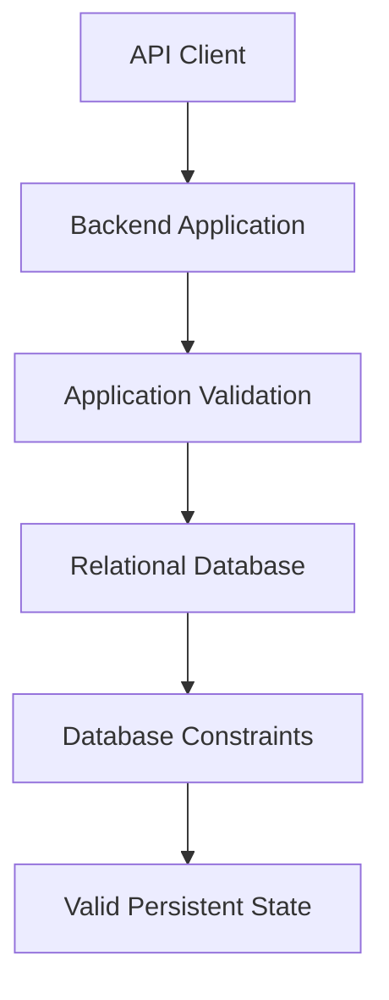
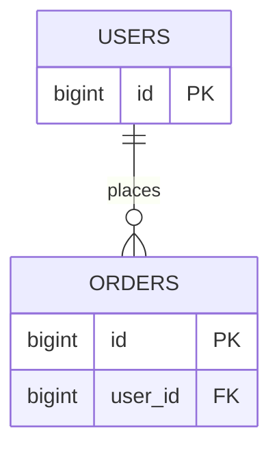
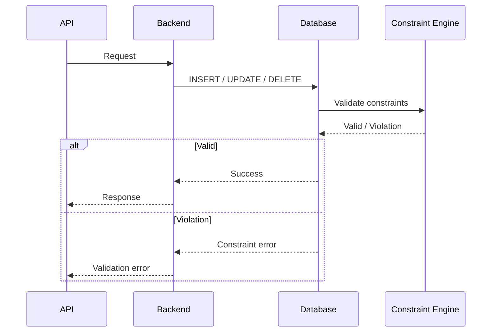

# 09- Constraints

## Overview

Constraints are database-enforced rules that define which states of data are valid.

They are one of the primary mechanisms for maintaining **data integrity at the database boundary**. Application code can validate incoming data, but concurrent requests, multiple services, administrative scripts, background workers, migrations, and direct database clients can all bypass application-level assumptions.

A production relational database should therefore encode important invariants directly in its schema.

Typical constraints include:

| Constraint | Primary purpose |
|---|---|
| `NOT NULL` | Prevent missing values |
| `PRIMARY KEY` | Uniquely identify rows |
| `FOREIGN KEY` | Enforce referential integrity |
| `UNIQUE` | Prevent duplicate values |
| `CHECK` | Enforce predicates/business rules |
| `DEFAULT` | Supply a value when one is omitted |
| `EXCLUDE` | Prevent conflicting values/ranges in PostgreSQL |

Constraints are not merely schema syntax. They influence:

- Data modeling
- Transaction behavior
- Concurrency
- Query planning
- Application error handling
- API design
- Migrations
- Reliability
- Security
- Operational workflows

The central engineering principle is:

> If a rule must always be true for valid database state, prefer enforcing it in the database rather than relying only on application code.

---

## Why Constraints Matter

Consider a payment system with:

```text
users
orders
payments
```

Suppose the application requires:

```text
Every payment belongs to an existing order.
An order can have at most one payment.
A payment amount cannot be negative.
A payment must have a currency.
```

Application code can attempt to enforce these rules:

```python
if amount < 0:
    raise ValueError("Invalid amount")
```

But this does not protect against:

- Another service writing directly to the database
- Two concurrent requests creating the same payment
- A background worker bypassing the validation
- A migration inserting invalid data
- An operational script making a mistake
- A race condition between validation and insertion

Database constraints provide a final integrity boundary.

---

## Database Integrity Model

A useful mental model is:



Application validation improves usability and produces useful errors early.

Database constraints provide the stronger guarantee:

```text
No transaction can commit a state that violates the constraint.
```

This distinction becomes increasingly important in distributed systems.

---

## NOT NULL

### What It Is

`NOT NULL` prevents a column from containing `NULL`.

```sql
CREATE TABLE users (
    id BIGINT PRIMARY KEY,
    email TEXT NOT NULL
);
```

The database rejects:

```sql
INSERT INTO users (id, email)
VALUES (1, NULL);
```

### Why It Exists

Use `NOT NULL` when absence is not a valid state.

For example:

```text
user.email
order.created_at
payment.currency
product.name
```

should generally not be nullable if the domain requires them.

### When to Use It

Prefer `NOT NULL` when:

- Every valid row requires the value.
- The application assumes the value exists.
- Allowing `NULL` would create ambiguous states.
- Queries should not need defensive `NULL` handling.

### Production Consideration

Avoid making everything nullable by default.

A nullable schema increases the number of possible states.

For example:

```text
NOT NULL:
email → valid value

NULLABLE:
email → valid value OR NULL
```

Every additional state creates additional application and query logic.

---

## PRIMARY KEY

A primary key uniquely identifies a row.

Example:

```sql
CREATE TABLE users (
    id BIGINT PRIMARY KEY,
    email TEXT NOT NULL
);
```

A primary key provides:

- Uniqueness
- Non-nullability
- Row identity
- A target for foreign-key relationships

Conceptually:

```text
users.id
    │
    ├── uniquely identifies one user
    │
    └── can be referenced by other tables
```

A table can have only one primary key constraint, although that primary key may contain multiple columns.

---

## Composite Primary Keys

A primary key can consist of multiple columns:

```sql
CREATE TABLE user_roles (
    user_id BIGINT NOT NULL,
    role_id BIGINT NOT NULL,
    PRIMARY KEY (user_id, role_id)
);
```

The combination must be unique.

This means:

```text
(user_id = 10, role_id = 2)
```

can exist once, but cannot be inserted again.

Composite primary keys are common in association tables.

However, introducing a surrogate key:

```sql
id BIGINT PRIMARY KEY
```

does not automatically eliminate the need for a business uniqueness constraint.

For example:

```sql
CREATE TABLE user_roles (
    id BIGINT PRIMARY KEY,
    user_id BIGINT NOT NULL,
    role_id BIGINT NOT NULL,
    UNIQUE (user_id, role_id)
);
```

may be appropriate when the association itself needs a stable identifier.

---

## UNIQUE

`UNIQUE` prevents duplicate values according to the database's uniqueness semantics.

Example:

```sql
CREATE TABLE users (
    id BIGINT PRIMARY KEY,
    email TEXT NOT NULL UNIQUE
);
```

This protects against:

```text
alice@example.com
alice@example.com
```

being stored twice.

### Why It Exists

Use `UNIQUE` for attributes that must identify a value uniquely within a defined scope.

Examples:

```text
user.email
tenant.slug
external_payment_id
username
```

### Application Validation Is Not Enough

This is unsafe:

```python
if not User.objects.filter(email=email).exists():
    User.objects.create(email=email)
```

Two concurrent requests can both observe:

```text
email does not exist
```

and both attempt the insert.

The database constraint closes this race:

```sql
email TEXT NOT NULL UNIQUE
```

The application should still provide friendly validation, but the database must enforce the invariant.

---

## Multi-Column UNIQUE Constraints

Uniqueness can apply to combinations of columns.

Example:

```sql
CREATE TABLE memberships (
    id BIGINT PRIMARY KEY,
    organization_id BIGINT NOT NULL,
    user_id BIGINT NOT NULL,
    UNIQUE (organization_id, user_id)
);
```

This allows:

```text
organization 1 + user 10
organization 2 + user 10
```

but prevents:

```text
organization 1 + user 10
organization 1 + user 10
```

This pattern is essential for multi-tenant systems.

The uniqueness rule is:

```text
unique within organization
```

rather than:

```text
globally unique
```

---

## UNIQUE and NULL

`NULL` requires special consideration.

In PostgreSQL, a normal unique constraint allows multiple `NULL` values because `NULL` values are not considered equal for ordinary uniqueness enforcement.

For example:

```sql
CREATE TABLE users (
    id BIGINT PRIMARY KEY,
    external_id TEXT UNIQUE
);
```

can normally contain:

```text
external_id
------------
abc
NULL
NULL
```

If the business requirement is:

```text
At most one NULL
```

PostgreSQL provides:

```sql
UNIQUE NULLS NOT DISTINCT (external_id)
```

Database dialects differ here, so do not assume identical behavior across PostgreSQL, MySQL, SQL Server, and other relational databases.

---

## FOREIGN KEY

A foreign key enforces a relationship between tables.

Example:

```sql
CREATE TABLE orders (
    id BIGINT PRIMARY KEY,
    user_id BIGINT NOT NULL,
    CONSTRAINT fk_orders_user
        FOREIGN KEY (user_id)
        REFERENCES users(id)
);
```

The database now prevents an order from referencing a user that does not exist.

Conceptually:



### Why It Exists

Foreign keys protect **referential integrity**.

Without one, this could happen:

```text
users
-----
id = 1

orders
------
id = 100
user_id = 999
```

The order references a nonexistent user.

### Production Consideration

Foreign keys are particularly important when:

- Multiple services access the same database.
- Data is modified asynchronously.
- Background workers write data.
- Administrative operations exist.
- Data integrity is business-critical.

---

## Foreign Key Actions

Foreign keys can define what happens when referenced rows are updated or deleted.

Common actions include:

| Action | Meaning |
|---|---|
| `NO ACTION` | Reject the operation if it violates the relationship |
| `RESTRICT` | Prevent the operation when dependent rows exist |
| `CASCADE` | Propagate update/delete |
| `SET NULL` | Set the referencing column to `NULL` |
| `SET DEFAULT` | Set the referencing column to its default |

Example:

```sql
CREATE TABLE order_items (
    id BIGINT PRIMARY KEY,
    order_id BIGINT NOT NULL,
    CONSTRAINT fk_order_items_order
        FOREIGN KEY (order_id)
        REFERENCES orders(id)
        ON DELETE CASCADE
);
```

Deleting an order can therefore delete its items.

Use cascading behavior deliberately.

`ON DELETE CASCADE` can be dangerous when applied to high-level entities with large dependency trees.

---

## CHECK

A `CHECK` constraint enforces a predicate.

Example:

```sql
CREATE TABLE products (
    id BIGINT PRIMARY KEY,
    price NUMERIC(12, 2) NOT NULL,
    CHECK (price >= 0)
);
```

The database rejects:

```text
price = -10
```

### Common Uses

```sql
CHECK (price >= 0)
```

```sql
CHECK (quantity > 0)
```

```sql
CHECK (status IN ('pending', 'paid', 'cancelled'))
```

```sql
CHECK (start_time < end_time)
```

### Why It Exists

`CHECK` is useful for rules that depend on values within the same row.

For example:

```sql
CHECK (minimum_price <= maximum_price)
```

The database can enforce the invariant regardless of which application component writes the row.

---

## CHECK and NULL

A subtle but important point is that `CHECK` does not necessarily mean:

```text
expression must evaluate to TRUE
```

For example:

```sql
CREATE TABLE products (
    price NUMERIC(12, 2),
    CHECK (price >= 0)
);
```

If:

```text
price = NULL
```

then:

```text
price >= 0
→ UNKNOWN
```

A nullable column can therefore still satisfy the `CHECK`.

If the value is mandatory:

```sql
price NUMERIC(12, 2) NOT NULL
    CHECK (price >= 0)
```

Use both constraints when both requirements matter.

---

## DEFAULT

A `DEFAULT` supplies a value when an insert does not provide one.

Example:

```sql
CREATE TABLE users (
    id BIGINT PRIMARY KEY,
    active BOOLEAN NOT NULL DEFAULT TRUE
);
```

This:

```sql
INSERT INTO users (id)
VALUES (1);
```

produces:

```text
active = TRUE
```

But a default does not generally mean:

```text
NULL is forbidden
```

That requires:

```sql
NOT NULL
```

Therefore:

```sql
active BOOLEAN DEFAULT TRUE
```

and:

```sql
active BOOLEAN NOT NULL DEFAULT TRUE
```

have different contracts.

---

## Constraint Naming

Explicit names make migrations and operational debugging easier.

Prefer:

```sql
CONSTRAINT users_email_unique UNIQUE (email)
```

over relying entirely on generated names.

Example:

```sql
CREATE TABLE users (
    id BIGINT PRIMARY KEY,
    email TEXT NOT NULL,
    CONSTRAINT users_email_unique UNIQUE (email)
);
```

A useful naming convention might be:

```text
<table>_<columns>_<constraint_type>
```

Examples:

```text
users_email_unique
orders_user_id_fk
products_price_check
users_pkey
```

Exact naming conventions should be standardized across the project.

---

## Constraint Enforcement

Constraints are evaluated by the database as part of data modification.

A simplified lifecycle is:



The application should not assume that pre-checking is sufficient.

The database remains the final authority over database-level invariants.

---

## Constraint Violations and Backend APIs

A database constraint violation is normally an application-level error that should be translated appropriately.

For example:

```text
Database:
UNIQUE violation

Application:
409 Conflict

API:
{
  "error": "email_already_exists"
}
```

The exact HTTP status depends on the API contract.

Do not expose raw database errors directly to clients.

Raw errors can leak:

- Table names
- Column names
- Constraint names
- Internal schema details
- SQL implementation details

Instead, map known constraint violations to stable domain/API errors.

---

## Constraints and Transactions

Constraints work with transactions.

Example:

```sql
BEGIN;

INSERT INTO users (id, email)
VALUES (1, 'alice@example.com');

INSERT INTO orders (id, user_id)
VALUES (100, 1);

COMMIT;
```

If the transaction violates a constraint:

```text
COMMIT
→ fails
```

The transaction can be rolled back.

This is one reason database constraints are stronger than application-only validation.

---

## Constraints and Concurrency

Consider:

```text
Request A:
check whether email exists → no

Request B:
check whether email exists → no

Request A:
insert email

Request B:
insert email
```

Application-level checks alone cannot reliably prevent the race.

A unique constraint can:

```sql
email TEXT NOT NULL UNIQUE
```

Then only one transaction can successfully establish the conflicting unique value.

This illustrates an important engineering principle:

> Validation can improve user experience; constraints provide concurrency-safe enforcement.

---

## Deferrable Constraints

Some relational databases, including PostgreSQL, support deferrable constraints.

A deferrable constraint can be checked later in the transaction rather than immediately after each statement.

Example:

```sql
CREATE TABLE employees (
    id BIGINT PRIMARY KEY,
    manager_id BIGINT,
    CONSTRAINT employees_manager_fk
        FOREIGN KEY (manager_id)
        REFERENCES employees(id)
        DEFERRABLE INITIALLY DEFERRED
);
```

The constraint can be checked at transaction commit.

This is useful for complex transactional operations where intermediate states are temporarily invalid but the final committed state must be valid.

Do not use deferred constraints by default. They add complexity and should solve a real transactional requirement.

---

## Constraints and Indexes

Constraints and indexes are related but not identical.

For example:

```sql
email TEXT UNIQUE
```

typically requires database machinery equivalent to a unique index to efficiently enforce uniqueness.

But an index by itself does not necessarily express the complete business invariant.

Compare:

```sql
CREATE INDEX idx_users_email
ON users(email);
```

with:

```sql
ALTER TABLE users
ADD CONSTRAINT users_email_unique UNIQUE (email);
```

The first primarily provides access-path optimization.

The second expresses a data-integrity rule.

Do not replace constraints with ordinary indexes when the requirement is an invariant.

---

## Partial Uniqueness

Production systems sometimes require uniqueness only for rows satisfying a condition.

For example:

```text
Only active users must have unique usernames.
```

PostgreSQL can implement this with a partial unique index:

```sql
CREATE UNIQUE INDEX users_active_username_unique
ON users(username)
WHERE deleted_at IS NULL;
```

This is useful for soft-delete designs.

It allows:

```text
deleted user → username can potentially be reused
active user  → username must be unique
```

Partial indexes are database-specific features, so portability should be considered.

---

## Constraints and Soft Deletes

Suppose:

```sql
CREATE TABLE users (
    id BIGINT PRIMARY KEY,
    email TEXT NOT NULL UNIQUE,
    deleted_at TIMESTAMPTZ
);
```

The normal unique constraint means a deleted user's email may remain unavailable.

If the business requirement is:

```text
Only active users must have unique email addresses.
```

a PostgreSQL partial unique index can express it:

```sql
CREATE UNIQUE INDEX users_active_email_unique
ON users(email)
WHERE deleted_at IS NULL;
```

This is often more accurate than trying to encode soft-delete behavior entirely in application code.

---

## Constraints and Multi-Tenancy

Multi-tenant systems frequently require tenant-scoped uniqueness.

Suppose:

```text
organization_id
slug
```

A globally unique slug would be unnecessarily restrictive.

Instead:

```sql
CREATE TABLE projects (
    id BIGINT PRIMARY KEY,
    organization_id BIGINT NOT NULL,
    slug TEXT NOT NULL,
    CONSTRAINT projects_org_slug_unique
        UNIQUE (organization_id, slug)
);
```

Now:

```text
organization A → payments
organization B → payments
```

can both exist, while duplicate slugs within the same organization are prevented.

This is a common production pattern.

---

## Constraints and Business Rules

Not every business rule belongs in a constraint.

A useful distinction is:

| Rule type | Typical enforcement |
|---|---|
| Value must exist | `NOT NULL` |
| Value must be unique | `UNIQUE` |
| Row must reference an existing row | `FOREIGN KEY` |
| Simple row-level invariant | `CHECK` |
| Automatic value when omitted | `DEFAULT` |
| Complex workflow | Application/domain logic + transactions |
| Cross-row aggregate condition | Often application/transaction logic or specialized DB mechanisms |
| Authorization | Application/database security mechanisms |

For example:

```text
price >= 0
```

is an excellent `CHECK`.

But:

```text
A customer can spend no more than ₹100,000 across all pending orders per day.
```

is generally more complex and may require transactional application logic, locking, specialized database techniques, or a carefully designed ledger.

Do not force every business rule into a constraint.

---

## Constraints and Application Validation

The strongest architecture usually uses both.

```text
Application validation
    ↓
Fast feedback
    ↓
Database constraints
    ↓
Final integrity guarantee
```

For example:

```python
if not email:
    return validation_error("email_required")
```

followed by:

```sql
email TEXT NOT NULL UNIQUE
```

The application gives a useful response before hitting the database where possible.

The database prevents invalid states when concurrent or unexpected writes occur.

---

## Django Example

Django models can express many database constraints.

```python
from django.db import models


class Membership(models.Model):
    organization_id = models.BigIntegerField()
    user_id = models.BigIntegerField()

    class Meta:
        constraints = [
            models.UniqueConstraint(
                fields=["organization_id", "user_id"],
                name="membership_org_user_unique",
            ),
        ]
```

This should still be understood as a database schema concern, not merely Python validation.

After changing the model, Django migrations should create the corresponding database constraint.

---

## SQLAlchemy / FastAPI Systems

In SQLAlchemy-based applications, constraints belong in the schema definition or migrations.

Conceptually:

```python
from sqlalchemy import (
    BigInteger,
    Column,
    String,
    UniqueConstraint,
)


class User(Base):
    __tablename__ = "users"

    id = Column(BigInteger, primary_key=True)
    email = Column(String, nullable=False)

    __table_args__ = (
        UniqueConstraint("email", name="users_email_unique"),
    )
```

FastAPI/Pydantic validation and SQL database constraints serve different layers:

```text
Pydantic
→ request/schema validation

SQLAlchemy
→ persistence mapping

Database
→ persistent integrity
```

Do not treat Pydantic validation as a replacement for database constraints.

---

## Migrations and Constraints

Adding constraints to an existing production table requires planning.

Suppose:

```sql
ALTER TABLE users
ADD CONSTRAINT users_email_not_null
CHECK (email IS NOT NULL);
```

Existing invalid data may prevent the migration from succeeding.

A safer workflow is:

```text
1. Audit existing data
2. Identify violations
3. Remediate/backfill data
4. Deploy application validation
5. Monitor new writes
6. Add the database constraint
7. Verify production behavior
```

For large tables, consider the database-specific locking and validation behavior of the chosen constraint operation.

PostgreSQL provides mechanisms such as:

```sql
NOT VALID
```

for certain constraints, allowing validation to be performed separately.

Example:

```sql
ALTER TABLE users
ADD CONSTRAINT users_email_check
CHECK (email IS NOT NULL)
NOT VALID;
```

The constraint can later be validated:

```sql
ALTER TABLE users
VALIDATE CONSTRAINT users_email_check;
```

This is an advanced PostgreSQL migration technique and should be used with an understanding of its locking and validation semantics.

---

## Naming Constraints for Operations

Good constraint names make incidents easier to diagnose.

Suppose production returns:

```text
duplicate key violates unique constraint "users_email_unique"
```

An engineer immediately knows:

```text
users
email
uniqueness
```

Poorly generated names can force engineers to inspect schema metadata before understanding the failure.

Standardize names across migrations.

---

## Security Considerations

Constraints can improve security indirectly by preventing invalid state.

Examples:

```sql
FOREIGN KEY
```

prevents references to nonexistent security principals.

```sql
NOT NULL
```

prevents required security metadata from being absent.

```sql
CHECK
```

can restrict values to valid states.

However, constraints are not authorization.

This:

```sql
CHECK (role IN ('user', 'admin'))
```

does not determine whether the current caller is allowed to assign:

```text
role = 'admin'
```

Authorization must be enforced separately.

---

## Performance Considerations

Constraints have costs.

Potential costs include:

- Additional index maintenance
- Additional validation work
- Foreign-key checks
- More expensive writes
- Locking interactions
- Migration complexity

For example, a unique constraint generally requires maintaining uniqueness metadata during writes.

This is normally an appropriate cost because data integrity is more important than marginal write performance.

However, avoid unnecessary indexes and constraints that duplicate each other.

---

## Foreign Key Indexing

A foreign key does not always automatically create an index on the referencing column.

For example:

```sql
CREATE TABLE orders (
    id BIGINT PRIMARY KEY,
    user_id BIGINT NOT NULL REFERENCES users(id)
);
```

A production system may also need:

```sql
CREATE INDEX orders_user_id_idx
ON orders(user_id);
```

This can help queries such as:

```sql
SELECT *
FROM orders
WHERE user_id = 42;
```

and can also be important for efficient parent-row updates/deletes depending on the database and workload.

Always evaluate foreign-key columns as potential indexing candidates.

---

## Common Mistakes

### Relying Only on Application Validation

Bad:

```text
if email does not exist:
    insert
```

without a database uniqueness constraint.

Concurrent requests can race.

Prefer:

```sql
UNIQUE (email)
```

plus application-level validation.

### Making Every Column Nullable

This creates unnecessary states and pushes integrity logic into application code.

Use `NOT NULL` when absence is invalid.

### Assuming DEFAULT Means NOT NULL

It does not.

Use:

```sql
NOT NULL DEFAULT ...
```

when both guarantees are required.

### Using UNIQUE Instead of Composite UNIQUE

In a multi-tenant application:

```sql
UNIQUE(slug)
```

may be too restrictive.

You may need:

```sql
UNIQUE(organization_id, slug)
```

### Cascading Deletes Without Understanding the Dependency Graph

A single delete can cascade through many tables.

Use `ON DELETE CASCADE` only when that behavior is explicitly part of the domain model.

### Ignoring NULL Semantics

`UNIQUE`, `CHECK`, and foreign-key behavior involving `NULL` can differ from intuitive application logic.

### Creating Constraints Without Naming Them

Generated names can make migrations and production errors harder to understand.

### Adding Constraints Without Auditing Existing Data

Existing violations can cause deployment failures.

### Assuming ORM Validation Is Database Enforcement

Model validation and database constraints are different layers.

### Using Constraints for Authorization

A data constraint can enforce valid state but generally cannot replace caller-specific authorization logic.

---

## Production Design Checklist

When designing a new table, ask:

```text
Identity
├── What uniquely identifies a row?
└── Is the primary key appropriate?

Required data
├── Which fields must always exist?
└── Should they be NOT NULL?

Uniqueness
├── Which values must be unique?
├── Is uniqueness global or tenant-scoped?
└── How should NULL behave?

Relationships
├── Which references must exist?
├── Are relationships optional?
└── What should happen on DELETE?

Value validity
├── Which row-level invariants exist?
└── Can CHECK enforce them?

Defaults
├── What should happen when a value is omitted?
└── Is the default semantically correct?

Concurrency
├── Could two requests violate the rule simultaneously?
└── Is the invariant enforced by the database?

Operations
├── How will migrations handle existing data?
├── Are constraint names understandable?
└── What indexes are required?
```

---

## Constraint Selection Guide

| Requirement | Preferred mechanism |
|---|---|
| Every row needs a value | `NOT NULL` |
| Every row needs a generated/default value when omitted | `DEFAULT` + possibly `NOT NULL` |
| Every row needs a unique identifier | `PRIMARY KEY` |
| A value must not be duplicated | `UNIQUE` |
| Combination of values must be unique | Composite `UNIQUE` |
| Child must reference an existing parent | `FOREIGN KEY` |
| Value must satisfy a simple predicate | `CHECK` |
| Only active rows need uniqueness | Partial unique index |
| Range/overlap conflicts must be prevented | PostgreSQL `EXCLUDE` or appropriate domain design |
| Complex workflow rule | Application/domain logic + transaction |
| Caller-specific permission | Authorization layer |

---

## Interview Traps

| Question | Correct reasoning |
|---|---|
| Is `UNIQUE` the same as an index? | A uniqueness constraint expresses an integrity rule and is typically backed by unique indexing machinery |
| Does `DEFAULT` prevent `NULL`? | No |
| Can `CHECK` allow `NULL`? | Yes, depending on the expression and database semantics |
| Does application validation guarantee uniqueness? | No, not under concurrency |
| Does every foreign key automatically have an index? | Do not assume it |
| Can a table have multiple primary keys? | No; one primary-key constraint can contain multiple columns |
| Is every business rule a `CHECK` constraint? | No |
| Does `UNIQUE` always reject multiple NULLs? | No; behavior is database-specific |
| Are ORM validators equivalent to database constraints? | No |
| Does a foreign key enforce authorization? | No |
| Is `ON DELETE CASCADE` always safer? | No; it can cause large unintended deletion cascades |
| Should all columns be nullable for flexibility? | No; nullable state increases model complexity |

---

## Practical Production Example

Consider a multi-tenant SaaS application.

```sql
CREATE TABLE organizations (
    id BIGINT PRIMARY KEY,
    slug TEXT NOT NULL,
    CONSTRAINT organizations_slug_unique
        UNIQUE (slug)
);

CREATE TABLE users (
    id BIGINT PRIMARY KEY,
    email TEXT NOT NULL
);

CREATE TABLE memberships (
    id BIGINT PRIMARY KEY,
    organization_id BIGINT NOT NULL,
    user_id BIGINT NOT NULL,

    CONSTRAINT memberships_organization_fk
        FOREIGN KEY (organization_id)
        REFERENCES organizations(id),

    CONSTRAINT memberships_user_fk
        FOREIGN KEY (user_id)
        REFERENCES users(id),

    CONSTRAINT memberships_org_user_unique
        UNIQUE (organization_id, user_id)
);

CREATE TABLE projects (
    id BIGINT PRIMARY KEY,
    organization_id BIGINT NOT NULL,
    slug TEXT NOT NULL,

    CONSTRAINT projects_organization_fk
        FOREIGN KEY (organization_id)
        REFERENCES organizations(id),

    CONSTRAINT projects_org_slug_unique
        UNIQUE (organization_id, slug),

    CONSTRAINT projects_slug_not_empty
        CHECK (length(trim(slug)) > 0)
);
```

This schema expresses several important invariants:

```text
Organization identity
→ organization ID is unique

Organization slug
→ globally unique

Membership relationship
→ organization must exist
→ user must exist
→ user cannot join the same organization twice

Project relationship
→ organization must exist

Project naming
→ slug must not be empty

Project uniqueness
→ slug is unique within an organization
```

The backend can still validate requests before executing SQL, but the database guarantees that invalid persistent states cannot be committed.

---

## Key Takeaways

- **Constraints are database-level integrity guarantees** that protect persistent state from application bugs, concurrency races, background jobs, scripts, and multiple writers.
- **Use `NOT NULL`, `PRIMARY KEY`, `UNIQUE`, `FOREIGN KEY`, `CHECK`, and `DEFAULT` according to the specific invariant they express**, rather than treating them as interchangeable validation mechanisms.
- **Application validation and database constraints complement each other**: application validation provides fast, user-friendly feedback while database constraints provide authoritative enforcement.
- **Production constraint design must account for NULL semantics, concurrency, indexing, foreign-key behavior, migrations, multi-tenancy, and database-specific features.**
- **Not every business rule belongs in a constraint**; use database constraints for stable data invariants and combine transactions, domain logic, and authorization mechanisms for more complex rules.