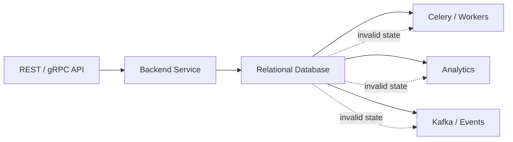
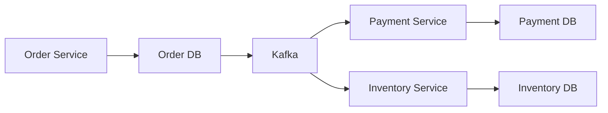
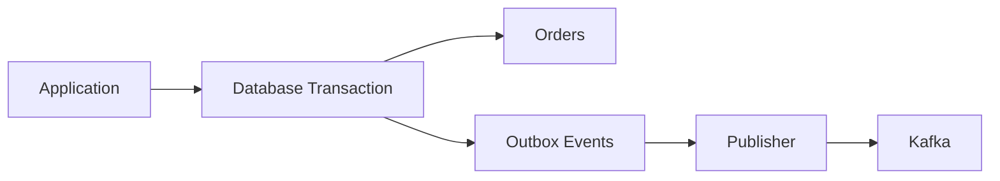
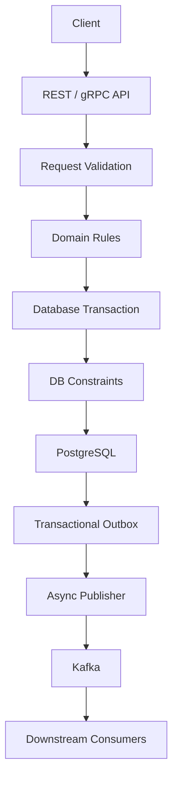

# 10- Data Integrity

## Overview

Data integrity is the property that data remains **correct, consistent, valid, and trustworthy throughout its lifecycle**.

In a relational database, integrity is primarily achieved through a combination of:

- Constraints
- Transactions
- Referential integrity
- Appropriate data types
- Keys and uniqueness rules
- Concurrency control
- Application/domain validation
- Carefully designed schemas and migrations

For backend engineers, data integrity is more than preventing malformed rows. It means ensuring that the database cannot enter states that contradict the application's domain model.

For example, an order system may require:

```text
An order must belong to an existing customer.
An order total cannot be negative.
An order cannot be marked as paid without a valid payment.
A membership cannot exist twice for the same user and organization.
A deleted customer cannot leave orphaned dependent records.
```

The database should enforce the rules that define **valid persistent state**, while application code handles richer business workflows and user-facing validation.

---

## Why Data Integrity Matters

Without strong integrity guarantees, errors accumulate silently.

Consider:

```text
users
-----
id = 10

orders
------
id = 100
user_id = 999
```

The application may believe every order belongs to a valid user, but the database contains an impossible relationship.

Other examples include:

```text
quantity = -4
email = NULL
duplicate payment IDs
two active subscriptions for one customer
order referencing a deleted account
```

These errors become expensive because downstream systems may trust the database:



A corrupted database state can therefore propagate into caches, events, search indexes, reports, and external integrations.

Strong integrity reduces this blast radius.

---

## Types of Data Integrity

A useful classification is:

| Integrity type | Purpose | Typical mechanism |
|---|---|---|
| Entity integrity | Every row has a reliable identity | Primary key |
| Referential integrity | Relationships point to valid rows | Foreign key |
| Domain integrity | Values satisfy domain rules | Data types, `CHECK`, `NOT NULL` |
| Key integrity | Values that must be unique remain unique | `UNIQUE` |
| Transactional integrity | Related changes succeed or fail together | Transactions |
| Temporal integrity | Data relationships remain valid over time | Constraints + temporal/domain logic |
| Application integrity | Complex workflows follow business rules | Application/domain logic |

These categories overlap. Production systems generally need several layers simultaneously.

---

## Entity Integrity

Entity integrity ensures that each persisted entity can be uniquely identified.

A primary key provides this guarantee:

```sql
CREATE TABLE users (
    id BIGINT PRIMARY KEY,
    email TEXT NOT NULL
);
```

The database prevents:

```text
NULL primary key
duplicate primary key
```

A stable identifier is important because other tables, APIs, jobs, and external systems may reference the entity.

### Production Considerations

A primary key should generally be:

- Stable
- Unique
- Non-null
- Efficient to index
- Appropriate for expected scale

Common choices include:

| Key type | Advantages | Trade-offs |
|---|---|---|
| Sequential integer | Compact, efficient indexes | Predictable and database-local |
| UUID | Globally unique, useful across services | Larger indexes and less locality depending on generation |
| ULID-like identifiers | Sortable and distributed-friendly | Additional format/implementation considerations |
| Natural key | Domain meaningful | Often mutable or unexpectedly constrained |

Do not choose a key only because it looks convenient in an ORM model. Consider indexing, replication, distributed writes, external exposure, and data migration requirements.

---

## Referential Integrity

Referential integrity ensures that relationships between rows remain valid.

Example:

```sql
CREATE TABLE customers (
    id BIGINT PRIMARY KEY
);

CREATE TABLE orders (
    id BIGINT PRIMARY KEY,
    customer_id BIGINT NOT NULL,
    CONSTRAINT orders_customer_fk
        FOREIGN KEY (customer_id)
        REFERENCES customers(id)
);
```

Now:

```text
orders.customer_id
        │
        ▼
customers.id
```

must refer to an existing customer.

This prevents orphaned records.

### Why It Matters

Without foreign keys, every writer must independently implement:

```text
Does parent exist?
Can parent be deleted?
Can child be inserted?
What happens during concurrent changes?
```

A foreign key moves the core relationship invariant into the database.

---

## Domain Integrity

Domain integrity restricts values to states that make sense for the application.

Example:

```sql
CREATE TABLE products (
    id BIGINT PRIMARY KEY,
    price NUMERIC(12, 2) NOT NULL,
    quantity INTEGER NOT NULL,
    CONSTRAINT products_price_check
        CHECK (price >= 0),
    CONSTRAINT products_quantity_check
        CHECK (quantity >= 0)
);
```

This protects against:

```text
price = -100
quantity = -5
```

Data types also provide integrity.

Prefer:

```sql
created_at TIMESTAMPTZ
```

over:

```sql
created_at TEXT
```

and:

```sql
price NUMERIC(12, 2)
```

over:

```sql
price FLOAT
```

when exact monetary representation is required.

Choosing the correct data type is itself an integrity decision.

---

## NOT NULL and Data Integrity

If a field is required by the domain, encode that requirement:

```sql
email TEXT NOT NULL
```

instead of:

```sql
email TEXT
```

The nullable version introduces another possible state:

```text
email = valid value
email = NULL
```

If `NULL` has no meaningful domain interpretation, allowing it increases complexity.

For example:

```sql
status TEXT NOT NULL DEFAULT 'pending'
```

is stronger than:

```sql
status TEXT DEFAULT 'pending'
```

because the second definition can still explicitly store `NULL`.

---

## Uniqueness Integrity

Some values must be unique.

```sql
CREATE TABLE payments (
    id BIGINT PRIMARY KEY,
    provider_payment_id TEXT NOT NULL,
    CONSTRAINT payments_provider_id_unique
        UNIQUE (provider_payment_id)
);
```

This is especially important for idempotency and external integrations.

Suppose a payment provider sends:

```text
provider_payment_id = pay_123
```

twice.

A unique constraint prevents accidental duplicate persistence.

Application code may check first:

```text
Does payment exist?
```

but concurrent requests can race.

The database constraint provides the authoritative guarantee.

---

## Transactional Integrity

Some operations involve multiple changes that must remain consistent.

For example, transferring money may involve:

```text
Debit account A
Credit account B
Record transaction
```

These changes should not partially commit.

```sql
BEGIN;

UPDATE accounts
SET balance = balance - 500
WHERE id = 1;

UPDATE accounts
SET balance = balance + 500
WHERE id = 2;

INSERT INTO transfers (from_account_id, to_account_id, amount)
VALUES (1, 2, 500);

COMMIT;
```

If a failure occurs before commit, the transaction can roll back.

The goal is:

```text
All related changes succeed
OR
none of them become durable
```

This is the atomicity component of ACID.

---

## Data Integrity and ACID

Data integrity is strongly connected to transaction guarantees.

| Property | Integrity relevance |
|---|---|
| Atomicity | Prevents partial multi-step updates |
| Consistency | Moves the database between valid states |
| Isolation | Controls interactions between concurrent transactions |
| Durability | Preserves committed state after failures |

A common misconception is that ACID consistency means "replicas eventually have the same data."

In database terminology, **consistency means transactions preserve defined integrity rules**.

Replication consistency is a separate concern.

---

## Integrity Across Concurrent Requests

Concurrency is where application-only integrity checks frequently fail.

Consider two requests:

```text
Request A                    Request B

check balance = 1000         check balance = 1000
withdraw 800                 withdraw 800
save 200                     save 200
```

If both operate based on the same stale state, the system may incorrectly process two withdrawals.

Integrity may require:

- Appropriate transaction isolation
- Row-level locking
- Atomic updates
- Constraints
- Optimistic concurrency control
- Domain-specific coordination

For example:

```sql
UPDATE accounts
SET balance = balance - 800
WHERE id = 1
  AND balance >= 800;
```

The application can inspect the affected-row count:

```text
1 row → withdrawal accepted
0 rows → insufficient balance or missing account
```

This can be safer than:

```text
SELECT balance
UPDATE balance
```

when implemented without appropriate transactional coordination.

---

## Constraints as Integrity Boundaries

A production schema should encode stable invariants.

Example:

```sql
CREATE TABLE subscriptions (
    id BIGINT PRIMARY KEY,
    customer_id BIGINT NOT NULL,
    status TEXT NOT NULL,
    started_at TIMESTAMPTZ NOT NULL,

    CONSTRAINT subscriptions_status_check
        CHECK (status IN ('trial', 'active', 'cancelled'))
);
```

This protects the database regardless of whether the write originates from:

- Django
- FastAPI
- Celery
- A migration
- An administrative script
- Another microservice
- A direct SQL client

The database is the shared persistence boundary.

---

## Application Validation vs Database Integrity

These layers have different responsibilities.

| Concern | Application | Database |
|---|---|---|
| User-friendly validation | Strong | Weak |
| Request format validation | Strong | Not primary purpose |
| Business workflow | Strong | Limited |
| Uniqueness under concurrency | Insufficient alone | Strong |
| Referential integrity | Insufficient alone | Strong |
| Required fields | Can validate | Strong |
| Row-level invariants | Can validate | Strong with constraints |
| Authorization | Strong | Separate DB security mechanisms may help |
| Multi-step atomicity | Uses transactions | Enforces transaction semantics |

A mature backend uses both:

```text
Client request
      ↓
API validation
      ↓
Domain/business validation
      ↓
Transaction
      ↓
Database constraints
      ↓
Durable valid state
```

Application validation should not be treated as a replacement for database integrity.

---

## Integrity and the ORM

ORMs such as Django ORM and SQLAlchemy make database operations easier, but the database remains the persistence authority.

For example, Django may define:

```python
class Product(models.Model):
    price = models.DecimalField(max_digits=12, decimal_places=2)

    class Meta:
        constraints = [
            models.CheckConstraint(
                condition=models.Q(price__gte=0),
                name="products_price_non_negative",
            ),
        ]
```

This expresses the invariant in application-managed schema definitions.

The migration must ultimately establish the corresponding database-level protection.

The same principle applies to FastAPI applications using SQLAlchemy:

```text
Pydantic
→ request validation

SQLAlchemy
→ persistence mapping

PostgreSQL
→ authoritative database integrity
```

---

## Integrity in Microservices

Data integrity becomes more difficult when data is distributed across services.

Suppose:



A foreign key cannot normally enforce:

```text
order.payment_id → payment database
```

when the entities live in separate databases.

This creates an important architectural boundary.

### Within One Database

Prefer strong database constraints:

```text
FK
UNIQUE
CHECK
NOT NULL
transactions
```

### Across Services

Use mechanisms such as:

- Domain events
- Idempotent consumers
- Transactional outbox
- Sagas
- State machines
- Reconciliation
- Retry policies
- Explicit eventual-consistency semantics

Do not pretend that a distributed system has the same integrity guarantees as a single relational transaction.

---

## Transactional Outbox and Integrity

Suppose an order must be persisted and an event must be published.

A dangerous implementation is:

```text
1. INSERT order
2. Publish Kafka event
```

If the process crashes between the two operations:

```text
Order exists
Event does not exist
```

A transactional outbox can reduce this failure mode:



The order and outbox event are committed atomically.

A worker then publishes the event and marks it processed.

This does not make Kafka and PostgreSQL one atomic transaction, but it establishes a durable handoff between the database state and asynchronous event publication.

---

## Integrity and Idempotency

Idempotency is important when requests can be retried.

Consider:

```text
POST /payments
```

A client may retry because of:

```text
network timeout
load balancer retry
client retry
worker retry
```

Without an integrity mechanism, one logical payment may become multiple rows.

A common design is:

```sql
CREATE TABLE payments (
    id BIGINT PRIMARY KEY,
    idempotency_key TEXT NOT NULL,
    amount NUMERIC(12, 2) NOT NULL,

    CONSTRAINT payments_idempotency_key_unique
        UNIQUE (idempotency_key),

    CONSTRAINT payments_amount_check
        CHECK (amount > 0)
);
```

The unique constraint turns a distributed retry problem into a database-enforced uniqueness invariant.

---

## Integrity and Soft Deletes

Soft deletion creates additional states.

Instead of:

```text
row exists
row does not exist
```

the system now has:

```text
row exists and active
row exists and deleted
```

This affects uniqueness and relationships.

For example:

```sql
CREATE UNIQUE INDEX users_active_email_unique
ON users(email)
WHERE deleted_at IS NULL;
```

This expresses:

```text
Only active users require unique email addresses.
```

Soft-delete semantics should be explicitly reflected in schema constraints and indexes rather than left entirely to application conventions.

---

## Integrity and Multi-Tenancy

Multi-tenant applications often require tenant-scoped invariants.

Example:

```sql
CREATE TABLE projects (
    id BIGINT PRIMARY KEY,
    organization_id BIGINT NOT NULL,
    slug TEXT NOT NULL,

    CONSTRAINT projects_org_slug_unique
        UNIQUE (organization_id, slug)
);
```

The invariant is:

```text
slug must be unique within an organization
```

not:

```text
slug must be globally unique
```

This distinction is critical for SaaS systems.

Integrity rules should match the actual domain scope.

---

## Integrity and Data Types

Choosing permissive data types can weaken integrity.

Prefer:

```sql
quantity INTEGER NOT NULL
```

over:

```sql
quantity TEXT
```

Prefer:

```sql
created_at TIMESTAMPTZ NOT NULL
```

over:

```sql
created_at TEXT
```

Prefer:

```sql
amount NUMERIC(12, 2) NOT NULL
```

over floating-point values when exact decimal arithmetic is required.

Prefer controlled values through:

```sql
CHECK (status IN ('pending', 'paid', 'cancelled'))
```

or an appropriate database enum/domain design when the domain requires it.

A strong schema makes invalid representation difficult.

---

## Integrity and Money

Financial values require particular care.

Avoid:

```sql
amount FLOAT
```

for exact monetary values.

Prefer:

```sql
amount NUMERIC(19, 4) NOT NULL
```

when the domain requires exact decimal arithmetic and sufficient precision.

Also define invariants explicitly:

```sql
CHECK (amount >= 0)
```

Do not rely on the application to prevent negative or invalid monetary values if the database can enforce the invariant.

For highly sensitive financial systems, model the ledger and transaction semantics carefully rather than treating a mutable `balance` column as the entire source of truth.

---

## Integrity and Time

Temporal fields can encode important domain rules.

Example:

```sql
CREATE TABLE reservations (
    id BIGINT PRIMARY KEY,
    starts_at TIMESTAMPTZ NOT NULL,
    ends_at TIMESTAMPTZ NOT NULL,
    CHECK (starts_at < ends_at)
);
```

This prevents:

```text
starts_at >= ends_at
```

For more advanced requirements, PostgreSQL can use exclusion constraints to prevent conflicting ranges.

The general principle is:

> Store temporal data in types that preserve the semantics required by the domain.

---

## Integrity and Migrations

A schema change can temporarily weaken or break integrity.

Suppose an existing table contains:

```text
email = NULL
```

and the desired schema is:

```sql
email TEXT NOT NULL
```

Adding the constraint immediately may fail.

A safer migration sequence is:

```text
Existing invalid data
       ↓
Audit
       ↓
Backfill / remediate
       ↓
Deploy compatible application code
       ↓
Add constraint
       ↓
Verify
```

For large production tables, migration design must also consider:

- Lock duration
- Table size
- Write volume
- Replication lag
- Deployment ordering
- Rollback strategy
- Constraint validation cost

Schema integrity should improve progressively without creating unnecessary production outages.

---

## Detecting Integrity Violations

Existing databases may already contain invalid data.

Before introducing a constraint, identify violations.

Example:

```sql
SELECT email, COUNT(*)
FROM users
GROUP BY email
HAVING COUNT(*) > 1;
```

Find orphaned rows:

```sql
SELECT o.*
FROM orders o
LEFT JOIN users u
    ON u.id = o.user_id
WHERE u.id IS NULL;
```

Find invalid values:

```sql
SELECT *
FROM products
WHERE price < 0;
```

These checks are useful during migrations, audits, incident response, and data-quality initiatives.

---

## Monitoring Data Integrity

Integrity should be observable.

Useful operational signals include:

- Constraint violation rates
- Failed transactions
- Duplicate-key errors
- Foreign-key violations
- Migration failures
- Deadlocks
- Serialization failures
- Unexpected `NULL` rates
- Reconciliation mismatches
- Outbox publishing failures
- Duplicate event processing
- Data consistency checks

A sudden increase in:

```text
UNIQUE constraint violations
```

may indicate:

- A client retry problem
- A broken idempotency implementation
- A deployment regression
- A race condition
- Incorrect business logic

Database errors can therefore be valuable operational signals rather than merely failures to suppress.

---

## Reliability and Disaster Recovery

Backups protect against data loss, but they do not guarantee that incorrect data is never written.

A reliable database strategy should address:

```text
Integrity
+
Transactions
+
Backups
+
Point-in-time recovery
+
Replication
+
Restore testing
```

Replication also does not replace backups.

If invalid data is committed and replicated, the invalid state may be replicated successfully.

Recovery procedures should therefore include:

- Point-in-time recovery
- Backup verification
- Restore testing
- Migration rollback plans
- Data reconciliation
- Auditability for critical domains

---

## Security Implications

Data integrity is not equivalent to security, but weak integrity can create security vulnerabilities.

Examples:

```text
orphaned authorization records
invalid ownership relationships
duplicate identity records
tampered status values
inconsistent tenant associations
```

For example, if an application's authorization logic depends on:

```text
document.organization_id
membership.organization_id
```

then inconsistent relationships can create access-control problems.

Database constraints can help ensure relationships remain structurally valid.

However:

> Constraints do not replace authentication or authorization.

Authorization must still determine whether a caller is permitted to perform an operation.

---

## Common Production Pitfalls

### Treating Validation as Integrity

Application validation can race.

Use database constraints for invariants that must survive concurrency.

### Allowing Impossible States

If a value can never be negative, enforce:

```sql
CHECK (value >= 0)
```

rather than relying solely on application conventions.

### Ignoring Existing Invalid Data

Constraints cannot usually be added safely until existing violations are addressed.

### Using Excessively Permissive Types

Storing dates, money, quantities, and status values as arbitrary strings weakens the schema.

### Removing Foreign Keys for Convenience

Foreign keys can add operational considerations, but removing them without replacing the integrity guarantee creates orphan-data risk.

### Overusing Cascading Deletes

A cascade can delete a large dependency tree unexpectedly.

Understand the full relationship graph before using it.

### Assuming Replication Provides Integrity

Replication copies database state; it does not determine whether the state is semantically correct.

### Assuming ORM Guarantees Are Enough

ORM-level validation can be bypassed by another writer, raw SQL, workers, migrations, or concurrent transactions.

### Hiding Constraint Errors

Do not catch every database exception and return a generic success response.

Constraint violations often indicate real correctness problems.

### Using Database Constraints for Complex Workflows

A relational constraint is excellent for stable invariants but is not a replacement for domain logic, authorization, or workflow orchestration.

---

## Production Integrity Checklist

Before shipping a schema, verify:

### Schema

- Every entity has an appropriate primary key.
- Required columns use `NOT NULL`.
- Uniqueness requirements are explicitly encoded.
- Foreign-key relationships are intentional.
- Row-level invariants use `CHECK` where appropriate.
- Data types reflect domain semantics.
- Constraint names are consistent and meaningful.

### Transactions

- Related writes use appropriate transaction boundaries.
- Concurrent operations have been analyzed.
- Isolation and locking behavior are understood.
- Deadlocks and serialization failures are handled appropriately.

### Application

- Input validation provides useful client errors.
- Database constraint failures are translated into stable API errors.
- ORM validation is not treated as the final integrity boundary.
- Retries are designed around idempotency.

### Distributed Systems

- Cross-service consistency assumptions are explicit.
- Events are idempotently consumed.
- Transactional outbox is considered where database changes and events must remain coordinated.
- Reconciliation exists for important eventually consistent workflows.

### Operations

- Migrations account for existing data.
- Large-table constraint changes are planned carefully.
- Integrity-related database errors are monitored.
- Backup and restore procedures are tested.
- Critical data has reconciliation or audit mechanisms.

---

## Integrity Decision Framework

When designing an invariant, ask:

```text
Must this rule always be true?
        │
        ├── No
        │    └── Application/domain behavior may be sufficient
        │
        └── Yes
             │
             ├── Can the database express it?
             │      │
             │      ├── Yes → Use a constraint/index/type
             │      │
             │      └── No → Use transaction/domain logic
             │
             └── Does it cross service/database boundaries?
                    │
                    ├── No → Database transaction/constraint
                    │
                    └── Yes → Explicit distributed consistency strategy
```

The objective is not to put every rule into the database.

The objective is to place each invariant at the **strongest practical enforcement boundary**.

---

## Interview Traps

| Question | Correct reasoning |
|---|---|
| Does application validation guarantee integrity? | No; concurrent or independent writers can bypass it |
| Does ACID consistency mean replicas are always synchronized? | No; ACID consistency concerns transaction validity and defined database invariants |
| Is a foreign key only for query convenience? | No; it enforces referential integrity |
| Does a unique index replace every uniqueness requirement? | It can enforce uniqueness, but the schema should clearly express the intended invariant |
| Are transactions sufficient for all integrity problems? | No; constraints, domain logic, concurrency control, and distributed coordination may also be required |
| Does replication protect against invalid writes? | No; invalid committed state can be replicated |
| Can microservices use foreign keys across separate databases? | Not as a normal relational foreign key; cross-service integrity needs another strategy |
| Does `DEFAULT` guarantee a value exists? | No; combine it with `NOT NULL` when nullability is invalid |
| Is data integrity the same as authorization? | No |
| Should every business rule become a database constraint? | No; complex workflows may belong in application/domain logic |

---

## Practical Backend Architecture

A mature backend typically enforces integrity at multiple layers:



Each layer has a different responsibility:

| Layer | Responsibility |
|---|---|
| API | Validate request shape and provide useful client errors |
| Domain | Enforce workflow and business behavior |
| Transaction | Keep related persistence operations atomic |
| Database constraints | Prevent invalid persistent states |
| Outbox | Reliably bridge database state to asynchronous events |
| Consumers | Maintain idempotent downstream processing |
| Monitoring | Detect integrity failures and consistency drift |

This layered approach is more reliable than attempting to make one component responsible for every integrity guarantee.

---

## Key Takeaways

- **Data integrity means the database remains in valid, trustworthy states**, protected through constraints, correct data types, transactions, and appropriate application/domain logic.
- **Database constraints should enforce stable invariants that must remain true under concurrency and regardless of which application component performs the write.**
- **Transactions protect atomic multi-step changes, while constraints protect structural invariants; neither mechanism replaces the other.**
- **Distributed systems require explicit consistency strategies** such as idempotency, transactional outbox patterns, reconciliation, and carefully defined eventual consistency.
- **Production-grade integrity requires more than schema design**: migrations, concurrency, observability, backups, recovery, and operational procedures must preserve the integrity boundary over the system's entire lifecycle.