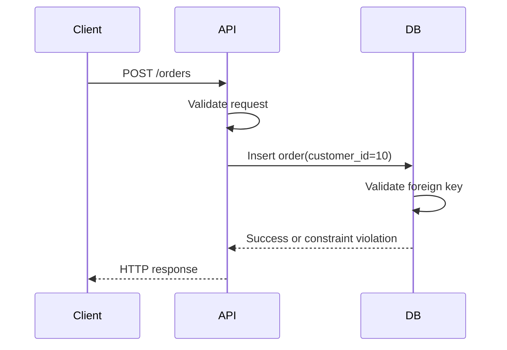

# 11- Referential Integrity

## Overview

Referential integrity is the guarantee that relationships between rows in relational tables remain valid.

The primary mechanism is the **foreign key constraint**. A foreign key establishes a relationship between a column or set of columns in one table and a candidate key—typically a primary key—in another table.

For example:

```sql
CREATE TABLE customers (
    id BIGINT PRIMARY KEY,
    name TEXT NOT NULL
);

CREATE TABLE orders (
    id BIGINT PRIMARY KEY,
    customer_id BIGINT NOT NULL,
    created_at TIMESTAMPTZ NOT NULL DEFAULT CURRENT_TIMESTAMP,

    CONSTRAINT orders_customer_fk
        FOREIGN KEY (customer_id)
        REFERENCES customers(id)
);
```

The database now guarantees:

```text
orders.customer_id
        │
        ▼
customers.id
```

Every non-null `orders.customer_id` must refer to an existing `customers.id`.

This matters because relational databases are often shared by multiple application components:

```text
Django / FastAPI
       │
       ├── API requests
       ├── Background workers
       ├── Management commands
       ├── Data migrations
       └── Administrative scripts
                │
                ▼
           PostgreSQL
```

If relationship validity is enforced only in application code, one writer can accidentally create an invalid relationship. A foreign key moves that fundamental invariant into the database.

---

## What Referential Integrity Protects

Referential integrity primarily prevents **orphaned child records** and invalid references.

Consider:

```text
customers
+----+----------+
| id | name     |
+----+----------+
| 10 | Alice    |
| 20 | Bob      |
+----+----------+

orders
+-----+-------------+
| id  | customer_id |
+-----+-------------+
| 101 | 10          |
| 102 | 20          |
+-----+-------------+
```

This is valid because both referenced customers exist.

The following is invalid:

```text
orders
+-----+-------------+
| id  | customer_id |
+-----+-------------+
| 103 | 999         |
+-----+-------------+
```

if customer `999` does not exist.

A foreign key prevents this state.

---

## Why Referential Integrity Exists

Without database-enforced referential integrity, an application must manually maintain relationships.

A naive implementation might do:

```text
1. Check whether customer exists.
2. Create order.
```

That looks correct but does not automatically make the relationship safe under concurrency.

For example:

```text
Request A                       Request B

Check customer 10 exists
                                Delete customer 10
Create order for customer 10
```

If the database does not enforce the relationship, the application can create an order pointing to a customer that no longer exists.

A foreign key makes the database itself responsible for validating the relationship at the point where the write occurs.

---

## Parent and Child Tables

Referential integrity is commonly described using **parent** and **child** terminology.

```sql
CREATE TABLE departments (
    id BIGINT PRIMARY KEY
);

CREATE TABLE employees (
    id BIGINT PRIMARY KEY,
    department_id BIGINT NOT NULL,

    CONSTRAINT employees_department_fk
        FOREIGN KEY (department_id)
        REFERENCES departments(id)
);
```

Here:

- `departments` is the **parent** table.
- `employees` is the **child** table.
- `departments.id` is the referenced key.
- `employees.department_id` is the foreign key.

The relationship is:

```text
departments
    │
    │ 1
    │
    │
    │ N
    ▼
employees
```

A department can have many employees, but each employee must reference a valid department.

---

## Basic Foreign Key Definition

A foreign key can be defined during table creation:

```sql
CREATE TABLE orders (
    id BIGINT PRIMARY KEY,
    customer_id BIGINT NOT NULL,
    CONSTRAINT orders_customer_fk
        FOREIGN KEY (customer_id)
        REFERENCES customers(id)
);
```

It can also be added later:

```sql
ALTER TABLE orders
ADD CONSTRAINT orders_customer_fk
FOREIGN KEY (customer_id)
REFERENCES customers(id);
```

Named constraints are preferable in production because they make schema management and database errors easier to understand.

---

## What Can Be Referenced

A foreign key must reference a column or column set that satisfies the database's requirements for a referenced key.

The common case is:

```sql
FOREIGN KEY (customer_id)
REFERENCES customers(id)
```

where `customers.id` is the primary key.

A foreign key can also reference a suitable unique key.

For example:

```sql
CREATE TABLE customers (
    id BIGINT PRIMARY KEY,
    external_id TEXT NOT NULL UNIQUE
);
```

Another table can reference:

```sql
FOREIGN KEY (customer_external_id)
REFERENCES customers(external_id)
```

However, referencing an internal primary key is often preferable unless the domain specifically requires the alternate key.

---

## Composite Foreign Keys

Relationships can involve multiple columns.

Example:

```sql
CREATE TABLE organizations (
    id BIGINT PRIMARY KEY
);

CREATE TABLE projects (
    organization_id BIGINT NOT NULL,
    project_id BIGINT NOT NULL,

    PRIMARY KEY (organization_id, project_id)
);

CREATE TABLE project_members (
    organization_id BIGINT NOT NULL,
    project_id BIGINT NOT NULL,
    user_id BIGINT NOT NULL,

    CONSTRAINT project_members_project_fk
        FOREIGN KEY (organization_id, project_id)
        REFERENCES projects(organization_id, project_id)
);
```

The pair:

```text
(organization_id, project_id)
```

identifies the project.

The child must reference the complete pair.

A composite foreign key is useful when identity is inherently scoped by multiple attributes, particularly in multi-tenant or domain-specific schemas.

---

## NULL and Foreign Keys

A foreign key column can be nullable unless `NOT NULL` is specified.

For example:

```sql
CREATE TABLE employees (
    id BIGINT PRIMARY KEY,
    manager_id BIGINT,
    CONSTRAINT employees_manager_fk
        FOREIGN KEY (manager_id)
        REFERENCES employees(id)
);
```

This permits:

```text
manager_id = 10
manager_id = 20
manager_id = NULL
```

`NULL` represents the absence of a relationship rather than an invalid reference.

If every employee must have a manager, use:

```sql
manager_id BIGINT NOT NULL
```

The choice should reflect the domain rather than being made merely for convenience.

---

## Self-Referential Foreign Keys

A table can reference itself.

This is common for hierarchical data.

```sql
CREATE TABLE employees (
    id BIGINT PRIMARY KEY,
    name TEXT NOT NULL,
    manager_id BIGINT,

    CONSTRAINT employees_manager_fk
        FOREIGN KEY (manager_id)
        REFERENCES employees(id)
);
```

The relationship becomes:

```text
Employee
   │
   └── manager_id ──► Employee.id
```

This can represent:

```text
CEO
 ├── Engineering Manager
 │    ├── Engineer
 │    └── Engineer
 └── Product Manager
      └── Product Manager
```

A self-referencing foreign key guarantees that the manager row exists, but it does not automatically guarantee that the hierarchy is logically valid.

For example, preventing arbitrary cycles may require additional application or database logic.

---

## Foreign Keys and Relationship Types

Foreign keys are fundamental to implementing relational relationships.

| Relationship | Typical implementation |
|---|---|
| One-to-one | FK + `UNIQUE` |
| One-to-many | FK on the many-side |
| Many-to-many | Junction table containing FKs |
| Self-reference | FK referencing the same table |
| Composite relationship | Composite FK |

### One-to-One

```sql
CREATE TABLE user_profiles (
    user_id BIGINT PRIMARY KEY,
    bio TEXT,

    CONSTRAINT profiles_user_fk
        FOREIGN KEY (user_id)
        REFERENCES users(id)
);
```

Using the foreign key as the primary key guarantees one profile per user.

### One-to-Many

```sql
CREATE TABLE orders (
    id BIGINT PRIMARY KEY,
    customer_id BIGINT NOT NULL,

    FOREIGN KEY (customer_id)
        REFERENCES customers(id)
);
```

Multiple orders can reference the same customer.

### Many-to-Many

```sql
CREATE TABLE course_students (
    course_id BIGINT NOT NULL,
    student_id BIGINT NOT NULL,

    PRIMARY KEY (course_id, student_id),

    FOREIGN KEY (course_id)
        REFERENCES courses(id),

    FOREIGN KEY (student_id)
        REFERENCES students(id)
);
```

The junction table contains foreign keys to both entities.

---

## Foreign Key Actions

A major production concern is what happens when a referenced parent row is updated or deleted.

SQL provides referential actions.

Common options include:

| Action | Behavior |
|---|---|
| `NO ACTION` | Rejects the operation if it would violate the relationship |
| `RESTRICT` | Rejects the operation when dependent rows exist |
| `CASCADE` | Propagates the update/delete |
| `SET NULL` | Sets the child FK to `NULL` |
| `SET DEFAULT` | Sets the child FK to its default value |

Exact timing and semantics can vary by database engine. In PostgreSQL, `NO ACTION` can be deferred when the constraint is deferrable, while `RESTRICT` cannot be deferred.

---

## ON DELETE CASCADE

Example:

```sql
CREATE TABLE customers (
    id BIGINT PRIMARY KEY
);

CREATE TABLE customer_addresses (
    id BIGINT PRIMARY KEY,
    customer_id BIGINT NOT NULL,

    CONSTRAINT addresses_customer_fk
        FOREIGN KEY (customer_id)
        REFERENCES customers(id)
        ON DELETE CASCADE
);
```

Deleting a customer can delete their addresses automatically.

```sql
DELETE FROM customers
WHERE id = 10;
```

Conceptually:

```text
DELETE customer
      │
      ▼
DELETE dependent addresses
```

### When to Use

`CASCADE` is appropriate when the child has no meaningful independent existence.

Examples:

```text
user → user_preferences
order → order_items
post → post_comments
```

### Risks

Cascades can be dangerous in large dependency graphs.

One delete can trigger:

```text
customer
  ├── orders
  │    └── order_items
  ├── addresses
  └── preferences
```

A production delete can therefore become significantly more expensive than the original statement suggests.

Understand the entire dependency graph before using cascading deletes.

---

## ON DELETE SET NULL

Use `SET NULL` when the child should survive but the relationship can disappear.

```sql
CREATE TABLE employees (
    id BIGINT PRIMARY KEY,
    manager_id BIGINT,

    CONSTRAINT employees_manager_fk
        FOREIGN KEY (manager_id)
        REFERENCES employees(id)
        ON DELETE SET NULL
);
```

If a manager is deleted:

```text
Employee
   │
   ├── manager_id = NULL
   │
   └── Employee remains
```

This requires the foreign key column to allow `NULL`.

A useful domain example is:

```text
article.author_id
```

where an article may remain after the author account is removed.

---

## ON DELETE RESTRICT and NO ACTION

These actions prevent a parent from being deleted while dependent rows would violate the relationship.

Example:

```sql
CREATE TABLE orders (
    id BIGINT PRIMARY KEY,
    customer_id BIGINT NOT NULL,

    CONSTRAINT orders_customer_fk
        FOREIGN KEY (customer_id)
        REFERENCES customers(id)
        ON DELETE RESTRICT
);
```

If orders exist, deleting the customer fails.

This is often appropriate when deletion of the parent should require an explicit business decision about its children.

For important business records, this can be safer than automatic cascading.

---

## ON UPDATE Actions

Foreign keys can also specify behavior when referenced key values change.

Example:

```sql
FOREIGN KEY (customer_id)
REFERENCES customers(id)
ON UPDATE CASCADE
```

In many backend systems, primary keys are immutable.

Therefore, `ON UPDATE` behavior is less commonly important than `ON DELETE` behavior.

A strong design normally treats identifiers as stable and avoids changing primary key values after records have been created.

---

## Referential Integrity and Transactions

Foreign keys participate in transactions.

Consider:

```sql
BEGIN;

INSERT INTO orders (id, customer_id)
VALUES (100, 10);

INSERT INTO customers (id)
VALUES (10);

COMMIT;
```

Depending on the constraint configuration and database behavior, an immediate foreign key constraint can reject the order insert because customer `10` does not yet exist.

With a **deferrable** constraint, validation can be postponed until transaction commit.

Example in PostgreSQL:

```sql
CREATE TABLE orders (
    id BIGINT PRIMARY KEY,
    customer_id BIGINT NOT NULL,

    CONSTRAINT orders_customer_fk
        FOREIGN KEY (customer_id)
        REFERENCES customers(id)
        DEFERRABLE INITIALLY DEFERRED
);
```

Then constraint validation can occur at commit time.

This is an advanced feature and should be used only when transaction ordering genuinely requires it.

---

## Deferred Constraints

A deferred constraint allows certain integrity checks to be postponed until the transaction reaches a defined point.

For example:

```sql
BEGIN;

SET CONSTRAINTS orders_customer_fk DEFERRED;

-- Operations that temporarily violate the relationship
-- but result in a valid state before COMMIT.

COMMIT;
```

This can be useful for complex data transformations and certain cyclic dependency scenarios.

It should not be used simply to hide ordering problems in ordinary application logic.

The final transaction state must still satisfy the constraint.

---

## Referential Integrity and Concurrency

Foreign keys are especially valuable under concurrency because the database evaluates relationship validity as part of its transaction and locking model.

Suppose:

```text
Transaction A                   Transaction B

Insert order(customer_id=10)
                                Delete customer(10)
```

The database must coordinate these operations so that the committed state does not violate the foreign key.

This is one of the fundamental differences between:

```text
Application convention
```

and:

```text
Database-enforced invariant
```

The database can coordinate multiple writers against the same relationship.

---

## Indexing Foreign Keys

A foreign key does **not universally imply that the child column automatically has an index**.

For example:

```sql
CREATE TABLE orders (
    id BIGINT PRIMARY KEY,
    customer_id BIGINT NOT NULL,
    FOREIGN KEY (customer_id)
        REFERENCES customers(id)
);
```

The foreign key exists, but whether an index is created on:

```text
orders.customer_id
```

depends on the database and schema definition.

In PostgreSQL, creating a foreign key does not automatically create an index on the referencing columns.

An index is often useful:

```sql
CREATE INDEX idx_orders_customer_id
ON orders(customer_id);
```

### Why?

Queries commonly access children through the relationship:

```sql
SELECT *
FROM orders
WHERE customer_id = 10;
```

The index can also reduce the cost of checking dependent rows during parent updates or deletes.

However, indexes are not free.

They introduce:

- Storage overhead
- Write amplification
- Maintenance work
- Additional memory/cache pressure

Index foreign keys based on access patterns and relationship operations, not blindly.

---

## Composite Foreign Key Indexing

For a composite foreign key:

```sql
FOREIGN KEY (organization_id, project_id)
REFERENCES projects(organization_id, project_id)
```

an index such as:

```sql
CREATE INDEX idx_members_project
ON project_members(organization_id, project_id);
```

may be appropriate.

Column order matters.

An index on:

```text
(organization_id, project_id)
```

is not equivalent to an index on:

```text
(project_id, organization_id)
```

for every query pattern.

Index design should follow actual queries and cardinality.

---

## Foreign Keys and Query Performance

Foreign keys primarily exist for correctness, not query acceleration.

They do not automatically make joins faster.

For example:

```sql
SELECT
    o.id,
    c.name
FROM orders AS o
JOIN customers AS c
    ON c.id = o.customer_id;
```

Performance depends on:

- Indexes
- Cardinality
- Statistics
- Query plan
- Table size
- Data distribution
- Join strategy
- Memory
- Database configuration

A foreign key tells the database that the relationship is valid. It is not a substitute for proper indexing.

---

## Referential Integrity in ORMs

Modern ORMs expose foreign-key relationships.

### Django

```python
class Customer(models.Model):
    name = models.CharField(max_length=200)


class Order(models.Model):
    customer = models.ForeignKey(
        Customer,
        on_delete=models.PROTECT,
    )
```

Django's `on_delete` behavior defines how the ORM models deletion semantics, while the database schema should also enforce the actual foreign-key relationship.

Common Django choices include:

```python
models.CASCADE
models.PROTECT
models.SET_NULL
models.RESTRICT
```

The correct choice depends on the domain.

For example, protecting a customer from deletion while historical orders exist may be more appropriate than cascading through financial records.

### SQLAlchemy

A SQLAlchemy model may define:

```python
class Order(Base):
    __tablename__ = "orders"

    id = mapped_column(BigInteger, primary_key=True)
    customer_id = mapped_column(
        ForeignKey("customers.id"),
        nullable=False,
    )
```

The ORM makes the relationship convenient to use, but database-level foreign keys remain important for integrity.

---

## Referential Integrity in REST APIs

A REST API may receive:

```http
POST /orders
Content-Type: application/json

{
  "customer_id": 10,
  "amount": 2500
}
```

A backend may validate:

```text
Does customer 10 exist?
```

But that validation is not sufficient by itself.

The complete flow should be:



The application can provide a good user-facing error, while the database remains the final structural integrity boundary.

---

## Mapping Constraint Errors to API Errors

A foreign-key violation should normally become an appropriate application-level response rather than an unhandled database error.

For example:

```text
Database:
foreign key violation

Application:
customer does not exist

HTTP:
400 Bad Request
```

or, depending on the API semantics:

```text
404 Not Found
```

The exact status code should follow the API contract.

Do not expose raw database exception messages, table names, or internal schema details to clients.

---

## Referential Integrity and Soft Deletes

Soft deletes complicate relationship semantics.

Suppose:

```sql
customers.deleted_at
```

marks a customer as deleted.

The customer row still physically exists, so a foreign key can still reference it.

The database therefore sees:

```text
customer exists
```

while the application may interpret:

```text
customer is unavailable
```

This creates two separate concepts:

```text
Physical referential integrity
        vs
Business-level active relationship
```

A foreign key alone cannot generally express all soft-delete semantics.

The application, schema design, indexes, and potentially row-level policies must work together.

---

## Referential Integrity and Multi-Tenancy

Multi-tenant systems require careful relationship modeling.

Consider:

```sql
CREATE TABLE projects (
    id BIGINT PRIMARY KEY,
    organization_id BIGINT NOT NULL
);
```

A simple foreign key:

```sql
FOREIGN KEY (project_id)
REFERENCES projects(id)
```

guarantees that the project exists, but it does not necessarily guarantee that the project belongs to the same organization as the requesting user's context.

Tenant isolation may require additional schema-level design.

For example, composite keys can encode tenant scope:

```text
(organization_id, project_id)
```

and composite foreign keys can ensure that the relationship remains inside the expected tenant boundary.

This is particularly valuable when tenant isolation is a core security requirement.

---

## Cross-Database Relationships

A normal relational foreign key generally works within the database system's supported relational scope.

Consider:

```text
Order Service DB
      │
      └── orders.customer_id

Customer Service DB
      │
      └── customers.id
```

A normal foreign key cannot simply enforce:

```text
orders.customer_id → customers.id
```

across independent service databases.

This is a major architectural boundary.

Instead, distributed systems typically use:

- Application-level validation
- Domain events
- Idempotency
- Transactional outbox
- Reconciliation
- Sagas
- Explicit consistency policies

For example:


The system must explicitly define what happens if the customer state changes independently of the order state.

---

## Referential Integrity and Eventual Consistency

A distributed system may temporarily have:

```text
Order exists
Customer information unavailable
```

This is fundamentally different from a single relational database enforcing:

```text
Order must reference an existing customer
```

When moving from a monolithic relational database to microservices, do not assume that application-level references provide the same guarantees as foreign keys.

Document:

- Which relationships are strongly consistent
- Which are eventually consistent
- How invalid references are detected
- How missing entities are handled
- How reconciliation occurs
- How deleted entities affect dependent services

Explicit consistency semantics are a senior-level database design concern.

---

## Foreign Keys and Deletion Strategy

There is no universally correct deletion action.

Choose based on the domain.

| Domain relationship | Typical strategy |
|---|---|
| Order → Order item | `CASCADE` |
| Customer → Financial transaction | Often `RESTRICT` or soft delete |
| Employee → Manager | `SET NULL` may be appropriate |
| User → Preferences | `CASCADE` can be appropriate |
| Product → Historical order item | Usually preserve historical data |
| Organization → Critical audit records | Usually avoid automatic cascade |

The key question is:

> Does the child have an independent business meaning after the parent is deleted?

If no, `CASCADE` may be appropriate.

If yes, preserve the child and choose another strategy.

---

## Audit Data and Referential Integrity

Audit records often have special retention requirements.

For example:

```text
users
audit_events
```

An audit event may need to survive the deletion or anonymization of a user.

Using:

```sql
ON DELETE CASCADE
```

could destroy the audit trail.

A better design may use:

```sql
user_id BIGINT
```

with carefully chosen deletion semantics, or store an immutable actor identifier appropriate for the audit requirements.

Retention, privacy, compliance, and forensic requirements should influence foreign-key behavior.

---

## Common Mistakes

### Checking Existence in Application Code Only

This pattern is unsafe under concurrency:

```text
SELECT customer
IF customer exists:
    INSERT order
```

Use a foreign key as the structural guarantee.

### Forgetting Indexes on High-Volume Foreign Keys

A relationship may be valid but still perform poorly when frequently queried or when parent deletes/updates require checking many child rows.

### Cascading Deletes Without Understanding the Graph

A single delete can affect many tables.

Inspect dependencies before enabling cascades.

### Making Every Foreign Key Nullable

Nullable relationships should represent a real domain state, not merely make inserts easier.

### Using Natural Keys Without Considering Mutability

Referencing an email address or username can create difficult update semantics.

Stable surrogate identifiers are often simpler.

### Assuming Foreign Keys Improve Join Performance

Foreign keys establish correctness. Indexes and query plans determine join performance.

### Removing Foreign Keys to "Improve Performance"

Foreign keys have overhead, but removing them can transfer correctness costs into every writer.

Measure before removing integrity constraints.

### Relying Entirely on ORM Behavior

Raw SQL, migrations, scripts, workers, and other services can bypass ORM-level assumptions.

### Using Cascades on Historical Business Data

Deleting financial or audit history can violate retention and reporting requirements.

### Ignoring Cross-Tenant Relationships

A valid foreign key does not automatically prove that two entities belong to the same tenant or authorization scope.

---

## Production Design Checklist

Before adding a foreign key, verify:

### Relationship

- What is the parent?
- What is the child?
- Is the relationship mandatory or optional?
- Is the relationship one-to-one, one-to-many, or many-to-many?
- Should the child survive parent deletion?

### Constraint

- Is the referenced key primary or appropriately unique?
- Should the FK be nullable?
- Is a composite foreign key required?
- Is the deletion action correct?
- Is an update action necessary?

### Performance

- Will the FK column be queried frequently?
- Does it need an index?
- How large are the parent and child tables?
- Could parent deletes trigger expensive scans?
- Could cascading operations become large?

### Operations

- Can the constraint be added safely to existing data?
- Are there existing orphaned rows?
- What locks can the migration acquire?
- Could replication lag increase?
- Is the migration reversible?

### Application

- Does the API return an appropriate error?
- Are retries safe?
- Are ORM and database semantics aligned?
- Can background workers write the same relationship?

### Architecture

- Does the relationship cross service/database boundaries?
- If so, what replaces the database foreign key?
- How are inconsistencies detected?
- Is reconciliation required?

---

## Finding Existing Orphans

Before introducing a foreign key, identify invalid references.

Example:

```sql
SELECT o.*
FROM orders AS o
LEFT JOIN customers AS c
    ON c.id = o.customer_id
WHERE c.id IS NULL;
```

These rows must be repaired before the constraint can be safely established.

Typical remediation options include:

- Correcting the reference
- Restoring the missing parent
- Deleting invalid child records
- Assigning the child to an explicit replacement entity
- Migrating historical data

Do not silently discard orphaned records without understanding their business meaning.

---

## Adding a Foreign Key to an Existing Production Table

A simplified workflow is:

```text
Existing table
      │
      ▼
Find invalid references
      │
      ▼
Repair invalid data
      │
      ▼
Deploy compatible application code
      │
      ▼
Add foreign-key constraint
      │
      ▼
Monitor
```

For large PostgreSQL tables, migration strategy deserves additional care.

PostgreSQL supports techniques such as adding a foreign key as `NOT VALID`, validating existing rows separately, and then relying on the constraint for subsequent changes.

A simplified example is:

```sql
ALTER TABLE orders
ADD CONSTRAINT orders_customer_fk
FOREIGN KEY (customer_id)
REFERENCES customers(id)
NOT VALID;
```

After existing violations are repaired:

```sql
ALTER TABLE orders
VALIDATE CONSTRAINT orders_customer_fk;
```

This can be useful for reducing the operational impact of introducing integrity checks to large production tables.

The exact locking and runtime behavior should still be evaluated against the PostgreSQL version, table size, workload, and deployment environment.

---

## Referential Integrity and Database Ownership

A senior backend engineer should distinguish between:

```text
Who owns the relationship?
```

and:

```text
Where is the relationship enforced?
```

For a monolithic application:

```text
Django
   │
   ▼
PostgreSQL
   │
   ├── customers
   └── orders
```

PostgreSQL can directly enforce:

```text
orders.customer_id → customers.id
```

For microservices:

```text
Order Service
   │
   ▼
Order DB

Customer Service
   │
   ▼
Customer DB
```

The relationship crosses a service boundary.

The architecture must therefore replace the database-level guarantee with explicit distributed-system mechanisms.

This distinction becomes increasingly important as systems scale.

---

## Interview Traps

| Question | Correct reasoning |
|---|---|
| What does a foreign key guarantee? | That referenced values satisfy the defined referential constraint |
| Does a foreign key automatically create an index on the child column in PostgreSQL? | No |
| Can a foreign key be nullable? | Yes, unless `NOT NULL` is also specified |
| Can a table reference itself? | Yes |
| Can foreign keys implement many-to-many relationships directly? | Typically through a junction table containing two foreign keys |
| What does `ON DELETE CASCADE` do? | Propagates parent deletion to dependent rows |
| Should every relationship use `CASCADE`? | No; deletion semantics must match the domain |
| Does a foreign key make joins faster? | Not directly; indexing and query planning determine performance |
| Can a foreign key enforce relationships across independent microservice databases? | Not as a normal database foreign key |
| Why might a foreign-key column need an index? | To support child lookups and efficiently evaluate parent update/delete operations |
| What happens if a child references a nonexistent parent? | The database rejects the operation when the constraint is enforced |
| Are ORM foreign-key declarations enough? | No; database-level enforcement remains important |

---

## Key Takeaways

- **Referential integrity guarantees that relational relationships remain valid**, primarily through database-enforced foreign keys.
- **Foreign keys protect against orphaned and invalid references regardless of which application component performs the write.**
- **`ON DELETE` behavior must match domain semantics**; use `CASCADE`, `SET NULL`, `RESTRICT`, or `NO ACTION` deliberately rather than by default.
- **Foreign keys provide correctness, not automatic performance**; index referencing columns when query and parent-operation patterns justify it.
- **Cross-database and microservice relationships cannot rely on ordinary foreign keys**, so distributed systems require explicit consistency, idempotency, eventing, and reconciliation strategies.