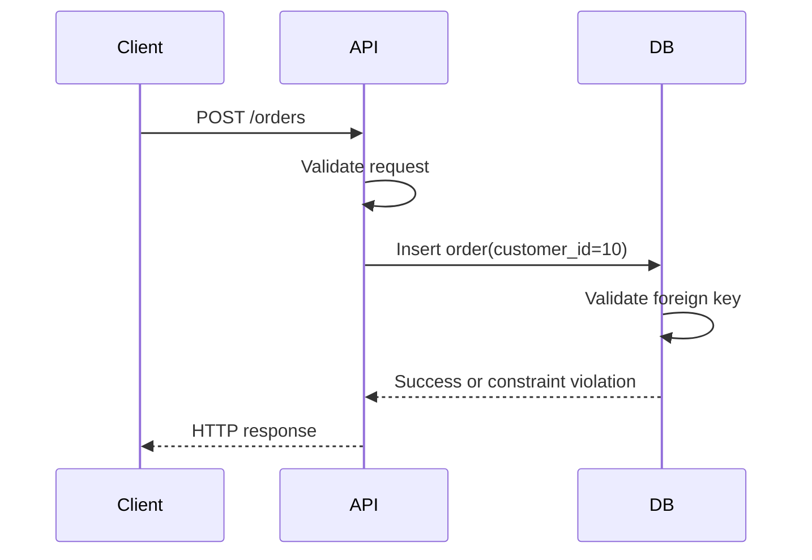
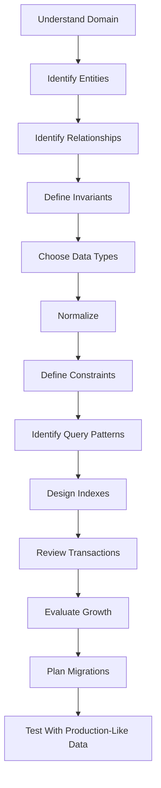
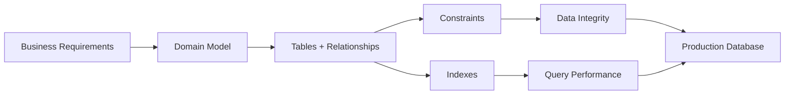
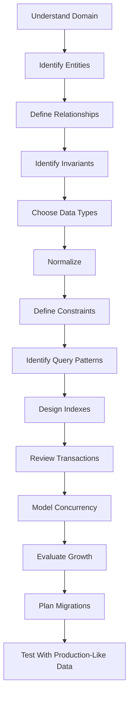

# 11- Referential Integrity

## Overview

Referential integrity is the guarantee that relationships between rows in relational tables remain valid.

The primary mechanism is the **foreign key constraint**. A foreign key establishes a relationship between a column or set of columns in one table and a candidate key—typically a primary key—in another table.

For example:

```sql
CREATE TABLE customers (
    id BIGINT PRIMARY KEY,
    name TEXT NOT NULL
);

CREATE TABLE orders (
    id BIGINT PRIMARY KEY,
    customer_id BIGINT NOT NULL,
    created_at TIMESTAMPTZ NOT NULL DEFAULT CURRENT_TIMESTAMP,

    CONSTRAINT orders_customer_fk
        FOREIGN KEY (customer_id)
        REFERENCES customers(id)
);
```

The database now guarantees:

```text
orders.customer_id
        │
        ▼
customers.id
```

Every non-null `orders.customer_id` must refer to an existing `customers.id`.

This matters because relational databases are often shared by multiple application components:

```text
Django / FastAPI
       │
       ├── API requests
       ├── Background workers
       ├── Management commands
       ├── Data migrations
       └── Administrative scripts
                │
                ▼
           PostgreSQL
```

If relationship validity is enforced only in application code, one writer can accidentally create an invalid relationship. A foreign key moves that fundamental invariant into the database.

---

## What Referential Integrity Protects

Referential integrity primarily prevents **orphaned child records** and invalid references.

Consider:

```text
customers
+----+----------+
| id | name     |
+----+----------+
| 10 | Alice    |
| 20 | Bob      |
+----+----------+

orders
+-----+-------------+
| id  | customer_id |
+-----+-------------+
| 101 | 10          |
| 102 | 20          |
+-----+-------------+
```

This is valid because both referenced customers exist.

The following is invalid:

```text
orders
+-----+-------------+
| id  | customer_id |
+-----+-------------+
| 103 | 999         |
+-----+-------------+
```

if customer `999` does not exist.

A foreign key prevents this state.

---

## Why Referential Integrity Exists

Without database-enforced referential integrity, an application must manually maintain relationships.

A naive implementation might do:

```text
1. Check whether customer exists.
2. Create order.
```

That looks correct but does not automatically make the relationship safe under concurrency.

For example:

```text
Request A                       Request B

Check customer 10 exists
                                Delete customer 10
Create order for customer 10
```

If the database does not enforce the relationship, the application can create an order pointing to a customer that no longer exists.

A foreign key makes the database itself responsible for validating the relationship at the point where the write occurs.

---

## Parent and Child Tables

Referential integrity is commonly described using **parent** and **child** terminology.

```sql
CREATE TABLE departments (
    id BIGINT PRIMARY KEY
);

CREATE TABLE employees (
    id BIGINT PRIMARY KEY,
    department_id BIGINT NOT NULL,

    CONSTRAINT employees_department_fk
        FOREIGN KEY (department_id)
        REFERENCES departments(id)
);
```

Here:

- `departments` is the **parent** table.
- `employees` is the **child** table.
- `departments.id` is the referenced key.
- `employees.department_id` is the foreign key.

The relationship is:

```text
departments
    │
    │ 1
    │
    │
    │ N
    ▼
employees
```

A department can have many employees, but each employee must reference a valid department.

---

## Basic Foreign Key Definition

A foreign key can be defined during table creation:

```sql
CREATE TABLE orders (
    id BIGINT PRIMARY KEY,
    customer_id BIGINT NOT NULL,
    CONSTRAINT orders_customer_fk
        FOREIGN KEY (customer_id)
        REFERENCES customers(id)
);
```

It can also be added later:

```sql
ALTER TABLE orders
ADD CONSTRAINT orders_customer_fk
FOREIGN KEY (customer_id)
REFERENCES customers(id);
```

Named constraints are preferable in production because they make schema management and database errors easier to understand.

---

## What Can Be Referenced

A foreign key must reference a column or column set that satisfies the database's requirements for a referenced key.

The common case is:

```sql
FOREIGN KEY (customer_id)
REFERENCES customers(id)
```

where `customers.id` is the primary key.

A foreign key can also reference a suitable unique key.

For example:

```sql
CREATE TABLE customers (
    id BIGINT PRIMARY KEY,
    external_id TEXT NOT NULL UNIQUE
);
```

Another table can reference:

```sql
FOREIGN KEY (customer_external_id)
REFERENCES customers(external_id)
```

However, referencing an internal primary key is often preferable unless the domain specifically requires the alternate key.

---

## Composite Foreign Keys

Relationships can involve multiple columns.

Example:

```sql
CREATE TABLE organizations (
    id BIGINT PRIMARY KEY
);

CREATE TABLE projects (
    organization_id BIGINT NOT NULL,
    project_id BIGINT NOT NULL,

    PRIMARY KEY (organization_id, project_id)
);

CREATE TABLE project_members (
    organization_id BIGINT NOT NULL,
    project_id BIGINT NOT NULL,
    user_id BIGINT NOT NULL,

    CONSTRAINT project_members_project_fk
        FOREIGN KEY (organization_id, project_id)
        REFERENCES projects(organization_id, project_id)
);
```

The pair:

```text
(organization_id, project_id)
```

identifies the project.

The child must reference the complete pair.

A composite foreign key is useful when identity is inherently scoped by multiple attributes, particularly in multi-tenant or domain-specific schemas.

---

## NULL and Foreign Keys

A foreign key column can be nullable unless `NOT NULL` is specified.

For example:

```sql
CREATE TABLE employees (
    id BIGINT PRIMARY KEY,
    manager_id BIGINT,
    CONSTRAINT employees_manager_fk
        FOREIGN KEY (manager_id)
        REFERENCES employees(id)
);
```

This permits:

```text
manager_id = 10
manager_id = 20
manager_id = NULL
```

`NULL` represents the absence of a relationship rather than an invalid reference.

If every employee must have a manager, use:

```sql
manager_id BIGINT NOT NULL
```

The choice should reflect the domain rather than being made merely for convenience.

---

## Self-Referential Foreign Keys

A table can reference itself.

This is common for hierarchical data.

```sql
CREATE TABLE employees (
    id BIGINT PRIMARY KEY,
    name TEXT NOT NULL,
    manager_id BIGINT,

    CONSTRAINT employees_manager_fk
        FOREIGN KEY (manager_id)
        REFERENCES employees(id)
);
```

The relationship becomes:

```text
Employee
   │
   └── manager_id ──► Employee.id
```

This can represent:

```text
CEO
 ├── Engineering Manager
 │    ├── Engineer
 │    └── Engineer
 └── Product Manager
      └── Product Manager
```

A self-referencing foreign key guarantees that the manager row exists, but it does not automatically guarantee that the hierarchy is logically valid.

For example, preventing arbitrary cycles may require additional application or database logic.

---

## Foreign Keys and Relationship Types

Foreign keys are fundamental to implementing relational relationships.

| Relationship | Typical implementation |
|---|---|
| One-to-one | FK + `UNIQUE` |
| One-to-many | FK on the many-side |
| Many-to-many | Junction table containing FKs |
| Self-reference | FK referencing the same table |
| Composite relationship | Composite FK |

### One-to-One

```sql
CREATE TABLE user_profiles (
    user_id BIGINT PRIMARY KEY,
    bio TEXT,

    CONSTRAINT profiles_user_fk
        FOREIGN KEY (user_id)
        REFERENCES users(id)
);
```

Using the foreign key as the primary key guarantees one profile per user.

### One-to-Many

```sql
CREATE TABLE orders (
    id BIGINT PRIMARY KEY,
    customer_id BIGINT NOT NULL,

    FOREIGN KEY (customer_id)
        REFERENCES customers(id)
);
```

Multiple orders can reference the same customer.

### Many-to-Many

```sql
CREATE TABLE course_students (
    course_id BIGINT NOT NULL,
    student_id BIGINT NOT NULL,

    PRIMARY KEY (course_id, student_id),

    FOREIGN KEY (course_id)
        REFERENCES courses(id),

    FOREIGN KEY (student_id)
        REFERENCES students(id)
);
```

The junction table contains foreign keys to both entities.

---

## Foreign Key Actions

A major production concern is what happens when a referenced parent row is updated or deleted.

SQL provides referential actions.

Common options include:

| Action | Behavior |
|---|---|
| `NO ACTION` | Rejects the operation if it would violate the relationship |
| `RESTRICT` | Rejects the operation when dependent rows exist |
| `CASCADE` | Propagates the update/delete |
| `SET NULL` | Sets the child FK to `NULL` |
| `SET DEFAULT` | Sets the child FK to its default value |

Exact timing and semantics can vary by database engine. In PostgreSQL, `NO ACTION` can be deferred when the constraint is deferrable, while `RESTRICT` cannot be deferred.

---

## ON DELETE CASCADE

Example:

```sql
CREATE TABLE customers (
    id BIGINT PRIMARY KEY
);

CREATE TABLE customer_addresses (
    id BIGINT PRIMARY KEY,
    customer_id BIGINT NOT NULL,

    CONSTRAINT addresses_customer_fk
        FOREIGN KEY (customer_id)
        REFERENCES customers(id)
        ON DELETE CASCADE
);
```

Deleting a customer can delete their addresses automatically.

```sql
DELETE FROM customers
WHERE id = 10;
```

Conceptually:

```text
DELETE customer
      │
      ▼
DELETE dependent addresses
```

### When to Use

`CASCADE` is appropriate when the child has no meaningful independent existence.

Examples:

```text
user → user_preferences
order → order_items
post → post_comments
```

### Risks

Cascades can be dangerous in large dependency graphs.

One delete can trigger:

```text
customer
  ├── orders
  │    └── order_items
  ├── addresses
  └── preferences
```

A production delete can therefore become significantly more expensive than the original statement suggests.

Understand the entire dependency graph before using cascading deletes.

---

## ON DELETE SET NULL

Use `SET NULL` when the child should survive but the relationship can disappear.

```sql
CREATE TABLE employees (
    id BIGINT PRIMARY KEY,
    manager_id BIGINT,

    CONSTRAINT employees_manager_fk
        FOREIGN KEY (manager_id)
        REFERENCES employees(id)
        ON DELETE SET NULL
);
```

If a manager is deleted:

```text
Employee
   │
   ├── manager_id = NULL
   │
   └── Employee remains
```

This requires the foreign key column to allow `NULL`.

A useful domain example is:

```text
article.author_id
```

where an article may remain after the author account is removed.

---

## ON DELETE RESTRICT and NO ACTION

These actions prevent a parent from being deleted while dependent rows would violate the relationship.

Example:

```sql
CREATE TABLE orders (
    id BIGINT PRIMARY KEY,
    customer_id BIGINT NOT NULL,

    CONSTRAINT orders_customer_fk
        FOREIGN KEY (customer_id)
        REFERENCES customers(id)
        ON DELETE RESTRICT
);
```

If orders exist, deleting the customer fails.

This is often appropriate when deletion of the parent should require an explicit business decision about its children.

For important business records, this can be safer than automatic cascading.

---

## ON UPDATE Actions

Foreign keys can also specify behavior when referenced key values change.

Example:

```sql
FOREIGN KEY (customer_id)
REFERENCES customers(id)
ON UPDATE CASCADE
```

In many backend systems, primary keys are immutable.

Therefore, `ON UPDATE` behavior is less commonly important than `ON DELETE` behavior.

A strong design normally treats identifiers as stable and avoids changing primary key values after records have been created.

---

## Referential Integrity and Transactions

Foreign keys participate in transactions.

Consider:

```sql
BEGIN;

INSERT INTO orders (id, customer_id)
VALUES (100, 10);

INSERT INTO customers (id)
VALUES (10);

COMMIT;
```

Depending on the constraint configuration and database behavior, an immediate foreign key constraint can reject the order insert because customer `10` does not yet exist.

With a **deferrable** constraint, validation can be postponed until transaction commit.

Example in PostgreSQL:

```sql
CREATE TABLE orders (
    id BIGINT PRIMARY KEY,
    customer_id BIGINT NOT NULL,

    CONSTRAINT orders_customer_fk
        FOREIGN KEY (customer_id)
        REFERENCES customers(id)
        DEFERRABLE INITIALLY DEFERRED
);
```

Then constraint validation can occur at commit time.

This is an advanced feature and should be used only when transaction ordering genuinely requires it.

---

## Deferred Constraints

A deferred constraint allows certain integrity checks to be postponed until the transaction reaches a defined point.

For example:

```sql
BEGIN;

SET CONSTRAINTS orders_customer_fk DEFERRED;

-- Operations that temporarily violate the relationship
-- but result in a valid state before COMMIT.

COMMIT;
```

This can be useful for complex data transformations and certain cyclic dependency scenarios.

It should not be used simply to hide ordering problems in ordinary application logic.

The final transaction state must still satisfy the constraint.

---

## Referential Integrity and Concurrency

Foreign keys are especially valuable under concurrency because the database evaluates relationship validity as part of its transaction and locking model.

Suppose:

```text
Transaction A                   Transaction B

Insert order(customer_id=10)
                                Delete customer(10)
```

The database must coordinate these operations so that the committed state does not violate the foreign key.

This is one of the fundamental differences between:

```text
Application convention
```

and:

```text
Database-enforced invariant
```

The database can coordinate multiple writers against the same relationship.

---

## Indexing Foreign Keys

A foreign key does **not universally imply that the child column automatically has an index**.

For example:

```sql
CREATE TABLE orders (
    id BIGINT PRIMARY KEY,
    customer_id BIGINT NOT NULL,
    FOREIGN KEY (customer_id)
        REFERENCES customers(id)
);
```

The foreign key exists, but whether an index is created on:

```text
orders.customer_id
```

depends on the database and schema definition.

In PostgreSQL, creating a foreign key does not automatically create an index on the referencing columns.

An index is often useful:

```sql
CREATE INDEX idx_orders_customer_id
ON orders(customer_id);
```

### Why?

Queries commonly access children through the relationship:

```sql
SELECT *
FROM orders
WHERE customer_id = 10;
```

The index can also reduce the cost of checking dependent rows during parent updates or deletes.

However, indexes are not free.

They introduce:

- Storage overhead
- Write amplification
- Maintenance work
- Additional memory/cache pressure

Index foreign keys based on access patterns and relationship operations, not blindly.

---

## Composite Foreign Key Indexing

For a composite foreign key:

```sql
FOREIGN KEY (organization_id, project_id)
REFERENCES projects(organization_id, project_id)
```

an index such as:

```sql
CREATE INDEX idx_members_project
ON project_members(organization_id, project_id);
```

may be appropriate.

Column order matters.

An index on:

```text
(organization_id, project_id)
```

is not equivalent to an index on:

```text
(project_id, organization_id)
```

for every query pattern.

Index design should follow actual queries and cardinality.

---

## Foreign Keys and Query Performance

Foreign keys primarily exist for correctness, not query acceleration.

They do not automatically make joins faster.

For example:

```sql
SELECT
    o.id,
    c.name
FROM orders AS o
JOIN customers AS c
    ON c.id = o.customer_id;
```

Performance depends on:

- Indexes
- Cardinality
- Statistics
- Query plan
- Table size
- Data distribution
- Join strategy
- Memory
- Database configuration

A foreign key tells the database that the relationship is valid. It is not a substitute for proper indexing.

---

## Referential Integrity in ORMs

Modern ORMs expose foreign-key relationships.

### Django

```python
class Customer(models.Model):
    name = models.CharField(max_length=200)


class Order(models.Model):
    customer = models.ForeignKey(
        Customer,
        on_delete=models.PROTECT,
    )
```

Django's `on_delete` behavior defines how the ORM models deletion semantics, while the database schema should also enforce the actual foreign-key relationship.

Common Django choices include:

```python
models.CASCADE
models.PROTECT
models.SET_NULL
models.RESTRICT
```

The correct choice depends on the domain.

For example, protecting a customer from deletion while historical orders exist may be more appropriate than cascading through financial records.

### SQLAlchemy

A SQLAlchemy model may define:

```python
class Order(Base):
    __tablename__ = "orders"

    id = mapped_column(BigInteger, primary_key=True)
    customer_id = mapped_column(
        ForeignKey("customers.id"),
        nullable=False,
    )
```

The ORM makes the relationship convenient to use, but database-level foreign keys remain important for integrity.

---

## Referential Integrity in REST APIs

A REST API may receive:

```http
POST /orders
Content-Type: application/json

{
  "customer_id": 10,
  "amount": 2500
}
```

A backend may validate:

```text
Does customer 10 exist?
```

But that validation is not sufficient by itself.

The complete flow should be:



The application can provide a good user-facing error, while the database remains the final structural integrity boundary.

---

## Mapping Constraint Errors to API Errors

A foreign-key violation should normally become an appropriate application-level response rather than an unhandled database error.

For example:

```text
Database:
foreign key violation

Application:
customer does not exist

HTTP:
400 Bad Request
```

or, depending on the API semantics:

```text
404 Not Found
```

The exact status code should follow the API contract.

Do not expose raw database exception messages, table names, or internal schema details to clients.

---

## Referential Integrity and Soft Deletes

Soft deletes complicate relationship semantics.

Suppose:

```sql
customers.deleted_at
```

marks a customer as deleted.

The customer row still physically exists, so a foreign key can still reference it.

The database therefore sees:

```text
customer exists
```

while the application may interpret:

```text
customer is unavailable
```

This creates two separate concepts:

```text
Physical referential integrity
        vs
Business-level active relationship
```

A foreign key alone cannot generally express all soft-delete semantics.

The application, schema design, indexes, and potentially row-level policies must work together.

---

## Referential Integrity and Multi-Tenancy

Multi-tenant systems require careful relationship modeling.

Consider:

```sql
CREATE TABLE projects (
    id BIGINT PRIMARY KEY,
    organization_id BIGINT NOT NULL
);
```

A simple foreign key:

```sql
FOREIGN KEY (project_id)
REFERENCES projects(id)
```

guarantees that the project exists, but it does not necessarily guarantee that the project belongs to the same organization as the requesting user's context.

Tenant isolation may require additional schema-level design.

For example, composite keys can encode tenant scope:

```text
(organization_id, project_id)
```

and composite foreign keys can ensure that the relationship remains inside the expected tenant boundary.

This is particularly valuable when tenant isolation is a core security requirement.

---

## Cross-Database Relationships

A normal relational foreign key generally works within the database system's supported relational scope.

Consider:

```text
Order Service DB
      │
      └── orders.customer_id

Customer Service DB
      │
      └── customers.id
```

A normal foreign key cannot simply enforce:

```text
orders.customer_id → customers.id
```

across independent service databases.

This is a major architectural boundary.

Instead, distributed systems typically use:

- Application-level validation
- Domain events
- Idempotency
- Transactional outbox
- Reconciliation
- Sagas
- Explicit consistency policies

For example:


The system must explicitly define what happens if the customer state changes independently of the order state.

---

## Referential Integrity and Eventual Consistency

A distributed system may temporarily have:

```text
Order exists
Customer information unavailable
```

This is fundamentally different from a single relational database enforcing:

```text
Order must reference an existing customer
```

When moving from a monolithic relational database to microservices, do not assume that application-level references provide the same guarantees as foreign keys.

Document:

- Which relationships are strongly consistent
- Which are eventually consistent
- How invalid references are detected
- How missing entities are handled
- How reconciliation occurs
- How deleted entities affect dependent services

Explicit consistency semantics are a senior-level database design concern.

---

## Foreign Keys and Deletion Strategy

There is no universally correct deletion action.

Choose based on the domain.

| Domain relationship | Typical strategy |
|---|---|
| Order → Order item | `CASCADE` |
| Customer → Financial transaction | Often `RESTRICT` or soft delete |
| Employee → Manager | `SET NULL` may be appropriate |
| User → Preferences | `CASCADE` can be appropriate |
| Product → Historical order item | Usually preserve historical data |
| Organization → Critical audit records | Usually avoid automatic cascade |

The key question is:

> Does the child have an independent business meaning after the parent is deleted?

If no, `CASCADE` may be appropriate.

If yes, preserve the child and choose another strategy.

---

## Audit Data and Referential Integrity

Audit records often have special retention requirements.

For example:

```text
users
audit_events
```

An audit event may need to survive the deletion or anonymization of a user.

Using:

```sql
ON DELETE CASCADE
```

could destroy the audit trail.

A better design may use:

```sql
user_id BIGINT
```

with carefully chosen deletion semantics, or store an immutable actor identifier appropriate for the audit requirements.

Retention, privacy, compliance, and forensic requirements should influence foreign-key behavior.

---

## Common Mistakes

### Checking Existence in Application Code Only

This pattern is unsafe under concurrency:

```text
SELECT customer
IF customer exists:
    INSERT order
```

Use a foreign key as the structural guarantee.

### Forgetting Indexes on High-Volume Foreign Keys

A relationship may be valid but still perform poorly when frequently queried or when parent deletes/updates require checking many child rows.

### Cascading Deletes Without Understanding the Graph

A single delete can affect many tables.

Inspect dependencies before enabling cascades.

### Making Every Foreign Key Nullable

Nullable relationships should represent a real domain state, not merely make inserts easier.

### Using Natural Keys Without Considering Mutability

Referencing an email address or username can create difficult update semantics.

Stable surrogate identifiers are often simpler.

### Assuming Foreign Keys Improve Join Performance

Foreign keys establish correctness. Indexes and query plans determine join performance.

### Removing Foreign Keys to "Improve Performance"

Foreign keys have overhead, but removing them can transfer correctness costs into every writer.

Measure before removing integrity constraints.

### Relying Entirely on ORM Behavior

Raw SQL, migrations, scripts, workers, and other services can bypass ORM-level assumptions.

### Using Cascades on Historical Business Data

Deleting financial or audit history can violate retention and reporting requirements.

### Ignoring Cross-Tenant Relationships

A valid foreign key does not automatically prove that two entities belong to the same tenant or authorization scope.

---

## Production Design Checklist

Before adding a foreign key, verify:

### Relationship

- What is the parent?
- What is the child?
- Is the relationship mandatory or optional?
- Is the relationship one-to-one, one-to-many, or many-to-many?
- Should the child survive parent deletion?

### Constraint

- Is the referenced key primary or appropriately unique?
- Should the FK be nullable?
- Is a composite foreign key required?
- Is the deletion action correct?
- Is an update action necessary?

### Performance

- Will the FK column be queried frequently?
- Does it need an index?
- How large are the parent and child tables?
- Could parent deletes trigger expensive scans?
- Could cascading operations become large?

### Operations

- Can the constraint be added safely to existing data?
- Are there existing orphaned rows?
- What locks can the migration acquire?
- Could replication lag increase?
- Is the migration reversible?

### Application

- Does the API return an appropriate error?
- Are retries safe?
- Are ORM and database semantics aligned?
- Can background workers write the same relationship?

### Architecture

- Does the relationship cross service/database boundaries?
- If so, what replaces the database foreign key?
- How are inconsistencies detected?
- Is reconciliation required?

---

## Finding Existing Orphans

Before introducing a foreign key, identify invalid references.

Example:

```sql
SELECT o.*
FROM orders AS o
LEFT JOIN customers AS c
    ON c.id = o.customer_id
WHERE c.id IS NULL;
```

These rows must be repaired before the constraint can be safely established.

Typical remediation options include:

- Correcting the reference
- Restoring the missing parent
- Deleting invalid child records
- Assigning the child to an explicit replacement entity
- Migrating historical data

Do not silently discard orphaned records without understanding their business meaning.

---

## Adding a Foreign Key to an Existing Production Table

A simplified workflow is:

```text
Existing table
      │
      ▼
Find invalid references
      │
      ▼
Repair invalid data
      │
      ▼
Deploy compatible application code
      │
      ▼
Add foreign-key constraint
      │
      ▼
Monitor
```

For large PostgreSQL tables, migration strategy deserves additional care.

PostgreSQL supports techniques such as adding a foreign key as `NOT VALID`, validating existing rows separately, and then relying on the constraint for subsequent changes.

A simplified example is:

```sql
ALTER TABLE orders
ADD CONSTRAINT orders_customer_fk
FOREIGN KEY (customer_id)
REFERENCES customers(id)
NOT VALID;
```

After existing violations are repaired:

```sql
ALTER TABLE orders
VALIDATE CONSTRAINT orders_customer_fk;
```

This can be useful for reducing the operational impact of introducing integrity checks to large production tables.

The exact locking and runtime behavior should still be evaluated against the PostgreSQL version, table size, workload, and deployment environment.

---

## Referential Integrity and Database Ownership

A senior backend engineer should distinguish between:

```text
Who owns the relationship?
```

and:

```text
Where is the relationship enforced?
```

For a monolithic application:

```text
Django
   │
   ▼
PostgreSQL
   │
   ├── customers
   └── orders
```

PostgreSQL can directly enforce:

```text
orders.customer_id → customers.id
```

For microservices:

```text
Order Service
   │
   ▼
Order DB

Customer Service
   │
   ▼
Customer DB
```

The relationship crosses a service boundary.

The architecture must therefore replace the database-level guarantee with explicit distributed-system mechanisms.

This distinction becomes increasingly important as systems scale.

---

## Interview Traps

| Question | Correct reasoning |
|---|---|
| What does a foreign key guarantee? | That referenced values satisfy the defined referential constraint |
| Does a foreign key automatically create an index on the child column in PostgreSQL? | No |
| Can a foreign key be nullable? | Yes, unless `NOT NULL` is also specified |
| Can a table reference itself? | Yes |
| Can foreign keys implement many-to-many relationships directly? | Typically through a junction table containing two foreign keys |
| What does `ON DELETE CASCADE` do? | Propagates parent deletion to dependent rows |
| Should every relationship use `CASCADE`? | No; deletion semantics must match the domain |
| Does a foreign key make joins faster? | Not directly; indexing and query planning determine performance |
| Can a foreign key enforce relationships across independent microservice databases? | Not as a normal database foreign key |
| Why might a foreign-key column need an index? | To support child lookups and efficiently evaluate parent update/delete operations |
| What happens if a child references a nonexistent parent? | The database rejects the operation when the constraint is enforced |
| Are ORM foreign-key declarations enough? | No; database-level enforcement remains important |

---

## Key Takeaways

- **Referential integrity guarantees that relational relationships remain valid**, primarily through database-enforced foreign keys.
- **Foreign keys protect against orphaned and invalid references regardless of which application component performs the write.**
- **`ON DELETE` behavior must match domain semantics**; use `CASCADE`, `SET NULL`, `RESTRICT`, or `NO ACTION` deliberately rather than by default.
- **Foreign keys provide correctness, not automatic performance**; index referencing columns when query and parent-operation patterns justify it.
- **Cross-database and microservice relationships cannot rely on ordinary foreign keys**, so distributed systems require explicit consistency, idempotency, eventing, and reconciliation strategies.
```
```

```
Markdown


```
# 12- Database Design Rules

## Overview

Database design is the process of translating domain requirements into tables, columns, relationships, constraints, indexes, and access patterns that remain correct and efficient as the system evolves.

For backend engineers, good database design is not about producing the most normalized schema possible. It is about preserving **data integrity**, supporting the application's **real query patterns**, controlling **operational complexity**, and leaving enough flexibility for future changes.

A production database should make invalid states difficult or impossible to represent.


A useful design mindset is:

> **Model the business invariants in the database, then optimize the schema around actual workload and access patterns.**

---

## Core Database Design Principles

A practical relational database design should generally follow these principles:

| Rule | Purpose |
|---|---|
| Model entities explicitly | Keep domain concepts clear |
| Give every important entity a stable identifier | Provide reliable identity |
| Use appropriate data types | Prevent invalid representations |
| Enforce invariants with constraints | Protect data integrity |
| Model relationships explicitly | Represent domain structure |
| Normalize by default | Reduce duplication and update anomalies |
| Denormalize deliberately | Optimize proven read/write bottlenecks |
| Index based on access patterns | Improve query performance |
| Avoid unnecessary indexes | Reduce write and storage overhead |
| Keep transactions around business invariants | Preserve atomicity |
| Treat migrations as production code | Make schema evolution safe |
| Design for operational reality | Account for scale, backups, locks, and recovery |

These are guidelines rather than absolute rules. A senior engineer should understand **why** a rule exists and when violating it is justified.

---

## Start With the Domain

Do not begin by creating tables based solely on API request payloads.

Start with domain concepts and invariants.

For an e-commerce system, the domain may contain:

```text
Customer
Product
Order
OrderItem
Payment
Address
Shipment
```

Then identify relationships:

```text
Customer
   │
   ├── Orders
   │      └── OrderItems
   │             └── Products
   │
   ├── Addresses
   │
   └── Payments
```

The database model should represent relationships that matter to the domain rather than temporary implementation details.

---

## Tables Should Represent Meaningful Entities

A table should generally represent a coherent entity, relationship, or domain concept.

Good:

```text
customers
orders
order_items
payments
```

Less useful designs often combine unrelated concepts into a single large table:

```text
customer_order_payment_shipment_product
```

Large overloaded tables tend to create:

- Many nullable columns
- Difficult constraints
- Duplicate data
- Complex update logic
- Poor ownership boundaries
- Hard-to-understand relationships

A table should have a clear reason to exist.

---

## Choose Stable Primary Keys

Every important entity should normally have a stable primary key.

Example:

```sql
CREATE TABLE customers (
    id BIGINT GENERATED ALWAYS AS IDENTITY PRIMARY KEY,
    name TEXT NOT NULL,
    email TEXT NOT NULL
);
```

The primary key should generally be:

- Unique
- Stable
- Non-null
- Immutable
- Efficient to reference

Avoid changing an entity's primary key after other records depend on it.

---

## Surrogate Keys vs Natural Keys

A **surrogate key** is an identifier created specifically for database identity.

```sql
id BIGINT GENERATED ALWAYS AS IDENTITY PRIMARY KEY
```

A **natural key** comes from business data.

Examples:

```text
email
phone number
SKU
government identifier
```

| Approach | Advantages | Limitations |
|---|---|---|
| Surrogate key | Stable, compact, easy to reference | Does not encode business meaning |
| Natural key | Represents business identity | May change or have complicated uniqueness rules |
| UUID | Globally usable, useful across systems | Larger indexes and less compact than integer IDs |
| Composite key | Encodes multi-column identity | More complex foreign keys and joins |

A common production pattern is:

```text
Primary key → stable surrogate identifier
Business identity → UNIQUE constraint
```

For example:

```sql
CREATE TABLE customers (
    id BIGINT GENERATED ALWAYS AS IDENTITY PRIMARY KEY,
    email TEXT NOT NULL UNIQUE
);
```

The email can change while the internal identity remains stable.

---

## Choose Data Types Deliberately

Do not use a generic type such as `TEXT` for every field simply because it is flexible.

Example:

```sql
CREATE TABLE products (
    id BIGINT GENERATED ALWAYS AS IDENTITY PRIMARY KEY,
    name TEXT NOT NULL,
    price NUMERIC(12, 2) NOT NULL,
    stock_quantity INTEGER NOT NULL,
    is_active BOOLEAN NOT NULL DEFAULT TRUE
);
```

The type communicates and enforces intent.

| Data | Typical type |
|---|---|
| Identifier | `BIGINT`, UUID |
| Boolean state | `BOOLEAN` |
| Count | `INTEGER` / `BIGINT` |
| Money | `NUMERIC`/`DECIMAL` |
| Timestamp | `TIMESTAMPTZ` in PostgreSQL when an instant is intended |
| Short structured value | `TEXT` with constraints where appropriate |
| Structured document | `JSONB` when justified |

Do not select types solely based on language-level types.

Database types affect:

- Storage
- Index size
- Comparison cost
- Query planning
- Validation
- Serialization
- Interoperability

---

## Do Not Store Money as Floating Point

Avoid:

```sql
price DOUBLE PRECISION
```

for monetary values where exact decimal semantics are required.

Prefer:

```sql
price NUMERIC(12, 2)
```

or an integer representation of the smallest currency unit when appropriate:

```text
2500 paise
```

The correct representation depends on currency and domain requirements.

Floating-point arithmetic can introduce precision behavior that is inappropriate for financial calculations.

---

## Store Time Correctly

Timestamps should represent the intended temporal semantics.

For events representing an instant in time, PostgreSQL commonly uses:

```sql
created_at TIMESTAMPTZ NOT NULL DEFAULT CURRENT_TIMESTAMP
```

Avoid storing timestamps as arbitrary strings:

```sql
created_at TEXT
```

The database then cannot reliably enforce or optimize temporal operations.

Distinguish between:

```text
Instant in time
Local calendar date
Local wall-clock time
Duration
```

For example:

```text
created_at      → instant
date_of_birth   → date
business_hours  → domain-specific local time
```

Do not assume every temporal value should be a timestamp.

---

## Prefer Explicit Constraints

Constraints are one of the most important database design tools.

Example:

```sql
CREATE TABLE products (
    id BIGINT GENERATED ALWAYS AS IDENTITY PRIMARY KEY,
    name TEXT NOT NULL,
    price NUMERIC(12, 2) NOT NULL,
    stock_quantity INTEGER NOT NULL,

    CONSTRAINT products_price_positive
        CHECK (price >= 0),

    CONSTRAINT products_stock_nonnegative
        CHECK (stock_quantity >= 0)
);
```

The database now rejects invalid states regardless of which application component performs the write.

Common constraints include:

```text
PRIMARY KEY
FOREIGN KEY
UNIQUE
NOT NULL
CHECK
```

---

## Model Relationships Explicitly

Use foreign keys to represent relational dependencies.

```sql
CREATE TABLE orders (
    id BIGINT GENERATED ALWAYS AS IDENTITY PRIMARY KEY,
    customer_id BIGINT NOT NULL,

    CONSTRAINT orders_customer_fk
        FOREIGN KEY (customer_id)
        REFERENCES customers(id)
);
```

Do not rely exclusively on application code to maintain structural relationships.

This matters because a database may receive writes from:

- Django
- FastAPI
- Celery workers
- Management commands
- Data migrations
- Administrative tools
- ETL processes

Database constraints provide a common integrity boundary.

---

## One-to-One Relationships

Use a foreign key with uniqueness when the relationship is one-to-one.

```sql
CREATE TABLE user_profiles (
    user_id BIGINT PRIMARY KEY,
    bio TEXT,

    CONSTRAINT profiles_user_fk
        FOREIGN KEY (user_id)
        REFERENCES users(id)
);
```

Using the foreign key as the primary key ensures:

```text
One user → at most one profile
```

Do not create a separate unrestricted foreign key if the domain actually requires one-to-one cardinality.

---

## One-to-Many Relationships

Put the foreign key on the many-side.

```sql
CREATE TABLE orders (
    id BIGINT PRIMARY KEY,
    customer_id BIGINT NOT NULL,

    FOREIGN KEY (customer_id)
        REFERENCES customers(id)
);
```

This represents:

```text
Customer
   │
   └──< Orders
```

Do not store multiple IDs in a string or array simply to avoid a child table:

```text
customer.orders = "101,102,103"
```

That destroys relational integrity and makes querying, indexing, and referential validation harder.

---

## Many-to-Many Relationships

Use a junction table.

```sql
CREATE TABLE course_students (
    course_id BIGINT NOT NULL,
    student_id BIGINT NOT NULL,

    PRIMARY KEY (course_id, student_id),

    FOREIGN KEY (course_id)
        REFERENCES courses(id),

    FOREIGN KEY (student_id)
        REFERENCES students(id)
);
```

The junction table is itself a real relational entity.

If the relationship has attributes:

```text
enrolled_at
status
grade
```

store them in the junction table.

```sql
CREATE TABLE course_students (
    course_id BIGINT NOT NULL,
    student_id BIGINT NOT NULL,
    enrolled_at TIMESTAMPTZ NOT NULL DEFAULT CURRENT_TIMESTAMP,
    status TEXT NOT NULL
);
```

---

## Normalize by Default

Normalization reduces unnecessary duplication and prevents update anomalies.

Consider:

```text
orders
+----+-------------+------------------+
| id | customer_id | customer_name    |
+----+-------------+------------------+
```

If the customer name is duplicated across thousands of orders, changing the customer's name requires updating many rows.

A normalized design separates the entities:

```text
customers
+----+------+
| id | name |
+----+------+

orders
+----+-------------+
| id | customer_id |
+----+-------------+
```

The relationship is explicit.

### Practical Normalization Goal

For most transactional backend systems:

> Normalize the schema until each important fact has an appropriate single source of truth.

Do not blindly normalize every possible structure to theoretical maximum normal form. Workload and domain semantics matter.

---

## Understand Update Anomalies

Poor normalization can create three common anomalies.

### Update Anomaly

The same fact exists in multiple rows and only some copies are updated.

### Insert Anomaly

A new entity cannot be represented without unrelated data.

### Delete Anomaly

Deleting one record accidentally removes the only stored copy of another business fact.

Normalization helps eliminate these classes of problems.

---

## Denormalize Deliberately

Denormalization can be useful when measured workload justifies duplicated or derived data.

Example:

```text
orders.total_amount
```

could be stored instead of calculating it from every `order_items` row for every request.

The trade-off is:

```text
Read performance
      vs
Consistency complexity
```

If `orders.total_amount` is derived from order items, the system must ensure that updates maintain the invariant.

Use transactions, constraints, application logic, or database mechanisms appropriate to the consistency requirement.

Do not denormalize simply because joins look inconvenient.

---

## Keep One Source of Truth

A database should have a clear authoritative representation for important facts.

For example, avoid independently storing:

```text
customer.email
users.email
accounts.email
```

unless each field has deliberately different semantics.

Duplicating data creates synchronization problems.

If duplication is intentional, document:

- Which field is authoritative
- Who updates it
- How changes propagate
- What happens when synchronization fails
- Whether stale values are acceptable

---

## Avoid EAV for Ordinary Relational Data

Entity-Attribute-Value designs often look flexible:

```text
entity_id | attribute | value
```

but can make ordinary querying and validation difficult.

Instead of:

```text
product_attributes
product_id | key | value
```

prefer explicit columns when the attributes are stable and important:

```sql
CREATE TABLE products (
    id BIGINT PRIMARY KEY,
    name TEXT NOT NULL,
    weight_grams INTEGER,
    is_active BOOLEAN NOT NULL DEFAULT TRUE
);
```

EAV can be appropriate for genuinely dynamic attributes, but it should be a deliberate architectural choice.

---

## JSON and JSONB Should Have a Clear Boundary

PostgreSQL `JSONB` is useful for semi-structured data.

Example:

```sql
CREATE TABLE products (
    id BIGINT PRIMARY KEY,
    name TEXT NOT NULL,
    metadata JSONB
);
```

Good candidates include:

- External provider payload fragments
- Optional metadata
- Flexible configuration
- Data whose structure genuinely varies

Do not put core relational fields into JSON merely to avoid schema design.

For example, this is often a poor design:

```json
{
  "customer_id": 10,
  "status": "paid",
  "created_at": "..."
}
```

if those values participate heavily in:

- Joins
- Constraints
- Filtering
- Uniqueness
- Authorization
- Reporting

Core relational data should generally remain relational.

---

## Avoid Storing Multiple Values in One Column

Avoid:

```text
phone_numbers = "+911234,+915678"
```

or:

```text
tag_ids = "10,20,30"
```

This makes querying and enforcing integrity difficult.

Prefer:

```text
customer
   │
   └──< phone_numbers
```

or:

```text
post
   │
   └──< post_tags >── tag
```

The relational model works best when each relationship is represented explicitly.

---

## Naming Rules

Consistent naming reduces cognitive overhead.

A practical PostgreSQL convention is:

```text
snake_case
plural table names
singular column names
```

Example:

```text
customers
orders
order_items

customer_id
created_at
updated_at
```

Avoid inconsistent schemas such as:

```text
Customer
orderItems
createdDate
```

The exact convention can differ, but consistency matters more than the specific choice.

---

## Avoid Ambiguous Column Names

Prefer:

```sql
created_at
updated_at
deleted_at
customer_id
```

over:

```sql
date
time
status1
id2
value
data
```

A column name should communicate its meaning without requiring the reader to inspect application code.

---

## Be Careful With Generic `status` Columns

A simple:

```sql
status TEXT
```

can be appropriate, but the valid states should be explicit.

For example:

```sql
status TEXT NOT NULL
    CHECK (status IN ('pending', 'paid', 'cancelled'))
```

For larger state machines, consider whether a lookup table, enum, or carefully constrained text representation is more appropriate.

The important property is that invalid states should not be silently accepted.

---

## Model State Transitions Carefully

Many backend entities have lifecycle states:

```text
pending
   │
   ▼
confirmed
   │
   ▼
completed
```

The database can enforce allowed values:

```sql
CHECK (status IN ('pending', 'confirmed', 'completed'))
```

But complex transition rules may require application-level transactional logic.

For example:

```text
completed → pending
```

may be syntactically valid but semantically invalid.

A database `CHECK` constraint can validate the state representation, while transaction logic should enforce complex transitions.

---

## Use `NOT NULL` Aggressively, But Intentionally

If a value is required for a valid record, make it `NOT NULL`.

Good:

```sql
email TEXT NOT NULL
```

Avoid making every field nullable:

```sql
name TEXT,
email TEXT,
status TEXT,
created_at TIMESTAMPTZ
```

when those values are required.

`NULL` represents an additional state and therefore increases application complexity.

Before allowing `NULL`, ask:

> What does the absence of this value mean in the domain?

If there is no meaningful answer, `NOT NULL` is usually preferable.

---

## Use `UNIQUE` for Business Invariants

If a value must be unique, enforce it in the database.

```sql
CREATE TABLE users (
    id BIGINT PRIMARY KEY,
    email TEXT NOT NULL UNIQUE
);
```

Do not rely on:

```text
SELECT → check → INSERT
```

because concurrent requests can race.

The unique constraint makes the database enforce the invariant.

---

## Partial and Composite Uniqueness

Sometimes uniqueness depends on conditions or multiple fields.

Composite uniqueness:

```sql
CREATE TABLE memberships (
    organization_id BIGINT NOT NULL,
    user_id BIGINT NOT NULL,

    UNIQUE (organization_id, user_id)
);
```

This guarantees that a user cannot have two memberships in the same organization.

Conditional uniqueness can be implemented with a PostgreSQL partial unique index:

```sql
CREATE UNIQUE INDEX users_active_email_unique
ON users(email)
WHERE deleted_at IS NULL;
```

This can enforce:

```text
Only one active user may use an email address.
```

Such constraints should reflect actual business semantics.

---

## Index Based on Queries

Do not create indexes simply because a column exists.

Start with actual access patterns.

For example:

```sql
SELECT *
FROM orders
WHERE customer_id = 42
ORDER BY created_at DESC
LIMIT 50;
```

A useful index may be:

```sql
CREATE INDEX idx_orders_customer_created
ON orders(customer_id, created_at DESC);
```

The correct index depends on:

- Query predicates
- Sort order
- Cardinality
- Selectivity
- Table size
- Write volume
- Query frequency

---

## Composite Index Column Order Matters

Consider:

```sql
CREATE INDEX idx_orders_customer_status
ON orders(customer_id, status);
```

This is useful for queries such as:

```sql
WHERE customer_id = 42
```

and:

```sql
WHERE customer_id = 42
  AND status = 'pending'
```

But it is not automatically equivalent to:

```sql
CREATE INDEX idx_orders_status_customer
ON orders(status, customer_id);
```

Index order should reflect workload.

Do not memorize a universal column ordering rule; inspect real queries and query plans.

---

## Avoid Over-Indexing

Every index has a cost.

Indexes consume:

- Disk
- Memory/cache
- Write bandwidth
- Maintenance time
- Vacuum/reorganization work

A table receiving heavy writes can become slower when overloaded with indexes.

A practical workflow is:

```text
Query pattern
    ↓
Candidate index
    ↓
EXPLAIN / EXPLAIN ANALYZE
    ↓
Measure
    ↓
Keep only useful indexes
```

---

## Constraints vs Application Validation

Application validation improves user experience.

Database constraints protect correctness.

Use both.

```text
API validation
    │
    ├── Fast feedback
    ├── Better error messages
    └── Input normalization
             │
             ▼
Database constraints
    │
    ├── Final integrity boundary
    ├── Concurrency-safe invariants
    └── Protection across all writers
```

Do not treat these as competing approaches.

---

## Keep Business Invariants Transactional

Suppose a payment should only be captured once.

A unique constraint can help:

```sql
CREATE UNIQUE INDEX payments_order_capture_unique
ON payments(order_id)
WHERE status = 'captured';
```

But the complete business operation may also require:

- Transaction boundaries
- Row locking
- Idempotency keys
- External payment-provider coordination

The database should enforce what it can, while application logic coordinates broader workflows.

---

## Use Transactions Around Related Changes

If two writes must succeed or fail together, use a transaction.

Example:

```sql
BEGIN;

INSERT INTO orders (
    id,
    customer_id
)
VALUES (
    1001,
    42
);

INSERT INTO order_items (
    order_id,
    product_id,
    quantity
)
VALUES (
    1001,
    500,
    2
);

COMMIT;
```

If one operation fails:

```sql
ROLLBACK;
```

The system should not leave an order without its required items when the domain requires both to exist atomically.

---

## Avoid Long Transactions

Long transactions can cause:

- Lock contention
- Increased transaction ID pressure
- Larger snapshots
- Bloat
- Poor concurrency
- Resource retention

Keep transactions focused.

Do not perform slow external operations inside a database transaction unless the architecture explicitly requires it.

Avoid:

```text
BEGIN
  UPDATE database
  ↓
  Call external payment provider
  ↓
  Wait 5 seconds
  ↓
COMMIT
```

Prefer architectures that minimize the time database locks and transactional resources remain held.

---

## Be Careful With ORM Abstractions

Django and other ORMs simplify database access, but they do not eliminate database design responsibilities.

For example:

```python
Order.objects.filter(
    customer_id=customer_id
).order_by("-created_at")[:50]
```

should lead to questions such as:

```text
What SQL is generated?
Which index supports it?
How many rows are scanned?
What happens at 10 million orders?
```

Senior backend engineering requires understanding the database behavior underneath ORM abstractions.

---

## Avoid N+1 Queries

A common application-level database design problem is:

```text
Query customers
    ↓
For each customer:
    Query orders
```

This produces:

```text
1 + N queries
```

Use appropriate joins, eager loading, batching, or prefetching.

For example, Django provides:

```python
orders = (
    Order.objects
    .select_related("customer")
    .filter(status="paid")
)
```

For one-to-many relationships, `prefetch_related()` may be more appropriate.

The correct approach depends on relationship cardinality and query requirements.

---

## Design for Query Patterns

Database design and query design should evolve together.

For each important endpoint, understand:

```text
HTTP request
    ↓
Application query
    ↓
SQL
    ↓
Query plan
    ↓
Indexes
    ↓
Rows/pages accessed
```

A schema that looks elegant but produces expensive queries under production workload is not a successful design.

---

## Avoid Premature Denormalization

Do not duplicate data because:

```text
"Joins are slow."
```

Modern relational databases are optimized for joins, and good indexes can make common joins inexpensive.

First:

1. Normalize appropriately.
2. Write correct queries.
3. Add appropriate indexes.
4. Inspect query plans.
5. Measure production-like workload.
6. Denormalize only when justified.

Denormalization should solve a measured problem.

---

## Schema Design for Pagination

Offset pagination:

```sql
SELECT *
FROM orders
ORDER BY created_at DESC
LIMIT 50 OFFSET 100000;
```

can become increasingly expensive for large datasets.

Keyset pagination is often more scalable:

```sql
SELECT *
FROM orders
WHERE created_at < :cursor_created_at
   OR (
       created_at = :cursor_created_at
       AND id < :cursor_id
   )
ORDER BY created_at DESC, id DESC
LIMIT 50;
```

A corresponding index may be:

```sql
CREATE INDEX idx_orders_created_id
ON orders(created_at DESC, id DESC);
```

For high-volume APIs, schema and index design should account for pagination strategy from the beginning.

---

## Design for Soft Deletes Carefully

A common implementation is:

```sql
deleted_at TIMESTAMPTZ
```

An active record has:

```text
deleted_at IS NULL
```

This can be useful when records need to be recoverable or retained for business reasons.

However, soft deletion introduces complexity:

- Queries must filter deleted records
- Unique constraints may need partial indexes
- Foreign keys still see physically existing rows
- Storage continues to grow
- Cascading semantics become less obvious

Do not introduce soft deletes automatically. Use them when the domain requires non-destructive deletion.

---

## Avoid Using Soft Delete as a Replacement for Retention Design

Soft deletion does not remove data.

If a table receives millions of deleted records, it still requires:

- Storage
- Index maintenance
- Vacuuming
- Backup capacity
- Potential archival

For high-volume systems, define explicit retention and archival strategies.

---

## Design for Auditability

Important business entities often need:

```text
created_at
updated_at
created_by
updated_by
```

depending on requirements.

For sensitive workflows, a dedicated audit table may be better:

```sql
CREATE TABLE audit_events (
    id BIGINT GENERATED ALWAYS AS IDENTITY PRIMARY KEY,
    actor_id BIGINT,
    entity_type TEXT NOT NULL,
    entity_id BIGINT NOT NULL,
    action TEXT NOT NULL,
    created_at TIMESTAMPTZ NOT NULL DEFAULT CURRENT_TIMESTAMP,
    metadata JSONB
);
```

Audit requirements should be considered separately from ordinary CRUD history.

---

## Avoid Overusing Database Triggers

Triggers can enforce certain invariants and automate derived behavior.

They can also make writes harder to reason about.

A statement such as:

```sql
INSERT INTO orders ...
```

may indirectly execute additional logic through triggers.

Use triggers when database-local behavior is genuinely appropriate, such as certain integrity or audit requirements.

Avoid hiding significant business workflows inside triggers when application-level orchestration is clearer.

---

## Database Design and Security

Schema design directly affects security.

Use constraints to protect invariants, but do not confuse integrity with authorization.

For example:

```text
customer_id = 42 exists
```

does not mean:

```text
current user is allowed to access customer 42
```

Authorization must still be enforced at the application or database security layer as appropriate.

For multi-tenant systems, consider:

- Tenant-scoped relationships
- Composite keys where useful
- Row-level security where appropriate
- Least-privilege database roles
- Separate credentials for applications and migrations
- Parameterized queries

Never construct SQL by concatenating untrusted input.

Use parameterized queries:

```python
cursor.execute(
    """
    SELECT id, name
    FROM customers
    WHERE email = %s
    """,
    [email],
)
```

---

## Production Migration Rules

Schema changes are production changes.

A migration such as:

```sql
ALTER TABLE orders
ADD COLUMN status TEXT NOT NULL;
```

may fail if existing rows do not have a valid value and may have operational implications depending on the database and version.

Safer migrations often follow an expand-and-contract pattern.


For large production tables, evaluate:

- Lock acquisition
- Migration duration
- Table size
- Replication lag
- Backfill rate
- Concurrent writes
- Rollback strategy

Never assume a migration is safe merely because it executes successfully on a development database.

---

## Backward-Compatible Schema Changes

When multiple application versions may run simultaneously during deployment, schema changes should often support both old and new versions temporarily.

For example:

```text
Old application → old column
New application → new column
```

A safer deployment can be:

```text
Add new column
      ↓
Deploy compatible code
      ↓
Backfill
      ↓
Switch reads
      ↓
Switch writes
      ↓
Remove old column later
```

This is particularly important in Kubernetes, ECS, and rolling deployments where old and new application instances can coexist.

---

## Database Availability

A production schema should account for availability requirements.

Consider:

```text
Application
    │
    ▼
Connection Pool
    │
    ▼
Primary Database
    │
    ├── Replicas
    └── Backups
```

Schema design affects:

- Replication volume
- Write throughput
- Index maintenance
- Backup duration
- Restore time
- Failover behavior

Read replicas can improve read scalability, but they introduce replication lag and should not be used for operations requiring immediate read-after-write consistency unless the architecture handles that explicitly.

---

## Connection Management

Database performance is not only about SQL.

A backend service should control connection usage.

For example:

```text
Nginx
  ↓
Application instances
  ↓
Connection pools
  ↓
PostgreSQL
```

If Kubernetes runs many application replicas and each opens too many connections:

```text
100 pods × 20 connections
= 2,000 database connections
```

The database may become connection-bound before CPU or storage becomes the bottleneck.

Use appropriate connection pooling and understand the database's connection limits.

---

## Read Replicas Do Not Fix Poor Schema Design

Adding replicas can help scale reads, but it does not solve:

- Missing indexes
- Inefficient queries
- N+1 queries
- Bad pagination
- Excessive result sets
- Incorrect transaction boundaries

Optimize query behavior before adding infrastructure.

---

## Design for Backups and Recovery

Database design should consider disaster recovery.

Important questions include:

- How frequently are backups taken?
- Are backups encrypted?
- How long are they retained?
- Can the database be restored to a known point?
- How long does restoration take?
- Has restoration actually been tested?
- What is the acceptable data loss window?
- What is the acceptable recovery duration?

For production PostgreSQL systems, backup strategy should include both logical and/or physical mechanisms appropriate to the workload and recovery requirements.

A backup that has never been restored successfully is not a proven recovery strategy.

---

## Cost Considerations

Poor schema design can increase infrastructure cost.

Examples:

```text
Unnecessary indexes
    ↓
More storage + more write I/O

Oversized data types
    ↓
Larger tables + larger indexes

Unbounded JSON
    ↓
Larger rows + more complex queries

Duplicate data
    ↓
More storage + synchronization work

Missing indexes
    ↓
More CPU + I/O + larger database instances
```

Database design is therefore also a cost-engineering concern.

---

## Common Production Pitfalls

### Treating the ORM as the Database

ORM code can hide SQL complexity.

**Avoid:** assuming ORM operations are automatically efficient.

**Prefer:** inspect generated SQL and query plans for important paths.

### Missing Foreign Keys

Application-only relationships can drift under concurrency or multiple writers.

**Avoid:** relying exclusively on application checks.

**Prefer:** enforce structural relationships in the database.

### Overusing `NULL`

Nullable columns introduce additional states.

**Avoid:** using `NULL` simply because a field is inconvenient to populate.

**Prefer:** define the business meaning of missing data.

### Over-Indexing

Every index has a write and storage cost.

**Avoid:** indexing every column.

**Prefer:** index based on measured query patterns.

### Premature Denormalization

Duplicating data creates consistency obligations.

**Avoid:** denormalizing without workload evidence.

**Prefer:** optimize queries and indexes first.

### Unbounded Cascading Deletes

A single delete can traverse a large dependency graph.

**Avoid:** `ON DELETE CASCADE` without understanding downstream effects.

**Prefer:** choose deletion semantics based on business ownership and retention.

### Large Unbounded Queries

Returning millions of rows can exhaust application and database resources.

**Avoid:**

```sql
SELECT *
FROM orders;
```

for operational APIs.

**Prefer:**

```sql
SELECT id, customer_id, created_at, status
FROM orders
ORDER BY id
LIMIT 100;
```

with appropriate pagination.

### Using `SELECT *`

`SELECT *` couples application behavior to the entire table schema and can transfer unnecessary data.

**Prefer:** explicitly select required columns for production queries.

### Long-Running Transactions

Long transactions increase contention and resource usage.

**Avoid:** holding database transactions open while waiting on external systems.

**Prefer:** keep transactional sections small and deliberate.

### Ignoring Data Growth

A query that works with:

```text
10,000 rows
```

may fail at:

```text
100 million rows
```

Design around expected growth and validate with realistic datasets.

---

## Database Design Review Checklist

Before approving a schema, review it across these dimensions.

### Domain

- Does every table represent a meaningful concept?
- Are relationships modeled explicitly?
- Are business invariants understood?
- Is ownership clear?

### Identity

- Does every important entity have a stable primary key?
- Are natural business identifiers separately constrained?
- Are identifiers immutable?

### Data Types

- Are types appropriate for the domain?
- Are monetary values exact?
- Are timestamps represented correctly?
- Are oversized or vague types avoided?

### Integrity

- Are required fields `NOT NULL`?
- Are unique values protected by `UNIQUE`?
- Are relationships protected by foreign keys?
- Are valid ranges protected by `CHECK` constraints?
- Are deletion semantics explicit?

### Normalization

- Is each important fact stored in an appropriate location?
- Is duplication intentional?
- If denormalized, how is consistency maintained?

### Performance

- What are the most frequent queries?
- Which indexes support them?
- Are composite index column orders appropriate?
- Are there unnecessary indexes?
- Has `EXPLAIN ANALYZE` been used for critical queries?

### Scalability

- What happens at 10× current data?
- What happens at 100× current data?
- Are pagination queries scalable?
- Are large batch operations bounded?
- Could indexes or rows become excessively large?

### Transactions

- Which operations must be atomic?
- Where are transaction boundaries?
- Could locks be held for too long?
- Are concurrency races handled by constraints or locking?

### Security

- Is authorization separate from referential integrity?
- Are tenant boundaries enforced correctly?
- Are database credentials least-privileged?
- Are queries parameterized?

### Operations

- Can migrations run safely in production?
- What locks can schema changes acquire?
- How will backfills be performed?
- Is replication affected?
- Can the database be restored?
- Are backup and recovery procedures tested?

---

## Practical Design Example

A basic order system might use:

```sql
CREATE TABLE customers (
    id BIGINT GENERATED ALWAYS AS IDENTITY PRIMARY KEY,
    email TEXT NOT NULL,
    created_at TIMESTAMPTZ NOT NULL DEFAULT CURRENT_TIMESTAMP,

    CONSTRAINT customers_email_unique
        UNIQUE (email)
);

CREATE TABLE products (
    id BIGINT GENERATED ALWAYS AS IDENTITY PRIMARY KEY,
    name TEXT NOT NULL,
    price NUMERIC(12, 2) NOT NULL,

    CONSTRAINT products_price_nonnegative
        CHECK (price >= 0)
);

CREATE TABLE orders (
    id BIGINT GENERATED ALWAYS AS IDENTITY PRIMARY KEY,
    customer_id BIGINT NOT NULL,
    status TEXT NOT NULL DEFAULT 'pending',
    created_at TIMESTAMPTZ NOT NULL DEFAULT CURRENT_TIMESTAMP,

    CONSTRAINT orders_customer_fk
        FOREIGN KEY (customer_id)
        REFERENCES customers(id),

    CONSTRAINT orders_status_valid
        CHECK (status IN ('pending', 'paid', 'cancelled'))
);

CREATE TABLE order_items (
    order_id BIGINT NOT NULL,
    product_id BIGINT NOT NULL,
    quantity INTEGER NOT NULL,
    unit_price NUMERIC(12, 2) NOT NULL,

    PRIMARY KEY (order_id, product_id),

    CONSTRAINT order_items_order_fk
        FOREIGN KEY (order_id)
        REFERENCES orders(id)
        ON DELETE CASCADE,

    CONSTRAINT order_items_product_fk
        FOREIGN KEY (product_id)
        REFERENCES products(id),

    CONSTRAINT order_items_quantity_positive
        CHECK (quantity > 0),

    CONSTRAINT order_items_unit_price_nonnegative
        CHECK (unit_price >= 0)
);

CREATE INDEX idx_orders_customer_created
ON orders(customer_id, created_at DESC);
```

This design demonstrates several important principles:

- Stable primary keys
- Explicit foreign keys
- Appropriate numeric types
- `NOT NULL` for required data
- `CHECK` constraints
- Explicit relationship deletion semantics
- Junction-like child modeling
- Indexing based on an access pattern
- Capturing `unit_price` on `order_items` to preserve the price used for the historical order

The last point is important: `products.price` represents the product's **current** price, while `order_items.unit_price` represents the price actually used for that order. The duplication is intentional because the two fields have different business meanings.

---

## A Senior-Level Design Workflow

A repeatable design process is more valuable than memorizing isolated rules.



A strong review asks not only:

> "Is this schema normalized?"

but also:

> "What invalid states are possible?"

> "Which queries will dominate production?"

> "What happens when the tables contain 100 million rows?"

> "What happens during concurrent writes?"

> "How will this schema evolve?"

> "How will we recover after a failure?"

These questions move database design from textbook modeling toward production engineering.

---

## Key Takeaways

- **Model domain entities, relationships, and invariants explicitly**, using primary keys, foreign keys, `NOT NULL`, `UNIQUE`, and `CHECK` constraints wherever appropriate.
- **Normalize by default and denormalize deliberately**; duplicated data creates consistency obligations that must have a clear justification and maintenance strategy.
- **Design indexes from real query patterns**, then validate them with query plans and production-like workloads rather than indexing every column.
- **Treat transactions, migrations, concurrency, backups, and data growth as part of schema design**, not as operational concerns to solve later.
- **A good production schema balances correctness, performance, scalability, security, and operational simplicity rather than optimizing for theoretical database purity.**
```
```

```
Markdown


```
# 12- Database Design Rules

## Overview

Database design translates business requirements into tables, columns, relationships, constraints, indexes, and transaction boundaries that preserve correctness under real production workloads.

Good relational design is not about maximizing normalization or minimizing table count. The goal is to create a schema that:

- Represents the domain accurately.
- Prevents invalid states.
- Supports important query patterns efficiently.
- Handles concurrent writes safely.
- Evolves through controlled migrations.
- Remains operable as data and traffic grow.

A useful engineering principle is:

> **Make invalid states difficult or impossible to represent, then optimize the valid design around measured workload.**



Database design therefore sits at the intersection of **domain modeling, correctness, concurrency, performance, scalability, and operations**.

---

## Design From the Domain

Do not begin by turning API request and response objects directly into tables.

Start with the business entities and the relationships between them.

For an e-commerce system:

```text
Customer
    │
    ├── Orders
    │      └── Order Items
    │             └── Products
    │
    ├── Addresses
    │
    └── Payments
```

The database should represent stable domain concepts rather than temporary application structures.

For each entity, identify:

- What uniquely identifies it?
- Which attributes are required?
- Which attributes may be absent?
- Which values must be unique?
- Which entities depend on it?
- Which relationships exist?
- Which business rules must always hold?
- Which data is historical versus current?

---

## Tables Should Have Clear Responsibilities

A table should represent a coherent entity, relationship, or domain concept.

Good:

```text
customers
orders
order_items
payments
shipments
```

Poor designs often combine unrelated concepts into one wide table:

```text
customer_order_payment_shipment
```

Overloaded tables tend to produce:

- Excessive nullable columns
- Duplicated data
- Difficult constraints
- Complicated updates
- Ambiguous ownership
- Hard-to-maintain queries

A table should have a clear reason to exist.

---

## Choose Stable Primary Keys

Important entities should normally have a stable primary key.

PostgreSQL example:

```sql
CREATE TABLE customers (
    id BIGINT GENERATED ALWAYS AS IDENTITY PRIMARY KEY,
    name TEXT NOT NULL,
    email TEXT NOT NULL
);
```

A primary key should generally be:

- Unique
- Non-null
- Stable
- Immutable
- Efficient to reference

Do not use a mutable business attribute as the internal identity of an entity unless the domain genuinely requires it.

For example, an email address can change:

```text
customer.id    → stable identity
customer.email → mutable business attribute
```

---

## Surrogate Keys vs Natural Keys

A **surrogate key** exists primarily to identify a database record.

Examples:

```text
BIGINT identity
UUID
```

A **natural key** comes from business data.

Examples:

```text
email
SKU
country_code
external_provider_id
```

| Strategy | Advantages | Limitations |
|---|---|---|
| Surrogate key | Stable and simple references | Has no business meaning |
| Natural key | Represents domain identity | May change or have complex semantics |
| UUID | Globally unique and useful across systems | Larger than integer keys |
| Composite key | Precisely represents multi-column identity | More complex references and joins |

A common production design is:

```text
Primary key → surrogate identity
Business identifier → UNIQUE constraint
```

Example:

```sql
CREATE TABLE users (
    id BIGINT GENERATED ALWAYS AS IDENTITY PRIMARY KEY,
    email TEXT NOT NULL UNIQUE
);
```

---

## Choose Data Types Deliberately

Data types communicate domain semantics and affect storage, indexing, validation, and query performance.

```sql
CREATE TABLE products (
    id BIGINT GENERATED ALWAYS AS IDENTITY PRIMARY KEY,
    name TEXT NOT NULL,
    price NUMERIC(12, 2) NOT NULL,
    stock_quantity INTEGER NOT NULL,
    is_active BOOLEAN NOT NULL DEFAULT TRUE
);
```

Typical choices:

| Requirement | PostgreSQL type |
|---|---|
| Identifier | `BIGINT`, UUID |
| Boolean state | `BOOLEAN` |
| Count | `INTEGER` / `BIGINT` |
| Monetary value | `NUMERIC` / `DECIMAL` |
| Timestamp representing an instant | `TIMESTAMPTZ` |
| Calendar date | `DATE` |
| Arbitrary structured data | `JSONB` when justified |

Avoid using `TEXT` for everything simply because it is flexible.

---

## Represent Money Exactly

Avoid floating-point types for values requiring exact decimal semantics:

```sql
price DOUBLE PRECISION
```

Prefer:

```sql
price NUMERIC(12, 2)
```

or, where appropriate, integer units such as cents or paise.

For example:

```text
₹25.00 → 2500 paise
```

The correct representation depends on currency and domain requirements.

The important principle is that financial calculations should not depend on binary floating-point approximation.

---

## Model Time According to Its Meaning

Do not treat every temporal value as the same type.

Consider:

```text
created_at       → instant in time
date_of_birth    → calendar date
business_opening → local wall-clock time
duration         → elapsed interval
```

For an event representing an instant:

```sql
created_at TIMESTAMPTZ NOT NULL DEFAULT CURRENT_TIMESTAMP
```

Avoid:

```sql
created_at TEXT
```

because the database cannot reliably enforce temporal semantics or efficiently perform temporal operations.

---

## Use `NOT NULL` Intentionally

If a value is required for a valid record, make it `NOT NULL`.

```sql
CREATE TABLE orders (
    id BIGINT GENERATED ALWAYS AS IDENTITY PRIMARY KEY,
    customer_id BIGINT NOT NULL,
    status TEXT NOT NULL
);
```

`NULL` is not simply another value. It represents missing or unknown information and therefore creates an additional state that application code must handle.

Before allowing `NULL`, ask:

> What does the absence of this value mean in the domain?

If there is no meaningful answer, `NOT NULL` is usually preferable.

---

## Enforce Invariants With Constraints

Application validation is useful, but database constraints provide the final integrity boundary.

Common constraints include:

```text
PRIMARY KEY
FOREIGN KEY
UNIQUE
NOT NULL
CHECK
```

Example:

```sql
CREATE TABLE products (
    id BIGINT GENERATED ALWAYS AS IDENTITY PRIMARY KEY,
    name TEXT NOT NULL,
    price NUMERIC(12, 2) NOT NULL,
    stock_quantity INTEGER NOT NULL,

    CONSTRAINT products_price_nonnegative
        CHECK (price >= 0),

    CONSTRAINT products_stock_nonnegative
        CHECK (stock_quantity >= 0)
);
```

Without the constraints, another writer could insert invalid values even if the main application performs validation.

This matters in systems with multiple writers:

```text
Django
FastAPI
Celery
Management commands
Data migrations
Admin tools
ETL jobs
```

---

## Model Foreign-Key Relationships Explicitly

Use foreign keys to represent relational dependencies.

```sql
CREATE TABLE orders (
    id BIGINT GENERATED ALWAYS AS IDENTITY PRIMARY KEY,
    customer_id BIGINT NOT NULL,

    CONSTRAINT orders_customer_fk
        FOREIGN KEY (customer_id)
        REFERENCES customers(id)
);
```

This prevents an order from referencing a nonexistent customer.

Do not rely exclusively on application code such as:

```text
Check customer exists
        ↓
Insert order
```

because concurrent operations can invalidate assumptions between those two steps.

The database constraint remains authoritative.

---

## Model One-to-Many Relationships Correctly

The foreign key belongs on the many-side.

```text
Customer
   │
   └──< Orders
```

```sql
CREATE TABLE orders (
    id BIGINT GENERATED ALWAYS AS IDENTITY PRIMARY KEY,
    customer_id BIGINT NOT NULL
        REFERENCES customers(id)
);
```

A customer can have many orders, while each order belongs to one customer.

Avoid storing multiple foreign keys inside a string:

```text
customer.order_ids = "101,102,103"
```

This makes:

- Referential integrity difficult
- Queries inefficient
- Indexing awkward
- Updates error-prone

---

## Model Many-to-Many Relationships With Junction Tables

Many-to-many relationships should normally use a junction table.

```sql
CREATE TABLE course_students (
    course_id BIGINT NOT NULL REFERENCES courses(id),
    student_id BIGINT NOT NULL REFERENCES students(id),

    PRIMARY KEY (course_id, student_id)
);
```

This represents:

```text
Course
  │
  └──< course_students >── Student
```

If the relationship has attributes, store them on the junction table:

```sql
CREATE TABLE course_students (
    course_id BIGINT NOT NULL REFERENCES courses(id),
    student_id BIGINT NOT NULL REFERENCES students(id),
    enrolled_at TIMESTAMPTZ NOT NULL DEFAULT CURRENT_TIMESTAMP,
    status TEXT NOT NULL,

    PRIMARY KEY (course_id, student_id)
);
```

The relationship itself is now modeled as meaningful data.

---

## Normalize by Default

Normalization reduces unnecessary duplication and update anomalies.

Consider:

```text
orders
+----+-------------+----------------+
| id | customer_id | customer_name  |
+----+-------------+----------------+
```

If the customer's name changes, many order rows may need updating.

A normalized design stores the fact once:

```text
customers
+----+------+
| id | name |
+----+------+

orders
+----+-------------+
| id | customer_id |
+----+-------------+
```

A practical goal is:

> **Each important business fact should have an appropriate authoritative location.**

Normalization helps prevent:

- Update anomalies
- Insert anomalies
- Delete anomalies
- Conflicting copies of the same fact

---

## Do Not Normalize Blindly

Normalization is a default, not an absolute law.

Over-normalization can sometimes introduce:

- Excessive joins
- Complex read paths
- More complicated queries
- Increased application complexity

The correct question is not:

> "How many tables can I create?"

It is:

> "Where should each fact live, and what consistency guarantees does the system require?"

For transactional systems, normalized relational models are usually the safest starting point.

---

## Denormalize Only With a Reason

Denormalization intentionally duplicates or precomputes data to optimize workload.

For example:

```text
orders.total_amount
```

may be stored instead of calculating the total from every order item on every read.

The trade-off is:

```text
Faster reads
    vs
More consistency complexity
```

If `orders.total_amount` is derived from `order_items`, the system must maintain the invariant.

Possible mechanisms include:

- Transactions
- Application logic
- Database constraints
- Triggers
- Asynchronous reconciliation

Do not denormalize merely because joins look inconvenient.

A useful progression is:

```text
Normalize
   ↓
Optimize query
   ↓
Add appropriate indexes
   ↓
Measure workload
   ↓
Denormalize only if justified
```

---

## Keep Business Facts Separate From Historical Facts

Some apparent duplication is intentional.

For example:

```sql
products.price
order_items.unit_price
```

These values have different meanings:

```text
products.price
→ current product price

order_items.unit_price
→ price actually charged for the order
```

Deleting `order_items.unit_price` and always reading the current product price would corrupt historical order information.

Not all duplication is bad. The key question is whether duplicated values represent **the same fact** or **different facts at different points in time**.

---

## Avoid Multi-Valued Columns

Avoid:

```text
tag_ids = "10,20,30"
```

or:

```text
phone_numbers = "+911234,+915678"
```

These structures make relational operations difficult.

Prefer:

```text
post
  │
  └──< post_tags >── tag
```

or:

```text
customer
  │
  └──< phone_numbers
```

Each relationship becomes independently queryable and enforceable.

---

## Use JSONB for Genuine Semi-Structured Data

PostgreSQL `JSONB` is useful when data is naturally flexible.

Example:

```sql
CREATE TABLE products (
    id BIGINT GENERATED ALWAYS AS IDENTITY PRIMARY KEY,
    name TEXT NOT NULL,
    metadata JSONB
);
```

Reasonable candidates include:

- External API payload fragments
- Optional provider-specific metadata
- Flexible configuration
- Attributes whose structure genuinely varies

Do not use JSONB simply to avoid designing tables.

If a value is frequently:

- Joined
- Filtered
- Indexed
- Uniquely constrained
- Used for authorization
- Used in reporting

it often belongs in a relational column.

---

## Avoid EAV for Stable Attributes

Entity-Attribute-Value designs commonly look like:

```text
entity_id | attribute | value
```

They provide flexibility but make type validation, constraints, and queries significantly harder.

For stable attributes, prefer explicit columns:

```sql
CREATE TABLE products (
    id BIGINT GENERATED ALWAYS AS IDENTITY PRIMARY KEY,
    name TEXT NOT NULL,
    weight_grams INTEGER,
    is_active BOOLEAN NOT NULL DEFAULT TRUE
);
```

EAV can be appropriate for genuinely dynamic schemas, but it should be a deliberate architectural choice.

---

## Use `UNIQUE` for Business Identity

If a business invariant says a value must be unique, enforce it in the database.

```sql
CREATE TABLE users (
    id BIGINT GENERATED ALWAYS AS IDENTITY PRIMARY KEY,
    email TEXT NOT NULL UNIQUE
);
```

Do not rely on:

```text
SELECT → check → INSERT
```

because two concurrent requests can both observe that the value does not exist.

The database constraint handles the race safely.

---

## Use Composite and Conditional Uniqueness

Some invariants involve multiple columns.

Example:

```sql
CREATE TABLE memberships (
    organization_id BIGINT NOT NULL,
    user_id BIGINT NOT NULL,

    UNIQUE (organization_id, user_id)
);
```

This guarantees that a user can have at most one membership in a given organization.

PostgreSQL can also enforce conditional uniqueness with a partial unique index:

```sql
CREATE UNIQUE INDEX users_active_email_unique
ON users(email)
WHERE deleted_at IS NULL;
```

This can support a rule such as:

```text
Only one active user can use an email address.
```

The constraint should match the actual business invariant.

---

## Choose Indexes From Access Patterns

Do not index every column.

Start with important queries.

For:

```sql
SELECT id, customer_id, created_at, status
FROM orders
WHERE customer_id = 42
ORDER BY created_at DESC
LIMIT 50;
```

a useful index may be:

```sql
CREATE INDEX idx_orders_customer_created
ON orders(customer_id, created_at DESC);
```

Index design depends on:

- Filtering predicates
- Ordering
- Selectivity
- Cardinality
- Query frequency
- Table size
- Write volume

Validate important indexes with query plans rather than relying on intuition.

---

## Composite Index Order Matters

Consider:

```sql
CREATE INDEX idx_orders_customer_status
ON orders(customer_id, status);
```

This can support queries filtering by:

```sql
customer_id
```

and:

```sql
customer_id AND status
```

It is not automatically equivalent to:

```sql
CREATE INDEX idx_orders_status_customer
ON orders(status, customer_id);
```

The best column order depends on workload and query structure.

Avoid memorizing simplistic rules such as "always put the most selective column first." Query patterns and the database optimizer matter.

---

## Avoid Over-Indexing

Indexes improve some reads but impose costs on writes.

Every additional index can increase:

- Storage usage
- Insert cost
- Update cost
- Delete cost
- Cache pressure
- Maintenance overhead

For write-heavy tables, excessive indexing can become a significant bottleneck.

A practical process is:

```text
Query
  ↓
Candidate index
  ↓
EXPLAIN / EXPLAIN ANALYZE
  ↓
Benchmark
  ↓
Production observation
```

---

## Design for Pagination

Offset pagination can degrade for large offsets:

```sql
SELECT id, created_at
FROM orders
ORDER BY created_at DESC
LIMIT 50 OFFSET 100000;
```

Keyset pagination often scales better:

```sql
SELECT id, created_at
FROM orders
WHERE (created_at, id) < (:created_at, :id)
ORDER BY created_at DESC, id DESC
LIMIT 50;
```

A supporting index can be:

```sql
CREATE INDEX idx_orders_created_id
ON orders(created_at DESC, id DESC);
```

The cursor should use a deterministic ordering. Including a unique tie-breaker such as `id` prevents ambiguous pagination when timestamps are equal.

---

## Avoid N+1 Query Patterns

Database design must account for application access patterns.

A common backend failure is:

```text
Query customers
    ↓
For each customer:
    Query orders
```

This creates:

```text
1 + N queries
```

In Django, relationship loading can often be optimized with:

```python
orders = (
    Order.objects
    .select_related("customer")
    .filter(status="paid")
)
```

For collections and one-to-many relationships, `prefetch_related()` may be appropriate.

The important engineering question is:

> What SQL does the application actually execute?

ORM abstractions do not eliminate database performance considerations.

---

## Keep Transactions Focused

If multiple changes must succeed or fail together, use a transaction.

```sql
BEGIN;

INSERT INTO orders (
    id,
    customer_id
)
VALUES (
    1001,
    42
);

INSERT INTO order_items (
    order_id,
    product_id,
    quantity
)
VALUES (
    1001,
    500,
    2
);

COMMIT;
```

If an operation fails:

```sql
ROLLBACK;
```

Avoid holding transactions open while performing slow external operations.

Poor:

```text
BEGIN
  ↓
UPDATE database
  ↓
Call payment provider
  ↓
Wait for external response
  ↓
COMMIT
```

Long transactions can increase:

- Lock contention
- Resource retention
- Transaction ID pressure
- Bloat
- Replication impact
- Request latency

Keep the transactional section as small as correctness permits.

---

## Separate Database Integrity From Authorization

A foreign key answers:

```text
Does customer 42 exist?
```

It does not answer:

```text
Is this authenticated user allowed to access customer 42?
```

Authorization requires separate controls.

For multi-tenant applications, carefully model tenant ownership:

```text
organization
    │
    ├── users
    ├── projects
    └── orders
```

Depending on requirements, enforcement can involve:

- Application-level authorization
- Composite tenant-scoped constraints
- PostgreSQL row-level security
- Database roles

Referential integrity and authorization solve different problems.

---

## Use Parameterized Queries

Never construct SQL using untrusted string interpolation.

Unsafe:

```python
query = f"SELECT * FROM users WHERE email = '{email}'"
```

Prefer parameterized queries:

```python
cursor.execute(
    """
    SELECT id, email
    FROM users
    WHERE email = %s
    """,
    [email],
)
```

Parameterized queries protect against SQL injection and allow the database driver to handle values correctly.

ORMs such as Django's ORM normally parameterize query values, but raw SQL paths still require the same discipline.

---

## Treat Soft Deletes as a Domain Decision

A common soft-delete model is:

```sql
deleted_at TIMESTAMPTZ
```

where:

```text
deleted_at IS NULL → active
deleted_at IS NOT NULL → deleted
```

Soft deletion can be useful when records must remain recoverable or retained for business reasons.

It also introduces complexity:

- Every active-record query needs appropriate filtering.
- Unique constraints may require partial indexes.
- Physically deleted rows do not disappear.
- Storage and indexes continue growing.
- Foreign-key semantics can become less intuitive.

Do not add soft deletion automatically.

---

## Design Auditability Explicitly

Some systems require historical visibility into important changes.

Basic metadata may include:

```sql
created_at TIMESTAMPTZ NOT NULL DEFAULT CURRENT_TIMESTAMP,
updated_at TIMESTAMPTZ NOT NULL DEFAULT CURRENT_TIMESTAMP
```

More demanding audit requirements may justify a dedicated event table:

```sql
CREATE TABLE audit_events (
    id BIGINT GENERATED ALWAYS AS IDENTITY PRIMARY KEY,
    actor_id BIGINT,
    entity_type TEXT NOT NULL,
    entity_id BIGINT NOT NULL,
    action TEXT NOT NULL,
    created_at TIMESTAMPTZ NOT NULL DEFAULT CURRENT_TIMESTAMP,
    metadata JSONB
);
```

Do not assume `updated_at` alone constitutes an audit trail. It does not preserve historical changes.

---

## Use Cascading Deletes Carefully

Foreign keys can specify deletion behavior:

```sql
FOREIGN KEY (order_id)
REFERENCES orders(id)
ON DELETE CASCADE
```

Cascades are useful when child records have no independent meaning outside their parent.

They can be dangerous when a delete can recursively affect large portions of the database.

Before using `ON DELETE CASCADE`, ask:

- Is the child owned exclusively by the parent?
- Can deletion affect thousands or millions of rows?
- Is deletion reversible?
- Does compliance require retention?
- Could an accidental delete create a large transaction?

Deletion semantics should reflect domain ownership and retention requirements.

---

## Do Not Put Core Business Data Behind Hidden Triggers

Triggers can be useful for database-local behavior such as certain integrity or audit requirements.

They can also make write behavior difficult to understand.

A statement such as:

```sql
INSERT INTO orders ...
```

may indirectly execute additional database logic.

Use triggers when the behavior is naturally database-local and benefits from centralized enforcement.

Avoid hiding major business workflows inside triggers when application-level orchestration is easier to reason about and test.

---

## Design for Schema Evolution

A production schema is never finished.

Applications evolve:

```text
v1 application
      ↓
v2 application
      ↓
v3 application
```

The database must evolve without unnecessarily breaking running application instances.

A common expand-and-contract strategy is:


For example:

```text
1. Add new nullable column.
2. Deploy code that understands both representations.
3. Backfill existing records.
4. Start writing the new representation.
5. Switch reads.
6. Validate.
7. Remove old representation later.
```

This is especially important during rolling deployments on Kubernetes or ECS, where old and new application versions may temporarily coexist.

---

## Review Migration Risk

A migration that succeeds on a small development database can still cause production downtime.

Before executing a large schema change, consider:

- Table size
- Lock acquisition
- Migration duration
- Concurrent writes
- Replication lag
- Backfill throughput
- Disk usage
- Rollback strategy
- Application compatibility

For large tables, avoid assuming that an `ALTER TABLE` is operationally trivial.

Backfills should generally be:

- Bounded
- Observable
- Restartable
- Rate-limited when necessary
- Designed to minimize lock contention

---

## Design for Concurrency

Correctness under concurrency is a schema concern.

Consider a uniqueness rule:

```text
Only one active subscription per user
```

Application code alone can race:

```text
Request A → check
Request B → check
Request A → insert
Request B → insert
```

A database constraint can enforce the invariant:

```sql
CREATE UNIQUE INDEX subscriptions_one_active_per_user
ON subscriptions(user_id)
WHERE status = 'active';
```

The database becomes the final arbiter of the invariant.

For more complex operations, combine:

- Constraints
- Transactions
- Appropriate isolation
- Row-level locking
- Idempotency

---

## Design for Growth

A schema that works with 10,000 rows may behave very differently with 100 million rows.

Review:

```text
Expected row growth
Index size
Query selectivity
Pagination strategy
Write volume
Hot rows
Batch operations
Retention
Archival
```

Ask:

> What happens when this table is 10× larger?

Then:

> What happens when it is 100× larger?

This often exposes problems before production does.

---

## Connection Capacity Is Part of Database Design

Database scalability is not just about tables and indexes.

Suppose:

```text
100 application pods
×
20 database connections per pod
=
2,000 connections
```

The database may become connection-bound even if CPU utilization is low.

Consider:

```text
Application instances
        ↓
Connection pools
        ↓
PostgreSQL
```

Use appropriate pooling and understand the database's connection limits.

In architectures with many short-lived or highly replicated services, an external connection pooler may also be appropriate.

---

## Read Replicas Do Not Fix Poor SQL

Read replicas can distribute read workload, but they do not solve:

- Missing indexes
- N+1 queries
- Poor pagination
- Inefficient joins
- Excessive result sets
- Bad transaction design

Optimize the workload first.

Also remember that replicas can introduce replication lag. A request that writes to the primary and immediately reads from a replica may not observe its own write.

---

## Design for Backup and Recovery

Database design should account for disaster recovery.

Review:

- Backup frequency
- Backup retention
- Encryption
- Point-in-time recovery requirements
- Recovery Point Objective (RPO)
- Recovery Time Objective (RTO)
- Restore duration
- Backup storage cost
- Restore testing

A backup strategy is incomplete if restoration has never been tested.

Production databases should have documented recovery procedures and periodic restore validation.

---

## Cost Is a Design Constraint

Schema decisions affect infrastructure cost.

```text
Unnecessary indexes
    ↓
More storage + write I/O

Oversized rows
    ↓
More storage + cache pressure

Duplicate data
    ↓
More storage + consistency work

Missing indexes
    ↓
More CPU + I/O

Unbounded history
    ↓
Growing storage + backup costs
```

Cost should not dominate correctness, but it should be considered alongside performance and operational requirements.

---

## Practical Production Schema

A simple order system can combine several design principles:

```sql
CREATE TABLE customers (
    id BIGINT GENERATED ALWAYS AS IDENTITY PRIMARY KEY,
    email TEXT NOT NULL,
    created_at TIMESTAMPTZ NOT NULL DEFAULT CURRENT_TIMESTAMP,

    CONSTRAINT customers_email_unique
        UNIQUE (email)
);

CREATE TABLE products (
    id BIGINT GENERATED ALWAYS AS IDENTITY PRIMARY KEY,
    name TEXT NOT NULL,
    price NUMERIC(12, 2) NOT NULL,

    CONSTRAINT products_price_nonnegative
        CHECK (price >= 0)
);

CREATE TABLE orders (
    id BIGINT GENERATED ALWAYS AS IDENTITY PRIMARY KEY,
    customer_id BIGINT NOT NULL,
    status TEXT NOT NULL DEFAULT 'pending',
    created_at TIMESTAMPTZ NOT NULL DEFAULT CURRENT_TIMESTAMP,

    CONSTRAINT orders_customer_fk
        FOREIGN KEY (customer_id)
        REFERENCES customers(id),

    CONSTRAINT orders_status_valid
        CHECK (status IN ('pending', 'paid', 'cancelled'))
);

CREATE TABLE order_items (
    order_id BIGINT NOT NULL,
    product_id BIGINT NOT NULL,
    quantity INTEGER NOT NULL,
    unit_price NUMERIC(12, 2) NOT NULL,

    PRIMARY KEY (order_id, product_id),

    CONSTRAINT order_items_order_fk
        FOREIGN KEY (order_id)
        REFERENCES orders(id)
        ON DELETE CASCADE,

    CONSTRAINT order_items_product_fk
        FOREIGN KEY (product_id)
        REFERENCES products(id),

    CONSTRAINT order_items_quantity_positive
        CHECK (quantity > 0),

    CONSTRAINT order_items_unit_price_nonnegative
        CHECK (unit_price >= 0)
);

CREATE INDEX idx_orders_customer_created
ON orders(customer_id, created_at DESC);
```

The design provides:

- Stable entity identities
- Explicit relationships
- Required-field enforcement
- Business constraints
- Historical pricing
- Appropriate monetary representation
- A query-supporting index
- Explicit child deletion semantics

The `unit_price` duplication is intentional because it represents the historical transaction price rather than the product's current price.

---

## Database Design Review Checklist

### Domain

- Does every table represent a meaningful domain concept?
- Are relationships explicit?
- Are ownership boundaries clear?
- Are business invariants identified?

### Identity

- Does every important entity have a stable primary key?
- Are business identifiers separately constrained?
- Can identifiers remain immutable?

### Data Types

- Are data types appropriate?
- Are monetary values represented exactly?
- Are timestamps semantically correct?
- Are unnecessarily large or generic types avoided?

### Integrity

- Are required fields `NOT NULL`?
- Are unique values protected with `UNIQUE`?
- Are relationships protected with foreign keys?
- Are ranges and states protected with `CHECK` constraints?
- Are delete behaviors intentional?

### Normalization

- Does each important fact have an authoritative location?
- Is duplicated data intentional?
- If denormalized, how is consistency maintained?

### Performance

- What are the highest-volume queries?
- Which indexes support them?
- Is composite index ordering appropriate?
- Are indexes actually used?
- Has `EXPLAIN ANALYZE` been used for critical queries?

### Scalability

- What happens at 10× data volume?
- What happens at 100× data volume?
- Is pagination scalable?
- Are large queries bounded?
- Will indexes remain manageable?

### Concurrency

- Which invariants can race?
- Which constraints prevent races?
- Where are transaction boundaries?
- Are locks necessary?
- Are idempotency requirements understood?

### Security

- Are queries parameterized?
- Is authorization separate from referential integrity?
- Are tenant boundaries enforced?
- Are database roles least-privileged?

### Operations

- Can migrations run safely during rolling deployments?
- What locks can schema changes acquire?
- Are backfills observable and restartable?
- Are replication effects understood?
- Can backups be restored?
- Are RPO and RTO requirements defined?

---

## Common Mistakes and Interview Traps

| Mistake | Why It Happens | Better Approach |
|---|---|---|
| Indexing every column | Treating indexes as universally beneficial | Index actual query patterns |
| Storing IDs as comma-separated strings | Avoiding junction tables | Model relationships relationally |
| Using floating point for money | Mapping directly from application types | Use exact numeric representation |
| Relying only on application validation | Assuming one application is the only writer | Enforce critical invariants in the database |
| Using `NULL` everywhere | Avoiding decisions about required data | Define the semantic meaning of absence |
| Premature denormalization | Assuming joins are inherently slow | Measure queries before duplicating data |
| Ignoring ORM-generated SQL | Treating ORM abstractions as free | Inspect SQL and query plans |
| Using `SELECT *` everywhere | Convenience | Select only required columns |
| Long-running transactions | Mixing external work with database work | Keep transactions focused |
| Unbounded cascades | Assuming deletes are cheap | Model ownership and deletion impact |
| Treating replicas as strongly consistent | Ignoring replication lag | Design explicitly for consistency requirements |
| Treating backups as sufficient without restores | Focusing on backup creation | Regularly test restoration |
| Using soft deletes automatically | Wanting recoverability without considering cost | Adopt only when domain requirements justify it |
| Making migrations only for the final schema | Ignoring rolling deployments | Use backward-compatible expand-and-contract changes |

---

## Senior-Level Design Questions

A strong database design review should go beyond:

> "Are the tables normalized?"

Ask:

```text
What invalid states can exist?

Which business invariants must always hold?

Which operations are concurrent?

Which queries dominate production traffic?

Which indexes support those queries?

What happens when the largest table reaches 100 million rows?

What happens during a rolling deployment?

Can old and new application versions coexist?

What happens if a transaction is retried?

What happens if a worker processes the same message twice?

What happens if a replica is behind?

How will the schema be migrated?

How will data be archived?

How will the database be restored after a disaster?
```

These questions connect schema design to the rest of the backend architecture.

---

## Design Workflow

A repeatable design process is more valuable than memorizing isolated rules.



The final design should balance:

```text
Correctness
    +
Performance
    +
Scalability
    +
Security
    +
Operational Simplicity
```

A schema that is theoretically elegant but difficult to operate under production workload is not a successful production design.

## Key Takeaways

- **Model domain entities, relationships, and invariants explicitly**, using primary keys, foreign keys, `NOT NULL`, `UNIQUE`, and `CHECK` constraints where appropriate.
- **Normalize by default and denormalize deliberately**, because duplicated facts create consistency and operational obligations.
- **Design indexes from real access patterns and validate them with query plans**, rather than indexing every column or assuming joins are inherently slow.
- **Treat concurrency, transactions, migrations, data growth, backups, and recovery as part of database design**, not as concerns to solve after the schema is deployed.
- **A production-grade schema balances correctness, performance, scalability, security, and operational simplicity rather than optimizing for theoretical database purity.**