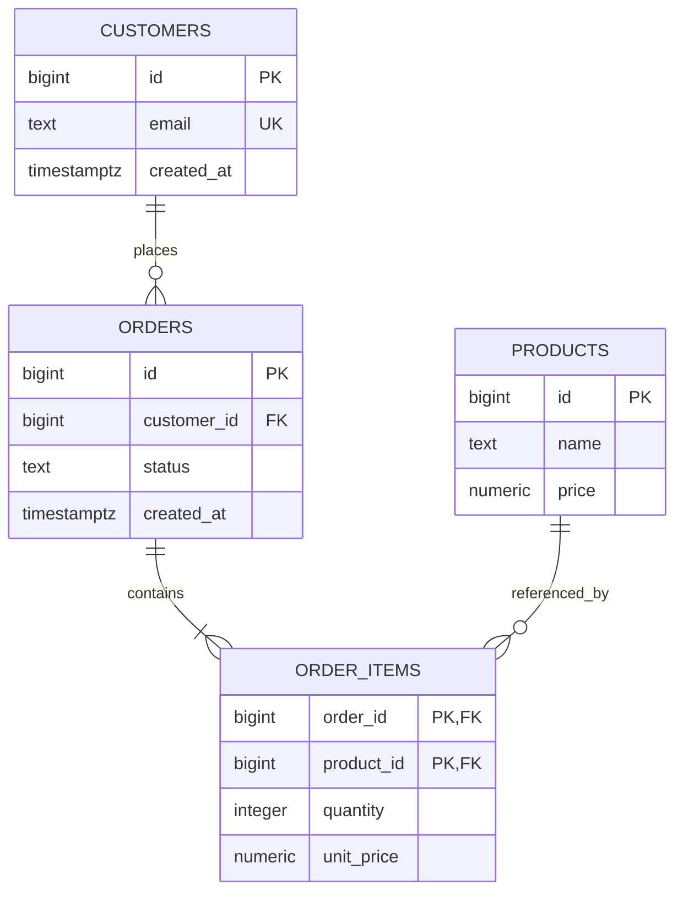

# README

## Overview

This section covers the relational database fundamentals required to design reliable SQL schemas for production backend systems.

The focus is not merely on creating tables. The goal is to understand how relational modeling, keys, relationships, constraints, integrity rules, and schema design decisions affect application correctness, query performance, concurrency, scalability, and long-term maintainability.

The documents progress from core relational concepts to practical database design rules:

## Navigation

- [01- Tables Rows and Columns](./01-%20Tables%20Rows%20and%20Columns.md)
- [02- Primary Keys](./02-%20Primary%20Keys.md)
- [03- Foreign Keys](./03-%20Foreign%20Keys.md)
- [04- Relationships](./04-%20Relationships.md)
- [05- One-to-One Relationships](./05-%20One-to-One%20Relationships.md)
- [06- One-to-Many Relationships](./06-%20One-to-Many%20Relationships.md)
- [07- Many-to-Many Relationships](./07-%20Many-to-Many%20Relationships.md)
- [08- NULL and Missing Data](./08-%20NULL%20and%20Missing%20Data.md)
- [09- Constraints](./09-%20Constraints.md)
- [10- Data Integrity](./10-%20Data%20Integrity.md)
- [11- Referential Integrity](./11-%20Referential%20Integrity.md)
- [12- Database Design Rules](./12-%20Database%20Design%20Rules.md)

---

## Relational Database Fundamentals

A relational database represents data using relations, commonly exposed as tables containing rows and columns.

A production schema typically combines:

```text
Tables
  ↓
Primary Keys
  ↓
Relationships
  ↓
Foreign Keys
  ↓
Constraints
  ↓
Indexes
  ↓
Transactions
  ↓
Data Integrity
```

These mechanisms work together rather than independently.

For example, an order system may contain:



The relational model gives the database enough structure to enforce important business invariants independently of the application code.

---

## How to Study This Section

The recommended progression is:

```text
Tables
  ↓
Primary Keys
  ↓
Foreign Keys
  ↓
Relationships
  ↓
Cardinality
  ↓
NULL
  ↓
Constraints
  ↓
Data Integrity
  ↓
Referential Integrity
  ↓
Database Design Rules
```

Each topic builds on the previous one.

For example:

- Primary keys establish identity.
- Foreign keys connect identities across tables.
- Relationships define how entities interact.
- Cardinality describes how many entities participate in those relationships.
- Constraints enforce valid states.
- Data integrity combines these mechanisms into reliable database behavior.
- Design rules apply the concepts to production systems.

---

## Core Concepts

### Tables

Tables represent structured sets of related records.

A well-designed table should have a clear responsibility and represent a meaningful domain concept.

Typical backend tables include:

```text
users
organizations
orders
order_items
products
payments
shipments
```

The important design question is not simply:

> "What columns should this table contain?"

Instead ask:

> "What business concept does this table represent, and what facts does it own?"

---

### Primary Keys

A primary key uniquely identifies a row.

Example:

```sql
CREATE TABLE customers (
    id BIGINT GENERATED ALWAYS AS IDENTITY PRIMARY KEY,
    email TEXT NOT NULL
);
```

A good primary key is generally:

- Unique
- Non-null
- Stable
- Immutable
- Efficient to reference

Business attributes such as email addresses may also need a `UNIQUE` constraint, but they do not necessarily need to be the table's primary key.

---

### Foreign Keys

A foreign key connects a row to a row in another table.

```sql
CREATE TABLE orders (
    id BIGINT GENERATED ALWAYS AS IDENTITY PRIMARY KEY,
    customer_id BIGINT NOT NULL REFERENCES customers(id)
);
```

This ensures that an order cannot reference a nonexistent customer.

Foreign keys are particularly important when multiple components can write to the database:

```text
Django
FastAPI
Celery workers
Admin tools
Management commands
Data pipelines
```

Application validation alone cannot reliably enforce referential integrity under concurrent access.

---

### Relationships

Relationships describe how entities are associated.

Common relational cardinalities include:

| Relationship | Example |
|---|---|
| One-to-one | User → User Profile |
| One-to-many | Customer → Orders |
| Many-to-many | Students ↔ Courses |

Understanding cardinality determines where foreign keys and junction tables should be placed.

---

## Relationship Modeling

### One-to-One

A one-to-one relationship means each row in one table corresponds to at most one row in another.

Example:

```text
users
  │
  └── user_profiles
```

The foreign key should normally also be unique:

```sql
CREATE TABLE user_profiles (
    id BIGINT GENERATED ALWAYS AS IDENTITY PRIMARY KEY,
    user_id BIGINT NOT NULL UNIQUE REFERENCES users(id),
    display_name TEXT
);
```

Without `UNIQUE`, the schema actually represents one-to-many rather than one-to-one.

---

### One-to-Many

One-to-many relationships place the foreign key on the many-side.

```text
Customer
   │
   ├── Order
   ├── Order
   └── Order
```

```sql
CREATE TABLE orders (
    id BIGINT GENERATED ALWAYS AS IDENTITY PRIMARY KEY,
    customer_id BIGINT NOT NULL REFERENCES customers(id)
);
```

A single customer can now reference many orders while each order references one customer.

This is one of the most common patterns in backend systems.

---

### Many-to-Many

Many-to-many relationships require an intermediate table.

```text
students
    │
    └──< student_courses >── courses
```

Example:

```sql
CREATE TABLE student_courses (
    student_id BIGINT NOT NULL REFERENCES students(id),
    course_id BIGINT NOT NULL REFERENCES courses(id),

    PRIMARY KEY (student_id, course_id)
);
```

If the relationship itself has attributes, store them on the junction table:

```sql
CREATE TABLE student_courses (
    student_id BIGINT NOT NULL REFERENCES students(id),
    course_id BIGINT NOT NULL REFERENCES courses(id),
    enrolled_at TIMESTAMPTZ NOT NULL DEFAULT CURRENT_TIMESTAMP,
    status TEXT NOT NULL,

    PRIMARY KEY (student_id, course_id)
);
```

The relationship is now a first-class domain concept.

---

## NULL and Missing Data

`NULL` represents missing, unknown, or inapplicable information depending on the domain.

It is not equivalent to:

```text
0
''
FALSE
```

SQL's three-valued logic means comparisons involving `NULL` behave differently from ordinary values.

Use:

```sql
WHERE deleted_at IS NULL
```

rather than:

```sql
WHERE deleted_at = NULL
```

When designing a column, explicitly determine what absence means.

If a value is required for a valid record, prefer:

```sql
column_name TEXT NOT NULL
```

rather than allowing arbitrary `NULL` values.

---

## Constraints

Constraints allow the database to enforce invariants.

Common constraints include:

| Constraint | Purpose |
|---|---|
| `PRIMARY KEY` | Unique row identity |
| `FOREIGN KEY` | Referential integrity |
| `UNIQUE` | Prevent duplicate values |
| `NOT NULL` | Require a value |
| `CHECK` | Enforce a predicate |
| `DEFAULT` | Provide a default value |

Example:

```sql
CREATE TABLE products (
    id BIGINT GENERATED ALWAYS AS IDENTITY PRIMARY KEY,
    name TEXT NOT NULL,
    price NUMERIC(12, 2) NOT NULL,
    stock_quantity INTEGER NOT NULL DEFAULT 0,

    CONSTRAINT products_price_nonnegative
        CHECK (price >= 0),

    CONSTRAINT products_stock_nonnegative
        CHECK (stock_quantity >= 0)
);
```

Database constraints should protect critical invariants even when application-level validation already exists.

---

## Data Integrity

Data integrity means that stored data remains valid, consistent, and trustworthy.

There are several dimensions:

```text
Entity Integrity
      ↓
Primary keys identify records

Referential Integrity
      ↓
Foreign keys reference valid records

Domain Integrity
      ↓
Values satisfy type and business constraints

Application Integrity
      ↓
Business workflows preserve valid state
```

A robust backend uses multiple layers of protection rather than assuming one layer is sufficient.

---

## Referential Integrity

Referential integrity ensures relationships between tables remain valid.

Consider:

```text
customers
    │
    └── orders
```

An order referencing customer `42` should not remain if customer `42` does not exist, unless the domain explicitly permits that state.

Foreign keys enforce this relationship at the database boundary.

Deletion behavior should be deliberate:

```sql
FOREIGN KEY (customer_id)
REFERENCES customers(id)
ON DELETE RESTRICT
```

or:

```sql
FOREIGN KEY (order_id)
REFERENCES orders(id)
ON DELETE CASCADE
```

`CASCADE` is appropriate when child records have no independent meaning, but dangerous when deletion can affect large amounts of important data.

---

## Database Design Rules

The final topic brings the preceding concepts together.

Important rules include:

### Give Every Table a Clear Responsibility

Avoid tables that combine unrelated concepts.

Prefer:

```text
customers
orders
payments
shipments
```

over a single table containing every attribute for the entire workflow.

---

### Use Stable Identity

Prefer stable primary keys.

A common production pattern is:

```text
Primary key → surrogate identity
Business identifier → UNIQUE constraint
```

Example:

```sql
CREATE TABLE users (
    id BIGINT GENERATED ALWAYS AS IDENTITY PRIMARY KEY,
    email TEXT NOT NULL UNIQUE
);
```

---

### Use Appropriate Data Types

Choose types based on domain semantics.

| Requirement | Typical PostgreSQL type |
|---|---|
| Identifier | `BIGINT` / UUID |
| Exact monetary value | `NUMERIC` |
| Boolean state | `BOOLEAN` |
| Calendar date | `DATE` |
| Point in time | `TIMESTAMPTZ` |
| Structured flexible data | `JSONB` when justified |

Avoid using generic strings for data whose semantics can be represented more precisely.

---

### Normalize by Default

Normalization should generally be the starting point for transactional systems.

The goal is to avoid storing the same business fact in multiple authoritative locations.

However, intentional duplication can be valid when values represent different facts.

For example:

```text
products.price
    ↓
Current product price

order_items.unit_price
    ↓
Historical price charged
```

These are not the same business fact.

---

### Enforce Invariants at the Database Layer

If the rule must always be true, consider whether the database should enforce it.

Examples:

```text
Email must be unique
Quantity must be positive
Order must reference an existing customer
Price cannot be negative
Only one active subscription can exist per user
```

Application validation improves user experience.

Database constraints protect correctness.

---

### Design Indexes Around Queries

Indexes should follow actual access patterns.

For:

```sql
SELECT id, created_at
FROM orders
WHERE customer_id = 42
ORDER BY created_at DESC
LIMIT 50;
```

a suitable index may be:

```sql
CREATE INDEX idx_orders_customer_created
ON orders(customer_id, created_at DESC);
```

Do not index every column. Indexes improve some reads while increasing storage and write costs.

Critical queries should be evaluated using:

```sql
EXPLAIN ANALYZE
```

---

### Design for Concurrency

Application-level checks can race.

For example:

```text
Request A → check whether email exists
Request B → check whether email exists
Request A → insert
Request B → insert
```

A database-level unique constraint closes this race:

```sql
ALTER TABLE users
ADD CONSTRAINT users_email_unique UNIQUE (email);
```

Concurrency correctness often requires a combination of:

```text
Constraints
+
Transactions
+
Locks
+
Isolation
+
Idempotency
```

---

### Keep Transactions Focused

Transactions should contain the smallest set of operations that must be atomic.

Avoid:

```text
BEGIN
  ↓
Database update
  ↓
External HTTP request
  ↓
Long processing
  ↓
COMMIT
```

Long-running transactions increase lock contention and resource consumption.

External operations should normally be coordinated through patterns such as:

- Outbox pattern
- Idempotent consumers
- Retry-safe workflows
- Background processing

when the domain requires distributed coordination.

---

### Design for Schema Evolution

Production deployments frequently run multiple application versions simultaneously.

A safe migration pattern is:

```text
Expand
  ↓
Deploy compatible code
  ↓
Backfill
  ↓
Validate
  ↓
Switch reads/writes
  ↓
Contract
```

For example, adding a new required column may need to happen in stages rather than introducing an immediately breaking schema change.

This is especially important for rolling deployments through Kubernetes, ECS, or other orchestrators.

---

## SQL and Backend Applications

Relational database design directly affects ORM usage.

For Django:

```python
orders = (
    Order.objects
    .select_related("customer")
    .filter(status="paid")
)
```

For collection relationships:

```python
orders = (
    Order.objects
    .prefetch_related("items")
    .filter(status="paid")
)
```

The ORM is an abstraction over SQL, not a replacement for understanding SQL.

Backend engineers should be able to reason about:

```text
Python/Django/FastAPI
        ↓
ORM / SQL driver
        ↓
SQL query
        ↓
Database planner
        ↓
Indexes / tables
        ↓
Rows
```

This becomes especially important when diagnosing:

- N+1 queries
- Slow joins
- Missing indexes
- Lock contention
- Large scans
- Excessive result sets
- Connection exhaustion

---

## Production Design Checklist

Before approving a relational schema, review:

### Modeling

- Does every table represent a clear domain concept?
- Are relationships explicit?
- Is cardinality correct?
- Are historical facts modeled separately from current state?

### Identity

- Does every important entity have a stable primary key?
- Are business identifiers protected with appropriate uniqueness constraints?

### Integrity

- Are required columns `NOT NULL`?
- Are foreign keys defined?
- Are important business rules represented by constraints?
- Are delete behaviors intentional?

### Performance

- What are the most frequent queries?
- Which indexes support them?
- Are composite index column orders appropriate?
- Have critical queries been tested with realistic data?

### Concurrency

- Which operations can race?
- Which constraints prevent duplicate or invalid states?
- Where are transaction boundaries?
- Is idempotency required?

### Scalability

- What happens when the largest table becomes 10× larger?
- Does pagination remain efficient?
- Will indexes remain manageable?
- Are connection pools appropriately sized?

### Operations

- Can migrations run during rolling deployments?
- Can large backfills be restarted safely?
- Are backups and point-in-time recovery configured?
- Has database restoration been tested?
- Are monitoring and alerting sufficient?

### Security

- Are SQL queries parameterized?
- Are database credentials protected?
- Are database roles least-privileged?
- Is authorization handled separately from referential integrity?

---

## Common Mistakes

| Mistake | Problem |
|---|---|
| Treating `NULL` as an ordinary value | SQL uses three-valued logic |
| Storing relationships as comma-separated IDs | Prevents proper relational integrity and indexing |
| Relying exclusively on application validation | Concurrent writers can bypass application assumptions |
| Using floating point for exact monetary values | Can introduce precision errors |
| Indexing every column | Increases storage and write overhead |
| Ignoring generated SQL from an ORM | Can hide expensive queries and N+1 patterns |
| Over-normalizing without measuring workload | Can unnecessarily complicate read paths |
| Premature denormalization | Creates consistency obligations |
| Using `ON DELETE CASCADE` indiscriminately | Can cause unexpectedly large deletes |
| Keeping transactions open during network calls | Increases lock contention and resource usage |
| Treating read replicas as strongly consistent | Replication lag can produce stale reads |
| Designing only for current data volume | Large-scale behavior can differ substantially |
| Treating migrations as isolated schema changes | Rolling deployments require application/schema compatibility |

---

## Recommended Mental Model

When designing a relational database, reason through the following chain:

```text
Business Requirement
        ↓
Domain Entity
        ↓
Relationship
        ↓
Cardinality
        ↓
Primary Key
        ↓
Foreign Key
        ↓
Constraints
        ↓
Indexes
        ↓
Transactions
        ↓
Concurrency
        ↓
Query Workload
        ↓
Scale
        ↓
Operations
```

The schema is not isolated from the backend architecture.

A database decision can affect:

```text
API design
ORM behavior
Caching
Background workers
Transaction boundaries
Event processing
Deployment strategy
Infrastructure cost
Disaster recovery
```

Senior database design therefore means understanding not only **what the schema looks like**, but also **how the application will use, mutate, migrate, and operate it under production load**.

---

## Key Takeaways

- **Relational database fundamentals form a connected system:** tables provide structure, keys provide identity, relationships connect entities, and constraints protect valid state.
- **Model relationships explicitly and enforce critical invariants in the database**, rather than relying exclusively on application-level validation.
- **Design schemas around domain semantics and real query patterns**, using normalization and appropriate indexes as the default starting point.
- **Production database design must account for concurrency, transactions, migrations, scalability, security, backups, and operational behavior.**
- **The goal of database design is not theoretical elegance; it is a schema that remains correct, performant, maintainable, and operable as the backend evolves.**