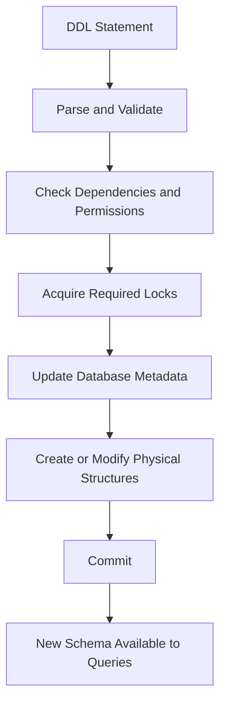
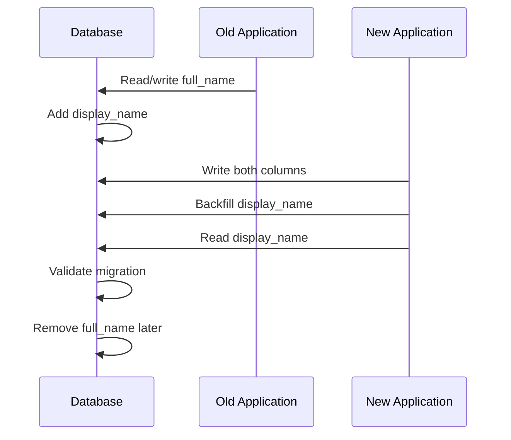

# 01- DDL

## Overview

**Data Definition Language (DDL)** is the SQL command category used to define and modify database structures.

DDL operates primarily on database objects such as:

- Databases
- Schemas
- Tables
- Columns
- Constraints
- Indexes
- Views
- Sequences
- Materialized views
- Functions and other database-specific objects

In backend systems, DDL is the mechanism behind schema creation and evolution. Django migrations, Alembic migrations, Flyway, Liquibase, and similar migration systems ultimately translate application-level schema changes into database DDL.

A useful mental model is:

```text
Application Code
      ↓
Migration Definition
      ↓
Migration Tool
      ↓
DDL Statements
      ↓
Database Catalog / Metadata
      ↓
Physical Storage Structures
```

DDL is therefore not just about writing `CREATE TABLE`. Production database engineering requires understanding how structural changes affect locks, indexes, storage, availability, replication, migrations, and running application versions.

---

## DDL Command Categories

The exact command set varies between database engines, but the core DDL operations are broadly:

| Command | Purpose |
|---|---|
| `CREATE` | Create a database object |
| `ALTER` | Modify an existing object |
| `DROP` | Remove an object |
| `TRUNCATE` | Remove all rows from a table |
| `RENAME` | Change an object's name; often implemented through `ALTER` |
| `COMMENT` | Add metadata/documentation; syntax varies by database |

The distinction between DDL, DML, DQL, and transaction control is useful:

| Category | Typical Commands | Primary Responsibility |
|---|---|---|
| DDL | `CREATE`, `ALTER`, `DROP`, `TRUNCATE` | Database structure |
| DML | `INSERT`, `UPDATE`, `DELETE` | Data modification |
| DQL | `SELECT` | Data retrieval |
| DCL | `GRANT`, `REVOKE` | Permissions |
| TCL | `COMMIT`, `ROLLBACK`, `SAVEPOINT` | Transaction control |

The categories are conceptual rather than perfectly standardized across every SQL implementation.

---

## CREATE

`CREATE` creates a database object.

### Creating a Table

A production-oriented table definition should establish appropriate data types, identity, nullability, and integrity constraints.

```sql
CREATE TABLE customers (
    id BIGINT GENERATED ALWAYS AS IDENTITY PRIMARY KEY,
    email TEXT NOT NULL,
    display_name TEXT NOT NULL,
    created_at TIMESTAMPTZ NOT NULL DEFAULT CURRENT_TIMESTAMP,

    CONSTRAINT customers_email_unique
        UNIQUE (email)
);
```

This definition establishes:

- A stable primary key.
- Database-generated identifiers.
- Required fields.
- A timestamp generated by the database.
- Uniqueness for email addresses.

### Creating an Index

Indexes are also database objects.

```sql
CREATE INDEX idx_customers_created_at
ON customers (created_at);
```

Create indexes to support known query patterns rather than indexing every column.

For example:

```sql
SELECT id, email
FROM customers
WHERE created_at >= CURRENT_TIMESTAMP - INTERVAL '7 days'
ORDER BY created_at DESC;
```

The usefulness of an index depends on the query workload, data distribution, selectivity, and database optimizer.

### Creating a Schema

Schemas provide logical namespaces inside a database.

```sql
CREATE SCHEMA billing;
```

A table can then be created inside that schema:

```sql
CREATE TABLE billing.invoices (
    id BIGINT GENERATED ALWAYS AS IDENTITY PRIMARY KEY,
    customer_id BIGINT NOT NULL,
    total_amount NUMERIC(12, 2) NOT NULL
);
```

Schemas can help separate domains, permissions, or database objects, although application architecture should determine whether this complexity is justified.

---

## ALTER

`ALTER` changes the definition of an existing database object.

Typical operations include:

- Adding a column.
- Removing a column.
- Changing a column definition.
- Adding a constraint.
- Removing a constraint.
- Renaming a column.
- Renaming a table.
- Changing database-object properties.

### Add a Column

```sql
ALTER TABLE customers
ADD COLUMN phone_number TEXT;
```

Adding a nullable column is often relatively straightforward, but production impact depends on the database engine, version, default expression, table size, and exact operation.

### Add a Constraint

```sql
ALTER TABLE customers
ADD CONSTRAINT customers_phone_unique
UNIQUE (phone_number);
```

Constraints may require validation against existing rows and can therefore have significant operational consequences on large tables.

### Rename a Column

```sql
ALTER TABLE customers
RENAME COLUMN display_name TO full_name;
```

The database operation may be fast, but the application impact can be large.

A rolling deployment may temporarily contain:

```text
Old application → display_name
New application → full_name
```

A direct rename can therefore break running application instances.

For zero-downtime deployments, schema changes often need to follow an expand-and-contract strategy.

---

## DROP

`DROP` removes a database object.

```sql
DROP TABLE customers;
```

This removes the table definition and its associated data.

`DROP` should be treated as a destructive operation.

### Dependency Considerations

Objects may depend on other objects.

For example:

```text
customers
    ↑
    │
orders.customer_id
```

Dropping `customers` may fail because `orders` depends on it, depending on the database and constraints.

Some systems support:

```sql
DROP TABLE customers CASCADE;
```

`CASCADE` can remove dependent objects automatically.

This is powerful but dangerous in production.

Prefer explicitly understanding dependencies before destructive schema changes.

---

## TRUNCATE

`TRUNCATE` removes all rows from a table while retaining the table structure.

```sql
TRUNCATE TABLE customers;
```

Compare it with:

```sql
DELETE FROM customers;
```

The operations have different semantics and performance characteristics.

| Property | `DELETE` | `TRUNCATE` |
|---|---|---|
| Removes rows | Yes | Yes |
| Can use `WHERE` | Yes | No |
| Retains table structure | Yes | Yes |
| Typically optimized for removing all rows | No | Yes |
| Row-level deletion semantics | Yes | Database-dependent |
| Suitable for selective deletion | Yes | No |
| Production risk | High | Very high |

`TRUNCATE` should not be treated as a faster version of ordinary deletion without considering transaction behavior, locks, foreign-key dependencies, triggers, identity sequences, replication, and database-specific semantics.

For PostgreSQL, for example:

```sql
TRUNCATE TABLE customers RESTART IDENTITY;
```

can additionally reset identity sequences associated with the table.

---

## DDL and Transactions

Transaction behavior for DDL differs across database engines.

Some databases support transactional DDL extensively, while others implicitly commit certain DDL statements or have more restrictive behavior.

PostgreSQL generally provides strong transactional DDL support, which allows operations such as:

```sql
BEGIN;

ALTER TABLE customers
ADD COLUMN phone_number TEXT;

ROLLBACK;
```

to roll back together.

However, transactional support does not mean every migration is operationally safe.

A statement can be transactionally correct while still causing:

- Long-running locks
- Blocking queries
- Large table rewrites
- Increased WAL generation
- Replication lag
- Excessive disk usage
- Application downtime

**Transactionality and operational safety are separate concerns.**

---

## DDL and Database Metadata

DDL changes more than visible table structure.

A relational database maintains metadata describing objects such as:

```text
Tables
Columns
Constraints
Indexes
Types
Permissions
Dependencies
Statistics
```

For example:

```sql
CREATE INDEX idx_orders_customer_id
ON orders(customer_id);
```

causes the database to register the index as a database object and build the underlying index structure.

The optimizer can subsequently consider that index when planning queries.

A simplified lifecycle is:



The exact implementation varies by database engine and statement.

---

## DDL and Constraints

DDL is closely connected to data integrity because constraints are part of the schema.

Example:

```sql
CREATE TABLE orders (
    id BIGINT GENERATED ALWAYS AS IDENTITY PRIMARY KEY,
    customer_id BIGINT NOT NULL,
    amount NUMERIC(12, 2) NOT NULL,

    CONSTRAINT orders_amount_positive
        CHECK (amount > 0),

    CONSTRAINT orders_customer_fk
        FOREIGN KEY (customer_id)
        REFERENCES customers(id)
);
```

The schema now protects several invariants:

```text
id
 ↓
Unique identity

customer_id
 ↓
Must reference an existing customer

amount
 ↓
Must be greater than zero
```

This is preferable to relying exclusively on Python, Django, or FastAPI validation because other database clients may also write to the database.

---

## DDL and Indexes

Indexes are structural objects, so index creation is a DDL operation.

Consider:

```sql
CREATE INDEX idx_orders_customer_created
ON orders(customer_id, created_at DESC);
```

for:

```sql
SELECT id, status, created_at
FROM orders
WHERE customer_id = $1
ORDER BY created_at DESC
LIMIT 50;
```

The index is designed around the actual access pattern.

### Production Considerations

Large indexes can:

- Consume substantial disk space.
- Increase write overhead.
- Increase WAL generation.
- Affect replication.
- Take significant time to build.
- Compete for I/O with application traffic.

PostgreSQL supports concurrent index creation:

```sql
CREATE INDEX CONCURRENTLY idx_orders_customer_created
ON orders(customer_id, created_at DESC);
```

This can reduce blocking of normal table operations, but it has different transaction and operational characteristics from ordinary index creation.

Do not blindly add `CONCURRENTLY` to every index migration. Understand the database engine and migration framework behavior first.

---

## DDL and Schema Migrations

Production applications should generally not depend on engineers manually executing arbitrary DDL against production databases.

Instead, schema changes should be version-controlled.

A typical workflow is:

```text
Developer changes model/schema
          ↓
Migration generated or written
          ↓
Migration reviewed
          ↓
CI validates migration
          ↓
Migration deployed
          ↓
Production database changes
          ↓
Application uses new schema
```

For Django:

```bash
python manage.py makemigrations
python manage.py sqlmigrate app_name 0005
python manage.py migrate
```

`sqlmigrate` is particularly useful for reviewing the SQL Django plans to execute.

For SQLAlchemy/Alembic:

```bash
alembic revision --autogenerate -m "add customer phone number"
alembic upgrade head
```

The generated migration should still be reviewed manually.

**Autogenerated migrations are a starting point, not a substitute for database engineering review.**

---

## Expand-and-Contract Migrations

Schema changes become more complicated when applications are deployed incrementally.

Suppose:

```text
old column: full_name
new column: display_name
```

A safer migration can be:



The general pattern is:

### Expand

Add new structures without breaking existing application versions.

### Migrate

Backfill or synchronize existing data.

### Switch

Deploy application code that uses the new structure.

### Contract

Remove obsolete structures only after they are no longer required.

This pattern is particularly important with:

- Kubernetes rolling deployments.
- Amazon ECS rolling deployments.
- Blue/green deployments.
- Multiple API versions.
- Background workers.
- Celery workers.
- Long-running processes.

---

## Large Table Migrations

DDL operations that are trivial on a development database can become expensive on production tables containing hundreds of millions of rows.

Before executing a migration, evaluate:

```text
Table size
+
Row count
+
Existing indexes
+
Lock behavior
+
Replication
+
Query traffic
+
Disk capacity
+
Application compatibility
```

For a large table, prefer staged operations when possible.

For example, instead of immediately introducing a non-null requirement:

```sql
ALTER TABLE orders
ADD COLUMN processed_at TIMESTAMPTZ NOT NULL;
```

a safer process may be:

```text
1. Add nullable column
2. Deploy compatible application
3. Backfill existing rows in batches
4. Validate data
5. Add appropriate constraint
6. Deploy code relying on the invariant
```

The exact strategy depends on database-engine capabilities and workload.

---

## DDL Locking

Many DDL operations require locks.

A simplified production scenario:

```text
Long-running transaction
        │
        ├── holds lock
        │
        ↓
ALTER TABLE
        │
        ├── waits
        │
        ↓
Application queries
        │
        └── may become blocked
```

This can turn a seemingly harmless migration into an outage.

Before executing important DDL, investigate:

- Current long-running transactions.
- Lock queues.
- Active queries.
- Table size.
- Maintenance activity.
- Replication health.

For PostgreSQL, operational investigation may involve views such as:

```sql
SELECT
    pid,
    usename,
    state,
    query_start,
    wait_event_type,
    wait_event,
    query
FROM pg_stat_activity
WHERE state <> 'idle'
ORDER BY query_start;
```

The exact monitoring queries should be adapted to the database version and operational environment.

---

## DDL in High-Availability Systems

A production database may have:

```text
Application
    ↓
Primary Database
    ↓
Read Replicas
```

DDL can affect replication because schema changes and associated data/index operations may generate replication traffic.

Potential consequences include:

- Replica lag.
- Increased storage consumption.
- Delayed read availability.
- Longer recovery times.
- Increased I/O pressure.

Before a significant migration, evaluate:

```text
Primary capacity
Replica capacity
Replication lag
Disk headroom
Backup impact
Recovery requirements
```

A migration should be treated as a production deployment, not merely a code change.

---

## DDL and ORMs

ORMs abstract schema operations, but they do not eliminate the need to understand DDL.

For example, Django:

```python
class Customer(models.Model):
    email = models.EmailField(unique=True)
    created_at = models.DateTimeField(auto_now_add=True)
```

may result in DDL resembling:

```sql
CREATE TABLE customers (
    id bigint GENERATED BY DEFAULT AS IDENTITY PRIMARY KEY,
    email varchar(254) NOT NULL UNIQUE,
    created_at timestamp with time zone NOT NULL
);
```

The exact generated SQL depends on the Django version, database backend, configuration, and model definition.

Senior backend engineers should be able to inspect generated migrations and ask:

- What SQL will execute?
- What locks are required?
- Does the operation rewrite the table?
- Does it build an index?
- Can it run online?
- Is the application compatible during deployment?
- What happens if the migration fails halfway?
- What is the rollback strategy?

---

## DDL Security

DDL changes the structure and capabilities of a database, so access should be tightly controlled.

Production application users typically should not have unrestricted DDL permissions.

Prefer separate roles such as:

```text
Application role
    ↓
SELECT / INSERT / UPDATE / DELETE

Migration role
    ↓
Schema modification privileges

Administrative role
    ↓
Operational database administration
```

This follows least-privilege principles.

Avoid giving an application connection unrestricted permissions such as:

```text
CREATE
ALTER
DROP
GRANT
```

unless there is a specific operational requirement.

A compromised application credential should not automatically provide unrestricted control over the database schema.

---

## Common DDL Mistakes

| Mistake | Why It Is Dangerous | Better Approach |
|---|---|---|
| Running DDL manually in production | Changes become difficult to reproduce | Version-control migrations |
| Assuming `ALTER TABLE` is always fast | Some operations rewrite or scan large tables | Check engine-specific behavior |
| Ignoring locks | DDL can block production traffic | Evaluate lock behavior |
| Renaming columns directly | Old application instances may fail | Use expand-and-contract |
| Dropping columns immediately | Older code may still depend on them | Remove only after dependency is eliminated |
| Adding indexes without workload analysis | Extra write and storage overhead | Design indexes from query patterns |
| Using `CASCADE` casually | Can remove dependent objects | Inspect dependencies first |
| Treating ORM migrations as harmless | ORM can generate expensive SQL | Review generated SQL |
| Running huge backfills in one transaction | Large locks, WAL, and rollback cost | Use controlled batches |
| Testing migrations only on small databases | Production behavior may differ dramatically | Test against production-scale data |
| Ignoring replica lag | Migration can degrade read replicas | Monitor replication during changes |
| Giving applications DDL permissions | Expands blast radius of credential compromise | Separate runtime and migration roles |

---

## Production DDL Checklist

Before applying a significant DDL change:

### Schema

- Is the schema change necessary?
- Does it preserve the intended data model?
- Are constraints and indexes correct?
- Are dependencies understood?

### Application Compatibility

- Can old and new application versions coexist?
- Are background workers compatible?
- Are scheduled jobs compatible?
- Is the migration compatible with rolling deployment?

### Performance

- How large is the affected table?
- Will the operation scan or rewrite rows?
- How long could index creation take?
- What is the expected I/O and WAL impact?

### Locking

- What lock does the operation require?
- Can existing transactions block it?
- Can the migration block application traffic?
- Are lock timeouts configured appropriately?

### High Availability

- What happens to replicas?
- Could replication lag increase?
- Is sufficient disk capacity available?
- Does the operation affect backup or recovery performance?

### Rollback

- Can the migration be rolled back safely?
- If rollback is impossible, is there a forward-fix strategy?
- Can partially completed data changes be recovered?

### Deployment

- Is the migration version-controlled?
- Has generated SQL been reviewed?
- Has it been tested against realistic data volume?
- Is the migration observable during execution?

---

## Interview Traps

### DDL Is Not Always Immediately Safe

A candidate may say:

> "`ALTER TABLE` is metadata-only, so it is always fast."

This is incorrect.

The behavior depends on the specific operation and database engine. Some changes can require scans, table rewrites, index builds, or substantial locking.

---

### DDL Is Not the Same as DML

```sql
ALTER TABLE users ADD COLUMN timezone TEXT;
```

changes database structure.

```sql
UPDATE users
SET timezone = 'UTC';
```

changes stored data.

A migration may contain both DDL and DML, and their operational characteristics are different.

---

### Transactional DDL Does Not Mean Zero Downtime

A database may support transactional DDL while the statement still blocks queries or consumes significant resources.

These are separate properties:

```text
Transactional
≠
Online
≠
Fast
≠
Non-blocking
```

---

### `TRUNCATE` Is Not Just a Fast `DELETE`

`TRUNCATE` has different locking, logging, trigger, foreign-key, and identity semantics depending on the database engine.

The correct choice depends on the required behavior, not just execution speed.

---

## Key Takeaways

- **DDL defines and evolves database structure** through operations such as `CREATE`, `ALTER`, `DROP`, and `TRUNCATE`.
- **Production DDL must be evaluated for locks, table size, indexes, replication, storage, and application compatibility**, not merely whether the SQL is syntactically valid.
- **Version-controlled migrations are the standard mechanism for schema evolution**, with generated SQL reviewed rather than blindly trusted.
- **Expand-and-contract migrations allow schema changes to coexist safely with rolling application deployments and background workers.**
- **Transactional, fast, online, and non-blocking are different properties**; senior engineers evaluate the operational behavior of each DDL operation on the actual database engine and workload.